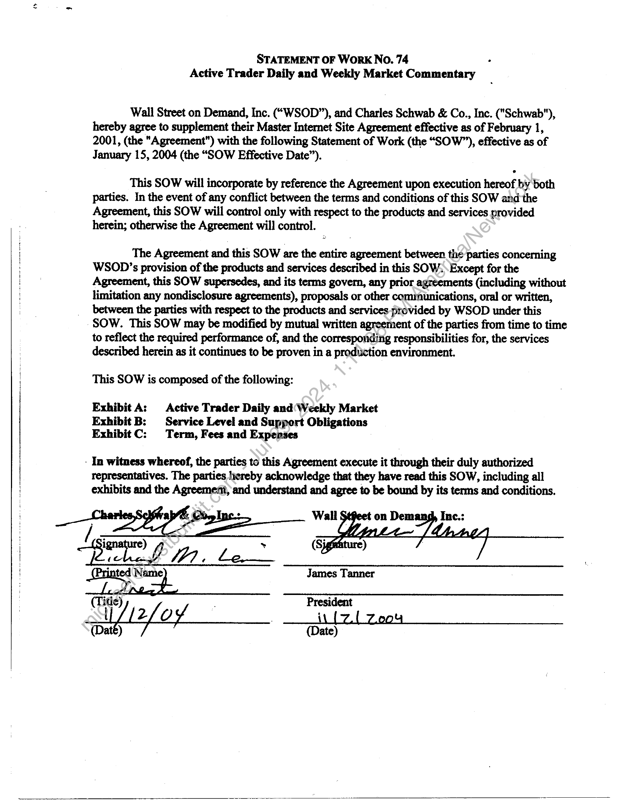
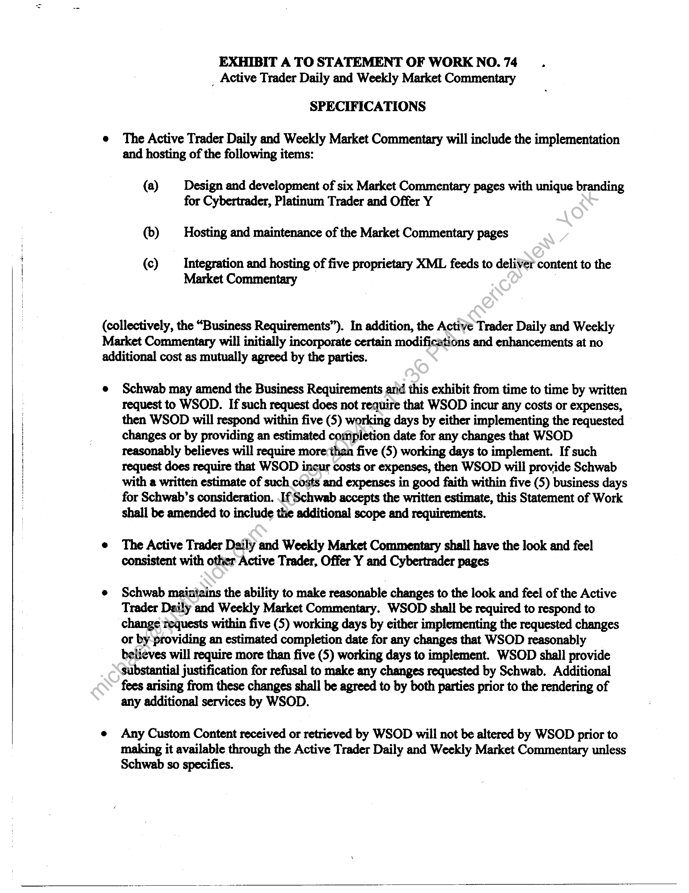
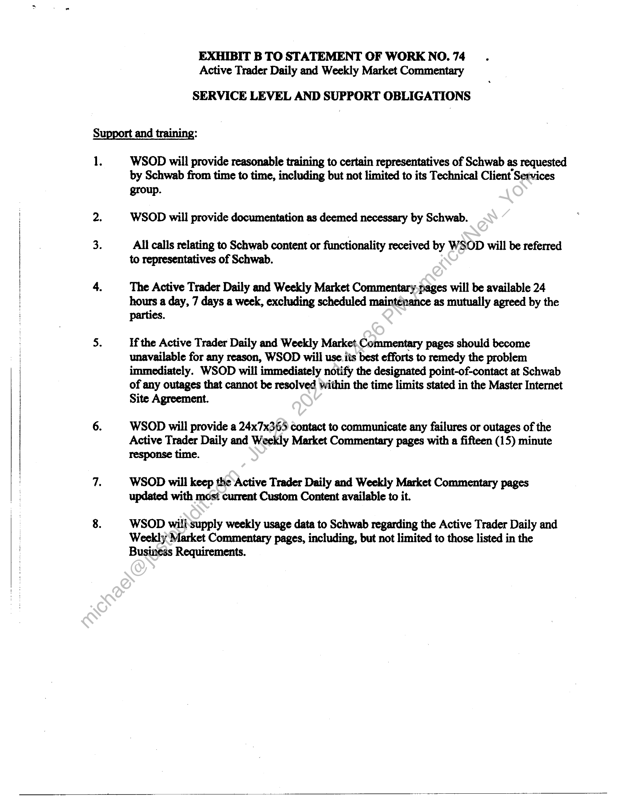
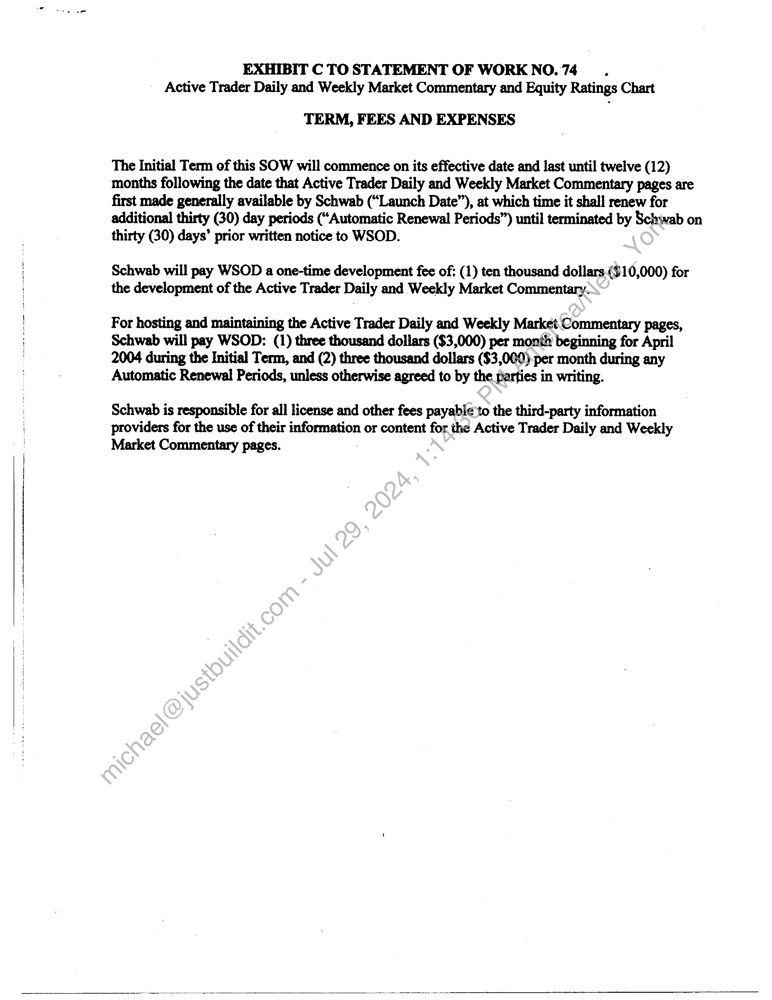

##### Statement of Work No. 74 - Active Trader Daily and Weekly Market Commentary]

  
````col
```col-md
flexGrow=.5
===
> [!info] [Page 1](_attachments/images_Schwab-3.6.1.18.4000147798.pdf_211318/page_1.png)
> 
```  
```col-md
STATEMENT OF WoRK No. 74 .
Active Trader Daily and Weekly Market Commentary  
Wall Street on Demand, Inc. (“WSOD”), and Charles Schwab & Co., Inc. ("Schwab"),
hereby agree to supplement their Master Internet Site Agreement effective as of February 1,
2001, (the "Agreement") with the following Statement of Work (the “SOW”), effective as of
January 15, 2004 (the “SOW Effective Date”).  
This SOW will incorporate by reference the Agreement upon execution hereof by both
parties. In the event of any conflict between the terms and conditions of this SOW and the
Agreement, this SOW will control only with respect to the products and services provided
herein; otherwise the Agreement will control.  
The Agreement and this SOW are the entire agreement between thé parties concerning
WSOD’s provision of the products and services described in this SOW. Except for the
Agreement, this SOW supersedes, and its terms govern, any prior agreements (including without
limitation any nondisclosure agreements), proposals or other cominunications, oral or written,
between the parties with respect to the products and services provided by WSOD under this  
SOW. This SOW may be modified by mutual written agreement of the parties from time to time  
to reflect the required performance of, and the corresponding responsibilities for, the services
described herein as it continues to be proven in a production environment.  
This SOW is composed of the following:
Exhibit A: Active Trader Daily and(Weekly Market  
Exhibit B: Service Level and Suppert Obligations
Exhibit C: Term, Fees and Expenses  
- In witness whereof, the parties to this Agreement execute it through their duly authorized
representatives. The parties hereby acknowledge that they have read this SOW, including all
exhibits and the Agreement, and understand and agree to be bound by its terms and conditions.  
```
````
Notes:    
````col
```col-md
flexGrow=.5
===
> [!info] [Page 2](_attachments/images_Schwab-3.6.1.18.4000147798.pdf_211318/page_2.png)
> 
```  
```col-md
EXHIBIT A TO STATEMENT OF WORK NO.74.
_ Active Trader Daily and Weekly Market Commentary  
SPECIFICATIONS  
e The Active Trader Daily and Weekly Market Commentary will include the implementation
and hosting of the following items:  
(a) Design and development of six Market Commentary pages with unique branding
for Cybertrader, Platinum Trader and Offer Y  
(>) Hosting and maintenance of the Market Commentary pages  
(c) _ Integration and hosting of five proprietary XML feeds to deliver content to the
Market Commentary  
(collectively, the “Business Requirements”). In addition, the Active Trader Daily and Weekly
Market Commentary will initially incorporate certain modifications and enhancements at no
additional cost as mutually agreed by the parties.  
e Schwab may amend the Business Requirements and this exhibit from time to time by written
request to WSOD. If such request does not require that WSOD incur any costs or expenses,
then WSOD will respond within five (5) working days by either implementing the requested
changes or by providing an estimated completion date for any changes that WSOD
reasonably believes will require more than five (5) working days to implement. If such
request does require that WSOD incur costs or expenses, then WSOD will provide Schwab
with a written estimate of such costs and expenses in good faith within five (5) business days
for Schwab’s consideration. If Schwab accepts the written estimate, this Statement of Work
shall be amended to include the additional scope and requirements.  
e The Active Trader Daily and Weekly Market Commentary shall have the look and feel
consistent with other Active Trader, Offer Y and Cybertrader pages  
¢ Schwab maintains the ability to make reasonable changes to the look and feel of the Active
Trader Daily and Weekly Market Commentary. WSOD shall be required to respond to
change requests within five (5) working days by either implementing the requested changes
or by providing an estimated completion date for any changes that WSOD reasonably
believes will require more than five (5S) working days to implement. WSOD shall provide
substantial justification for refusal to make any changes requested by Schwab. Additional
fees arising from these changes shall be agreed to by both parties prior to the rendering of
any additional services by WSOD.  
e Any Custom Content received or retrieved by WSOD will not be altered by WSOD prior to  
making it available through the Active Trader Daily and Weekly Market Commentary unless
Schwab so specifies.  
```
````
Notes:    
````col
```col-md
flexGrow=.5
===
> [!info] [Page 3](_attachments/images_Schwab-3.6.1.18.4000147798.pdf_211318/page_3.png)
> 
```  
```col-md
EXHIBIT B TO STATEMENT OF WORK NO. 74
Active Trader Daily and Weekly Market Commentary  
SERVICE LEVEL AND SUPPORT OBLIGATIONS  
1.  
WSOD will provide reasonable training to certain representatives of Schwab as requested
by Schwab from time to time, including but not limited to its Technical Client Services
group.  
WSOD will provide documentation as deemed necessary by Schwab.  
All calls relating to Schwab content or functionality received by WSOD will be referred
to representatives of Schwab.  
The Active Trader Daily and Weekly Market Commentary-pages will be available 24
hours a day, 7 days a week, excluding scheduled maintenance as mutually agreed by the
parties.  
If the Active Trader Daily and Weekly Market Commentary pages should become
unavailable for any reason, WSOD will use its best efforts to remedy the problem
immediately. WSOD will immediately notify the designated point-of-contact at Schwab
of any outages that cannot be resolved within the time limits stated in the Master Internet
Site Agreement.  
WSOD will provide a 24x7x365 contact to communicate any failures or outages of the
Active Trader Daily and Weekly Market Commentary pages with a fifteen (15) minute
response time.  
WSOD will keep the Active Trader Daily and Weekly Market Commentary pages
updated with most current Custom Content available to it.  
WSOD will'supply weekly usage data to Schwab regarding the Active Trader Daily and
Weekly Market Commentary pages, including, but not limited to those listed in the
Business Requirements.  
```
````
Notes:    
````col
```col-md
flexGrow=.5
===
> [!info] [Page 4](_attachments/images_Schwab-3.6.1.18.4000147798.pdf_211318/page_4.png)
> 
```  
```col-md
EXHIBIT C TO STATEMENT OF WORK NO. 74.
Active Trader Daily and Weekly Market Commentary and Equity Ratings Chart  
TERM, FEES AND EXPENSES  
The Initial Term of this SOW will commence on its effective date and last until twelve (12)
months following the date that Active Trader Daily and Weekly Market Commentary pages are
first made generally available by Schwab (“Launch Date”), at which time it shall renew for
additional thirty (30) day periods (“Automatic Renewal Periods”) until terminated by Schwab on
thirty (30) days’ prior written notice to WSOD.  
Schwab will pay WSOD a one-time development fee of: (1) ten thousand dollars.($10,000) for
the development of the Active Trader Daily and Weekly Market Commentary.  
For hosting and maintaining the Active Trader Daily and Weekly Market Commentary pages,
Schwab will pay WSOD: (1) three thousand dollars ($3,000) per month beginning for April
2004 during the Initial Term, and (2) three thousand dollars ($3,000). per month during any
Automatic Renewal Periods, unless otherwise agreed to by the parties in writing.  
Schwab is responsible for all license and other fees payable to the third-party information
providers for the use of their information or content for the Active Trader Daily and Weekly
Market Commentary pages.  
```
````
Notes:  


![[_attachments/Schwab-3.6.1.18.40 00147798.pdf]