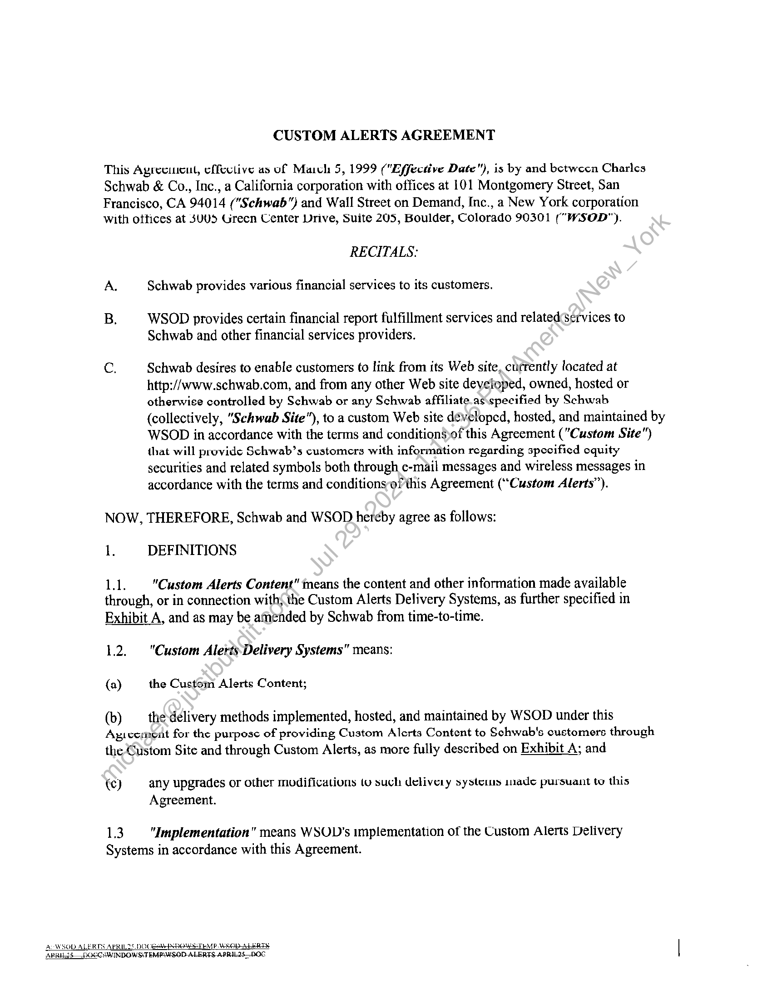

##### CUSTOM ALERTS AGREEMENT]

  
````col
```col-md
flexGrow=.5
===
> [!info] [Page 1](_attachments/images_Schwab-3.6.1.18.4100150084b.pdf_210738/page_1.png)
> 
```  
```col-md
CharlesSchwab  
THE SCHWAB BUILDING +» 101 MONTGOMERY STREET * SAN FRANCISCO, CA 94104 + (415) 627-7000  
May 15, 2000  
Mr. Jim Tanner  
President  
WallStreet on Demand  
3005 Center Green Drive Suite 205
Boulder CO 80301  
Dear Jim:  
Enclosed is a signed copy of our Alerts Agreement for your files. We Jook forward to continuing
our strong partnership with you and your team. It was a great first year and we look forward to a
terrific year this year.  
Thank you.  
Sincerely,
went) fo  
Wendy Parmett
Director  
Product Development & Marketing  
—_—  
a  
WPiic  
CHARLES SCHWAB & CO., INC., MEMBER SIPC, NEW YORK STOCK EXCHANGE AND OTHER PRINCIPAL STOCK AND OPTIONS EXCHANGES  
```
````
Notes:    
````col
```col-md
flexGrow=.5
===
> [!info] [Page 2](_attachments/images_Schwab-3.6.1.18.4100150084b.pdf_210738/page_2.png)
> 
```  
```col-md
CUSTOM ALERTS AGREEMENT  
This Agreciucul, effective as of Mach 5, 1999 ("“Ziffective Date"), is by and between Charles
Schwab & Co., Inc., a California corporation with offices at 101 Montgomery Street, San
Francisco, CA 94014 ("Schwab") and Wall Street on Demand, Inc., a New York corporation
with ottices at 3UU5 Green Center Drive, Suite 205, Boulder, Colorado 90301 ("WSOD").  
RECITALS:
A. Schwab provides various financial services to its customers.
B, WSOD provides certain financial report fulfillment services and related Services to  
Schwab and other financial services providers.  
c, Schwab desires to enable customers to link from its Web site, currently located at
http://www.schwab.com, and from any other Web site developed, owned, hosted or
otherwice controlled by Schwab or any Schwab affiliate.as\specified by Schwab
(collectively, "Schwab Site”), to a custom Web site developed, hosted, and maintained by
WSOD in accordance with the terms and conditionSsof this Agreement ("Custom Site")
that will provide Schwab’s customers with information regarding specified equity
securities and related symbols both through e-mail messages and wireless messages in
accordance with the terms and conditions-of this Agreement (“Custom Alerts’).  
NOW, THEREFORE, Schwab and WSOD hereby agree as follows:  
1. DEFINITIONS  
1.1. "Custom Alerts Content" means the content and other information made available
through, or in connection with{the Custom Alerts Delivery Systems, as further specified in
Exhibit A, and as may be amended by Schwab from time-to-time.  
1.2. "Custom Alerts Delivery Systems" means:  
(a) the Custom Alerts Content;  
(b)  the-délivery methods implemented, hosted, and maintained by WSOD under this
Apicomont for the purpose of providing Custom Alerts Content to Schwab's customers through  
the Custom Site and through Custom Alerts, as more fully described on Exhibit A; and  
{c) any upgrades or other modifications (vu such delivery systems inade pursuant to this
Agreement.  
13 "Implementation" means WSOD's implementation of the Custom Alerts Delivery
Systems in accordance with this Agreement.  
Ac WSOD ALERTS APRIL7S DUCES NDOWS:T EMP WSOD ALERTS
APRIL1S _DOCCSWINDOWS\TEMPLWSOD-ALERTS APRILIS—DOC  
```
````
Notes:    
````col
```col-md
flexGrow=.5
===
> [!info] [Page 3](_attachments/images_Schwab-3.6.1.18.4100150084b.pdf_210738/page_3.png)
> 
```  
```col-md
1A "Initial Torus" meane the period of time commencing on the Effective Date of this  
Agreement and ending two (2) years after the Effective Date.  
1.5. "Intellectual Property Rights" means intellectual property and/or proprictary rights,
including, without limitation, copyright (including rights in audiovisual works), moral rights,
patent rights (including patent applications and disclosures), rights of priority, publicity rights,
privacy rights, and trade secret rights recognized in any country or jurisdiction in the world.  
1.6 “Schwab Technology" means any and all of Schwab's: (i) look and feel and content,
including but not limited to third-party content, provided by Schwab for the Custom
Alerts Delivery Systems; and (ii) trademarks and trade names.  
1.7 “Trigger Event” for price, volume & earnings alerts means that WSOD has received a
new price quote from its data provider.  
1.8 “Standard Content” for price, volume and earnings alerts means\the last Schwab
approved message templates in HTML, Text and Pager formatwhich have been put into
production by WSOD.  
As of 3/31/00, for HTML & Text formats Standard Content includes:
Tiggering Event (c.g. Price Riscs Above X)
Price when Alert was set: $x
Last: $x
Change: x
Day High: $x
Day Low: $x
52 Wk. High: $x
52 Wk. Low: $x
Volume: xx
P/E Ratio: xx  
DJIASxx
S&P500: xx
NASDAQ: xx  
As of 3/31/00, for Pager format Standard Content includes:
Tiggering Event (e.g. Price Rises Above X)  
Price when Alert was set: $x  
2. IMPLEMENTATION, EXPENSES, AND PRODUCT DEVELOPMENT  
2.1. Implementation.  
(a) | WSOD will use commercially reasonable efforts to complete the Implementation in
accordance with the terms and conditions of this Agreement.  
ASWSOD ALERTS APRIL25. DOCEMINDOWSTEMPAW SOR ALERTS  
```
````
Notes:    
````col
```col-md
flexGrow=.5
===
> [!info] [Page 4](_attachments/images_Schwab-3.6.1.18.4100150084b.pdf_210738/page_4.png)
> 
```  
```col-md
(b) | WSOD agrees that, during the term of this Agreement within one (1) hour of notice from
Schwab, WSOD will use commercially reasonable efforts to correct (including, but not limited
to, remove from the Custom Alerts Delivery System if ucvessary) auy Tainted Custuiu Alerts
Content to Schwab's reasonable satisfaction, provided Schwab's notice to WSOD of Tainted
Custom Alerts Content includes reasonably detailed information regarding the Tainted Custom
Alerts Content. For purposes of this Section 2.1(b), “Tainted Custom Alerts Content’ means
any data, file communication, software or other information contained within any Custom Alerts
Content with respect to which Schwab has received an allegation, or has reason to believe, that
such content: (i) is incorrect or inaccurate; (ii) infringes an Intellectual Property Right; (iii)
libels or defames or invades privacy of any person; or (iv) breaches or violates applicable law.
Schwab shall have the right, but not the obligation, to object to Tainted Custom Alerts Content as
provided hereunder. Schwab’s failure to object to any Tainted Custom Alerts Content will have
no effect on WSOD’s obligations under Section 10 (Indemnification).  
2.2. Expenses. WSOD will be solely responsible for all of its own costs and expenses in
connection with the Implementation and its performance under this Agreement, except as
specified in Section 2.3.  
2.3. Product Development. Beginning on January 1, 2000, and for the remainder of the Initial
Term, WSOD will provide Schwab with a dedivatcd tea of six WSOD employees for the
development of new email products on a full-time basis. ‘The team will include at least 1
dedicated Project Manager, 1 dedicated quality assurance staff member and 1 dedicated
programmer. The fees for this development staff will be included in the monthly message fees in
accordance with Exhibit B. Upon demand, WSOD will notify Schwab in writing of the names of
each WSOD employee working on Alerts product development at any given time. Furthermore,
in setting up and maintaining the dedicated team for Schwab, WSOD will take adequate
measures to ensure appropriate continuity and knowledge base of staff working on e-mail
products, particularly in the area of project management. Schwab must be comfortable with the
continuity before staff members.are removed from the team. The new email products to be
developed by the WSOD development team will be solely determined by Schwab. The
dedicated development resaurces may be terminated at any time upon the agreement of both
parties and the monthly-fees reduced commensurately. Upon agreement of both parties, Schwab
may at any time apply the portion of the monthly fees designated for development resources
($25,000/month)toward any of the development services that it receives from WSOD under this
Agreement orunder any other agreement between the parties.  
2.4. Quality Cuutrul. WSOD shall institute quality controls, including suitable testing
procedures if any, to ensure the availability of the Custom Alerts Delivery Systems and to ensure
thatthe Custom Alerts Delivery Systems perform in accordance with the applicable
specifications and in a manner consistent with the highest applicable industry standards. Such
procedures will include surveillance of data quality against deteriorations or degradations in data
accuracy. Upon Schwab’s reasonable request from time to time, Schwab will have the right to
review and audit WSOD’s quality controls in order to verify and/or improve the quality of the
Custom Alerts Delivery System and the Custom Alerts Delivery System’s performance.  
AZWSOD ALERTS APRIL25. DOCG NDOWE-FEMP AY SOD ALERTS:
‘APRHAS —DOCC-WINDOWS\FEMPAWSOB ALERTS APRIL --DOG  
```
````
Notes:    
````col
```col-md
flexGrow=.5
===
> [!info] [Page 5](_attachments/images_Schwab-3.6.1.18.4100150084b.pdf_210738/page_5.png)
> 
```  
```col-md
3. OWNERSHIP, TRADEMARKS, AND INDEPENDENT DEVELOPMENT  
3. 1. Ownership.  
(a) | The Schwab Technology, the templates and formats used for the display of the Custom
Alerts Content under this Agreement, and all Intellectual Property Rights therein are and will
remain the sole and exclusive property of Schwab and its third-party suppliers.  
(b) | The Custom Alerts Content and all Intellectual Property Rights therein are and will
remain the sole and exclusive property of WSOD and its third-party suppliers.  
3.2. Trademarks. WSOD hereby grants to Schwab a non-exclusive, non-transferable, worldwide,
royalty-free, fully paid license to use and display:  
(a) WSOM's trademarks and/or service marks: and  
(b) the trademarks and/or service marks of WSOD’s parent company, Bridge Information
Systems (“Bridge”),  
in connection with the activities contemplated by this Agre¢ment during the term of this
Agreement. WSOD warrants to Schwab that Bridge has granted to WSOD the right to grant
such license to Schwab.  
3.3. Independent Development. Nothing in this Apreeient will limit Sclwab's right tu develop
and offer products and services that have the samie or similar functionality as the Custom Alerts
Delivery Systems at any time, either withor without: (i) any third parties; or (ii) WSOD.  
4. PAYMENT  
4, 1. Payments. During the terniof this Agreement, Schwab will pay to WSOD fees as provided
in Exhibit B. WSOD will bill Schwab monthly via written invoices. Amounts reflected in
invoices issued pursuant*to.this Agreement will be due and payable within forty-five (45) days
after the receipt of the invoice by Schwab.  
4.2. Taxes. WSOD will pay all taxes due in connection with this Agreement, except for taxes
arising from-Schwab's net income.  
3. PERFORMANCE AND SUPPORT  
5,1.Performance Warranty. WSOD warrants to Schwab that: (a) it will use commercially
ieasunable cfforts to cnsurc that the scrvices under this Agreement, including but not limited to
the Custom Alerts Delivery Systems, will perform at all times in all material respects and be
delivered in accordance with Exhibit A; (b) in the event that a Service Interruption exists, or in
the event that WSOD thinks a Service Interruption is likely tu exist, WSOD shall immediately
inform Schwab of such Service Interruption; and (c) all aspects of WSOD’s computer systems
that are used in providing the Custom Alerts Delivery Systems are Fault Tolerant. “Service
Interruption” means any situation where the Custom Alerts Delivery Systems fail to perform in  
ASWSOD ALERTS APRIL25.DOCEs $4 LERIS
APRH2S —BOCCAMINDOWSITEMPIW SOD ALBRTS-APRILZS_DOS,  
```
````
Notes:    
````col
```col-md
flexGrow=.5
===
> [!info] [Page 6](_attachments/images_Schwab-3.6.1.18.4100150084b.pdf_210738/page_6.png)
> 
```  
```col-md
accordance with the terms specified in Exhibits A & C. “Fault Tolerant” means that WSOD’s
computer systems, comprised of software and hardware, operate at the level of redundancy and
fault tolerance described in Exhibit C, to be negotiated by the parties in good faith as soon as
reasunably pussible (ulluwing caccution of this Agreement.  
5.2. Outage. WSOD will refund part or all of the monthly fees related to the services affected by
the Service Interruption tu Schwab using the following sehedule:  
(a) Refund 10% of monthly fees for up to two Service Interruptions during the
calendar month;  
(b) Refund 25% of the monthly fees for up to four Service Interruptionsduring that
calendar month,  
(c) Refund 50% of the monthly fees for up to six Service Interruptions during that
calendar month; and  
(d) Refund 100% of the monthly fees for seven or more)Service Interruptions during
that calendar month,  
Refunds and credits provided under this section 5.2 are not an exclusive remedy, and shall not
preclude any other legal and equitable remedy that may be available to Schwab. However, any
additional damages, payments or settlements recovered by Schwab from WSOD as a result of
any Service Interruption will be reduced by the amount of any refund paid by WSOD to Schwab
hereunder as a result of said Service Interruption.  
5.3. Scheduled Service Interruption. For purposes herein “Scheduled Service Interruption”
shall mean that period of time during which WSOD reserves the right to plan and execute
interruptions in delivery of Custom Alerts for standard systems maintenance purposes, but in any
case will do so only during hours other than NYSE Market Hours. Such scheduled interruptions
will not exceed one (1) per month, In all cases, WSOD shall give Schwab three (3) calendar days
and at least three (3) huginess days prior wriilen notice of any Scheduled  
Service Interruptions", Such written notification shall state the date and time and length of the
Scheduled Service Interruption. WSOD will owe na refund ta Schwah as result of any Scheduled
Service Interruption. “NYSE Market Hours” means those hours which are Monday through
Friday, excluding national holidays, from 0930 to 1600 hours Eastern Standard Time.  
5.4, Hosting and Support Services. WSOD will host and support the Custom Alerts Delivery
Systems at its own expense in accordance with Exhibit A. Schwab will be responsible for
providing all front-line customer service and technical suppurt to customers regarding the
Custom Alerts Delivery Systems. WSOD will refer any and all end user questions or requests
for support to Schwab, and will provide the support described in Exhibit C to Schwab.  
6. CONFIDENTIALITY AND RESTRICTED INFORMATION  
6. 1. Confidential Information.  
AGWSOD ALERTS APRIL2S DOCE:  
HL25_.DOC  
```
````
Notes:    
````col
```col-md
flexGrow=.5
===
> [!info] [Page 7](_attachments/images_Schwab-3.6.1.18.4100150084b.pdf_210738/page_7.png)
> 
```  
```col-md
(a) "Confidential Information" means all information that is not known by, or generally
available to the public at large and that concerns the business and affairs of WSOD or Schwab,
including cxisting systems and programs and those in development, accompanying,
documentation and related business plans. Neither WSOD nor Schwab shall have any obligation
to specifically identify any information as to which the protection of this Section 6 extends by
any notice or other action, WSOD’s and Schwab’s products pricing, costs, pricing strategy,
marketing plans, programs, business strategies, and the terms and conditions of this Agreement
shall be deemed Confidential Information.  
(b) Schwab’s Confidential Information will also include, without limitation: (i) individual
user information gathered in connection with the Custom Alerts Delivery Systems}\and (ii) all
information relating to Schwab's customers (including, without limitation, the identity thereof),
customer lists, and names.  
(c) The parties acknowledge having entered into a Letter of Intent dated March 5, 1999
(“Letter of Intent’). Under the Letter of Intent, information learned.orexchanged between the
parties in the course of developing the Custom Alerts Delivery Systems and negotiating this
Agreement was made subject to the Confidentiality and Non-Disclosure Agreement as of July
10, 1998, between WSOD and Schwab (“NDA”). The parties now agree that the terms and
ennditions of this Section 6 will apply to all such information, which will be deemed additional
Confidential Information.  
6.2, Exclusions. Confidential Information will not include information that: (i) is already known
to the receiving party; (ii) is independently developed by the receiving party without use of the
disclosing party’s Confidential Information) (iii) was received by the receiving party on a nonconfidential basis, prior to reccipt fronmthedisclosing party, from a third party lawfully
possessing and lawfully entitled to disclose such information; or (iv) becomes part of the public
domain through no act or omissionof the receiving party.  
6.3. Use and Disclosure Restrictions. During the term of this Agreement and thereafter, the
receiving party will refraififrom: (i) using any Confidential Information received from the
disclosing party, exceptun accordance with the terms and conditions of this Agreement; and (11)
disclosing any Confidential Information received from the disclosing party to any third party,
except to employeés on a "need-to-know" basis (and only subject to binding use and disclosure
restrictions at east as protective as those set forth herein executed in writing by such employees).
During the term of this Agreement and thereafter, WSOD will not sell, or otherwise permit the
use of, any Confidential Information of Schwab to or by any third party in any manner, except as
may ‘be authorized by Schwab in writing.  
4.4 Equitable Relief Fach party agrees that any breach of this Section 6 or Section 7 would
cause the disclosing party irreparable harm for which monetary damages would be inadequate.
Accordingly, the disclosing party will be entitled to obtain injunctive or other equitable relief to
remedy any threatened or actual breach of this section by the receiving party.  
7. SOLICITATION AND PROMOTION  
AS.  
‘SOD ALERTS APRIL2S.DOCE = : =
ARRH2S —_DOCCSWINDOWS\FEMPIWSOD ALERTS APRILZS-DOC  
```
````
Notes:    
````col
```col-md
flexGrow=.5
===
> [!info] [Page 8](_attachments/images_Schwab-3.6.1.18.4100150084b.pdf_210738/page_8.png)
> 
```  
```col-md
7.1, Solicitation of Customers. WSOD agrees not to target or solicit customers of Schwab on
behalf of itself or any person or entity, including but not limited to on behalf of entities that
provide brokerage of financial services in direct competition with Schwab. WSOD
acknowledges that Schwab provides or makes available services identical or substantially similar
to the Custom Alerts Delivery Systems through networks, communications channels, and other
media.  
7.2. Promotion of Competing Services. During the term of this Agreement, WSOD agrees not to
directly promote in any text displayed through any Custom Alerts Delivery Systems the:services
of itself or any third party, except as may be expressly permitted in writing by Schwab.  
7.3. Review of Promotional Material. Schwab will have the right to review and-approve, in its
sole discretion, in advance any and all of WSOD's promotional, sales, marketing, advertising,
and similar materials referring to Schwab, any of the Custom Alerts Delivery Systems, or to any
other trade name, trademark, service or product of Schwab, including, but not limited to, news
releases, advertising scripts, direct mail correspondence, and display-advertising. WSOD will
not disclose, publish, or otherwise distribute any such materiale without Schwab's prior written
approval, which Schwab may withhold in its sole discretion.  
7.4. Adyertising. Schwab will have the right to use portions of the Custom Alerts Content in its
advertisements and other promotional materials at any time. Such portions may include
references to WSOD or to any other trade name, trademark, service or product of WSOD,
provided that Schwab reproduces such references)ds they originally appeared in the Custom
Alerts Content.  
8. TERM AND TERMINATION  
8.1. Term. This Agreement commences on the Effective Date and will continue for the Initial
Term, unless earlier terminated.in accordance with this Section 8. Schwab will have the ability to
automatically renew the agreement for additional one (1) year periods unless WSOD notifies
Schwab in writing 180 days prior to the end of the current term that the service will be
discontinued at the endof the term.  
 All terms and conditions of this Agreement shall remain the
same during any extensions of the initial term.  
8.2. Termination for Cause. Either party will have the right to terminate this Agreement if: (i)
the other:party breaches any material term or condition of this Agreement and fails to cure such
breachovithin thirty (30) days after writtcn notice from the non-breaching party; or (ii) the other
party becomes the subject of a petition in bankruptcy or any proceeding relating to insolvency,
receivership, or liquidation, or composition for the benefit of creditors.  
8.3. Termination for Convenience. Schwab may terminate this Agreement, without penalty or
liability for breach, for its convenience upon thirty (30) days' prior written notice to WSOD.  
8.4, Effect of Termination.  
AEWSOD ALERTS a PRIL25. DOCCHMANDOWSTEMBWSOD ALERTS
APRS _BOCC:WINDOWS\FEMPIWSOD ALERTS APRIL25-.DOC  
```
````
Notes:    
````col
```col-md
flexGrow=.5
===
> [!info] [Page 9](_attachments/images_Schwab-3.6.1.18.4100150084b.pdf_210738/page_9.png)
> 
```  
```col-md
(a) Return of Schwab Materials. Within thirty (30) days of oxpiration or termination of this
Agreement for any reason, WSOD will promptly return to Schwab, and will not take or use for
any purpose, all items of any nature that belong to Schwab, all items containing any Confidential
Information of Schwab (in any form, format, or medium), and all records (in any form, format,
or medium) referring or relating to Confidential Information of Schwab.  
(b) Disabling the Custom Alerts Velivery Systems. Upon the expiration or termination of
this Agreement for any reason, WSOD will disable the Custom Alerts Delivery Systems and take
all appropriate measures to prevent any end user from accessing the Custom Site,  
provided that WSOD will implement and maintain a discontinuation notice (prepared by\Schwab
and including a link to the Schwab Site) at the URL used by the Custom Site for sixty(60) days
following such expiration or termination.  
(c) Survival. The following Sections will survive any expiration or termination of this
Agreement: 3, 4.2, 6, 7.1, 8.4, 9, 10, 11, and 12.  
9. REPRESENTATIONS AND WARRANTIES  
WSOD represents and warrants:  
(a) | WSOD has full power and authority to enter into this:Agreement, to carry out its  
ubligativus hereunder, and to grant the rights herein granted;  
(b) the Custom Alerts Delivery Systems do not and will not infringe or violate the
intellectual Property Rights of any third party;  
(c) | WSOD is solvent and has the financial and technical expertise to carry out its obligations
under this Agreement;  
(d) the Custom Alerts Content does not and will not: (i) contain any false, defamatory, or
offensive material; or (ii) violateany applicable law or regulation;  
(e) on the date that it.executes this Agreement, WSOD is not located in a foreign country,
acting on behalf of or:in:concert with any foreign person or foreign government or attempting in
any way to evade U:S. export controls on encryption;  
(f) WSODowill use commercially reasonable efforts to ensure that the Custom Alerts
Content will-be accurate in all material respects and : (i) will not contain viruses, Trojan horses,
worms, time bombs, cancelbots or other similar harmful or deleterious programming routines:
(ii) alhCustom Alerts Content will be transmitted to the intended recipient without damage,
corruption or other changes;  
(g) without limiting any other warranty or obligation specified in this Agreement, or in any
other agreement, all products and services furnished under this Agreement are ané at all times
will bc Year 2000 Compliant. “Year 2000 Compliant” mcans that such products and services
will operate and: (i) will correctly store, represent, and process (including sort) all dates
(including single and multi-century formulas and leap year calculations), such that errors will not
occur when the date being used is in the Yeur 2000, or in a year preceding ur following the  
ALWSOD ALERTS &PRIL25, DOCG ‘s PERS
ABRHAS —poeccawn PRIL25. DOG  
```
````
Notes:    
````col
```col-md
flexGrow=.5
===
> [!info] [Page 10](_attachments/images_Schwab-3.6.1.18.4100150084b.pdf_210738/page_10.png)
> 
```  
```col-md
Year 2000; and (ii) will not cause or result in an abnormal termination or ending. WSOD further
warrants that in providing products and services to Schwab, all of WSOD’s information
processing services are and at all times will be Year 2000 Compliant.  
10. INDEMNIFICATION  
10.1 Indemnification Rights. Each party (the “Indemnifying Party”) will indemnify and
hold harmless the other, its affiliates, successors and assigns and the directors, officers and
employees and agents of any of them (each an “Indemnified Party”), from and against allclaims,
losses, damages, expenses and costs (including but not limited to, reasonable fees of attomeys
and expert witnesses) paid in settlement or awarded against the other resulting from or arising
out of any claim based on facts that would consistute a breach of (i) the warranties,
agreements, representations or obligations contained in this Agreement; or (ii).the gross
negligence or willful misconduct of the Indemnifying Party or its directors, officers or
employees, except to the extent arising out of or based on any grossly negligent act or omission
of an Indemnified Party with respect to the subject matter of this Agreement.  
In addition, WSOD agrees to indemnify and hold harmless Schwab against any damages
deficiencies or losses resulting from any actions, judgments, costs and expenses arising out of
any claim, proceeding or judgment in which it is alleged or determined that Schwab's use of the
Custom Alerts Delivery System in accordance with this Agreement infringes or violates the
copyright, trade scerct, trademark, or other proprictary right-of any third party.  
10.2 Indemnification Procedure, In the event that ‘Schwab is obligated to indemnify WSOD
under this Agreement, WSOD will as soon as is reasonably practicable provide Schwab with
prompt written notice of any claim for which indemnification is required, tender the defense of
any such claim to the Schwab, provide full\cooperation for such defense at Schwab’s expense,
and not settle without the WSOD’s prior written approval, not to be unreasonably withheld.
WSOD may participate in any such defense or settlement with counsel of its own choosing at its
expense. In the event that WSOD is‘obligated to indemnify Schwab under this Agreement,
Schwab will as soon as is reasonably practicable provide WSOD with prompt written notice of
any claim for which indemnification is required. Schwab will, however, be responsible for and
have sole contral over thesdefense of any such claim. WSOD will provide full cooperation for
such defense at WSOD’s-expense. WSOD may participate in any such defense or settlement
with counsel of its own choosing at its expense.  
10.3 Third-Party Content. Schwab acknowledges that Custom Alerts are obtained by WSOD
from various-sources which WSOD believes to be reliable, that transmission of the Custom
Alerts isaccomplished by communications facilitics, some of which WSOD has no control over,
and that WSOD assumes no responsibility for such content or for outages or for interruptions of
service that may be caused by sources or facilities over which it has no control and could not
reasonably anticipate or prevent. WSOD does not guarantee and makes no warrauti¢s oF
representations with respect to the sequence, accuracy or completeness of any information
furnished hereunder by third parties. Except for those guarantees, representations and
warranties expressly set forth in this Agreement, WSOD expressly disclaims and exciudes all
other guarantees, representations and warranties, including but not limited to any warranty of
fitness for a particular purpose or merchantability. WSOD shall not be liable to Schwab or to any  
AGIWSOD ALER I'S APRIL25, DOCE2M DOVE TEMBN SOD tet beES
BPRH2S —_DOCC-AWINDOWSITEMPIWEOD ALERTS APRIL2S_.DOC  
```
````
Notes:    
````col
```col-md
flexGrow=.5
===
> [!info] [Page 11](_attachments/images_Schwab-3.6.1.18.4100150084b.pdf_210738/page_11.png)
> 
```  
```col-md
other person, firm or corporation whatsoever for any damages arising from or occasioned by, any
delays, inaccuracies, errors or omissions in any information, or in the transmissions thereof
caused by (i) non-affiliated sources or (ii)facilities over which it has no control and could not
reasonably anticipate ur prevent,  
Li. LIMITATION OF LIABILITY  
EXCEPT FOR LIABILITIES ARISING UNDER THE INDEMNIFICATION,
CONFIDENTIALITY, NON-SOLICIATION, OWNERSHIP OR TRADEMARK
PROVISIONS OF THIS AGREEMENT, NEITHER PARTY WILL BE LIABLE TO THE
OTHER FOR ANY LOST PROFITS, LOST DATA OR ANY FORM OF SPECIAL,
INCIDENTAL, INDIRECT, CONSEQUENTIAL, OR PUNITIVE DAMAGES OF ANY KIND
(WHETHER OR NOT FORESEEABLE) IN CONNECTION WITH THIS AGREEMENT,
EVEN IF INFORMED IN ADVANCE OF THE POSSIBILITY OF SUCH DAMAGES, AND
WHETHER ARISING IN CONTRACT, TORT (INCLUDING NEGLIGENCE), OR
OTHERWISE.  
IN THE CASE OF ANY LIABILITY ARISING UNDER THIS AGREEMENT, INCLUDING
LIABILITIES ARISING UNDER THE INDEMNIFICATION, CONFIDENTIALITY, NONSOLICIATION, OWNERSHIP OR TRADEMARK PROVISIONS OF THIS AGREEMENT
NEITHER PARTY’S LIABILITY WILL EXCEED TEN MILLION DOLLARS ($10,000,000).  
12. GENERAL  
12.1. Governing Law. This Agreement will be‘governed by the laws of the State of California,
without regard to choice of law.  
12,2. Waiver, Modification. To be énforceable, any waiver of this Agreement or any provision
thereof must be in writing and signed by the waiving party. Any amendment or other
modification of this Agreemeritwill be effective only if in writing and signed by both parties.  
19.2. Severahility. If far any reason a court of competent jurisdiction finds any provision or
portion of this Agreément to be unenforceable, that provision of the Agreement will be enforced
to the maximum.extent permissible so as to effect the intent of the parties, and the remainder of
this Agreement=yill continue in full force and effect.  
12.4. Notices, All notices required or permitted under this Agreement will be in writing and will
be deenied given. (i) wien sent by confirmed facsimile, (ii) five (5) working days after having
bees sent by registered or certified mail, return receipt requested, postage prepaid; (iii) one (1)
working day after deposit with a commercial overnight carrier; or (iv) upon personal delivery.
AIL such notices will be addressed as follows, unless a party gives notice in accordance with this
section of a change in address:  
TO SCHWAB:
Mr. Michael Raneri
Vice President  
10  
ASWSOD ALERTS APRIL25. DOCEAM VTE ase s
Er ERTS-APRIL25—DOC  
```
````
Notes:    
````col
```col-md
flexGrow=.5
===
> [!info] [Page 12](_attachments/images_Schwab-3.6.1.18.4100150084b.pdf_210738/page_12.png)
> 
```  
```col-md
Charles Schwab & Co., Inc.
101 Montgomery Street
San Francisco, CA 94014  
With a copy to:  
Utfice of Corporate Counsel  
Attn: Counsel for Electronic Brokerage Enterprise
Charles Schwab & Co., Inc.  
101 Montgomery Street  
San Francisco, California 94104  
TO WSOD:
Mr. Jim Tanner
President
WallStreet on Demand
3005 Green Center Drive Suite 205
Boulder, CO 90301  
12.5. Assignment. Neither party may assign its rights or'delegate its obligations hereunder
without the express written consent of the other party; provided, however, that 1) no such
consent will be required in connection with Schwab's assignment or delegation to a Schwab
affiliate and 2) no such consent will be requiredin connection with WSOD's assignment or
delegation to a WSOD affiliate. Any attempted assignment in violation of this section will be
void. Subject to the foregoing, this Agreement will benefit and bind the parties’ successors and
permitted assigns.  
12.6. No Agency. It is the express intent of the parties that WSOD is an independent contractor
and not an employee, agent,joint venturer or partner of Schwab. Nothing in this Agreement
shall be interpreted or construed as creating the relationship of employer and emplovee between
Schwab and WSOD and/or WSOD’s employees or agents. The parties acknowledge that neither
WSOD nor WSOD’s employees or agents are Schwab employees for state or federal tax
purposes or any Other purpose. WSOD shall retain the right to perform services for others during
the term of this:Agreement, and Schwab reserves the right to obtain services of a similar or
identical nature from any other person or entity. WSOD acknowledges that because of the
independent contractor relationship established by this Agrcement, ncither WSOD nor its
employccs or agents shall be eligible to enroll for and/or receive benefits under any Schwab
employee benefit plan maintained by Schwab including without limitation any employee pension
benefit plan within the meaning of Section 3(2) of the Employee Retirement Security Act of
1974, as amended ("ERISA"), any employee welfare benefit plan within the meaning of Section
3(1) of ERISA, or any stock option or stock purchase plan, and that the foregoing shall apply to
WSOD (and WSOD’s employees and agents) even if WSOD (or any of WSOD’s employees or
agents) is subsequently reclassified by any court or governmental agency as a common-law
employee for periods during which services were performed under this Agreement. As WSOD  
11  
ADWSOD AUER LS APRIL25.DOCE SS = $
APRIL2S —BOCCAMENT ALERTS APRIEZS—DOG  
```
````
Notes:    
````col
```col-md
flexGrow=.5
===
> [!info] [Page 13](_attachments/images_Schwab-3.6.1.18.4100150084b.pdf_210738/page_13.png)
> 
```  
```col-md
is not Schwab's employee, WSOD is responsible for paying all required state and federal taxes or
other amounts due as a result of the payment of compensation by Schwab under this Agreement.
In particular, Schwab will not withhold FICA from WSOD’s payments; Schwab will not make
slats ui fKdaal uueumployiwuicut pues vuuuibulivus vu behalf of WSOD ui its cuupluycss ut
agents; Schwab will not withhold state or federal income tax from the payments to WSOD or its
employees or agents; Schwab will not make disability insurance contributions on behalf of
WSOD or its employees or agents; Schwab will not obtain workers’ compensation insurance on
behalf of WSOD or its employees or agents. However, Schwab may, at its sole discretion, report
its payments to WSOD to appropriate state and federal government agencies.  
12.7. Entire Agreement. This Agreement, including all exhibits, constitutes the entire@greement
between the parties with respect to the subject matter hereof, and supersedes and replaces all
prior or contemporaneous understandings or agreements, written or oral, regarding such subject
matter, including but not limited to the Letter of Intent.  
12.8. Insurance. WSOD shall, at its own expense, maintain throughout the term of this
Agreement insurance policies reasonably acceptable to Schwab namemg Schwab as an
additional insured; and such policies shall not be for less than tenmillion dollars ($10,000,000).
WSOD shall provide to Schwab a certificate evidencing this coverage.  
12.9. Audit Rights. WSOD shall, from time to time during the term of this Agreement, allow
Schwab to engage the services of a third party to perform audits of WSOD’s electronic data
processing environment, as such relates to the services WSOD provides herein. Any of
Schwab’s governmental regulators chall have the same right. The timing and frequency of such
audits shall be mutually agreed upon by WSOD and Schwab. Schwab’s reasonable requests,
including for audits of at least twice a yedr})shall not be refused and must be scheduled within
fourteen (14) days frum ceveipt of the writicu request, Audits shall be cuuducted during normal
business hours.  
12.10. Forye Majeure. If vitherDarty cannot por foun any of ils ubligatious bevause uf any aul of
God, accident, strike, court_order, fire, riot, war, or any other cause not within the party’s control
("Force Majeure"), thenthe non-performing party shall: (i) immediately notify the other party;
(ii) take reasonable steps to resume pertormance as soon as possible; and (111) not be considered
in breach during the duration of the Force Majeure event. In the event, a Force Majeure event
continues for a period of seven (7) days, Schwab may terminate this Agreement by providing
written notice to WSOD to that effect. Such a termination shall be considered for cause. In no
event shall Force Majeure include breach of any Year 2000 obligation or warranty in this
Agreement, or of failures of hardware or software on the premises of WSOD.  
ASWSOD ALERTS APRiL25 DOCEAHADOWS-TEMPANSOD ALERTS
p23 OCC AINEOWHTEMPWSOD ALBRTS-APRILES- BOG  
```
````
Notes:    
````col
```col-md
flexGrow=.5
===
> [!info] [Page 14](_attachments/images_Schwab-3.6.1.18.4100150084b.pdf_210738/page_14.png)
> 
```  
```col-md
IN WITNESS WHEREOF, duly authorized representatives of the parties have executed this
Agreement as of the Effective Date:  
CILARLES SCI  
BD & Co., Inc, Wa. STREET ON DEMAND, Inc.
Signal  
Wreroel “Parsee whines domnel,  
Printed Name Printed Name
Mi $ Viisih yy  
Title  
13  
ASWSOD ALERTS APRIL25.DOCE STAD LAS
Hobs MHNDOWS\TEMPIWSOD- ALERTS APRIL2S_.DOC  
```
````
Notes:    
````col
```col-md
flexGrow=.5
===
> [!info] [Page 15](_attachments/images_Schwab-3.6.1.18.4100150084b.pdf_210738/page_15.png)
> 
```  
```col-md
EXHIBIT A  
PRODUCT SPECIFICATION  
e The look and feel of the Custom Site will be consistent with other Schwab online pages
and developed hy Schwab. WSOD will implement “look and feel” redesigns as they are
done by Schwab.  
e Each WSOD hosted page will either be within a Schwab frameset or incorporate links back
to the Schwab site and to no other site.  
e¢ — The Custom Site will be accessible only through the Schwab Site. WSOD wiltnot allow
users to enter the site by bookmarking the URL on WSOD’s server. Any atfempt to do so
must display an error message and take the user back to the Schwab Site.  
° All advertisements and promotional material must be removed fromvitie Custom Site and
Custom Alerts Content provided to Schwab or Schwab’s customers.  
° The Custom Site will include the normal navigation bar or links specified by Schwab.
e There will be no links to the WSOD home page in the Custom Site.  
. The dimensions of the Bridge logo which appear orthe Custom Site shall be according to
the specifications as determined by Schwab.  
. Customers will be presented with subscriptionpages for signing up for Price, Volume, and
Earnings alerts on the Custom Site. The subscription information is accessed by the “Email Alerts/Alerts” tag on the Schwab web site. The Customers’ subscription profile will
be stored in WSOD's database. Custotners will have the ability to go and modify the alert
preterences once they have entered them. Customers will have the ability to modify their
subscription for each individualproduct. Subscription changes will take effect
immediately. Subscription information will be readily available (within 24 hours) to
Schwab and accessible ina format prescribed by Schwab.  
° E-mail messages are sent on an individual basis and customized according to individual
subscriber preferences, Each e-mail message is customized for each subscriber based on
individual selections, including symbols and price, volume, and earnings alert triggers.
Subscribers*specify the preferences using the Custom Site.  
e The format of the e-mails will be consistent with other Schwab e-mail messages and
developed by Schwab. WSOD will implement “look and feel” redesigns, including
IITML, teat and pager versions, as they arc done by Schwab; Schwab shall provide the
unique headers and footers for these messages.  
« Subscribers shall navigate from URLs/links included in e-mail messages through Schwab’s
WEB Domestic Customer Center Trading Site screens to the subscription pages at the
Custom Site. The URL/links shall be secure and require the subscriber to type their
account number/passward (custamers must log an and he anthenticated) at the Schwab Site
before editing the profile and navigating to the appropriate screen.  
14  
AL WSOD ALERTS APRIL25, DOCGAWINDOWS-TEMBSOD AERTS
APRS —DOCEAWINDOWSITEMPLWSOD ALERTS APRIL2S— DOG  
```
````
Notes:    
````col
```col-md
flexGrow=.5
===
> [!info] [Page 16](_attachments/images_Schwab-3.6.1.18.4100150084b.pdf_210738/page_16.png)
> 
```  
```col-mdWSOD will implement reports describing the customer usage of the system in terms of the
number of e-mails built, sent and bounced per message type, per design specifications from
Schwab.  
. WSOD will be responsible for licensing the content provided by Bridge.  
. At Schwab’s option, WSOD will include in the Custom Alerts Delivery Systems any and
all: (1) third party intormation and content that Schwab licenses from third parties; and (11)
other third party information and content generally offered by WSOD to its customers,  
° WSOD will provide the following Alert Products: General Investor Price/ Volume/
Earnings Alerts (based on a 20minute delayed quote feed) - Customer will bealerted
when security hits his/her specified price and volume thresholds. Available via-pager or email or both, Seveu different types are available represcutiug over 32 trigger criteria:  
e Price Rises Above X  
Price Drops Below X  
Price Makes a new 52 week highNow/high or iow  
Price Changes 2.5%/ §%/ 10% /20% since prior day’s close  
Price Changes 2.5%/ 5%/ 10% /20% over the preceding week/2 weeks  
Price Crosses 15/ 30/ 60 day moving average  
Price Changes 2.5%/ 5%/ 10% /20% faster than DIIA/NASDAQ/S&P 500  
Trading volume daily average by 50%/100%/150%/200%  
Earnings Announcement is released  
. WSOD will provide the following Alert Products: Signature Services “RealTime”
Price/Volume Alerts (based on real-time quote feed) - Customer will be alerted when
security hits his/her specified price and volume thresholds. Available via pager or e-mail
or both. Seven different types are available representing over 32 trigger criteria:  
e Price Rises Above X  
Price Drops Below X  
Price Makes a new.52 week highNow/high or low  
Price Changes 2.5%/ 5%/ 10% /20% since prior day’s close  
Price Changes 2.5%/ 5%/ 10% /20% over the preceding week/2 weeks  
Price Crosses 18/2/60 day maving average  
Price Charges 2.5%/ 5%/ 10% /20% faster than DJIA/NASDAQ/S&P 500  
Trading volume daily average by 50%/100%/150%/200%  
. Any ew products launched by WSOD and Schwab during the period of this contract will
be documented by means of an addendum and will be covered by the terms and conditions
inthis agreement.  
°c\Schwab has the right at any time to change any quote feed or information providers for cause
or convenience. WSOD will implement required contractual and system changes to support
such a change within a commercially reasonable timeframe.  
ADWSOD ALERTS APRIL2S DOCEEWNDOWS EM BAESOD AERTS
APRiE23 —DOCCAMINDO WSIT EMP\AWSOD ALERTS APRIL2Z5. BOC  
```
````
Notes:    
````col
```col-md
flexGrow=.5
===
> [!info] [Page 17](_attachments/images_Schwab-3.6.1.18.4100150084b.pdf_210738/page_17.png)
> 
```  
```col-md
EXHIBIT B  
PAYMENT  
Schwab was obligated under the Letter of Intent to pay WSOD a one hundred thousand dollar
($100,000.00) nonrefundable fee to offset the costs of development of the Custom Alerts
Delivery Systems, 50% of which was to be refundable if the system was not launched as a
Customer pilot. The parties acknowledge that Schwab paid such fee to WSOD in March, 1999  
The monthly fee payable by Schwab for all of WSOD’s services and products under this
Agreement, including but not limited to all data costs, development, implementation; hosting,
maintenance, support, and training in connection with the Custom Site and the Custom Alerts
Delivery Systems from product Jaunch through December 31, 1999, will be $10,000 per month.  
Beginning Ianary 1, 2000, the monthly fee payable hy Schwab for all of WSON’s services and
products under this Agreement, including but not limited to all development, implementation,
hosting, maintenance, support, and training in connection with the-Custom Site and the Custom
Alerts Delivery Systems, will be based on the “Monthly Alerts Volume” for such month,
calculated as follows:  
Total uuube: uf Price and Volume Alerts sent. by WSOD to Schwab customers | the
total number of Earnings Alerts sent to General Investor customers under this Agreement
during such month.  
Fees for all other messages sent to signature services customers are paid under separate contracts
and by separate groups in Schwab. Thenumber of Price and Volume messages sent to signature
services customers will not be included in any other monthly fee calculations for other Schwab —  
WSOD contracts.  
The monthly fee will be payable as follows:  
Monthly Alerts Volume Monthly Fee  
1-3,000,000 $40,000  
3,000,001 -4,000,000 $45,000  
4,000,001-5,500,000 $50,000  
5,500,001 6,000;000 $60,000  
6,000,001 or greater $60,000 + $.01/message for each  
message after the 6millionth message  
When the Average Daily Alerts Volume for a month exceeds one million (1,000,000), fees for
such excess messages will be negoUated by the parties in good faith.  
These will be no charge to Schwab for incremental hardware costs incurred as a result of user
increase of the number of Custom Alerts. Development costs for additional enhancements to the
Custom Alerts Delivery Systems are included in the monthly fees outlined above.  
  
16  
A“WSOD ALERTS APRIL25. DOCE:  
IWSOD-ALERTS-ABRILIS-.DOC  
```
````
Notes:    
````col
```col-md
flexGrow=.5
===
> [!info] [Page 18](_attachments/images_Schwab-3.6.1.18.4100150084b.pdf_210738/page_18.png)
> 
```  
```col-md
Schwab may, for any specified period, elect to fund additional resources for product
development at rates specified at the time of the new agreement, provided both parties agree. All
such agreements must document the specific project, time period, monthly rate and names of
dedicated resource(s) names in writing aud be sigued by buth pattics.  
17  
AGWSOD ALEKTS 4PRIL23. DOCEAHAD  
```
````
Notes:    
````col
```col-md
flexGrow=.5
===
> [!info] [Page 19](_attachments/images_Schwab-3.6.1.18.4100150084b.pdf_210738/page_19.png)
> 
```  
```col-md
EXHIBIT C  
SUPPORT SERVICES
AND OPERATIONAL REQUIREMENTS  
Performance & Capacity  
° For Signature Services Keal lime Price & Volume Alerts: WSOD will use commercially
reasonable efforts to assure that 95% of all Price and Volume alerts (with all standard
content) will be sent within 5 minutes of trigger market event occuring and the remaining
5% will be sent within 10 minutes, unless the following exception(s) occur:  
e the daily volume exceeds the highest average daily volume in a calendar month for
the prior 12 calendar months by more than 25%.  
or  
e the total message volume during the peak 2 hours of market trading exceeds the
highest average daily volume during the peak 2 hours of market trading in a calendar
month for the prior 12 calendar months by more than 25%.  
If one of these exceptions occur, then 80% of all,Price & Volume alerts (with all standard
content) will be sent within 20minutes of the trigger market event and the remaining 20%
will be sent within 30 minutes of the trigger market event occurance.  
° For GI Price, Volume & Earnings Alerts, WSOD will use commercially reasonable efforts
to assure that 95% of all alerts (with all standard content) will be sent within 30 minutes of
the trigger market event.  
° Availability/Responsiveness:
> WSOD web pages must be available continuously 24 hours per day and 7 days per  
week, excluding approved service interruptions.
> Short planned outages are allowed with 3 business days’ notice as long as file transfers  
are notaffected  
> The-Custom Site will have a response time of no more than twenty (20) seconds per user
request  
e Capacity:
> Available Daily Alerts Capacity by WSOD must scale to 250,000 each market day in
July, 1999, and 1,000,000 after April, 2000.  
> WSOD should have the capacity to process subscriptions through web page of 500,000
subscribers in Jnly, 1999, and 1,000,000 subscribers by October, 2000.  
° WSOD will provide regular monthly reports/logs of average daily total volumes and
average daily peak period message volumes and any capacity expansion plans to Schwab  
18  
ASWSOD ALERTS APRIL2Z5.DOCEUR BOWS TEMPMSOD ALERTS  
```
````
Notes:    
````col
```col-md
flexGrow=.5
===
> [!info] [Page 20](_attachments/images_Schwab-3.6.1.18.4100150084b.pdf_210738/page_20.png)
> 
```  
```col-md
within 5 days of month-end. WSOD will be responsible for monitoring volumes and
scaling hardware, software and website and email infrastructure in a manner that will
support the anticipated peak load.  
° Schwab will provide monthly volume forecasts to WSOD as one input into capacity
planning. These forecasts will include any impact of planned marketing events.  
° Logging and Exception handling: WSOD will receive and manage e-mails that were not
successfully delivered, recording the delivery failure, what e-mail address is associated
with the failure, and making this information available to Schwab.  
« — Security: WSOD will implement data reception facilities such that the data exchanges
between Schwab and WSOD ensure the data integrity and security.  
e Product Support: WSOD will implement a web-based interface through. which Schwab
customer service representatives may access and alter customer portfolios. Any changes
made by the Schwab customer service representatives will be recorded along with the reps
name, and the date and time the change was made.  
e System Recovery:  
¢ WSOD will have system back-up and recovery procc3scs as agreed to in the signed service
level agreement, specifically including but not limited to:
> PC Quotes network connection. Quotes database server.
» Network hubs
> Internet feed router for both Internet'connections
> Muller quote feed  
e WSOD will perform production system verification checks as part of every production
process:
> Updates the PCQuote login records to show all currently used logins.
> Extended NetIQ messages for Autosmtp have been added to monitor this situation.
> Alerts will no longer be failed when bad quote data is retrieved.
> compare the difference between the trailer record and the total number of records.  
¢ WSOD will escalate any hardware, software, application and third party data feed
problems/issues to Schwab's first and second level support contacts (per SLA) immediately
and in no ¢ases longer than 15 minutes after issue is identified. Regardless of whether
WSOD or Schwab first identifies the problem, WSOD will take immediate action to rectify
the.problem per Schwab direction and turnaround time requirements.  
e¢\ Application bugs will be addressed and fixed immediately, with no impact to ongoing
development efforts or timelines, and in no cases will resolution take longer than 24hours  
unless Schwab agrees.  
« New email products to be developed by the WSOD development team will be determined
soley by Schwab.  
19  
ALWSUD ALERTS 4 PRI 75 DOCCHHMAOWS EME SOR ALERTS,  
```
````
Notes:    
````col
```col-md
flexGrow=.5
===
> [!info] [Page 21](_attachments/images_Schwab-3.6.1.18.4100150084b.pdf_210738/page_21.png)
> 
```  
```col-md
+ WSOD will comply with the service level agreement (“SLA”) between WSOD and Schwab
to be signed separately on or before 4/30/00. The SLA will be adjustable at any time upon
agreements of both parties.  
« WSOD will make commercially reasonable efforts to ensure adequate system and data
redundancy exists to consistently meet required service levels.  
20  
ALWSOD ALERTS APRIL2S DOCEsW = RES
APRS UEC PRIS -DOC  
```
````
Notes:  


![[_attachments/Schwab-3.6.1.18.41 00150084 b.pdf]