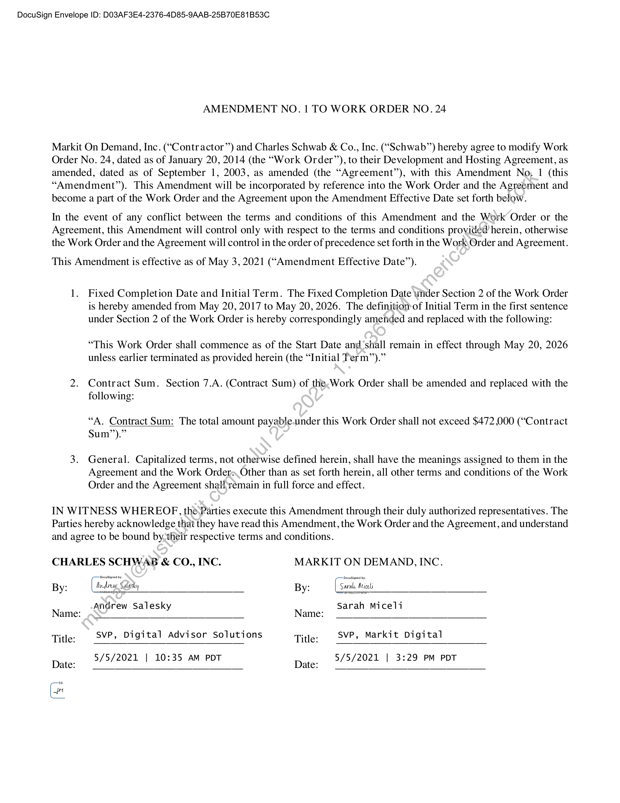
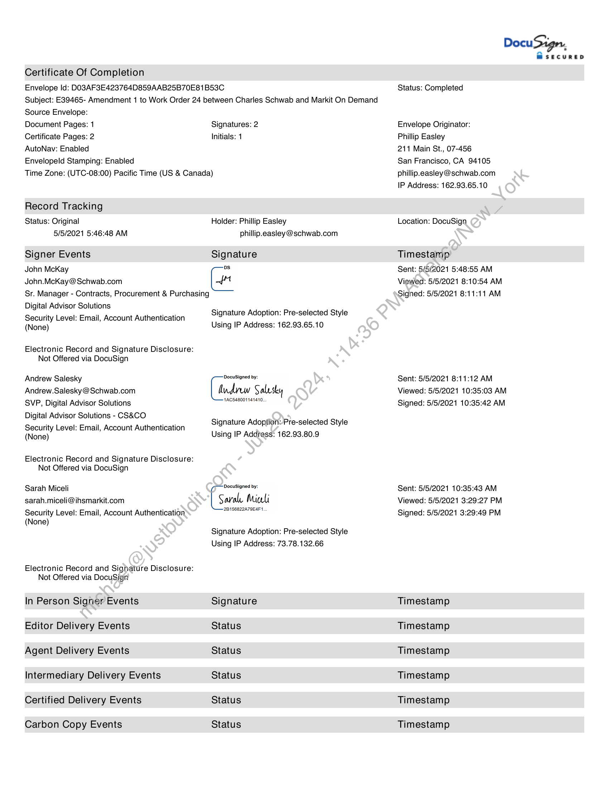
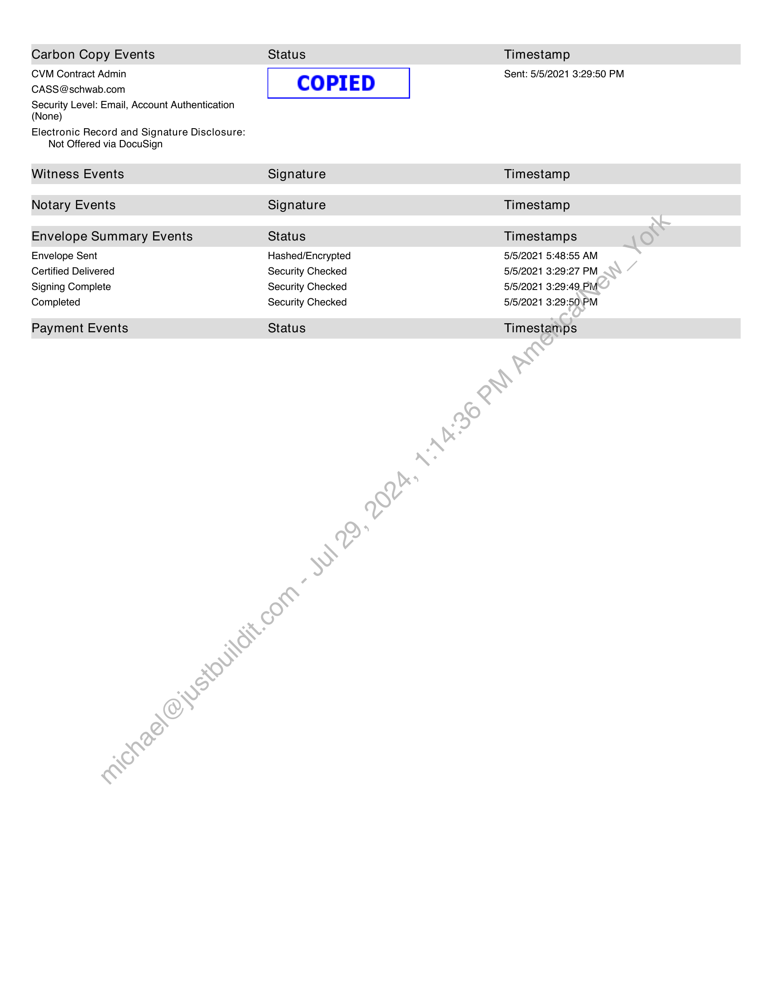

##### Amendment No. 1 to Work Order No. 24]

  
````col
```col-md
flexGrow=.5
===
> [!info] [Page 1](_attachments/images_Schwab-3.6.1.18.4200150163.pdf_205917/page_1.png)
> 
```  
```col-md
DocuSign Envelope ID: DO3AF3E4-2376-4D85-9AAB-25B70E81B53C  
AMENDMENT NO. 1 TO WORK ORDER NO. 24  
Markit On Demand, Inc. (“Contractor”) and Charles Schwab & Co., Inc. (“Schwab”) hereby agree to modify Work
Order No. 24, dated as of January 20, 2014 (the “Work Order”), to their Development and Hosting Agreement, as
amended, dated as of September 1, 2003, as amended (the “Agreement’’), with this Amendment No, 1 (this
“Amendment”). This Amendment will be incorporated by reference into the Work Order and the Agreement and
become a part of the Work Order and the Agreement upon the Amendment Effective Date set forth below.  
In the event of any conflict between the terms and conditions of this Amendment and the Work Order or the
Agreement, this Amendment will control only with respect to the terms and conditions provided herein, otherwise
the Work Order and the Agreement will control in the order of precedence set forth in the Work Order and Agreement.  
This Amendment is effective as of May 3, 2021 (“Amendment Effective Date’).  
1. Fixed Completion Date and Initial Term. The Fixed Completion Date under Section 2 of the Work Order
is hereby amended from May 20, 2017 to May 20, 2026. The definition of Initial Term in the first sentence
under Section 2 of the Work Order is hereby correspondingly amended and replaced with the following:  
“This Work Order shall commence as of the Start Date and shall remain in effect through May 20, 2026
unless earlier terminated as provided herein (the “Initial Term”).”  
2. Contract Sum. Section 7.A. (Contract Sum) of the.Work Order shall be amended and replaced with the
following:  
“A. Contract Sum: The total amount payable.under this Work Order shall not exceed $472,000 (“Contract
Sum”).”  
3. General. Capitalized terms, not otherwise defined herein, shall have the meanings assigned to them in the
Agreement and the Work Orders Other than as set forth herein, all other terms and conditions of the Work
Order and the Agreement shatiremain in full force and effect.  
IN WITNESS WHEREOF, the Parties execute this Amendment through their duly authorized representatives. The
Parties hereby acknowledge that they have read this Amendment, the Work Order and the Agreement, and understand
and agree to be bound by. their respective terms and conditions.  
CHARLES SCHWAB & CO., INC. MARKIT ON DEMAND, INC.
Andrew Salesky Sarah Miceli  
Name: Name:  
Title: SvP, Digital Advisor Solutions Title: svP, Markit Digital
5/5/2021 | 10:35 AM PDT 5/5/2021 | 3:29 PM PDT  
Date: Date:  
```
````
Notes:    
````col
```col-md
flexGrow=.5
===
> [!info] [Page 2](_attachments/images_Schwab-3.6.1.18.4200150163.pdf_205917/page_2.png)
> 
```  
```col-md
Certificate Of Completion  
Envelope Id: DO3AF3E423764D859AAB25B70E81B53C  
Subject: E39465- Amendment 1 to Work Order 24 between Charles Schwab and Markit On Demand  
Source Envelope:  
Document Pages: 1  
Certificate Pages: 2  
AutoNav: Enabled  
Envelopeld Stamping: Enabled  
Signatures: 2
Initials: 1  
Time Zone: (UTC-08:00) Pacific Time (US & Canada)  
Record Tracking  
Status: Original
5/5/2021 5:46:48 AM  
Signer Events  
John McKay
John.McKay@Schwab.com  
Sr. Manager - Contracts, Procurement & Purchasing  
Digital Advisor Solutions  
Security Level: Email, Account Authentication
(None)  
Electronic Record and Signature Disclosure:  
Not Offered via DocuSign  
Andrew Salesky
Andrew.Salesky @ Schwab.com
SVP, Digital Advisor Solutions
Digital Advisor Solutions - CS&CO  
Security Level: Email, Account Authentication
(None)  
Electronic Record and Signature Disclosure:  
Not Offered via DocuSign  
Sarah Miceli
sarah.miceli@ihsmarkit.com  
Security Level: Email, Account Authentication
(None)  
Electronic Record and Signature Disclosure:  
Not Offered via DocuSign
In Person Signer Events
Editor Delivery Events
Agent Delivery Events
Intermediary Delivery Events
Certified Delivery Events  
Carbon Copy Events  
Holder: Phillip Easley
phillip.easley@schwab.com  
Signature  
Ds  
Signature Adoption: Pre-selected Style
Using IP Address: 162.93.65.10  
1AC848001141410.  
Signature Adoption: Pre-selected Style
Using IP Address: 162.93.80.9  
DocuSigned by:  
Saale. Mili  
-2B156822A79E4F1  
Signature Adoption: Pre-selected Style
Using IP Address: 73.78.132.66  
Signature
Status
Status
Status
Status  
Status  
DocuSign,  
ES
MsecurReD  
Status: Completed  
Envelope Originator:  
Phillip Easley  
211 Main St., 07-456  
San Francisco, CA 94105
phillip.easley@schwab.com
IP Address: 162.93.65.10  
Location: DocuSign  
Timestamp  
Sent: 5/5/2021 5:48:55 AM
Viewed: 5/5/2021 8:10:54 AM
Signed: 5/5/2021 8:11:11 AM  
Sent: 5/5/2021 8:11:12 AM
Viewed: 5/5/2021 10:35:03 AM
Signed: 5/5/2021 10:35:42 AM  
Sent: 5/5/2021 10:35:43 AM
Viewed: 5/5/2021 3:29:27 PM
Signed: 5/5/2021 3:29:49 PM  
Timestamp
Timestamp
Timestamp
Timestamp
Timestamp  
Timestamp  
```
````
Notes:    
````col
```col-md
flexGrow=.5
===
> [!info] [Page 3](_attachments/images_Schwab-3.6.1.18.4200150163.pdf_205917/page_3.png)
> 
```  
```col-md
Carbon Copy Events
CVM Contract Admin
CASS @schwab.com  
Security Level: Email, Account Authentication
(None)  
Electronic Record and Signature Disclosure:
Not Offered via DocuSign  
Witness Events
Notary Events  
Envelope Summary Events
Envelope Sent  
Certified Delivered  
Signing Complete  
Completed  
Payment Events  
Status  
COPIED  
Signature
Signature  
Status
Hashed/Encrypted
Security Checked
Security Checked
Security Checked  
Status  
Timestamp
Sent: 5/5/2021 3:29:50 PM  
Timestamp
Timestamp  
Timestamps  
5/5/2021 5:48:55 AM
5/5/2021 3:29:27 PM
5/5/2021 3:29:49 PM
5/5/2021 3:29:50\PM  
Timestamps  
```
````
Notes:  


![[_attachments/Schwab-3.6.1.18.42 00150163.pdf]