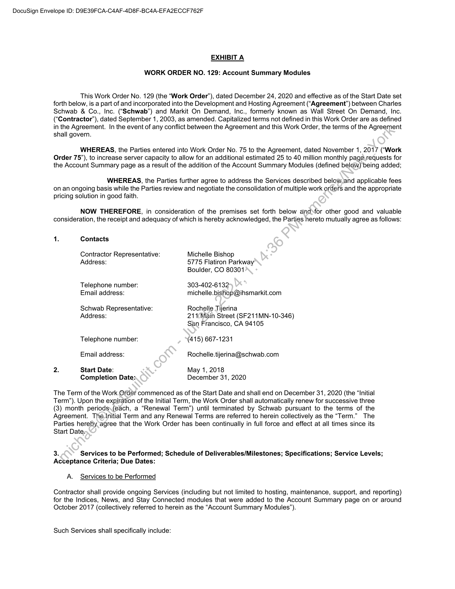
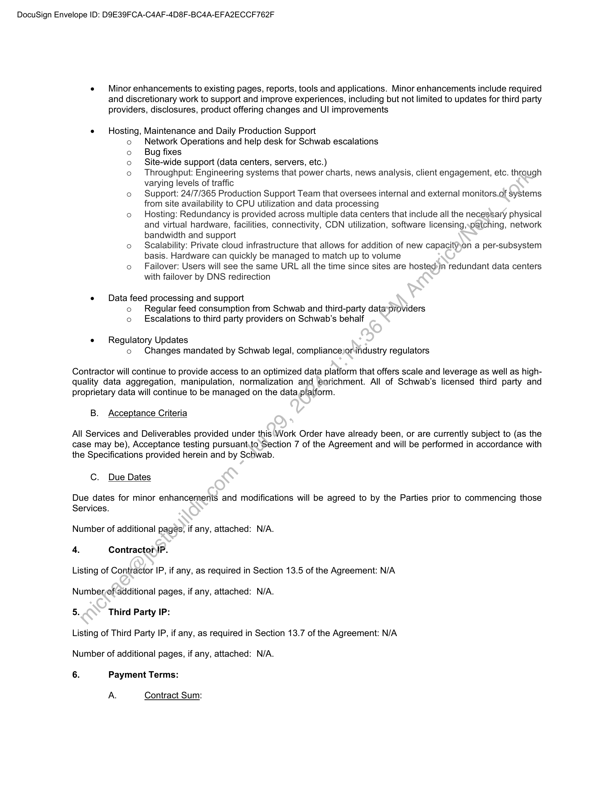
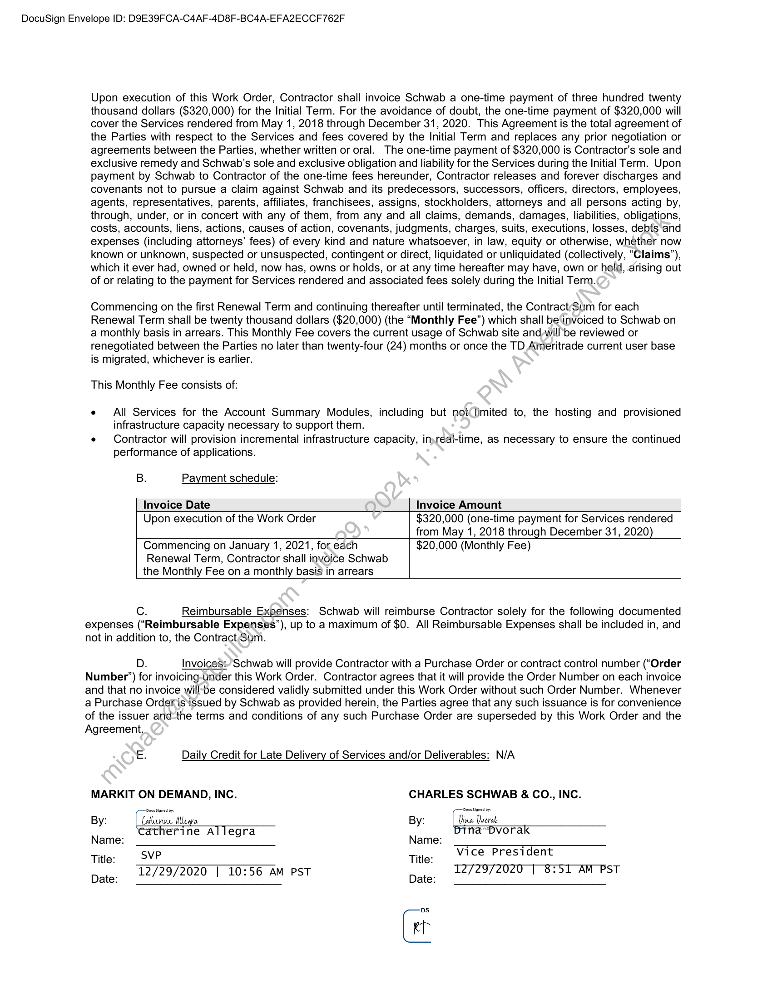

##### Work Order No. 129: Account Summary Modules]

  
````col
```col-md
flexGrow=.5
===
> [!info] [Page 1](_attachments/images_Schwab-3.6.1.18.4300147786.pdf_211000/page_1.png)
> 
```  
```col-md
DocuSign Envelope ID: D9E39FCA-C4AF-4D8F-BC4A-EFA2ECCF762F  
EXHIBIT A  
WORK ORDER NO. 129: Account Summary Modules  
This Work Order No. 129 (the “Work Order’), dated December 24, 2020 and e
forth below, is a part of and incorporated into the Development and Hosting Agreement (“
Schwab & Co., Inc. (“Schwab”) and Markit On Demand, Inc., formerly known as
(‘Contractor’), dated September 1, 2003, as amended. Capitalized terms not defined in  
ffective as of the Start Date set
Agreement’) between Charles
Wall Street On Demand, Inc.
this Work Order are as defined  
in the Agreement. In the event of any conflict between the Agreement and this Work Order, the terms of the Agreement  
shall govern.  
WHEREAS, the Parties entered into Work Order No. 75 to the Agreement, dated November 1, 2017 (“Work  
Order 75”), to increase server capacity to allow for an additional estimated 25 to 40 mii  
lion monthly page,requests for  
the Account Summary page as a result of the addition of the Account Summary Modules (defined below) being added;  
WHEREAS, the Parties further agree to address the Services descri  
bed below.and applicable fees  
onan ongoing basis while the Parties review and negotiate the consolidation of multiple work orders and the appropriate  
pricing solution in good faith.  
NOW THEREFORE, in consideration of the premises set forth below and  
for other good and valuable  
consideration, the receipt and adequacy of which is hereby acknowledged, the Parties hereto mutually agree as follows:  
1. Contacts
Contractor Representative: Michelle Bishop
Address: 5775 Flatiron Parkway
Boulder, CO 80301
Telephone number: 303-402-6132
Email address: michelle.bishop@ihsmarkit.com
Schwab Representative: Rochelle Tijerina
Address: 211Main Street (SF211MN-10-346)
San Francisco, CA 94105
Telephone number: (415) 667-1231
Email address: Rochelle.tijerina@schwab.com
2. Start Date: May 1, 2018
Completion Date: December 31, 2020  
The Term of the Work Order commenced as of the Start Date and shall end on December 31, 2020 (the “Initial
Term”). Upon the expiration of the Initial Term, the Work Order shall automatically renew for successive three
(3) month periods\(each, a “Renewal Term”) until terminated by Schwab pursuant to the terms of the
Agreement. TheéInitial Term and any Renewal Terms are referred to herein collectively as the “Term.” The
Parties hereby agree that the Work Order has been continually in full force and effect at all times since its  
Start Date:  
3. Services to be Performed; Schedule of Deliverables/Milestones; Specifications; Service Levels;  
Acceptance Criteria; Due Dates:  
A. Services to be Performed  
Contractor shall provide ongoing Services (including but not limited to hosting, maintenance, support, and reporting)  
for the Indices, News, and Stay Connected modules that were added to the Account
October 2017 (collectively referred to herein as the “Account Summary Modules’).  
Such Services shall specifically include:  
Summary page on or around  
```
````
Notes:    
````col
```col-md
flexGrow=.5
===
> [!info] [Page 2](_attachments/images_Schwab-3.6.1.18.4300147786.pdf_211000/page_2.png)
> 
```  
```col-md
DocuSign Envelope ID: D9E39FCA-C4AF-4D8F-BC4A-EFA2ECCF762F  
e Minor enhancements to existing pages, reports, tools and applications. Minor enhancements include required
and discretionary work to support and improve experiences, including but not limited to updates for third party
providers, disclosures, product offering changes and UI improvements  
e Hosting, Maintenance and Daily Production Support  
°  
°
°
°  
fe)  
Network Operations and help desk for Schwab escalations  
Bug fixes  
Site-wide support (data centers, servers, etc.)  
Throughput: Engineering systems that power charts, news analysis, client engagement, etc. through
varying levels of traffic  
Support: 24/7/365 Production Support Team that oversees internal and external monitors.of Systems
from site availability to CPU utilization and data processing  
Hosting: Redundancy is provided across multiple data centers that include all the necessary physical
and virtual hardware, facilities, connectivity, CDN utilization, software licensing,,patching, network
bandwidth and support  
Scalability: Private cloud infrastructure that allows for addition of new capacityyon a per-subsystem
basis. Hardware can quickly be managed to match up to volume  
Failover: Users will see the same URL all the time since sites are hosted»in redundant data centers
with failover by DNS redirection  
e Data feed processing and support  
°
°  
Regular feed consumption from Schwab and third-party dataproviders
Escalations to third party providers on Schwab’s behalf  
e Regulatory Updates  
°  
Changes mandated by Schwab legal, compliance)or industry regulators  
Contractor will continue to provide access to an optimized data platform that offers scale and leverage as well as highquality data aggregation, manipulation, normalization and enrichment. All of Schwab’s licensed third party and
proprietary data will continue to be managed on the data platform.  
B. Acceptance Criteria  
All Services and Deliverables provided under this Work Order have already been, or are currently subject to (as the
case may be), Acceptance testing pursuant.to Section 7 of the Agreement and will be performed in accordance with
the Specifications provided herein and by Schwab.  
C. Due Dates  
Due dates for minor enhancements and modifications will be agreed to by the Parties prior to commencing those  
Services.  
Number of additional pages, if any, attached: N/A.  
4. Contracton!P.  
Listing of Contractor IP, if any, as required in Section 13.5 of the Agreement: N/A  
Number,of additional pages, if any, attached: N/A.  
5. Third Party IP:  
Listing of Third Party IP, if any, as required in Section 13.7 of the Agreement: N/A  
Number of additional pages, if any, attached: N/A.  
6. Payment Terms:  
A.  
Contract Sum:  
```
````
Notes:    
````col
```col-md
flexGrow=.5
===
> [!info] [Page 3](_attachments/images_Schwab-3.6.1.18.4300147786.pdf_211000/page_3.png)
> 
```  
```col-md
DocuSign Envelope ID: D9E39FCA-C4AF-4D8F-BC4A-EFA2ECCF762F  
Upon execution of this Work Order, Contractor shall invoice Schwab a one-time payment of three hundred twenty
thousand dollars ($320,000) for the Initial Term. For the avoidance of doubt, the one-time payment of $320,000 will
cover the Services rendered from May 1, 2018 through December 31, 2020. This Agreement is the total agreement of
the Parties with respect to the Services and fees covered by the Initial Term and replaces any prior negotiation or
agreements between the Parties, whether written or oral. The one-time payment of $320,000 is Contractor’s sole and
exclusive remedy and Schwab's sole and exclusive obligation and liability for the Services during the Initial Term. Upon
payment by Schwab to Contractor of the one-time fees hereunder, Contractor releases and forever discharges and
covenants not to pursue a claim against Schwab and its predecessors, successors, officers, directors, employees,
agents, representatives, parents, affiliates, franchisees, assigns, stockholders, attorneys and all persons acting by,
through, under, or in concert with any of them, from any and all claims, demands, damages, liabilities, obligations,
costs, accounts, liens, actions, causes of action, covenants, judgments, charges, suits, executions, losses, debts and
expenses (including attorneys’ fees) of every kind and nature whatsoever, in law, equity or otherwise, whether now
known or unknown, suspected or unsuspected, contingent or direct, liquidated or unliquidated (collectively, “Claims”,
which it ever had, owned or held, now has, owns or holds, or at any time hereafter may have, own or hold, arising out
of or relating to the payment for Services rendered and associated fees solely during the Initial Term.¢  
Commencing on the first Renewal Term and continuing thereafter until terminated, the Contract(Sum for each
Renewal Term shall be twenty thousand dollars ($20,000) (the “Monthly Fee”) which shall be‘invoiced to Schwab on
a monthly basis in arrears. This Monthly Fee covers the current usage of Schwab site and-will'be reviewed or
renegotiated between the Parties no later than twenty-four (24) months or once the TD Ameritrade current user base
is migrated, whichever is earlier.  
This Monthly Fee consists of:  
e All Services for the Account Summary Modules, including but not limited to, the hosting and provisioned
infrastructure capacity necessary to support them.  
e Contractor will provision incremental infrastructure capacity, in)real-time, as necessary to ensure the continued
performance of applications.  
B. Payment schedule:
Invoice Date Invoice Amount
Upon execution of the Work Order $320,000 (one-time payment for Services rendered  
from May 1, 2018 through December 31, 2020)  
Commencing on January 1, 2021, for each $20,000 (Monthly Fee)
Renewal Term, Contractor shall invoice Schwab
the Monthly Fee on a monthly basis in arrears  
Cc. Reimbursable Expenses: Schwab will reimburse Contractor solely for the following documented  
expenses (“Reimbursable Expenses”), up to a maximum of $0. All Reimbursable Expenses shall be included in, and
not in addition to, the Contract Sum.  
D. Invoices; Schwab will provide Contractor with a Purchase Order or contract control number (“Order
Number’) for invoicing-under this Work Order. Contractor agrees that it will provide the Order Number on each invoice
and that no invoice will-be considered validly submitted under this Work Order without such Order Number. Whenever
a Purchase Order isissued by Schwab as provided herein, the Parties agree that any such issuance is for convenience
of the issuer andthe terms and conditions of any such Purchase Order are superseded by this Work Order and the  
Agreement.  
E. Daily Credit for Late Delivery of Services and/or Deliverables: N/A  
MARKIT ON DEMAND, INC. CHARLES SCHWAB & CO., INC.  
By: ( Caterine Araya. By: (i vale .
Catherine ATTegra la” Dvorak  
Name: Name: : :  
Title: SVP Title: vice President
12/29/2020 | 10:56 AM PST 1272972020 [| 8:51 AM PST  
Date: Date:  
Gi  
```
````
Notes:  


![[_attachments/Schwab-3.6.1.18.43 00147786.pdf]