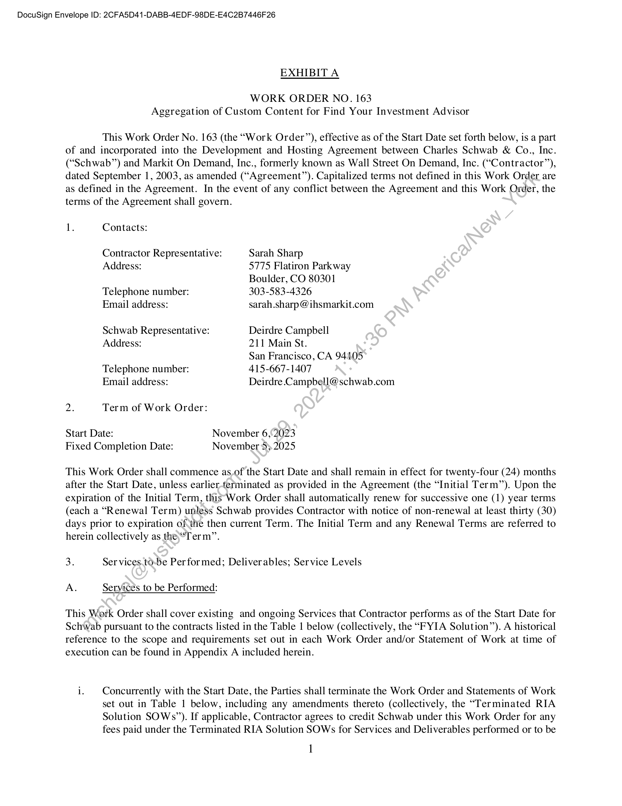
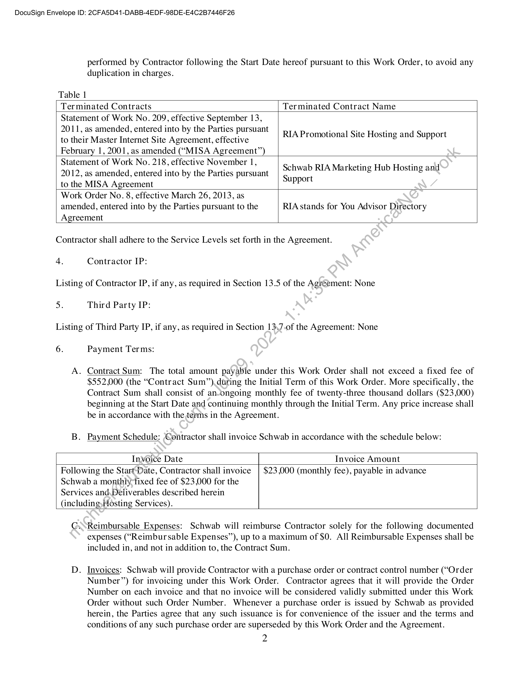
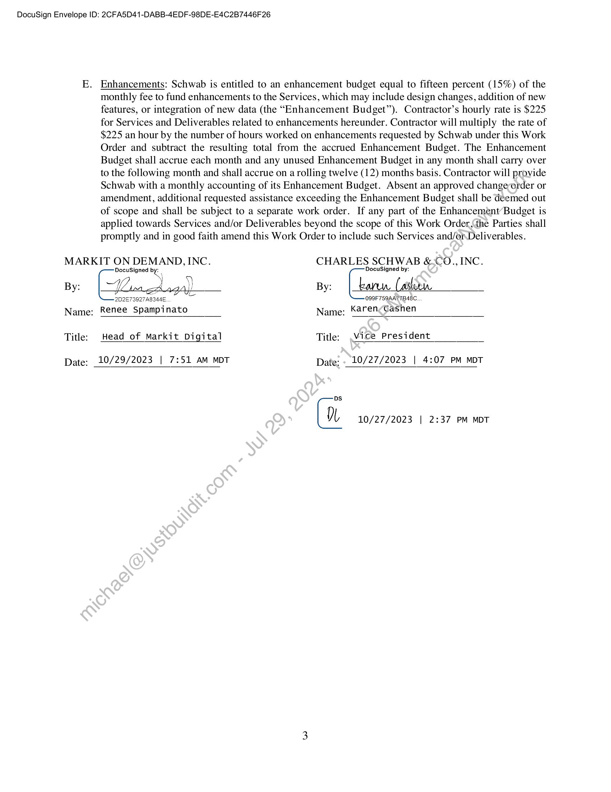
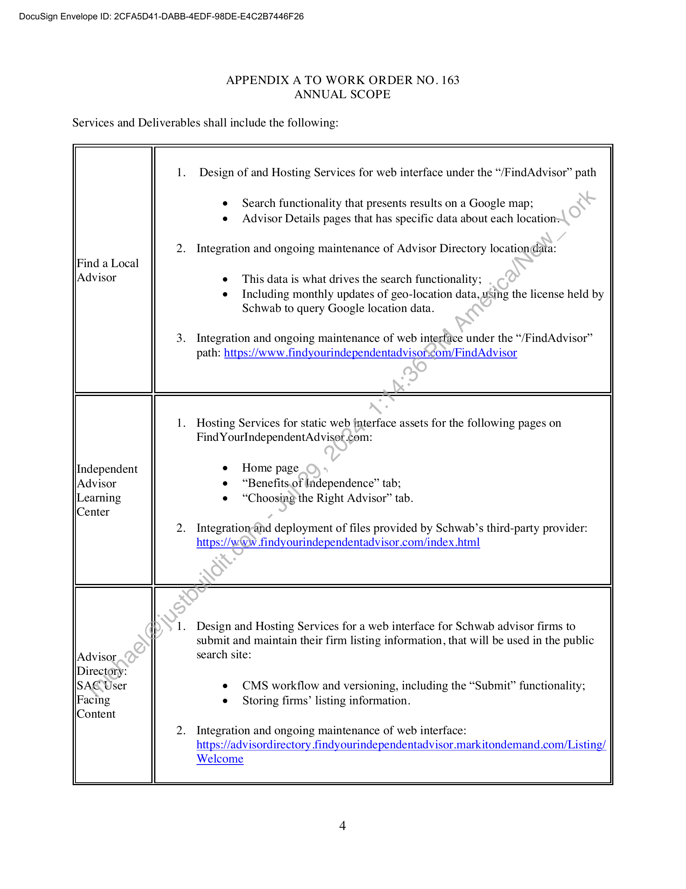
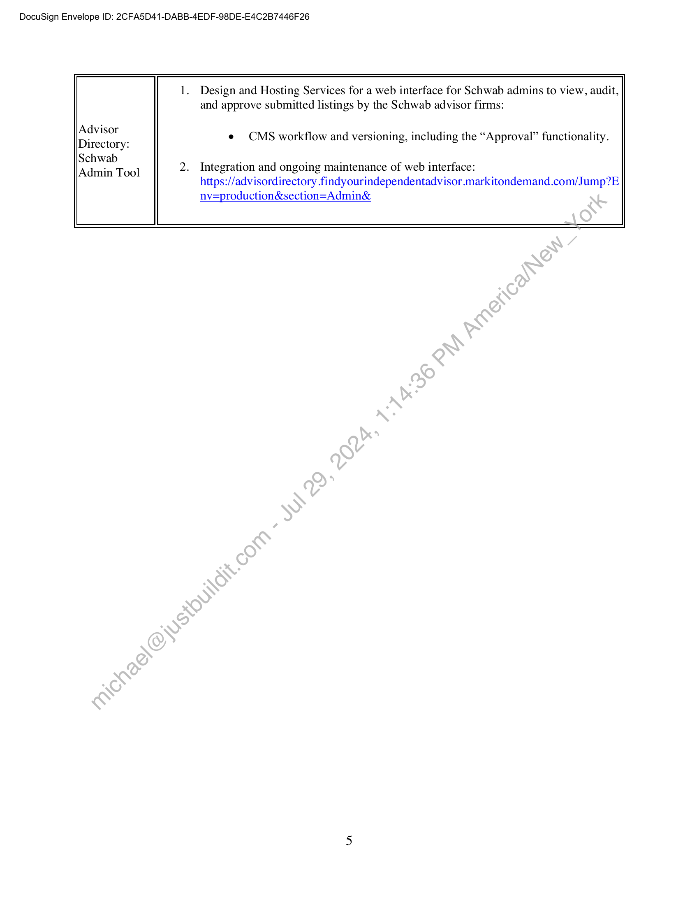

##### Work Order No. 163 - Aggregation of Custom Content for Find Your Investment Advisor]

  
````col
```col-md
flexGrow=.5
===
> [!info] [Page 1](_attachments/images_Schwab-3.6.1.18.4500150173.pdf_210841/page_1.png)
> 
```  
```col-md
DocuSign Envelope ID: 2CFA5D41-DABB-4EDF-98DE-E4C2B7446F 26  
EXHIBIT A  
WORK ORDER NO. 163
Aggregation of Custom Content for Find Your Investment Advisor  
This Work Order No. 163 (the “Work Order”), effective as of the Start Date set forth below, is a part
of and incorporated into the Development and Hosting Agreement between Charles Schwab & Co., Inc.
(“Schwab”) and Markit On Demand, Inc., formerly known as Wall Street On Demand, Inc. (“Contractor”),
dated September 1, 2003, as amended (“Agreement”). Capitalized terms not defined in this Work Order are
as defined in the Agreement. In the event of any conflict between the Agreement and this Work Order, the
terms of the Agreement shall govern.  
1. Contacts:
Contractor Representative: Sarah Sharp
Address: 5775 Flatiron Parkway
Boulder, CO 80301
Telephone number: 303-583-4326
Email address: sarah.sharp @ihsmarkit.com
Schwab Representative: Deirdre Campbell
Address: 211 Main St.
San Francisco, CA 94405
Telephone number: 415-667-1407
Email address: Deirdre.Campbell@schwab.com
2. Term of Work Order:
Start Date: November 6,'2023
Fixed Completion Date: November 53.2025  
This Work Order shall commence as,of the Start Date and shall remain in effect for twenty-four (24) months
after the Start Date, unless earlier-tefminated as provided in the Agreement (the “Initial Term”). Upon the
expiration of the Initial Term, this Work Order shall automatically renew for successive one (1) year terms
(each a “Renewal Term) unless Schwab provides Contractor with notice of non-renewal at least thirty (30)
days prior to expiration ofthe then current Term. The Initial Term and any Renewal Terms are referred to
herein collectively as the “Term”.  
3. Ser vices.to-be Performed; Deliverables; Service Levels  
A. Services to be Performed:  
This Work Order shall cover existing and ongoing Services that Contractor performs as of the Start Date for
Schwab pursuant to the contracts listed in the Table 1 below (collectively, the “FYIA Solution”). A historical
reference to the scope and requirements set out in each Work Order and/or Statement of Work at time of
execution can be found in Appendix A included herein.  
i. Concurrently with the Start Date, the Parties shall terminate the Work Order and Statements of Work
set out in Table 1 below, including any amendments thereto (collectively, the “Terminated RIA
Solution SOWs”). If applicable, Contractor agrees to credit Schwab under this Work Order for any
fees paid under the Terminated RIA Solution SOWs for Services and Deliverables performed or to be  
1  
```
````
Notes:    
````col
```col-md
flexGrow=.5
===
> [!info] [Page 2](_attachments/images_Schwab-3.6.1.18.4500150173.pdf_210841/page_2.png)
> 
```  
```col-md
DocuSign Envelope ID: 2CFA5D41-DABB-4EDF-98DE-E4C2B7446F 26  
performed by Contractor following the Start Date hereof pursuant to this Work Order, to avoid any  
duplication in charges.  
Table 1  
Terminated Contracts  
Terminated Contract Name  
Statement of Work No. 209, effective September 13,
2011, as amended, entered into by the Parties pursuant
to their Master Internet Site Agreement, effective
February 1, 2001, as amended (“MISA Agreement”)  
RIA Promotional Site Hosting and Support  
Statement of Work No. 218, effective November 1,
2012, as amended, entered into by the Parties pursuant
to the MISA Agreement  
Schwab RIA Marketing Hub Hosting and
Support  
Work Order No. 8, effective March 26, 2013, as
amended, entered into by the Parties pursuant to the
Agreement  
RIA stands for You Advisor Directory  
Contractor shall adhere to the Service Levels set forth in the Agreement.  
4.  
Contractor IP:  
Listing of Contractor IP, if any, as required in Section 13.5 of the Agreement: None  
5.  
Third Party IP:  
Listing of Third Party IP, if any, as required in Section 13,7.of the Agreement: None  
6.  
Payment Terms:  
A. Contract Sum: The total amount payable under this Work Order shall not exceed a fixed fee of  
$552,000 (the “Contract Sum”) during the Initial Term of this Work Order. More specifically, the
Contract Sum shall consist of an-ongoing monthly fee of twenty-three thousand dollars ($23,000)
beginning at the Start Date and continuing monthly through the Initial Term. Any price increase shall  
be in accordance with the terms in the Agreement.  
B. Payment Schedule: Contractor shall invoice Schwab in accordance with the schedule below:  
Invoice Date  
Invoice Amount  
Following the Starf-Date, Contractor shall invoice | $23,000 (monthly fee), payable in advance  
Schwab a monthly fixed fee of $23,000 for the
Services and\Deliverables described herein
(including, Hosting Services).  
G.sReimbursable Expenses: Schwab will reimburse Contractor solely for the following documented  
expenses (“Reimbursable Expenses”), up to a maximum of $0. All Reimbursable Expenses shall be
included in, and not in addition to, the Contract Sum.  
. Invoices: Schwab will provide Contractor with a purchase order or contract control number (“Order  
Number”) for invoicing under this Work Order. Contractor agrees that it will provide the Order
Number on each invoice and that no invoice will be considered validly submitted under this Work
Order without such Order Number. Whenever a purchase order is issued by Schwab as provided
herein, the Parties agree that any such issuance is for convenience of the issuer and the terms and
conditions of any such purchase order are superseded by this Work Order and the Agreement.  
2  
```
````
Notes:    
````col
```col-md
flexGrow=.5
===
> [!info] [Page 3](_attachments/images_Schwab-3.6.1.18.4500150173.pdf_210841/page_3.png)
> 
```  
```col-md
DocuSign Envelope ID: 2CFA5D41-DABB-4EDF-98DE-E4C2B7446F 26  
E. Enhancements: Schwab is entitled to an enhancement budget equal to fifteen percent (15%) of the
monthly fee to fund enhancements to the Services, which may include design changes, addition of new
features, or integration of new data (the “Enhancement Budget”). Contractor’s hourly rate is $225
for Services and Deliverables related to enhancements hereunder. Contractor will multiply the rate of
$225 an hour by the number of hours worked on enhancements requested by Schwab under this Work
Order and subtract the resulting total from the accrued Enhancement Budget. The Enhancement
Budget shall accrue each month and any unused Enhancement Budget in any month shall carry over
to the following month and shall accrue on a rolling twelve (12) months basis. Contractor will provide
Schwab with a monthly accounting of its Enhancement Budget. Absent an approved changeorder or
amendment, additional requested assistance exceeding the Enhancement Budget shall be deemed out
of scope and shall be subject to a separate work order. If any part of the Enhancement Budget is
applied towards Services and/or Deliverables beyond the scope of this Work Order,the Parties shall
promptly and in good faith amend this Work Order to include such Services and/orDeliverables.  
MARKIT ON DEMAND, INC. CHARLES SCHWAB &.CO., INC.
DocuSigned DocuSigned by:  
By: [Lore Lagall By: |_karew (aslo _
2D2E7 3027 AB2A4E 099F759AA77B48C.  
Name: Renee Spampinato Name: KarencGashen  
Title: Head of Markit Digital Title: Vice President _  
Date; 10/29/2023 | 7:51 AM MDT Date: - 10/27/2023 | 4:07 PM MDT  
ps
DL 10/27/2023 | 2:37 PM MDT  
```
````
Notes:    
````col
```col-md
flexGrow=.5
===
> [!info] [Page 4](_attachments/images_Schwab-3.6.1.18.4500150173.pdf_210841/page_4.png)
> 
```  
```col-md
DocuSign Envelope ID: 2CFA5D41-DABB-4EDF-98DE-E4C2B7446F 26  
APPENDIX A TO WORK ORDER NO. 163
ANNUAL SCOPE  
Services and Deliverables shall include the following:  
Find a Local
Advisor  
Independent  
Design of and Hosting Services for web interface under the “/FindAdvisor” path  
e Search functionality that presents results on a Google map;
e Advisor Details pages that has specific data about each location:  
Integration and ongoing maintenance of Advisor Directory location@ata:
e This data is what drives the search functionality;
e Including monthly updates of geo-location data, using the license held by  
Schwab to query Google location data.  
Integration and ongoing maintenance of web interface under the “/FindAdvisor”
path: https://www.findyourindependentadvison¢om/FindAdvisor  
Hosting Services for static web interface assets for the following pages on
Find YourIndependentAdviser com:  
e Home page
e “Benefits.of Independence” tab;
e “Choosing the Right Advisor” tab.  
Integration-and deployment of files provided by Schwab’s third-party provider:
https://www .findyourindependentadvisor.com/index.htm]l  
Design and Hosting Services for a web interface for Schwab advisor firms to
submit and maintain their firm listing information, that will be used in the public
search site:  
e CMS workflow and versioning, including the “Submit” functionality;
e Storing firms’ listing information.  
Integration and ongoing maintenance of web interface:
https://advisordirectory findyourindependentadvisor.markitondemand.com/Listing/
Welcome  
```
````
Notes:    
````col
```col-md
flexGrow=.5
===
> [!info] [Page 5](_attachments/images_Schwab-3.6.1.18.4500150173.pdf_210841/page_5.png)
> 
```  
```col-md
DocuSign Envelope ID: 2CFA5D41-DABB-4EDF-98DE-E4C2B7446F 26  
Advisor
Directory:
Schwab
Admin Tool  
Design and Hosting Services for a web interface for Schwab admins to view, audit,
and approve submitted listings by the Schwab advisor firms:  
e CMS workflow and versioning, including the “Approval” functionality.  
Integration and ongoing maintenance of web interface:
https://advisordirectory findyourindependentadvisor.markitondemand.com/Jump?E
nv=production&section=Admin&  
```
````
Notes:  


![[_attachments/Schwab-3.6.1.18.45 00150173.pdf]