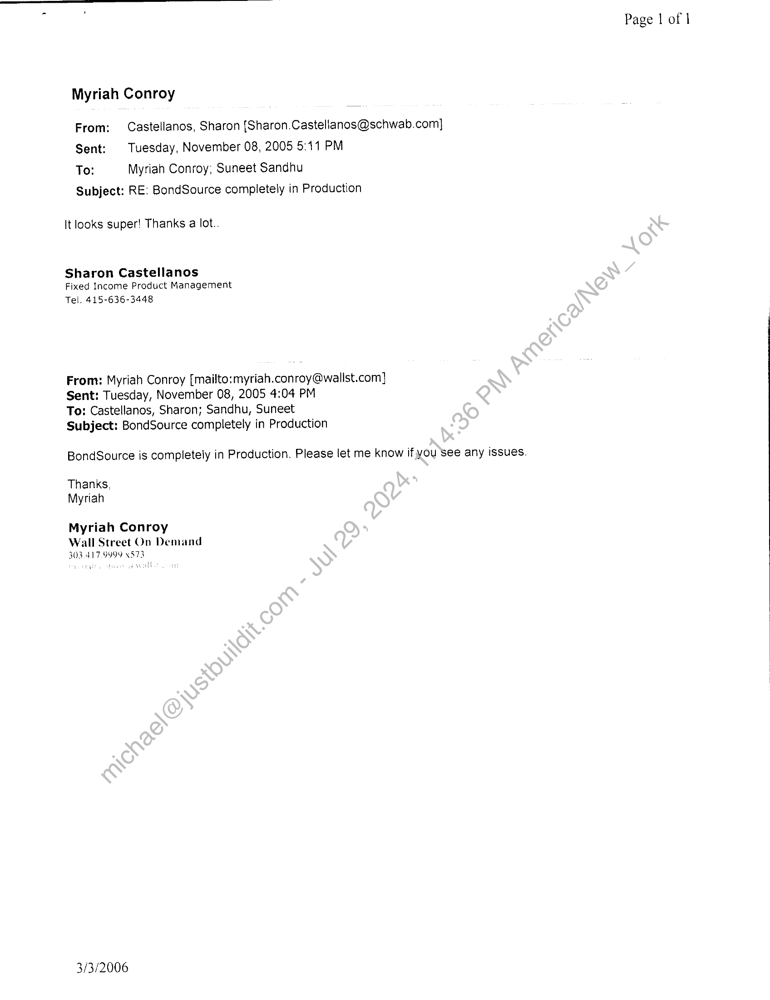

##### Revenue Recognition Form]

  
````col
```col-md
flexGrow=.5
===
> [!info] [Page 1](_attachments/images_Schwab-3.6.1.18.4600150240.pdf_205924/page_1.png)
> 
```  
```col-md
WALL STREET ON DEMAND  
Revenue Recognition Form  
Client Sch wab_ ( Bxced Lncomne )_ _ o)  
Project _ ond Souvce = Plaases tian Te  
Revenue Recognition Criteria:  
1. Persuasive evidence of an arrangement exists.
Documentation Needed:  
K For annual revenue over $10,000, Contract/SOW Required  
Contract/SOW Status _ Sw vod SO W 4 4  
OR
OQ For annual revenue of $10,000 and under, an email from the client confirming the
arrangement (including’thé nature of work, price, dates, and any other
expectations that have béen agreed upon). Include signed contract if the client
required it.
2. Delivery has occurred ‘orservices have been rendered.
Documentation Needed:  
KK Launch date: LU 8] 200s  
SM Attach email from client acknowledging acceptance, including “as of” date.  
Senior Project Manager / Date 7
Submit to finance within 5 business days or the 1* of, following month, whichever comes first.  
4  
3. The seller’s price to the buyer is fixed or determinable.
OC Documentation Needed: Contract or Email from #1 above.
4. Collectibility is reasonably assured.  
O D&B report (finance dept to run)  
Based on the data above and attached, revenue recognition can begin as of — _  
Chief Accounting Officer / Date  
```
````
Notes:    
````col
```col-md
flexGrow=.5
===
> [!info] [Page 2](_attachments/images_Schwab-3.6.1.18.4600150240.pdf_205924/page_2.png)
> 
```  
```col-md
Page | of |  
Myriah Conroy  
From: Castellanos, Sharon {Sharon.Castellanos@schwab.com]
Sent: Tuesday, November 08, 2005 5:11 PM  
To: Myriah Conroy; Suneet Sandhu  
Subject: RE: BondSource completely in Production  
It looks super! Thanks a lot.  
  
Sharon Castellanos
Fixed Income Product Management
Tel. 415-636-3448  
From: Myriah Conroy [mailto:myriah.conroy@wallst.com]
Sent: Tuesday, November 08, 2005 4:04 PM  
To: Castellanos, Sharon; Sandhu, Suneet  
Subject: BondSource completely in Production  
BondSource is completely in Production. Please let me know if you See any issues.  
Thanks,
Myriah  
Myriah Conroy  
Wall Street On Demand
303.417.9999 x873  
3/3/2006  
```
````
Notes:    
````col
```col-md
flexGrow=.5
===
> [!info] [Page 3](_attachments/images_Schwab-3.6.1.18.4600150240.pdf_205924/page_3.png)
> 
```  
```col-md
STATEMENT OF WoRK No. 114
Schwab Bond Source Redesign  
Wall Street on Demand, Inc. (“WSOD”), and Charles Schwab & Co., Inc. ("Schwab"),
hereby agree to supplement their Master Internet Site Agreement effective as of February 1,
2001, (the "Agreement”) with the following Statement of Work (the “SOW”), effective as of
November 28, 2005 (the “SOW Effective Date’’).  
This SOW will incorporate by reference the Agreement upon execution hereof by both
parties. In the event of any conflict between the terms and conditions of this SOW_and the
Agreement, this SOW will control only with respect to the products and services-provided
herein; otherwise the Agreement will control.  
The Agreement and this SOW are the entire agreement between-the parties concerning
WSOD’s provision of the products and services described in this SOW Except for the
Agreement, this SOW supersedes, and its terms govern, any prior agreements (including without
limitation any nondisclosure agreements), proposals or other communications, oral or written,
between the parties with respect to the products and services provided by WSOD under this
SOW. This SOW may be modified by mutual written agreement of the parties from time to time
to reflect the required performance of, and the corresponding responsibilities for, the services
described herein as it continues to be proven in a production environment.  
This SOW is composed of the following:  
Exhibit A: | Schwab Bond Source Redesign Specifications
Exhibit B: Service Level and Support Obligations
Exhibit C: | Term, Fees and Expenses  
In witness whereof, the partiés ‘to this Agreement execute it through their duly authorized
representatives. The parties hereby acknowledge that they have read this SOW, including all  
ture)  
ANA THoMPsoN
(Printed Name) . }
SR Vice PresiclenT  
James Tanner  
(Title) I c ‘Jos President Yr) glo  
(Date) (Date)  
```
````
Notes:    
````col
```col-md
flexGrow=.5
===
> [!info] [Page 4](_attachments/images_Schwab-3.6.1.18.4600150240.pdf_205924/page_4.png)
> 
```  
```col-md
EXHIBIT A TO STATEMENT OF WORK NO. 114
Schwab Bond Source Redesign  
SCHWAB BOND SOURCE REDESIGN SPECIFICATIONS
Recitals  
This addendum, when executed by both parties above, will supersede the following Statement of
Work:  
e Statement of Work #25: Schwab Bond Source Site dated January 1, 2000
e Statement of Work #32: Bond Source New Issue Alerts dated February 1, 2002  
Specifications
e The Schwab Bond Source Redesign project includes the following-work items:  
1. Design, development, and hosting of the following new Bond Source functionality:
a. Addition of ability for clients to sign up for Taxable Bond Alerts by category
‘b. Addition of GNMA Bond Issue Alerts
2. Continued support for alerts functionality in the Bond Source administration tool: .
- a. Alerts “Current Issue” HTML page
b. Alerts “Modify an Offering” HTML page
c. Alerts “Preview Screen” HTML.page
d. Alerts “Acknowledgment”,HTML page
3. Continue support for Bond Source-client alerts subscription pages:
a. Client “Subscription” HTML page
b. Client “Acknowledgment” HTML page
c. Client “Error Handling” HTML page
4. Retirement of Bond Source New Issue Offering Calendar and ‘“‘Offer To Purchase” Pages  
(collectively, the “Business Requirements”). In addition, the Schwab Bond Source Redesign
will initially incorporate certain modifications and enhancements at no additional cost as
mutually agreed-by the parties.  
e Schwab‘imay amend the Business Requirements and this exhibit from time to time by written
request to WSOD. If such request does not require that WSOD incur any costs or expenses,
then WSOD will respond within five (5) working days by either implementing the requested
changes or by providing an estimated completion date for any changes that WSOD
reasonably believes will require more than five (5) working days to implement. If such
request does require that WSOD incur costs or expenses, then WSOD will provide Schwab
with a written estimate of such costs and expenses in good faith within five (5) business days
for Schwab’s consideration. If Schwab accepts the written estimate, this Statement of Work
shall be amended to include the additional scope and requirements.  
```
````
Notes:    
````col
```col-md
flexGrow=.5
===
> [!info] [Page 5](_attachments/images_Schwab-3.6.1.18.4600150240.pdf_205924/page_5.png)
> 
```  
```col-md
The Schwab Bond Source Redesign shall have the look and feel consistent with other
Schwab pages  
Schwab maintains the ability to make reasonable changes to the look and feel of the Schwab
Bond Source Redesign. WSOD shall be required to respond to change requests within five
(5) working days by either implementing the requested changes or by providing an estimated
completion date for any changes that WSOD reasonably believes will require more than five
(5) working days to implement. WSOD shall provide substantial justification for refusal to
make any changes requested by Schwab. Additional fees arising from these changes shall be
agreed to by both parties prior to the rendering of any additional services by WSOD,  
Any Custom Content received or retrieved by WSOD will not be altered by WSOD prior to
making it available through Schwab Bond Source Redesign unless Schwab-so specifies.  
```
````
Notes:    
````col
```col-md
flexGrow=.5
===
> [!info] [Page 6](_attachments/images_Schwab-3.6.1.18.4600150240.pdf_205924/page_6.png)
> 
```  
```col-md
EXHIBIT B TO STATEMENT OF WORK NO. 114
Schwab Bond Source Redesign  
SERVICE LEVEL AND SUPPORT OBLIGATIONS  
Support and training:  
1.  
WSOD will provide reasonable training to certain representatives of Schwab as requested
by Schwab from time to time, including but not limited to its Technical Client Services  
group.
WSOD will provide documentation as deemed necessary by Schwab.  
All calls relating to Schwab content or functionality received by WSOD will be referred
to representatives of Schwab.  
The Schwab Bond Source Redesign will be available 24hours a day, 7 days a week,
excluding scheduled maintenance as mutually agreed by the parties.  
If the Schwab Bond Source Redesign becomes unavailable for any reason, WSOD will
use its best efforts to remedy the problem immediately. WSOD will immediately notify
the designated point-of-contact at Schwab)of,any outages that cannot be resolved within
the time limits stated in the Master Internet Site Agreement. :  
WSOD will provide a 24x7x365.contact to communicate any failures or outages of the
Schwab Bond Source Redesign with a fifteen (15) minute response time.  
WSOD will keep the Schwab Bond Source Redesign updated with most current Custom
Content available to it!  
WSOD will supply weekly usage data to Schwab regarding the Schwab Bond Source
Redesign, inchiding, but not limited to those listed in the Business Requirements.  
```
````
Notes:    
````col
```col-md
flexGrow=.5
===
> [!info] [Page 7](_attachments/images_Schwab-3.6.1.18.4600150240.pdf_205924/page_7.png)
> 
```  
```col-md
EXHIBIT C TO STATEMENT OF WORK NO. 114
Schwab Bond Source Redesign
TERM, FEES AND EXPENSES  
The Initial Term of this SOW will commence on its effective date and last until twelve (12)
months following the date that the Schwab Bond Source Redesign is first made generally
available by Schwab (“Launch Date”), at which time it shall renew for additional thirty (30) day
periods (“Automatic Renewal Periods”) until terminated by Schwab on thirty (30) days’, prior
written notice to WSOD.  
Schwab will pay WSOD an initial development fee of ten thousand dollars ($10,000) for the
development of the Schwab Bond Source Redesign.  
For hosting and maintaining the Schwab Bond Source Redesign, Schwabawill pay WSOD eight
thousand five hundred dollars ($8,500) per month beginning December. 1", 2005 during the
Initial Term, and continue during any Automatic Renewal Periods}unless otherwise agreed to by
the parties in writing.  
Schwab is responsible for all license and other fees payable.to the third-party information
providers for the use of their information or content forthe Schwab Bond Source Redesign.  
```
````
Notes:  


![[_attachments/Schwab-3.6.1.18.46 00150240.pdf]