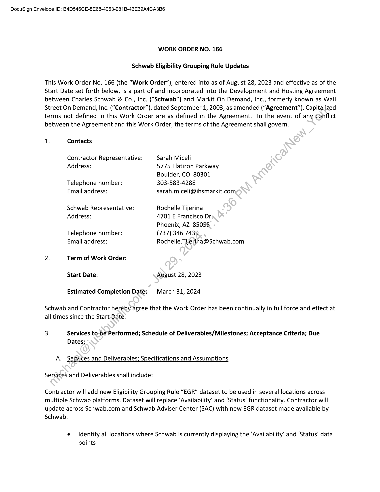
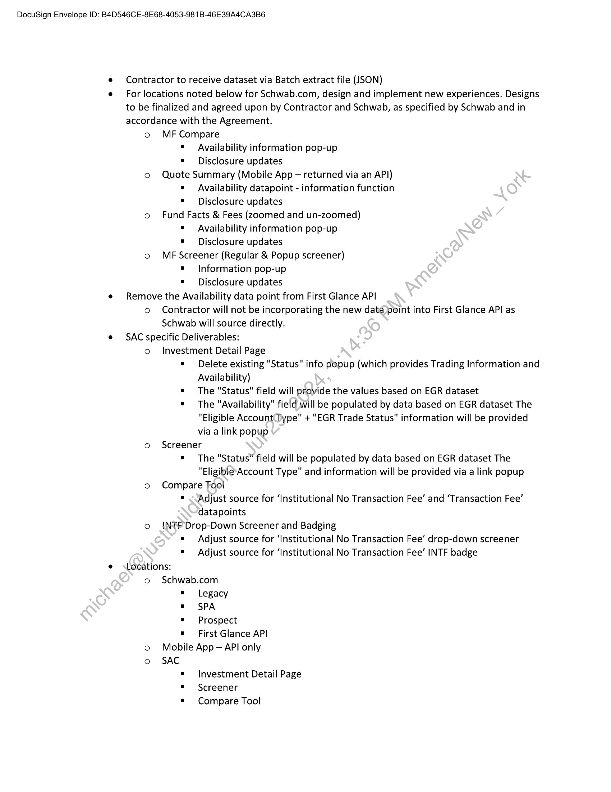
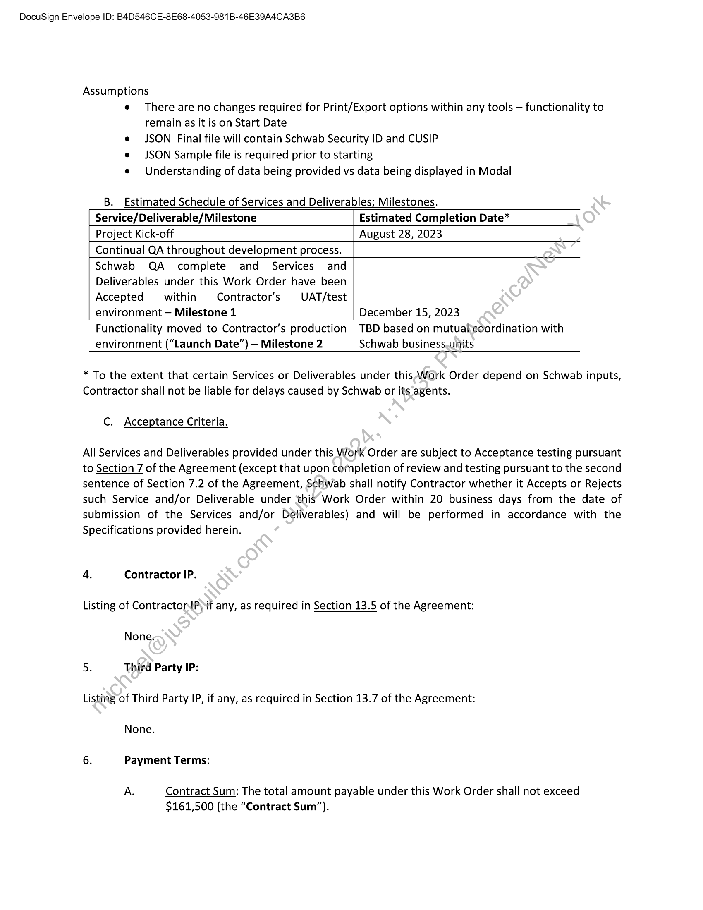
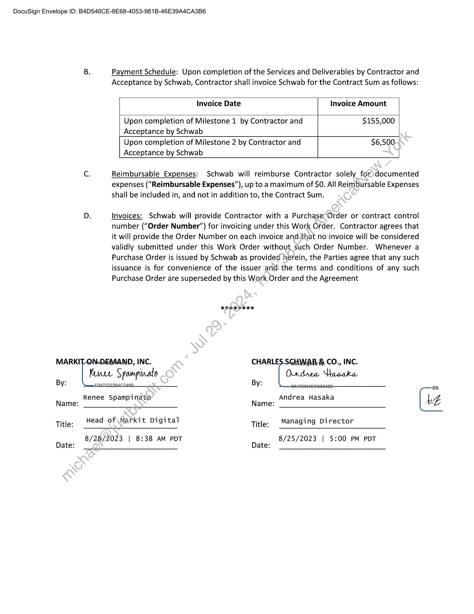

##### Work Order No. 166: Schwab Eligibility Grouping Rule Updates]

  
````col
```col-md
flexGrow=.5
===
> [!info] [Page 1](_attachments/images_Schwab-3.6.1.18.4700101956-expiredon1stApril2024.pdf_212020/page_1.png)
> 
```  
```col-md
DocuSign Envelope ID: B4D546CE-8E68-4053-981B-46E39A4CA3B6  
WORK ORDER NO. 166  
Schwab Eligibility Grouping Rule Updates  
This Work Order No. 166 (the “Work Order”), entered into as of August 28, 2023 and effective as of the
Start Date set forth below, is a part of and incorporated into the Development and Hosting Agreement
between Charles Schwab & Co., Inc. (“Schwab”) and Markit On Demand, Inc., formerly known as Wall
Street On Demand, Inc. (“Contractor”), dated September 1, 2003, as amended (“Agreement”). Capitalized
terms not defined in this Work Order are as defined in the Agreement. In the event of any conflict
between the Agreement and this Work Order, the terms of the Agreement shall govern.  
1. Contacts  
Contractor Representative:
Address:  
Telephone number:
Email address:  
Schwab Representative:
Address:  
Telephone number:
Email address:  
2. Term of Work Order:
Start Date:  
Estimated Completion Date:  
Sarah Miceli  
5775 Flatiron Parkway
Boulder, CO 80301
303-583-4288
sarah.miceli@ihsmarkit.com  
Rochelle Tijerina  
4701 E Francisco Dr,  
Phoenix, AZ 85055  
(737) 346 7439  
Rochelle. Tijerina@Schwab.com  
August 28, 2023  
March 31, 2024  
Schwab and Contractor hereby agree that the Work Order has been continually in full force and effect at  
all times since the Start Date.  
3. Services to-be Performed; Schedule of Deliverables/Milestones; Acceptance Criteria; Due  
Dates:  
A. Sefvices and Deliverables; Specifications and Assumptions  
Services and Deliverables shall include:  
Contractor will add new Eligibility Grouping Rule “EGR” dataset to be used in several locations across
multiple Schwab platforms. Dataset will replace ‘Availability’ and ‘Status’ functionality. Contractor will
update across Schwab.com and Schwab Adviser Center (SAC) with new EGR dataset made available by  
Schwab.  
e = Identify all locations where Schwab is currently displaying the ‘Availability’ and ‘Status’ data  
points  
```
````
Notes:    
````col
```col-md
flexGrow=.5
===
> [!info] [Page 2](_attachments/images_Schwab-3.6.1.18.4700101956-expiredon1stApril2024.pdf_212020/page_2.png)
> 
```  
```col-md
DocuSign Envelope ID: B4D546CE-8E68-4053-981B-46E39A4CA3B6  
e Contractor to receive dataset via Batch extract file (JSON)  
e For locations noted below for Schwab.com, design and implement new experiences. Designs
to be finalized and agreed upon by Contractor and Schwab, as specified by Schwab and in
accordance with the Agreement.  
o MF Compare
= Availability information pop-up
=" Disclosure updates
© Quote Summary (Mobile App — returned via an API)
= Availability datapoint - information function
=" Disclosure updates
o Fund Facts & Fees (zoomed and un-zoomed)
= Availability information pop-up
=" Disclosure updates
o MF Screener (Regular & Popup screener)
= Information pop-up
=" Disclosure updates
e Remove the Availability data point from First Glance API
o Contractor will not be incorporating the new data point into First Glance API as
Schwab will source directly.
e SAC specific Deliverables:
o Investment Detail Page
= Delete existing "Status" info popup (which provides Trading Information and
Availability)
= The "Status" field will provide the values based on EGR dataset
=" The "Availability" field will be populated by data based on EGR dataset The
"Eligible AccountDype" + "EGR Trade Status" information will be provided
via a link popup
o Screener
= The "Status” field will be populated by data based on EGR dataset The
"EligiblesAccount Type" and information will be provided via a link popup
o Compare Fool
= <<Adjust source for ‘Institutional No Transaction Fee’ and ‘Transaction Fee’
datapoints
o INTF Drop-Down Screener and Badging
= Adjust source for ‘Institutional No Transaction Fee’ drop-down screener
= Adjust source for ‘Institutional No Transaction Fee’ INTF badge
e Locations:
o Schwab.com  
= Legacy
= SPA
= Prospect  
= First Glance API
o Mobile App — API only
o SAC
= Investment Detail Page
= Screener
= Compare Tool  
```
````
Notes:    
````col
```col-md
flexGrow=.5
===
> [!info] [Page 3](_attachments/images_Schwab-3.6.1.18.4700101956-expiredon1stApril2024.pdf_212020/page_3.png)
> 
```  
```col-md
DocuSign Envelope ID: B4D546CE-8E68-4053-981B-46E39A4CA3B6  
Assumptions
e There are no changes required for Print/Export options within any tools — functionality to
remain as it is on Start Date
e JSON Final file will contain Schwab Security ID and CUSIP
e JSON Sample file is required prior to starting
e Understanding of data being provided vs data being displayed in Modal  
B. Estimated Schedule of Services and Deliverables; Milestones.
Service/Deliverable/Milestone Estimated Completion Date*
Project Kick-off August 28, 2023
Continual QA throughout development process.
Schwab QA complete and Services and
Deliverables under this Work Order have been
Accepted within Contractor’s UAT/test  
environment — Milestone 1 December 15, 2023
Functionality moved to Contractor’s production | TBD based on mutualcoordination with
environment (“Launch Date”) — Milestone 2 Schwab business.units  
* To the extent that certain Services or Deliverables under this Work Order depend on Schwab inputs,
Contractor shall not be liable for delays caused by Schwab or its agents.  
C. Acceptance Criteria.
All Services and Deliverables provided under this Work Order are subject to Acceptance testing pursuant
to Section 7 of the Agreement (except that upon completion of review and testing pursuant to the second
sentence of Section 7.2 of the Agreement, Schwab shall notify Contractor whether it Accepts or Rejects
such Service and/or Deliverable under ‘this Work Order within 20 business days from the date of
submission of the Services and/or Deliverables) and will be performed in accordance with the
Specifications provided herein.
4. Contractor IP.
Listing of ContractorP)if any, as required in Section 13.5 of the Agreement:  
None.  
5. Third Party IP:  
Listing of Third Party IP, if any, as required in Section 13.7 of the Agreement:  
None.
6. Payment Terms:
A. Contract Sum: The total amount payable under this Work Order shall not exceed  
$161,500 (the “Contract Sum”).  
```
````
Notes:    
````col
```col-md
flexGrow=.5
===
> [!info] [Page 4](_attachments/images_Schwab-3.6.1.18.4700101956-expiredon1stApril2024.pdf_212020/page_4.png)
> 
```  
```col-md
DocuSign Envelope ID: B4D546CE-8E68-4053-981B-46E39A4CA3B6  
B.  
MARKI  
By:  
Payment Schedule: Upon completion of the Services and Deliverables by Contractor and
Acceptance by Schwab, Contractor shall invoice Schwab for the Contract Sum as follows:  
Invoice Date Invoice Amount  
Upon completion of Milestone 1 by Contractor and $155,000
Acceptance by Schwab
Upon completion of Milestone 2 by Contractor and $6,500
Acceptance by Schwab  
Reimbursable Expenses: Schwab will reimburse Contractor solely for)documented
expenses (“Reimbursable Expenses”), up to a maximum of SO. All Reimbursable Expenses
shall be included in, and not in addition to, the Contract Sum.  
Invoices: Schwab will provide Contractor with a Purchase Order or contract control
number (“Order Number”) for invoicing under this Work Order. Contractor agrees that
it will provide the Order Number on each invoice and.that no invoice will be considered
validly submitted under this Work Order without_such Order Number. Whenever a
Purchase Order is issued by Schwab as provided herein, the Parties agree that any such
issuance is for convenience of the issuer and: the terms and conditions of any such
Purchase Order are superseded by this Work Order and the Agreement  
oF ha Fe ee  
DEMAND, INC. CHARLES SGHWAB & CO., INC.
Kure Spampinato Ondrea Wasaka  
By: a6  
Renee Spampinato Andrea Hasaka  
Name:  
Name:  
Title:  
Head of Markit Digital Title: Managing Director  
8/28/2023 | 8:38 AM PDT 8/25/2023 | 5:00 PM PDT  
Date:  
Date:  
c  
```
````
Notes:  


![[_attachments/Schwab-3.6.1.18.47 00101956 - expired on 1st April 2024.pdf]