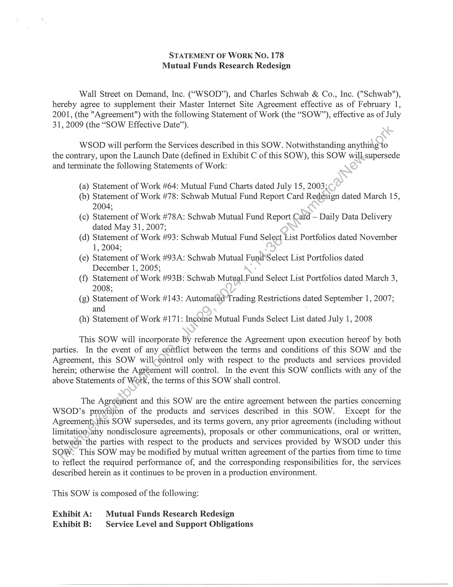
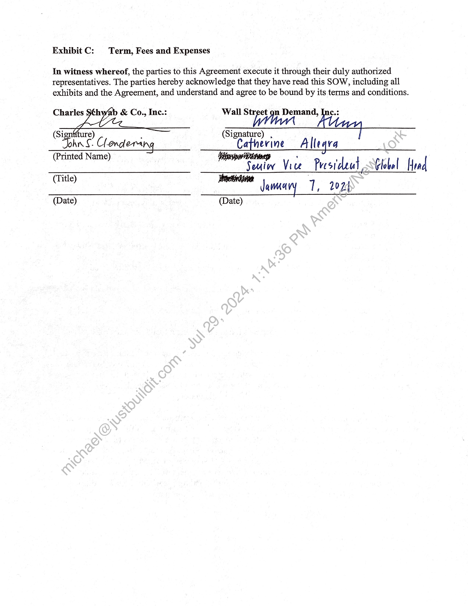
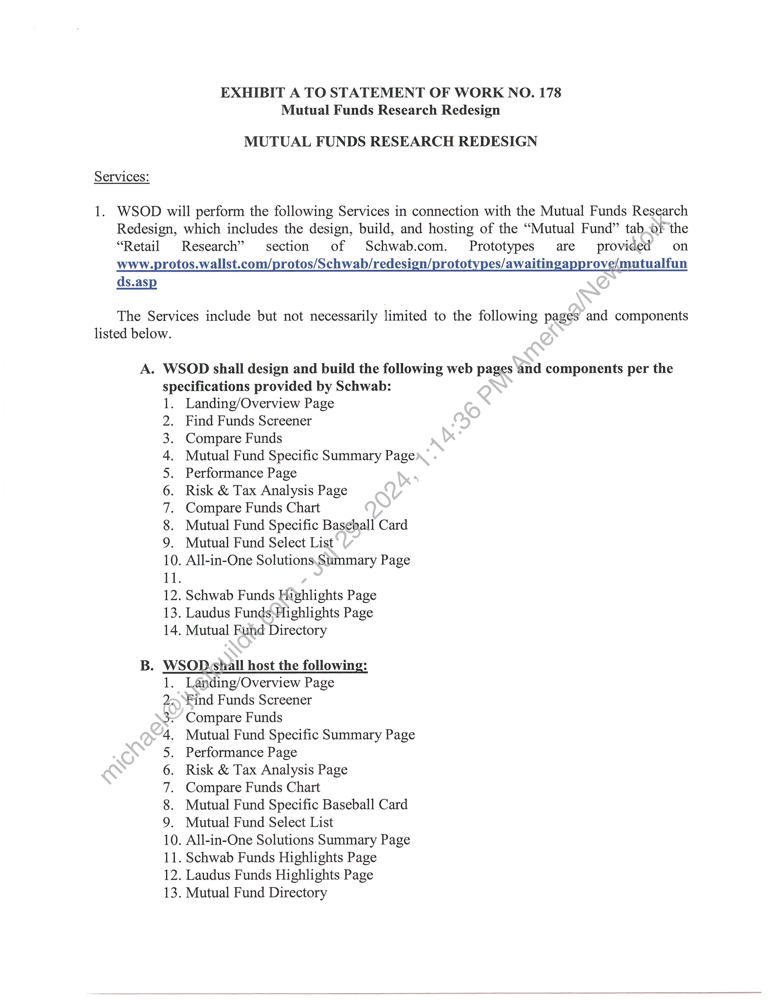
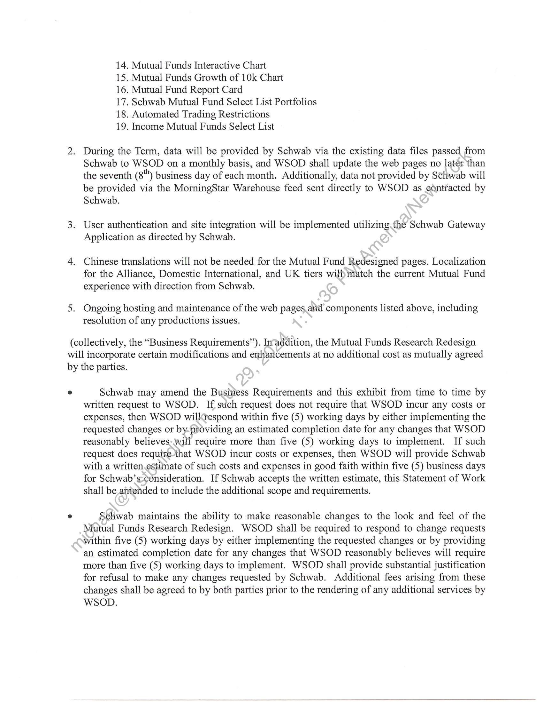
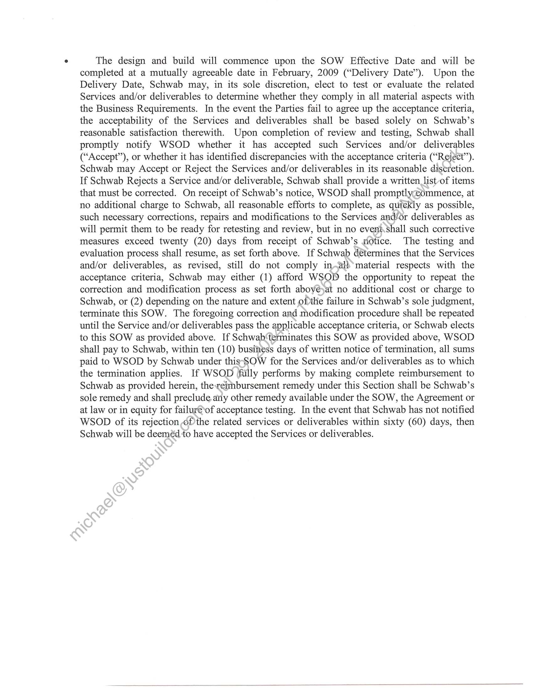
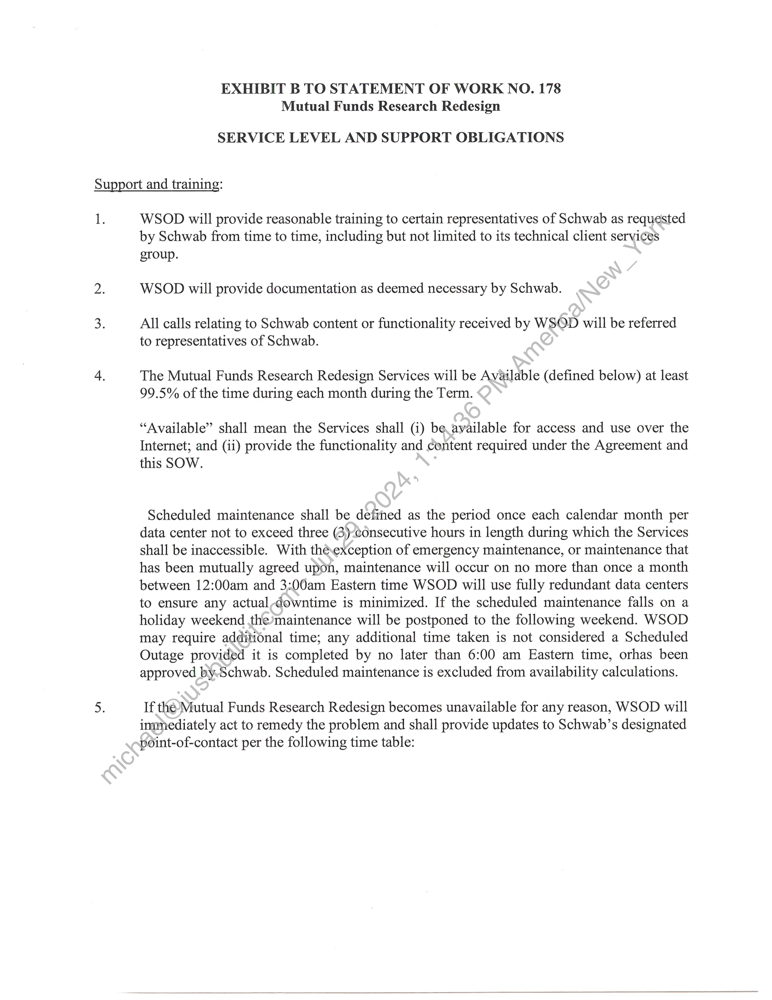
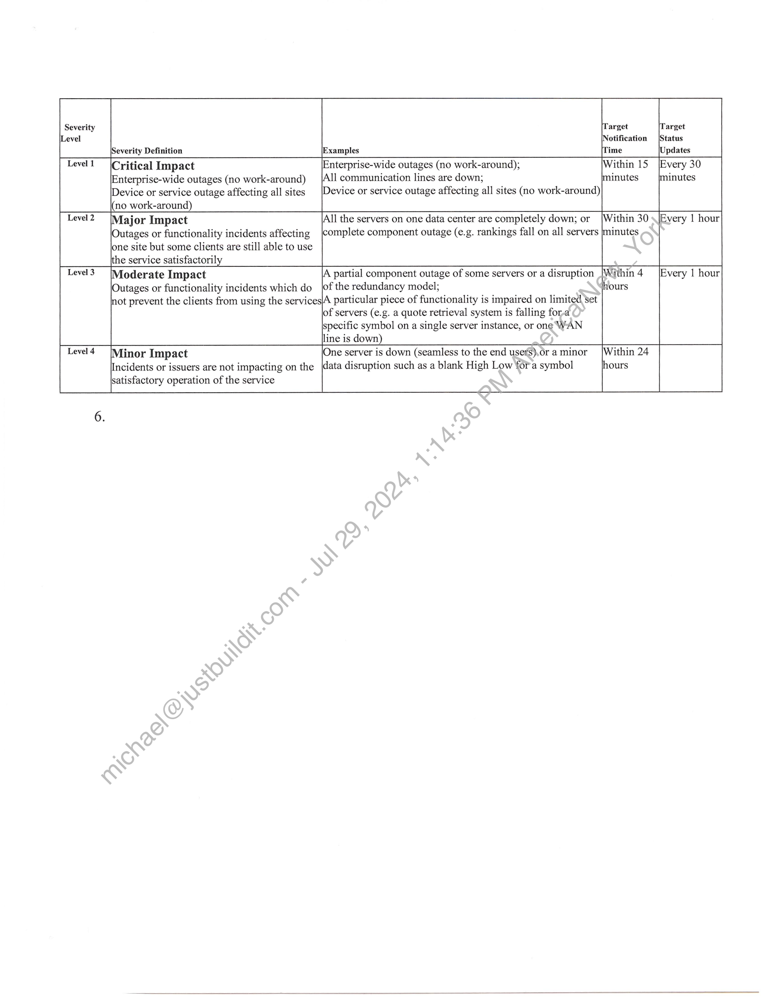
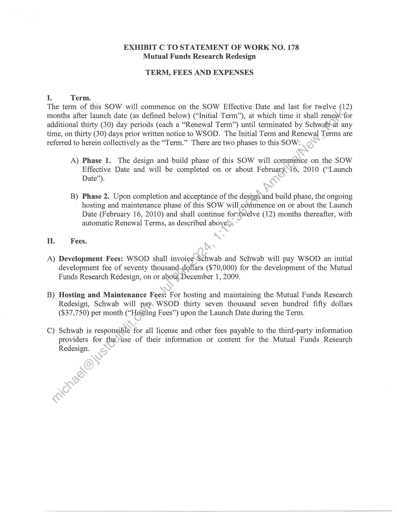

##### Statement of Work No. 178: Mutual Funds Research Redesign]

  
````col
```col-md
flexGrow=.5
===
> [!info] [Page 1](_attachments/images_Schwab-3.6.1.18.4800152862.pdf_210535/page_1.png)
> 
```  
```col-md
STATEMENT OF WORK NO. 178
Mutual Funds Research Redesign  
Wall Street on Demand, Inc. (“WSOD”), and Charles Schwab & Co., Inc. ("Schwab"),
hereby agree to supplement their Master Internet Site Agreement effective as of February 1,
2001, (the "Agreement") with the following Statement of Work (the “SOW”), effective as of July
31, 2009 (the “SOW Effective Date”).  
WSOD will perform the Services described in this SOW. Notwithstanding anything to
the contrary, upon the Launch Date (defined in Exhibit C of this SOW), this SOW will supersede
and terminate the following Statements of Work:  
(a) Statement of Work #64: Mutual Fund Charts dated July 15, 2003;  
(b) Statement of Work #78: Schwab Mutual Fund Report Card Redesign dated March 15,
2004;  
(c) Statement of Work #78A: Schwab Mutual Fund Report Card — Daily Data Delivery
dated May 31, 2007;  
(d) Statement of Work #93: Schwab Mutual Fund Select List Portfolios dated November
1, 2004;  
(e) Statement of Work #93A: Schwab Mutual Fund‘Select List Portfolios dated
December 1, 2005;  
(f) Statement of Work #93B: Schwab Mutual.Fund Select List Portfolios dated March 3,
2008;  
(g) Statement of Work #143: Automated Trading Restrictions dated September 1, 2007;
and  
(h) Statement of Work #171: Income Mutual Funds Select List dated July 1, 2008  
This SOW will incorporate by reference the Agreement upon execution hereof by both
parties. In the event of any conflict between the terms and conditions of this SOW and the
Agreement, this SOW will-control only with respect to the products and services provided
herein; otherwise the Agreement will control. In the event this SOW conflicts with any of the
above Statements of Work, the terms of this SOW shall control.  
The Agreeiient and this SOW are the entire agreement between the parties concerning
WSOD’s provision of the products and services described in this SOW. Except for the
Agreement;this SOW supersedes, and its terms govern, any prior agreements (including without
limitation,any nondisclosure agreements), proposals or other communications, oral or written,
between the parties with respect to the products and services provided by WSOD under this
SQW: This SOW may be modified by mutual written agreement of the parties from time to time
to reflect the required performance of, and the corresponding responsibilities for, the services
described herein as it continues to be proven in a production environment.  
This SOW is composed of the following:  
Exhibit A: | Mutual Funds Research Redesign
Exhibit B: | Service Level and Support Obligations  
```
````
Notes:    
````col
```col-md
flexGrow=.5
===
> [!info] [Page 2](_attachments/images_Schwab-3.6.1.18.4800152862.pdf_210535/page_2.png)
> 
```  
```col-md
Exhibit C: Term, Fees and Expenses
In witness whereof, the parties to this Agreement execute it through their duly authorized  
representatives. The parties hereby acknowledge that they have read this SOW, including all
exhibits and the Agreement, and understand and agree to be bound by its terms and conditions.  
Charles te ys & Co., Inc.: Wall Str ea n Demand,
re ee pan 24.27  
Dehn Clondering pectin erine ___ Catherine Allegra sO V4
Ce ener Vice Presideut Fol Global weet ey pet ha  
Jammary 1, 2074  
(Date) (Date)  
(Title)  
```
````
Notes:    
````col
```col-md
flexGrow=.5
===
> [!info] [Page 3](_attachments/images_Schwab-3.6.1.18.4800152862.pdf_210535/page_3.png)
> 
```  
```col-md
1.  
EXHIBIT A TO STATEMENT OF WORK NO. 178
Mutual Funds Research Redesign  
MUTUAL FUNDS RESEARCH REDESIGN  
Services:  
WSOD will perform the following Services in connection with the Mutual Funds Research
Redesign, which includes the design, build, and hosting of the “Mutual Fund” tab.of the
“Retail Research” section of Schwab.com. Prototypes are provided on
www.protos.wallst.com/protos/Schwab/redesign/prototypes/awaitingapprove/mutualfun
ds.asp  
The Services include but not necessarily limited to the following pages and components  
listed below.  
A. WSOD shall design and build the following web pages and components per the
specifications provided by Schwab:
1. Landing/Overview Page
2. Find Funds Screener
3. Compare Funds
4. Mutual Fund Specific Summary Page
5. Performance Page
6. Risk & Tax Analysis Page
7. Compare Funds Chart
8. Mutual Fund Specific Baseball Card
9. Mutual Fund Select List
10. All-in-One Solutions.Summary Page  
12. Schwab Funds Highlights Page
13. Laudus FundsHighlights Page
14. Mutual Fund Directory  
B. WSOD shall host the following:Landing/Overview Page  
1  
2.Pind Funds Screener
3 Compare Funds
4. Mutual Fund Specific Summary Page
5. Performance Page  
6. Risk & Tax Analysis Page  
7. Compare Funds Chart  
8. Mutual Fund Specific Baseball Card
9. Mutual Fund Select List  
10. All-in-One Solutions Summary Page
11. Schwab Funds Highlights Page  
12. Laudus Funds Highlights Page  
13. Mutual Fund Directory  
```
````
Notes:    
````col
```col-md
flexGrow=.5
===
> [!info] [Page 4](_attachments/images_Schwab-3.6.1.18.4800152862.pdf_210535/page_4.png)
> 
```  
```col-md
14. Mutual Funds Interactive Chart  
15. Mutual Funds Growth of 10k Chart  
16. Mutual Fund Report Card  
17. Schwab Mutual Fund Select List Portfolios
18. Automated Trading Restrictions  
19. Income Mutual Funds Select List  
2. During the Term, data will be provided by Schwab via the existing data files passed_from
Schwab to WSOD on a monthly basis, and WSOD shall update the web pages no later than
the seventh (8) business day of each month. Additionally, data not provided by Schwab will
be provided via the MorningStar Warehouse feed sent directly to WSOD as contracted by
Schwab.  
3. User authentication and site integration will be implemented utilizing the Schwab Gateway
Application as directed by Schwab.  
4. Chinese translations will not be needed for the Mutual Fund Redesigned pages. Localization
for the Alliance, Domestic International, and UK tiers wilh match the current Mutual Fund
experience with direction from Schwab.  
5. Ongoing hosting and maintenance of the web pages and components listed above, including
resolution of any productions issues.  
(collectively, the “Business Requirements”). Inaddition, the Mutual Funds Research Redesign
will incorporate certain modifications and enhancements at no additional cost as mutually agreed
by the parties.  
° Schwab may amend the Business Requirements and this exhibit from time to time by
written request to WSOD. If such request does not require that WSOD incur any costs or
expenses, then WSOD willtespond within five (5) working days by either implementing the
requested changes or by.providing an estimated completion date for any changes that WSOD
reasonably believes: will require more than five (5) working days to implement. If such
request does require-that WSOD incur costs or expenses, then WSOD will provide Schwab
with a written.estimate of such costs and expenses in good faith within five (5) business days
for Schwab’s-consideration. If Schwab accepts the written estimate, this Statement of Work
shall be amended to include the additional scope and requirements.  
° Schwab maintains the ability to make reasonable changes to the look and feel of the
Mutual Funds Research Redesign. WSOD shall be required to respond to change requests
within five (5) working days by either implementing the requested changes or by providing
an estimated completion date for any changes that WSOD reasonably believes will require
more than five (5) working days to implement. WSOD shall provide substantial justification
for refusal to make any changes requested by Schwab. Additional fees arising from these
changes shall be agreed to by both parties prior to the rendering of any additional services by
WSOD.  
```
````
Notes:    
````col
```col-md
flexGrow=.5
===
> [!info] [Page 5](_attachments/images_Schwab-3.6.1.18.4800152862.pdf_210535/page_5.png)
> 
```  
```col-md
The design and build will commence upon the SOW Effective Date and will be
completed at a mutually agreeable date in February, 2009 (“Delivery Date”). Upon the
Delivery Date, Schwab may, in its sole discretion, elect to test or evaluate the related
Services and/or deliverables to determine whether they comply in all material aspects with
the Business Requirements. In the event the Parties fail to agree up the acceptance criteria,
the acceptability of the Services and deliverables shall be based solely on Schwab’s
reasonable satisfaction therewith. Upon completion of review and testing, Schwab shall
promptly notify WSOD whether it has accepted such Services and/or deliverables
(“Accept”), or whether it has identified discrepancies with the acceptance criteria (“Reject”).
Schwab may Accept or Reject the Services and/or deliverables in its reasonable discretion.
If Schwab Rejects a Service and/or deliverable, Schwab shall provide a written list of items
that must be corrected. On receipt of Schwab’s notice, WSOD shall promptlyccommence, at
no additional charge to Schwab, all reasonable efforts to complete, as quickly as possible,
such necessary corrections, repairs and modifications to the Services and/or deliverables as
will permit them to be ready for retesting and review, but in no event.shall such corrective
measures exceed twenty (20) days from receipt of Schwab’s sotice. The testing and
evaluation process shall resume, as set forth above. If Schwab determines that the Services
and/or deliverables, as revised, still do not comply in~al)*material respects with the
acceptance criteria, Schwab may either (1) afford WSOD the opportunity to repeat the
correction and modification process as set forth aboyéyat no additional cost or charge to
Schwab, or (2) depending on the nature and extent ofthe failure in Schwab’s sole judgment,
terminate this SOW. The foregoing correction and modification procedure shall be repeated
until the Service and/or deliverables pass the applicable acceptance criteria, or Schwab elects
to this SOW as provided above. If Schwah‘tetminates this SOW as provided above, WSOD
shall pay to Schwab, within ten (10) business days of written notice of termination, all sums
paid to WSOD by Schwab under this-"SOW for the Services and/or deliverables as to which
the termination applies. If WSOD fully performs by making complete reimbursement to
Schwab as provided herein, the-reimbursement remedy under this Section shall be Schwab’s
sole remedy and shall preclude any other remedy available under the SOW, the Agreement or
at law or in equity for failureé\of acceptance testing. In the event that Schwab has not notified
WSOD of its rejection ofthe related services or deliverables within sixty (60) days, then
Schwab will be deeméd to have accepted the Services or deliverables.  
```
````
Notes:    
````col
```col-md
flexGrow=.5
===
> [!info] [Page 6](_attachments/images_Schwab-3.6.1.18.4800152862.pdf_210535/page_6.png)
> 
```  
```col-md
EXHIBIT B TO STATEMENT OF WORK NO. 178
Mutual Funds Research Redesign  
SERVICE LEVEL AND SUPPORT OBLIGATIONS  
Support and training:  
1.  
WSOD will provide reasonable training to certain representatives of Schwab as requested
by Schwab from time to time, including but not limited to its technical client services  
group.
WSOD will provide documentation as deemed necessary by Schwab.  
All calls relating to Schwab content or functionality received by WSQD will be referred
to representatives of Schwab.  
The Mutual Funds Research Redesign Services will be Available (defined below) at least
99.5% of the time during each month during the Term.  
“Available” shall mean the Services shall (i) beavailable for access and use over the
Internet; and (ii) provide the functionality and content required under the Agreement and
this SOW.  
Scheduled maintenance shall be defied as the period once each calendar month per
data center not to exceed three (3)consecutive hours in length during which the Services
shall be inaccessible. With theexception of emergency maintenance, or maintenance that
has been mutually agreed upon, maintenance will occur on no more than once a month
between 12:00am and 3:00am Eastern time WSOD will use fully redundant data centers
to ensure any actual-downtime is minimized. If the scheduled maintenance falls on a
holiday weekend the maintenance will be postponed to the following weekend. WSOD
may require additional time; any additional time taken is not considered a Scheduled
Outage provided it is completed by no later than 6:00 am Eastern time, orhas been
approved by.Schwab. Scheduled maintenance is excluded from availability calculations.  
If thé’ Mutual Funds Research Redesign becomes unavailable for any reason, WSOD will
inmmediately act to remedy the problem and shall provide updates to Schwab’s designated
podint-of-contact per the following time table:  
```
````
Notes:    
````col
```col-md
flexGrow=.5
===
> [!info] [Page 7](_attachments/images_Schwab-3.6.1.18.4800152862.pdf_210535/page_7.png)
> 
```  
```col-md
Severity [Target [Target
ILevel Notification [Status
Severity Definition Examples [Time |Updates
Level! (Critical Impact |Enterprise-wide outages (no work-around); |Within 15 [Every 30
Enterprise-wide outages (no work-around) |All communication lines are down; iminutes minutes
Device or service outage affecting all sites [Device or service outage affecting all sites (no work-around)
(no work-around)
Level2 [Major Impact |All the servers on one data center are completely down; or {Within 30 .|Every 1 hour
|Outages or functionality incidents affecting |complete component outage (e.g. rankings fall on all servers |minutes
lone site but some clients are still able to use
ithe service satisfactorily
Level3 [Moderate Impact |A partial component outage of some servers or a disruption [Within 4 — |Every | hour
Outages or functionality incidents which do jof the redundancy model; hours
‘ot prevent the clients from using the services|A particular piece of functionality is impaired on limited Set
lof servers (e.g. a quote retrieval system is falling for-a
specific symbol on a single server instance, or ong WAN
lline is down)
Level4 [Minor Impact \One server is down (seamless to the end users),or a minor —|Within 24
Incidents or issuers are not impacting on the |data disruption such as a blank High Low fora symbol ours  
satisfactory operation of the service  
```
````
Notes:    
````col
```col-md
flexGrow=.5
===
> [!info] [Page 8](_attachments/images_Schwab-3.6.1.18.4800152862.pdf_210535/page_8.png)
> 
```  
```col-md
EXHIBIT C TO STATEMENT OF WORK NO. 178
Mutual Funds Research Redesign  
TERM, FEES AND EXPENSES  
I. Term.  
The term of this SOW will commence on the SOW Effective Date and last for twelve (12)
months after launch date (as defined below) (“Initial Term’), at which time it shall renew>for
additional thirty (30) day periods (each a “Renewal Term”) until terminated by Schwab*at any
time, on thirty (30) days prior written notice to WSOD. The Initial Term and Renewal Terms are
referred to herein collectively as the “Term.” There are two phases to this SOW:  
A) Phase 1. The design and build phase of this SOW will comméetice on the SOW
Effective Date and will be completed on or about February ™16, 2010 (“Launch
Date”).  
B) Phase 2. Upon completion and acceptance of the design and build phase, the ongoing
hosting and maintenance phase of this SOW will commence on or about the Launch
Date (February 16, 2010) and shall continue formtwelve (12) months thereafter, with
automatic Renewal Terms, as described above!)  
II. Fees.  
A) Development Fees: WSOD shall invoi¢e\Schwab and Schwab will pay WSOD an initial
development fee of seventy thousand-dollars ($70,000) for the development of the Mutual
Funds Research Redesign, on or about December 1, 2009.  
B) Hosting and Maintenance Fees: For hosting and maintaining the Mutual Funds Research
Redesign, Schwab will pay. WSOD thirty seven thousand seven hundred fifty dollars
($37,750) per month (“Hosting Fees”) upon the Launch Date during the Term.  
C) Schwab is responsible for all license and other fees payable to the third-party information
providers for theduse of their information or content for the Mutual Funds Research
Redesign.  
```
````
Notes:  


![[_attachments/Schwab-3.6.1.18.48 00152862.pdf]