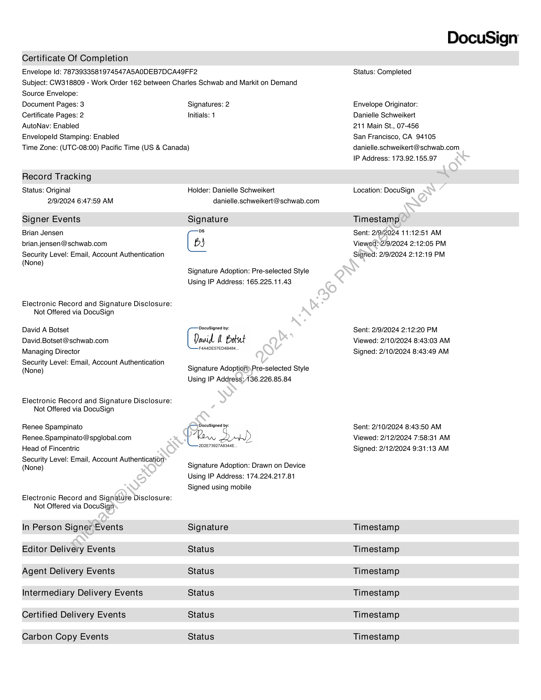
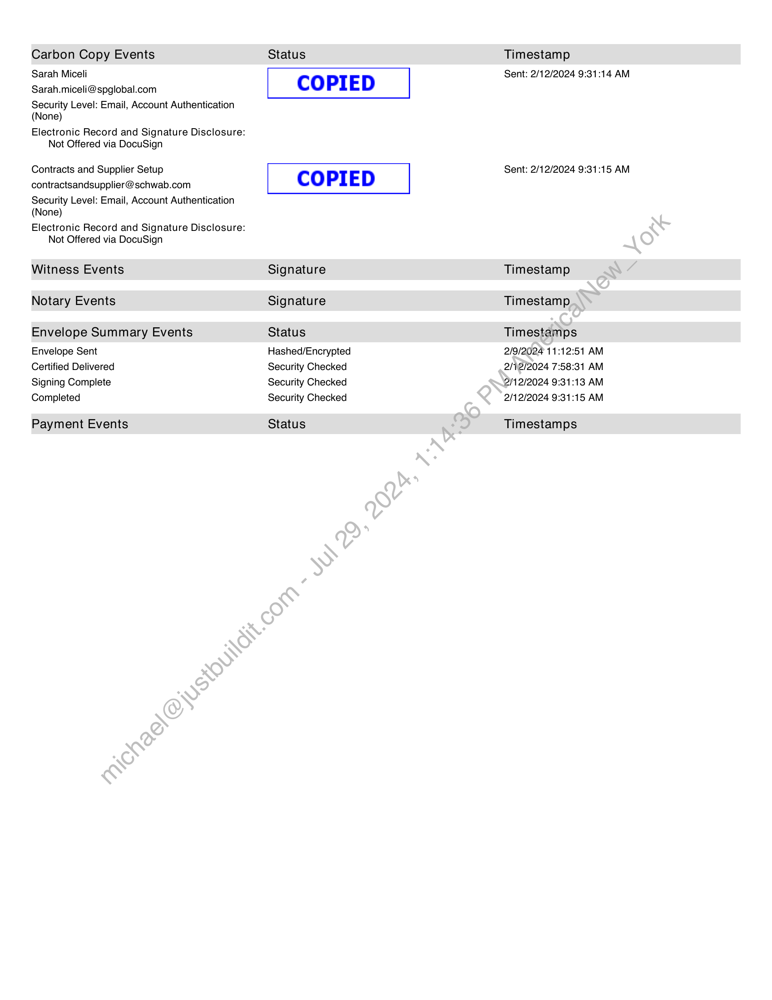

##### Work Order No. 162: Data Update: StateStreet to Morningstar]

  
````col
```col-md
flexGrow=.5
===
> [!info] [Page 1](_attachments/images_Schwab-3.6.1.18.500147811.pdf_210313/page_1.png)
> 
```  
```col-md
DocuSign Envelope ID: 78739335-8197-4547-A5A0-DEB7DCA49FF2  
WORK ORDER NO. 162
Data Update: StateStreet to Morningstar  
This Work Order No. 162 (the “Work Order’), effective as of the Start Date set forth below, is a part of and incorporated
into the Development and Hosting Agreement between Charles Schwab & Co., Inc. (“Schwab”) and Markit On Demand,
Inc., formerly known as Wall Street On Demand, Inc. (“Contractor”), dated September 1, 2003, as amended
(‘Agreement’). Capitalized terms not defined in this Work Order are as defined in the Agreement. In the event of any
conflict between the Agreement and this Work Order, the terms of the Agreement shall govern.  
1. Contacts:
Contractor Representative: Sarah Miceli
Address: 5775 Flatiron Parkway
Boulder, CO 80301
Telephone number: 303-583-4288
Email address: sarah.miceli@spglobal.com
Schwab Representative: David Botset
Address: 150 S. Wacker Dr
Chicago, IL 60606
Telephone number: 312-517-4137
Email address: david.botset@schwab.com
Schwab Representative: Brooke Johnson
Address: 9800 Schwab Way
Lone Tree, CO 80124-5377
Telephone number: N/A
Email address: brooke.johnson@schwab.com
2. Term of Work Order:
Start Date: February 43,2024
Estimated Completion Date: June 152024
3. Services to be Performed; Schedule of Deliverables/Milestones; Specifications; Acceptance Criteria;
Due Dates:
A. Services to be Performed.and-Deliverables, Specifications:  
Contractor will replace StateStreet data with Morningstar data throughout the Schwab sites.  
Specifications, requirements’ and assumptions:
e Update Ul-and UX for Schwab ETF holding pages to align with other ETF holding pages.
e All holdings jocations should be updated with the changes (zoomed views/popouts, etc).
e Replace data for all data points identified across solutions called out in locations set forth herein (from
StateStreet to Morningstar data).
e - Holdings locations are set forth below and in-scope data replacement is further defined within Appendix
A attached hereto:
Legacy
Beta (SPA)
Prospect
SAC
Note: This does not include (i) CSIM’s site (schwabassetmanagement.com), which will keep StateStreet
data, or (ii) Tradesource
e Assumption: Schwab will provide Contractor with documentation of licensing for StateStreet data to remain
on CSIM's site  
O°  
ooo0o°0  
```
````
Notes:    
````col
```col-md
flexGrow=.5
===
> [!info] [Page 2](_attachments/images_Schwab-3.6.1.18.500147811.pdf_210313/page_2.png)
> 
```  
```col-md
DocuSign Envelope ID: 78739335-8197-4547-A5A0-DEB7DCA49FF2  
B. Schedule of Services and Deliverables; Milestones:
Service/Deliverable/Milestone Estimated Completion Date*
Project kick-off February 15, 2024  
Continual quality assurance (“QA”) by Contractor of | To be finalized prior to mutually agreed upon date in advance
data holdings and updates throughout development | of Launch Date (defined below)  
process. Schwab QA complete and Services and
Deliverables under this Work Order have been
Accepted  
Functionality moved to Contractor’s production At mutually agreed upon date
environment (“Launch Date”)  
* To the extent that certain Services or Deliverables under this Work Order depend on Schwab inputs, Contractor shall
not be liable for delays caused by Schwab or its agents.  
Cc. Acceptance Criteria:  
All Services and Deliverables provided under this Work Order are subject to Acceptance testing pursuant to Section 7
of the Agreement (except that upon completion of review and testing pursuant to the second’sentence of Section 7.2 of
the Agreement, Schwab shall notify Contractor whether it Accepts or Rejects such Service ‘and/or Deliverable under this
Work Order within twenty (20) business days from the date of submission of the Services and/or Deliverables) and will
be performed in accordance with the Specifications provided herein or as mutually agreed to in writing by both Parties.
4. Contractor IP:  
Listing of Contractor IP, if any, as required in Section 13.5 of the Agreement: None.  
5. Third Party IP:  
Listing of Third Party IP, if any, as required in Section 13.7 of thie Agreement: None.  
6. Payment Terms:  
A. Contract Sum: The total amount payable under this Work Order shall not exceed $165,000 (the “Contract
Sum’).  
B. Payment Schedule: Contractor shall‘invoice Schwab for the Contract Sum as follows:  
e $82,500 on March 1, 2024
e $82,500 no later than June4, 2024  
Cc. Reimbursable Expenses’Schwab will reimburse Contractor solely for documented expenses (“Reimbursable
Expenses’), up to a maximum of $0. All Reimbursable Expenses shall be included in, and not in addition to, the Contract
Sum.  
D. Invoices: Schwab will provide Contractor with a purchase order or contract control number (“Order Number’)  
for invoicing under.this Work Order. Contractor agrees that it will provide the Order Number on each invoice and that
no invoice will be, considered validly submitted under this Work Order without such Order Number. Whenever a purchase
order is issued‘by Schwab as provided herein, the Parties agree that any such issuance is for convenience of the issuer
and the terms’and conditions of any such purchase order are superseded by this Work Order and the Agreement.  
MARKIT ON DEMANByINC. CHARLES SCHWAB -€0@@x, INC.
By: “Row aod By: Dovid  otset  
Renee Spampinato David A Botset
Name: Name:
Title: Head of Fincentric Title: Managing Director
2/12/2024 | 9:31 AM PST 2/10/2024 | 8:43 AM PST
Date: Date:  
```
````
Notes:    
````col
```col-md
flexGrow=.5
===
> [!info] [Page 3](_attachments/images_Schwab-3.6.1.18.500147811.pdf_210313/page_3.png)
> 
```  
```col-md
DocuSign Envelope ID: 78739335-8197-4547-A5A0-DEB7DCA49FF2  
Appendix A to Work Order No. 162  
Legacy:
ETFs/SchwabETFs/ShowDetails
ETFs/CompareETFs/Chart
ETFs/CompareETFs/TearOffCompare
ETFs/Summary/EtfReportCard
ETFs/SchwabETFs/ETFsList
ETFs/SchwabETFs/SchwabETFs
ETFs/Summary/
Charts/growthTrends/portfolioHoldings
Retail/research/stocks/summary
ETFs/Summary/QuoteDetailsModule  
Prospect:
ETFs/portfolio
ETFs/summary
ETFs/reports/reportRetrieve
ETFs/schwabETF/index
Charts/interactive/popup
ETFs/chart  
ETFs/news
ETFs/performance
ETFs/portfolio
ETFs/technicals  
SPA:  
Equity Ratings
Fund Compare
Holdings
Reports  
ETF reportcard  
SAC:  
ETF Summary > Report Card
ETF Baseball card  
ETF Select list  
Holdings  
```
````
Notes:    
````col
```col-md
flexGrow=.5
===
> [!info] [Page 4](_attachments/images_Schwab-3.6.1.18.500147811.pdf_210313/page_4.png)
> 
```  
```col-md
Certificate Of Completion  
Envelope Id: 7873933581974547ASAODEB7DCA49FF2
Subject: CW318809 - Work Order 162 between Charles Schwab and Markit on Demand  
Source Envelope:  
Document Pages: 3  
Certificate Pages: 2  
AutoNav: Enabled  
Envelopeld Stamping: Enabled  
Signatures: 2
Initials: 1  
Time Zone: (UTC-08:00) Pacific Time (US & Canada)  
Record Tracking  
Status: Original
2/9/2024 6:47:59 AM  
Signer Events
Brian Jensen
brian.jensen@schwab.com  
Security Level: Email, Account Authentication
(None)  
Electronic Record and Signature Disclosure:  
Not Offered via DocuSign  
David A Botset
David.Botset@schwab.com
Managing Director  
Security Level: Email, Account Authentication
(None)  
Electronic Record and Signature Disclosure:  
Not Offered via DocuSign  
Renee Spampinato
Renee.Spampinato @spglobal.com
Head of Fincentric  
Security Level: Email, Account Authentication
(None)  
Electronic Record and Signature Disclosure:  
Not Offered via DocuSign
In Person Signer Events
Editor Delivery Events
Agent Delivery Events
Intermediary Delivery Events
Certified Delivery Events  
Carbon Copy Events  
Holder: Danielle Schweikert
danielle.schweikert@schwab.com  
Signature
bs
BJ
Signature Adoption: Pre-selected Style
Using IP Address: 165.225.11.43  
DocuSigned by:  
anid  Botset  
F4A4DES7ED4B484.  
Signature Adoption) Pre-selected Style
Using IP Address: 36.226.85.84  
-2D2E73927A8344E,  
Signature Adoption: Drawn on Device
Using IP Address: 174.224.217.81
Signed using mobile  
Signature
Status
Status
Status
Status  
Status  
DocuSign  
Status: Completed  
Envelope Originator:  
Danielle Schweikert  
211 Main St., 07-456  
San Francisco, CA 94105
danielle.schweikert@schwab.com
IP Address: 173.92.155.97  
Location: DocuSign  
Timestamp  
Sent: 2/9/2024 11:12:51 AM
Viewed 52/9/2024 2:12:05 PM
Sigried: 2/9/2024 2:12:19 PM  
Sent: 2/9/2024 2:12:20 PM
Viewed: 2/10/2024 8:43:03 AM
Signed: 2/10/2024 8:43:49 AM  
Sent: 2/10/2024 8:43:50 AM
Viewed: 2/12/2024 7:58:31 AM
Signed: 2/12/2024 9:31:13 AM  
Timestamp
Timestamp
Timestamp
Timestamp
Timestamp  
Timestamp  
```
````
Notes:    
````col
```col-md
flexGrow=.5
===
> [!info] [Page 5](_attachments/images_Schwab-3.6.1.18.500147811.pdf_210313/page_5.png)
> 
```  
```col-md
Carbon Copy Events
Sarah Miceli
Sarah.miceli@spglobal.com  
Security Level: Email, Account Authentication
(None)  
Electronic Record and Signature Disclosure:
Not Offered via DocuSign  
Contracts and Supplier Setup
contractsandsupplier@ schwab.com  
Security Level: Email, Account Authentication
(None)  
Electronic Record and Signature Disclosure:
Not Offered via DocuSign  
Witness Events
Notary Events  
Envelope Summary Events  
Envelope Sent
Certified Delivered
Signing Complete
Completed  
Payment Events  
Status  
COPIED  
COPIED  
Signature
Signature  
Status
Hashed/Encrypted
Security Checked
Security Checked
Security Checked  
Status  
Timestamp
Sent: 2/12/2024 9:31:14 AM  
Sent: 2/12/2024 9:31:15 AM  
Timestamp
Timestamp  
Timestamps  
2/9/2024 11:12:51 AM
2/12/2024 7:58:31 AM
2/12/2024 9:31:13 AM
2/12/2024 9:31:15 AM  
Timestamps  
```
````
Notes:  


![[_attachments/Schwab-3.6.1.18.5 00147811.pdf]