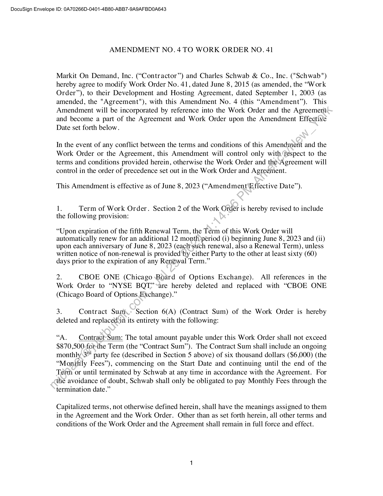
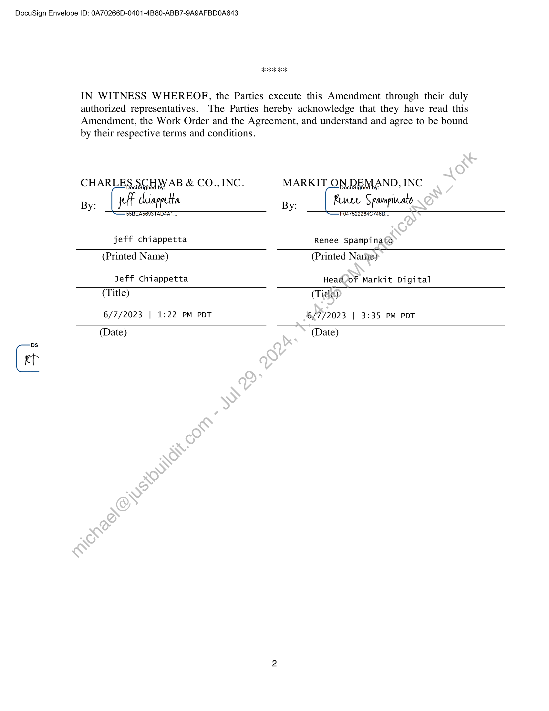

##### Amendment No. 4 to Work Order No. 41]

  
````col
```col-md
flexGrow=.5
===
> [!info] [Page 1](_attachments/images_Schwab-3.6.1.18.5100150086a.pdf_212149/page_1.png)
> 
```  
```col-md
DocuSign Envelope ID: 0A70266D-0401-4B80-ABB7-9A9AFBDO0A643  
AMENDMENT NO. 4 TO WORK ORDER NO. 41  
Markit On Demand, Inc. (“Contractor”) and Charles Schwab & Co., Inc. ("Schwab")
hereby agree to modify Work Order No. 41, dated June 8, 2015 (as amended, the “Work
Order”), to their Development and Hosting Agreement, dated September 1, 2003 (as
amended, the "Agreement"), with this Amendment No. 4 (this “Amendment”). This
Amendment will be incorporated by reference into the Work Order and the Agreement
and become a part of the Agreement and Work Order upon the Amendment Effective
Date set forth below.  
In the event of any conflict between the terms and conditions of this Amendment and the
Work Order or the Agreement, this Amendment will control only with Tespect to the
terms and conditions provided herein, otherwise the Work Order and the-Agreement will
control in the order of precedence set out in the Work Order and Agreement.  
This Amendment is effective as of June 8, 2023 (“Amendment ‘Effective Date”).  
1. Term of Work Order. Section 2 of the Work Order is hereby revised to include
the following provision:  
“Upon expiration of the fifth Renewal Term, the Term of this Work Order will
automatically renew for an additional 12 month»period (i) beginning June 8, 2023 and (ii)
upon each anniversary of June 8, 2023 (each*such renewal, also a Renewal Term), unless
written notice of non-renewal is provided 'by either Party to the other at least sixty (60)
days prior to the expiration of any Renewal Term.”  
2. CBOE ONE (Chicago Board of Options Exchange). All references in the
Work Order to “NYSE BQT”’-are hereby deleted and replaced with “CBOE ONE
(Chicago Board of Options Exchange).”  
3. Contract Sumi. Section 6(A) (Contract Sum) of the Work Order is hereby
deleted and replacedin its entirety with the following:  
“A. Contraet-Sum: The total amount payable under this Work Order shall not exceed
$870,500-for-the Term (the “Contract Sum’). The Contract Sum shall include an ongoing
monthly\3" party fee (described in Section 5 above) of six thousand dollars ($6,000) (the
“Monthly Fees”), commencing on the Start Date and continuing until the end of the
Tetm or until terminated by Schwab at any time in accordance with the Agreement. For
the avoidance of doubt, Schwab shall only be obligated to pay Monthly Fees through the
termination date.”  
Capitalized terms, not otherwise defined herein, shall have the meanings assigned to them
in the Agreement and the Work Order. Other than as set forth herein, all other terms and
conditions of the Work Order and the Agreement shall remain in full force and effect.  
```
````
Notes:    
````col
```col-md
flexGrow=.5
===
> [!info] [Page 2](_attachments/images_Schwab-3.6.1.18.5100150086a.pdf_212149/page_2.png)
> 
```  
```col-md
DocuSign Envelope ID: 0A70266D-0401-4B80-ABB7-9A9AFBDO0A643  
2K  
IN WITNESS WHEREOF, the Parties execute this Amendment through their duly
authorized representatives. The Parties hereby acknowledge that they have read this
Amendment, the Work Order and the Agreement, and understand and agree to be bound
by their respective terms and conditions.  
CHARLES. SCHWAB & CO., INC. MARKIT ON,.REMAND, INC
By: jt chiapputa By: Kure Spampinato  
SSBEASCIS TADAAT  
jeff chiappetta Renee Spampinato
(Printed Name) (Printed Nariie)  
Jeff Chiappetta Head of Markit Digital
(Title) (Title)
6/7/2023 | 1:22 PM PDT 6/7/2023 | 3:35 PM PDT
(Date) (Date)  
C  
```
````
Notes:  


![[_attachments/Schwab-3.6.1.18.51 00150086 a.pdf]