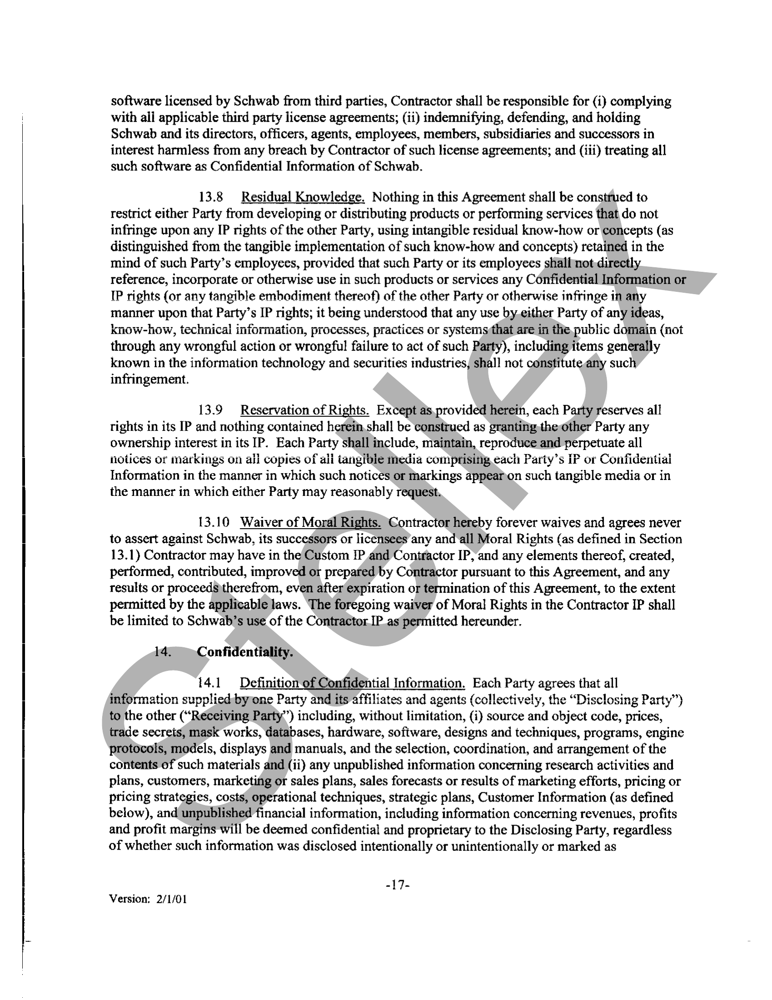
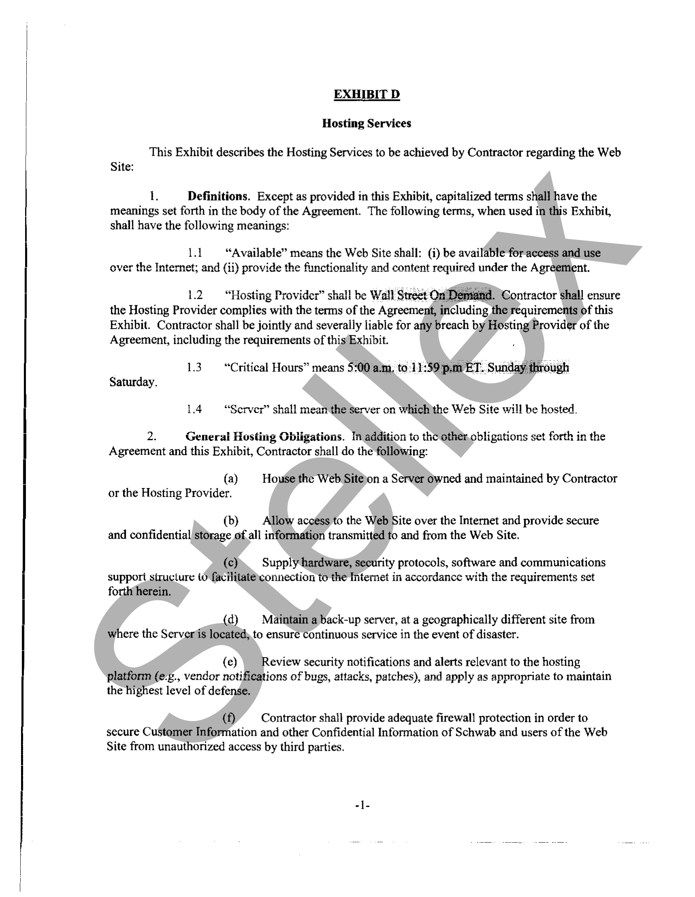

##### Development and Hosting Agreement]

  
````col
```col-md
flexGrow=.5
===
> [!info] [Page 1](_attachments/images_Schwab-3.6.1.18.53SchwabMSA.pdf_205952/page_1.png)
> 
```  
```col-md
DEVELOPMENT AND HOSTING AGREEMENT  
This Development and Hosting Agreement is made and effective as of September:1, 2003,
(“Effective Date”), by and between Charles Schwab & Co., Inc. (“Schwab”) and Wall Street on
Demand, Inc. (“Contractor”). When used herein the term “Agreement” is meant to include,
collectively, the body of this Development and Hosting Agreement and any and all Exhibits and
other documents attached hereto.  
Recitais  
A. Schwab desires to engage Contractor to develop a database“of information regarding
Investment Advisors who desire to sell their businesses or purchase the businesses of other
Investment Advisors, alll as more re particularly described in the attached Work Orders. TiN gatabase  
hen noha eiteaccecc)
Internet (the “Web Site” C Contractor has represented that it has the necessary programming,
development, and hosting skills necessary to create such a database and Web Site.  
B. In creating and providing the database and Web Site, Contractor may provide
Schwab with certain pre-existing software that Contractor has developed (the “Licensed
Software’), as more particularly describédjin Exhibit B. Some or all ofsuchJuicensed Software
may be hosted solely on Contractor’s servers.ySchwab shall not be entitled to possession of the
source or object code for such items of License Software, exceptias expressly described herein.  
B. Schwab desires io license ihe Licensed Software and obtain from Contractor the
Development and other professional services described herein, including, but not limited to,
support and maintenance, customization, implementation, andtraining services (collectively, the
“Services”), all as more particularly described herein. The Servites to be provided by Contractor
are set forth in this Agreement and such Work Orders(as defined below) as the parties may
mutually agree upon.  
Agreement  
In consideration of the foregoing Recitals (which are incorporated herein) and the mutual
covenants/amdpagreements contained herein, the parties hereto agree as follows:  
1. Term.  
ld Initialand Renewal Terms for Support and Services. This Agreement shall
commence asof the Lffective Date and shal! remain in effect for two (2) years thereafter, unless
earlier,terminated as provided herein (the “Initial Term”). Upon the expiration of the Initial Term,
Schwab may, at its option, extend this Agreement for up to five (5) additional consecutive one (1)
year terms (cach a “Renewal Term’) by providing written notice to Contractor at least thirty (30)
days prior to the expiration of the pending term; provided that if Schwab does not exercise its
option to extendjatithe end of the Initial Term, or any Renewal Term, the remaining option(s) shall
automatically lapse. The Initial Term and any Renewal Terms are referred to herein collectively as
the “Term.” Contractor shall provide Schwab with at least sixty (60) days prior written notice of  
-[Version: 2/1/01  
```
````
Notes:    
````col
```col-md
flexGrow=.5
===
> [!info] [Page 2](_attachments/images_Schwab-3.6.1.18.53SchwabMSA.pdf_205952/page_2.png)
> 
```  
```col-md
e end of the Initial Term and each Renewal Term. Such notice shall identify any fee increase  
Ane: ‘er that te Commence  
~ahie to the R arn T ic ahout to
Hie tO ine NENnewal 1 iii that is adout to Commence.  
=a  
1.2 Work Orders; License. The commencement and termination dates for Work
Orders shall be as provided in each Work Order. Termination or expiration of the Term (except for
termination for breach by Schwab of Sections 3 (Licensed Software), 13 (Intellectual Property), or
14 (Confidentiality)), shall not effect the license granted in Section 3 (Licensed Software). Such
license shall continue in perpetuity. The “Term” referred to herein relates solely to the provision of
Services hereunder and not to the term of the license granted in Sections 3 (Licensed Software)
which is perpetual.  
2. Identification of Parties.  
2.1 Contractor; No Subcontracting. Contractor shaii perform the obligations
described in this Agreement or in the Work Orders itself and throughits direct wholly-owned
subsidiaries, provided such subsidiaries are disclosed in writingto Schwab. Alljreferences to
Contractor in this Agreement shall be deemed to include all such subsidiaries, Contractor may not
assign, delegate or subcontract this Agreement nor any of its rights, dutiés or obligations under this
Agreement without Schwab’s prior express wfitfen consent. Any purported assignment or
delegation not consented to by Schwab shall be void)at Schwab’s option and shall constitute a
material breach of this Agreement. Contractor acknowledges that Schwab has.entered this
Agreement in reliance on Contractor’s ability and agreement,to personally perform its obligations
hereunder. In the event Schwab consents to any,subcontracting, Contractor shall, on request by
Schwab, provide Schwab with a copy of each subcontractor agreement. Notwithstanding any
Schwab consent to any subcontracting, (@} Contractor shall remain responsible for any and all
performance required under this Agreement, including, but.not limited to, the obligation to properly
supervise, coordinate, and perform, all/work required hereunder, and no subconiract shaii bind or
purport to bind Schwab; and (ii) such consent shalPhbe subject to)Schwab’s right under Section 6.6
(Contractor Staff Approval) to approve or disapprove. any personnel assigned to provide work
hereunder.  
2/2 » Schwab. The rights and obligations of Schwab may be, in whole or in part,
exercised or fulfilled by its parent and their respective affiliates, joint ventures, and subsidiaries.
Schwab reserves the right to assign its rights and obligations hereunder, as it deems appropriate.  
2.3 Parties. Contractor and Schwab may be referred to in this Agreement
individually as a “Party” and together as the “Parties.”  
24  Reptesentatives, “Contractor Representative” or “Schwab
Representative” means the person(s) designated as such in a Work Order, or such other person as
may. bestbsequently designated by Contractor or by Schwab, respectively, in writing as its
representative for purposes of a Work Order. All instructions, approvals, submissions, notices, or
any other communications or transactions which must be made to or by one Party to the other
pursuant to this Agreement must be made through each Party’s Representative, and as otherwise
provided in Section 27.4 (Notices).  
3. Licensed Software.  
-2Version: 2/1/01  
```
````
Notes:    
````col
```col-md
flexGrow=.5
===
> [!info] [Page 3](_attachments/images_Schwab-3.6.1.18.53SchwabMSA.pdf_205952/page_3.png)
> 
```  
```col-md
3.1 License Grant. Subject to the terms and conditions of this Agreement,  
Contractor grants to Schwab during the Term a world-wide, non-exclusive license to use the
Licensed Software and Documentation (as defined below) for its business activities. For purposes
of this Agreement, the term “Documentation” shali mean all of Contractor’s training course
materials, system specifications and technical manuals, and all other user instructions regarding the
capabilities, operation, and use of the Licensed Software, including, but not limited to, online help
screens contained in the Licensed Software. The Licensed Software shall not in any way be
disassembled, decompiled or reverse engineered, nor shall any attempt to do same be undertaken or
knowingly permitted by Schwab, except to the extent permitted by applicable law.
Notwithstanding the foregoing, certain items of Licensed Software wiil be hosted solely on
Contractor’s servers (“Hosted Software”). All such Hosted Software shall beidentified as.such on
Exhibit B. Contractor shall provide Schwab with access to and use of the Hosted Software as
described herein, but Schwab shall not be entitled to receive object or source code for such  
software (except as provided in Section 4).
4. Self Escrow of Source Materials.  
4.1 Self Escrow. Contractonjshall deposit with Schwab the Source Code (as
defined below) for the Licensed Software. In addition, Contractor shall also deposit with Schwab
the Source Code for any modifications, updates, enhancements, corrections, patches,
improvements, and new releases of Licensed Software that are made availabletto Schwab under this
Agreement within thirty (30) days of their general availability. Except as provided in Section 4.2
(Source Code Release Conditions), Schwab shalbhold the Souree Code in strict confidence and not
use it for any purpose unless one of the conditions described in Section 4.2 has occurred which
would permit Schwab to use the Source Code to provide its own support and maintenance. The
parties acknowledge that as a result of the passage of timejalone, the deposited Source Code may be
susceptible to loss of quality (“Natural Degeneration”). For the purpose of reducing the risk of
Natural Degeneration, Contractorshall deliver to Schwab a new copy of all deposited Source Code
every two (2) years during the Term. In the event the’Source Code or any part of it is inadvertently
destroyed or corrupted, Schwab has the right to request a replacement copy of the Source Code
from Contractor./ Contractor shall deliver the replacement copy of the Source Code within thirty
(30) days of receipt of Schwab’s written request. Schwab will pay Contractor’s reasonable costs
incurred in providing the replacement copys  
4.2 Source Code Release Conditions. Upon the occurrence of one of the
following events (collectively referred tovas “Release Conditions”), Schwab shall have the right to  
ts (collectivel Release Co: , Schwab shal! have the righ
immediately begin using the Source Code for its own support and maintenance, at no charge to
Schwab: (1) the insolvency of Contractor, (2) the making of a general assignment by Contractor
for the benefitof its creditorsjor a filing of a voluntary or involuntary petition in bankruptcy by or
against Contractor that is not dismissed within thirty (30) days of the filing thereof; (3) in the event
Contractor ceases to maintain and support the Licensed Software as required hereunder for reasons
other than Schwab’s failure to pay for, or election not to receive, Contractor’s maintenance and
support services, and nother qualified entity has assumed the obligation to maintain and support  
the Licensed)Software; or (4) termination of this Agreement for breach by Contractor.  
4.3" Schwab’s Right to Verify Source Code. Regardless of whether one of the  
conditions described in Section 4.2 (Source Code Release Conditions) occurs, Schwab shall have  
-3-  
Version: 2/1/01  
```
````
Notes:    
````col
```col-md
flexGrow=.5
===
> [!info] [Page 4](_attachments/images_Schwab-3.6.1.18.53SchwabMSA.pdf_205952/page_4.png)
> 
```  
```col-md
the right to verify the relevance, completeness, currency, accuracy, and functionality of the Source
Code by, among other things, compiling the Source Code and performing test runs fer comparison  
with Licensed Software.  
44 License of Source Code. Upon the occurrence of a Release Condition
identified in Section 4.2 (Source Code Release Conditions), Schwab shall have a perpetual licensed
to use the Licensed Software Source Code to perform its own support and maintenance, alter or
modify the Source Code, and/or obtain the benefits sought under this Agreement. Nothing herein
relieves Contractor of its obligation to provide support as provided in this Agreement. Should use
of the Source Code as provided in this Section involve the use or practice of any patent, copyright,
trade secret, trademark or other proprietary information in which Contractorhasyan interest,
Contractor, its assignee, or successors, agree not to assert a claim for patent, copyright, trade secret)
trademark or other proprietary information infringement against Schwab provided use of Licensed
Software and Source Code is in accordance with this Agreement. The license granted hereunder
n of this Agreement resulting from a Release Condition or other breach  
hall survi
shail survive any t  
by Contractor.  
4.5 Possession and Use of Source Code. Except as provided in this Section,
Source Code obtained by Schwab under the provisions of this Agreement shall remain subject to
every license restriction, proprietary rights protection)and other Schwab obligation specified in this
Agreement provided, however, Schwabdmay make such Source Code available:to third parties as
needed to assist it in making authorized use of the Licensed)Software. In no event shall Schwab be  
permitted to grant access to the Source Code to adirect competitor of Contractor. Except as  
provided herein, Schwab shall not be permitted to sell or transfer its.rights in the Source Code to
any other party. The Source Code shail be treated as Confideniiai infonnation of Contractor and
subject to the protections set forth herein for such information. When Source Code is not in use,
Schwab agrees to keep such Source €ode in a locked, secure place.  
46 Source Code—Defined. For purposes of this Agreement, “Source Code”
shall mean the source code of software and all related compiler command files, build scripts, scripts
relating to the operation and maintenance of such application, application programming interface
(API), graphical useninterface (GUI); object libraries, all relevant instructions on building the
object code of such application, and all documentation relating to the foregoing, such that
collectively the foregoing will be sufficient to enable a person possessing reasonable skill and
expertiselinjcomputer softwareyand information technology to build, load and operate the machineexecutable object code of such application, to maintain and support such application and to
effectively use all functions and features of such software.  
5. Continuous Product Support. If Contractor assigns this Agreement, is acquired,
or is otherwise conirolled by another individual or entity (collectively referred to as a “Successor
Event”) and subsequent to the Successor Event, the Licensed Software is not supported to at least
the same level that Contractor supported the Licensed Software because, for exampie, Coniracior’s
assignee chooses to support other products with similar functions, Schwab, at its sole option, may
elect to transfer the License, without cost or penalty, to another similar product (“Replacement
Product”)within Contractor’s assignee’s or successor’s product offering. The assignee or
successor, by taking benefit (including acceptance of any payment under this Agreement) ratifies
this Agreement. All terms and conditions of this Agreement shall continue in full force and effect  
-4.
Version: 2/1/01  
```
````
Notes:    
````col
```col-md
flexGrow=.5
===
> [!info] [Page 5](_attachments/images_Schwab-3.6.1.18.53SchwabMSA.pdf_205952/page_5.png)
> 
```  
```col-md
for the Replacement Product. In addition, the following terms and conditions shall apply if Schwab  
elects to transfer this License to a Replacement Product:  
A. Any prepaid maintenance and support shali transfer in full force and
effect for the balance of the Replacement Product’s maintenance and support term (or equivalent
service) at no additional cost. If the prepaid moneys are greater than the Replacement’s
Product’s maintenance and support fee for the same term, the credit balance will be‘applied to
future maintenance and support fees or returned to Schwab, at its option;  
B. Any and ali sofiware offered separately, and needed to match the
original Licensed Software’s level of functionality, shall be supplied by Contractor’s assignee or
successor without additional cost or penalty, and shall not affect the calculation of any  
maintenance and sun  
maintenance anc sup  
. ve reasonable training, for purposes of learning
the Replacement Product. Training shall be provided at no cost;  
D. All License termts,and conditions shall remain as granted herein with
no additional fees imposed on Schwab; and  
E. The definition of Licensed)Software shallthensmean the
Replacement Product.  
For purposes of this Section, the term “controlled” shall mean the legal right to elect a
majority of the directors of a corporation or similar officers of any otfier entity or to determine an
entity’s general management policies through contract or otherwise.  
6. Services and Deliverables.  
6.1 Work Orders. During the Term of this Agreement, Contractor shall perform
the “Services,” have the obligations to Schwab, produce the “Deliverables,” achieve the
“Milestones,” and retain‘the responsibilities described in the applicable Work Order(s) that make
reference to this Agreement. The terms\Services”, “Deliverables” and “Milestones” have the
meanings set forth in such Work Orders. Work Orders that make reference to this Agreement,
whetheraattached at the time of.execution hereof, or subsequent thereto, shall become valid and
enforceable when executed by the,Parties. All Work Orders shall be sequentially numbered and
attached to Exhibit A when executed)  
6.2 _ Hosting Services; Transition In-House. The Services to be provided by
Contractorereunder shall include the hosting services (“Hosting Services”) set forth in Exhibit D
relating to the Web Site. At any time during the Term, Schwab may, in its sole discretion, elect to
discontinue the Hosting Services and host the Web Site and Licensed Software itself or through one
of its agents. In such a case, Contractor shall provide Schwab with reasonable assistance in
transitioning hosting to an alternate provider. Contractor shall be paid for such services at the rates
set forth in Exhibit C or as otherwise mutually agreed by the Parties. Upon transition of hosting to
an alternate provider, Schwab’s obligation to pay the fees set forth in Exhibit B for Hosting
Services shail terminate.  
-5Version: 2/1/01  
```
````
Notes:    
````col
```col-md
flexGrow=.5
===
> [!info] [Page 6](_attachments/images_Schwab-3.6.1.18.53SchwabMSA.pdf_205952/page_6.png)
> 
```  
```col-md
6.3 Time. Time is of the essence with regard to Contractor’s performance of the  
6.4 Change Orders. Schwab may desire to have Contractor make significant  
custom modifications to the Services that were not contemplated by the parties when the Work
Order was created. If so, Schwab will submit a written change order to Contractor describing such
changes in appropriate detail (a “Change Order”). If a Change Order does not require Contractor
to incur any additional material costs or expenses, then it will make such modification within ten
(10) business days of its receipt of Schwab’s Change Order. If a Change Order does require that
Contractor incur additional matcrial costs or expenses, then Contractor in good faith will provide
Schwab with a written, high level, non-binding assessment of such costs andyexpenses and the time
required to perform the modifications required by the Change Order, within ten (10) business days
of its receipt of Schwab’s Change Order. Schwab will notify Contractor in writing within ten (10)
days after receipt of the Change Order response from Contractor as to whether Schwab wishes
Contractor to implement such Change Order based on such response. Schwab. will compensate
Contractor for implementation of a Change Order in accordance with the terms and conditions of
the relevant Change Order and Contractor’s statement, as provided prior te Contractor’s  
implementation of the Change Order, if any.  
6.5 Schwab Cooperation, Schwab,acknowledges that Contractor’s ability to
perform the Services will require Schwab,to perform certain tasks, which shall-be mutually agreed
upon and set forth in the applicable Work Order(s). Schwab hereby agrees to perform its
obligations in accordance with such requirements in a commeteially reasonable manner.  
Furthermore, the parties acknowledge that Schwab’s failure to perform its material obligations may
adversely affect Contractor’s ability to meet its performance obligations hereunder and the parties
hereby agree to negotiate in good faith to arrive at an equitable adjustment to the terms of this
Agreement to compensate Contractor for suchjadditional effort and costs directly caused by  
Schwab’s delay or failure to perform.  
6.6 Contractor Staff Approval. Schwab shall have the right to disapprove of any
member of Contractor’s project staff assigned to perform under this Agreement. Should Schwab be
dissatisfied with theperformance, competence, responsiveness, capabilities, cooperativeness, or
fitness for a particular task of any staff assigned by Contractor to perform services under this
Agreement, Schwab may request the replacement of that staff. The replacement request shall be in
writing,andupon receipt of the request, Contractor shall make reasonabie efforis to furnish a
qualified replacement within fifteen (15) business days. In the event Contractor should ever need
to remove any staff from performing)setvices under this Agreement, Contractor shall provide  
Schwab with adequatemotice, except in circumstances in which such notice is not possible, and
shall work with’Schwab on)a mutually agreeable transition plan so as to provide an acceptable
repiacement and ensure project continuity. Such transitioning to replacement personnel shall be at
no additional cost to Schwab. Contractor agrees that all project staff assigned to perform under this
Agreement must have experience with performing the tasks to which they wili be assigned under
this Agreement. In the event that, as a result of the actions or inaction of Contractor project staff,
additional work is required to perform this Agreement, Contractor shall perform all such work at no
additional chargé'to Schwab. In addition, Contractor represents and warrants that it will, to the
maximum extent possible, take all necessary steps to assure continuity over time of the membership
of the group constituting Contractor’s project staff. Contractor shall promptly fill any staff vacancy  
-6Version: 2/1/01  
```
````
Notes:    
````col
```col-md
flexGrow=.5
===
> [!info] [Page 7](_attachments/images_Schwab-3.6.1.18.53SchwabMSA.pdf_205952/page_7.png)
> 
```  
```col-md
with personnel having qualifications at least equivalent to those of the project staff member(s)
being replaced.  
6.7 Compliance with Applicable Laws; Security Requirements, Contracior shail
not place or permit to be placed on, or allow to be accessible from any Service or Deliverable any
material that violates any foreign, international, federal, state or local law or regulation, or the IP
(as defined in Section 13.1) rights of any third parties. Contractor shall comply with all applicable
laws, regulations, and rules that may be in effect during the Term of this Agreement as they
concern the subject matter of this Agreement, including, but not limited to, securing and
maintaining all appropriate visas, work permiis, business licenses, and other documentation and
clearances necessary for the performance of the Services and development ofitheDeliverables.  
6.8 Cooperation in Regulatory Compliance. Contractor shall reasonably
cooperate with Schwab with regard to regulatory compliance matters relating to the Services. Such
cooperation shall include, but is not limited to, responding in good faith to reasonable requests to
change or modify this Agreement as set forth in Section 27.6 (Entire Agreement) as it relates to
Schwab’s regulatory compliance. Additionally, on request by Schwab, Contractonshall submit to
Schwab all, or any portion of, Custom IP and/or Contractor IP (each as@efined in Section 13
(Intellectual Property)) for Schwab’s review for regulatory compliance and shall not make the
material publicly available until such time as Schwabjhas provided its written authorization.  
6.9 Affirmative Action. Contractor agrees, in connection with the performance  
nate against any & employee or applicant for  
afite ohhientinns nn oreaam
of its obligations under this Agreement, not to dis:  
employment because of race, sex, religion, color, national origin, disability or status as a covered
veteran. Uniess exempted, Section 202, paragraphs i through 7 of Executive Order 11246, as
amended, and the affirmative action clauses as set forth im41 C.F.R. § 60-741.4, 41 C.F.R. § 60250.4 and 41 C.F.R. § 61-250.10 (requiring theannual reporting of covered veterans) are  
incorporated herein by reference.  
6.10 Contractor Access to Schwab Facilities; Conduct of Contractor Personnel.
Contractor, its employees and agents, will be granted access to Schwab facilities subject to
compliance with Schwab’sstandard administrative and security requirements and policies, for the
purpose of performing the Services. Access to Schwab facilities shall be restricted to normal
Schwab business hours. Access to Schwab facilities outside normal business hours must be
approvedsimadvance by Schwab’s program manager, which approval will not be unreasonably
withheld. Contractor shall have no tenancy, or any other property or other rights in Schwab
Facilities. While present at Schwab facilitiés, Contractor’s personnel shall be accompanied by  
Schwab personnel,unless otherwise specified prior to such event by Schwab’s program manager or  
ified pri ab’s program manager or
his or her designee. Ali Contractor personnel shall carry and produce when requested a valid
Contractoridentification card, Contractor shail not in any way physicaily alter or improve any
Schwab facility without the prior written approval of Schwab in its sole and absolute discretion.
While at any Schwab facility, Contractor’s personnel, contractors, and subcontractors shall (1)
comply with Schwab’s requests, rules, policies, and regulations regarding personal and professional
conduct (including without limitation, the wearing of a particular uniform, identification badge, or
personal protective equipment and adhering to regulations and general safety practices or
procedures) and (2) otherwise conduct themselves in a professional and businesslike manner.  
-7Version: 2/1/01  
```
````
Notes:    
````col
```col-md
flexGrow=.5
===
> [!info] [Page 8](_attachments/images_Schwab-3.6.1.18.53SchwabMSA.pdf_205952/page_8.png)
> 
```  
```col-md
6.11 Damage to Schwab Facilities. Contractor shall repair, or cause to be  
ace to ab facilities. including. without limitation  
repaired, at its own cost, any and all damage to Schwab facilities, iiCiuaing, Winout umuitaton,
Schwab’s buildings, grounds, equipment, and furniture, caused by Contractor or employees or
agents of Contractor. Such repairs shall be made promptly after Contractor has become aware of
such damage, but in no event later than thirty (30) days after the occurrence. If Contractor fails to
make timely repairs, Schwab may make any necessary repairs. All costs incurred by Schwab, as
determined by Schwab, for such repairs shall be repaid by Contractor by cash payment upon
demand, or without limitation of Schwab’s other rights and remedies provided by law or under this
Agreement, Schwab may deduct such costs from any amounts due to Contractor from Schwab
under this Agreement.  
7. Acceptance Testing.  
7 Acceptance Criteria. The Licensed Software, Services, and Deliverables
may be subject to acceptance testing by Schwab, in its sole discretion, to verify that they satisfy the  
acceptance criteria mutually agreed | to by the Parties (the “Acceptance Criteria”), as developed in
accordance with the applicable Work Orders. Such Acceptance Criteria shall be based, atia
minimum, on conformance of the Licensed Software, Services, and Deliverables to the
specifications set forth in the Work Order and the requirements of this Agreement, and, to the
extent not inconsistent with the foregoing, the Documentation (collectively, the “Specifications”).
In the event the Parties fail to agree upomAcceptance Criteria, the accéptability of the Licensed  
Software, Services, and Deliverables shall bebascd solely on Schwab’s reasonable satisfaction  
th neous +h
therewith.  
a4 ance
7.2 Acceptance Testing by SchwabaTcimination. When Contractor notifies  
Schwab that it has completed a Service, Deliverable, or a)Milestone (if the Work Order provides for
Milestones) or that the Licensed Sofiware, or some portion thereof, is available for its use, Schwab
may, in its sole discretion, elect to’test or evaluate the related Licensed Software, Services, and/or
Deliverables to determine whether they comply in allanaterial respects with the Acceptance
Criteria. Upon completion of review and testing, Schwab shall promptly notify Contractor whether
it has accepted such Licensed Softwares Services, and/or Deliverables (“Accept”), or whether it has
identified discrepancies with the Acceptance Criteria (“Reject”). Schwab may Accept or Reject an
item of Licensed Software, Service, and/or Deliverable in its sole discretion. If Schwab Rejects an
item of Licensed Software, Service, and/or Deliverable, Schwab shall provide a written list of items
that must\belcorrected. On receipt of Schwab’s notice, Contractor shall promptly commence, at no
additional charge to Schwab, all reasonable efforts to complete, as quickly as possible, such
necessary corrections, repairs and modifications to the Licensed Software, Services, and/or
Deliverables as willjpermit them to be ready for retcsting and review, but in no event shall such
corrective measures exceed twenty (20) days. The testing and evaluation process shall resume, as
set forth above. If Schwab Accepts the Licensed Software, Service, and/or Deliverables, it shall
issue/a written “Acceptance Notice”. The date of such Acceptance Notice shall be deemed the
“Aeceptance Date.” If Schwab determines that the Licensed Software, Services, and/or
Deliverables, as revised¢still do not comply in all material respects with the Acceptance Criteria,
Schwab may,either (1) afford Contractor the opportunity to repeat the correction and modification
process asset forth above, or (2) depending on the nature and extent of the failure in Schwab’s sole
judgment, terminate the relevant Work Order(s) or this Agreement in accordance with Section 26
(Termination) as a non-curable default with respect to (i) the Work Order(s) relating to the  
-8Version: 2/1/01  
```
````
Notes:    
````col
```col-md
flexGrow=.5
===
> [!info] [Page 9](_attachments/images_Schwab-3.6.1.18.53SchwabMSA.pdf_205952/page_9.png)
> 
```  
```col-md
Licensed Software, Service(s), and/or Deliverables(s) that is (are) not performing or conforming as
Tequired herein, or (ii) this entire Agreement if the failure materially affects the function or
desirability of the Licensed Software, Services, and/or Deliverables to Schwab as a whole. The
foregoing correction and modification procedure shall be repeated until the Licensed Software,
Service, and/or Deliverables pass the applicable Acceptance Criteria, or Schwab elects one of the  
termination options described above.  
7.3 Remedy for Failed Acceptance. In the event of a termination under this
Section 7 (Acceptance Testing), Contractor shall pay to Schwab, within ten (10) business days of
written notice of termination ail sums paid to Contractor by Schwab under this Agreement for the
Licensed Software, Services, and/or Deliverables as to which the terminationjapplies, or all fees
paid hereunder if the entire Agreement is terminated. If Contractor fully performs by making
complete reimbursement to Schwab as provided herein, the reimbursement remedy under this
Section shall be Schwab’s sole remedy and shall preclude any other remedy available under this  
Agreement or at law or in equity for failure of acceptance testing:  
es wt Oat Gane ten tae oh nT  
8. Support Services. Contractor shall provide the Support services deScribed in this
Section and the applicable Work Orders (collectively, the “Support Services”). Except for
specially requested on-site support, there shall be’no additional charge to Schwab for the Support
Services.  
Support Responsibilities. In additiomto any warranty obligations of  
1
nder, Contractor shall:  
A. Correct any failure of the Licensed Software, Services, and  
Deliverables to perform in accordance with the Specifications (as defined in Section 7.1),
including without limitation, defectepair, programming corrections, and remedial programming,
and provide such services and repairs required to maintain the Licensed Software, Services, and
Deliverables so that they operate properly and in accordance with the Specifications.  
B. Provide unlimited telephone support twenty-four (24) hours a day,
seven (7) days a week.  
Cc. Respond to urgent issues within fifteen minutes of Schwab’s call for
assistancé toyContractor and initiate work on such issues within one (2) hours thereafter,
regardless of time of day or day of week. Urgent issues include issu
failure of the Licensed Software, Services, or Deliverables or those which, in Schwab’s
Teasonabie judgmefily afeycriiical io its operations. Coniracior shail initiate work on non-urgent  
issues, within four (4) hours, from receipt of a telephonic service request.  
D. In the event Contractor fails to achieve the required support service
levels under Section 8.1(C), Contractor shall issue to Schwab a credit in the amount of five
hundred (500) dollars for each (i) additional fifteen minutes, in the case of call response time; and
(ii) additionalhourgin the case of repair initiation time. Contractor acknowledges and agrees that
the credits assessed pursuant to this Section shall be payable to Schwab upon demand and may, at
Schwab’s option, be set off against any monies due to Contractor under this Agreement and are
reasonable under the circumstances existing as of the date this Agreement is entered into.  
Sting as of the dai 1s Agreement  
-9-  
Version: 2/1/01  
```
````
Notes:    
````col
```col-md
flexGrow=.5
===
> [!info] [Page 10](_attachments/images_Schwab-3.6.1.18.53SchwabMSA.pdf_205952/page_10.png)
> 
```  
```col-md
LS SS SS SSS ps SS ee se sn  
8.2 Contractor’s Changes and Upgrades. Contractor may from time to time
make material enhancements and changes to the Licensed Software. In the event of such
enhancements or changes, (i) the new version of the Licensed Software will include at least the
functionality, level or quality of services that Schwab previously received and shali continue to
comply with all of the requirements of this Agreement, and (ii) Schwab shall be provided, at least
sixty (60) days in advance of any such changes, written notice and a demonstration of such
changes. If such advanced demonstration reveals material adverse effects on functionality or
operation of the Licensed Software, including, but not limited to, a failure to comply with the
requirements of this Agreement, or compatibility with Schwab’s business or regulatory
requirements, including without limitation hardware, software or browser configurations, then
Schwab may in its sole discretion reject such changes and remain on the curréntiversion of the
Licensed Software for the remainder of the Term and continue to receive‘support and maintenance
services as required hereunder. During the Term, Schwab shall receive access to all new versions,  
releases, updates, enhancements of the Licensed Software at no additional charge.  
8.3 Support Not to be Withheld. Support under this Agreement will not be
withheld due to any unrelated dispute arising under this Agreement, another agreement between the
parties, or any other unrelated dispute between(the parties.  
9. Training. Contractor shall provide the.training set forth in the applicable Work
Orders at no additional charge to Schwabs, In addition, Schwab may participate, at no additional
charge, in any training seminars that may beheld, at Contractor’s discretion, for the benefit of all  
licensees.
10. ‘Price and Faymenis.  
+ ooah  
10.1 Services. The,fees forthe Services and Deliverables are set forth in each
Work Order. Unless provided otherwise in the Work Order, Contractor’s rates for the Services  
shall be as set forth in Exhibit C.  
10.2 Licensed\Software; Hosting: Support. The license and support fees for the
Licensed Software and fees for Hosting Services are set forth in Exhibit B.  
10.3, Fees. During Renewal!Térms. Contractor’s fees hereunder, including license
and professional service fees)shali be fixed during ihe Initial Term. Thereafter, Contractor may
increase such fees for a Renewal\Term by providing notice to Schwab at least sixty (60) days prior
to the commencement of such Term», Any’such increase shall not exceed the lesser of: (i) four
percent (4%) of the fees charged during the preceding term; or (ii) Contractor’s then current  
generally applicable rates, less fifteen percent (15%).  
10.4 Responsibility for Costs. Except for any Reimbursable Expenses specified
in a Work Order, Contractor shall be responsible for all costs and expenses incidental to the
performance of Services and the provision of access to the Licensed Software, including but not
limited to, all costs of equipment provided by Contractor, all fees, fines, licenses, bonds or taxes
required of orimposed against Contractor, and al! other of Contractor’s costs of doing business.
Contractor shall supply copies of third parties’ invoices and other reasonable supporting
documentation in substantiation of such costs, as Schwab may request. No payments will be made  
-10Version: 2/1/01  
```
````
Notes:    
````col
```col-md
flexGrow=.5
===
> [!info] [Page 11](_attachments/images_Schwab-3.6.1.18.53SchwabMSA.pdf_205952/page_11.png)
> 
```  
```col-md
$e a PE ee  
for services rendered or expenses incurred by Contractor other than the Services or Deliverables
unless such services are approved in advance in writing by Schwab, and Contractor supplies such
documentation as Schwab may require in substantiation of such costs, e.g., copies of third-party
invoices.  
10.5 Payment Terms. Except as may otherwise be provided in an Exhibit or
Work Order, Schwab shall pay fees due hereunder within thirty (30) days after Schwab receives
Contractor’s invoice, except to the extent such invoices are the subject of a dispute between the
parties. Schwab shall pay a late payment fee at the rate of one and one-half percent (1.5%) per
month for any undisputed payments which are more than thirty (30) days past due.  
10.6 Invoices. Invoices must be submitted to the Schwab Representative or such
other person as may be designated by Schwab. Schwab will provide Contractor with a Purchase
Order or contract control number (“Order Number”) for invoicing under.this Agreement.
Contractor agrees that it will provide the Order Number on each invoice and that no invoice will be
considered validly submitted under this Agreement without such Order Number. Whenever a
for convenience of the issuer and the terms and)conditions of any suchPurchase Order are
superseded by this Agreement.  
10.7 All Fees Stated. Except as provided in this Section _10.or in the event of an
amendment to this Agreement, there are no other fees or charges to be paid by Schwab for the  
Tino A On fea One innd an alivarcahlac 4
Licensed Software, Services, and Deliverables tobe provided hereunder.  
10.8 Payment Does Noi imply Acceptance. The making of any payment or
payments by Schwab, or the receipt thereof by Contractor)shall in no way affect the responsibility
of Contractor to furnish the LicensedsSoftwarépServices, and)Deliverables in accordance with this
Agreement, and shall not imply acceptance by Schwab of such items or the waiver of any  
warranties or requirements of this Agreement.  
11. Independent Contractor.  
11-1. Employment Related Claims. Contractor acknowledges that it is at all times
acting as an independent contractor under this Agreement and not as an agent, employee, or partner
of Schwabs»Contractor agrees)to be solely responsibie for ali matters relating to compensation of
its employees, subcontractors, agents, partners or consultants including but not limited to
compliance with laws governing workers’ Compensation, Social Security, provident fund,
retrenchment, lay-off.or.termination compensation, withholding and payment of any and all federal,
state and local pérsonal income taxes, disability/death insurance, unemployment, and any other
taxes for such persons, including any related employer assessment or contributions required by law,
and@yallother regulations governing such matters, and the payment of all salary, vacation and other
employee benefits. At Contractor’s expense as described herein, Contractor agrees to defend,
indemnify, and hold harmless Schwab, its officers, agents, employees, members, subsidiaries, joint
venture partners, affiliates, and successors in interest from and against any claim, demand, action,
proceeding, threatened or actual, judgment, liability, loss, damage, cost, or expense, including,
without limitation, attorneys’ fees as provided herein arising out of Contractor’s or Schwab’s
alleged failure to pay, when due, all such taxes and obligations (collectively referred to for  
-l}Version: 2/1/01  
```
````
Notes:    
````col
```col-md
flexGrow=.5
===
> [!info] [Page 12](_attachments/images_Schwab-3.6.1.18.53SchwabMSA.pdf_205952/page_12.png)
> 
```  
```col-md
purposes of this Section as “Employment Claim(s)”). Contractor shall pay to Schwab any
ao Sam anv cick Ese ent Claim /s) ac they are inseurred  
expenses or charges relating io or arising from any such Employment Claim(s) as they are incurred
by Schwab.  
11.2. No Eligibility for Benefits. Neither Contractor nor its employees or agents
shall be eligible to enroll for and/or receive benefits under any Schwab employee benefit plan
maintained by Schwab including without limitation any employee pension benefit plan within the
meaning of Section 3(2) of the Employee Retirement Income Security Act of 1974, as amended
(“ERISA”), any employee welfare benefit plan within the meaning of Section 3(1) of ERISA, or
any stock option or stock purchase plan  
11.3 Common-Law Empioyees. The foregoing shail apply to Contractor and
Contractor’s employees and agents even if Contractor or any Contractor’s employee or agent is
subsequently reclassified by any court or governmental agency as a common-law employee for
periods during which services were performed under this Agreement.  
12.1 Contractor’s Warranties. Contractor represents‘and warrants as follows:  
{a) Authority, Contractor has. the full power to enterdnto and perform
this Agreement and to make the grant of rights contained herein, and Contractor’s performance of
this Agreement does not violate or conflict withany agreementto which Contractor is a party;  
{b) Performance of Services. The Services will be performed and the
Deliverables developed in accordance at the highest levelof service that Contractor delivers to its  
other customers and in accordance withgenerally accepted professional standards for similar  
services in effect at the time of such performance)W ithout limiting the foregoing, Contractor will
ata 1 [a a A 211 £17 am Vawrala  
provide prompt and professionai responses to ali Schwab requests and will fulfill the service levels
set forth in the applicable Work Order;  
(c) Conformance to Specifications. All Licensed Software, Services,
and Deliverables shalliconform to the Specifications (as defined in Section 7.1) for the greater of (i)
one (1) year from Acceptance or (ii) the Tetmpof this Agreement. Contractor shall institute quality
controls, including Suitable testing procedures ifany, to ensure that the Licensed Software, Services  
and Déliverables comply with the Specifications and service levels set forth in the applicable Work
Order(s) and in a manner consistentwith the highest applicabie industry standards;  
(d) Quiet Enjoyment. Upon delivery of each item of Custom IP, and at
all times thereafter, Schwab shall have marketable title to such Custom IP, free and clear of all liens
and encumbrances;  
(e) Non-Infringement. The Licensed Software, Services and the
Deliverables shall not infringe upon or violate any IP (as defined in Section 13.1) rights or any
other rights 6f,any nature of any third party, or contain defamatory or indecent matter;  
(f) Viruses and Disabling Mechanisms. Contractor shall use
commercially reasonable measures to screen any software or hardware provided or made available  
-12Version: 2/1/01  
```
````
Notes:    
````col
```col-md
flexGrow=.5
===
> [!info] [Page 13](_attachments/images_Schwab-3.6.1.18.53SchwabMSA.pdf_205952/page_13.png)
> 
```  
```col-md
by it to Schwab hereunder to avoid introducing any virus or other computer software routine or
hardware componenis that are designed (i) to permit unauthorized access or use by third parties to
the software installed on Schwab’s equipment, (ii) to disable or damage hardware or damage, erase
or delay access to software or data installed or to be installed on Schwab’s equipment, or (iii) to
perform any other similar actions. Contractor shall not insert into any software used by it
hereunder or delivered as part of the Deliverables, any code or other device that would have the
effect of disabling, damaging, erasing, delaying or otherwise shutting down all or any portion of the
Licensed Software, Services or the hardware, software or data used in performing the Services or
any of the Deliverables. Contractor shall not invoke such code or other device at any time,
including upon expiration or termination of this Agreement for any reason;  
(g) Compliance with Privacy Policy, Laws, and Regulations.  
Contractor acknowledges that:  
i. Customer Information (as defined in Section.14.4 (Customer
Information)) is subject to Schwab’s Privacy Policy as it may be
amended from time-to-time;  
ii. Customer Information is subject tothe confidentiality/nondisclosure requirements set forth in Section 14 (Confidentiality)
and thé)security requirements set forth.in Section 16 (Security);  
iti. Schwab is a financial institution and, with respect to Customer
Information, Schwab and Contractor are subject to the GrammLeach-Bliley Act of 1999 (Public Law 106-102, 113 Stat. 1138)
(“GLB Act”) and its implementing regulations (¢.g., Securities
andsExchange,CommissiomRegulation S-P) as they may be
amended from time-to-time (collectively, the “GLB Law”); and  
iv. With respect to Customer Information, Schwab and Contractor may also
be subject to other federal and state privacy, confidentiality, consumer
protection, advertising, electronic mail and data security laws and
regulations, whether in effect now or in the future (“Other Privacy
Laws”).  
Accordingly, Contractor represents and warrants that at all times during
and after the Term it shall use, handles collect, maintain, and safeguard Customer Information in
accordance with (i).applicable provisions of Schwab’s Privacy Policy; (ii) Sections 14
(Confidentiality), 16 (Security); (iii) the GLB Law; and (iv) Other Privacy Laws. Contractor
acknowledges that it aione is responsibie for understanding and complying with iis obligations  
underithe GLB Law and Other Privacy Laws.  
12.2 Original Work Product. The Custom IP shall be the original work of
Contractor, and any persons involved in the development of the Custom IP or the Contractor IP
have executed (Or prior to any such involvement, shall execute) a written agreement with
Contractor in which such persons (i) assign to Contractor all right, title and interest in and to the
Custom IP and Contractor IP, including all IP rights therein, in order that Contractor may fully  
-13-  
Version: 2/1/01  
```
````
Notes:    
````col
```col-md
flexGrow=.5
===
> [!info] [Page 14](_attachments/images_Schwab-3.6.1.18.53SchwabMSA.pdf_205952/page_14.png)
> 
```  
```col-md
grant the rights to Schwab as provided herein and (ii) agree to be bound by confidentiality and nondisclosure obligations no less restrictive than those set forth in this Agreement. Contractor further  
represents and warrants that no individuals or companies will perform any services related to the
Deliverable until such agreements have been executed.  
12.3 Remedies For Breach of Warranty by Contractor. If Contractor is unable to
promptly repair or replace the Licensed Software, Deliverable, or re-perform the Services, to make
them comply with the Warranties, then, without limiting any obligation or liability Contractor may
have with respect to the nonconforming Licensed Software, Service, or Deliverable, and without
limiting any rights and remedies Schwab may otherwise have at law, in equity or under this
Agreement, upon Schwab’s request, Contractor shall promptly refund all amounts,paid by Schwab
for the nonconforming Licensed Software, Services, or Deliverable.  
12.4 Schwab’s Warranty. Schwab represents and warrants that, at all times
during the Term, Schwab shall have the full power to enter into and performthis Agreement and to  
Mm, och  
make the grant of rights contained herein, and Schwab’s performance of this Agreement shall not
violate or conflict with any agreement to which Schwab is a party.  
12.5 Disclaimer of Other Warranties, EXCEPT AS(EXPRESSLY STATED IN
THIS AGREEMENT, NEITHER PARTY MAKES ANY OTHER\WARRANTIES, EXPRESS OR
IMPLIED, INCLUDING, BUT NOT LIMITED TO, THE IMPLIED WARRANTIES OF
FITNESS FOR A PARTICULAR PURPOSE, MERCHANTABILITY, QUIET ENJOYMENT,
QUALITY OF INFORMATION, OR TITLE/NON- INFRINGEMENT AND ALL SUCH  
WARRANTIES ARE HEREBY SPECIFICALLY DISCLAIMED:  
13. Intellectual Property.  
13.1 “IP” — Defined. “IP” shall mean all concepts, inventions (whether or not
protected under patent laws), works of authorship, information fixed in any tangible medium of
expression (whether or not protected under copyright laws), Moral Rights, mask works, trademarks,
trade names, trade dress, trade secrets, publicity rights, names, likenesses, know-how, ideas
(whether or not protected‘under tradesecret laws), and all other subject matter protected under
patent (or which is not patented, but is subject matter that is protected under patent law), copyright,
, mask work, trademark, trade secret, or other laws, whether existing now or in the future, whether
statutory,or,common law, in any jurisdiction in the worid, for aii media now known or iater
developed, including without limitation all new or useful art, combinations, discoveries, formulae,
algorithms, specifications, manufacturing techniques, technical developments, systems, computer
architecture, artwork,software, programming, applets, scripts, designs, processes, and methods of
doing business“Moral Rights” means any right to claim authorship of a work, any right to object
to any distortion or other modification of a work, and any similar right, existing under the law of
any,country, or under any treaty.  
13.2 Custom IP. “Custom IP” shall mean IP made, conceived, or developed by
Contractor on behalf of Schwab in creating the Deliverable(s) or performing the Services. Custom
IP does not include any of the following: (i) Contractor IP; (ii) Schwab IP; or (iii) Third Party IP.
Contractor acknowledges and agrees that Schwab shall be the sole and exclusive owner of all rights
in the Custom IP. Contractor hereby unconditionally and irrevocably conveys, transfers, delivers,  
-14Version: 2/1/01  
```
````
Notes:    
````col
```col-md
flexGrow=.5
===
> [!info] [Page 15](_attachments/images_Schwab-3.6.1.18.53SchwabMSA.pdf_205952/page_15.png)
> 
```  
```col-md
and assigns and agrees to unconditionally and irrevocably convey, transfer deliver, and assign to
Schwab, and Schwab accepts and agrees to accept, Contractor’s entire right, title, and interest
worldwide in and to such works, free from any liens and encumbrances, including all patents,
copyrights, trade secrets, and other proprietary rights therein, effective immediately upon the
authorship, conception, creation, discovery or development thereof, together with all federal, state,
and provincial registrations, applications for registration and all renewals and extensions thereof
(including, without limitation, any continuations, continuations-in-part, divisionals, reissues,
substitutions and reexaminations), all goodwill associated therewith, and all benefits, privileges,
causes of action and remedies relating to any of the foregoing, whether before or hereafter accrued
(including, without limitation, the exclusive rights to apply for and maintain all such registrations,
renewals and extensions; to sue for all past, present and future infringements or other violations of
any rights relating thereto; and to settle and retain proceeds from any such actions).  
13.3. Confirmation of Schwab’s Ownership of CustomalP. Contractor further
agrees to execute, or cause to be executed by its employees, agents, or subcontractors, whatever
assignments of IP rights and ancillary and confirmatory documents that may be required or
appropriate so that title to any Custom IP shall be clearly and exclusively held by Schwab or any
nominee thereof. Contractor shall deliver to Schwab the Source Code{as defined below) for the
Custom IP incorporated in each Deliverable at the time of completion of such Deliverable. In the
event Schwab is unable for any reason to secure Contractor’s signature to any document Schwab
Tequests Contractor to execute under this Section, Contractor hereby irrévocably designates and
appoints Schwab and Schwab’s duly designated authorized officers and agents as Contractor’s
agents and attorneys-in-fact to act for and in Contractor’s behalfiand instead of Contractor to
execute such document and to file such application and to do all other lawfully permitted acts with
the same legal force and effect as if executed by Contractor.  
13.4 License; Waiver of Rights. To the extent, if any, that any Custom IP or IP  
rights therein are not assignable or that, notwithstanding Section 13.3, Contractor for any reason  
ignts therein are not assignadle OF that, NOMVHENSTANCiInNg SCcuon .s on  
retains any right, title or interest in and to any CustomJP or any IP rights therein, Contractor (a)
unconditionally and irrevocably waives the enforcement of such rights, and all claims and causes of
action of any kindjagainst Schwab with respect to such rights; (b) agrees, at Schwab’s request and
expense, to consent to,and join in any action to enforce such rights; and (c) hereby grants to
Schwab a perpetual, irrevocable, fully paid-upyroyalty-free, transferable, sublicensable (through  
multiple levels of sublicensées), exclusive, worldwide right and license under its IP rights to use,
teproduce, distribute, display and perform (whether publicly or otherwise), prepare derivative
works of and otherwise modify, make, séti, offer io sell, import and otherwise use and exploit (and
have others exercise such rights on behalf of Schwab) all or any portion of such Custom IP. The
license granted herein shall. commence on the Effective Date, and provided the fees for the
applicable Deliverable(s) are\made as set forth herein, shall continue in perpetuity and without
regard tothe Term of this Agreement. Contractor hereby waives and quitclaims to Schwab any and
all claims, of any nature whatsoever, which Contractor now or may hereafter have for infringement
of any Custom IP or IP rights therein assigned hereunder to Schwab.  
13.56 Contractor IP. “Contractor IP” shall mean IP made, conceived, or
developed by Contractor, or that has been assigned to Contractor pursuant to the terms of this
Agreement, prior to performance or independent of the Services and contained in, comprising, or
otherwise necessary to use and/or maintain the Deliverables or Services. Contractor shall identify  
-15Version: 2/1/01  
```
````
Notes:    
````col
```col-md
flexGrow=.5
===
> [!info] [Page 16](_attachments/images_Schwab-3.6.1.18.53SchwabMSA.pdf_205952/page_16.png)
> 
```  
```col-md
all Contractor IP, if any, in each applicable Work Order. Contractor IP that is not specifically
identified in a Work Order shaii be considered Custom iP and owned by Schwab. Except as
limited in Section 3.1, Contractor hereby grants to Schwab a perpetual, irrevocable, fully paid-up,
royalty free, transferable, sublicensable (through multiple levels of sublicensees), worldwide, nonexclusive right and license under its IP rights, to use, reproduce, distribute, display and perform
(whether publicly or otherwise), prepare derivative works of and otherwise modify, make, import
and otherwise use and exploit (and have others exercise such rights on behalf of Schwab) all or any
portion of the Contractor IP incorporated into the Deliverables and/or Services for use in
connection with Schwab’s business (including without limitation its distribution of products or
provision of services to third parties). The license granted herein shall commence on the Effective
Date, and provided the fees for the applicable Deliverable(s) are made as set forthvherein, shall
continue in perpetuity and without regard to the Term of this Agreement.  
13.6 Schwab IP. “Schwab IP” shall mean any IP provided by Schwab or its
agents to Contractor for incorporation into the Deliverable(s) or use in connection with the
Services, including, but not limited to, any data, images, programming, computer code,
photographs, illustrations, graphics, audio clips, video clips, or text. Except as may otherwise be
provided in a Work Order, Contractor shall onlyuse the Schwab IP in the form, provided by
Schwab and solely in connection with this Agreement. Schwab hereby grants to Contractor, solely
for the performance of the Services and creation of theDeliverables a non-exclusive, nontransferable, non-sublicensable right tofactess, operate, and use the SchwabdP! Upon expiration of
this Agreement or termination of this Agreement for any reason, (i) the rights granted to
Contractor, its agents and subcontractors in this Section shali immediately revert to Schwab, and
(ii) Contractor shall (a) deliver to Schwab, at no costito Schwab, a current copy of all of the
Schwab IP in the form in use as of the date of such expiration or termination and (b) completely
destroy or erase all other copies of the Schwab IP in Contractor’s or its agents’ or subcontractors’
possession in any form, including but not limitedjto electronic)hard copy or other memory device,  
and at Cohusakls canes Le ito, fen xreitien  thad 34 bane on dactenved ne nenaed all
and at ocnWas S$ request, have its oificers certi tity in Wiig Uiai it aS SO Gesiroyes Of Tasca au  
copies of the Schwab IP and that it shal! not'make any use of the Schwab IP.  
13.%. Third Party IP. “Third Party IP” shall mean IP licensed, made, conceived,
or developed by a third party and used by Contractor in creating the Deliverable(s) or performing
the Services. The provisions of this Section.13.7Shall apply only in the extent any Third Party IP
is delivered to Schwab as part of a Deliverable (as opposed to Third Party IP used in connection
with the Hosted, Software). Contractor shall identify all Third Party IP, if any, in each applicable
Work Order. Such identification shall include, at a minimum, the following information: (a) the
nature of the Third Party IP; (b) the owner of the Third Party IP; (c) Contractor’s authority to
include the Third.Party IPvin the Deliverables or Services; and (d) any restrictions or royalty terms
applicable tothe use of the Third Party IP in the Deliverables or Services. Contractor represents
and warrants that the Deliverables, including, without limitation, the Third Party IP, do not include
any “open source,” “free software,” or “freeware” of any kind or any IP that is subject to licensing
terms requiring disclosure of source code under any circumstances. All software a Party licenses
from a third party vendor will be and remain the property of such third party or such third party’s
licensors. Unless provided otherwise in a Work Order, Contractor shall obtain, at Contractor’s sole
cost and expense, an irrevocable, fully paid-up, royalty-free, perpetual, worldwide, non-exclusive
license for Schwab and Schwab’s agents and assigns, to use the Third Party IP incorporated into the
Deliverables and/or Services. In the event Schwab provides Contractor with access to or use of  
-16.  
O-  
Version: 2/1/01  
```
````
Notes:    
````col
```col-md
flexGrow=.5
===
> [!info] [Page 17](_attachments/images_Schwab-3.6.1.18.53SchwabMSA.pdf_205952/page_17.png)
> 
```  
```col-md
software licensed by Schwab from third parties, Contractor shall be responsible for {i} complying
with ali applicable third party license agreements; (ii) indemnifying, defending, and holding
Schwab and its directors, officers, agents, employees, members, subsidiaries and successors in
interest harmless from any breach by Contractor of such license agreements; and (iii) treating all
such software as Confidential Information of Schwab.  
13.8 Residual Knowledge. Nothing in this Agreement shall be constfued to
restrict either Party from developing or distributing products or performing services that do not
infringe upon any IP rights of the other Party, using intangible residual know-how or concepts (as
distinguished from the tangible implementation of such know-how and concepts) retained in the
mind of such Party’s employees, provided that such Party or its employees shallmotdirectly
reference, incorporate or otherwise use in such products or services any Confidential Information or
IP rights (or any tangible embodiment thereof) of the other Party or otherwise infringe in any
manner upon that Party’s IP rights; it being understood that any use by.either Party of any ideas,
know-how, technical information, processes, practices or systems:that are in the public domain (not
through any wrongful action or wrongful failure to act of such Party), including items generally
known in the information technology and securities industries, shall not constitute any such
infringement.  
13.9 Reservation of Rights. Except as,provided herein, each Party reserves all
rights in its IP and nothing contained herein, shall be construed as grantingtheother Party any
ownership interest in its IP. Each Party shall include, maintain, reproduce and perpetuate all
notices or markings on all copies of ali tangible media comprtising,ecach Party’s IP or Confidential
Information in the manner in which such notices or markings appearon such tangible media or in
the manner in which either Party may reasonably request.  
13.10 Waiver of Moral Rights. \Contractor hereby forever waives and agrees never
to assert against Schwab, its successors or licensees’ any and all Moral Rights (as defined in Section
13.1) Contractor may have in the'Custom IP and Contractor IP, and any elements thereof, created,
performed, contributed, improved or prepated by Contractor pursuant to this Agreement, and any
results or proceedsjtherefrom, even after expiration or termination of this Agreement, to the extent
permitted by the applicable laws. ‘The foregoing waiver of Moral Rights in the Contractor IP shall
be limited to Schwab’s use of the Contractor IP as ‘permitted hereunder.  
142) Confidentiality:  
14.1 Definition of Confidential Information, Each Party agrees that all
information suppliedsbyrone Party and its affiliates and agents (collectively, the “Disclosing Party”)
to the other (“Receiving Party’) including, without limitation, (i) source and object code, prices,
trade secrets, mask works, databases, hardware, software, designs and techniques, programs, engine
protocols, models, displays and manuals, and the selection, coordination, and arrangement of the
contents of such materials and (ii) any unpublished information concerning research activities and
plans, customers, marketing or sales plans, sales forecasts or results of marketing efforts, pricing or
pricing strategies, costs, operational techniques, strategic plans, Customer Information (as defined
below), and unpublished financial information, including information concerning revenues, profits
and profit margins will be deemed confidential and proprietary to the Disclosing Party, regardless
of whether such information was disclosed intentionally or unintentionally or marked as  
-17Version: 2/1/01  
```
````
Notes:    
````col
```col-md
flexGrow=.5
===
> [!info] [Page 18](_attachments/images_Schwab-3.6.1.18.53SchwabMSA.pdf_205952/page_18.png)
> 
```  
```col-md
“confidential” or “proprietary” (“Confidential Information”), provided, however, that IP assigned  
be Bh et te A eee eet chal ha Canfidantial Infaematian a
to Schwab pursuant to this Agreement shall be Confidential Information of Schwab.  
14.2 Exclusions. Confidential Information will not include any information or
material, or any element thereof, whether or not such information or material is Confidential
Information for the purposes of this Agreement, to the extent any such information or material, or  
any element thereof:  
(a) has previously become or is generally known, unless it has become
generally known through a breach of this Agreement or a'similar
confidentiality or non-disclosure agreement;  
(b) was already rightfully known to the Receiving Party prior to being
disclosed by or obtained from the Disclosing Party as evidenced by
written records kept in the ordinary course of business of or by proof of
actual use by the Receiving Party;  
(c) has been or is hereafter rightfully received by the Receiving Party from
a third person (other than the Disclosing Party) without restriction or
disclosure and without breach of a duty of confidentiality to the
Disclosing Patty; or  
hac hean indenandenth.: developed Biv the Receiving Party without  
has been independently developed by the Recer  
access to Confidential Information of the Disclosing Party.  
as
Sard  
It will be presumed that any Confidential Information in a Receiving Party’s possession is not
within exceptions (b), (c) or (d) abovej and the burden will be upon the Receiving Party to prove
otherwise by records and documentation.  
14.3. Treatment of Confidential Information, Each Party recognizes the
importance of the other’s Confidential Information. In particular, each Party recognizes and agrees
that the Confidential Information of the other is critical to their respective businesses and that
neither Party would enter into this Agreement without assurance that such information and the
value thereof will be/protected as provided in this Section 14 and elsewhere in this Agreement.
Accordinigly,each Party agrees as follows:  
(a) The Receiving Party will hold any and all Confidential Information it
obtains in strictest confidence and will use and permit use of
Confidential Information solely for the purposes of this Agreement.
Without limiting the foregoing, the Receiving Party shall use at least
the same degree of care, but no less than reasonable care, to avoid
disclosure or use of this Confidential Information as the Receiving
Party employs with respect to its own Confidential Information of a  
like importance;  
(b) The Receiving Party may disclose or provide access to its responsible
employees who have a need to know and may make copies of  
-18Version: 2/1/01  
```
````
Notes:    
````col
```col-md
flexGrow=.5
===
> [!info] [Page 19](_attachments/images_Schwab-3.6.1.18.53SchwabMSA.pdf_205952/page_19.png)
> 
```  
```col-md
Confidential Information only to the extent reasonably necessary to
carry out its obiigations hereunder;  
(c) The Receiving Party currently has, and in the future will maintain in
effect and enforce, rules and policies to protect against access to or use
or disclosure of Confidential Information other than in accordance with
this Agreement, including without limitation written instruction to and
agreements with employees and agents who are bound by an obligation
of confidentiality no less stringent than set forth in this Agreement to
ensure that such employees and agents protect the confidentiality of
Confidential Information. The Receiving Partyexpressly, willinstruct
its employees and agents not to disclose Confidential Information to
third parties, including without limitation cu:  
thir artes, including without imitation  
consultants, without the Disclosing Party’s prior written consent; and  
ers, subcontractors or  
(d) The Receiving Party will notify the Disclosing Party immediately of
any unauthorized disclosure or use, and will cooperate‘with the
Disclosing Party to protect all proprietary rights in and ownership of its
Confidential Information.  
14.4 Customer Information. As between)Schwab and Contractor, Customer
Information (as defined below) is and will remain the sole andyexclusive property of Schwab and,
as applicable, its third party institutional investment advisors (“Investment Advisors”) and third
party plan administrators (“Plan Administrators”). “Customer Information” means all disclosed  
data information however collected or received, including without limitation, through “cookies,”
Web bugs or non-electronic means pertaining to or identifiable to Schwab’s customerfs) or  
igs Or non-ciectronic Mcans Pcrlammneio OF iCcMMaDIc to ocnwad's Customer(s} or  
prospective customer(s), Investment Advisors, and.Plan Administrators (collectively, “Schwab
Customers”), incliding without limitation, (i) name, address, email address, passwords, account
numbers, personal financial information, personal preferences; demographic data; marketing data;
data about securities transactions; credit data, or any other identification data; (ii) any information
that reflects use of or interactions witha Schwab Service (as defined below), including its Web
sites, including but notilimited to, information concerning computer search paths, any profiles
created or general usage data; or (iii) any datayotherwise submitted in the process of registering for
a Schwab Service including i its Weh citac and any date submitted durins the course  
chwab Service, Web sites ny data submitted during the course of using a
Schwab Service; including its Web sites. “Schwab Service” means any service, including without
limitation, any financial, banking, ombrokerage service, that Schwab makes available to its
customers, prospects and/or users through Web sites, desktops, email, wireless devices, or from any
other communications channel or other medium developed, owned, licensed, operated, hosted, or
otherwise controlled by or on behalf of Schwab, its parent or their respective affiliates, subsidiaries
or joint.ventures. This Agreement shall not be construed as granting any ownership rights in
Contractor to Customer Information.  
14.5 Treatment of Customer Information. Without limiting any other warranty or
obligation spécifiedsdn this Agreement, and in particular the confidentiality provisions of Section
14, during the Term and thereafter in perpetuity, Contractor will not gather, store, log, archive, use
or otherwise retain any Customer Information in any manner and will not disclose, distribute, sell,
share, rent or otherwise transfer any Customer Information to any third party, except as expressly  
-19-  
Version: 2/1/01  
```
````
Notes:    
````col
```col-md
flexGrow=.5
===
> [!info] [Page 20](_attachments/images_Schwab-3.6.1.18.53SchwabMSA.pdf_205952/page_20.png)
> 
```  
```col-md
provided in this Agreement or as Contractor may be expressly directed in advance in writing by
Schwab. Contractor represents, coveiants, and warrants that Contractor will use Customer
Information only in compliance with (i) this Agreement, (ii) Schwab’s then current privacy policies
and (iii) all applicable laws (including but not limited to applicable policies and iaws reiated to
spamming, privacy, and consumer protection). Contractor hereby agrees to indemnify and hold
harmless Schwab and its directors, officers, agents, employees, members, subsidiaries and
successors in interest against any damages, losses, liabilities, settlements and expenses (including
without limitation costs and reasonable attorneys’ fees) in connection with any claim, proceeding,
whether threatened or actual, demand, judgment, or action that arises from an alleged violation of
the foregoing. Notwithstanding Section 18.i (Contractor’s Indemnity), the indemnity provided in
this Section shall govern in the event of an alleged violation of the foregoing)  
14.6 Retention of Customer Information. Contractor will not retain any Customer  
Information for any period longer than necessary for Contractor to fulfill its obligations under this
ent. As soon as Contractor no longer needs to retain suchCustomer Information in order to  
Agreement. As soon as Contractor no longer n
perform its duties under this Agreement, Contractor will promptly return or destroy or erase all
originals and copies of such Customer information.  
14.7 Compelled Disclosures. To,the extent required by applicable law or by
lawful order or requirement of a court or governmental authority having competent jurisdiction
over the Receiving Party, the Receiving Party may disclose Confidential Infonnation, including  
Customer Information, in accordance with such law or order,or requirement, subject to the  
following conditions: As soon as possible aftenbecoming aware of such law, order or requirement  
and prior to disclosing Confidential Information, including Customer Information, pursuant thereto,
the Receiving Party will so notify the Disciosing Partyin writing and)if possible, the Receiving
Party will provide the Disclosing Party notice not less than five (5) business days prior to the
required disclosure. The Receiving Party willuse reasonabléefforts not to release Confidential
Information, including Customer{nformation, pending the outcome of any measures taken by the
Disclosing Party to contest, otherwise oppose or seck’to limit such disclosure by the Receiving
Party and any subsequent disclosure or use of Confidential Information, including Customer
Information, that\may result from such@isclosure. The Receiving Party will cooperate with and
provide assistance toythe Disclosing Party regarding such measures. Notwithstanding any such
compelled disclosure by the Receiving Party, such compelled disclosure will not otherwise affect
the Receiving Party’s obligations hereunder with respect to Confidential Information, including  
Customer Information, so disclosed.  
14.8 Return of Confidential and Customer Information. On Schwab’s written
request or upon expiration or termination of this Agreement for any reason, the Contractor will  
promptly:  
(a) | return or destroy, at Schwab’s option, all originals and copies of all
documents and materials it has received containing Schwab’s
Confidential Information, including Customer Information; and  
(b) deliver or destroy, at Schwab’s option, all originals and copies of all
summaries, records, descriptions, modifications, negatives, drawings,
adoptions and other documents or materials, whether in writing or in  
-20Version: 2/1/01  
```
````
Notes:    
````col
```col-md
flexGrow=.5
===
> [!info] [Page 21](_attachments/images_Schwab-3.6.1.18.53SchwabMSA.pdf_205952/page_21.png)
> 
```  
```col-md
machine-readable form, prepared by Contractor, prepared under its
direction, or at its request from the documents and materials referred to
in subparagraph (a), and provide a notarized written statement to
Schwab certifying that all documents and materials referred to in
subparagraphs (a) and (b) have been delivered to Schwab or destroyed,
as requested by Schwab.  
14.9 Solicitation of Schwab Customers. During the Term and thereafter in
perpetuity, Contractor agrees not to use the Customer Information, whether directly or indirectly, to
target or solicit Schwab Customers or those of its parent and their subsidiaries, affiliates and joint
ventures, as such, on behalf of itself or any third party, including but not limited t6yon hehalfof,
entities that provide brokerage, banking, or financial services in direct competition with Schwab or  
ommit anv other act which micht iniur: othe by se ot
commit any other act or assist others to commit any other act which might injurc the business of  
Schwab. Contractor agrees that it will not use or sell to others lists containing information obtained
in connection with this Agreement about any Schwab Customers: Nothing contained herein shall
preclude Contractor from providing services to any Schwab Customer who independently contacts
Contractor, who is responding to a general solicitation of Contractor, or is contacted\by Contractor
based on information independently derived by Contractor.  
14.10 Non-Exclusive Equitable Remedy. Each Party acknowledges and agrees that
due to the unique nature of Confidential Information, including Customerdnformation, there can be
no adequate remedy at law for any breach of its obligations hereunder, that any such breach or
threatened breach may allow a Party or third parties to untairly compete with the other Party
resulting in irreparable harm to such Party, and therefore, that upon any such breach or any threat
thereof, each Party will be entitled to appropriate equitable and injunctive relief from a court of
competent jurisdiction without the necessityof proving actna! loss, in addition to whatever  
remedies either of them might haveat law or equity before an arbitrator in accordance with the
arbitration provision of this Agreement. Any/breach of this Section 14 will constitute a material
breach of this Agreement and be grounds for immediate termination of this Agreement in the  
exclusive discretion of the non-breaching Party.  
15. Communication Systems and Access to Information. During the Term,
Contractor may receive access to Schwab’s:computers and electronic communications systems
(“Systems”), including but hot limited to voicemail, email, customer databases, and internet and
intranet systems. Such Systemsyare intended for legitimate business use related to Schwab’s
business. Contractor acknowledges,that(Gontractor does not have any expectation of privacy as
between Contractor and Schwab in the use of or access to Schwab’s Systems and that all
communicationsamade with such Systems or equipment by or on behalf of Contractor are subject to
Schwab’s scrutiny, use and disclosure, in Schwab’s discretion. Schwab reserves the right, for
businessspurposes, to monitor, review, audit, intercept, access, archive and/or disclose materials
sent over, received by or from, or stored in any of its electronic Systems. This includes, without
limitation, email communications sent by users across the internet and intranet from and to any
domain name owned or operated by Schwab. This also includes, without limitation, any electronic
communication,System that has been used to access any of Schwab’s Systems. Contractor further
agrees that Contractor will use all appropriate security, such as, for example, encryption and
passwords, to protect Schwab’s Confidential Information from unauthorized disclosure (internally
or externally) and that the use of such security does not give rise to any privacy rights in the  
Version: 2/1/01  
```
````
Notes:    
````col
```col-md
flexGrow=.5
===
> [!info] [Page 22](_attachments/images_Schwab-3.6.1.18.53SchwabMSA.pdf_205952/page_22.png)
> 
```  
```col-md
communication as between Contractor and Schwab. Schwab reserves the right to override any
security passwords to obtain access to voicemail, email, computer (and software or other
applications) and/or computer disks on Schwab’s Systems. Contractor also acknowledges that
Schwab reserves the right, for any business purposes, to search all work areas (for example, offices,
cubicles, desks, drawers, cabinets, computers, computer disks and files) and all personal items
brought onto Schwab property or used to access Schwab Information or Systems.  
16. Security.  
16.1 In General. Contractor will maintain and enforce safety and physical
security procedures with respect to its access and maintenance of Customer Information that are (a)
at least equal to industry standards for such types of locations, (b) in accordance with reasonable
Schwab security requirements and (c) which provide reasonably appropriate technical and
organizational safeguards against accidental or unlawful destruction, loss, alteration or
unauthorized disclosure or access of Customer Information and allother datalowned by Schwab
and accessible by Contractor under this Agreement. Without limiting the generality of the
foregoing, Contractor wiil take ali reasonabie measures to secure and defend its location and
equipment against “hackers” and others who may seek, without authorization, to modify or access
Contractor systems or the information found therein, without the consent of Schwab. Contractor
will periodically test its systems for potential areas where security could be breached. Contractor
will report to Schwab immediately any breaches of security or unauthorized.ac¢ess to Contractor’s
systems that Contractor detects or becomes aware of. Contractor will use diligent efforts to remedy
such breach of security or unauthorized access ima timely manner.  
i6.2 Storage of Customer information, Ail Customeninformation must be stored
in a physically and logically secure environment that protects it from unauthorized access,
modification, theft, misuse and destruction. In)addition to thejgenera! standards set forth above,
Contractor will maintain an adequate level of physical security controls over its facility including,
but not limited to, appropriate alarm systems; fire suppression, access controls (including off-hour
controls) which may include visitor access procedures, security guard force, video surveillance, and
staff egress searches. Further, Contractor will maintain an adequate level of data security controls,
including, but not limited to; logical access controlsineluding user sign-on identification and
authentication, data access controls (e.g., password protection of your applications, data files and
libraries), accountability tracking, anti-virus software, secured printers, restricted download to disk
capability andyprovision for system backup.  
16.3. Security Auditsy’During the Term, Schwab or its third party designee may,  
atractar’s en inchidine unan nounced  
but is not obligaiedd6y perform audits of Contractor’s environment, including unannounced
penetration and security tests} as it relates to the receipt, maintenance, use or retention of Customer
Information or other Schwab owned data. Any of Schwab’s regulators shali have the same right
uponjrequest. Contractor agrees to comply with all reasonable recommendations that result from  
such inspections, tests, and audits within reasonable timeframes.  
17. » Announcements; Publicity. During the Term and at all times after the termination
or expiration of this Agreement, Contractor shall not make any media release or other public
announcement relating to or referring to this Agreement without Schwab’s prior written consent.
Contractor shall acquire no right to use, and shall not use, without Schwab’s prior written consent,  
-22-  
Version: 2/1/01  
```
````
Notes:    
````col
```col-md
flexGrow=.5
===
> [!info] [Page 23](_attachments/images_Schwab-3.6.1.18.53SchwabMSA.pdf_205952/page_23.png)
> 
```  
```col-md
ee
=  
the terms or existence of this Agreement, the names, trade names, trademarks, service marks,
artwork, designs, or copyrighted materials, of Schwab, its related or subsidiary companies, parent,
employees, directors, shareholders, assigns, successors or licensees: (a) in any advertising,
publicity, press release, client list, presentation or promotion; (b) to express or to imply any
endorsement of Contractor or Contractor’s services; or (c) in any manner other than expressly in
accordance with this Agreement.  
18. Indemnification.  
i8.i Contractor’s indemnity. At Contractor’s expense as provided herein,
Contractor agrees to defend, indemnify, and hold harmless Schwab and its diréctors;officers,
agents, employees, members, subsidiaries and successors in interest from and against any claim,
action, proceeding, liability, loss, damage, cost, or expense, including, without limitation,
attorneys’ fees and experts’ costs as provided herein arising out of any.alleged act or failure to act  
i i vees inchudy ‘: Hessitati ns.
ctor or its directors, officers, agents, or employees, including, without limitation,  
negligent or willful misconduct, alleged to (1) infringe the IP (as defined in Section 13.1) rights of
a third person, (2) cause any injury to any person or persons or damage toangibie.or intangibie
property, (3) breach the provisions of Section 14(Confidentiality), or (4) breach any of the
warranties, agreements, representations or obligations of Contractor under this Agreement
(collectively referred to for purposes of this Section 181 as “Claim(s)”) by paying all amounts that
a court finally awards or that Contractor agrees to in settlement of any Claim(s) as well as any and
all reasonable expenses or charges as they arelincurred by Schwab or any other party indemnified
under this Section 18.1 in cooperating in the defense of any Ciaim(s). To qualify for such defense
and payment, Schwab must: (i) give Contractor prompt written notice of such Claim; and (ii) allow
Contractor to control, and fully cooperate with Contractor in, the defense and all related
negotiations. Notwithstanding the foregoing, Contractor shall have no indemnity obligation for IP
infringement claims arising from (i)specifications, provided by\Schwab; (ii) use of the Custom IP
or Contractor IP in combination with software and/or hardware that is not approved or provided by
Contractor; or (iii) Schwab’s failure to implement anaipdate or enhancement to the Custom IP
and/or Contractor IP, provided Contractor provides Schwab with notice that implementing the
update or enhancement would avoid the infringement.  
18.2. Schwab’s Indemnity At,Schwab’s expense as described herein, Schwab
agrees to defend, indemnify,and hold harmless Contractor and its directors, officers, agents,
employéés, members, subsidiaries and successors in interest from and against any claim, action,
proceeding, liability, loss, damage, ‘cost, orexpense, including, without limitation, attorneys’ fees
as provided herein arising out of any alleged act or failure to act by Schwab or its directors,
Officers, agenis oremployees, including, without limitation, negligent or willful misconduct,
alleged to (1).infringe the IP (as defined in Section 13.1) rights of a third person or (2) cause any
injury to amy person or persons or damage to tangible or intangible property (collectively referred
to for purposes of this Section 18.2 as ““Claim(s)”) by paying all amounts that the court finally
awards, or that Schwab agrees to in settlement of any Claim(s), as well as any and all expenses or
charges as they are incurted by Contractor in cooperating in the defense of any Claim(s). To qualify
for such defense andpayment, Contractor must: (i) give Schwab prompt written notice of such
Claim; and (ii) allow Schwab to control, and fully cooperate with Schwab in, the defense and all
related negotiations.  
Version: 2/1/01  
```
````
Notes:    
````col
```col-md
flexGrow=.5
===
> [!info] [Page 24](_attachments/images_Schwab-3.6.1.18.53SchwabMSA.pdf_205952/page_24.png)
> 
```  
```col-md
18.3 Additional Remedy. If any Licensed Software, Deliverable, or Service
hereunder becomes the subject of an infringement claim under Section 18.1 (Contractor’s
Indemnity), or in Schwab’s opinion is likely to become the subject of such a claim, then, in addition
to defending the claim and paying any damages and attorneys’ fees as required above in Section
18.1, Contractor shall, at its option and in its sole discretion, either (a) immediately replace or
modify the Licensed Software or Deliverable or otherwise perform the Services, providing not less
than the functionalities specified herein or in the applicable Work Order to make it non-infringing
or cure any claimed misuse of another’s IP (as defined in Section 13.1) rights or (b) immediately
procure for Schwab the right to continue using the Licensed Software, Deliverable, or Services
pursuant to this Agreement. Any costs associated with implementing either of the above
alternatives will be borne by Contractor. If Contractor fails to provide one of the/foregoing
remedies within forty-five (45) days of notice of the claim, Contractor shall refund to Schwab all  
naid by Schwab hereunder for the applicable Lic:  
sums paid oy y creunder The @ppilcanie LICensed  
sed Software, Deliverable, or Services.  
19. Limitation of Liability. EXCEPT FOR THE PARTIES’ RESPECTIVE
INDEMNITY OBLIGATIONS UNDER THIS AGREEMENT/AND FOR BREACH OF
SECTIONS 13 (INTELLECTUAL PROPERTY), 14 (CONFIDENTIALITY), AND,17
(ANNOUNCEMENTS; PUBLICITY), IN NO EVENT SHALL EITHER PARTY BE LIABLE
FOR ANY INDIRECT, INCIDENTAL, SPECIADOR CONSEQUENTIAL DAMAGES,
INCLUDING LOSS OF PROFITS, REVENUE, DATA, OR USE, OR COST OF COVER
INCURRED BY THE OTHER PARTY ARISING OUT OF THIS AGREEMENT. EXCEPT FOR
THE PARTIES’ RESPECTIVE INDEMNITY OBLIGATIONS UNDER THIS AGREEMENT
AND FOR BREACH OF SECTIONS 1[3 (INTEBLECTUAL PROPERTY), 14
(CONFIDENTIALITY), AND 17 (ANNOUNCEMENTS; PUBLICITY), IN NO EVENT SHALL
EITHER PARTY BE LIABLE TO THE OTHER PARTY OR ANY THIRD PARTY FOR ANY
DAMAGES, WHETHER IN CONTRAGT.OR TORT, IN EXCESS OF THE GREATER OF (1)
THREE TIMES THE TOTAL FEES PAID HEREUNDER OR\II) $500,000.  
20. Insurance.  
20M, Required Insurance Coverages. Contractor shall obtain, pay for, and
maintain in full foreévand effect during the Term insurance as follows:  
A. Workers’ compensation and employers’ liability insurance with
limits.to’¢onform with the greater of the amount required by California law or one million dollars
($1,000,000) each accident, including occupational disease coverage;  
B. Commercial general liability insurance with limits noi less than
three million. dollars ($3,000,000) combined single limit for bodily injury, death, and property
damage, including personal injury, contractual liability, independent contractors, broad-form
property damage, and products and completed operations coverage;  
Ce Commercial automobile liability insurance with limits not less than
one million dollars ($1,000,000) each occurrence combined single limit of liability for bodily
injury, death, and property damage, including owned and non-owned and hired automobile
coverages, as applicable; and  
-24Version: 2/1/01  
```
````
Notes:    
````col
```col-md
flexGrow=.5
===
> [!info] [Page 25](_attachments/images_Schwab-3.6.1.18.53SchwabMSA.pdf_205952/page_25.png)
> 
```  
```col-md
D. Professional liability insurance (Errors and Omissions) with limits  
for computer programming and electronic data processing services.  
20.2 Claims Made Coverages. To the extent any insurance coverage required
under this Section is purchased on a “claims-made” basis, such insurance shall cover all prior acts
of Contractor during the Term, and such insurance shall be continuously maintained until at least
three (3) years beyond the expiration or termination of the Term, or Contractor shall purchase “tail”
coverage, effective upon termination of any such policy or upon termination or expiration of the
Term, to provide coverage for at least one (1) year from the occurrence of either such event.  
20.3 Certificates Of Insurance. Certificates of Insurancé evidencing all coverages
described in this Section shall be furnished to Schwab prior to the Effective Date.  
i in © oO ochwad pno  
20.4 Cancellation Or Lapse Of Insurance. Contractor shall give thirty (30) days’
prior written notice to Schwab of cancellation, non-renewal, or material change in coverage, scope,
or amount of any policy. Shouid Contractor fail to keep in effect at ali times the insurance
coverages required under this Section 20, Schwab may, in addition to and cumulative with any
other remedies available at law, equity, or hereunder withhold payments to Contractor required
under this Agreement in an amount sufficient to procure the insurance required herein.  
21. Withhold Remedy. In addition to, and cumulative to all other remedies in law, at  
>and orovided under this Agreement in tGe event Cantrastor ie t i i
and provided under this Agrecment, in the event Contractor is in material default of its  
equ
duties or obligations under this Agreement and it fails to cure the default within fifteen (15) days
after receipt of written notice of default from Schwab, Schwab may, without waiving any other
tights under this Agreement, elect to withhold from the payments due to Contractor under this
Agreement during the period beginning with the,] 6th day after Contractor’s receipt of notice of
default, and ending on the date that the default has been cured to’the reasonable satisfaction of
Schwab, an amount that is in proportion to the magnitude of the default or the service that
Contractor is not providing, as determined in Schwab’s reasonable discretion. Upon curing of the
default by Contractor, Schwab will cause the withheld payments to be paid to Contractor, without
interest. In the eventhit is finally determined that Schwab has withheld a payment in bad faith, such
payment shall promptly be paid to Contractor, plus interest as provided in Section 10.5 (Payment  
Terms).  
22. Bankruptcy and Diquidation. In the event Contractor shall: (1) make an
assignment for the benefit of creditorsy or petition or apply to any tribunal for the appointment of a  
atae far ite accote: (9) commence anv  
cusiodian, receivergOr tfustee for all or a substantial part of its assets; (2) commence any
proceeding under any bankruptcy, reorganization, arrangement, readjustment of debt, dissolution,
on liquidation law or statute of any jurisdiction whether now or hereafter in effect; (3) have had any
such!petition or application filed or any such proceeding commenced against it in which an order
for relief is entered or an adjudication or appointment is made, and which remains undismissed for
a period of sixty (60) days or more; (4) take any corporate action indicating its consent to, approval
of, or acquiescence in any such petition, application, proceeding, or order for relief or the
appointment of a custodian, receiver, or trustee for all or substantial part of its assets; or (5) permit
any such custodianship, receivership, or trusteeship to continue undischarged for a period of sixty
(60) days or more causing Contractor or any third party, including, without limitation, a trustee in  
Version: 2/1/01  
```
````
Notes:    
````col
```col-md
flexGrow=.5
===
> [!info] [Page 26](_attachments/images_Schwab-3.6.1.18.53SchwabMSA.pdf_205952/page_26.png)
> 
```  
```col-md
bankruptcy, to be empowered under state or federal law to reject this Agreement or any agreement
supplementary hereto, Schwab shali have the foliowing rights:  
A. In the event of a rejection of this Agreement or any agreement
supplementary hereto, Schwab shall be permitted to retain and use any back-up or archival copies
of the Licensed Software under this Agreement for the purpose of enabling it to mitigate damages
caused to Schwab because of the rejection of this Agreement;  
B. In the event of a rejection of this Agreement or any agreement
supplementary hereto, Schwab may elect to retain its rights under this Agreement or any
agreement supplementary hereto as provided in Section 365(n) of the Bankruptcy;Gode.  Upon
written request of Schwab to, as applicable, Contractor or the bankruptcy trustee or receiver,
Contractor or such bankruptcy trustee or recciver shall not interfere with the rights of Schwab as
Schwab as provided in this Agreement or in any agreement supplementary.hereto to obtain the
Source Material(s) from the bankruptcy trustee or from a third-party escrow agent and shall, if
requested, cause a copy of such Source Material(s) to be available to Schwab; and  
Cc. In the event of.a rejection of this Agreement or any agreement
supplementary hereto, Schwab may retain its rights under this Agreement or any agreement
supplementary hereto as provided in section 365(n) of the Bankruptey.Code without prejudice to
any of its rights under section 503(b) of theBankruptey Code.  
23. Mediation; Arbitration. Any dispute, controversy or claim arising under, out of, in
connection with or in relation to this Agreement, or the breach, termination, validity or
enforceability of any provision hereof (a “Dispute”), if not resolved informally through negotiation
between the parties, will be submitted tomon-binding mediation. Either Contractor or Schwab may  
Deween Ine parties, Wi. nitractor OFr 5  
initiate mediation or arbitration by Serving or mailing a writtennotice to the other. The parties will
mutually determine who the mediator will bedrom a list of mediators obtained from the American
Arbitration Association office located in San Francisco, California (“AAA”). If the parties are
unable to agree on the mediator, the mediator will be selected by the AAA. If any Dispute is not
resolved through mediation, it will be tesolved by final and binding arbitration conducted in
accordance with and subject to the Commercial Arbitration Rules of the AAA then applicable. One
arbitrator will be selected by the parties’ mutual agreement or, failing that, by the AAA, and the
arbitrator will allow such discovery as is appropriate, consistent with the purposes of arbitration in
accomplishing fair, speedy and cost effective resolution of disputes. The arbitrator will reference
the rules of evidence of the FederalRul¢stof Civil Procedure then in effect in setting the scope of
discovery, except that.no requests for admissions will be permitted and interrogatories will be
limited to identifying (a) persons with knowledge of relevant facts and (b) expert witnesses and
their opinions and the bases therefor. Judgment upon the award rendered in any such arbitration
may.beéntered in any court having jurisdiction thereof. Any negotiation, mediation or arbitration
conducted pursuant to this Section will take place in San Francisco, Califoria. Other than those
matters involving injunctive relief or any action necessary to enforce the award of the arbitrator, the
parties agree that the provisions of this Section are a complete defense to any suit, action or other
proceeding institutéd in any court or before any administrative tribunal with respect to any
jurisdiction or venue in any Dispute. Nothing in this Section prevents the parties from exercising
their right to terminate this Agreement or a Work Order in accordance with Section 26  
Version: 2/1/01  
```
````
Notes:    
````col
```col-md
flexGrow=.5
===
> [!info] [Page 27](_attachments/images_Schwab-3.6.1.18.53SchwabMSA.pdf_205952/page_27.png)
> 
```  
```col-md
(Termination). Any award entered by the arbitrator(s) shall be final and judgment thereon may be
entered in any court having jurisdiction. The prevailing Party shall be entitled to recovery of costs,
fees (including reasonable attorney’s fees) and/or taxes paid or incurred in obtaining the award.
Furthermore, any costs, fees or taxes involved in enforcing the award shall be fully assessed against
and paid by the Party resisting enforcement of the award. Contractor acknowledges that under this
Section, Contractor is waiving its right to a jury trial.  
24. Records. Contractor shall retain all documents, notes, records, and all other
documentation with regard to the Services for seven (7) years after expiration or termination of this
Agreement. At all reasonable times during the Term of this Agreement and such subsequent seven
(7) year period, Schwab or its duly authorized representative shall have access t0/such documents,
notes and records for purposes of auditing and verifying the costs of such services or for any other  
tt): 0) ttton 1 tel 99 hnginace hoy
reasonable purpose, upon five (5) days written notice, during Contractor’s business hours:  
Nan-Sal A ores noth
IN  
25. on-Solicitation. During the Term of this Agreement and continuing through the
first anniversary of the termination of this Agreement, neither Party shall actively solicit any
technical employee of the other Party who has performed any material work for the hiring Party
under this Agreement, and with whom the hirifg Party has had direct contact under this Agreement,
without the other Party’s written consent. Notwithstanding the foregoing, neither Party shall be
precluded from (i) hiring an employee of the other Party who independently approaches the Party,
or (ii) conducting general recruiting activities, such as participation in jobsfairs or publishing
advertisements in publications or on Web sites for general circulation. In the event of a violation of
this provision, the hiring Party’s sole and exclusive obligation, and the other Party’s sole and
exclusive remedy, shall be a one-time payment in the amount of twenty-five percent (25%) of the
employee’s first year base salary.  
attest Ty a Tarn a  
26. Termination.  
26.1 Bankruptey. This Agreement shall terminate automatically upon the
bankruptcy or insolvency of either Party, the sale or change of control of the business of
Contractor, or theé;death or incapacity of Contractor (if Contractor is an individual).  
26.2. Material Breach. IfeitherParty materially defaults in the performance of
any of its obligations underjthis Agreement, which default (a) if of a non-monetary nature, is not
substantiallyrcured within thirty, (30) days after written notice is given to the defaulting Party
specifying the default, or (b) if ofa monetary nature and there is no dispute about the invoice or the
work or the expense with respect to which an invoice has been issued, is not cured within twenty
(20) days after noticé isigiven to the defaulting Party specifying the default, the Party not in default
may, by giving written notice thereof to the defaulting Party, terminate the Work Order or
Agreement with respect to which there is a default, as of a date specified in such notice of
termifiation. For the purpose of this Section, material breach of this Agreement shall include, but
not be limited to, the destruction of Schwab property, breach of Sections 14 (Confidentiality), 17
(Announcements; Publicity), and 13 (Intellectual Property) or dishonesty or theft, or failure to
perform theServicessas set forth in the applicable Work Order or this Agreement. In the event of
any breach by Contractor of its material obligations hereunder, Schwab’s obligation to make any
payments yet to be made under such Work Order shall be terminated. Termination of such  
Version: 2/1/01  
```
````
Notes:    
````col
```col-md
flexGrow=.5
===
> [!info] [Page 28](_attachments/images_Schwab-3.6.1.18.53SchwabMSA.pdf_205952/page_28.png)
> 
```  
```col-md
payment obligations shall be in addition to any other rights or remedies that Schwab may have in
the event of any such breach or alleged breach.  
26.3 Termination for Convenience. At any time after twelve (12) months from
the Effective Date, Schwab may terminate (i) this Agreement immediately upon sixty (60) days
written notice or (ii) any Work Order immediately upon fourteen (14) days written notice to
Contractor without reason, penalty or breach of this Agreement, notwithstanding that the
Contractor is in compliance with all delivery, performance or payment requirements. In the event
of any such termination, Contractor shall be compensated for any Services rendered prior to notice
to Contractor, but any compensation allocated to Services that were yet to be rendered with regard
to any canceled aspect of the Services shall then be eliminated, and the amounts!owed shall.be
reduced accordingly.  
nee enecified by Schwah in writinc
WwiSe Specirica by Schwab in writing:  
26.4 Effect of Termination. Upon termination of this Agreement or of a Work
Order, unless otherv
(a) Coniracior shail cease to perform the Services under the applicable
Work Order(s), and. Schwab will pay to Contractor all sums due to
Contractor for Services performed and Accepted (as provided in
Section 7.2 (Acceptance Testing)) and authorized expenses incurred
through the effective date ofsuch expiratiomor termination (prorated as  
appropriate).  
(b) Expiration or termination of this Agreement for any reason will not
release either Party from any liabilities orlobligaiions sei forth in ihis
Agreement which (i) the parties have expressly agreed in writing will
surviveany such expiration or termination or (ii) remain to be
performed or by their nature would be intended to be applicable
following any such expiration or termination.  
(c) In the case.of termination of the Agreement, all Work Orders that have
not been completed shall be deemed canceled as of the effective date of
such termination.  
(d)_ Contractor will cooperate with Schwab and take all reasonably
requested steps to assist Schwab in making an orderly transition of the
Services)back to Schwab or its designees.  
26.5 Survival. Sections 10 (Price And Payments), 11 (Independent Contractor),
12.1 (Contractor’s Warranties), 13 (Intellectual Property), 14 (Confidentiality), 17
(Announcements; Publicity), 18 (Indemnification), 19 (Limitation of Liability), 20.2 (Claims Made
Coverages), 22 (Bankruptcy and Liquidation), 23 (Mediation; Arbitration), 24 (Records), 25 (NonSolicitation), 26.4 (Effect of Termination), 26.5 (Survival), and 27 (Miscellaneous) shall survive
any termination or expiration of this Agreement.  
27. Miscellaneous.  
Version: 2/1/01  
```
````
Notes:    
````col
```col-md
flexGrow=.5
===
> [!info] [Page 29](_attachments/images_Schwab-3.6.1.18.53SchwabMSA.pdf_205952/page_29.png)
> 
```  
```col-md
27.1 Force Majeure. Neither Party will be deemed to be in default hereunder for
failure to perform any of its non-monetary obligations under this Agreement for any period not to
exceed thirty (30) days, provided such failure results from acts or omissions of the other Party or
third parties, natural disasters, riots, war, civil disorder, court order or any other causes beyond that
Party’s reasonable control and which it could not have prevented by reasonable precautions or
could not have remedied by the exercise of reasonable efforts. If the suspension of performance of
the Services continues for more than fourteen (14) days, Schwab may terminate this Agreement or
the relevant Work Order effective immediately, without any liability to Contractor, except for the
payment of past Services, to the extent that such Services are Accepted.  
27.2 Limited Background Check. Contractor agrees that Schwabyhas the,right to
require Contractor to submit to and hereby authorizes Schwab to conduct’a reference, fingerprint or
other criminal background investigation with respect to regulatory and other legal considerations of
Schwab or its affiliates, provided, however, that nothing in this Sectionshall be construed as an
obligation or duty to perform such an investigation. Contracior also acknowiedges and agrees that
at Schwab’s request, Contractor shall require the same of any of its employees or contractors who
perform services related to the performance of Contractor's obligations under this‘Agreement.  
27.3 NYSE Rule 351. Contractomacknowledges,and agrees that/{i) Schwab is
obligated to report certain criminal activities and civil’and regulatory sanctions and events
(“Reportable Events”) relating to its independent contractors and temporary;workers under NYSE
Rule 351; (ii) it has reviewed and understandsthe requirements of Rule 351; (iii) it will
immediately report to Schwab in writing any Reportabie Event of Contracior’s employees,
temporary workers, or contractors that is subject to the provisions of,Rule 351; and, in the event
any such activity is reported, (iv) reasonably assist Schwab in fulfillingyits reporting obligations
under Rule 351.  
27.4 Notices. All notices under this Agreement will be in writing and will be
deemed to have been duly given if delivered personally or by a nationally recognized courier
service or mailed by registered or certified mail, return receipt requested, postage prepaid, to the
parties at the addresses set forth herein/ All notices under this Agreement that are addressed as
provided in this Sectiony(a) if delivered personally,or by a nationally recognized courier service,
will be deemed given upon delivery, or (b)if.delivered by mail in the manner described above, will
be deemed given on the fifthbusiness day after the day it is deposited in a regular depository of the
United/States'mail. Either Party may change its address or designee for notification purposes by
giving notice to the other of the new addfess or designee and the date upon which such change will
become effective.  
27.5 Exhibits, Work Orders and Addenda. All Exhibits, Work Orders, and
Addenda.that are referenced herein and appended hereto, or are signed by the parties on or after the
date of this Agreement, are hereby incorporated by reference. If a conflict arises between the body
of this Agreement and an Exhibit, Schedule, or other attachment hereto, except with regard to an
amendment, the body ofthis Agreement shall control.  
27.6 Entire Agreement, This Agreement contains all of the covenants and  
agreements between the parties with respect to the rendering of the Services and any other matter
hereunder, and supersedes any and all prior negotiations, representations and agreements, whether  
Version: 2/1/01  
```
````
Notes:    
````col
```col-md
flexGrow=.5
===
> [!info] [Page 30](_attachments/images_Schwab-3.6.1.18.53SchwabMSA.pdf_205952/page_30.png)
> 
```  
```col-md
written or oral, between the parties with respect to the rendering of such Services and any other
matter hereunder, Each Party acknowledges that no representations, inducements, promises or
agreements, orally or otherwise have been made by any Party. No other agreement, statement or
promise not contained in this Agreement, and no changes or modifications to this Agreement, shall
be effective unless it is in writing and signed by both parties. In particular, no shrink-wrap, clickwrap, or other terms and conditions or agreements (“Additional Terms”) provided with any
products or software hereunder shall be binding on Schwab, even if use of such products and
software requires an affirmative “acceptance” of those Additional Terms before access is permitted.
All such Additional Terms shall be of no force or effect and shall be deemed rejected by Schwab in
their entirety.  
.7 Legal Fees. If any dispute arises between the parties with respect to the  
this Aoreement which leads to a proceeding to resolve such disnute, the  
D
this Agreement which leacs to a proceeding to resolve such dispute,  
3
FS]
2
bet
a
Q
oO
<
a
‘  
a  
Saw  
prevailing Party in such proceeding will be entitled to receive its reasonable attorneys’ fees, expert  
witness fees and out-of-pocket costs incurred in connection with such proceeding, in addition to
any other relief it may be awarded.  
27.8 Waivers. All waivers hereunder must be made in writing by a duly
authorized representative of the Party against whom, the waiver is to operate, and failure at any time
to require the other Party’s performance of any obligation under this Agreement shall not affect the
right subsequently to require performance)of that obligation.  
770 Qovemine law The inteeorciation and onfsrecmont of thie Acreemoent chall
£1 WOVEN LAW. 10 GROCTpTCaliCn aliG Cm1OTCcinent Gi uiis Agreement sau  
be governed by the law of the State of California applicable to contracts entirely entered into and
performed in California by California residents.  
27.10 Severability. Jf any provision of this Agreement or the application thereof to
any persons or circumstances is, to any extent, held invalid or unenforceable by a court of
competent jurisdiction or if the Securities and Exchange Commission or Federal Trade Commission
impose any obligations on either Party that cause any provision of this Agreement to be invalid,,
the remainder of this Agreement or the application of such provision to persons or circumstances
other than those as to)whichit is invalid or unenforceable will not be affected thereby to the extent
the benefits conferred upon the Parties byithis Agreement remain substantially unimpaired, and
each provision of this Agreement will! be valid and enforceable to the extent permitted by law. If
severability ofthe provision(s) would materially change the benefits of this Agreement to either
Party, the Parties shall modify such provision(s) to obtain legal, enforceable and valid provision
and provide benefits to the Parties thatmost nearly effects the Parties’ intent in entering into this  
Agreement.  
27.11 Agreement Drafted By Ail Parties. This Agreement is the result of arm’s
lengthmegotiations between the Parties and shall be construed to have been drafted by all Parties
such that any ambiguities in this Agreement shall not be construed against either Party.  
27.12_Counterparts. This Agreement may be executed in one or more counterparts,
each of which shall be deemed an original, and will become effective and binding upon the parties
as of the Effective Date at such time as all the signatories hereto have signed a counterpart of this
Agreement.  
Version: 2/1/01  
```
````
Notes:    
````col
```col-md
flexGrow=.5
===
> [!info] [Page 31](_attachments/images_Schwab-3.6.1.18.53SchwabMSA.pdf_205952/page_31.png)
> 
```  
```col-md
27.13 Exhibits Attached. The following Exhibits are attached hereto and
incorporated herein:  
Exhibit A Work Orders  
Exhibit B Licensed Software; Fees
Exhibit C Contractor Professional Servic
Exhibit D Hosting Services  
IN WITNESS WHERECOT, the Parties duly authorized representatives hav
Agreement to become effective as of the Effective Date.
WALL STREET ON DEMAND, INC. CHARLES S$  
4p  
By:  
Name: James Dunes
Title: SE den ?  
-31-  
Version: 2/1/01  
```
````
Notes:    
````col
```col-md
flexGrow=.5
===
> [!info] [Page 32](_attachments/images_Schwab-3.6.1.18.53SchwabMSA.pdf_205952/page_32.png)
> 
```  
```col-md
EXHIBIT D
Hosting Services  
This Exhibit describes the Hosting Services to be achieved by Contractor regarding the Web
Site:  
1, Definitions. Except as provided in this Exhibit, capitalized terms shall have the
meanings set forth in the body of the Agreement. The following terms, when used in this Exhibit,
shall have the following meanings:  
ll “Available” means the Web Site shall: (i) be available for access and use
t; and (ii) provide the functionality and content required under the Agreement.  
zy and cont  
1.2 “Hosting Provider” shall be Wall Street On Contractor shall ensure  
the Hosting Provider complies with the terms of the Agreemegfl including the requirements of this
Exhibit. Contractor shall be jointly and severally liabie for any breach by Hosting Provider of the
Agreement, including the requirements of this Exhibit.  
1.3. “Critical Hours” means 5:00 aim, to:11:59'\p.m ET. Sunday through
Saturday.
14 “Server” shall mean the server on whichithe Web Site will be hosted.
2. Generai Hosting Obligations. In addition to the other obligations set forth in the  
Agreement and this Exhibit, Contractor shall do the following:  
(a) House the Web Sitejon a Server owned and maintained by Contractor
or the Hosting Provider.  
(b) Allow access to the Web Site over the Internet and provide secure
and confidential storage of all information transmitted to and from the Web Site.  
(c) Supply hardware, security protocols, software and communications
emet in accordance with the requirements cet  
support siructure to facilitat@ connection to the Internet in accordance with the requirements set  
forth herein.  
(d) | Maintain a back-up server, at a geographically different site from
where the Serverds located; to ensure continuous service in the event of disaster.  
(e) Review security notifications and alerts relevant to the hosting
platform (e.g., vendor notifications of bugs, attacks, patches), and apply as appropriate to maintain
the highest level of defense.  
(f) Contractor shall provide adequate firewall protection in order to
secure Customer Information and other Confidential Information of Schwab and users of the Web
Site from unauthorized access by third parties.  
```
````
Notes:    
````col
```col-md
flexGrow=.5
===
> [!info] [Page 33](_attachments/images_Schwab-3.6.1.18.53SchwabMSA.pdf_205952/page_33.png)
> 
```  
```col-md
(g) In the event that during the Term Contractor desires to transition to a
new Hosting Provider, Contractor shall provide Schwab with at least sixty (60) days prior notice of
the transition. Contractor shall reasonably cooperate with Schwab in evaluating the security and
performance of the proposed hosting service. Schwab shall have thirty (30) days from receipt of
notice of the transition to reasonably object to the new Hosting Provider. In the event of such
objection, the parties shall negotiate in good faith regarding alternate Hosting Providers. If the
parties are unable to reach agreement within thirty (30) days of receipt by Contractor /of the
objection, Schwab may elect to terminate this Agreement without further obligation.  
3. Service Monitoring & Management. Contractor will perform continuous
monitoring and management of the Web Site to optimize availability of service. Tn¢luded within
the scope of this section is the proactive monitoring of the Server and all service components of  
tra oH rtrouhble ona jay vy our hess and the exnedicnt restorati
Contractor’s firewall for trouble on a 7 day by 24 hour basis, and the expedient restoration of  
components when failures occur within the time period set forth in Sectiom9 (Service Outages).
Contractor shali maintain redundancy in aii key components such¢that service outages are less
likely to occur due to individual component failures.  
Contractor will monitor¢heartbeat” signals of all servers, routers and
leased lines, and HTTP availability of the Server, by proactive probing at 30-second intervals 24
hours a day using an automated tool. Ifa facility doesmot respond to.a ping-like stimulus, it
shall be immediately checked again. WhemContractor receives a “down” signal, or otherwise
has knowledge of a failure in the Server or thejapplication software and/or hardware, Contractor
personnel will:  
(a) Confirm (or disconfirm) the,outage by a direct check of the facility;  
(b) If confirmed, take such action as may restore the service in one hour
ariless nr if determined to he « toleshanc caommanv oroh  
Ul ios, Ul, ii Gterminea io ve a LOIe pV company problem, open a trouble ticket with the
telephone company carrier;  
(c) Notify Schwab by telephone or pager according to mutually agreed
upon procedures that an, outage has occurred, providing such details as may be available, including
the Contractor trouble ticket number, if appropriate, and time of outage;  
(d) Work the problems until resolution, escalating to management or to
engineering as required;  
{c) Notify Schwab of final resolution, along with any pertinent findings
or action takengand requests concurrence to close the trouble ticket.  
4, Backups. Contractor shall provide for both the regular back-up of standard file
systems relating to the Server and Web Site, and the timely restoral of such data on request by
Schwab due to a site failure. In particular, Contractor shall:  
(a) Perform weekly full back-ups;  
(b) Perform daily incremental back-ups;  
Version: 2/1/01  
```
````
Notes:    
````col
```col-md
flexGrow=.5
===
> [!info] [Page 34](_attachments/images_Schwab-3.6.1.18.53SchwabMSA.pdf_205952/page_34.png)
> 
```  
```col-md
SS SS SS SS  
(c) Send back-up media to secured, off-site storage facilities with a thirty
(30) day rotation of media;  
(d) Retain one back-up tape per month for one year;  
(e) Fulfill restoral requests as directed by Schwab due to site failures.
Restoral will be performed within the interval of two (2) to four (4) hours dependent.on the urgency
of the request, and the agreed upon location of the desired backup media.  
(fp If the hosting server or location is expected to be un-Available for
more than twenty-four (24) hours, Contractor shall immediately transfer appropriate back-up data
and re-establish ail hosting operations in an appropriaiely functioning secondary server or locationy  
5. Service Levels.  
5.1 Availability and Download Time During Critical Hours)»)The Web Site shall
be Available at least 99.5% of the time during Critical Hours each month of the Term. During that
same period, the average download time for each page of the Web Site, including all, content
contained therein, shall be within the lesser of (@),0.5 seconds ofthe weekly Keynote Business 40
Internet Performance Index or (b) two seconds. In the event the Keynote Business 40 Internet
Performance Index is discontinued, a successor index (such as average download times for all other
customers of Contractor) may be mutually agreed upon by'the parties.  
5.2 Availability and DownloadbTime During Non-Critical Hours. The Web Site
shall be Available at least 97% of the time during non-Critical Hours,each month of the Term.
During that same period, the average download time foreach page of the Web Site, including all  
content enantained therein chall he withthe lacose nf fa ga,
content contained therein, shall be withinithedesser of {a} 018 seconds of the weekly Keynote  
Business 40 Internet Performancedndex or (b) three seconds. In the event the Keynote Business 40
Internet Performance Index is discontinued, a successor index (such as average downioad times for
all other customers of Contractor) may be mutuallyagreed upon by the parties.  
5.3 Simultaneous, Visitors. The Web Site shall be capable of supporting 100
simultaneous users while still achieving the Service Levels set forth above.  
6. Service Level Reporting. Contractor shall be responsible for monitoring Service  
Level/performance and shall provide Schwab with monthly reports showing Service Level
performance during the reporting period!  
7. Eailure to)Achieve Service Levels. Failure to achieve any of the Service Levels set
forth in Section 5 of this Exhibit shall constitute a “Service Level Failure.” Contractor shall not be
responsible for any Service Level Failure caused by Schwab or its agents. Contractor shall
promptly notify Schwab of any Service Level Failure. The following credits (calculated as a
percentage of the monthly fees due hereunder) shall be issued to Schwab for each Service Level
Failure:  
Service Level Failure [Performance Credit  
Download time during Critical Hours | 0.5-0.6 second average  
Version: 2/1/01  
```
````
Notes:    
````col
```col-md
flexGrow=.5
===
> [!info] [Page 35](_attachments/images_Schwab-3.6.1.18.53SchwabMSA.pdf_205952/page_35.png)
> 
```  
```col-md
(in excess of required levels) response
0.6-0.7 second average 20%  
| response
>0.7 second average response | 30%
>1 second average response 30%  
98-99.4% availability 10%
95-97.9% availability 20%
<95% availabilit 40%  
93-96.9% availability 20%
<93% availabili 40%  
Download time during Non-Critical
Hours (in excess of required levels)
Availability during Critical Hours  
Availability during Non-Critical
Hours  
In the event Contractor fails to achieve the required Service"L€Véls)set forth in Section 5
of this Exhibit twice in any ten day period, Schwab may, in its sole discretion) terminate this
Agreement without further obligation. The credits and termination rightprovided in this Exhibit  
are in addition to and cumulative of any other,remedies Schwab may have under this Agreement,
at law, or in equity.  
8. Corrective Action Plans Notwithstanding Contractor's obligation to continue to
perform as required under the Agreement and this Exhibit and Schwab’s remedies set forth herein,
in the event of a Service Level Failure, Contractor shall promptly investigate the root causes of
such Service Level Failure and shall provide to Schwab (within five (5) days after knowledge of  
ach Service Level Failure) sa ore
such Service Level Failure) an analysis of such raot@auses and ‘alproposed corrective action plan  
for Schwab’s review, comment and approval (the “Corrective Action Plan”). The Corrective
Action Pian shaii inciude, at a minimum: (ij) acommitment by Contractor to Schwab to devoie the
appropriate time, skilled personnel, systems support and equipment, and/or resources to remedy,
and prevent any further occurrences of, the Service Level Failure; (ii) a strategy for developing any
programming/software updates, fixes, patches, etc.necessary to remedy, and prevent any further
occurrences of, the Service Level Failure; and (ii) time frames for implementation of the
Corrective Action Plan. There shall be no additional charge (other than those fees set forth in the
Agreement) for Contractor’s implementation of such Corrective Action Plan in the time frames and
manner set forth inthe Corrective Action Plan.  
9. Service Outages,  
9.1 Scheduled. Contractor shall notify Schwab of scheduled outages at least
twenty-four (24) hours in advance, and such outages shall last no longer than one hour and shall be
scheduled between the hours of 1:00 a.m. and 5:00 a.m., Eastern Time. Contractor may request
extensions of scheduled down time above one (1) hour and such approval by Schwab, which may
not be unreasonably withheld or delayed. Scheduled and unscheduled outages (as described below)
are not excluded from thé Availability service levels set forth above (i.e., an outage, regardless of
its cause, except due to the actions of Schwab and its agents, shall not relieve Contractor of its
obligation4o achieve the service levels set forth herein).  
ilure of a Contractor service. In cases where a destination is not available, or  
9.2 Unscheduled. Unscheduled outages are caused by loss of connectivity to the
fi  
-4Version: 2/1/01  
```
````
Notes:    
````col
```col-md
flexGrow=.5
===
> [!info] [Page 36](_attachments/images_Schwab-3.6.1.18.53SchwabMSA.pdf_205952/page_36.png)
> 
```  
```col-md
unacceptable service is reported, Contractor will attempt to determine the source of the problem
and report iis findings to Schwab.  
9.3 Corrective Action. Immediately upon notice of un-Availability, Contractor
personnel shall:  
(a) Confirm (or disconfirm) the outage by a direct check ofithe facility;  
(b) If confirmed, take such action as may restore the service in one hour
or less, or, if determined to be a telecommunications company problem, open a trouble ticket with
the telecommunications company carrier;  
(c) Notify the person designated by Schwab by telephone or voicemail
according to predetined procedures that an outage has occurred, providing such details as may be
available, including the trouble ticket number if appropriate and time 6f outage;  
(d) Work the problems until resolution, escalating to management or to
engineering as required;  
(e) Promptly notify Schwab of final resolution, along with any pertinent
findings or action taken.  
10. Security Breaches. In the event of an attack or threatened or suspected breach of
security against the Web Site and/or Server, Contractor will take\whatever reasonable steps that are
necessary to halt such action, including taking the Web Site down. Down time due to external  
attacks shall not count against Availability requirement set forth above? Contractor will
immediately contact the person designatedsby Schwab to discuss what measure to take. However,  
iMMCGiai.:y COMact ine Person Gesisnateg Dy scnw measure  
if time is critical, action may be required before the contact cambe reached. Contractor’s actions
will include, as appropriate:  
(a) Confirm the threat;  
(b) » Deny access from the’source of the attack;  
(c) Investigate the extent of the damage, if any;  
(da) Back-up the affected systems and those suspected to be affected;  
(e) Strengthen defenses everywhere, not just the suspected path that the
attacker used;  
(f) Contact the ISP where the threat or attack originated and/or law
enforcement to work with Contractor’s security team;  
(g) Produce an Incident Report within 24 hours detailing Contractor’s
findings; arid  
Version: 2/1/01  
```
````
Notes:    
````col
```col-md
flexGrow=.5
===
> [!info] [Page 37](_attachments/images_Schwab-3.6.1.18.53SchwabMSA.pdf_205952/page_37.png)
> 
```  
```col-md
(h) Re-instate the denial of access after a set time period, but continue to
monitor traffic from that source untii risk of further attacks is deemed io be minimized.  
S
g
oO  
Version: 2/1/01  
```
````
Notes:  


![[_attachments/Schwab-3.6.1.18.53 SchwabMSA.pdf]