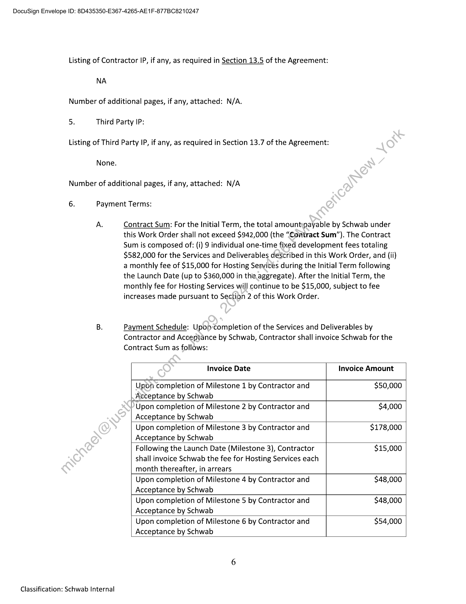

##### Work Order No. 167 - Schwab - BCE, Benchmarking Study Dashboard Solution]

  
````col
```col-md
flexGrow=.5
===
> [!info] [Page 1](_attachments/images_Schwab-3.6.1.18.5400147751.pdf_210037/page_1.png)
> 
```  
```col-md
DocuSign Envelope ID: 8D435350-E367-4265-AE 1F-877BC8210247  
WORK ORDER NO. 167
Schwab — BCE, Benchmarking Study Dashboard Solution  
This Work Order No. 167 (the “Work Order”), effective as of the Start Date set forth
below, is a part of and incorporated into the Development and Hosting Agreement between
Charles Schwab & Co., Inc. (“Schwab”) and Markit On Demand, Inc., formerly known as Wall Street
On Demand, Inc. (“Contractor”), dated September 1, 2003, as amended (“Agreement”),
Capitalized terms not defined in this Work Order are as defined in the Agreement. In the event
of any conflict between the Agreement and this Work Order, the terms of the Agreement shall  
govern.
1. Contacts
Contractor Representative: Sarah Miceli
Address: 5775 Flatiron Parkway
Boulder, CO 80301
Telephone number: 303-583-4288
Email address: sarah.miceli@ihsmarkit.com
Schwab Representative: Jennifer Schneider
Address: 211 Main Street
San Francisco, CA 94105
Telephone number: 415-319-1273
Email address: jennifer:schneider@schwab.com
2. Term of Work Order:
Start Date: November 6, 2023  
This Work Order shall commence as of the Start Date and shall remain in effect for two (2) years
after dashboard is live and-accessible by advisors (the “Launch Date”), unless earlier terminated
as provided in the Agreement (the “Initial Term”). Upon completion of the Initial Term, this
Work Order shall automatically renew for successive one (1) year terms (each a “Renewal
Term”) solely with regard to Hosting Services related to this Work Order, subject to earlier
termination.oy Schwab pursuant to the terms of the Agreement or replaced with a new work
order relating or consolidating the same subject matter. The Initial Term and any Renewal Terms
are referred to herein collectively as the “Term.” Any price increase shall be in accordance with
theterms in the Agreement.  
3. Services to be Performed and Deliverables; Assumptions; Schedule of
Deliverables/Milestones; Acceptance Criteria:  
Services to be Performed and Deliverables; Assumptions.  
Contractor will design, develop and implement a multi-year solution to create a digital
dashboard of the Benchmarking Study results, leveraging data that is currently part of the
Benchmarking Study Peer Report PDF as well as new aggregated data necessary to create the  
1  
Classification: Schwab Internal  
```
````
Notes:    
````col
```col-md
flexGrow=.5
===
> [!info] [Page 2](_attachments/images_Schwab-3.6.1.18.5400147751.pdf_210037/page_2.png)
> 
```  
```col-md
DocuSign Envelope ID: 8D435350-E367-4265-AE 1F-877BC8210247  
comparison groups, which is currently not part of the Peer Report PDF and will be introduced as
part of the new dynamic functionality of Dashboard.  
A. Services to be Performed and Deliverables  
There are nine Milestones in this project, and for avoidance of doubt, the Deliverables
will move to a production environment at different intervals defined within the
Deliverable/Milestone table.  
Phase 1: Milestone No. 1, 2, 3 (Services/Deliverables): Contractor will design and develop a
Benchmarking Study Dashboard Solution for the Benchmarking Study results that will provide
users with access to content from 5 pages of the current Peer Report PDF. For avoidarice of
doubt, Milestone 1 is defined as the design completion for Phase 1 as described below prior to
Schwab’s SAC design standards governance review. Milestone 2 is Schwab’s SACidesign
standards governance review. Milestone 3 is the complete development an@Production Launch
Date for Phase 1.  
Markit will create infrastructure for application layer:
e New web server
e New Node API server
e Inthe event of OAUTH work notbeing complete prior to Phase 1 launch,
the dashboard will remain on’YYY encryption and be transitioned to
OAUTH no later than end of year 2024.Transition to ping federate that
provides Bearer Token-is required by end of year 2024.
e Integration via web components
Il. Users will have access to new dashboard via Peer Report Access Module and Schwab
Admin Harness
e Advisors taking study via SAC — will access via the Peer Report Access Module
e Advisors taking study via Guest URL — will have access via a firm specific
dashboard GuestURL until long term process is determined.
e Schwab Benchmarking Team — will access via Admin Harness
« RMs/Consultants — will not access the dashboard in Phase 1 but their access
abilityis included in Phase 2; access is determined by permissions granted in the
administration setup of each study
Ul. Dashboard will provide users ability to access Benchmarking Study Peer and
Compensation reports and the Benchmarking Compensation Tool, based on
participation and administrative access defined by the user
IV. Dashboard Interface Application will include:
e Simple dashboard navigation and layout aligned with Schwab design standards,
providing users with access to Benchmarking Study results content; navigation
will be designed to accommodate additional content for Phase 2
e Content from 2023 RIA Benchmarking Peer Report
e Overview — to include copy about the Benchmarking Study and content
from pages 5, 6, 7
e Growth — to include content from pages 13 and 14
e Updated data visualizations —Design visualizations for data and graphs included
in Peer Report pages represented in Phase 1 will be developed
e Template for visuals, to be used in Phase 1  
2  
Classification: Schwab Internal  
```
````
Notes:    
````col
```col-md
flexGrow=.5
===
> [!info] [Page 3](_attachments/images_Schwab-3.6.1.18.5400147751.pdf_210037/page_3.png)
> 
```  
```col-md
DocuSign Envelope ID: 8D435350-E367-4265-AE 1F-877BC8210247  
e Visual not captured in the above Benchmarking Study Peer Report pages
are not included in Phase 1
e Dynamic text that could potentially include simple variables and calculations
e Assumption: This will be simple dynamic text not to level of current
SmartText models
e Different sections of text to include: descriptive, hover overs, possibly
key questions, Take Action with hyperlinks to Schwab resources
e¢ Dropdown Filters
e Study Year- dropdown to include 3 past Benchmarking Study years, but
will only show years that the firm participated in the Study  
e Data normalization over previous years will be addressed  
e Text for previous years will need to be addressed  
e Data Comparison Groups - Phase 1 will only include all AJM peer groups
but will be designed to accommodate additional comparison groups in
the future (i.e., revenue, number of clients, etc.)  
e Dashboard to display clearly what group'the firm is in for any
data comparison group, especially when additional data
comparison groups beyond AUMare added  
e Schwab will send Markit the data for comparison groups  
e Dynamic elements and content customized for each firm based on firm
participation and data availability:
e Dropdowns for previous studyjyears may have different comparison
groups
e Treatment of firms with no P&L
e Firms and users with access to Benchmarking Compensation Report and
Benchmarking Compensation Tool
e Study years wili have different focus sections. Could just display current
year focus section data and previous years focus section data would not
be available’in dashboard OR when user selects a previous study year
the prévious focus section is available in dashboard — TBD based on best
client experience
¢ .TPF Chart will be dynamic to each study year
V. Google analytics will be included to track usage of the dashboard dependent upon
alignment.with Schwab policies and approval from Schwab technical resources  
Phase 2: Milestone No. 4, 5, 6, 7, 8, 9 (Services/Deliverables): Building on foundational elements
solidified in’ Phase 1, flow, design layout, and infrastructure of site/dashboard, Contractor will
complete effort of transitioning 20-25 additional pages from Benchmarking Study Peer Report
PDFNnto Benchmarking Study Dashboard Solution. For avoidance of doubt, Milestones 4 and 5
are defined as the design completion for Phase 2 as described below; Milestones 4 and 5 each
cover design completion of 12-13 pages of the total 20-25 pages. Milestones 6, 7, 8, and 9 are the
development efforts for Phase 2. The specific Deliverables associated with Milestones 6-9 will be
mutually agreed upon via email once the design efforts are complete.  
I. Design:
a. 20-25 additional pages from Benchmarking Study Peer Report pdf shall be
designed for digital solution and will be consistent with those specifications
defined for pages in Phase 1  
Classification: Schwab Internal  
```
````
Notes:    
````col
```col-md
flexGrow=.5
===
> [!info] [Page 4](_attachments/images_Schwab-3.6.1.18.5400147751.pdf_210037/page_4.png)
> 
```  
```col-md
DocuSign Envelope ID: 8D435350-E367-4265-AE 1F-877BC8210247  
IV.  
b. All pages will follow design specifications and details outlined and defined
during Phase 1  
c. Reusable visualizations will be used where possible but additional tab and chart  
emplates will likely be needed.  
d. Navigation is being defined in Phase 1 and Phase 2 will follow infrastructure put  
in place  
e. Inclusion of new data visualizations will be limited and repeatable, as much as  
possible  
f. Design for most complex user tier and advise what content or functions will;not  
be available for lower user tiers  
PDF Export:  
a. PDF development will require separate design, layout, and stylesthat are in
addition to the functionality and UX that will facilitate this document
generation. We presently have no designs for the PDF. As new content is added
0 or modified on the web-based Benchmarking Study Dashboard Solution, the  
PDF will require updates keeping it current/consistent.  
b. The first scope of work on the PDF will be to introduce the previous content
from Phase 1. At launch of Phase 2 of the dashboard, the PDF will include all
content from both Phase 1 and Phase 2 of the dashboard.  
c. Leverage a client-side JavaScript library to render the PDFs on the fly. This will
reduce complexity for the UX as well as back-end development.  
Authentication (Standard and GuestUrl):  
a. If transition from YYY encryption to OAUTH is not completed as part of Phase 1,
Phase 2 will require refactoring the authentication approach from Phase 1 and
will depend on the auth work planned in the Tech Modernization project.  
i. This work requires participation of Schwab’s tech teams.  
Data:  
a. No new data (outside of new data comparison groups as part of Phase 2) will be
introduced forthis project. Additional APIs and DB queries will be developed to
source existing data for use in the additional web pages / PDF. These new
formats*have not yet been defined.  
b. Considerable discovery and data mapping will be required to identify and
present existing data in these new web page/PDF formats and corresponding
visualizations.  
Assumptions
Responsive for screen size- breakpoints will be confirmed based on Schwab design
standards
ADA compliant
No net new data:  
o. All data is already in house or part of study  
=" This does include aggregation of data from the upcoming year study and
new data comparison groups as part of Phase 2.  
o This does not include onboarding of additional data
Dashboard will support multiple user tiers  
© Single Tier: For Phase 1, this does not include the RM/Consultants  
o Multiple Tiers: For Phase 2, this includes RM/Consultants  
4  
Classification: Schwab Internal  
```
````
Notes:    
````col
```col-md
flexGrow=.5
===
> [!info] [Page 5](_attachments/images_Schwab-3.6.1.18.5400147751.pdf_210037/page_5.png)
> 
```  
```col-md
DocuSign Envelope ID: 8D435350-E367-4265-AE 1F-877BC8210247  
e =SmartText will not be used within this project, including the existing models
e As part of Phase 1 users will not be able to export/print to PDF, users will simply be able  
to use the print capabilities on their browser
o Phase 2 will include PDF export/prin  
Cc.  
functionality  
Estimated Schedule of Services and Deliverables; Milestones.  
Service/Deliverable/Milestone  
Estimated Completion Date  
Project Kick Off  
November 6, 2023  
Schwab Acceptance of Milestone No. 1  
December 15, 2023  
Schwab Acceptance of Milestone No. 2  
Date to be mutually defined in writing,
2024  
Continual quality assurance (“QA”) by Contractor
throughout the development process.  
All will be finalized and accepted in QA
environment no later than’one (1) week in
advance of the Launch Date.  
Schwab Acceptance of Milestone No. 3 (“Launch
Date”)  
September 2024, exact date in September
2024 to be mutually defined in writing.  
Schwab Acceptance of Milestone No. 4  
Date to be mutually defined in writing  
Schwab Acceptance of Milestone No. 5  
Date to-be-mutually defined in writing  
Schwab Acceptance of Milestone No. 6  
Date to’be mutually defined in writing
upon completion of Milestone No. 5  
Schwab Acceptance of Milestone No. 7  
Date to be mutually defined in writing
upon completion of Milestone No. 5  
Schwab Acceptance of Milestone No.  
Date to be mutually defined in writing
upon completion of Milestone No. 5  
Schwab Acceptance of Milestone No/9  
Date to be mutually defined in writing
upon completion of Milestone No. 5  
Continual quality assurance (“QA”)-by Contractor
throughout the development process.  
All will be finalized and accepted in QA
environment no later than one (1) week in
advance of Phase 2 launch.  
Phase 2 launch  
Date to be mutually defined in writing.  
* To the extent that certain Services or Deliverables under this Work Order depend on Schwab
inputs, Contractarshall not be liable for delays caused by Schwab or its agents.  
D. Acceptance Criteria.  
All Services and Deliverables provided under this Work Order are subject to Acceptance testing
pursuant to Section 7 of the Agreement (except that upon completion of review and testing
pursuant to the second sentence of Section 7.2 of the Agreement, Schwab shall notify Contractor
whether it Accepts or Rejects such Service and/or Deliverable under this Work Order within 20
business days from the date of submission of the Services and/or Deliverables) and will be
performed in accordance with the Specifications provided herein or as mutually agreed to in
writing by both Parties.  
Contractor IP.  
Classification: Schwab Internal  
```
````
Notes:    
````col
```col-md
flexGrow=.5
===
> [!info] [Page 6](_attachments/images_Schwab-3.6.1.18.5400147751.pdf_210037/page_6.png)
> 
```  
```col-md
DocuSign Envelope ID: 8D435350-E367-4265-AE 1F-877BC8210247  
Listing of Contractor IP, if any, as required in Section 13.5 of the Agreement:  
NA  
Number of additional pages, if any, attached: N/A.  
5. Third Party IP:  
Listing of Third Party IP, if any, as required in Section 13.7 of the Agreement:  
None.  
Number of additional pages, if any, attached: N/A  
6. Payment Terms:  
A.  
Classification: Schwab Internal  
Contract Sum: For the Initial Term, the total amountypayable by Schwab under
this Work Order shall not exceed $942,000 (the “Contract Sum”). The Contract
Sum is composed of: (i) 9 individual one-time fixed development fees totaling
$582,000 for the Services and Deliverables described in this Work Order, and (ii)
a monthly fee of $15,000 for Hosting Services during the Initial Term following
the Launch Date (up to $360,000 in the aggregate). After the Initial Term, the
monthly fee for Hosting Services will continue to be $15,000, subject to fee
increases made pursuant to Section 2 of this Work Order.  
Payment Schedule: Upon completion of the Services and Deliverables by
Contractor and Acceptance by Schwab, Contractor shall invoice Schwab for the
Contract Sum as follows:  
Invoice Date Invoice Amount
Upon completion of Milestone 1 by Contractor and $50,000
Acceptance by Schwab
Upon completion of Milestone 2 by Contractor and $4,000
Acceptance by Schwab
Upon completion of Milestone 3 by Contractor and $178,000
Acceptance by Schwab
Following the Launch Date (Milestone 3), Contractor $15,000  
shall invoice Schwab the fee for Hosting Services each
month thereafter, in arrears  
Upon completion of Milestone 4 by Contractor and $48,000
Acceptance by Schwab
Upon completion of Milestone 5 by Contractor and $48,000
Acceptance by Schwab
Upon completion of Milestone 6 by Contractor and $54,000  
Acceptance by Schwab  
```
````
Notes:    
````col
```col-md
flexGrow=.5
===
> [!info] [Page 7](_attachments/images_Schwab-3.6.1.18.5400147751.pdf_210037/page_7.png)
> 
```  
```col-md
DocuSign Envelope ID: 8D435350-E367-4265-AE 1F-877BC8210247  
Upon completion of Milestone 7 by Contractor and $50,000
Acceptance by Schwab
Upon completion of Milestone 8 by Contractor and $75,000
Acceptance by Schwab
Upon completion of Milestone 9 by Contractor and $75,000
Acceptance by Schwab  
Reimbursable Expenses: Schwab will reimburse Contractor solely for the
following documented expenses (“Reimbursable Expenses”), up to a maximun of
$0. All Reimbursable Expenses shall be included in, and not in addition to, the
Contract Sum.  
Invoices: Schwab will provide Contractor with a Purchase Order or contract
control number (“Order Number”) for invoicing under ;this Work Order.
Contractor agrees that it will provide the Order Number on.each invoice and that
no invoice will be considered validly submitted under-this Work Order without
such Order Number. Whenever a Purchase Order is issued by Schwab as provided
herein, the Parties agree that any such issuanceds for convenience of the issuer
and the terms and conditions of any such Purchase Order are superseded by this
Work Order and the Agreement.  
ek 2k ake ae  
MARKIT ON DEMAND, INC. CHARLE: BLWYAB, &.CO., INC.  
By:  
Name  
Reve Spampinato py; | Use Sabai  
_ Renee Spampinato  
Lisa Salvi
Name:  
Title: Head of Markit Digital Title: Managing Director  
Date:  
10/31/2023. |/\7:40 AM PDT . 10/30/2023 | 3:20 PM PDT  
Date:  
Classification: Schwab Internal  
```
````
Notes:  


![[_attachments/Schwab-3.6.1.18.54 00147751.pdf]