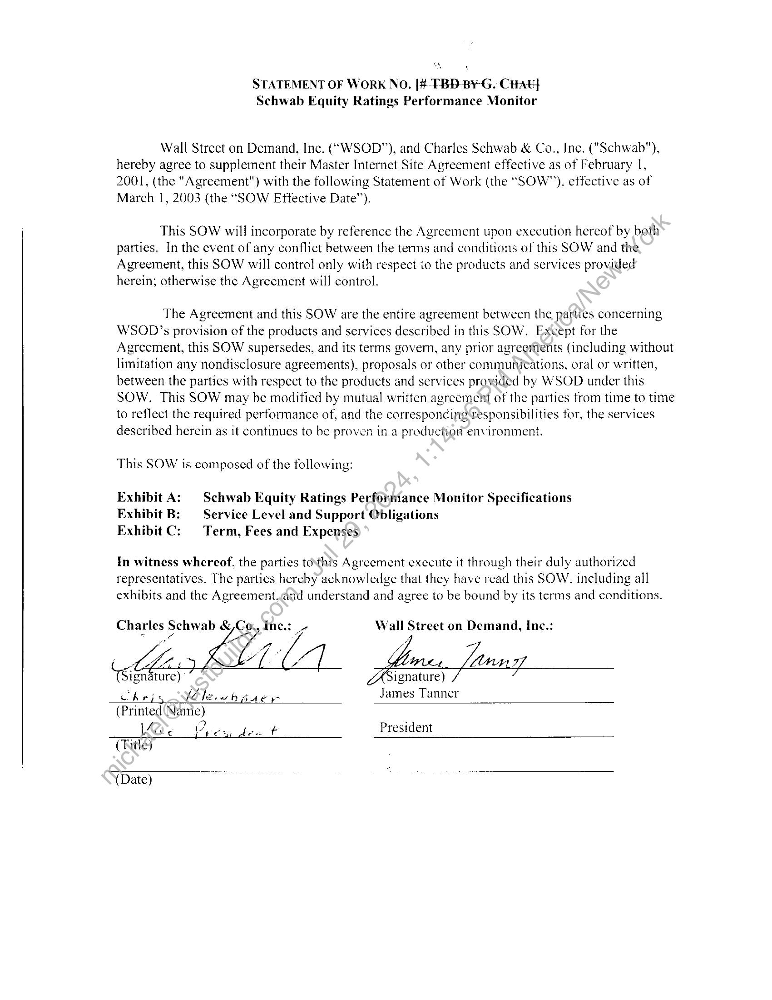
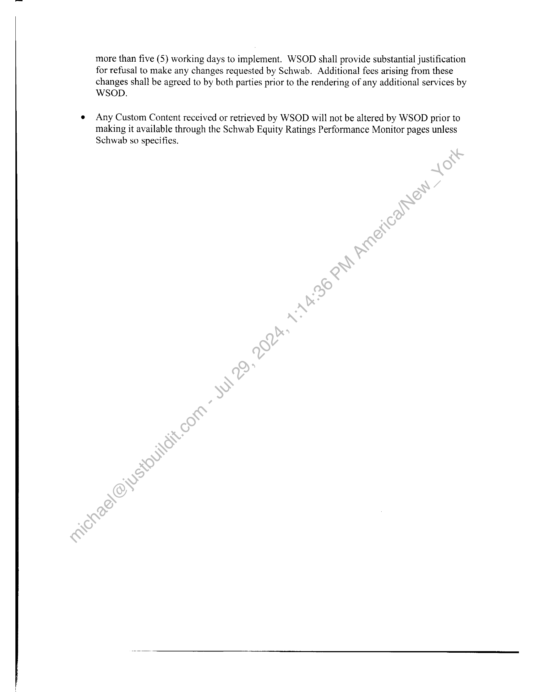

##### Statement of Work No. [4-FBD-BY-G-€nAE} for Schwab Equity Ratings Performance Monitor]

  
````col
```col-md
flexGrow=.5
===
> [!info] [Page 1](_attachments/images_Schwab-3.6.1.18.5500150117.pdf_212818/page_1.png)
> 
```  
```col-md
‘  
STATEMENT OF WORK NO. [4-FBD-BY-G-€nAE}
Schwab Equity Ratings Performance Monitor  
Wall Street on Demand, Inc. (“WSOD”), and Charles Schwab & Co.  
, Inc. ("Schwab"),
hereby agree to supplement their Master Internet Site Agreement effective as of February 1,
2001, (the "Agreement") with the following Statement of Work (the “SOW”), effective as of
March I, 2003 (the “SOW Effective Date”).  
This SOW will incorporate by reference the Agreement upon execution hereof by beth
parties. In the event of any conflict between the terms and conditions of this SOW and the
Agreement, this SOW will contro! only with respect io the products and services provided
herein; otherwise the Agreement will control.  
The Agreement and this SOW are the entire agreement between the parties concerning
WSOD’s provision of the products and services described in this SOW. Except for the
Agreement, this SOW supersedes, and its terms govern, any prior agreements (including without
limitation any nondisclosure agreements), proposals or other communications, oral or written,
between the parties with respect to the products and services provided by WSOD under this
SOW. This SOW may be modified by mutual written agreement of the parties from time to time
to reflect the required performance of, and the corresponding‘responsibilities for, the services
described herein as it continues to be proven in a production environment.  
This SOW is composed of the following:  
Exhibit A: Schwab Equity Ratings Performance Monitor Specifications
Exhibit B: — Service Level and Support Obligations
Exhibit C: | Term, Fees and Expenses  
In witness whercof, the parties tothis Agreement execute it through their duly authorized
representatives. The parties hereby acknowledge that they have read this SOW, including all
exhibits and the Agreement,and understand and agree to be bound by its terms and conditions.  
Charles Schwab & Co,, Inc.: aL Wall Street on Demand, Inc.:
igndture) ignature)  
chejy ble wb gaey James Tanner
(Printed\Name)
UO ea den President
(Title)  
(Date) ~  
```
````
Notes:    
````col
```col-md
flexGrow=.5
===
> [!info] [Page 2](_attachments/images_Schwab-3.6.1.18.5500150117.pdf_212818/page_2.png)
> 
```  
```col-md
EXHIBIT A TO STATEMENT OF WORK NO. [TBD]
Schwab Equity Ratings Performance Monitor  
SCHWAB EQUITY RATINGS PERFORMANCE MONITOR SPECIFICATIONS  
e The Schwab Equity Ratings Performance Monitor project will include the design,
development, and hosting of the following items:  
Requirements A
(a) Schwab Equity Ratings 26-51 Week Performance (Exhibit A) html page
(b) Schwab Equity Ratings 52-Week History Performance (Exhibit B) html page
(c) Schwab Equity Ratings Individual Stock Detail Performance (Exhibit C) html  
page  
(d) Schwab Equity Ratings Individual Stock Detail Performance (Exhibit C) PDF
report  
(e) Integration and support of Schwab Equity Ratings Performance Monitor file
provided by FactSet  
Requirements B
(f) Schwab Equity Ratings 26-51 Week Performance (Exhibit A) PDF report
(g) Schwab Equity Ratings 52-Week History Performance Exhibit B) PDF report
(h) Staging area and administration tool for the Pre-Production QA of Performance
Monitor data
(i) Monthly FTP delivery to Schwab of Exhibit A, B, and C PDF reports for archival  
(collectively, the “Business Requirements”). In“addition, the Schwab Equity Ratings
Performance Monitor pages will initially incorporate certain modifications and enhancements at
no additional cost as mutually agreed by-the parties.  
e Schwab may amend the Business Requirements and this exhibit from time to time by written
request to WSOD. If such request does not require that WSOD incur any costs or expenses,
then WSOD will respond within five (5) working days by either implementing the requested
changes or by providing an estimated completion date for any changes that WSOD
reasonably believes will require more than five (5) working days to implement. If such
request does require that WSOD incur costs or expenses, then WSOD will provide Schwab
with a writtehyestimate of such costs and expenses in good faith within five (5) business days
for Schwab’s consideration. If Schwab accepts the written estimate, this Statement of Work
shall -be-amended to include the additional scope and requirements.  
e The Schwab Equity Ratings Performance Monitor pages shall have the look and feel
consistent with other Schwab pages  
e Schwab maintains the ability to make reasonable changes to the look and feel of the Equity
Ratings Performance Monitor pages. WSOD shall be required to respond to change requests
within five (5) working days by either implementing the requested changes or by providing
an estimated completion date for any changes that WSOD reasonably believes will require  
```
````
Notes:    
````col
```col-md
flexGrow=.5
===
> [!info] [Page 3](_attachments/images_Schwab-3.6.1.18.5500150117.pdf_212818/page_3.png)
> 
```  
```col-md
more than five (5) working days to implement. WSOD shall provide substantial justification
for refusal to make any changes requested by Schwab. Additional fees arising from these  
changes shall be agreed to by both parties prior to the rendering of any additional services by
WSOD.  
Any Custom Content received or retrieved by WSOD will not be altered by WSOD prior to
making it available through the Schwab Equity Ratings Performance Monitor pages unless
Schwab so specifies.  
```
````
Notes:    
````col
```col-md
flexGrow=.5
===
> [!info] [Page 4](_attachments/images_Schwab-3.6.1.18.5500150117.pdf_212818/page_4.png)
> 
```  
```col-md
Lo
EXHIBIT C TO STATEMENT OF WORK NO. [$b
Schwab Equity Ratings Performance Monitor  
TERM, FEES AND EXPENSES  
The Initial Term of this SOW will commence on its effective date and last until twelve (12)
months following the date that Schwab Equity Ratings Performance Monitor pages are first
made generally available by Schwab (“Launch Date”), at which time it shall renew for additional
twelve (12) month periods (‘Automatic Renewal Periods”) until terminated by Schwab on thirty
(30) days’ prior written notice to WSOD.  
Schwab and WSOD agree to waive all development and hosting fees associated with:the Schwab
Equity Ratings Performance Monitor Requirements A items in recognition of thehosting fees
paid via the following contracts:  
1) Schwab Equity Ratings for Classic Customers (SOW #52 signedOctober 22, 2002)
2) Schwab Equity Ratings for Signature Services (Affluent) Customers
(Allocation from Signature Services Master contract\renewed June 29, 2000)  
Schwab will pay WSOD a one-time development fee of: (1).{hirty four thousand dollars
($34,000) for the design, prototyping, and development of the Schwab Equity Ratings
Performance Monitor Requirements B items.  
For hosting and maintaining the Schwab Equity Ratings Performance Monitor Requirements B
items, Schwab will pay WSOD: (1) seven thousand dollars ($7,000) per month during the Initial
Term, and (2) seven thousand dollars ($7,000)per month during the Automatic Renewal Periods,
unless otherwise agreed to by the partiesin writing.  
Schwab is responsible for all license and other fees payable to the third-party information
providers for the use of their information or content for the Schwab Equity Ratings Performance
Monitor pages.  
```
````
Notes:  


![[_attachments/Schwab-3.6.1.18.55 00150117.pdf]