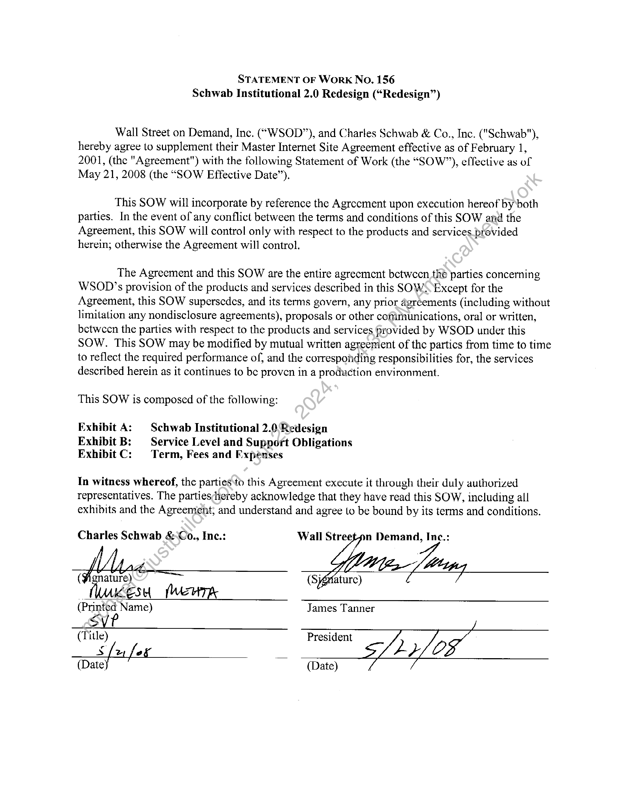
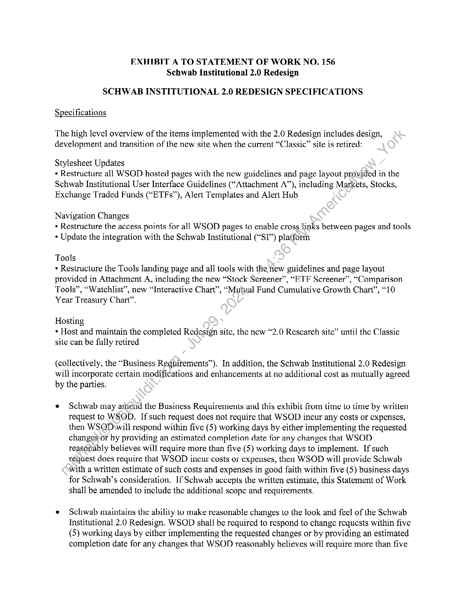
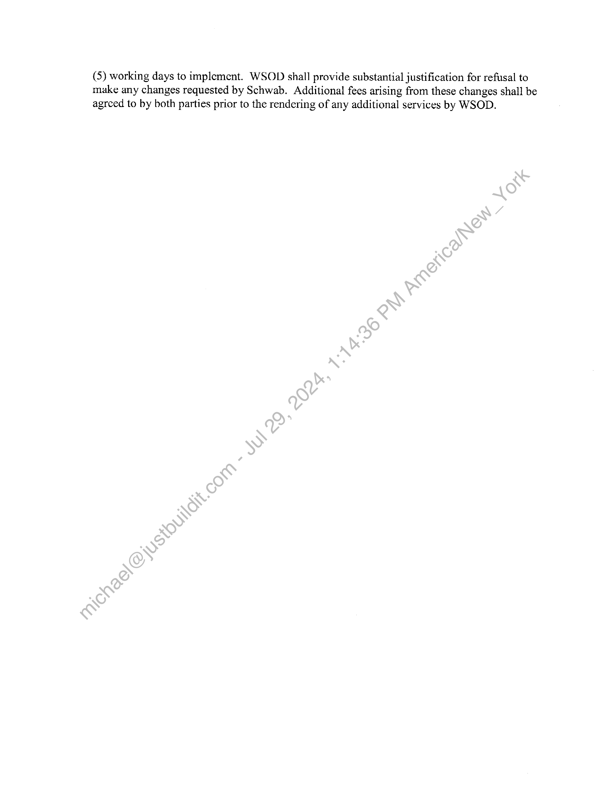
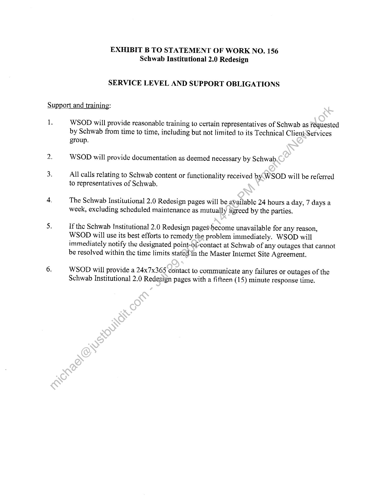
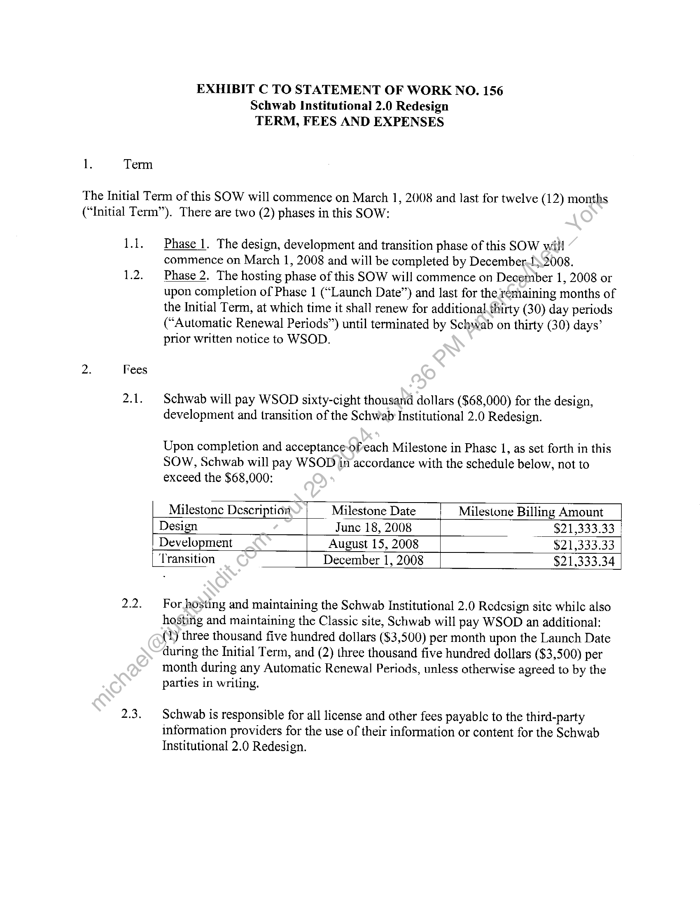
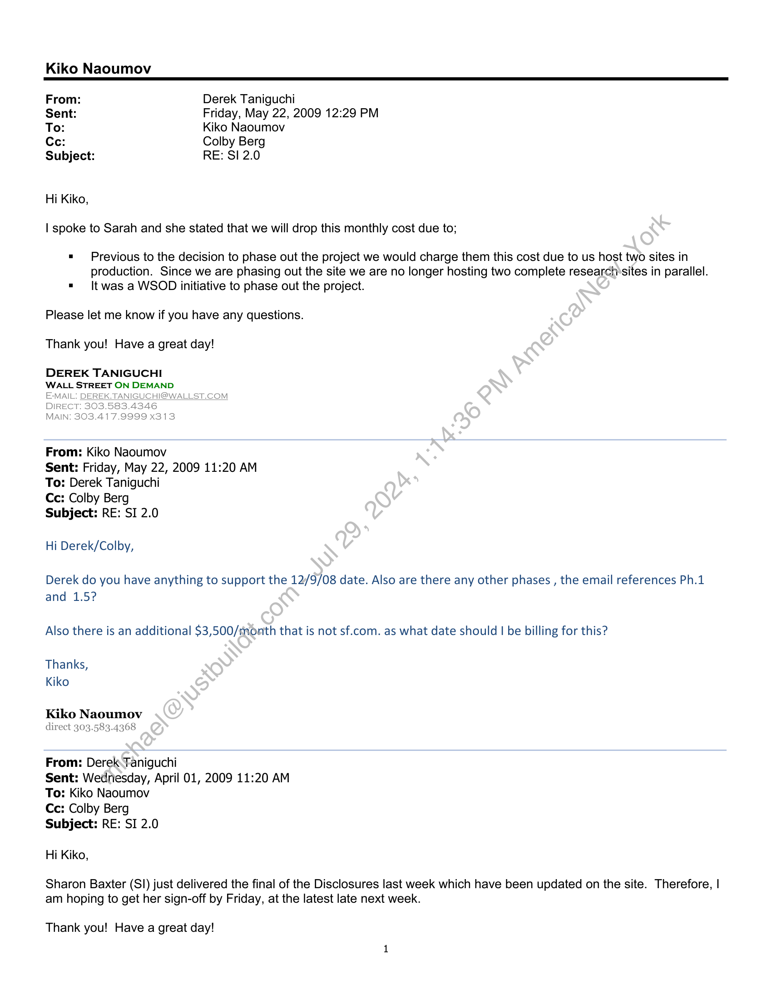
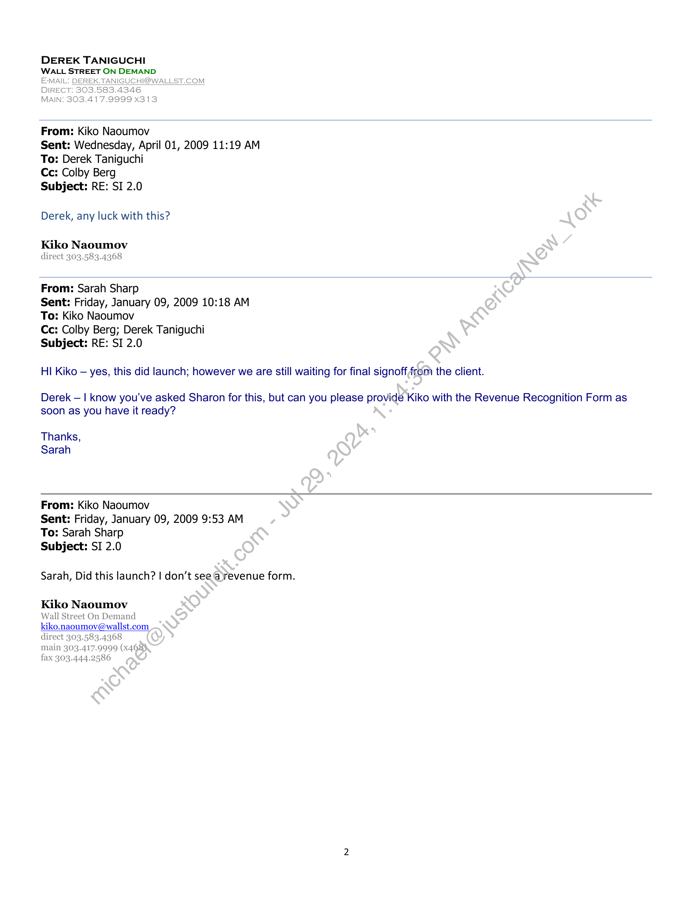

##### Statement of Work No. 156: Schwab Institutional 2.0 Redesign]

  
````col
```col-md
flexGrow=.5
===
> [!info] [Page 1](_attachments/images_Schwab-3.6.1.18.5600147710.pdf_212136/page_1.png)
> 
```  
```col-md
STATEMENT OF Work No. 156
Schwab Institutional 2.0 Redesign (“Redesign”)  
Wall Street on Demand, Inc. (“WSOD”), and Charles Schwab & Co., Inc. ("Schwab"),
hereby agree to supplement their Master Internet Site Agreement effective as of February 1,
2001, (the "Agreement") with the following Statement of Work (the “SOW”), effective as of
May 21, 2008 (the “SOW Effective Date”).  
This SOW will incorporate by reference the Agrecment upon execution hereof byboth
parties. In the event of any conflict between the terms and conditions of this SOW and the
Agreement, this SOW will control only with respect to the products and services provided
herein; otherwise the Agreement will control.  
The Agreement and this SOW are the entire agrecment bctwcen thé parties concerning
WSOD’s provision of the products and services described in this SOW Except for the
Agreement, this SOW supersedes, and its terms govern, any prior agreements (including without
limitation any nondisclosure agreements), proposals or other cofimunications, oral or written,
betwecn the parties with respect to the products and services provided by WSOD under this
SOW. This SOW may be modified by mutual written agreemient of the partics from time to time
to reflect the required performance of, and the corresponding responsibilities for, the services
described herein as it continues to be proven in a production environment.  
This SOW is composed of the following:  
Exhibit A: Schwab Institutional 2.0 Redesign  
Exhibit B: — Service Level and Support Obligations
Exhibit C: Term, Fees and Expenses  
In witness whereof, the parties to this Agreement execute it through their duly authorized
representatives. The partieschereby acknowledge that they have read this SOW, including all
exhibits and the Agreement, and understand and agree to be bound by its terms and conditions.  
Charles Schwab &-Co., Ine.: Wall Streeton Demand, Inc.:  
( Fi ature) =  
Wks Werm  
(Printed Name) James Tanner  
SVP  
(Tide)
S fey fof
(Date) (Date)  
President  
```
````
Notes:    
````col
```col-md
flexGrow=.5
===
> [!info] [Page 2](_attachments/images_Schwab-3.6.1.18.5600147710.pdf_212136/page_2.png)
> 
```  
```col-md
EXHIBIT A TO STATEMENT OF WORK NO. 156
Schwab Institutional 2.0 Redesign  
SCHWAB INSTITUTIONAL 2.0 REDESIGN SPECIFICATIONS  
Specifications  
The high level overview of the items implemented with the 2.0 Redesign includes design,
development and transition of the new site when the current “Classic” site is retired:  
Stylesheet Updates  
* Restructure all WSOD hosted pages with the new guidelines and page layout provided in the
Schwab Institutional User Interface Guidelines (“Attachment A”), including Markets, Stocks,
Exchange Traded Funds (“ETFs”), Alert Templates and Alert Hub  
Navigation Changes
+ Restructure the access points for all WSOD pages to enable cross links between pages and tools
« Update the integration with the Schwab Institutional (“SI”) platform  
Tools  
» Restructure the Tools landing page and all tools with the new guidelines and page layout
provided in Attachment A, including the new “Stock Screener”, “ETF Screener”, “Comparison
Tools”, “Watchlist”, new “Interactive Chart”, “Mutual Fund Cumulative Growth Chart”, “10
Year Treasury Chart”.  
Hosting
* Host and maintain the completed Redesign sitc, the new “2.0 Rescarch site” until the Classic
site can be fully retired  
(collectively, the “Business Requirements”). In addition, the Schwab Institutional 2.0 Redesign
will incorporate certain modifications and enhancements at no additional cost as mutually agreed
by the parties.  
© Schwab may aniend the Business Requirements and this exhibit from lime to time by written
request to WSOD. If such request does not require that WSOD incur any costs or expenses,
then WSQDwwill respond within five (5) working days by either implementing the requested
changes or by providing an estimated completion date for any changes that WSOD
reasonably believes will require more than five (5) working days to implement. If such
réquest does require that WSOD incur costs or expenses, then WSOD will provide Schwab
with a written estimate of such costs and expenses in good faith within five (5) business days
for Schwab’s consideration. If Schwab accepts the written estimate, this Statement of Work
shall be amended to include the additional scope and requirements.  
¢ Schwab maintains the ability to make reasonable changes to the look and feel of the Schwab
Institutional 2.0 Redesign. WSOD shall be required to respond to change requests within five
(5) working days by either implementing the requested changes or by providing an estimated
completion date for any changes that WSOD reasonably believes will require more than five  
```
````
Notes:    
````col
```col-md
flexGrow=.5
===
> [!info] [Page 3](_attachments/images_Schwab-3.6.1.18.5600147710.pdf_212136/page_3.png)
> 
```  
```col-md
(5) working days to implement. WSOD shall provide substantial justification for refusal to
make any changes requested by Schwab. Additional fees arising from these changes shall be
agrced to by both parties prior to the rendering of any additional services by WSOD.  
```
````
Notes:    
````col
```col-md
flexGrow=.5
===
> [!info] [Page 4](_attachments/images_Schwab-3.6.1.18.5600147710.pdf_212136/page_4.png)
> 
```  
```col-md
EXHIBIT B TO STATEMENT OF WORK NO. 156
Schwab Institutional 2.0 Redesign  
SERVICE LEVEL AND SUPPORT OBLIGATIONS  
Support and training:
1. WSOD will provide reasonable training to certain representatives of Schwab as requested  
by Schwab from time to time, including but not limited to its Technical Client’Sefvices
group.  
WSOD will provide documentation as deemed necessary by Schwab.  
All calls relating to Schwab content or functionality received by WSOD will be referred
to representatives of Schwab.  
The Schwab Institutional 2.0 Redesign pages will be available 24 hours a day, 7 days a
week, excluding scheduled maintenance as mutually agreed by the parties.  
If the Schwab Institutional 2.0 Redesign pagesbecome unavailable for any reason,
WSOD will use its best efforts to remedy the problem immediately. WSOD will
immediately notify the designated point-of-contact at Schwab of any outages that cannot
be resolved within the time limits stateWin the Master Internet Site Agreement,  
WSOD will provide a 24x7x365 contact to communicate any failures or outages of the
Schwab Institutional 2.0 Redesign pages with a fifteen (15) minute response time.  
```
````
Notes:    
````col
```col-md
flexGrow=.5
===
> [!info] [Page 5](_attachments/images_Schwab-3.6.1.18.5600147710.pdf_212136/page_5.png)
> 
```  
```col-md
1.  
Term  
EXHIBIT C TO STATEMENT OF WORK NO. 156
Schwab Institutional 2.0 Redesign
TERM, FEES AND EXPENSES  
The Initial Term of this SOW will commence on March 1, 2008 and last for twelve (12) months
(“Initial Term”). There are two (2) phases in this SOW:  
2.  
1.1.  
1.2.  
Fees  
2.1.  
2.2.  
2.3.  
Phase 1. The design, development and transition phase of this SOW will
commence on March 1, 2008 and will be completed by December-1).2008.  
Phase 2. The hosting phase of this SOW will commence on December 1, 2008 or
upon completion of Phase 1 (“Launch Date”) and last for the rémaining months of
the Initial Term, at which time it shall renew for additional. thirty (30) day periods
(“Automatic Renewal Periods”) until terminated by Schwab on thirty (30) days’
prior written notice to WSOD.  
Schwab will pay WSOD sixty-cight thousand dollars ($68,000) for the design,
development and transition of the Schwab Institutional 2.0 Redesign.  
Upon completion and acceptance-ofeach Milestone in Phase 1, as set forth in this
SOW, Schwab will pay WSOD in accordance with the schedule below, not to
exceed the $68,000:  
Milestone Description Milestone Date Milestone Billing Amount
Design June 18, 2008 ___ $21,333.33
Development August 15, 2008 $21,333.33  
Transition December 1, 2008 $21,333.34  
For hosting and maintaining the Schwab Institutional 2.0 Redesign site while also
hostitig and maintaining the Classic site, Schwab will pay WSOD an additional:
(1) three thousand five hundred dollars ($3,500) per month upon the Launch Date
during the Initial Term, and (2) three thousand five hundred dollars ($3,500) per
month during any Automatic Renewal Periods, unless otherwise agreed to by the
parties in writing.  
Schwab is responsible for all license and other fees payable to the third-party
information providers for the use of their information or content for the Schwab
Institutional 2.0 Redesign.  
```
````
Notes:    
````col
```col-md
flexGrow=.5
===
> [!info] [Page 6](_attachments/images_Schwab-3.6.1.18.5600147710.pdf_212136/page_6.png)
> 
```  
```col-md
Kiko Naoumov  
From: Derek Taniguchi  
Sent: Friday, May 22, 2009 12:29 PM
To: Kiko Naoumov  
Ce: Colby Berg  
Subject: RE: SI 2.0  
Hi Kiko,  
| spoke to Sarah and she stated that we will drop this monthly cost due to;  
= Previous to the decision to phase out the project we would charge them this cost due to us host two sites in
production. Since we are phasing out the site we are no longer hosting two complete research'sites in parallel.
= It was a WSOD initiative to phase out the project.  
Please let me know if you have any questions.
Thank you! Have a great day!  
DEREK TANIGUCHI  
WALL STREET ON DEMAND  
E-MAIL: DEREK. TANIGUCHI@WALLST.COM
DIRECT: 303.583.4346  
MAIN: 303.417.9999 x313  
From: Kiko Naoumov  
Sent: Friday, May 22, 2009 11:20 AM
To: Derek Taniguchi  
Cc: Colby Berg  
Subject: RE: SI 2.0  
Hi Derek/Colby,  
Derek do you have anything to support the 12/9/08 date. Also are there any other phases , the email references Ph.1
and 1.5?  
Also there is an additional $3,500/month that is not sf.com. as what date should | be billing for this?  
Thanks,
Kiko  
Kiko Naoumov
direct 303.583.4368  
From: Derek Faniguchi  
Sent: Wednesday, April 01, 2009 11:20 AM
To: Kiko Naoumov  
Cc: Colby Berg  
Subject: RE: SI 2.0  
Hi Kiko,  
Sharon Baxter (SI) just delivered the final of the Disclosures last week which have been updated on the site. Therefore, |
am hoping to get her sign-off by Friday, at the latest late next week.  
Thank you! Have a great day!  
```
````
Notes:    
````col
```col-md
flexGrow=.5
===
> [!info] [Page 7](_attachments/images_Schwab-3.6.1.18.5600147710.pdf_212136/page_7.png)
> 
```  
```col-md
DEREK TANIGUCHI  
WALL STREET ON DEMAND.  
E-MAIL: DEREK.TANIGUCHI@WALLST.COM
DIRECT: 303.583.4346  
MAIN: 303.417.9999 x313  
From: Kiko Naoumov  
Sent: Wednesday, April 01, 2009 11:19 AM
To: Derek Taniguchi  
Cc: Colby Berg  
Subject: RE: SI 2.0  
Derek, any luck with this?  
Kiko Naoumov
direct 303.583.4368  
From: Sarah Sharp  
Sent: Friday, January 09, 2009 10:18 AM
To: Kiko Naoumov  
Cc: Colby Berg; Derek Taniguchi
Subject: RE: SI 2.0  
HI Kiko — yes, this did launch; however we are still waiting for final signoffrom the client.  
Derek — | know you've asked Sharon for this, but can you please providé Kiko with the Revenue Recognition Form as
soon as you have it ready?  
Thanks,
Sarah  
From: Kiko Naoumov  
Sent: Friday, January 09, 2009 9:53 AM
To: Sarah Sharp  
Subject: SI 2.0  
Sarah, Did this launch? | don’t see a)revenue form.  
Kiko Naoumov
Wall Street On Demand
kiko.naoumov@wallst.com
direct 303.583.4368  
main 303.417.9999 (x468)
fax 303.444.2586  
```
````
Notes:  


![[_attachments/Schwab-3.6.1.18.56 00147710.pdf]