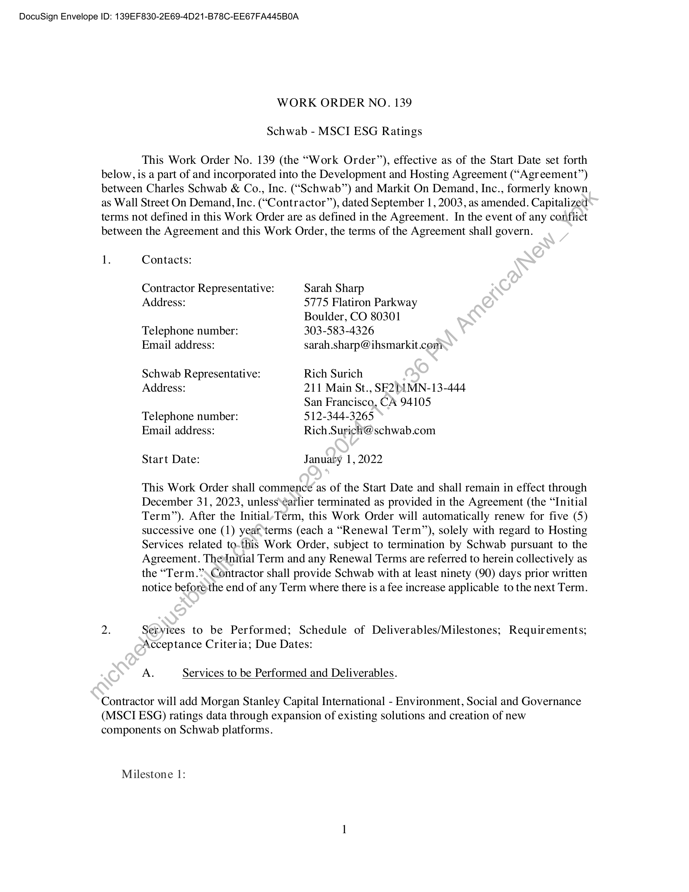
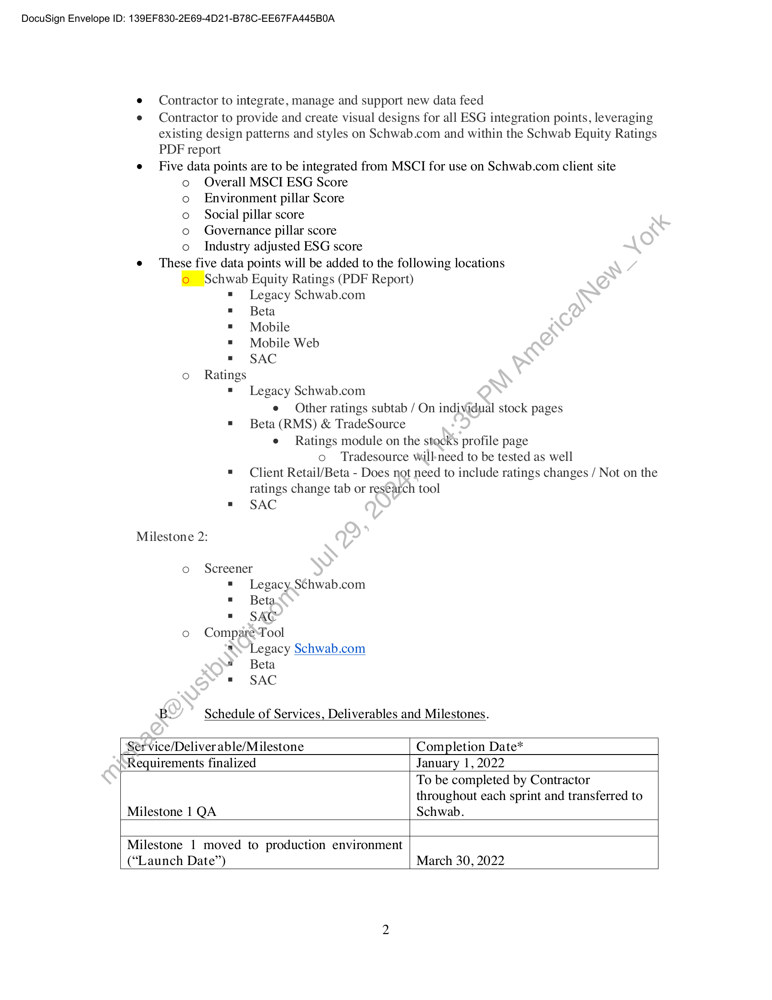
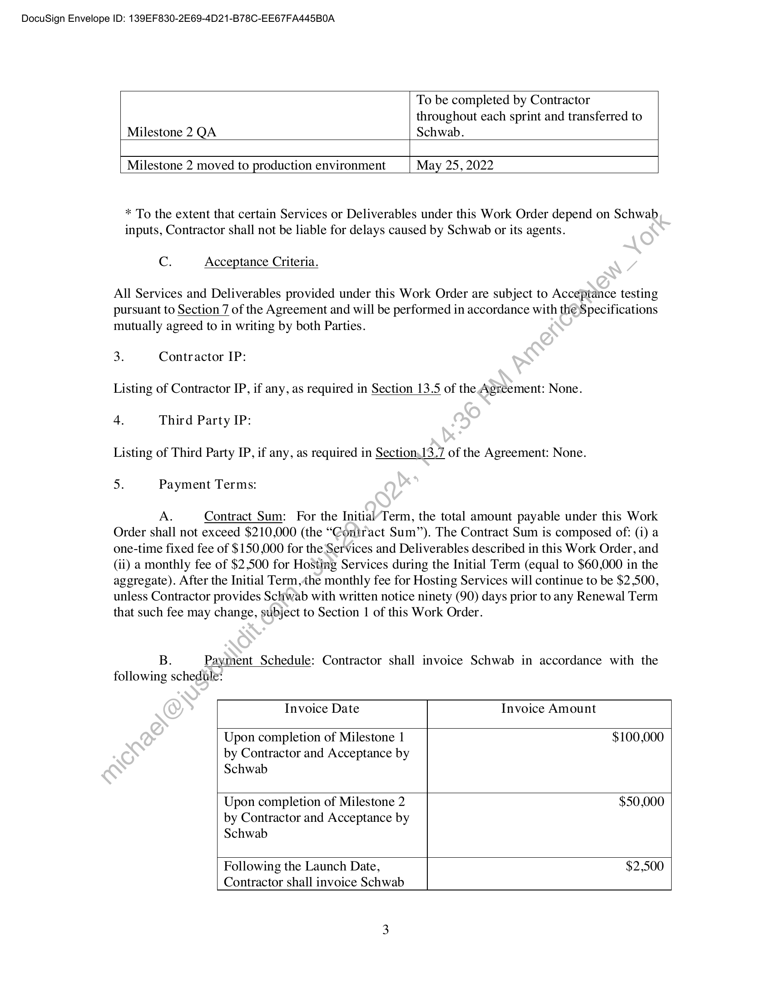
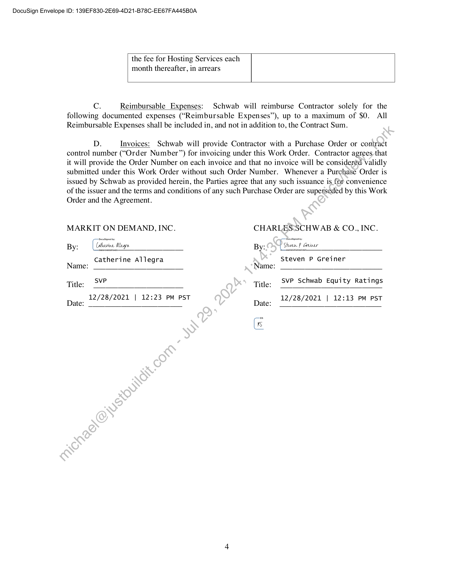

##### Work Order No. 139: Schwab - MSCI ESG Ratings]

  
````col
```col-md
flexGrow=.5
===
> [!info] [Page 1](_attachments/images_Schwab-3.6.1.18.5700150093.pdf_210553/page_1.png)
> 
```  
```col-md
DocuSign Envelope ID: 139EF830-2E69-4D21-B78C-EE67FA445B0A  
WORK ORDER NO. 139
Schwab - MSCI ESG Ratings  
This Work Order No. 139 (the “Work Order’), effective as of the Start Date set forth
below, is a part of and incorporated into the Development and Hosting Agreement (“Agreement”)
between Charles Schwab & Co., Inc. (“Schwab”) and Markit On Demand, Inc., formerly known
as Wall Street On Demand, Inc. (“Contractor”), dated September 1, 2003, as amended. Capitalized
terms not defined in this Work Order are as defined in the Agreement. In the event of any conflict
between the Agreement and this Work Order, the terms of the Agreement shall govern.  
1. Contacts:  
Contractor Representative: Sarah Sharp  
Address: 5775 Flatiron Parkway
Boulder, CO 80301  
Telephone number: 303-583-4326  
Email address: sarah.sharp@ihsmarkit.com  
Schwab Representative: Rich Surich  
Address: 211 Main St., SF2b1MN-13-444
San Francisco, CA 94105  
Telephone number: 512-344-3265  
Email address: Rich Surich@schwab.com  
Start Date: January 1, 2022  
This Work Order shall commence as of the Start Date and shall remain in effect through
December 31, 2023, unless‘¢atlier terminated as provided in the Agreement (the “Initial
Term”). After the Initial/Term, this Work Order will automatically renew for five (5)
successive one (1) year‘terms (each a “Renewal Term”), solely with regard to Hosting
Services related to-this Work Order, subject to termination by Schwab pursuant to the
Agreement. TheInitial Term and any Renewal Terms are referred to herein collectively as
the “Term.”’\Contractor shall provide Schwab with at least ninety (90) days prior written
notice beforeéthe end of any Term where there is a fee increase applicable to the next Term.  
2. Services to be Performed; Schedule of Deliverables/Milestones; Requirements;
Acceptance Criteria; Due Dates:  
A. Services to be Performed and Deliverables.  
Contractor will add Morgan Stanley Capital International - Environment, Social and Governance
(MSCI ESG) ratings data through expansion of existing solutions and creation of new
components on Schwab platforms.  
Milestone 1:  
```
````
Notes:    
````col
```col-md
flexGrow=.5
===
> [!info] [Page 2](_attachments/images_Schwab-3.6.1.18.5700150093.pdf_210553/page_2.png)
> 
```  
```col-md
DocuSign Envelope ID: 139EF830-2E69-4D21-B78C-EE67FA445B0A  
e Contractor to integrate, manage and support new data feed
e Contractor to provide and create visual designs for all ESG integration points, leveraging
existing design patterns and styles on Schwab.com and within the Schwab Equity Ratings  
PDF report  
e Five data points are to be integrated from MSCI for use on Schwab.com client site  
oo0o0°0  
Overall MSCI ESG Score
Environment pillar Score
Social pillar score
Governance pillar score  
o Industry adjusted ESG score
e These five data points will be added to the following locations
© Schwab Equity Ratings (PDF Report)  
o Ratings  
Milestone 2:  
Legacy Schwab.com
Beta  
Mobile  
Mobile Web  
SAC  
Legacy Schwab.com  
e Other ratings subtab / On individual stock pages
Beta (RMS) & TradeSource  
e Ratings module on the stocks profile page  
co Tradesource will-need to be tested as well  
Client Retail/Beta - Does not need to include ratings changes / Not on the
ratings change tab or research tool
SAC  
o Screener  
Legacy. Schwab.com
Beta
SAC  
o CompareTool  
Legacy Schwab.com  
a Beta
» SAC
By Schedule of Services, Deliverables and Milestones.
Service/Deliver able/Milestone Completion Date*
Requirements finalized January 1, 2022  
To be completed by Contractor
throughout each sprint and transferred to  
Milestone 1 QA Schwab.
Milestone 1 moved to production environment
(“Launch Date’) March 30, 2022  
```
````
Notes:    
````col
```col-md
flexGrow=.5
===
> [!info] [Page 3](_attachments/images_Schwab-3.6.1.18.5700150093.pdf_210553/page_3.png)
> 
```  
```col-md
DocuSign Envelope ID: 139EF830-2E69-4D21-B78C-EE67FA445B0A  
To be completed by Contractor
throughout each sprint and transferred to
Milestone 2 QA Schwab.  
Milestone 2 moved to production environment May 25, 2022  
* To the extent that certain Services or Deliverables under this Work Order depend on Schwab
inputs, Contractor shall not be liable for delays caused by Schwab or its agents.  
C. Acceptance Criteria.  
All Services and Deliverables provided under this Work Order are subject to Acceptance testing
pursuant to Section 7 of the Agreement and will be performed in accordance with the)Specifications
mutually agreed to in writing by both Parties.  
3. Contractor IP:
Listing of Contractor IP, if any, as required in Section 13.5 of the Agreement: None.
4. Third Party IP:
Listing of Third Party IP, if any, as required in Section.13.7 of the Agreement: None.
5. Payment Terms:  
A. Contract Sum: For the Initial’Term, the total amount payable under this Work
Order shall not exceed $210,000 (the “Coniract Sum”). The Contract Sum is composed of: (i) a
one-time fixed fee of $150,000 for the Services and Deliverables described in this Work Order, and
(ii) a monthly fee of $2,500 for Hosting Services during the Initial Term (equal to $60,000 in the
aggregate). After the Initial Term,the monthly fee for Hosting Services will continue to be $2,500,  
unless Contractor provides Schwab with written notice ninety (90) days prior to any Renewal Term
that such fee may change, subject to Section 1 of this Work Order.  
B. Payment Schedule: Contractor shall invoice Schwab in accordance with the
following schedule:  
Invoice Date Invoice Amount  
Upon completion of Milestone 1 $100,000
by Contractor and Acceptance by
Schwab  
Upon completion of Milestone 2 $50,000
by Contractor and Acceptance by
Schwab  
Following the Launch Date, $2,500
Contractor shall invoice Schwab  
```
````
Notes:    
````col
```col-md
flexGrow=.5
===
> [!info] [Page 4](_attachments/images_Schwab-3.6.1.18.5700150093.pdf_210553/page_4.png)
> 
```  
```col-md
DocuSign Envelope ID: 139EF830-2E69-4D21-B78C-EE67FA445B0A  
the fee for Hosting Services each
month thereafter, in arrears  
C. Reimbursable Expenses: Schwab will reimburse Contractor solely for the
following documented expenses (“Reimbursable Expenses”), up to a maximum of $0. All
Reimbursable Expenses shall be included in, and not in addition to, the Contract Sum.  
D. Invoices: Schwab will provide Contractor with a Purchase Order or contract
control number (“Order Number”) for invoicing under this Work Order. Contractor agrees that
it will provide the Order Number on each invoice and that no invoice will be considered validly
submitted under this Work Order without such Order Number. Whenever a Purchase Order is
issued by Schwab as provided herein, the Parties agree that any such issuance is for convenience
of the issuer and the terms and conditions of any such Purchase Order are superseded by this Work
Order and the Agreement.  
MARKIT ON DEMAND, INC. CHARLES:SCHWAB & CO., INC.
By: ( (atari Mge By: Of Stauef Grae
Catherine Allegra Steven P Greiner
Name: Name:
Title: svP Title: SvP Schwab Equity Ratings
12/28/2021 | 12:23 PM PST 12/28/2021 | 12:13 PM PST
Date: _ Date:  
```
````
Notes:  


![[_attachments/Schwab-3.6.1.18.57 00150093.pdf]