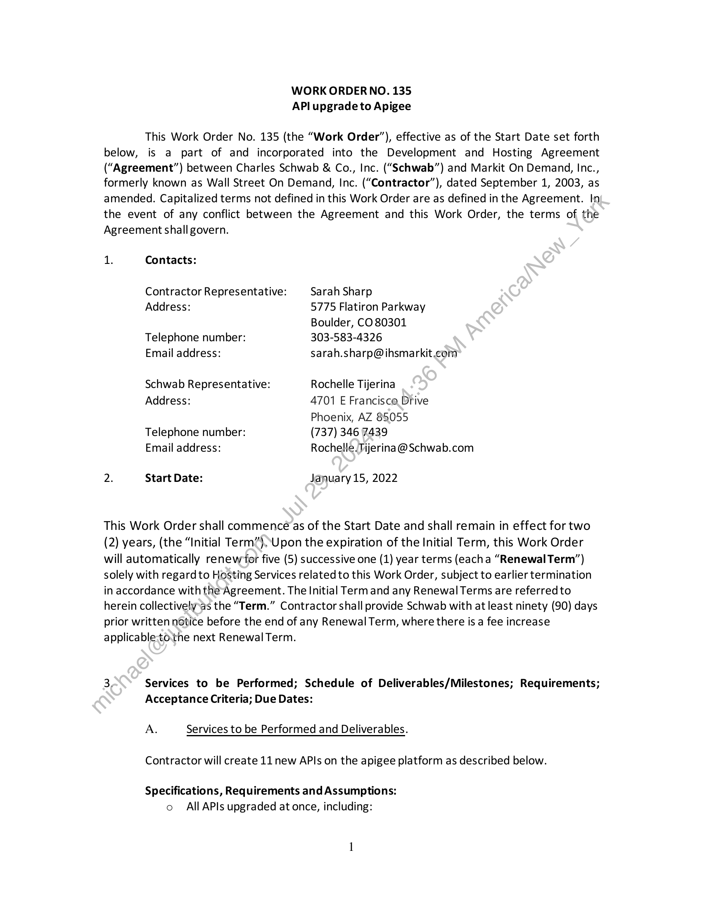
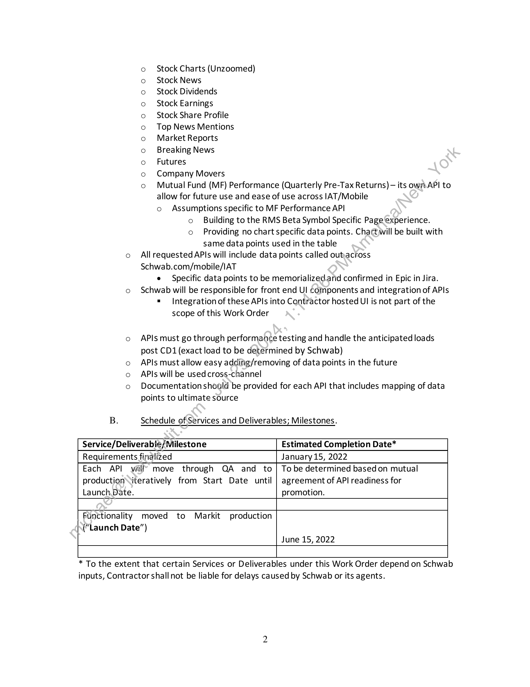
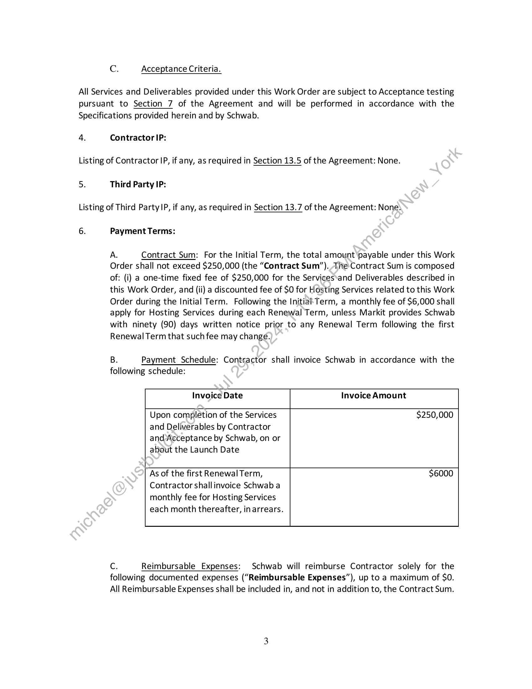
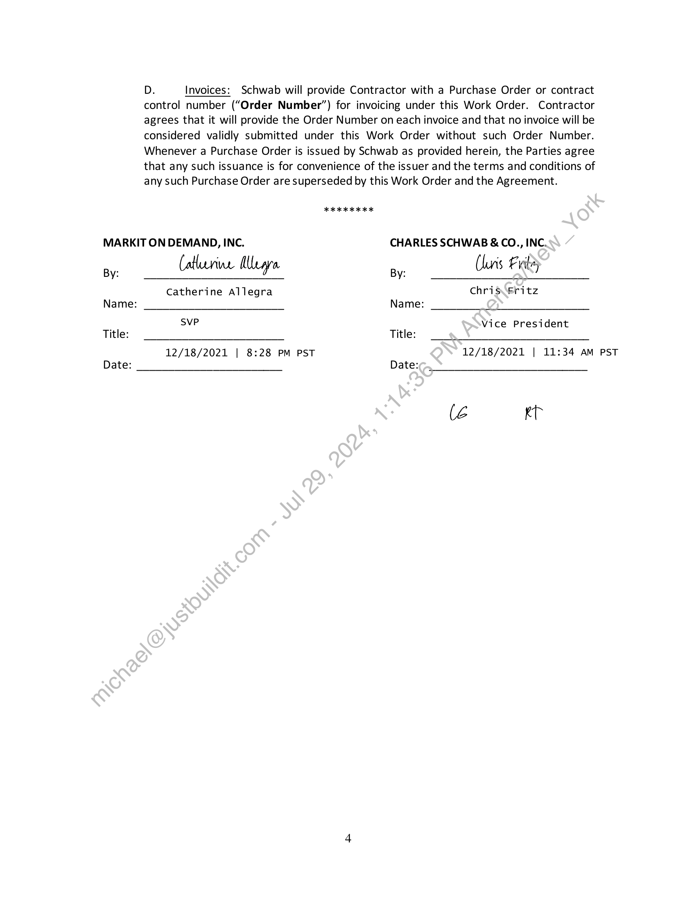

##### Work Order No. 135: API Upgrade to Apigee]

  
````col
```col-md
flexGrow=.5
===
> [!info] [Page 1](_attachments/images_Schwab-3.6.1.18.5800150087.pdf_210951/page_1.png)
> 
```  
```col-md
WORK ORDER NO. 135
API upgrade to Apigee  
This Work Order No. 135 (the “Work Order”), effective as of the Start Date set forth
below, is a part of and incorporated into the Development and Hosting Agreement
(“Agreement”) between Charles Schwab & Co., Inc. (“Schwab”) and Markit On Demand, Inc.,
formerly known as Wall Street On Demand, Inc. (“Contractor”), dated September 1, 2003, as
amended. Capitalized terms not defined in this Work Order are as defined in the Agreement. In
the event of any conflict between the Agreement and this Work Order, the terms of the
Agreement shall govern.  
1. Contacts:
Contractor Representative: Sarah Sharp
Address: 5775 Flatiron Parkway
Boulder, CO80301
Telephone number: 303-583-4326
Email address: sarah.sharp@ihsmarkit.com
Schwab Representative: Rochelle Tijerina
Address: 4701 E Francisco Drive
Phoenix, AZ 85055
Telephone number: (737) 346 7439
Email address: Rochelle. Tijerina@ Schwab.com
2. Start Date: January 15, 2022  
This Work Order shall commence as of the Start Date and shall remain in effect for two
(2) years, (the “Initial Term”),,Upon the expiration of the Initial Term, this Work Order
will automatically renewfor five (5) successive one (1) year terms (eacha “Renewal Term’)
solely with regard to Hosting Services related to this Work Order, subject to earlier termination
in accordance with the Agreement. The Initial Term and any Renewal Terms are referredto
herein collectivelysas the “Term.” Contractor shall provide Schwab with at least ninety (90) days
prior written notice before the end of any Renewal Term, where there is a fee increase
applicable-to.the next Renewal Term.  
3, Services to be Performed; Schedule of Deliverables/Milestones; Requirements;
Acceptance Criteria; Due Dates:
A. Services to be Performed and Deliverables.
Contractor will create 11 new APIs on the apigee platform as described below.  
Specifications, Requirements and Assumptions:
o All APIs upgraded at once, including:  
```
````
Notes:    
````col
```col-md
flexGrow=.5
===
> [!info] [Page 2](_attachments/images_Schwab-3.6.1.18.5800150087.pdf_210951/page_2.png)
> 
```  
```col-md
Stock Charts (Unzoomed)
Stock News
Stock Dividends
Stock Earnings
Stock Share Profile
Top News Mentions
Market Reports
Breaking News
Futures
Company Movers
Mutual Fund (MF) Performance (Quarterly Pre-Tax Returns) — its own. API to
allow for future use and ease of use across |AT/Mobile
o Assumptions specific to MF Performance API
o Building to the RMS Beta Symbol Specific Page'experience.
o Providing no chart specific data points. Chart will be built with
same data points used in the table
co Allrequested APIs will include data points called outkacross
Schwab.com/mobile/IAT
e Specific data points to be memorialized.and confirmed in Epic in Jira.
o Schwab will be responsible for front end Ul components and integration of APIs
= Integration of these APIs into Contractor hosted UI is not part of the
scope of this Work Order  
000000090 00 0  
o APIs must go through performance testing and handle the anticipated loads
post CD1 (exact load to be determined by Schwab)  
o APIs must allow easy adding/removing of data points in the future
APIs will be used cross-channel  
o Documentation should be provided for each API that includes mapping of data
points to ultimate source  
B. Schedule of Services and Deliverables; Milestones.
Service/Deliverable/Milestone Estimated Completion Date*
Requirements finalized January 15, 2022  
Each API will’ move through QA and to | Tobe determined basedon mutual
production\iteratively from Start Date until | agreement of API readiness for
Launch Date. promotion.  
Functionality moved to Markit production
(“Launch Date”)
June 15, 2022  
* To the extent that certain Services or Deliverables under this Work Order depend on Schwab
inputs, Contractor shall not be liable for delays caused by Schwab or its agents.  
```
````
Notes:    
````col
```col-md
flexGrow=.5
===
> [!info] [Page 3](_attachments/images_Schwab-3.6.1.18.5800150087.pdf_210951/page_3.png)
> 
```  
```col-md
Cc. Acceptance Criteria.  
All Services and Deliverables provided under this Work Order are subject to Acceptance testing
pursuant to Section 7 of the Agreement and will be performed in accordance with the
Specifications provided herein and by Schwab.  
4.  
Contractor IP:  
Listing of Contractor IP, if any, as required in Section 13.5 of the Agreement: None.  
5.  
Third Party IP:  
Listing of Third Party |P, if any, as required in Section 13.7 of the Agreement: None)  
6.  
Payment Terms:  
A. Contract Sum: For the Initial Term, the total amount ‘payable under this Work
Order shall not exceed $250,000 (the “Contract Sum”). The Contract Sum is composed
of: (i) a one-time fixed fee of $250,000 for the Services‘and Deliverables described in
this Work Order, and (ii) a discounted fee of $O for Hosting Services related to this Work
Order during the Initial Term. Following the Initia Term, a monthly fee of $6,000 shall
apply for Hosting Services during each Renewal Term, unless Markit provides Schwab
with ninety (90) days written notice prior to any Renewal Term following the first  
Renewal Term that such fee may change.  
B. Payment Schedule: Contractor shall invoice Schwab in accordance with the  
following schedule:  
Invoice Date  
Invoice Amount  
Upon completion of the Services
and Deliverables by Contractor
and Acceptance by Schwab, on or
about the Launch Date  
$250,000  
As of the first Renewal Term,
Contractor shallinvoice Schwab a
monthly fee for Hosting Services  
each month thereafter, in arrears.  
$6000  
Cc. Reimbursable Expenses: Schwab will reimburse Contractor solely for the
following documented expenses (“Reimbursable Expenses”), up to a maximum of SO.
All Reimbursable Expenses shall be included in, and not in addition to, the Contract Sum.  
```
````
Notes:    
````col
```col-md
flexGrow=.5
===
> [!info] [Page 4](_attachments/images_Schwab-3.6.1.18.5800150087.pdf_210951/page_4.png)
> 
```  
```col-md
Dz. Invoices: Schwab will provide Contractor with a Purchase Order or contract
control number (“Order Number”) for invoicing under this Work Order. Contractor
agrees that it will provide the Order Number on each invoice and that no invoice will be
considered validly submitted under this Work Order without such Order Number.
Whenever a Purchase Order is issued by Schwab as provided herein, the Parties agree
that any such issuance is for convenience of the issuer and the terms and conditions of
any such Purchase Order are superseded by this Work Order and the Agreement.  
2 KR KK KK  
MARKIT ON DEMAND, INC. CHARLES SCHWAB & CO., INC.
By: Catherine Myra By: Claris Frits}  
Catherine Allegra Chris. Fritz
Name: Name:  
svP Vice President  
Title: Title:  
12/18/2021 | 8:28 PM PST 12/18/2021 | 11:34 AM PST
Date: Date:  
(é kt  
```
````
Notes:  


![[_attachments/Schwab-3.6.1.18.58 00150087.pdf]