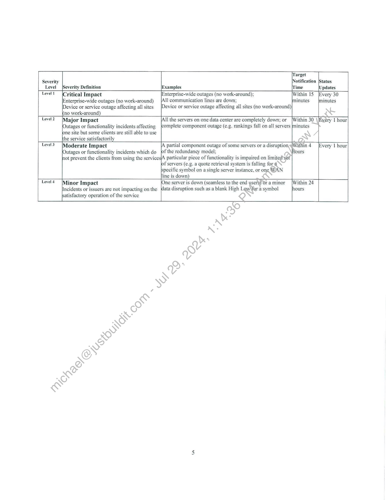
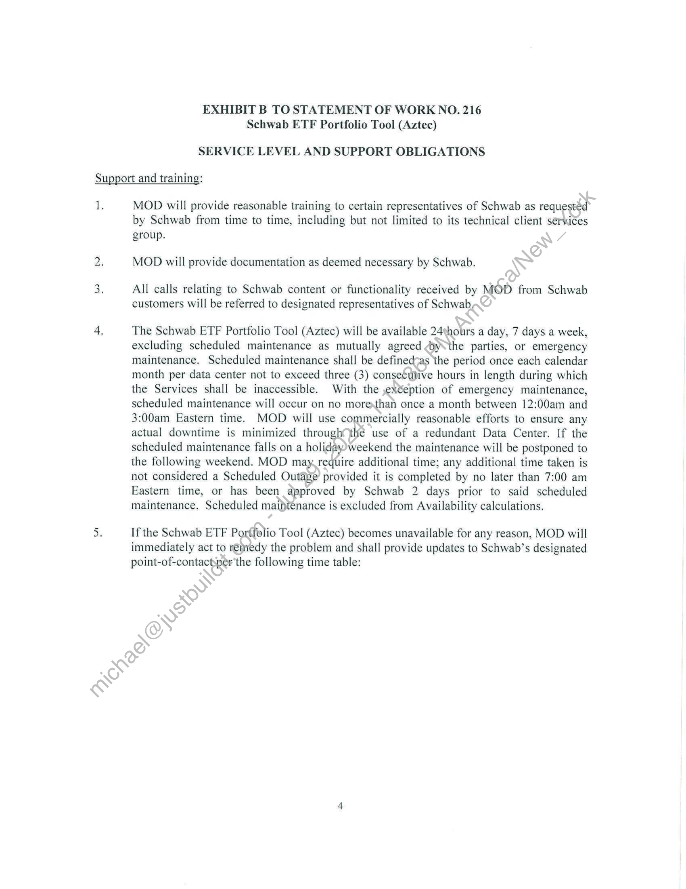
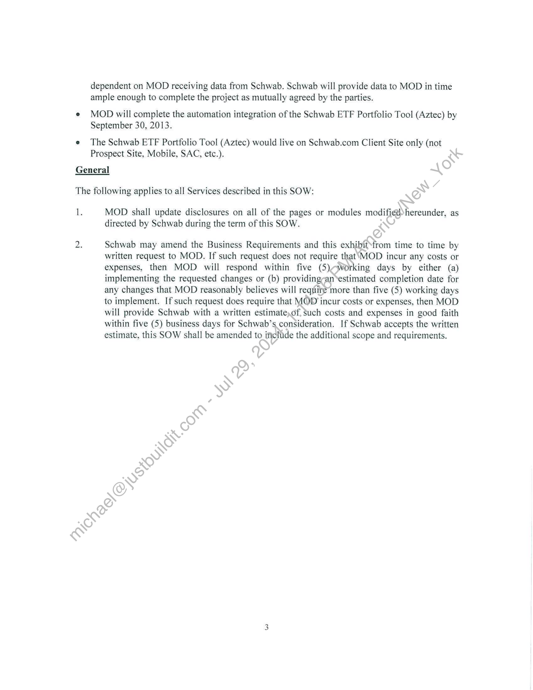
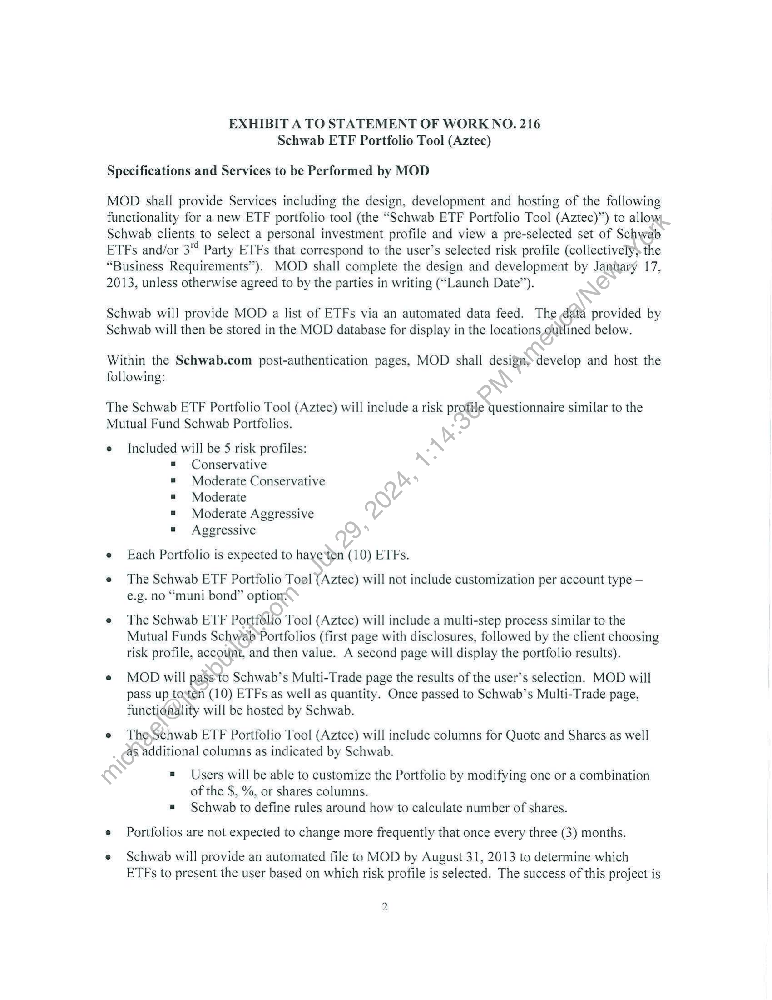

##### EXHIBIT C TO STATEMENT OF WORK NO. 216
Schwab ETF Portfolio Tool (Aztec)
TERM, FEES AND EXPENSES]

  
````col
```col-md
flexGrow=.5
===
> [!info] [Page 1](_attachments/images_Schwab-3.6.1.18.5900150234.pdf_211038/page_1.png)
> 
```  
```col-md
I.  
EXHIBIT C TO STATEMENT OF WORK NO. 216
Schwab ETF Portfolio Tool (Aztec)  
TERM, FEES AND EXPENSES  
Term.  
The term of this SOW will commence on the SOW Effective Date and last for twelve\ (12)
months from the Launch Date (“Initial Term”) unless terminated in accordance with’ the
Agreement, at which time it shall renew for additional thirty (30) day periods (each aRenewal
Term”) until terminated by Schwab at any time, on thirty (30) days prior written netice to MOD.
The Initial Term and Renewal Terms are referred to herein collectively as the “Term.” There are
two (2) phases to this SOW:  
Il.  
A) Phase 1: The design and development phase of this SOWwill commence on the
SOW Effective Date and will be completed by the Launch Date.  
B) Phase 2: Upon completion and acceptance of the design and development phase, the
ongoing hosting and maintenance phase of this SOW will commence on the Launch
Date and shall continue for twelve (12) months. thereafter, with automatic Renewal
Terms, as described above.  
Fees.  
A) One Time Development Fee: Upon launch of the project to a MOD production
environment, Schwab shall payMOD a one-time, fixed development fee of $50,000.  
B) Hosting Fees: Commencing*on the Launch Date through the earlier of (i) August 31,
2013 or (ii) receipt of an automated file from Schwab, Schwab shall pay MOD $4,500
per month for the hasting and maintenance of the Schwab ETF Portfolio Tool (Aztec)
content. Thereafter,» Schwab shall pay MOD $3,500 per month for the hosting and
maintenance. of the Schwab ETF Portfolio Tool (Aztec) content.  
C) Schwab issresponsible for all license and other fees payable to the third-party
information providers for the use of their information or content pursuant to this
SOW:  
D)Unless the parties agree in writing to expand the scope of the services to be provided
under this SOW, there are no other fees to be paid by Schwab to MOD for the work,
deliverables and services provided under this SOW.  
```
````
Notes:    
````col
```col-md
flexGrow=.5
===
> [!info] [Page 2](_attachments/images_Schwab-3.6.1.18.5900150234.pdf_211038/page_2.png)
> 
```  
```col-md
[Target  
Severity Notification |Status
Level {Severity Definition Examples {Time (Updates
Level! (Critical Impact Enterprise-wide outages (no work-around); Within 15 [Every 30
[Enterprise-wide outages (no work-around) 1] communication lines are down: jminutes minutes
[Device or service outage affecting all sites evice or service outage affecting all sites (no work-around)
no work-around)
Level? |Major Impact Il the servers on one data center are completely down: or [Within 30 \[Evéry 1 hour
\Outages or functionality incidents affecting complete component outage (e.g. rankings fall on all servers |minutes
jone site but some clients are still able to use
{the service satisfactorily
Level3 (Moderate Impact [A partial component outage of some servers or a disruption<Within 4 [Every I hour
(Outages or functionality incidents which do_ pf the redundancy model: hours
not prevent the clients from using the services|A particular piece of functionality is impaired on limited’set
f servers (e.g. a quote retrieval system is falling for 4
{specific symbol on a single server instance, or one WAN
lline is down)
Level4  /Minor Impact One server is down (seamless to the end users) Ora minor |Within 24
Incidents or issuers are not impacting on the (data disruption such as a blank High Low fer a symbol hours  
satisfactory operation of the service  
```
````
Notes:    
````col
```col-md
flexGrow=.5
===
> [!info] [Page 3](_attachments/images_Schwab-3.6.1.18.5900150234.pdf_211038/page_3.png)
> 
```  
```col-md
EXHIBIT B TO STATEMENT OF WORK NO. 216
Schwab ETF Portfolio Tool (Aztec)  
SERVICE LEVEL AND SUPPORT OBLIGATIONS  
Support and training:  
1.  
wo  
wn  
MOD will provide reasonable training to certain representatives of Schwab as requestéd
by Schwab from time to time, including but not limited to its technical client services  
group.
MOD will provide documentation as deemed necessary by Schwab.  
All calls relating to Schwab content or functionality received by MOD from Schwab
customers will be referred to designated representatives of Schwab,  
The Schwab ETF Portfolio Tool (Aztec) will be available 24thours a day, 7 days a week,
excluding scheduled maintenance as mutually agreed by\the parties, or emergency
maintenance. Scheduled maintenance shall be definedsas ‘the period once each calendar
month per data center not to exceed three (3) consecutive hours in length during which
the Services shall be inaccessible. With the ,»exteption of emergency maintenance,
scheduled maintenance will occur on no moresthan once a month between 12:00am and
3:00am Eastern time. MOD will use commercially reasonable efforts to ensure any
actual downtime is minimized through the use of a redundant Data Center. If the
scheduled maintenance falls on a holiday)weekend the maintenance will be postponed to
the following weekend. MOD may. require additional time; any additional time taken is
not considered a Scheduled Outage’ provided it is completed by no later than 7:00 am
Eastern time, or has been approved by Schwab 2 days prior to said scheduled
maintenance. Scheduled maintenance is excluded from Availability calculations.  
If the Schwab ETF Portfolio Tool (Aztec) becomes unavailable for any reason, MOD will
immediately act to remedy the problem and shall provide updates to Schwab’s designated
point-of-contact:per'the following time table:  
```
````
Notes:    
````col
```col-md
flexGrow=.5
===
> [!info] [Page 4](_attachments/images_Schwab-3.6.1.18.5900150234.pdf_211038/page_4.png)
> 
```  
```col-md
dependent on MOD receiving data from Schwab. Schwab will provide data to MOD in time
ample enough to complete the project as mutually agreed by the parties.  
e MOD will complete the automation integration of the Schwab ETF Portfolio Tool (Aztec) by
September 30, 2013.  
e The Schwab ETF Portfolio Tool (Aztec) would live on Schwab.com Client Site only (not
Prospect Site, Mobile, SAC, etc.).  
General
The following applies to all Services described in this SOW:  
i. MOD shall update disclosures on all of the pages or modules modifiedhereunder, as
directed by Schwab during the term of this SOW.  
2. Schwab may amend the Business Requirements and this exhibitMrom time to time by
written request to MOD. If such request does not require that‘MOD incur any costs or
expenses, then MOD will respond within five (5)sjvorking days by either (a)
implementing the requested changes or (b) providing-an‘estimated completion date for
any changes that MOD reasonably believes will require more than five (5) working days
to implement. If such request does require that MOD incur costs or expenses, then MOD
will provide Schwab with a written estimate)of, such costs and expenses in good faith
within five (5) business days for Schwab’s consideration. If Schwab accepts the written
estimate, this SOW shall be amended to ificlude the additional scope and requirements.  
```
````
Notes:    
````col
```col-md
flexGrow=.5
===
> [!info] [Page 5](_attachments/images_Schwab-3.6.1.18.5900150234.pdf_211038/page_5.png)
> 
```  
```col-md
EXHIBIT A TO STATEMENT OF WORK NO. 216
Schwab ETF Portfolio Tool (Aztec)  
Specifications and Services to be Performed by MOD  
MOD shall provide Services including the design, development and hosting of the following
functionality for a new ETF portfolio tool (the “Schwab ETF Portfolio Tool (Aztec)”) to allow
Schwab clients to select a personal investment profile and view a pre-selected set of Schwab
ETFs and/or 3" Party ETFs that correspond to the user’s selected risk profile (collectively the
“Business Requirements”). MOD shall complete the design and development by January 17,
2013, unless otherwise agreed to by the parties in writing (“Launch Date”).  
Schwab will provide MOD a list of ETFs via an automated data feed. The data provided by
Schwab will then be stored in the MOD database for display in the locations outlined below.  
Within the Schwab.com post-authentication pages, MOD shall design» develop and host the
following:  
The Schwab ETF Portfolio Tool (Aztec) will include a risk profile questionnaire similar to the
Mutual Fund Schwab Portfolios.  
e Included will be 5 risk profiles:  
= Conservative
Moderate Conservative
Moderate
Moderate Aggressive
Aggressive  
e Each Portfolio is expected to haye*ten (10) ETFs.  
e The Schwab ETF Portfolio Tool (Aztec) will not include customization per account type —
e.g. no “muni bond” option:  
e The Schwab ETF Portfolio Tool (Aztec) will include a multi-step process similar to the
Mutual Funds Schwab Portfolios (first page with disclosures, followed by the client choosing
risk profile, account, and then value. A second page will display the portfolio results).  
e MOD will passto Schwab’s Multi-Trade page the results of the user’s selection. MOD will
pass up tosten (10) ETFs as well as quantity. Once passed to Schwab’s Multi-Trade page,
functionality will be hosted by Schwab.  
e TheSchwab ETF Portfolio Tool (Aztec) will include columns for Quote and Shares as well
as additional columns as indicated by Schwab.  
= Users will be able to customize the Portfolio by modifying one or a combination
of the $, %, or shares columns.
= Schwab to define rules around how to calculate number of shares.  
e Portfolios are not expected to change more frequently that once every three (3) months.  
e Schwab will provide an automated file to MOD by August 31, 2013 to determine which
ETFs to present the user based on which risk profile is selected. The success of this project is  
2  
```
````
Notes:    
````col
```col-md
flexGrow=.5
===
> [!info] [Page 6](_attachments/images_Schwab-3.6.1.18.5900150234.pdf_211038/page_6.png)
> 
```  
```col-md
STATEMENT OF WORK NO. 216
Schwab ETF Portfolio Tool (Aztec)  
Markit On Demand, Inc., formerly known as Wall Street On Demand, Inc. (“MOD”) and
Charles Schwab & Co., Inc. (“Schwab”), hereby agree to supplement their Master Internet Site
Agreement effective as of February 1, 2001, as amended (the “Agreement”) with the following
Statement of Work No. 216 (this “SOW”), dated November 5, 2012 and effective as of July 25)
2012 (the “SOW Effective Date”).  
This SOW will incorporate by reference the Agreement upon execution of thissSOW by
both parties. In the event of any conflict between the Agreement and this SOW, the.terms of the
Agreement shall govern. Capitalized terms, not otherwise defined herein, shall have the
meanings assigned to them in the Agreement.  
The Agreement and this SOW are the entire agreement betweenithe parties concerning
MOD’s provision of the products and services described in this SOW.  
This SOW is composed of the following:  
Exhibit A: | Schwab Exchange Traded Funds (ETF) Portfolio Tool (Aztec)  
Exhibit B: Service Level and Support Obligations  
ExhibitC: Term, Fees and Expenses  
In witness whereof, the parties to this SQW execute it through their duly authorized
representatives. The parties hereby acknowledge that they have read this SOW, including all
exhibits and the Agreement, and understand and agree to be bound by its terms and conditions.  
Charles Schwab & Co., Inc.:  
(Signatu  
Fx.  
(Printed Name) James Tanner  
(Title) MOD Global Head  
2 eee
(Date) (Date)  
```
````
Notes:  


![[_attachments/Schwab-3.6.1.18.59 00150234.pdf]