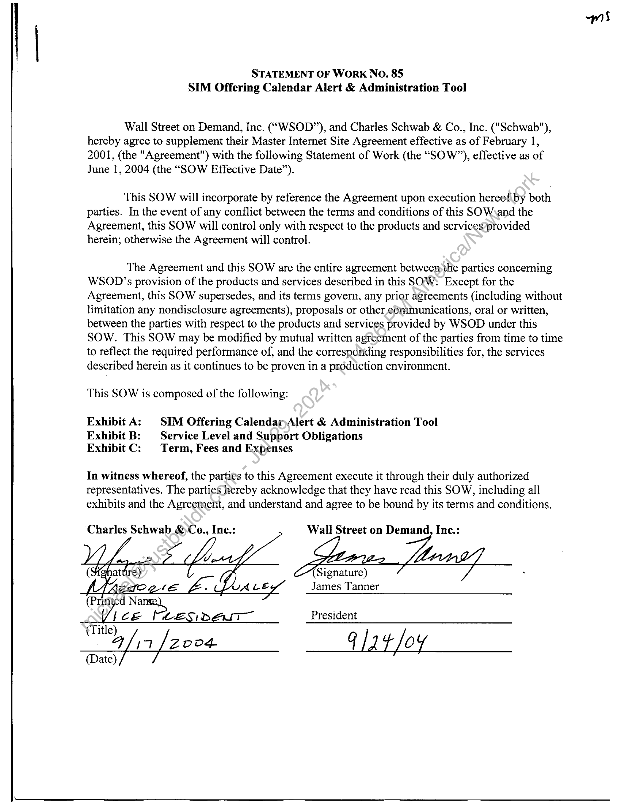
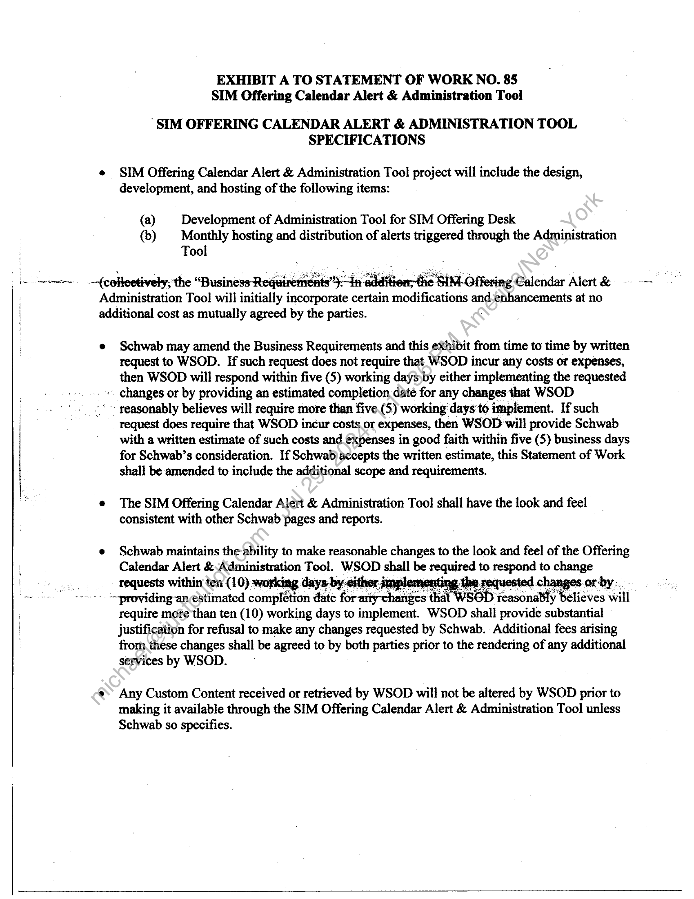
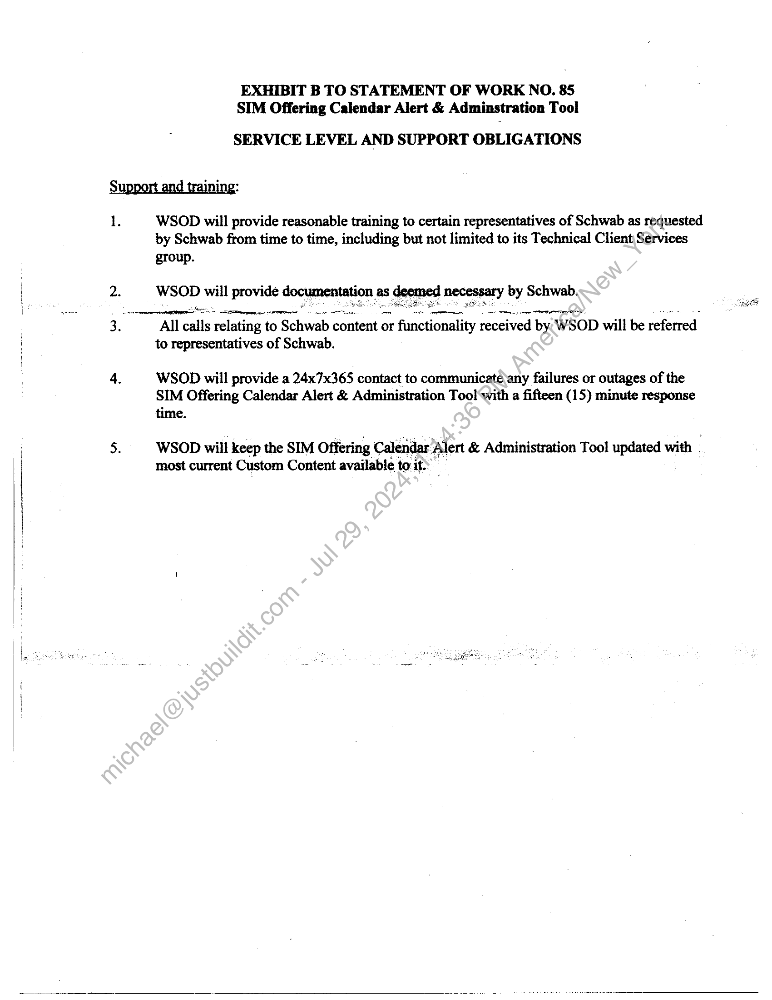
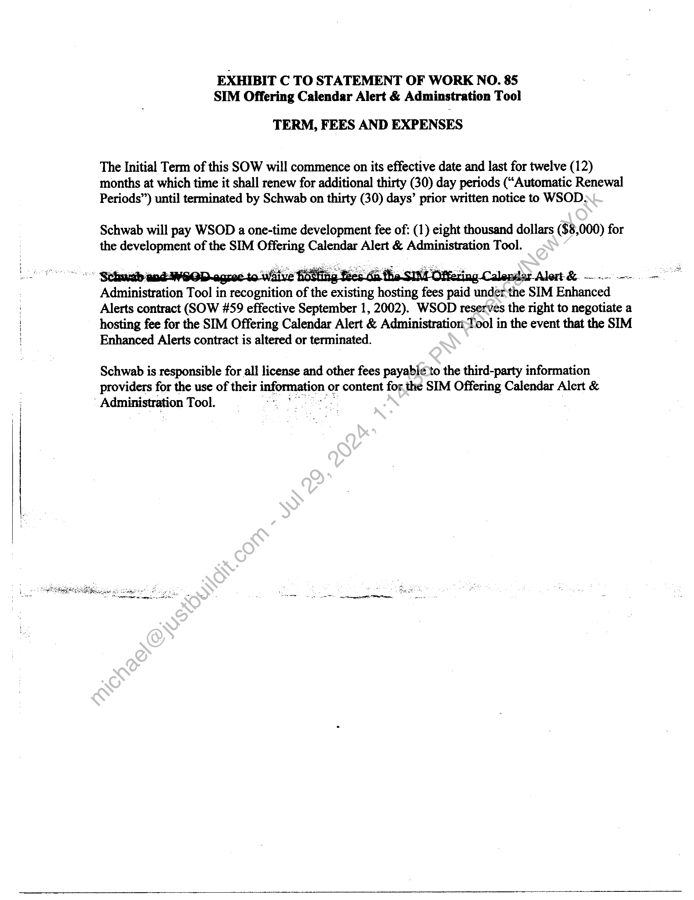

##### STATEMENT OF WORK No. 85
SIM Offering Calendar Alert & Administration Tool]

  
````col
```col-md
flexGrow=.5
===
> [!info] [Page 1](_attachments/images_Schwab-3.6.1.18.6000152847.pdf_212034/page_1.png)
> 
```  
```col-md
STATEMENT OF Work No. 85
SIM Offering Calendar Alert & Administration Tool  
Wall Street on Demand, Inc. (“WSOD”), and Charles Schwab & Co., Inc. ("Schwab"),
hereby agree to supplement their Master Internet Site Agreement effective as of February 1,
2001, (the "Agreement") with the following Statement of Work (the “SOW”), effective as of
June 1, 2004 (the “SOW Effective Date”).  
This SOW will incorporate by reference the Agreement upon execution hereof by both
parties. In the event of any conflict between the terms and conditions of this SOW,and the
Agreement, this SOW will control only with respect to the products and services*provided
herein; otherwise the Agreement will control.  
The Agreement and this SOW are the entire agreement between>the parties concerning
WSOD’s provision of the products and services described in this SOW: Except for the
Agreement, this SOW supersedes, and its terms govern, any prior agreements (including without
limitation any nondisclosure agreements), proposals or other cOmmunications, oral or written,
between the parties with respect to the products and services provided by WSOD under this
SOW. This SOW may be modified by mutual written agreement of the parties from time to time
to reflect the required performance of, and the corresporiding responsibilities for, the services
described herein as it continues to be proven in a production environment.  
This SOW is composed of the following:  
Exhibit A: SIM Offering CalendarAlert & Administration Tool
Exhibit B: Service Level and Support Obligations
Exhibit C: Term, Fees and Expenses  
In witness whereof, the parties to this Agreement execute it through their duly authorized
representatives. The parties hereby acknowledge that they have read this SOW, including all
exhibits and the Agreement, and understand and agree to be bound by its terms and conditions.  
Charles Schwab _&Co., Inc.: Wall Street on Demand, Inc.:  
Signature)
James Tanner  
(Print d Nanse),
Vice tes pam President
(Title) TO
Fina [2004 GlAt OY
(Date)  
```
````
Notes:    
````col
```col-md
flexGrow=.5
===
> [!info] [Page 2](_attachments/images_Schwab-3.6.1.18.6000152847.pdf_212034/page_2.png)
> 
```  
```col-md
i
[oe one arr:  
1  
(collectively; the “Busi  
EXHIBIT A TO STATEMENT OF WORK NO. 85
SIM Offering Calendar Alert & Administration Tool  
“SIM OFFERING CALENDAR ALERT & ADMINISTRATION TOOL
SPECIFICATIONS  
SIM Offering Calendar Alert & Administration Tool project will include the design,
development, and hosting of the following items:  
(a) Development of Administration Tool for SIM Offering Desk
(b) Monthly hosting and distribution of alerts triggered through the Administration
Tool  
In edition; its OtteringDalendar Alert &  
Administration Tool will initially incorporate certain modifications andjenhancements at no
additional cost as mutually agreed by the parties.  
Schwab may amend the Business Requirements and this exhibit from time to time by written
request to WSOD. If such request does not require that WSOD incur any costs or expenses,
then WSOD will respond within five (5) working daysby either implementing the requested  
-. changes or by providing an estimated completion. date for any changes that WSOD  
~ reasonably believes will require more than five. (5) working days'to implement. If such  
request does require that WSOD incur costs.or expenses, then WSOD will provide Schwab
with a written estimate of such costs and expenses in good faith within five (5) business days
for Schwab’s consideration. If Schwab accepts the written estimate, this Statement of Work
shall be amended to include the additional scope and requirements.  
The SIM Offering Calendar Alert & Administration Tool shall have the look and feel
consistent with other Schwab pages and reports.  
Schwab maintains the ability to make reasonable changes to the look and feel of the Offering
Calendar Alert & Administration Tool. WSOD shall be required to respond to change
requests within ten (10) working days by either in mnting the requested changes or by.  
~providing an estimated complétion date for amy changes that WSOD reasonably beliéves: will
require more than ten (10) working days to implement. WSOD shall provide substantial
justification for refusal to make any changes requested by Schwab. Additional fees arising
from. these changes shall be agreed to by both 1 parties prior to the rendering of any additional
services by WSOD.  
Any Custom Content received or retrieved by WSOD will not be altered by WSOD prior to
making it available through the SIM Offering Calendar Alert & Administration Too] unless
Schwab so specifies.  
```
````
Notes:    
````col
```col-md
flexGrow=.5
===
> [!info] [Page 3](_attachments/images_Schwab-3.6.1.18.6000152847.pdf_212034/page_3.png)
> 
```  
```col-md
EXHIBIT B TO STATEMENT OF WORK NO. 85
SIM Offering Calendar Alert & Adminstration Tool  
SERVICE LEVEL AND SUPPORT OBLIGATIONS  
WSOD will provide reasonable training to certain representatives of Schwab as requested
by Schwab from time to time, including but not limited to its Technical Client Services  
group.
WSOD will provide documentation as deemed necessary by Schwab.  
se ee (Ae oe en ee  
All calls relating to © Schwab content o1 or functionality received by. WSOD will be referred
to representatives of Schwab.  
WSOD will provide a 24x7x365 contact to communicate\any failures or outages of the
SIM Offering Calendar Alert & Administration Tool with a fifteen (15) minute response
time. :  
WSOD will keep the SIM Offering Calendar’ ‘Alert & Administration Tool updated with
most current Custom Content available to:it::  
```
````
Notes:    
````col
```col-md
flexGrow=.5
===
> [!info] [Page 4](_attachments/images_Schwab-3.6.1.18.6000152847.pdf_212034/page_4.png)
> 
```  
```col-md
EXHIBIT C TO STATEMENT OF WORK NO. 85
SIM Offering Calendar Alert & Adminstration Tool  
TERM, FEES AND EXPENSES
The Initial Term of this SOW will commence on its effective date and last for twelve (12)  
months at which time it shall renew for additional thirty (30) day periods (“Automatic Renewal
Periods”) until terminated by Schwab on thirty (30) days’ prior written notice to WSOD.  
Schwab will pay WSOD a one-time development fee of: (1) eight thousand dollars ($8,000) for
the development of the SIM Offering Calendar Alert & Administration Tool.  
‘Administration Tool in recognition of the existing ig hosting fees paid under the SIM Enhanced
Alerts contract (SOW #59 effective September 1, 2002). WSOD reserves the right to negotiate a
hosting fee for the SIM Offering Calendar Alert & Administration-Tool in the event that the SIM
Enhanced Alerts contract is altered or terminated.  
Schwab is responsible for all license and other fees payable to the third-party information
providers for the use of their information or content for the SIM Offering Calendar Alert &
’ Administration Tool. ae  
```
````
Notes:  


![[_attachments/Schwab-3.6.1.18.60 00152847.pdf]