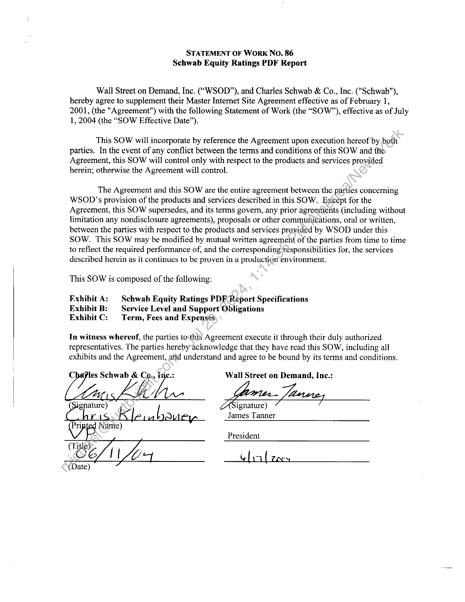
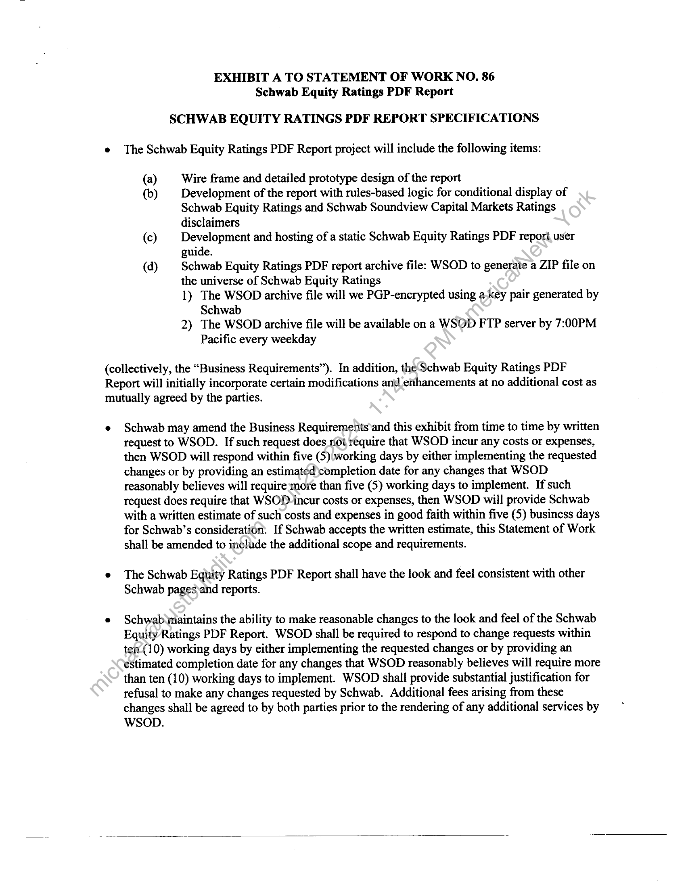
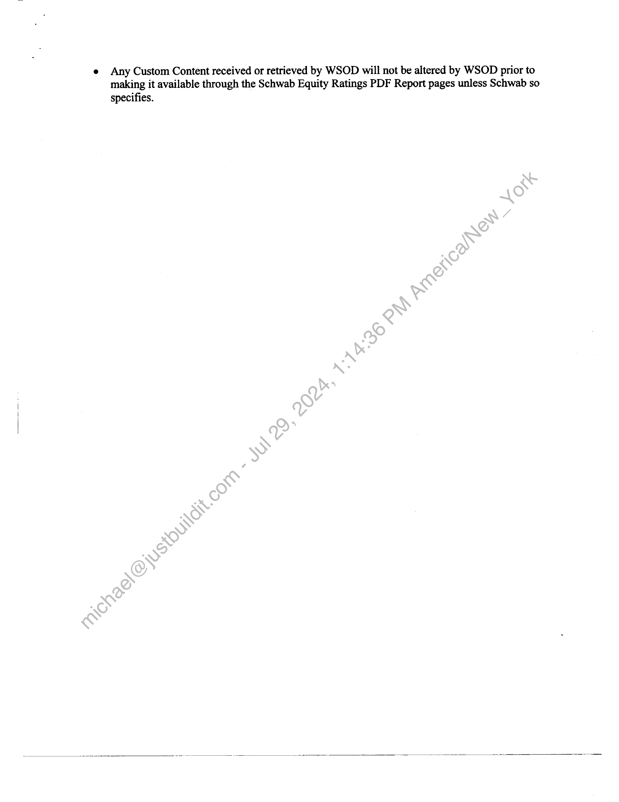
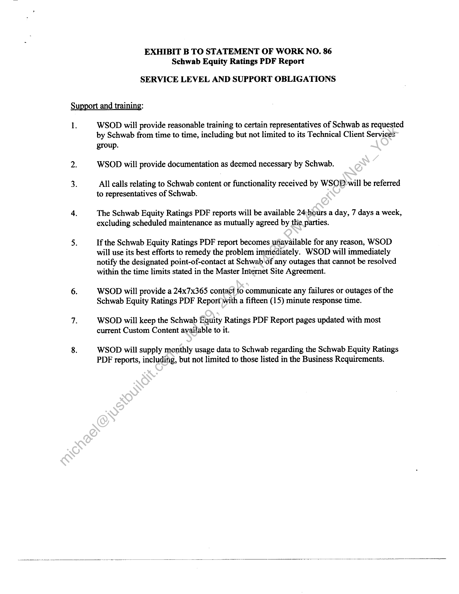
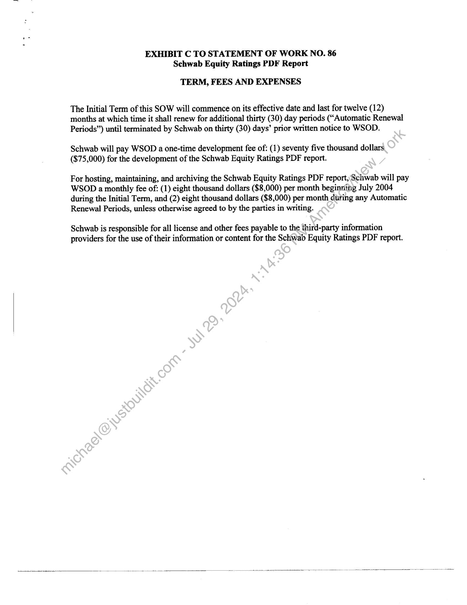

##### Statement of Work No. 86 - Schwab Equity Ratings PDF Report]

  
````col
```col-md
flexGrow=.5
===
> [!info] [Page 1](_attachments/images_Schwab-3.6.1.18.6200152850.pdf_210337/page_1.png)
> 
```  
```col-md
STATEMENT OF WORK NO. 86
Schwab Equity Ratings PDF Report  
Wall Street on Demand, Inc. (“WSOD”), and Charles Schwab & Co., Inc. ("Schwab"),
hereby agree to supplement their Master Internet Site Agreement effective as of February 1,
2001, (the "Agreement") with the following Statement of Work (the “SOW?”), effective as of July
1, 2004 (the “SOW Effective Date”).  
This SOW will incorporate by reference the Agreement upon execution hereof by both
parties. In the event of any conflict between the terms and conditions of this SOW and the
Agreement, this SOW will control only with respect to the products and services provided
herein; otherwise the Agreement will control.  
The Agreement and this SOW are the entire agreement between the parties concerning
WSOD’s provision of the products and services described in this SOW. Except for the
Agreement, this SOW supersedes, and its terms govern, any prior agreements (including without
limitation any nondisclosure agreements), proposals or other communications, oral or written,
between the parties with respect to the products and services provided by WSOD under this
SOW. This SOW may be modified by mutual written agreement of the parties from time to time
to reflect the required performance of, and the corresponding‘résponsibilities for, the services
described herein as it continues to be proven in a production environment.  
This SOW is composed of the following:  
Exhibit A: | Schwab Equity Ratings PDF Report Specifications  
Exhibit B: — Service Level and Support Obligations  
Exhibit C: Term, Fees and Expenses  
In witness whereof, the parties towthis Agreement execute it through their duly authorized  
representatives. The parties hereby acknowledge that they have read this SOW, including all
exhibits and the Agreement, and understand and agree to be bound by its terms and conditions.  
Co, Ine.: Wall Street on Demand, Inc.:
ae [ ignature)  
JamesTannero
Pri  
President  
—teliafzecs  
```
````
Notes:    
````col
```col-md
flexGrow=.5
===
> [!info] [Page 2](_attachments/images_Schwab-3.6.1.18.6200152850.pdf_210337/page_2.png)
> 
```  
```col-md
EXHIBIT A TO STATEMENT OF WORK NO. 86
Schwab Equity Ratings PDF Report  
SCHWAB EQUITY RATINGS PDF REPORT SPECIFICATIONS
The Schwab Equity Ratings PDF Report project will include the following items:  
(a) Wire frame and detailed prototype design of the report
(b) Development of the report with rules-based logic for conditional display of
Schwab Equity Ratings and Schwab Soundview Capital Markets Ratings
disclaimers
(c) Development and hosting of a static Schwab Equity Ratings PDF report, user
guide.
(d) Schwab Equity Ratings PDF report archive file: WSOD to generaie a ZIP file on
the universe of Schwab Equity Ratings
1) The WSOD archive file will we PGP-encrypted using a.key pair generated by
Schwab
2) The WSOD archive file will be available on a WSOD FTP server by 7:00PM
Pacific every weekday  
(collectively, the “Business Requirements”). In addition, the Schwab Equity Ratings PDF
Report will initially incorporate certain modifications and_erihancements at no additional cost as
mutually agreed by the parties.  
Schwab may amend the Business Requirements and this exhibit from time to time by written
request to WSOD. If such request does not require that WSOD incur any costs or expenses,
then WSOD will respond within five (5) working days by either implementing the requested
changes or by providing an estimated completion date for any changes that WSOD
reasonably believes will require more than five (5) working days to implement. If such
request does require that WSOD incur costs or expenses, then WSOD will provide Schwab
with a written estimate of such costs and expenses in good faith within five (5) business days
for Schwab’s consideration. If Schwab accepts the written estimate, this Statement of Work
shall be amended to include the additional scope and requirements.  
The Schwab Equity Ratings PDF Report shall have the look and feel consistent with other
Schwab pages)and reports.  
Schwab maintains the ability to make reasonable changes to the look and feel of the Schwab
Equity Ratings PDF Report. WSOD shall be required to respond to change requests within
tei(10) working days by either implementing the requested changes or by providing an
estimated completion date for any changes that WSOD reasonably believes will require more
than ten (10) working days to implement. WSOD shall provide substantial justification for
refusal to make any changes requested by Schwab. Additional fees arising from these
changes shall be agreed to by both parties prior to the rendering of any additional services by
WSOD.  
```
````
Notes:    
````col
```col-md
flexGrow=.5
===
> [!info] [Page 3](_attachments/images_Schwab-3.6.1.18.6200152850.pdf_210337/page_3.png)
> 
```  
```col-md
e Any Custom Content received or retrieved by WSOD will not be altered by WSOD prior to
making it available through the Schwab Equity Ratings PDF Report pages unless Schwab so
specifies.  
```
````
Notes:    
````col
```col-md
flexGrow=.5
===
> [!info] [Page 4](_attachments/images_Schwab-3.6.1.18.6200152850.pdf_210337/page_4.png)
> 
```  
```col-md
EXHIBIT B TO STATEMENT OF WORK NO. 86
Schwab Equity Ratings PDF Report  
SERVICE LEVEL AND SUPPORT OBLIGATIONS  
Support and training:  
1.  
WSOD will provide reasonable training to certain representatives of Schwab as requested
by Schwab from time to time, including but not limited to its Technical Client Services  
group.
WSOD will provide documentation as deemed necessary by Schwab.  
All calls relating to Schwab content or functionality received by WSOD will be referred
to representatives of Schwab.  
The Schwab Equity Ratings PDF reports will be available 24:hours a day, 7 days a week,
excluding scheduled maintenance as mutually agreed by the parties.  
If the Schwab Equity Ratings PDF report becomes unavailable for any reason, WSOD
will use its best efforts to remedy the problem immediately. WSOD will immediately
notify the designated point-of-contact at Schwab'of any outages that cannot be resolved
within the time limits stated in the Master Internet Site Agreement.  
WSOD will provide a 24x7x365 contact fo communicate any failures or outages of the
Schwab Equity Ratings PDF Report)with a fifteen (15) minute response time.  
WSOD will keep the Schwab Equity Ratings PDF Report pages updated with most
current Custom Content available to it.  
WSOD will supply monthly usage data to Schwab regarding the Schwab Equity Ratings
PDF reports, including, but not limited to those listed in the Business Requirements.  
```
````
Notes:    
````col
```col-md
flexGrow=.5
===
> [!info] [Page 5](_attachments/images_Schwab-3.6.1.18.6200152850.pdf_210337/page_5.png)
> 
```  
```col-md
EXHIBIT C TO STATEMENT OF WORK NO. 86
Schwab Equity Ratings PDF Report  
TERM, FEES AND EXPENSES  
The Initial Term of this SOW will commence on its effective date and last for twelve (12)
months at which time it shall renew for additional thirty (30) day periods (“Automatic Renewal
Periods”) until terminated by Schwab on thirty (30) days’ prior written notice to WSOD.  
Schwab will pay WSOD a one-time development fee of: (1) seventy five thousand dollars
($75,000) for the development of the Schwab Equity Ratings PDF report.  
For hosting, maintaining, and archiving the Schwab Equity Ratings PDF report, Schwab will pay
WSOD a monthly fee of: (1) eight thousand dollars ($8,000) per month beginning July 2004
during the Initial Term, and (2) eight thousand dollars ($8,000) per month during any Automatic
Renewal Periods, unless otherwise agreed to by the parties in writing.  
Schwab is responsible for all license and other fees payable to the third-party information
providers for the use of their information or content for the Schwab Equity Ratings PDF report.  
```
````
Notes:  


![[_attachments/Schwab-3.6.1.18.62 00152850.pdf]