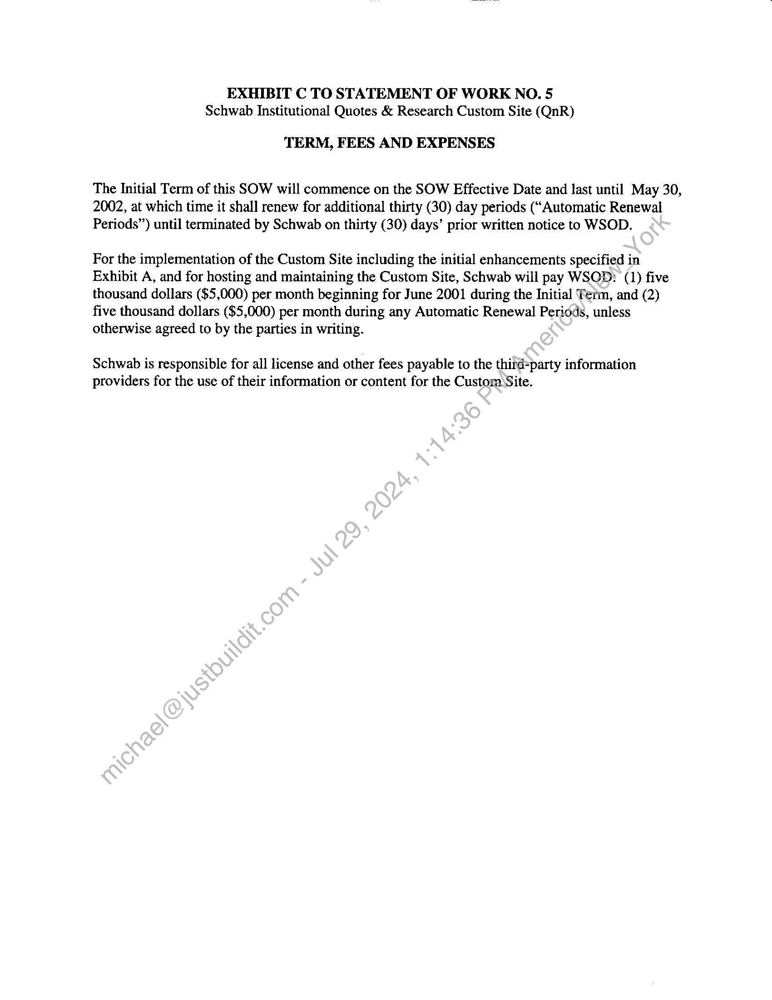
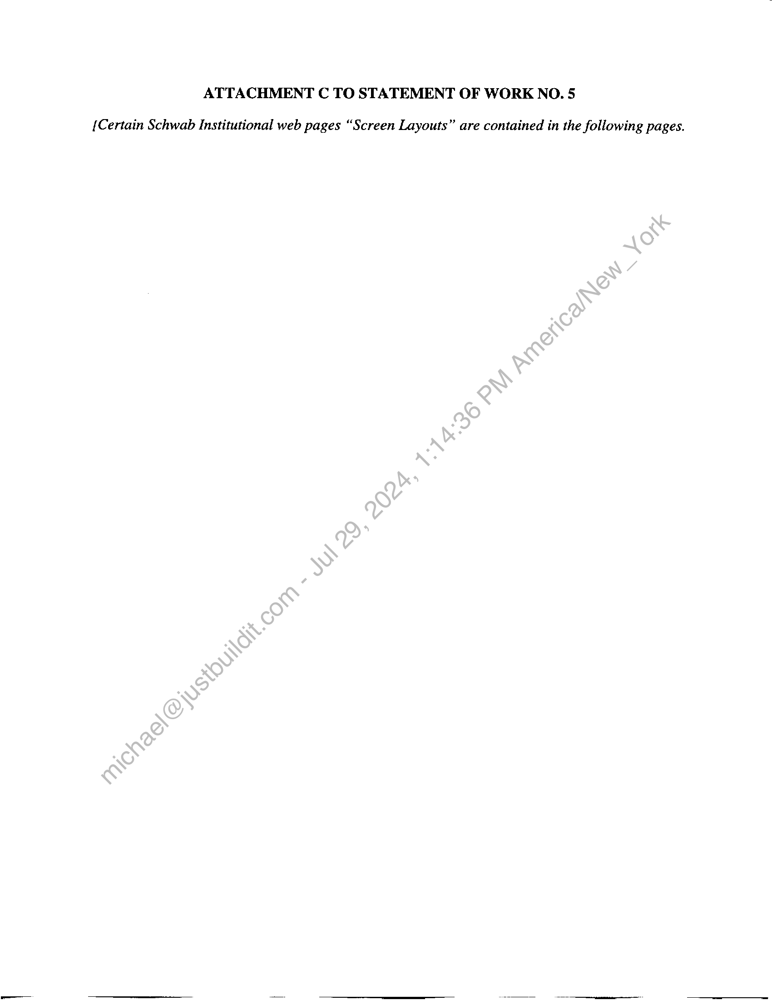

##### Statement of Work No. 3 HH @ Schwab Institutional Quotes & Research Custom Site]

  
````col
```col-md
flexGrow=.5
===
> [!info] [Page 1](_attachments/images_Schwab-3.6.1.18.700150146.pdf_211958/page_1.png)
> 
```  
```col-md
STATEMENT OF WORK No. 3 HH @  
Schwab Institutional Quotes & Research Custom Site  
Wall Street on Demand, Inc. (““WSOD”), and Charles Schwab & Co., Inc. ("Schwab"),
hereby agree to supplement their Master Internet Site Agreement effective as of February 1,
2001, (the "Agreement") with the following Statement of Work (the “SOW”), effective as of
June 1, 2001 (the “SOW Effective Date”). The parties acknowledge that this SOW is being
executed subsequent to the SOW Effective Date and that the Custom Site is already in a
production environment.  
This SOW will incorporate by reference the Agreement upon execution hereof by both
parties. In the event of any conflict between the terms and conditions of this SOW and the
Agreement, this SOW will control only with respect to the products and services provided
herein; otherwise the Agreement will control.  
The Agreement and this SOW are the entire agreement between the parties conceming
WSOD?’s provision of the products and services described in this SOW. Except for the
Agreement, this SOW supersedes, and its terms govern, any prior agreements (including without
limitation any nondisclosure agreements), proposals or other’communications, oral or written,
between the parties with respect to the products and services provided by WSOD under this
SOW. This SOW may be modified by mutual written agreement of the parties from time to time
to reflect the required performance of, and the corresponding responsibilities for, the services
described herein as it continues to be proven in_a production environment.  
This SOW is composed of the following:  
Exhibit A: | Custom Site Specifications
Exhibit B: Service Level and Support Obligations
Exhibit C: Term, Fees and. Expenses  
In witness whereof, the parties to this Agreement execute it through their duly authorized
representatives. The parties hereby acknowledge that they have read this SOW, including all
exhibits and the Agreement, and understand and agree to be bound by its terms and conditions.  
a Schwab, & Co., Inc.: Wall Street on Demand, Inc.:
Signature) (Signature)
Lizanetd Ftrto  
(Printed Name) James Tann  
Vj “u (At haf - erks
President  
(Title) 7) Yor S bide Ly Pox  
(Date) (Date)  
```
````
Notes:    
````col
```col-md
flexGrow=.5
===
> [!info] [Page 2](_attachments/images_Schwab-3.6.1.18.700150146.pdf_211958/page_2.png)
> 
```  
```col-md
EXHIBIT A TO STATEMENT OF WORK NO. 5
Schwab Institutional Quotes & Research Custom Site (“QnR”)  
CUSTOM SITE SPECIFICATIONS  
The Custom Site, prepared for Schwab Institutional, a division of Schwab, will host the
Custom Content in accordance with:  
(a) Schwab’s business requirements dated June 28, 2001, contained in a document
titled “Quotes and Research Redesign Project, Business Requirements” Version
1.0 attached to this SOW as Attachment A (“QnR Redesign Business
Requirements”); and  
(b) Schwab’s Use Case Scenarios dated April 6, 2001, contained in,a document titled
“WSOD Content (QnR Redesign) Use Case Scenarios” attached to this SOW as
Attachment B (“Use Case Scenarios”); and  
(c) Certain Schwab Institutional web pages captured inva document entitled “Screen
Layout Pages” attached to this SOW as Attachment C (“Screen Layouts”).  
(collectively, the “Business Requirements”). Jn addition, the Custom Site will initially
incorporate certain modifications and enhancements at.no additional cost as mutually agreed by
the parties.  
Schwab may amend the Business Requirements and this exhibit from time to time by written
request to WSOD. If such request does)not require that WSOD incur any costs or expenses
of a material nature, then WSOD will implement such request and modify the Custom Site
accordingly within five (5) business days. If such request does require that WSOD incur
costs or expenses of a material nature, then WSOD will provide Schwab with a written
estimate of such costs and expenses in good faith within five (5) business days for Schwab’s
consideration. If Schwab accepts the written estimate, this Statement of Work shall be
amended to include the.additional scope and requirements.  
The Custom Site will have a page rendering time of no more than eight (8) seconds per user  
request with the exception of the Industry Overview page (Industries Tab) which will have a
page rendering time of no more than 15 seconds. Page rendering times are based upon DSL,
Cable modem, T1 or other equivalent data transmission speeds.  
The Custom Site shall have the look and feel consistent with other Schwab Institutional online pages and will be designed by Schwab, or a designee of Schwab. WSOD will implement
“look and feel” redesigns as they are done or requested by Schwab.  
The Custom Site shall include a help section as specified or provided by Schwab.  
The Custom Site shall not be modified by WSOD without prior approval from Schwab.  
```
````
Notes:    
````col
```col-md
flexGrow=.5
===
> [!info] [Page 3](_attachments/images_Schwab-3.6.1.18.700150146.pdf_211958/page_3.png)
> 
```  
```col-md
Schwab maintains the ability to change the look and feel of the Custom Site. WSOD shall be
required to respond to change requests within 5 working days by either implementing the
requested changes or by providing an estimated completion date for any changes that WSOD
reasonably believes will require more than 5 working days to implement. WSOD shall
provide substantial justification for refusal to make any changes requested by Schwab.
Additional fees arising from these changes shall be agreed to by both parties prior to the
rendering of any additional services by WSOD.  
The Custom Site will only be accessible through the Schwab Institutional web site and-by
special limited access to data providers of the Custom Site designated by Schwab. WSOD
will not allow users to enter the site by bookmarking the URL on WSOD’s servers\Any
attempt to do so must display an error message and take the user back to the Schwab
Institutional log on page (if not yet logged on), or to a blank page (if logged.on).  
The Custom Site will include only navigation and links specified by Schwab.
There will be no links to the WSOD home page in the Custom Site.  
The dimensions and location of the WSOD logo, if any,-which appear on the Custom Site
shall be according to the specifications as determined by:-Schwab.  
WSOD will retrieve or receive Custom Content from the third party content provider as
specified by Schwab and make such Content-available through the Custom Site immediately
as it is received.  
If WSOD is to retrieve said Custom Content, it will poll the third-party site every five (5)
minutes and retrieve all new data.  
Any Custom Content received or retrieved by WSOD will not be altered by WSOD prior to
making it available through the Custom Site unless Schwab so specifies.  
To the extent requested by Schwab, WSOD will poll its designated server every five (5)
minutes to retrievéyRI Forms transmitted by Schwab and will update restrictions (add or
remove blocks) within thirty (30) minutes of receiving a new RI Form from Schwab.  
```
````
Notes:    
````col
```col-md
flexGrow=.5
===
> [!info] [Page 4](_attachments/images_Schwab-3.6.1.18.700150146.pdf_211958/page_4.png)
> 
```  
```col-md
EXHIBIT B TO STATEMENT OF WORK NO. 5
Schwab Institutional Quotes & Research Custom Site (QnR)  
SERVICE LEVEL AND SUPPORT OBLIGATIONS  
Support and training:  
1.  
WSOD will provide reasonable training to certain representatives of Schwab Institutional
as requested by Schwab from time to time, including but not limited to its Technical
Client Services group.  
WSOD will provide documentation as deemed necessary by Schwab.  
All calls relating to Schwab content or functionality received by WSOD will be referred
to representatives of Schwab Institutional.  
The Custom Site will be available 24 hours a day, 7 days aweek, excluding scheduled
maintenance as mutually agreed by the parties.  
If the Custom Site becomes unavailable for any reason, WSOD will use its best efforts to
remedy the problem immediately. WSOD will immediately notify the designated point-  
of-contact at Schwab of any outages that cannot be resolved within the time limits stated
below in Section 6.  
WSOD will pay to Schwab liquidated damages equal to one thousand dollars ($1,000) for
each occurrence of the following:  
(a) The Custom Site and/or Custom Site Content is unavailable during trading hours
(ie., 6:15 a.m. tow:15 p.m., Pacific Time) for any period in excess of thirty (30)
minutes; or  
(b) The Custom Site and/or Custom Site Content is unavailable during non-trading
hoursfor any period in excess of two (2) hours.  
(c) Schwab and WSOD agree that any failure of the Custom Site may cause
irreparable harm to Schwab, the extent of which would be difficult to ascertain.
Accordingly, the parties agree that, in addition to the above remedies, Schwab
shall have the right to seek immediate injunctive relief or any other remedies in
the event of such a failure.  
Notwithstanding the foregoing, the amount of such liquidated damages payable by
WSOD in any month will not exceed fifteen thousand ($15,000) in total.  
WSOD will provide a 24x7x365 contact to communicate any failures or outages of the
Custom Site with a fifteen (15) minute response time.  
```
````
Notes:    
````col
```col-md
flexGrow=.5
===
> [!info] [Page 5](_attachments/images_Schwab-3.6.1.18.700150146.pdf_211958/page_5.png)
> 
```  
```col-md
WSOD will keep the Custom Site updated with most current Custom Content available to
it.  
In accordance with Section 6.3 of the Agreement, WSOD will block access to Custom
Content designated as Restricted Information with respect to Schwab and/or its affiliates
as specified by Schwab for symbols specified by Schwab upon receipt of an RI Form
from Schwab, and will lift restricted access to symbols upon receipt of an RI Form from
Schwab, indicating that restrictions should be lifted. WSOD will block access or lift
restrictions to Restricted Information as specified by Schwab within thirty (30) minutes
receipt of any RI Form from Schwab.  
WSOD will supply daily usage data to Schwab regarding the Custom Sitenincluding, but
not limited to those listed in the Business Requirements.  
Archives for Schwab Use: Content must be archived and available’for Schwab’s retrieval
as specified in the Business Requirements, and as mutually agreed to by the parties from
time to time.  
Upon request from Schwab, WSOD will make the archived information available to
Schwab within forty-eight hours. The information will be available, preferably in
electronic format (e.g., via FTP site), but paper is. acceptable. All reports, both on-line
and archived, must be date and time stamped to reflect the following:  
e Date received by WSOD from data/provider
e Date uploaded on the Custom Site
e Date removed from the Custom Site to archival  
```
````
Notes:    
````col
```col-md
flexGrow=.5
===
> [!info] [Page 6](_attachments/images_Schwab-3.6.1.18.700150146.pdf_211958/page_6.png)
> 
```  
```col-md
EXHIBIT C TO STATEMENT OF WORK NO. 5
Schwab Institutional Quotes & Research Custom Site (QnR)  
TERM, FEES AND EXPENSES  
The Initial Term of this SOW will commence on the SOW Effective Date and last until May 30,
2002, at which time it shall renew for additional thirty (30) day periods (“Automatic Renewal
Periods”) until terminated by Schwab on thirty (30) days’ prior written notice to WSOD.  
For the implementation of the Custom Site including the initial enhancements specified in
Exhibit A, and for hosting and maintaining the Custom Site, Schwab will pay WSOD: (1) five
thousand dollars ($5,000) per month beginning for June 2001 during the Initial Term, and (2)
five thousand dollars ($5,000) per month during any Automatic Renewal Periods, unless
otherwise agreed to by the parties in writing.  
Schwab is responsible for all license and other fees payable to the third-party information
providers for the use of their information or content for the Custom Site.  
```
````
Notes:    
````col
```col-md
flexGrow=.5
===
> [!info] [Page 7](_attachments/images_Schwab-3.6.1.18.700150146.pdf_211958/page_7.png)
> 
```  
```col-md
ATTACHMENT A TO STATEMENT OF WORK NO. 5  
{Quotes and Research Redesign Project, Business Requirements Version 1.0 is contained in the
following pages.]  
```
````
Notes:    
````col
```col-md
flexGrow=.5
===
> [!info] [Page 8](_attachments/images_Schwab-3.6.1.18.700150146.pdf_211958/page_8.png)
> 
```  
```col-md
ATTACHMENT B TO STATEMENT OF WORK NO. 5  
{WSOD Content (QnR Redesign) Use Case Scenarios is contained in the following pages.]  
```
````
Notes:    
````col
```col-md
flexGrow=.5
===
> [!info] [Page 9](_attachments/images_Schwab-3.6.1.18.700150146.pdf_211958/page_9.png)
> 
```  
```col-md
ATTACHMENT C TO STATEMENT OF WORK NO. 5  
{Certain Schwab Institutional web pages “Screen Layouts” are contained in the following pages.  
```
````
Notes:  


![[_attachments/Schwab-3.6.1.18.7 00150146.pdf]