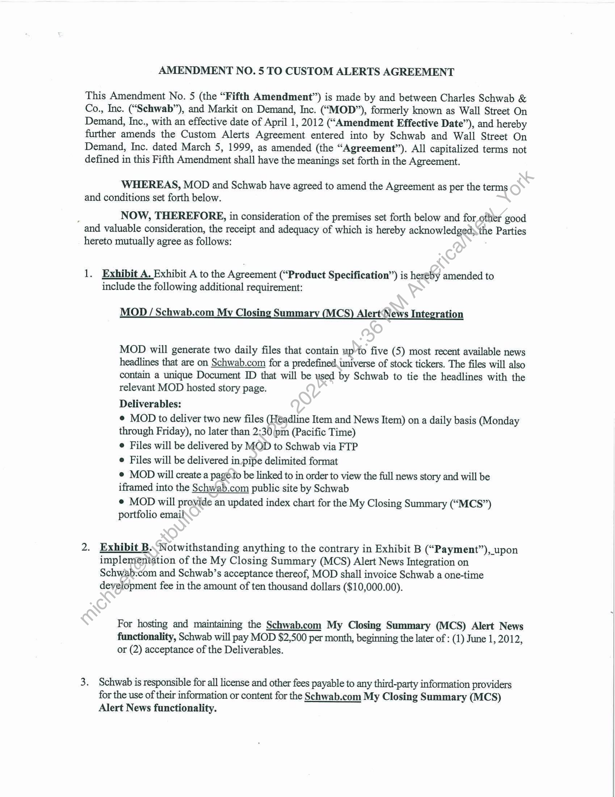

##### Amendment No. 5 to Custom Alerts Agreement]

  
````col
```col-md
flexGrow=.5
===
> [!info] [Page 1](_attachments/images_Schwab-3.6.1.18.800150169.pdf_212555/page_1.png)
> 
```  
```col-md
AMENDMENT NO. 5 TO CUSTOM ALERTS AGREEMENT  
This Amendment No. 5 (the “Fifth Amendment”) is made by and between Charles Schwab &
Co., Inc. (“Schwab”), and Markit on Demand, Inc. (“MOD”), formerly known as Wall Street On
Demand, Inc., with an effective date of April 1, 2012 (“Amendment Effective Date”), and hereby
further amends the Custom Alerts Agreement entered into by Schwab and Wall Street On
Demand, Inc. dated March 5, 1999, as amended (the “Agreement”). All capitalized terms not
defined in this Fifth Amendment shall have the meanings set forth in the Agreement.  
WHEREAS, MOD and Schwab have agreed to amend the Agreement as per the terms
and conditions set forth below.  
; NOW, THEREFORE, in consideration of the premises set forth below and for other good
and valuable consideration, the receipt and adequacy of which is hereby acknowledged» the Parties
hereto mutually agree as follows:  
1. Exhibit A. Exhibit A to the Agreement (“Product Specification”) is hereby amended to
include the following additional requirement:  
MOD / Schwab.com My Closing Summary (MCS) Alert‘News Integration  
MOD will generate two daily files that contain up-to five (5) most recent available news
headlines that are on Schwab.com for a predefined universe of stock tickers. The files will also
contain a unique Document ID that will be used by Schwab to tie the headlines with the
relevant MOD hosted story page.  
Deliverables:  
¢ MOD to deliver two new files (Headline Item and News Item) on a daily basis (Monday
through Friday), no later than 2:30 pm (Pacific Time)  
e Files will be delivered by MOD to Schwab via FTP  
e Files will be delivered in pipe delimited format  
e MOD will create a page.to be linked to in order to view the full news story and will be
iframed into the Schwab.com public site by Schwab  
¢ MOD will provide an updated index chart for the My Closing Summary (“MCS”)
portfolio email  
2. Exhibit B.  
 Notwithstanding anything to the contrary in Exhibit B (“Payment”), upon
implementation of the My Closing Summary (MCS) Alert News Integration on
Schwab.com and Schwab’s acceptance thereof, MOD shall invoice Schwab a one-time
development fee in the amount of ten thousand dollars ($10,000.00).  
For hosting and maintaining the Schwab.com My Closing Summary (MCS) Alert News
functionality, Schwab will pay MOD $2,500 per month, beginning the later of : (1) June 1, 2012,
or (2) acceptance of the Deliverables.  
3. Schwab is responsible for all license and other fees payable to any third-party information providers
for the use of their information or content for the Schwab.com My Closing Summary (MCS)
Alert News functionality.  
```
````
Notes:    
````col
```col-md
flexGrow=.5
===
> [!info] [Page 2](_attachments/images_Schwab-3.6.1.18.800150169.pdf_212555/page_2.png)
> 
```  
```col-md
In the event MOD provides the third-party information to Schwab, MOD will notify
Schwab no less than 30 days before entering into an agreement on behalf of Schwab where
any fees are payable to third-party information providers for the use of their information or
content for the My Closing Summary (MCS) Alert News functionality. If Schwab does not
agree to the licensing fees, the parties agree to negotiate any applicable changes to the
project in good faith.  
4. General. The Agreement, as modified by this Fifth Amendment, shall remain in full force
and effect until terminated and reflects the entire agreement between the Parties regarding thé
subject matter hereof. To the extent that any provisions of this Fifth Amendment are inconsistent
with the terms of the Agreement, the terms of this Fifth Amendment shall govern. This Fifth
Amendment may be executed in any number of counterparts, each of which shall bear original
and all of which together shall constitute one and the same document.  
IN WITNESS WHEREOF, the Parties have duly executed and delivered‘this Fifth
Amendment as of the Amendment Effective Date.  
MARKIT ON DEMAND, INC. c ES SCHWAB & CO., INC.  
By: _ Lowe fag pyfpolletp a Fi. oth
Name: Ja mes Tanne Name* L. hieseboon)  
Title: Glo al Head of Mavk.T an Dénrand Title: Vices Piesdende
Date: 5] Use Date: 5/4 (2012  
```
````
Notes:  


![[_attachments/Schwab-3.6.1.18.8 00150169.pdf]