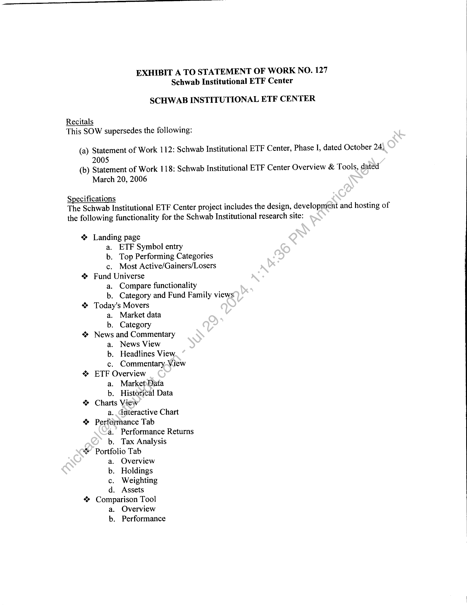
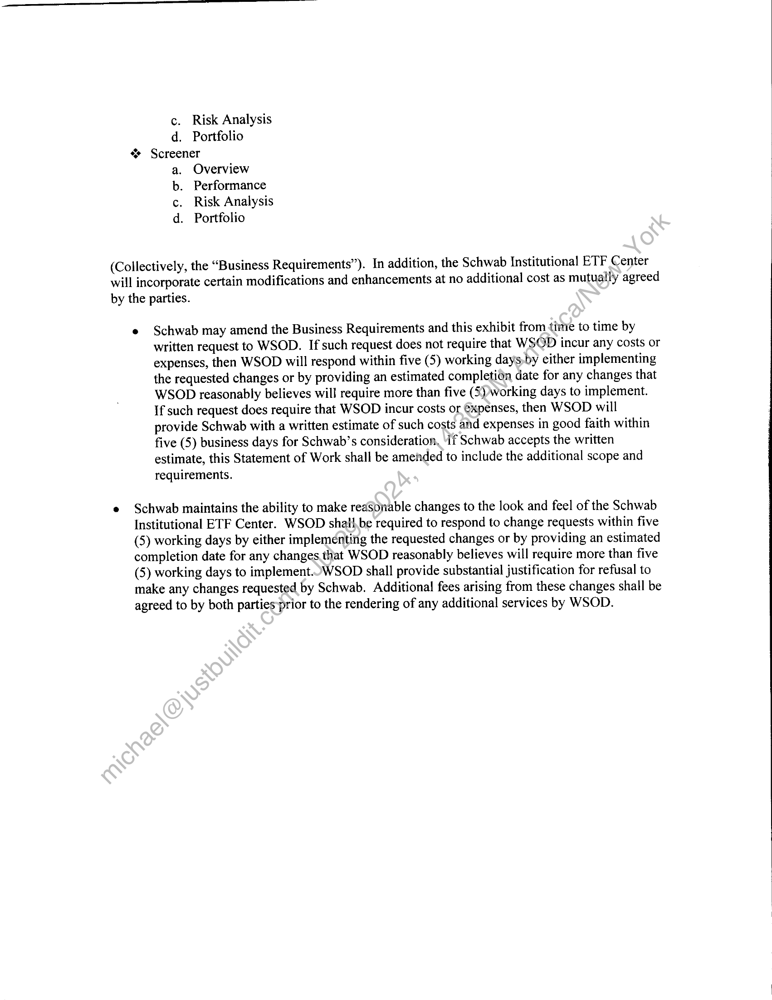
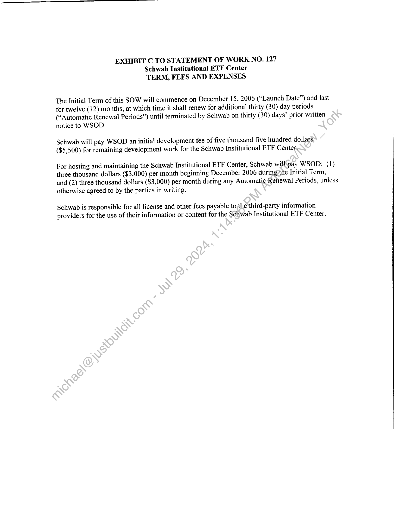

##### Statement of Work No. 127: Schwab Institutional ETF Center]

  
````col
```col-md
flexGrow=.5
===
> [!info] [Page 1](_attachments/images_Schwab-3.6.1.18.900150152.pdf_211311/page_1.png)
> 
```  
```col-md
STATEMENT OF WORK NO. 127
Schwab Institutional ETF Center  
Wall Street on Demand, Inc. (“WSOD”), and Charles Schwab & Co., Inc. ("Schwab"),
hereby agree to supplement their Master Internet Site Agreement effective as of February 1,
2001, (the "Agreement") with the following Statement of Work (the “SOW”), effective as of
December 15, 2006 (the “SOW Effective Date”).  
This SOW will incorporate by reference the Agreement upon execution hereof by both
parties. In the event of any conflict between the terms and conditions of this SOW and-the
Agreement, this SOW will control only with respect to the products and services provided
herein; otherwise the Agreement will control.  
The Agreement and this SOW are the entire agreement between the parties concerning
WSOD’s provision of the products and services described in this SOW.-Except for the
Agreement, this SOW supersedes, and its terms govern, any prior agreements (including without
limitation any nondisclosure agreements), proposals or other communications, oral or written,
between the parties with respect to the products and services provided by WSOD under this
SOW. This SOW may be modified by mutual written agreement of the parties from time to time
to reflect the required performance of, and the corresponding responsibilities for, the services
described herein as it continues to be proven in a production environment.  
This SOW is composed of the following:  
Exhibit A: Schwab Institutional ETF_Center
Exhibit B: Service Level and Support Obligations
ExhibitC: Term, Fees and Expenses  
In witness whereof, the parties to‘this Agreement execute it through their duly authorized
representatives. The parties hereby acknowledge that they have read this SOW, including all
exhibits and the Agreement; and understand and agree to be bound by its terms and conditions.  
scl ey
Marjorie Qualey James Tanner  
Vice-Presjdent President
/2-/2.
(Date)  
```
````
Notes:    
````col
```col-md
flexGrow=.5
===
> [!info] [Page 2](_attachments/images_Schwab-3.6.1.18.900150152.pdf_211311/page_2.png)
> 
```  
```col-md
EXHIBIT A TO STATEMENT OF WORK NO. 127
Schwab Institutional ETF Center  
SCHWAB INSTITUTIONAL ETF CENTER  
Recitals
This SOW supersedes the following:  
(a) Statement of Work 112: Schwab Institutional ETF Center, Phase I, dated October 24,
2005  
(b) Statement of Work 118: Schwab Institutional ETF Center Overview & Tools, dated
March 20, 2006  
Specifications
The Schwab Institutional ETF Center project includes the design, development and hosting of  
the following functionality for the Schwab Institutional research site:  
“ Landing page
a. ETF Symbol entry
b. Top Performing Categories
c. Most Active/Gainers/Losers
“> Fund Universe
a. Compare functionality
b. Category and Fund Family views
“ Today's Movers
a. Market data
b. Category
“* News and Commentary
a. News View
b. Headlines View.
c. Commentary-View
“ ETF Overview
a. MarketData
b. Historical Data
“ Charts View
a. Gateractive Chart
Performance Tab
a. Performance Returns
b. Tax Analysis
* Portfolio Tab
a. Overview
b. Holdings
c. Weighting
d. Assets
“ Comparison Tool
a. Overview
b. Performance  
```
````
Notes:    
````col
```col-md
flexGrow=.5
===
> [!info] [Page 3](_attachments/images_Schwab-3.6.1.18.900150152.pdf_211311/page_3.png)
> 
```  
```col-md
c. Risk Analysis
d. Portfolio
“> Screener
Overview
Performance
Risk Analysis
Portfolio  
aorf  
(Collectively, the “Business Requirements”). In addition, the Schwab Institutional ETF Center
will incorporate certain modifications and enhancements at no additional cost as mutually agreed
by the parties.  
« Schwab may amend the Business Requirements and this exhibit from time to time by
written request to WSOD. If such request does not require that WSOD incur any costs or
expenses, then WSOD will respond within five (5) working days-by either implementing
the requested changes or by providing an estimated completion date for any changes that
WSOD reasonably believes will require more than five (5))working days to implement.
If such request does require that WSOD incur costs or éxpenses, then WSOD will
provide Schwab with a written estimate of such costs and expenses in good faith within
five (5) business days for Schwab’s consideration, ‘If Schwab accepts the written
estimate, this Statement of Work shall be amended to include the additional scope and
requirements.  
¢ Schwab maintains the ability to make reasonable changes to the look and feel of the Schwab
Institutional ETF Center. WSOD shali,be required to respond to change requests within five
(5) working days by either implementing the requested changes or by providing an estimated
completion date for any changes.that WSOD reasonably believes will require more than five
(5) working days to implement.OWSOD shall provide substantial justification for refusal to
make any changes requested by Schwab. Additional fees arising from these changes shall be
agreed to by both parties prior to the rendering of any additional services by WSOD.  
```
````
Notes:    
````col
```col-md
flexGrow=.5
===
> [!info] [Page 4](_attachments/images_Schwab-3.6.1.18.900150152.pdf_211311/page_4.png)
> 
```  
```col-md
EXHIBIT B TO STATEMENT OF WORK NO. 127
Schwab Institutional ETF Center  
SERVICE LEVEL AND SUPPORT OBLIGATIONS  
Support and training:  
1.  
WSOD will provide reasonable training to certain representatives of Schwab as requested
by Schwab from time to time, including but not limited to its Technical Client Services  
group.
WSOD will provide documentation as deemed necessary by Schwab.  
All calls relating to Schwab content or functionality received by WSOD will be referred
to representatives of Schwab.  
The Schwab Institutional ETF Center will be available 24 Hours a day, 7 days a week,
excluding scheduled maintenance as mutually agreed by the parties.  
If the Schwab Institutional ETF Center becomes uriavailable for any reason, WSOD will
use its best efforts to remedy the problem immediately. WSOD will immediately notify
the designated point-of-contact at Schwab of afty outages that cannot be resolved within
the time limits stated in the Master Internet Site Agreement.  
WSOD will provide a 24x7x365 contact to communicate any failures or outages of the
Schwab Institutional ETF Center. With a fifteen (15) minute response time.  
WSOD will keep the SIM ETP Center pages updated with the most current Custom
Content available to it.  
WSOD will supply-Wweekly usage data to Schwab Institutional regarding the SIM ETF
Center pages, including, but not limited to those listed in the Business Requirements.  
```
````
Notes:    
````col
```col-md
flexGrow=.5
===
> [!info] [Page 5](_attachments/images_Schwab-3.6.1.18.900150152.pdf_211311/page_5.png)
> 
```  
```col-md
EXHIBIT C TO STATEMENT OF WORK NO. 127
Schwab Institutional ETF Center
TERM, FEES AND EXPENSES  
The Initial Term of this SOW will commence on December 15, 2006 (“Launch Date”) and last
for twelve (12) months, at which time it shall renew for additional thirty (30) day periods
(“Automatic Renewal Periods”) until terminated by Schwab on thirty (30) days’ prior written
notice to WSOD.  
Schwab will pay WSOD an initial development fee of five thousand five hundred dollars
($5,500) for remaining development work for the Schwab Institutional ETF Center,  
For hosting and maintaining the Schwab Institutional ETF Center, Schwab will'pay WSOD: (1)
three thousand dollars ($3,000) per month beginning December 2006 during7the Initial Term,
and (2) three thousand dollars ($3,000) per month during any Automatic Renewal Periods, unless
otherwise agreed to by the parties in writing.  
Schwab is responsible for all license and other fees payable tothe third-party information
providers for the use of their information or content for the Schwab Institutional ETF Center.  
```
````
Notes:  


![[_attachments/Schwab-3.6.1.18.9 00150152.pdf]