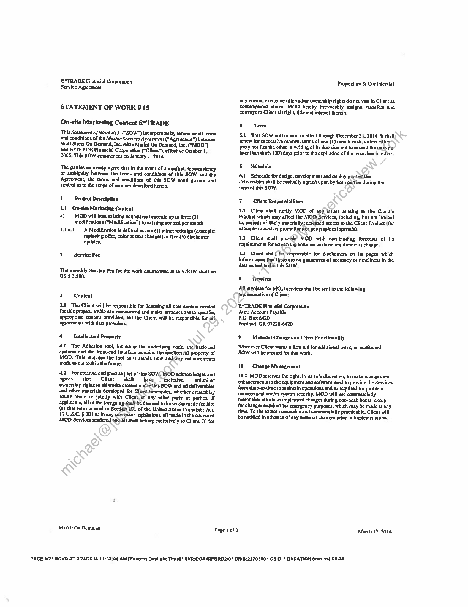
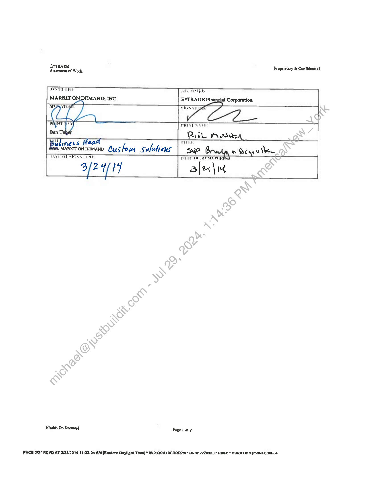

##### Statement of Work #15: On-site Marketing Content E*TRADE]

  
````col
```col-md
flexGrow=.5
===
> [!info] [Page 1](_attachments/images_MS-ETrade-3.6.1.19.3.100153718.pdf_210948/page_1.png)
> 
```  
```col-md
E*TRADE Financial Corporation
Service Agreement  
STATEMENT OF WORK #15  
On-site Marketing Content E*TRADE  
This Statement of Work #15 (“SOW") incorporates by reference all terms
and conditions of the Master Services Agreement (“Agreement”) between
Wall Street On Demand, Inc, n/k/a Markit On Demand, inc, (‘MOD"}
and E*TRADE Financial Corporation (“CHent”), effective October t,
2005, This SOW commences on January 1, 2014.  
The parties expressly agree that in the event of a conflict, inconsistency
or ambiguity between the terms and conditions of this SOW and the
Agreement, the terms and conditions of this SOW shall govern and
control as to the scope of services described herein,  
1 Project Description
1.1) On-site Marketing Content
a) ~— MOD will host existing content and execute up to three (3)
modifications (“Modification”) to extsting content per month
Lal A Modification is defined as one (1) minor redesign (example:
replacing offer, cotor or text changes) or five (5) disclaimer
updates,  
2 Service Fee  
‘The monthly Service Fee for the work enumerated in this SOW shall be
US $ 3,500.  
3 Content  
3.1 The Clicnt will be responsible for licensing all data content needed
for this project. MOD can recommend end make Introductions to specific,
Appropriate content providers, but the Client will be responsible for all
agreements with dats providers.  
4 Intellectual Property  
4.1 ‘The Adhesion tool, including the anderlying code, the back-end
aystems and the front-end interface remains the intelleciial property of
MOD. This includes the tool as it stands now and/any enhancements
made to the tool in the future.  
4.2 For creative designed aa part of this SOW, MOD acknowledges and
agrees that «Client = shall’ =—shavc “exclusive, unlimited
ownership rights to all works created under this SOW and all deliverables
and other materials developed for Clicnttiereunder, whether created by
MOD alone or jointly with Client.or any other party or parties, If
applicable, all of the foregoing shall be deemed ta be works made for hire
(as that term is used in Section 101 of the United States Copyright Act,
17 U.S.C. § 101 or in any successor legislation), a1] made in the course of
MOD Services rendered anthall shall belong exclusively to Client. If, for  
Markit On Demand!  
Page 1 of 2.  
Proprictary & Confidential  
any reason, exclusive title and/or ownership rights do not vert in Client as.
contemplated above, MOD hereby irrevocably uasigns, transfers and.
conveys to Clicnt all right, title and interest therein.  
5 Term  
§.1 This SOW will remain in effect through December 31, 2014 ft shull,
renew for succeasive renewal terms of anc (1) month each, unless either  
party notifies the other In writing of its decision not to extend the tecra ne
later than thirty (30) days prior to the expiration of the term then in effect.  
6 Schedule  
64 Schedule for design, development and deployment.of the
deliverables shall be mutually agreed upon by both parties dunng the
term of this SOW,  
7 Citent Responsibilities  
7.1 Client shall notify MOD of any issues relating to the Client's
Product which may affect the M@D Services, including, but not limited
to, periods of Jikely materially Increased access to the Client Product (fnr
example caused by promotions or geographical spreads).  
7.2 Cliem shall provide MOD with non-binding forecasts of its
requirements for ad gerving volumes as those requirements change.  
73° Client shall be ‘responsible for disclaimers on its pages which
inform users that dhere are no guarantecs of accuracy of tuneliness in the
data ecrved unde this SOW,  
All invoices for MOD services shall be sent to the follawing
yepresentative of Client:  
E*TRADE Financial Corporation
Atm: Account Payable  
P.O. Box 6420  
Portland, OR 97228-6420  
9 Material Changes and New Functionallty  
Whenever Client wants a firm bid for additional work, an additional
SOW will be created for that work.  
10 Change Management  
10.2 MOD reserves the right, in its sale discretion, to make changes and
enhancements to the equipment and software used to provide the Services
from time-to-time to maintain operations and as required far problem
management and/or sysiem security. MOD will use commercially
reasonable efforts to implement changes during non-peak hours, except
for changes required for emergency purposes, which may be made at any
time, To the extent reasonable and commercially practicable, Client will
be notified in advance of any material changes prior to implementation  
March 12, 2014.  
PAGE 1:2* RCVD AT 3/24/2014 14:33:04 AM [Eastern Daylight Time] * SVR:OCA1RFBRD2/0 * ONIE:2270380 * CSID: * DURATION (mm-ss):00-34  
```
````
Notes:    
````col
```col-md
flexGrow=.5
===
> [!info] [Page 2](_attachments/images_MS-ETrade-3.6.1.19.3.100153718.pdf_210948/page_2.png)
> 
```  
```col-md
B*TRADE 5 A
Statement of Work. Proprietary & Confidential  
AECEPTYD
MARKIT ON DEMAND, INC.
—  
PIS ET  
te aac
Business | Sell Cus fou Se oleb ans  
Maskit On Demand Page t of Z  
PAGE 212° RCVD AT 3/24/2014 11:33:04 AM (Eastern Daylight Time] * SVR:;DCA1RFARD2/0 * DNIS:2270360 * CSID: * OURATION (mm-ss):00-34.  
```
````
Notes:  


![[_attachments/MS-ETrade-3.6.1.19.3.1 00153718.pdf]