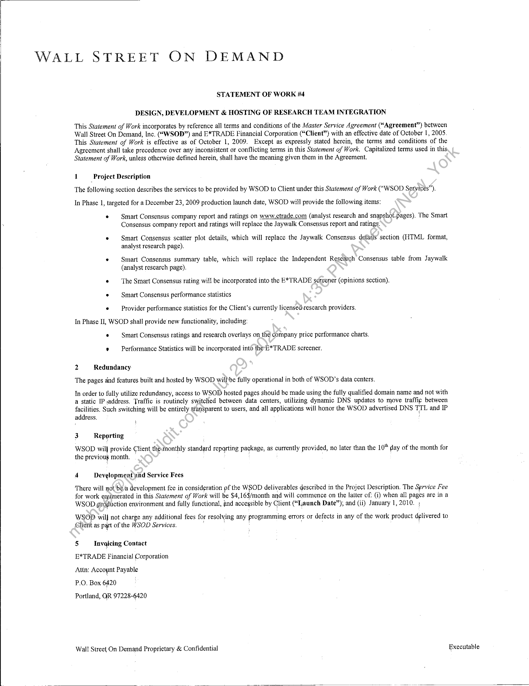
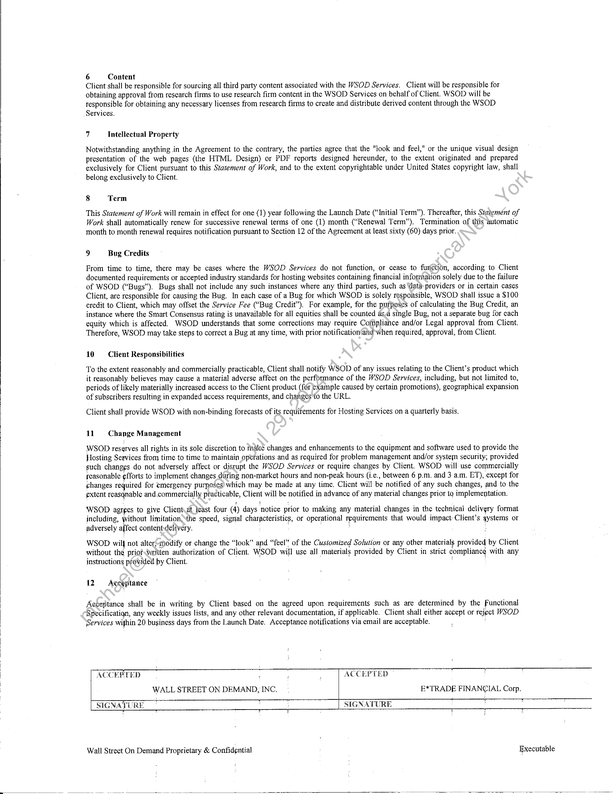
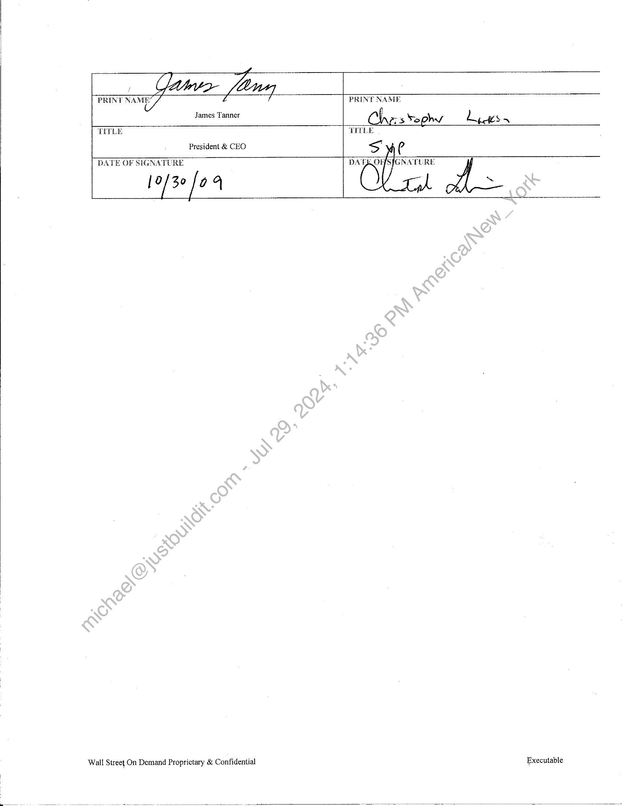

##### Statement of Work #4: Design, Development & Hosting of Research Team Integration]

  
````col
```col-md
flexGrow=.5
===
> [!info] [Page 1](_attachments/images_MS-ETrade-3.6.1.19.3.200153709.pdf_210210/page_1.png)
> 
```  
```col-md
WALL STREET ON DEMAND  
STATEMENT OF WORK #4  
DESIGN, DEVELOPMENT & HOSTING OF RESEARCH TEAM INTEGRATION  
This Statement of Work incorporates by reference all terms and conditions of the Master Service Agreement (“Agreement”) between
Wall Street On Demand, Inc. (“WSOD”) and E*TRADE Financial Corporation (“Client”) with an effective date of October 1, 2005
This Statement of Work is effective as of October 1, 2009. Except as expressly stated herein, the terms and conditions of the
Agreement shall take precedence over any inconsistent or conflicting terms in this Statement of Work. Capitalized terms used in this
Statement of Work, unless otherwise defined herein, shall have the meaning given them in the Agreement.  
1 _Project Description
The following section describes the services to be provided by WSOD to Client under this Statement of Work (“WSOD Services”).
In Phase 1, targeted for a December 23, 2009 production launch date, WSOD wil provide the following items:  
« Smart Consensus company report and ratings on www,ctrade.com (analyst research and snapshot-pages). The Smart
Consensus company report and ratings will replace the Jaywalk Consensus report and ratings.  
e Smart Consensus scatter plot details, which will replace the Jaywalk Consensus details section (HTML format,
analyst research page).  
* Smart Consensus summary table, which will replace the Independent Research Consensus table from Jaywalk
(analyst research page).  
¢ The Smart Consensus rating will be incorporated into the E*TRADE s¢reener (opinions section).
« Smart Consensus performance statistics
* — Provider performance statistics for the Client’s currently licensedrescarch providers.
In Phase Il, WSOD shall provide new functionality, including:
« Smart Consensus ratings and research overlays on the company price performance charts.  
© Performance Statistics will be incorporated into the E*TRADE screener.  
2 Redundancy
The pages dnd features built and hosted by WSOD willbe fully operational in both of WSOD’s data centers.  
In order to fully utilize redundancy, access to WSOD hosted pages should be made using the fully qualified domain name and not with
a static IP .address. Traffic is routinely switched between data centers, utilizing dynamic DNS updates to move traffic between
facilities. Such switching will be entirely sfan$parent to users, and all applications will honor the WSOD advertised DNS TIL and IP  
address. j  
3 Reporting  
WSOD wil} provide Client themonthly standard Tepqrting package, as currently provided, no later than the 10" day of the month for
the previous month.  
4 Devyglopment and Service Fees  
There will not bé a development fee in consideration pf the WSOD deliverables desoribed in the Project Description. The Service Fee
for work emimerated in this Statement of Work will be $4, 163/month and will commence on the latter of: (i) when all press are ina
WSOD production environment and fully functional, and accegsible by Client (“Ijaunch Date”); and (ii) January 1, 2010.  
WSOD wil not charge any additional fees for resolving any programming errors or defects in any of the work Product delivered to
Glient as part of the WSOD Services.  
5 Tnvaicing Contact  
E*TRADE Financial Corporation  
Attn: Account Payable  
P.O. Box 6420  
Portland, QR 97228-6420  
Wall Street On Demand Proprietary & Confidential Executable  
```
````
Notes:    
````col
```col-md
flexGrow=.5
===
> [!info] [Page 2](_attachments/images_MS-ETrade-3.6.1.19.3.200153709.pdf_210210/page_2.png)
> 
```  
```col-md
6 Content  
Client shall be responsible for sourcing all third party content associated with the WSOD Services. Client will be responsible for
obtaining approval from research firms to use research firm content in the WSOD Services on behalf of Client. WSOD will be
responsible for obtaining any necessary licenses from research firms to create and distribute derived content through the WSOD
Services.  
7 Intellectual Property  
Notwithstanding anything in the Agreement to the contrary, the parties agree that the “look and feel," or the unique visual design
presentation of the web pages (the HTML Design) or PDF reports designed hereunder, to the extent originated and prepared
exclusively for Client pursuant to this Statement of Work, and to the extent copyrightable under United States copyright jaw, shall
belong exclusively to Client.  
8 Term  
This Statement of Work will remain in effect for one (1) year following the Launch Date (“Initial Term”). Thereafter, this Stziement of
Work shall automatically renew for successive renewal terms of one (1) month (“Renewal Term”), Termination of this automatic
month to month renewal requires notification pursuant to Section 12 of the Agreement at least sixty (60) days prior.  
9 Bug Credits  
From time to time, there may be cases where the WSOD Services do not function, or cease to furiction, according to Client
documented requirements or accepted industry standards for hosting websites containing financial information solely due to the failure
of WSOD (“Bugs”). Bugs shall not include any such instances where any third parties, such as Gata providers or in certain cases
Client, are responsible for causing the Bug. In each case of a Bug for which WSOD is solely responsible, WSOD shall issue a $100
credit to Client, which may offset the Service Fee (“Bug Credit”). For example, for the purposes of calculating the Bug Credit, an
instance where the Smart Consensus rating is unavailable for all equities shall be counted as.a single Bug, not a separate bug for cach
equity which is affected. WSOD understands that some corrections may require Compliance and/or Legal approval from Client.
Therefore, WSOD may take steps to correct a Bug at any time, with prior notification‘and-when required, approval, from Client.  
10 Client Responsibilities  
To the extent reasonably and commercially practicable, Client shall notify WSOD of any issues relating to the Client’s product which
it reasonably believes may cause a material adverse affect on the performance of the WSOD Services, including, but not limited to,
periods of likely materially increased access to the Client product (for example caused by certain promotions), geographical expansion
of subscribers resulting in expanded access requirements, and changes ‘to the URL.  
Client shall provide WSOD with non-binding forecasts of its requirements for Hosting Services on a quarterly basis,  
11 Chapge Management  
WSOD reserves all rights in its sole discretion to make changes and enhancements to the equipment and software used to provide the
Hosting Services from time to time to maintain operations and as required for problem management and/or system security; provided
such changes do not adversely affect or disrupt the WSOD Services or require changes by Client. WSOD will use commercially
reasonable efforts to implement changes during non-market hours and non-peak hours (i.¢., between 6 p.m. and 3 a.m. ET), except for
changes required for emergency purposes: which may be made at any time. Client will be notified of any such. changes, and to the
extent reasqnable and.commercially practicable, Client will be notified in advance of any material changes prior tq implementation.  
WSOD agrees to give Client.at least four (4) days ‘notice prior to making any material changes in the technical delivgry format
including, without limitation Mhe speed, signal characteristics, or operational requirements that would impact: Client’s gystems or
adversely affect contentdelivery. : : :  
WSOD will not alters modify or change the “ook” and “feel” of the Customized Solution or any other materials provided by Client
without thé priofveritten authorization of Client. WSOD will use all materials provided by Client in strict compliancg with any
instructions provided by Client. : .  
12 Acceptance  
Acceptance shall be in writing by Client based on the agreed upon requirements such as are determined by the Functional
Specificatign, any weekly issues lists, and any other relevant documentation, if applicable. Client shall either accept or teject WSOD
Services wijhin 20 business days from the Launch Date. Acceptance notifications via email are acceptable.  
ACCEPTED . . : : ACCEPTED
WALL STREET ON DEMAND, INC, E*TRADE FINANGIAL Corp,  
SIGNATURE : SIGNATURE °  
Wall Street On Demand Proprietary & Confidential « ; Executable  
```
````
Notes:    
````col
```col-md
flexGrow=.5
===
> [!info] [Page 3](_attachments/images_MS-ETrade-3.6.1.19.3.200153709.pdf_210210/page_3.png)
> 
```  
```col-md
PRINT Sg ja PRINT NAME  
James Tanner Che: 3% phy dL be  
TEPLE VHTLE
President & CEO  
DATE GF SIGNATURE  
|0/3° [0 4  
Wall Street On Demand Proprietary & Confidential Executable  
```
````
Notes:  


![[_attachments/MS-ETrade-3.6.1.19.3.2 00153709.pdf]