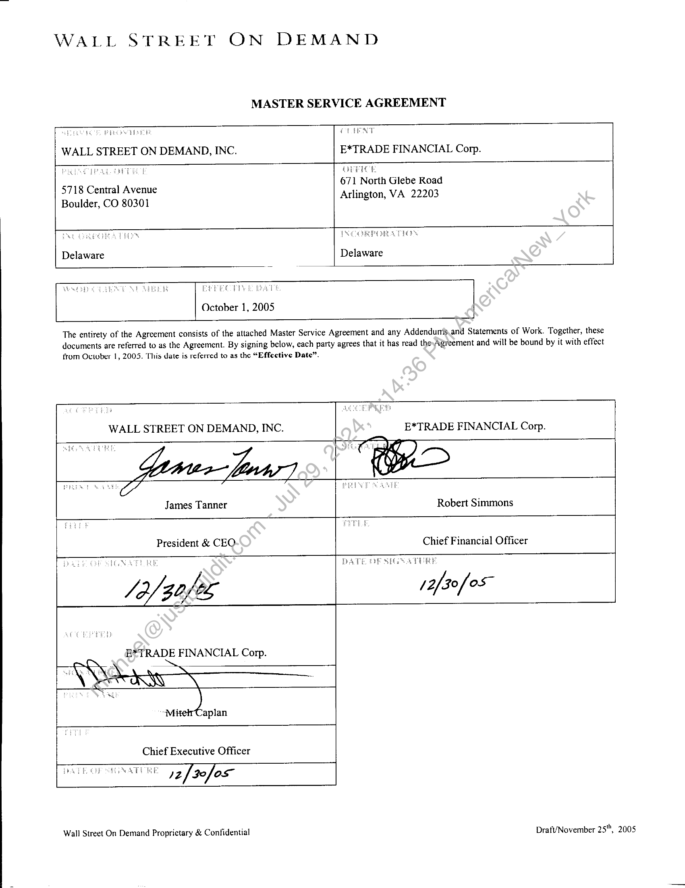

##### Master Service Agreement]

  
````col
```col-md
flexGrow=.5
===
> [!info] [Page 1](_attachments/images_MS-ETrade-3.6.1.19.3.320051230_EtradeMasterServiceAgreement1.pdf_210256/page_1.png)
> 
```  
```col-md
WALL STREET ON DEMAND  
MASTER SERVICE AGREEMENT  
WALL STREET ON DEMAND, INC.  
CPR OPES EL  
POE Sa EET ST  
5718 Central Avenue
Boulder, CO 80301  
GPa NY  
E*TRADE FINANCIAL Corp.
OPRICE  
671 North Glebe Road
Arlington, VA 22203  
[NC ORPOR ATION  
Delaware  
EPPee yyy &  
October 1, 2005  
Wale  
Vest  
_!  
The entirety of the Agreement consists of the attached Master Service Agreement and any Addendun’s.and Statements of Work. Together, these
documents are referred to as the Agreement. By signing below, each party agrees that it has read the Agreement and will be bound by it with effect  
from October 1, 2005. This date is referred to as the “Effective Date”.  
Wee tain  
WALL STREET ON DEMAND, INC.  
E*TRADE FINANCIAL Corp.  
James Tanner  
PRES T WAM Zz? PRES EON A  
VEE  
Robert Simmons  
President & CEO  
Chief Financial Officer  
PATE DF SIGSATERE  
/ 2/30 os”  
B* TRADE FINANCIAL Corp.  
‘aplan  
Chief Executive Officer |  
Trai hip S86 ATS WE r2[xefor |  
Wall Street On Demand Proprietary & Confidential  
DrafUNovember 25", 2005  
```
````
Notes:    
````col
```col-md
flexGrow=.5
===
> [!info] [Page 2](_attachments/images_MS-ETrade-3.6.1.19.3.320051230_EtradeMasterServiceAgreement1.pdf_210256/page_2.png)
> 
```  
```col-md
E*TRADE FINANCIAL Corp. Proprietary & Confidential
Service Agreement  
This Master Service Agreement is made and entered into as of the above Effective Date, by and between Wall
Street On Demand Inc. (“WSOD”), a Delaware corporation, having a principal place of business at 5718 Central
Avenue, Boulder, Colorado, and E*TRADE Financial Corporation (“E*TRADE” or “Client”), a Delaware
corporation, having a place of business at 671 North Glebe Road, Arlington, Virginia. WSOD and E*TRADE
agree as follows:  
Definitions  
Addendum means any written document signed by both parties for the express purpose of creating additional
terms or amending the terms of this Master Service Agreement. If the terms of this Master Service Agreement and
any Addendum conflict, the terms of the Master Service Agreement shall control unless expressly stated otherwise
in the relevant Addendum. An Addendum shall not be binding on either party until it has been signed by both
parties.  
Service Fees means fees and reasonable costs payable by Client for the performance of WSOD Services as detailed
in each Statement of Work.  
WSOD Services means the services detailed in a Statement of Work, and will often include such services as design
work, consulting work, aggregation work, reporting and hosting work.  
Customized Solution includes, but is not limited to any software product; functionality design, report design or
service implementation (and any associated Documentation and Updates) developed by WSOD and identified as
such in any Statement of Work.  
Documentation means any standard written material in machine readable or printed form that describes the
design, functions, operation or use of the Customized Solution.  
Statement of Work means a written document in a form prescribed by WSOD signed by both parties regarding
tasks to be performed and/or items to be delivered) under this Master Service Agreement. If the terms of this
Master Service Agreement and any Statement of Work conflict, the terms of the Master Service Agreement shall
control. A Statement of Work shall not be binding on either party until it has been signed by both parties.  
Virus means any code or device which is-designed or intended to impair the operation of any computer or
database, prevents or hinders access to“or the operation of any program or data (whether by altering, erasing,
duplicating or rearranging within the.computer or any storage medium or device, the program or data in whole or
in part, or otherwise) including, computer viruses, worms and trojan horses,  
Provision of Services  
21 WSOD Services willbe documented in a Statement of Work and the Statement of Work will specify whether
such services will be\provided on a fixed-price basis or a time and materials basis, or volume. Each Statement of
Work shall be given a sequential number so as to keep track of all signed Statements of Work.  
22 Client shall/provide WSOD with reasonable cooperation to facilitate proper and prompt performance of the  
WSOP Services, including:  
a) providing WSOD with specific and detailed information concerning Client’s use of, and providing reasonable
access to, any applicable software; and  
b) providing WSOD adequate access to Client’s personnel who have sufficient experience to coordinate and
assist WSOD in the provision of the WSOD Services.  
23 In the event WSOD performs any WSOD Services on Client’s premises, WSOD shall agree to comply with
any and all policies and procedures Client reasonably requires of vendors that perform services on such premises.  
Wall Street On Page Page 2 of 15 December 15", 2005  
```
````
Notes:    
````col
```col-md
flexGrow=.5
===
> [!info] [Page 3](_attachments/images_MS-ETrade-3.6.1.19.3.320051230_EtradeMasterServiceAgreement1.pdf_210256/page_3.png)
> 
```  
```col-md
E*TRADE FINANCIAL Corp. Proprietary & Confidential
Service Agreement  
24 Client may, at its option, request WSOD to remove from Client’s project any WSOD employee or contractor
who, in Client’s sole reasonable opinion, is not performing satisfactorily. At Client’s request, WSOD agrees to
replace any such WSOD employee or contractor with an employee or contractor reasonably acceptable to Client.  
25 Process Management. Operational management of Client and WSOD shall meet (which meeting may be
conducted by teleconference) not less than once per month in order to discuss project status, problems that may
affect delivery schedules, technical details and other similar issues. Senior management of Client and WSOD
shall meet (which meeting may be conducted by teleconference) not less than once every six months\in- order to
discuss any issues addressed to them by operational management as well as the overall relationship of the parties.  
26 Third Party Materials. WSOD agrees that to the extent it has access to any third party coritent or other third
party materials in connection with its performance of the WSOD Services, it shall not disclose or distribute such  
materials to any person or entity except as permitted by the applicable third party inthe performance of such
WSOD Services in accordance with the terms of the entirety of the Agreement or‘unless otherwise directed by
such third parties.  
Payments and Fees  
31 Fees, On the payment dates specified on the relevant Statement of Work, Client shall pay to WSOD the
undisputed Service Fees and WSOD charges as set forth in the applicable Statement of Work. Unless otherwise
specified in the applicable Statement of Work, all Services shall be billed by WSOD to Client monthly in arrears.  
3.2 Payment of Invoices. All undisputed Service Fees are (uriless otherwise indicated on the relevant Statement of
Work) payable 30 days after the date of receipt of the relevant invoice. A service charge of 1.5% per month or the
highest lawful interest rate, whichever is lower, willbe applied to all amounts not paid when due. Client shall,
within thirty days of receipt of any invoice, provide-written notice to WSOD of any dispute setting forth in
reasonable detail the reason for such dispute.  
3.3 Billing Errors, If Wall Street On Demand.makes a billing mistake that results in a credit to Client, that credit
will be due within thirty days of discovery, or on the next invoice, whichever is sooner.  
3.4 Currency and Method of Payments. Unless otherwise specified, Service Fees are quoted, and all payments
shall be made in, United States dollars.  
3.5 Payments to Third Party Information Providers. Should WSOD hold the contract or payment responsibilities
(as a pass through cost) with\athird party information provider, WSOD will pay the information providers on time,
according to the terms inyits‘agreements with those providers.  
Taxes  
4.1 Payment of.Taxes. In addition to the Service Fees, Client will pay to WSOD or to the relevant taxing
authority, as appropriate, any applicable taxes or duties (excluding taxes levied or imposed on WSOD income and
payroll) payable under this Master Service Agreement, so that aftcr payment of such taxes and duties the amount
received:by WSOD is not less than the Service Fees.  
Title  
5.1 WSOD Property. Unless otherwise agreed in a Statement of Work, Client acknowledges that the only rights it
has to the Customized Solution under this Master Service Agreement are non-exclusive rights under license. Client
agrees not to use the Customized Solution other than as licensed under this Master Service Agreement. The parties
acknowledge that performance of this Master Service Agreement may result in the development by WSOD of new  
Wall Street On Page Page 3 of 15 December 15", 2005  
```
````
Notes:    
````col
```col-md
flexGrow=.5
===
> [!info] [Page 4](_attachments/images_MS-ETrade-3.6.1.19.3.320051230_EtradeMasterServiceAgreement1.pdf_210256/page_4.png)
> 
```  
```col-md
E*TRADE FINANCIAL Corp. Proprietary & Confidential
Service Agreement  
concepts, software, methods, techniques, processes, adaptations and ideas, in addition to WSOD prior technology,
which may be embodied in the Customized Solution. Unless otherwise agreed in the Statement of Work, the parties
agree that the same shall belong to WSOD exclusively  
5.2 Ownership. Except as expressly stated in this Master Service Agreement, each party or their respective
licensors and third party information and content providers retain all rights, title and interest in and to all of the
information, content, data, designs, materials and all copyrights, patent rights, trademark rights and other
proprietary rights thereto provided by it pursuant to this Master Service Agreement. Except as expressly provided
herein, no other right or license with respect to any copyrights, patent rights, trademark rights or other:proprietary
rights is granted under this Master Service Agreement. All rights not expressly granted hereunder by a party are
expressly reserved to such party and its licensors and information and content providers.  
Licenses  
6.1 WSOD grants to Client a non-transferable, non-assignable, non-sub licensable, license to use the Customized
Solution  
62 License to Client Marks. If expressly required pursuant to any Statement of Work, Client hereby grants WSOD
a nonexclusive, non-transferable, non-sublicensable license to use the Client Marks solely on the WSOD web site
and solely in connection with the marketing and promotion of the WSOD Services. "Client Marks" shall mean
solely the Client name and logo as provided to WSOD; provided, however, that Client, in its sole discretion from
time to time, may change the appearance and/or style of the Client Marks, provided that, unless required earlier by
a court order or to avoid potential infringement liability, WSOD shall have fourteen (14) days’ notice to
implement any such changes. WSOD hereby acknowledges and agrees that (i) the Client Marks are owned solely
and exclusively by Client or its subsidiaries, (11) except asset forth herein, WSOD has no rights, title or interest in
or to the Client Marks and (iii) all use of the Client Marks by WSOD shall inure to the benefit of Client and its
subsidiaries. WSOD agrees not to apply for registration of the Client Marks (or any mark confusingly similar
thereto) anywhere in the world. WSOD agrees that it shall not engage, participate or otherwise become involved
in any activity or course of action that diminishes and/or tarnishes the image and/or reputation of Client or any
Client Mark.  
63 Use and Display of Client Marks. WSOD acknowledges and agrees that the presentation and image of the
Client Marks should be uniform and.consistent with respect to all services, activities and products associated with
the Client Marks. Accordingly, WSOD agrees to use the Client Marks solely in the manner which Client shall
specify from time to time in Client’s sole discretion. All usage by WSOD of the Client Marks shall include the
registered trademark symbol\and shall be in the following form, as appropriate: [Client Mark]® or [Client
Mark]™ or [Client Mark}.  
64 License Limitatiotis, The licenses granted shall be subject to the following limitation: Client shall only give
access to the Custumized Solution to entitled users, and use such Customized Solution only at the web sites which
are set forth onthe relevant Statement of Work.  
Termination  
71 Tétm, This Master Service Agreement and the licenses granted under it will remain in effect for three (3) years
from the Effective Date, and will automatically renew thereafter on a Month to Month basis so long as any services
are ongoing, or any Statement of Work is still in effect. Upon conversion to a Month to Month basis, this contract
may be terminated upon Notice, given pursuant to section 12, sixty (60) days prior to termination.  
72 Termination. Either party may terminate this Master Service Agreement or any individual Statement of Work
(within the timescales set out below) if the other party:  
Wall Street On Page Page 4 of 15 December 15", 2005  
```
````
Notes:    
````col
```col-md
flexGrow=.5
===
> [!info] [Page 5](_attachments/images_MS-ETrade-3.6.1.19.3.320051230_EtradeMasterServiceAgreement1.pdf_210256/page_5.png)
> 
```  
```col-md
E*TRADE FINANCIAL Corp. Proprietary & Confidential
Service Agreement  
a) commits a Material Breach of this Master Service Agreement which is incapable of remedy. Such termination
shall be effective immediately on giving Notice pursuant to section 12  
b) commits a Material Breach of this Master Service Agreement, which remains unremedied thirty (30) days
after receipt of Notice pursuant to section 12, Such termination shall be effective at the end of the thirty (30)
day notice period. However, if the breach is capable of remedy but cannot reasonably be cured within such
thirty (30) day period, termination shall not be effective if the party in default commences cure of the breach
within thirty (30) days and fully cures any such Material Breach within sixty (60) days of receipt of such a
Notice of breach pursuant to section 12;  
c) makes an assignment for the benefit of its creditors, files or has filed against it a petition under any
bankruptcy, insolvency, reorganization or similar law, appoints or has appointed against it a trustee or
receiver for any of its property or commences or has commenced against it (by resolution or otherwise) the
liquidation or winding-up of its affairs, which termination shall be effective immediately upon giving notice.  
73 Termination for Convenience. Subsequent to October 1, 2006, but not prior, eitherparty may terminate this
Master Service Agreement or any Statement of Work without cause upon sixty days prior written notice to the
other party.  
14 Statement of Work. The parties’ termination for any reason of any individual Statement of Work shall not
result in a termination of this Master Service Agreement but shall result in only the termination of the relevant
Statement of Work. The provisions of this Master Service Agreement relating to the effects of termination shall
apply to each Statement of Work as an independent contract.  
75 Obligations upon Termination. Upon termination of a, Statement of Work pursuant to which Customized
Solution was developed, if WSOD retains ownership of the Customized Solution Client will cease using the
Customized Solution. In addition, upon termination of-aVSfatement of Work or this Master Service Agreement,
Client shall pay any outstanding fecs accrued through the date of termination.  
76 Survival. The respective rights and obligations, of the parties under Clauses 5, 7.4, 8, 9, 10 and 14 shall survive  
any termination of this Master Service Agreement.  
7.17 Material Breach. Notice of a Material-Breach must be delivered pursuant to the terms of section 12. A  
Material Breach is any failure to perform an agreed upon term which is essential to the Agreement, and as such  
causes substantial harm to one of the‘parties, including but not limited to:  
a) any failure to make complete‘and timely payments under the terms of any Statement of Work;  
b) any breach of the termsyof WSOD’s license provisions in this Master Service Agreement with Client,
including but not limited to the distribution of any WSOD products, materials, software, tangible or intangible
property to unlicensed third parties.  
Warranties.  
8.1 Mutual.Warranties. Each party warrants that:  
a) it has full power to enter into and perform its obligations under this Master Service Agreement;  
b) _ itshas obtained all necessary corporate approvals to enter into and execute this Master Service Agreement, to
grant the licenses granted hereunder and to perform the acts required of it; and  
c) its performance under this Master Service Agreement does not or shall not conflict with any other material
agreement or obligation to which it is a party or by which it is bound;  
d) any Customized Solutions, trademarks, software, materials, or any other tangible or intangible property
provided hereunder does not and will not infringe on any copyright, trademark, patent, trade secret, or any
other third party right or violate any applicable law or regulation  
Wall Street On Page Page 5 of 15 December 15", 2005  
```
````
Notes:    
````col
```col-md
flexGrow=.5
===
> [!info] [Page 6](_attachments/images_MS-ETrade-3.6.1.19.3.320051230_EtradeMasterServiceAgreement1.pdf_210256/page_6.png)
> 
```  
```col-md
E*TRADE FINANCIAL Corp. Proprietary & Confidential
Service Agreement  
8.2, WSOD Warranty. WSOD further warrants to client that:  
a) the WSOD Services shall be of a professional quality conforming to generally accepted industry standards
and practices;  
b) for a period of 180 days after Client’s final acceptance of the Customized Solution, the Customized Solution
shall substantially conform to the Documentation, unless otherwise directed by Client; and  
c) WSOD will use all reasonable commercial efforts to ensure that the Customized Solution has been scanned
for Viruses utilizing the most recent version of generally available anti-virus protection and that a Virus has
not been intentionally inserted into the Customized Solution by a WSOD employee. In the event'a Virus is
detected in the Customized Solution, WSOD shall use commercially reasonable efforts to remove such virus
as soon as possible.  
8.3 Disclaimer of warranties, Except as expressly set forth in this Agreement or a Statement'of Work, there are no
other warranties with respect to the services provided under this Master Service Agreement. Client acknowledges
that the information displayed by the Wall Street On Demand service is obtained by. WSOD from various sources
which WSOD believes to be reliable, that transmission of any content is accomplished by communications
facilities over which WSOD has no control, and that WSOD assumes no responsibility for such content or for
outages or for interruptions of service. Except as expressly set forth in this agreement or a Statement of Work,
WSOD and its suppliers make no warranty or representation that the-Customized Solution will meet Client’s
requirements or that the content displayed will be error free or be received by WSOD without interruption. WSOD
and its suppliers make and Client receives no other warranties whether express, implied, statutory, or otherwise
arising from course of dealing or usage of trade, and WSOD expressly disclaims all other warranties, including the
implied warranties of merchantability, non-infringement and fitness for a particular purpose.  
8.4 Exclusion of special damages. Neither party nor its suppliers shall be liable for any indirect, special,
incidental, punitive, or consequential damages, loss of profits, economic loss, loss of business, or loss of data or
computer files or programs, even if advised of the>possibility of such damages. The foregoing shall apply
regardless of whether such liability is based in contract, tort, (including but not limited to gross negligence) and
strict liability or any other theory of legal liability.  
ss Limitation of Liability. Neither party shall be liable to the other for an amount greater than that having then
been paid or payable by Client to WSOD under an applicable Statement of Work, Notwithstanding anything to the
contrary elsewhere in this Master Sefvite Agreement, the parties understand and agree that any limits on liability
established herein will not apply to damages incurred due to breach by a party of its obligations regarding
confidentiality, nor to damages incurred due to the gross negligence or willful misconduct of a party, its officers,
directors, employees, or agents.  
Indemnification.  
9.1 WSOD (the;“Indemnitor”) shall indemnify, defend and hold harmless E*TRADE, cach of its affiliatcs,  
directors, officers, agents, employees and sublicensees (“the Indemnitee”) from and against any and all damages,  
costs, liabilities, suits, expenses, and attorneys’ fees, (including without limitation any proceeding, investigation,  
demand, orclaim by private party, or parties, a self-regulatory organization, state or federal securities agency or  
commission) (an “Action”); provided that:  
a) the Indemnitor is notified in writing of such Action within thirty (30) days of receipt of notice of such
Action,  
b) _ the Indemnitor shall have the sole control of the defense and/or settlement thereof,  
c) the Indemnitee furnishes to the Indemnitor, on request, information available to the Indemnitee for such
defense;  
Wall Street On Page Page 6 of 15 December 15°, 2005  
```
````
Notes:    
````col
```col-md
flexGrow=.5
===
> [!info] [Page 7](_attachments/images_MS-ETrade-3.6.1.19.3.320051230_EtradeMasterServiceAgreement1.pdf_210256/page_7.png)
> 
```  
```col-md
0  
—  
E*TRADE FINANCIAL Corp. Proprietary & Confidential
Service Agreement  
d) the Indemnitee cooperates, and agrees to work with the Indemnitor in good faith, at Indemnitors sole cost and
expense, in any defense and/or settlement of such Action,  
e) the Indemnitee shall not admit any such Action or any allegations made in such Action without the prior
written consent of the Indemnitor.  
9.2 Indemnitor obligations to indemnify, defend and hold harmless Indemnitee shall extend only to Actions  
relating to:  
a) an assertion that the information, content, or other materials or services provided or made available by the
Indemnitor or the use thereof as specifically authorized by the Indemnitor, infringe any patent, copyright or
trademark rights of any third party, or are a misappropriation of any third party’s trade secrct,  
b) an assertion that Indemnitor will not contribute any libelous, defamatory, disparaging;\pornographic, or
obscene materials to the information passed through Indemnitor;  
c) the gross negligence or willful misconduct of the Indemnitor.  
d) any breach by Indemnitor of its obligations, representations, and warranties undér this Agreement; including
without limitation any distribution of promotional or advertising materialvon behalf of Indemnitee, not
approved in advance by Indemnitee, and any content of, or staterients made by Indemnitor on the
Indemnitee’s site.  
9.3 Nothing herein will prevent the Indemnitee from procuring»separate counsel for its defense, and the
Indemnitor agrees to work with any Indemnitee-retained counsel, ingood faith and cooperation.  
Governing Law, Jurisdiction, Third Party Rights  
10.1 This Master Service Agreement will be governed /by and construed in accordance with the laws of the State of
Delaware, without regard to the principals thereof yelating to conflict of laws.  
Confidentiality
11.1 Confidentiality Obligations. Either party (the Disclosing Party) may from time to time disclose Confidential  
Information to the other party (the Reeipient). Confidential Information is all nonpublic information concerning
the business, technology, internal )structure and strategies of the Disclosing Party which is conveyed to the
Recipient verbally or in tangible form and is either marked as “confidential” or which due to the nature of the
information, or the circumstances surrounding its disclosure, should be reasonably construed as confidential
During the term of this-Master Service Agreement and for so long as the Confidential Information retains
commercial value, Reéipient will keep in confidence and will not disclose, or permit any employee, agent or other
person working under Recipient’s direction to disclose any Confidential Information to any other person.
Recipient will employ at least the same methods and degree of care, but no less than a reasonable degree of care,
to prevent disclosure of the Confidential Information as Recipient employs with respect to its own confidential
information.  
11.2 Petmitted Disclosures. There will be no obligations on Recipient with respect to any Confidential Information
which:  
a) is now generally known or available or which, subsequently through no act or failure to act on the part of  
Recipient, becomes generally known or available;  
b) is rightfully known to Recipient at the time of receiving such information;
c) is provided to Recipient by a third party that has the authority to provide it; or  
Wall Street On Page Page 7 of 15 December 15", 2005  
```
````
Notes:    
````col
```col-md
flexGrow=.5
===
> [!info] [Page 8](_attachments/images_MS-ETrade-3.6.1.19.3.320051230_EtradeMasterServiceAgreement1.pdf_210256/page_8.png)
> 
```  
```col-md
12  
13  
E*TRADE FINANCIAL Corp. Proprietary & Confidential
Service Agreement  
d) is independently developed by Recipient, or
e) toa third party in connection with an actual or proposed merger, acquisition or similar transaction provided
such are bound by obligations consistent with and equally restrictive as those provided herein.  
11.3 Notwithstanding the foregoing, each party may disclose Confidential Information to the extent required by a
court of competent jurisdiction or other governmental authority or otherwise as and to the extent required by law;
or on a "need-to-know" basis under an obligation of confidentiality to its legal counsel, accountants, banks and
other financing sources and their advisors, provided, however, that before disclosing any Confidential Information,
the party notifies the other party of the imminent disclosure and gives that party an opportunity to seek appropriate
protection of the Confidential Information. It will not be decmed a breach of this Master Service Agreement for a
party to disclose the terms and conditions of this Master Service Agreement in any regulatory filing with the
Securities and Exchange Commission, which such party in good faith determines is required, provided such party
seeks confidential treatment of the material financial terms and conditions of this Master Service Agreement.  
11.4 Obligations upon Termination. Upon termination of this Master Service Agreement, each party shall, at the
other party’s option, either return or destroy all software and Confidential Informatiotiof the other party.  
11.5 Marketing. Except as expressly provided herein, the parties agree that neither-party shall use the other party’s
name or trademarks in any press announcements or other promotional, advertising or marketing materials and
campaigns, without the prior approval of the other party. If any such use ‘is approved, all of the good will from any
use of a party’s service or trademarks shall inure to the party owning such mark.  
Notices  
Notices deliverable under this Master Service Agreement shall be given in writing, addressed to the Parties set
forth below and shall be deemed to have been given either one day after being given to an express overnight
carrier with a reliable system for tracking delivery;-or’ when sent by a facsimile promptly and specifically
confirmed by telephone, with another copy sent by ‘express overnight carrier with a reliable system for tracking  
delivery:  
For notices to WSOD: For notices to Client:  
Wall Street On Demand E*TRADE Financial Corporation
5718 Central Avenue 671 North Glebe Road  
Boulder, CO 80301 Arlington, VA 22203  
Attn: James Tanner Attn: Chief Legal Officer
Change Control  
Any changesto the WSOD Services requested by either party will be referred to as a “Change” and be subject to a
notice (Change Notice) in accordance with the following change procedure. Either party may request a Change
and isétie a Change Notice. A Change Notice can be in any form but must provide reasonable details of the Change
and the party’s estimate of the effect (if any) of the Change on the price, its impact on delivery dates, the
manpower required and any other effect which it considers the Change will have. The other party will respond in
writing by return if possible, but in any event within 7 calendar days of receipt of the Change Notice, indicating
whether or not it accepts the Change, and giving its own estimate of the effects which the Change will have,
including any costs and timing issues expected to arise in connection with evaluating the Change. Each party shall
respond to all further correspondence by return if possible, but in any event within 7 calendar days of receipt of  
Wall Street On Page Page 8 of 15 December 15", 2005  
```
````
Notes:    
````col
```col-md
flexGrow=.5
===
> [!info] [Page 9](_attachments/images_MS-ETrade-3.6.1.19.3.320051230_EtradeMasterServiceAgreement1.pdf_210256/page_9.png)
> 
```  
```col-md
E*TRADE FINANCIAL Corp. Proprietary & Confidential
Service Agreement  
previous correspondence, until agreement on the Change is reached and recorded in an agreed contract Addendum
signed by both parties. Neither party shall be under any obligation to accept any Change that is not subject to such
an agreed contract amendment.  
General  
14.1 Assignment. Neither party may transfer any of its rights or obligations under this Master Service Agreement
without the prior written consent of the other party, which consent shall not be unreasonably withheld or delayed.
This Clause 15.1 shall not be construed as limiting WSOD’s right to use subcontractors to carry outlany of its
obligations under this Master Service Agreement. WSOD shall remain liable for any such services provided by a
subcontractor. Notwithstanding the foregoing, either party may assign all of its rights and obligations under this
Master Service Agreement to any entity that acquires all or substantially all of the assigning party’s assets and
business or to an entity controlled by, controlling, or under the common control of, the assigning party without the
consent of the other party. Any assignment not in conformity with this Clause 15.1 is void.  
14.2 Entire Agreement; Amendment; Waiver. This Master Service Agreement constitutes the entire understanding
between the parties regarding its subject matter and supersedes all proposals,verbal or written, and all other
representations, statements, negotiations and undertakings relating to such subject matter. In entering this Master
Service Agreement, neither party has relied on any statement, warranty of\representation (except in the case of
fraud) made by the other save as set out in this Master Service Agreement. No change in, addition to, or waiver of
any provision of this Master Service Agreement shall be binding upomeither party unless in writing signed by an
authorized representative of such party. No waiver or failure to enforce by either party of any breach by the other
of any provision of this Master Service Agreement shall be construed as a waiver of that or any other provision on
any other occasion.  
143 Severability. If any provision of this Master Service-Agreement is held by a court of competent jurisdiction to
be invalid, iNegal or unenforceable, the remainder of this Master Service Agreement shall remain in effect and this
Agreement shall be read as though the offending provision had not been written.  
144 Counterparts, This Master Service Agreement may be signed in multiple counterparts, each of which shall be
deemed effective as if each party had signed each such counterpart.  
145 Export Compliance. Client acknowledges that certain software developed hereunder may be subject to United
States or other export regulations for‘high-technology items and agrees to comply with all such regulations.  
146 Force Majeure. Neither party shall be liable for any failure to perform (except payment obligations) under this
Master Service Agreement. if prevented from doing so by acts of God, strikes, lock-outs, governmental orders or
restrictions, war, threat of war, hostilities, revolution, riots, epidemics, fire, earthquake, flood or other occurrence
that could not with reasonable diligence be controlled or prevented by the party. Any failure to perform shall be
cured as soon as reasonably practical by the non-performing party. Any event of force majeure that continues for
more than 90 days\shall entitle the other party to terminate upon serving notice on the non-performing party.  
14.7 Privacy. WSOD shall not collect any information about the manner in which Client, or any of Client’s
customers,(uses the Customized Solution including, without limitation, individualized or aggregated data related to
activity‘on WSOD networks, nor shall WSOD employ cookies or software tools of a similar nature, absent the
specific written permission of Client; provided however, that WSOD shall have the right to collect aggregated and
individual tracking data related to activity on WSOD networks, and use cookies in connection therewith, so long
as such aggregated data does not reveal any Customer Data and is used solely in connection with WSOD’s
provision of the services contracted for herein. Customer Data means the nonpublic personal information of
Client’s customers or prospective customers and consumers, (and/or those of Client’s parent, affiliated or
subsidiary companies) received by WSOD in connection with the performance of its obligations under this Master
Service Agreement, including, but not limited to (i) an individual’s name, address, e-mail address, telephone  
Wall Street On Page Page 9 of 15 December 15", 2005  
```
````
Notes:    
````col
```col-md
flexGrow=.5
===
> [!info] [Page 10](_attachments/images_MS-ETrade-3.6.1.19.3.320051230_EtradeMasterServiceAgreement1.pdf_210256/page_10.png)
> 
```  
```col-md
15  
E*TRADE FINANCIAL Corp. Proprietary & Confidential
Service Agreement  
number and/or social security number, (ii) the fact that an individual has a relationship with Client and/or its
parent, affiliated or subsidiary companies, or (iii) an individual’s account information.  
14.8 Independent Contractor. WSOD and Client agree that WSOD is an independent contractor.  
149 Insurance, WSOD represents and warrants that it has and shall during the term of this Master Service
Agreement maintain insurance coverage. The most current insurance coverage is included in Exhibit A.  
Service Level Agreement  
15.1 WSOD agrees to provide Client with maintenance and support services which shall consist of the following:  
a) .WSOD will be available by telephone to receive requests for maintenance and support:services (i) twentyfour hours per day, seven days per week for problems with the Customized Service which compromise
production processing and (ii) normal business hours (8:00 AM — 6:00 PM.ET) for questions about the
Customized Service and problems with the Customized Service which do» not compromise production
processing  
b) WSOD will provide a primary, secondary and tertiary contact for reporting production issues. The primary
contact will be the Data Center which will acknowledge calls according to the defined Severily Level, and
WSOD will keep the Client informed about the status of a Workaround or Fix, with the frequency of updates
outlined in the table below:  
c) Problem Severity. Problems with the WSOD Customized Service will be classified according to the impact
that they have on Client.  
Level One — any problem that prevents Client from processing customer orders or prevents Client from
performing required back office functionality,  
Level Two — any problem that impacts Clients’ ability to perform required functionality and for which there
is a manual work around.  
Level Three — any problem where the WSOD software system fails to process as per the system
documentation. However, the impact of this problem on Client is minor.  
The following table defines the ‘obligations of WSOD to respond to problems with the WSOD software system:  
Target
Notification Status
Severity Definition Examples Time Updates
Critical Impact Enterprise-wide outages Within 15 Every 30
= Enterprise-wideoutages (no work- (no work-around) minutes minutes
2 around) All communication lines
i Device ot Service outage affecting all 27 down
sites (fio work-around) Device or service outage affecting all sites (no workMajor Impact All the servers on one Within 30 Every 1
data center are minutes hour  
© Outages or functionality incidents  
2 affecting one site but some clients are completely down or
\ still able to use the service complete component outage (e.g. rankings fall on all  
satisfactorily servers  
Wall Street On Page Page 10 of 15 December 15", 2005  
```
````
Notes:    
````col
```col-md
flexGrow=.5
===
> [!info] [Page 11](_attachments/images_MS-ETrade-3.6.1.19.3.320051230_EtradeMasterServiceAgreement1.pdf_210256/page_11.png)
> 
```  
```col-md
E*TRADE FINANCIAL Corp.  
Proprietary & Confidential
Service Agreement  
Moderate Impact A partial component outage of some servers or a Within 4 hoursEvery 1
e Outages or functionality incidents disruption of the redundancy model i hour
'S which do not prevent the clients from A particular piece of functionality is impaired on limited
3 using the services set of servers (e.g. a quote retrieval system is falling for a  
specific symbol on a single server instance, or one WAN
line is down)
< Minor Impact One server is down (seamless to the end users) or a minor Within 24
D Incidents or issuers are not impacting data disruption such as a blank High Low for a symbol _ hours
3 on the satisfactory operation of the
service  
d) Problem Escalation  
All acknowledgements and updates will be directed to the following Client Contacts:  
Contact
Client Functions Information  
15.1.d.1Communication relating to the Customized Solution, including product assurance issues and change
management will be directed to the Primary, Secondary and‘Tertiary WSOD contacts listed in the following table:  
Wall Street On Page Page 11 of 15 December 15", 2005  
```
````
Notes:    
````col
```col-md
flexGrow=.5
===
> [!info] [Page 12](_attachments/images_MS-ETrade-3.6.1.19.3.320051230_EtradeMasterServiceAgreement1.pdf_210256/page_12.png)
> 
```  
```col-md
E*TRADE FINANCIAL Corp. Proprietary & Confidential
Service Agreement  
WSOD Functions Contact Information
Primary Contact at WSOD. Data Center
DC will answer calls from the Client 303 583 4308 direct
Primary Contact relating to production assurance of the 720 317 5736 mobile
Data Center hosted solution. data.ccnter@wallst.com _|
Scott Kenny
303 583 6370 direct
Secondary Contact Account Manager responsible for the 303 612 2586 mobile
Scott Kenny E*TRAde Account scott.kenny@wallst.com
William Stein
Alternate Contact Project Manager responsible for the 303 583.4333 direct
William Stein E*TRADE Account william.stein@wallst.com  
15.2 Availability - “Availability” means the amount of time in a calendar month during which Client may access
and has use of the Customized Solution. “Available Hours” means albtimes of day and night, 7 days a week, 365
days a year, excluding Scheduled Outages.  
15.3 Uptime - “Uptime” shall be calculated as a percentage\by taking the total number of minutes within the
Available Hours for the month, minus the total number_éf.minutes of Monitored Product Failure divided by the
total number of minutes within the Available Hours for the month. For example, in a thirty day month, there are
43,200 minutes, assuming all the minutes in the month are counted as Available Hours. During this month, 30
minutes of Monitored Product Failures would cofstitute a 0.07% loss of Uptime (30/43,200 = 0.07%). Uptime in a
month with 30 minutes of Monitored Product Failure would be 99.93% uptime which is our benchmark service
level.  
15.4 Exclusions - WSOD is responsible for resolving all System (firewall, router, global load balancer, network,  
session management / authentication and web scrvcr response) and Application (quotes, charts, news, report  
retrieval, screening and data retrieval) related problems. Degraded Performance (either site slowness or page
unavailability) due to Client's infrastructure, or telecommunications failure beyond WSOD’s control will not affect
service level performance standards for purposes of the Service Level calculations.  
a) Scheduled Outage’-)A Scheduled Outage shall be defined as the period once each calendar month not to
exceed four consécutive hours in length during which the System shall be inaccessible. Scheduled Outages
will occur of)Saturday of the first full weekend of the month between 12:01 am and 4:00 am eastern time.
WSOD may require additional time; any additional time taken is not considered a Scheduled Outage.
Scheduled Outages are excluded from system availability calculations.  
b) The(24 x 7 site monitoring and total minutes of Monitored Product Failure will exclude any non-scheduled
atid’ scheduled outages of the Third Party Monitoring Provider (Dot Com Monitor or Gomez) in which the
provider is unable to run the web tests.  
c) A Monitored Product Failure will exclude any failure due to any third party telecommunications provider.  
d) Site monitors that fail due to unavailability of a third party provider of the Client will not be included in the
service level performance calculations.  
Wall Street On Page Page 12 of 15 December 15", 2005  
```
````
Notes:    
````col
```col-md
flexGrow=.5
===
> [!info] [Page 13](_attachments/images_MS-ETrade-3.6.1.19.3.320051230_EtradeMasterServiceAgreement1.pdf_210256/page_13.png)
> 
```  
```col-md
E*TRADE FINANCIAL Corp. Proprietary & Confidential
Service Agreement  
e) The failure of any third party hardware or software to perform in accordance with its manufacturer’s
specifications that is not caused by WSOD negligence or willful misconduct will be excluded from the total
minutes of Monitored Product Failure.  
155 Monitoring - WSOD and Client will agree on a list of ten pages within the Quotes & Research area on the
website to monitor. Each page shall be monitored from more than one location outside of WSOD’s network on a
round-robin basis at least once every five minutes. A page will fail a monitoring test (a Monitored Product Failure)
if all monitoring locations fail to access a page in two successive tries from each monitoring location.  
Pages to be monitored:  
1. U.S. Markets (Landing)
Global Markets (Landing)
Markets News (Landing)
Analyst Research (Landing)  
Quotes / Snapshot (Company view)
Quotes / Charts (Company vicw)  
2  
3  
4  
5. Investment Ideas (Landing)
6  
7  
8. Quotes / Analyst Research (Company view)
9  
Watch List (containing 25 symbols)
10. Sectors & Industries (Landing)  
Site Performance — Performance measurements will be based on HTML download times which do not include
items typically cached by the user’s browser (Such as javascript, CSS and static images. Measurements will be
made using a third party provider (Dot Com Monitor) from outside the firewall at various regional monitoring
centers. Dot Com will provide the monthly summary reporting which is used for the calculation of service level
(availability and average response times). Reporting will be provided to E*TRADE upon request.  
Allowable performance benchmarks have been established based on an examination of performance statistics for
E*TRADE hosted pages (December 2005), page sizes and preliminary performance measurements on WSOD
hosted pages comparable ia functionality to the pages which will he developed for E*TRADE. Performance
benchmarks are;  
E*TRADE Hosted Pages WSOD Replacement Pages  
Allowable page sizes 20 to 100 k bytes 20 to 100 k bytes  
page size not to exceed 100 k bytes  
Average HTML download times <600 mseconds 800 + 200 mseconds  
from Dot Com Monitor
Average performance not to exceed  
1000 mseconds  
For comparison, each vendor has < 100 mseconds < 200 mseconds  
Wall Street On Page Page 13 of 15 December 15", 2005  
```
````
Notes:    
````col
```col-md
flexGrow=.5
===
> [!info] [Page 14](_attachments/images_MS-ETrade-3.6.1.19.3.320051230_EtradeMasterServiceAgreement1.pdf_210256/page_14.png)
> 
```  
```col-md
E*TRADE FINANCIAL Corp. Proprietary & Confidential
Service Agreement  
identified server execution times  
Pages will be grouped into two classes;
sub-one second response times
sub-two second response times  
The majority of pages will be delivered in under one second. Pages will be developed with performance in mind
and will not to exceed 100 k bytes in size. Performance benchmarks will be 800 mseconds. The following
allowable performance exception is noted for pages in the sub-two second class where content retrievals do not
benefit from content caching or pages that are more educational in nature and incorporaté’SmartText®. Pages for
which there are allowable exceptions may include Company Insiders, Institutional Holdings, Key Stats and Watch
List.  
For the ten pages on the monitoring list, all of which fall into the sub-one second class with the exception of the
Watch List.  
In addition WSOD will use its internal monitoring applications (Perfmetrics, Sitescope and AMS) to look at server
execution times of the applications which exclude delivery times via the internet.  
Exhibit A — Insurance Coverage  
1. WSOD shall obtain and maintain at its own expense:  
11 One (1) or more policies for general liability insurance which policy shall have Two Million Dollars
($2,000,000.00) aggregate coverage; and  
1.2 One (1) or more policies for errors & omissions insurance, which policy shall have One Million Dollars
($1,000,000.00) aggregate coverage; and  
13 One (1) or more policies for fiduciary insurance, which policy shall have Five Million Dollars ($5,000,000.00)
aggregate coverage; and  
14 One (1) or more policies for crime protection which policy shall have Two Hundred Fifty Thousand Dollars
($250,000.00) aggregate coverage; and  
18 One (1) or more policies for directors and officers liability which policy shall have Five Million Dollars
($5,000,000.00) aggregate coverage: and  
1.6 One (1) ofsmore policies for employee practices liability which policy shall have Two Million Dollars
($2,000,000.00) aggregate coverage; and  
1.7 Oneé(1) or more policies for property which policy shall have Eight Million Dollars ($8,000,000.00) aggregate
coverage; and  
18 One (1) or more policies for employee benefit liability which policy shall have One Million Dollars
($1,000,000.00) aggregate coverage; and  
19 One (1) or more policies for auto liability which policy shall have One Million Dollars ($1,000,000.00)
aggregate coverage; and  
1.10 Worker’s compensation insurance, statutory.  
Wall Street On Page Page 14 of 1S December 15", 2005  
```
````
Notes:    
````col
```col-md
flexGrow=.5
===
> [!info] [Page 15](_attachments/images_MS-ETrade-3.6.1.19.3.320051230_EtradeMasterServiceAgreement1.pdf_210256/page_15.png)
> 
```  
```col-md
E*TRADE FINANCIAL Corp. Proprietary & Confidential
Service Agreement  
1.11 1.11 Each policy is to be written with a current Best’s Rating of A:10 or better. All policies are to be endorsed
to specifically provide 30 days written notice of cancellation to Client. Before commencing performance of this
Agreement, WSOD shall provide Client with certificates of insurance evidencing the above coverages, and listing
Client as additional insured. Client will not maintain any insurance on behalf of WSOD unless otherwise stated in
this Agreement. Client’s acceptance of a certificate of insurance which is inconsistent with the requirements
herein does not relieve WSOD from its obligation to provide the indicated coverage.  
Wall Street On Page Page 15 of 15 December 15", 2005  
```
````
Notes:  


![[_attachments/MS-ETrade-3.6.1.19.3.3 20051230_Etrade Master Service Agreement (1).pdf]