##### Master Agreement]

  
````col
```col-md
flexGrow=.5
===
> [!info] [Page 1](_attachments/images_MS-Parent-3.6.1.19.1.1MorganStanley-MA2013-countersigned.pdf_212238/page_1.png)
> 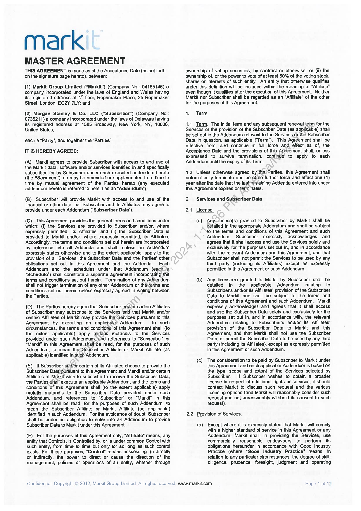
```  
```col-md
mark  
MASTER AGREEMENT  
THIS AGREEMENT is made as of the Acceptance Date (as set forth
on the signature page hereto), between:  
(1) Markit Group Limited (“Markit") (Company No.: 04185146) a
company incorporated under the laws of England and Wales having
its registered address at 4" floor, Ropemaker Place, 25 Ropemaker
Street, London, EC2Y 9LY; and  
(2) Morgan Stanley & Co. LLC (“Subscriber”) (Company No.:
0735211) a company incorporated under the faws of Delaware having
its registered address at 1585 Broadway, New York, NY, 10036,
United States,  
each a “Party”, and together the “Parties”.
IT IS HEREBY AGREED:  
(A) Markit agrees to provide Subscriber with access to and use of
the Markit data, software and/or services identified in and specifically
subscribed for by Subscriber under each executed addendum hereto
(the “Services”), as may be amended or supplemented from time to
time by mutual agreement of the Parties hereto (any executed
addendum hereto is referred to herein as an “Addendum’).  
(B) Subscriber will provide Markit with access to and use of the
financial or other data that Subscriber and its Affiliates may agree to
provide under each Addendum (“Subscriber Data”).  
(C) This Agreement provides the general terms and conditions under
which: (i) the Services are provided to Subscriber and/or, where
expressly permitted, its Affiliates; and (ii) the Subscriber Data is
provided to Markit and/or, where expressly permitted, its Affiliates.
Accordingly, the terms and conditions set out herein are incorporated
by reference into all Addenda and shall, unless an Addendum
expressly states otherwise and to the extent applicable, apply to the
provision of all Services, the Subscriber Data and the Parties’ other
obligations set out in this Agreement and the Addenda. Each
Addendum and the schedules under that Addendum (eacha
“Schedule") shall constitute a separate agreement incorporating the
terms and conditions set out herein. Termination of any Addendum
shall not trigger termination of any other Addendum or thesterms and
conditions set out herein unless expressly agreed in writing between
the Parties.  
(D) The Parties hereby agree that Subscriber and/or certain Affiliates
of Subscriber may subscribe to the Services and that Markit and/or
certain Affiliates of Markit may provide the\Services pursuant to this
Agreement by executing an applicable’ Addendum. in such
circumstances, the terms and conditions of this Agreement shall (to
the extent applicable) apply mutatis mutandis to the Services
provided under such Addendum,-and references to “Subscriber” or
“Markit” in this Agreement.shall-be read, for the purposes of such
Addendum, to mean the<Subscriber Affiliate or Markit Affiliate (as
applicable) identified in. such’ Addendum.  
(E) If Subscriber and/or certain of its Affiliates choose to provide the
Subscriber Data\pursuant to this Agreement and Markit and/or certain
Affiliates of Markit wish to subscribe to receive the Subscriber Data,
the Parties shall execute an applicable Addendum, and the terms and
conditions of this Agreement shall (to the extent applicable) apply
mutatis mutandis to the Subscriber Data provided under such
Addendum, and references to “Subscriber” or “Markit’ in this
Agreement shall be read, for the purposes of such Addendum, to
mean the Subscriber Affiliate or Markit Affiliate (as applicable)
identified in such Addendum. For the avoidance of doubt, Subscriber
shall be under no obligation to enter into an Addendum to provide
Subscriber Data to Markit under this Agreement.  
(F) For the purposes of this Agreement only, “Affiliate” means, any
entity that Controls, is Controlled by, or is under common Control with
such entity, from time to time but only for so long as such control
exists. For these purposes, “Control” means possessing: (i) directly
or indirectly, the power to direct or cause the direction of the
management, policies or operations of an entity, whether through  
Confidential, Copyright © 2012, Markit Group Limited. All rights reserved www.markit.com  
ownership of voting securities, by contract or otherwise; or (ii) the
ownership of, or the power to vote of at least 50% of the voting stock,
shares or interests of such entity. An entity that otherwise qualifies
under this definition will be included within the meaning of “Affiliate”
even though it qualifies after the execution of this Agreement. Neither
Markit nor Subscriber shail be regarded as an “Affiliate” of the other
for the purposes of this Agreement.  
1. Term  
1.1 Term. The initial term and any subsequent renewal term for the
Services or the provision of the Subscriber Data (as applicable) shall
be set out in the Addendum relevant to the Services or the Subscriber
Data in question, as applicable (‘Term"). This Agreement shall be
effective from, and continue in full force and effect as of, the
Acceptance Date and the provisions of this Agreement shall, unless
expressed to survive termination, continue to apply to each
Addendum until the expiry of its Term.  
1.2 Unless otherwise agreed by the Parties, this Agreement shall
automatically terminate and be of-no further force and effect one (1)
year after the date that the last remaining Addenda entered into under
this Agreement expires or terminates.  
2. Services and Subscriber Data  
2.1 License.  
(a) Anyicense(s) granted to Subscriber by Markit shall be
detailed in the appropriate Addendum and shall be subject
to the terms and conditions of this Agreement and such
Addendum. Subscriber expressly acknowledges and
agrees that it shall access and use the Services solely and
exclusively for the purposes set out in, and in accordance
with, the relevant Addendum and this Agreement, and that
Subscriber shall not permit the Services to be used by any
third party (including its Affiliates) except as expressly
permitted in this Agreement or such Addendum.  
(b) Any license(s) granted to Markit by Subscriber shall be
detailed in the applicable Addendum relating to
Subscriber's and/or its Affiliates’ provision of the Subscriber
Data to Markit and shall be subject to the terms and
conditions of this Agreement and such Addendum. Markit
expressly acknowledges and agrees that it shall access
and use the Subscriber Data solely and exclusively for the
purposes set out in, and in accordance with, the relevant
Addendum relating to Subscriber's and/or its Affiliates’
provision of the Subscriber Data to Markit and this
Agreement, and that Markit shall not use the Subscriber
Data, or permit the Subscriber Data to be used by any third
party (including its Affiliates), except as expressly permitted
in this Agreement or such Addendum.  
(c) The consideration to be paid by Subscriber to Markit under
this Agreement and each applicable Addendum is based on
the type, scope and extent of the Services selected by
Subscriber. If Subscriber wishes to obtain a broader
license in respect of additional rights or services, it should
contact Markit to discuss such request and the various
licensing options (and Markit will reasonably consider such
request and not unreasonably withhold its consent to such
request).  
2.2 Provision of Services.  
(a) Except where it is expressly stated that Markit will comply
with a higher standard of service in this Agreement or any
Addendum, Markit shall, in providing the Services, use
commercially reasonable endeavours to perform its
obligations hereunder in accordance with Good Industry
Practice (where “Good Industry Practice” means, in
relation to any particular circumstances, the degree of skill,
diligence, prudence, foresight, judgment and operating  
Page 1 of 12  
```
````
Notes:    
````col
```col-md
flexGrow=.5
===
> [!info] [Page 2](_attachments/images_MS-Parent-3.6.1.19.1.1MorganStanley-MA2013-countersigned.pdf_212238/page_2.png)
> 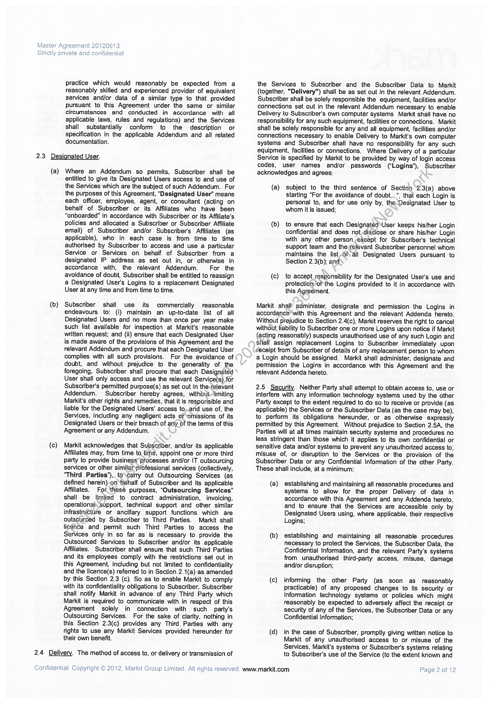
```  
```col-md
Master Agreement 20120613
Strictly private and confidential  
practice which would reasonably be expected from a
reasonably skilled and experienced provider of equivalent
services and/or data of a similar type to that provided
pursuant to this Agreement under the same or similar
circumstances and conducted in accordance with all
applicable laws, rules and regulations) and the Services
shall substantially conform to the description or
specification in the applicable Addendum and all related
documentation.  
2.3 Designated User.  
(a) Where an Addendum so permits, Subscriber shall be
entitled to give its Designated Users access to and use of
the Services which are the subject of such Addendum. For
the purposes of this Agreement, "Designated User" means
each officer, employee, agent, or consultant (acting on
behalf of Subscriber or its Affiliates who have been
“enboarded” in accordance with Subscriber or its Affiliate’s
policies and allocated a Subscriber or Subscriber Affiliate
email) of Subscriber and/or Subscriber's Affiliates (as
applicable), who in each case is from time to time
authorised by Subscriber to access and use a particular
Service or Services on behalf of Subscriber from a
designated IP address as set out in, or otherwise in
accordance with, the relevant Addendum. For the
avoidance of doubt, Subscriber shall be entitled to reassign
a Designated User's Logins to a replacement Designated
User at any time and from time to time.  
(b) Subscriber shall use its commercially reasonable
endeavours to: (i) maintain an up-to-date list of all
Designated Users and no more than once per year make
such list available for inspection at Markit’s reasonable
written request; and (ii) ensure that each Designated User
is made aware of the provisions of this Agreement and the
relevant Addendum and procure that each Designated User
complies with all such provisions. For the avoidance of
doubt, and without prejudice to the generality of the
foregoing, Subscriber shall procure that each Designated
User shall only access and use the relevant Service(s) for
Subscriber's permitted purpose(s) as set out in the-relevant
Addendum. Subscriber hereby agrees, without-limiting
Markit's other rights and remedies, that it is resporisible and
liable for the Designated Users' access to,.and use of, the
Services, including any negligent acts of ‘omissions of its
Designated Users or their breach of any of the terms of this
Agreement or any Addendum.  
(c) Markit acknowledges that Subscnber, and/or its applicable
Affiliates may, from time to. time, appoint one or more third
party to provide business processes and/or IT outsourcing
services or other similar professional services (collectively,
‘Third Parties’),. to\carry out Outsourcing Services (as
defined herein)-on ‘behalf of Subscriber and its applicable
Affiliates. For these purposes, “Outsourcing Services”
shall be limited to contract administration, invoicing,
operationah, support, technical support and other similar
infrastructure or ancillary support functions which are
outsourced by Subscriber to Third Parties. Markit shall
licence and permit such Third Parties to access the
Services only in so far as is necessary to provide the
Outsourced Services to Subscriber and/or its applicable
Affiliates. Subscriber shall ensure that such Third Parties
and its employees comply with the restrictions set out in
this Agreement, including but not limited to confidentiality
and the licence(s) referred to in Section 2.1(a) as amended
by this Section 2.3 (c). So as to enable Markit to comply
with its confidentiality obligations to Subscriber, Subscriber
shall notify Markit in advance of any Third Party which
Markit is required to communicate with in respect of this
Agreement solely in connection with such party's
Outsourcing Services. For the sake of clarity, nothing in
this Section 2.3(c) provides any Third Parties with any
fights to use any Markit Services provided hereunder for
their own benefit.  
2.4 Delivery. The method of access to, or delivery or transmission of  
Confidential. Copyright © 2012, Markit Group Limited. All rights reserved. www.markit.com  
the Services to Subscriber and the Subscriber Data to Markit
(together, "Delivery") shall be as set out in the relevant Addendum.
Subscriber shall be solely responsible the equipment, facilities and/or
connections set out in the relevant Addendum necessary to enable
Delivery to Subscriber's own computer systems Markit shall have no
responsibility for any such equipment, facilities or connections. Markit
shall be solely responsible for any and all equipment, facilities and/or
connections necessary to enable Delivery to Markit's own computer
systems and Subscriber shall have no responsibility for any such
equipment, facilities or connections. Where Delivery of a particular
Service is specified by Markit to be provided by way of login access
codes, user names and/or passwords (“Logins”), Subscriber
acknowledges and agrees:  
(a) subject to the third sentence of Section ‘2.3(a) above
starting “For the avoidance of doubt.  ", that each Login is
personal to, and for use only by, theDesignated User to
whom it is issued;  
(b) to ensure that each Designated‘User keeps his/her Login
confidential and does not-disciose or share his/her Login
with any other person except for Subscriber's technical
support team and the relevant Subscriber personne! whom
maintains the list -of-all Designated Users pursuant to
Section 2.3(b); and  
(c) to accept responsibility for the Designated User’s use and
protection ofthe Logins provided to it in accordance with
this Agreement.  
Markit shall’ administer, designate and permission the Logins in
accordance’with this Agreement and the relevant Addenda hereto.
Without prejudice to Section 2.4(c), Markit reserves the right to cancel
without liability to Subscriber one or more Logins upon notice if Markit
{acting reasonably) suspects unauthorised use of any such Login and
shall assign replacement Logins to Subscriber immediately upon
receipt from Subscriber of details of any replacement person to whom
a Login should be assigned. Markit shall administer, designate and
permission the Logins in accordance with this Agreement and the
relevant Addenda hereto.  
2.5 Security. Neither Party shall attempt to obtain access to, use or
interfere with any information technology systems used by the other
Party except to the extent required to do so to receive or provide (as
applicable) the Services or the Subscriber Data (as the case may be),
to perform its obligations hereunder, or as otherwise expressly
permitted by this Agreement. Without prejudice to Section 2.5A, the
Parties will at all times maintain security systems and procedures no
less stringent than those which it applies to its own confidential or
sensitive data and/or systems to prevent any unauthorized access to,
misuse of, or disruption to the Services or the provision of the
Subscriber Data or any Confidential Information of the other Party.
These shall include, at a minimum:  
(a) establishing and maintaining all reasonable procedures and
systems to allow for the proper Delivery of data in
accordance with this Agreement and any Addenda hereto,
and to ensure that the Services are accessible only by
Designated Users using, where applicable, their respective
Logins;  
(b) establishing and maintaining all reasonable procedures
necessary to protect the Services, the Subscriber Data, the
Confidential Information, and the relevant Party's systems
from unauthorised third-party access, misuse, damage
and/or disruption;  
(c) informing the other Party (as soon as reasonably
practicable) of any proposed changes to its security or
information technology systems or policies which might
reasonably be expected to adversely affect the receipt or
security of any of the Services, the Subscriber Data or any
Confidential Information;  
(d)_ in the case of Subscriber, promptly giving written notice to
Markit of any unauthorised access to or misuse of the
Services, Markit’s systems or Subscriber's systems relating
to Subscriber's use of the Service (to the extent known and  
Page 2 of 12  
```
````
Notes:    
````col
```col-md
flexGrow=.5
===
> [!info] [Page 3](_attachments/images_MS-Parent-3.6.1.19.1.1MorganStanley-MA2013-countersigned.pdf_212238/page_3.png)
> 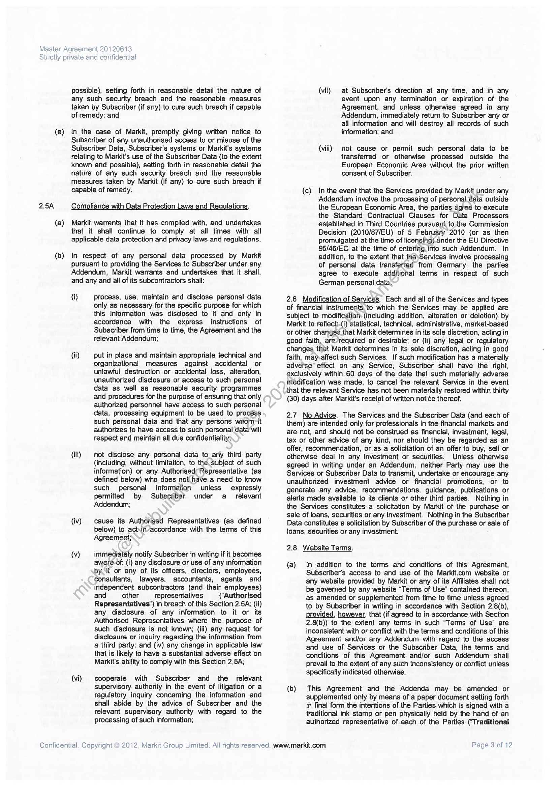
```  
```col-md
Master Agreement 20120613
Strictly private and confidential  
possible), setting forth in reasonable detail the nature of
any such security breach and the reasonable measures
taken by Subscriber (if any) to cure such breach if capable
of remedy; and  
(e} in the case of Markit, promptly giving written notice to
Subscriber of any unauthorised access to or misuse of the
Subscriber Data, Subscriber's systems or Markit's systems
relating to Markit’s use of the Subscriber Data (to the extent
known and possible), setting forth in reasonable detail the
nature of any such security breach and the reasonable
measures taken by Markit (if any) to cure such breach if
capable of remedy.  
2.5A Compliance with Data Protection Laws and Regulations.  
(a) Markit warrants that it has complied with, and undertakes
that it shall continue to comply at all times with all
applicable data protection and privacy laws and regulations.  
(b) In respect of any personal data processed by Markit
pursuant to providing the Services to Subscriber under any
Addendum, Markit warrants and undertakes that it shall,
and any and all of its subcontractors shall:  
(i) Process, use, maintain and disclose personal data
only as necessary for the specific purpose for which
this information was disclosed to it and only in
accordance with the express instructions of
Subscriber from time to time, the Agreement and the
relevant Addendum;  
(ii) put in place and maintain appropriate technical and
organizational measures against accidental or
unlawful destruction or accidental loss, alteration,
unauthorized disclosure or access to such personal
data as well as reasonable security programmes
and procedures for the purpose of ensuring that only
authorized personnel have access to such personal
data, processing equipment to be used to process
such personal data and that any persons wiiom-it
authorizes to have access to such personal data will
respect and maintain all due confidentiality;  
(iii) not disclose any personal data to_arty third party
(including, without limitation, to the subject of such
information) or any Authorised; Representative (as
defined below) who does not have a need to know
such personal information unless expressly
permitted by Subscriber under a_ relevant
Addendum;  
(iv) cause its Authorised Representatives (as defined
below) to act,in/accordance with the terms of this
Agreement;  
(v) immediately notify Subscriber in writing if it becomes
aware.of: (i) any disclosure or use of any information
byt or any of its officers, directors, employees,
consultants, lawyers, accountants, agents and
independent subcontractors (and their employees)
and other representatives (‘Authorised
Representatives’) in breach of this Section 2.5A; (ii)
any disclosure of any information to it or its
Authorised Representatives where the purpose of
such disclosure is not known; (iii) any request for
disclosure or inquiry regarding the information from
a third party; and (iv) any change in applicable law
that is likely to have a substantial adverse effect on
Markit's abifity to comply with this Section 2.5A;  
(vi) cooperate with Subscriber and the relevant
supervisory authority in the event of litigation or a
regulatory inquiry conceming the information and
shall abide by the advice of Subscriber and the
televant supervisory authority with regard to the
processing of such information;  
Confidential. Copyright © 2012, Markit Group Limited. All nghts reserved. www.markit.com  
(vii) at Subscriber's direction at any time, and in any
event upon any termination or expiration of the
Agreement, and unless otherwise agreed in any
Addendum, immediately retum to Subscriber any or
all information and will destroy all records of such
information; and  
(vill) not cause or permit such personal data to be
transferred or otherwise processed outside the
European Economic Area without the prior written
consent of Subscriber.  
(c) In the event that the Services provided by Markit under any
Addendum involve the processing of personal. data outside
the European Economic Area, the parties agree to execute
the Standard Contractual Clauses for Data Processors
established in Third Countries pursuant to the Commission
Decision (2010/87/EU) of 5 February 2010 {or as then
promulgated at the time of licensing)-under the EU Directive
95/46/EC at the time of entering.into such Addendum. In
addition, to the extent that the)Services involve processing
of personal data transferred from Germany, the parties
agree to execute additional terms in respect of such
German personal data,  
2.6 Modification of Services. Each and all of the Services and types
of financial instruments to which the Services may be applied are
subject to modificatior (including addition, alteration or deletion) by
Markit to reflect:.(i) statistical, technical, administrative, market-based
or other changes that Markit determines in its sole discretion, acting in
good faith, are required or desirable; or (ii) any fegal or regulatory
changes that Markit determines in its sole discretion, acting in good
faith, may-affect such Services. If such modification has a materially
adverse’ effect on any Service, Subscriber shall have the right,
exclusively within 60 days of the date that such materially adverse
inodification was made, to cancel the relevant Service in the event
that the relevant Service has not been materially restored within thirty
(30) days after Markit’s receipt of written noti¢e thereof.  
2.7 No Advice. The Services and the Subscriber Data (and each of
them) are intended only for professionals in the financial markets and
are not, and should not be construed as financial, investment, legal,
tax or other advice of any kind, nor should they be regarded as an
offer, recommendation, or as a solicitation of an offer to buy, sell or
otherwise deal in any investment or securities. Unless otherwise
agreed in writing under an Addendum, neither Party may use the
Services or Subscriber Data to transmit, undertake or encourage any
unauthorized investment advice or financial promotions, or to
generate any advice, recommendations, guidance, publications or
alerts made available to its clients or other third parties. Nothing in
the Services constitutes a solicitation by Markit of the purchase or
sale of loans, securities or any investment. Nothing in the Subscriber
Data constitutes a solicitation by Subscriber of the purchase or sale of
foans, securities or any investment.  
2.8 Website Terms.  
(a) In addition to the terms and conditions of this Agreement,
Subscriber's access to and use of the Markit.com website or
any website provided by Markit or any of its Affiliates shall not
be governed by any website “Terms of Use” contained thereon,
as amended or supplemented from time to time unless agreed
to by Subscriber in writing in accordance with Section 2.8(b),
provided, however, that (if agreed to in accordance with Section
2.8(b)) to the extent any terms in such “Terms of Use” are
inconsistent with or conflict with the terms and conditions of this
Agreement and/or any Addendum with regard to the access
and use of Services or the Subscriber Data, the terms and
conditions of this Agreement and/or such Addendum shall
prevail to the extent of any such inconsistency or conflict unless
specifically indicated otherwise.  
(b) This Agreement and the Addenda may be amended or
supplemented only by means of a paper document setting forth
in final form the intentions of the Parties which is signed with a
traditional ink stamp or pen physically held by the hand of an
authorized representative of each of the Parties (‘Traditional  
Page 3 of 12  
```
````
Notes:    
````col
```col-md
flexGrow=.5
===
> [!info] [Page 4](_attachments/images_MS-Parent-3.6.1.19.1.1MorganStanley-MA2013-countersigned.pdf_212238/page_4.png)
> 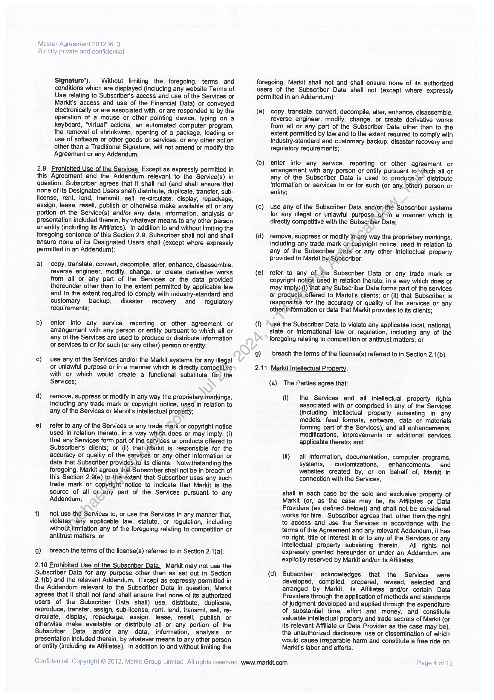
```  
```col-md
Master Agreement 20120613
Strictly private and confidential  
Signature”). Without limiting the foregoing, terms and
conditions which are displayed (including any website Terms of
Use relating to Subscriber's access and use of the Services or
Markit's access and use of the Financial Data) or conveyed
electronically or are associated with, or are responded to by the
operation of a mouse or other pointing device, typing on a
keyboard, “virtual” actions, an automated computer program,
the removal of shrinkwrap, opening of a package, loading or
use of software or other goods or services, or any other action
other than a Traditional Signature, will not amend or modify the
Agreement or any Addendum.  
2.9 Prohibited Use of the Services. Except as expressly permitted in  
this Agreement and the Addendum relevant to the Service(s) in
question, Subscriber agrees that it shall not (and shall ensure that
none of its Designated Users shall) distribute, duplicate, transfer, sublicense, rent, lend, transmit, sell, re-circulate, display, repackage,
assign, lease, resell, publish or otherwise make available all or any
Portion of the Service(s) and/or any data, information, analysis or
presentation included therein, by whatever means to any other person
or entity (including its Affiliates). In addition to and without limiting the
foregoing sentence of this Section 2.9, Subscriber shall not and shall
ensure none of its Designated Users shall (except where expressly
permitted in an Addendum):  
a) copy, translate, convert, decompile, alter, enhance, disassemble,
reverse engineer, modify, change, or create derivative works
from all or any part of the Services or the data provided
thereunder other than to the extent permitted by applicable law
and to the extent required to comply with industry-standard and
customary backup, disaster recovery and regulatory
requirements;  
b) enter into any service, reporting or other agreement or
arrangement with any person or entity pursuant to which all or
any of the Services are used to produce or distribute information
or services to or for such (or any other) person or entity;  
¢) use any of the Services and/or the Markit systems for any illegal
or unlawful purpose or in a manner which is directly competitive
with or which would create a functional substitute for) the
Services;  
d) remove, suppress or modify in any way the proprietary-markings,
including any trade mark or copyright notice, used in relation to
any of the Services or Markit's intellectual property;  
@) refer to any of the Services or any trade mark or copyright notice
used in relation thereto, in a way which. does or may imply: (i)
that any Services form part of the services or products offered to
Subscriber's clients; or (ii) that\Markit is responsible for the
accuracy or quality of the services or any other information or
data that Subscriber provides.to its clients. Notwithstanding the
foregoing, Markit agrees that Subscriber shall not be in breach of
this Section 2.9(e) to-the-extent that Subscriber uses any such
trade mark or copyright’ notice to indicate that Markit is the
source of all or any part of the Services pursuant to any
Addendum;  
f) not use the Services to, or use the Services in any manner that,
violatessany applicable law, statute, or regulation, including
without limitation any of the foregoing relating to competition or
antitrust matters; or  
g) breach the terms of the license(s) referred to in Section 2.1(a).  
2.10 Prohibited Use of the Subscriber Data. Markit may not use the  
Subscriber Data for any purpose other than as set out in Section
2.1(b) and the relevant Addendum. Except as expressly permitted in
the Addendum relevant to the Subscriber Data in question, Markit
agrees that it shall not (and shall ensure that none of its authorized
users of the Subscriber Data shall) use, distribute, duplicate,
reproduce, transfer, assign, sub-license, rent, lend, transmit, sell, recirculate, display, repackage, assign, lease, resell, publish or
otherwise make available or distribute all or any portion of the
Subscriber Data and/or any data, information, analysis or
presentation included therein, by whatever means to any other person
or entity (including its Affiliates). In addition to and without limiting the  
Confidential. Copyright © 2012, Markit Group Limited. All rights reserved. www.markit.com  
foregoing, Markit shall not and shall ensure none of its authorized
users of the Subscriber Data shall not (except where expressly
permitted in an Addendum):  
(a) copy, translate, convert, decompile, alter, enhance, disassemble,
Teverse engineer, modify, change, or create derivative works
from all or any part of the Subscriber Data other than to the
extent permitted by law and to the extent required to comply with
industry-standard and customary backup, disaster recovery and
regulatory requirements;  
(b) enter into any service, reporting or other agreement or
arrangement with any person or entity pursuant to>which all or
any of the Subscriber Data is used to produce~or distribute
information or services to or for such (or any other) person or
entity;  
(c) use any of the Subscriber Data and/orthe Subscriber systems
for any illegal or unlawful purpose_or-in a manner which is
directly competitive with the Subscriber Data;  
{d) remove, suppress or modify imany way the proprietary markings,
including any trade mark omcopyright notice, used in relation to
any of the Subscriber Data or any other intellectual property
provided to Markit by:SubScriber;  
(e) refer to any of_ihe Subscriber Data or any trade mark or
copyright notice Used in relation thereto, in a way which does or
may imply:-(i) that any Subscriber Data forms part of the services
or products offered to Markit's clients; or (ii) that Subscriber is
responsible for the accuracy or quality of the services or any
othen information or data that Markit provides to its clients;  
(f) use the Subscriber Data to violate any applicable local, national,
state or intemational law or regulation, including any of the
foregoing relating to competition or antitrust matters; or  
g) breach the terms of the license(s) referred to in Section 2.1(b).  
2.11 Markit Intellectual Property.
(a) The Parties agree that:  
(i) the Services and all intellectual property rights
associated with or comprised in any of the Services
(including intellectual property subsisting in any
models, feed formats, software, data or materials
forming part of the Services), and all enhancements,
modifications, improvements or additional services
applicable thereto; and  
(ii) all information, documentation, computer programs,
systems, customizations, enhancements and
websites created by, or on behalf of, Markit in
connection with the Services,  
shall in each case be the sole and exclusive property of
Markit (or, as the case may be, its Affiliates or Data
Providers (as defined below)) and shall not be considered
works for hire. Subscriber agrees that, other than the right
to access and use the Services in accordance with the
terms of this Agreement and any relevant Addendum, it has
no right, title or interest in or to any of the Services or any
intellectual property subsisting therein. All rights not
expressly granted hereunder or under an Addendum are
explicitly reserved by Markit and/or its Affiliates.  
(d) Subscriber acknowledges that the Services were
developed, compiled, prepared, revised, selected and
arranged by Markit, its Affiliates and/or certain Data
Providers through the application of methods and standards
of judgment developed and applied through the expenditure
of substantial time, effort and money, and constitute
valuable intellectual property and trade secrets of Markit (or
its relevant Affiliate or Data Provider as the case may be),
the unauthorized disclosure, use or dissemination of which
would cause irreparable harm and constitute a free ride on
Markit's labor and efforts.  
Page 4 of 12  
```
````
Notes:    
````col
```col-md
flexGrow=.5
===
> [!info] [Page 5](_attachments/images_MS-Parent-3.6.1.19.1.1MorganStanley-MA2013-countersigned.pdf_212238/page_5.png)
> 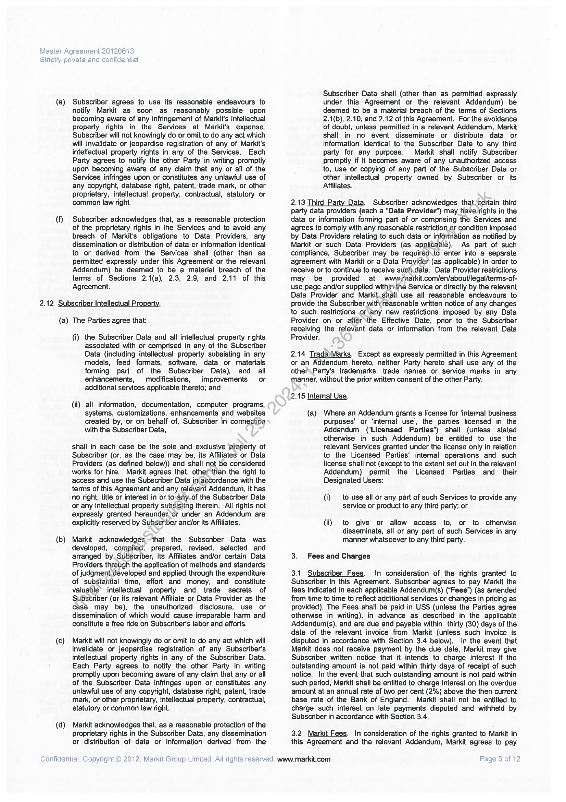
```  
```col-md
Master Agreement 20120613
Strictly private and confidential  
(e) Subscriber agrees to use its reasonable endeavours to
notify Markit as soon as reasonably possible upon
becoming aware of any infringement of Markit's intellectual
property rights in the Services at Markit's expense.
Subscriber will not knowingly do or omit to do any act which
will invalidate or jeopardise registration of any of Markit's
intellectual property rights in any of the Services. Each
Party agrees to notify the other Party in writing promptly
upon becoming aware of any claim that any or all of the
Services infringes upon or constitutes any unlawful use of
any copyright, database right, patent, trade mark, or other
proprietary, intellectual property, contractual, statutory or
common law right.  
(f) Subscriber acknowledges that, as a reasonable protection
of the proprietary rights in the Services and to avoid any
breach of Markit's obligations to Data Providers, any
dissemination or distribution of data or information identical
to or derived from the Services shall (other than as
permitted expressly under this Agreement or the relevant
Addendum) be deemed to be a material breach of the
terms of Sections 2.1(a), 2.3, 2.9, and 2.11 of this
Agreement.  
2.12 Subscriber Intellectual Property.
(a) The Parties agree that:  
(i) the Subscriber Data and all intellectual property rights
associated with or comprised in any of the Subscriber
Data (including intellectual property subsisting in any
models, feed formats, software, data or materials
forming part of the Subscriber Data), and all
enhancements, modifications, improvements or
additional services applicable thereto; and  
(ii) all information, documentation, computer programs,
systems, customizations, enhancements and websites
created by, or on behalf of, Subscriber in connection
with the Subscriber Data,  
shall in each case be the sole and exclusive property of
Subscriber (or, as the case may be, its Affiliates or Data
Providers (as defined below)) and shall not be considered
works for hire. Markit agrees that, other than the right to
access and use the Subscriber Data in(avcordance with the
terms of this Agreement and any relevant Addendum, it has
no right, title or interest in or to.any_of the Subscriber Data
or any intellectual property subsisting therein. All rights not
expressly granted hereunder or under an Addendum are
explicitly reserved by Subscriber and/or its Affiliates.  
(b) Markit acknowledges~that the Subscriber Data was
developed, compiled, prepared, revised, selected and
arranged by. Subscriber, its Affiliates and/or certain Data
Providers through the application of methods and standards
of judgment developed and applied through the expenditure
of substantial time, effort and money, and constitute
valuable intellectual property and trade secrets of
Subscriber (or its relevant Affiliate or Data Provider as the
case may be), the unauthorized disclosure, use or
dissemination of which would cause irreparable harm and
constitute a free ride on Subscriber's labor and efforts,  
(c) Markit will not knowingly do or omit to do any act which will
invalidate or jeopardise registration of any Subscriber's
intellectual property rights in any of the Subscriber Data.
Each Party agrees to notify the other Party in writing
promptly upon becoming aware of any claim that any or all
of the Subscriber Data infringes upon or constitutes any
unlawful use of any copyright, database right, patent, trade
mark, or other proprietary, intellectual property, contractual,
statutory or common law right.  
(d) Markit acknowledges that, as a reasonable protection of the
proprietary rights in the Subscriber Data, any dissemination
or distribution of data or information derived from the  
Confidential. Copyright © 2012, Markit Group Limited. All rights reserved. www.markit.com  
Subscriber Data shall (other than as permitted expressly
under this Agreement or the relevant Addendum) be
deemed to be a material breach of the terms of Sections
2.1(b), 2.10, and 2.12 of this Agreement. For the avoidance
of doubt, unless permitted in a relevant Addendum, Markit
shall in no event disseminate or distribute data or
information identical to the Subscriber Data to any third
party for any purpose. Markit shall notify Subscriber
promptly if it becomes aware of any unauthorized access
to, use or copying of any part of the Subscriber Data or
other intellectual property owned by Subscriber or its
Affiliates.  
2.13 Third Party Data. Subscriber acknowedges that certain third
party data providers (each a “Data Provider”) may have rights in the
data or information forming part of or comprising the Services and
agrees to comply with any reasonable restriction er condition imposed
by Data Providers relating to such data or infarmation as notified by
Markit or such Data Providers (as applicable). As part of such
compliance, Subscriber may be required\.to enter into a separate
agreement with Markit or a Data Provider (as applicable) in order to
receive or to continue to receive such.data. Data Provider restrictions
may be provided at wwvw.tmarkit.com/en/about/legal/terms-ofuse.page and/or supplied withinthe Service or directly by the relevant
Data Provider and Markit.shall use all reasonable endeavours to
provide the Subscriber with:reasonable written notice of any changes
to such restrictions or\any new restrictions imposed by any Data
Provider on or after‘the Effective Date, prior to the Subscriber
receiving the relevant data or information from the relevant Data
Provider.  
2.14 Trade@Marks. Except as expressly permitted in this Agreement
or an Addendum hereto, neither Party hereto shall use any of the
other\Party’s trademarks, trade names or service marks in any
manner, without the prior written consent of the other Party.  
2.15 Intemal Use.  
(a) Where an Addendum grants a license for ‘intemal business
purposes’ or ‘interna! use’, the parties licensed in the
Addendum ("Licensed Parties") shal! (unless stated
otherwise in such Addendum) be entitled to use the
relevant Services granted under the license only in relation
ta the Licensed Parties’ intemal operations and such
license shall not (except to the extent set out in the relevant
Addendum) permit the Licensed Parties and their
Designated Users:  
(i) to use all or any part of such Services to provide any
service or product to any third party; or  
(ii) to give or allow access to, or to otherwise
disseminate, all or any part of such Services in any
manner whatsoever to any third party.  
3. Fees and Charges  
3.1 Subscriber Fees. In consideration of the rights granted to
Subscriber in this Agreement, Subscriber agrees to pay Markit the
fees indicated in each applicable Addendum(s) (“Fees”) (as amended
from time to time to reflect additional services or changes in pricing as
provided). The Fees shall be paid in US$ (unless the Parties agree
otherwise in writing), in advance as described in the applicable
Addendum(s), and are due and payable within thirty (30) days of the
date of the relevant invoice from Markit (unless such invoice is
disputed in accordance with Section 3.4 below). In the event that
Markit does not receive payment by the due date, Markit may give
Subscriber written notice that it intends to charge interest if the
outstanding amount is not paid within thirty days of receipt of such
notice. In the event that such outstanding amount is not paid within
such period, Markit shall be entitled to charge interest on the overdue
amount at an annual rate of two per cent (2%) above the then current
base rate of the Bank of England. Markit shall not be entitled to
charge such interest on late payments disputed and withheld by
Subscriber in accordance with Section 3.4.  
3.2 Markit Fees. In consideration of the rights granted to Markit in
this Agreement and the relevant Addendum, Markit agrees to pay  
Page 5 of 12  
```
````
Notes:    
````col
```col-md
flexGrow=.5
===
> [!info] [Page 6](_attachments/images_MS-Parent-3.6.1.19.1.1MorganStanley-MA2013-countersigned.pdf_212238/page_6.png)
> 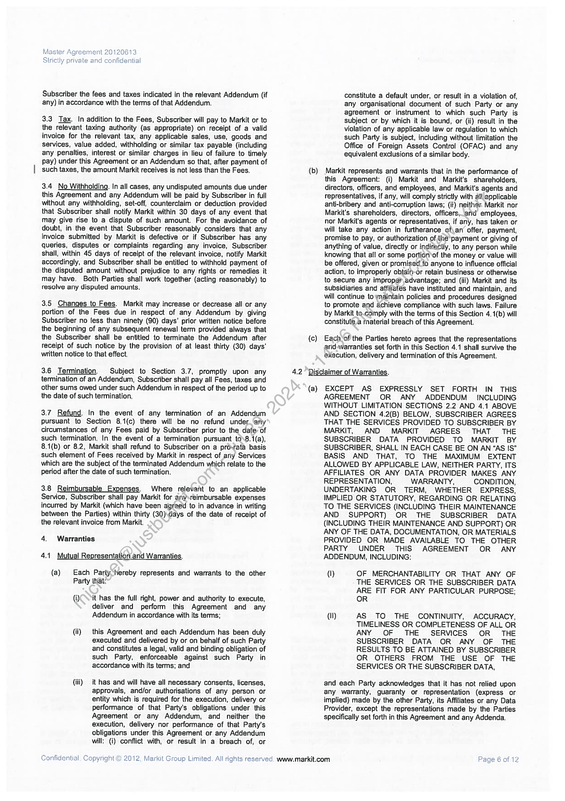
```  
```col-md
Master Agreement 20120613
Strictly private and confidential  
Subscriber the fees and taxes indicated in the relevant Addendum (if
any) in accordance with the terms of that Addendum.  
3.3 Tax. In addition to the Fees, Subscriber will pay to Markit or to
the relevant taxing authority (as appropriate) on receipt of a valid
invoice for the relevant tax, any applicable sales, use, goods and
services, value added, withholding or similar tax payable (including
any penalties, interest or similar charges in lieu of failure to timely
pay) under this Agreement or an Addendum so that, after payment of
such taxes, the amount Markit receives is not less than the Fees.  
3.4 No Withholding. In all cases, any undisputed amounts due under
this Agreement and any Addendum will be paid by Subscriber in full
without any withholding, set-off, counterclaim or deduction provided
that Subscriber shall notify Markit within 30 days of any event that
may give rise to a dispute of such amount. For the avoidance of
doubt, in the event that Subscriber reasonably considers that any
invoice submitted by Markit is defective or if Subscriber has any
queries, disputes or complaints regarding any invoice, Subscriber
shall, within 45 days of receipt of the relevant invoice, notify Markit
accordingly, and Subscriber shall be entitled to withhold payment of
the disputed amount without prejudice to any rights or remedies it
may have. Both Parties shall work together (acting reasonably) to
resolve any disputed amounts.  
3.5 Changes to Fees. Markit may increase or decrease all or any
portion of the Fees due in respect of any Addendum by giving
Subscriber no fess than ninety (90) days’ prior written notice before
the beginning of any subsequent renewal term provided always that
the Subscriber shall be entitled to terminate the Addendum after
receipt of such notice by the provision of at least thirty (30) days’
written notice to that effect.  
3.6 Termination. Subject to Section 3.7, promptly upon any
termination of an Addendum, Subscriber shall pay all Fees, taxes and
other sums owed under such Addendum in respect of the period up to
the date of such termination,  
3.7 Refund. In the event of any termination of an Addendum
pursuant to Section 8.1(c) there will be no refund under ‘any
circumstances of any Fees paid by Subscriber prior to the date of
such termination. In the event of a termination pursuant to\8.1(a),
8.1(b) or 8.2, Markit shall refund to Subscriber on a pro-fata basis
such element of Fees received by Markit in respect of any Services
which are the subject of the terminated Addendum which relate to the
period after the date of such termination.  
3.8 Reimbursable Expenses. Where relevant to an applicable
Service, Subscriber shall pay Markit for any\reimbursable expenses
incurred by Markit (which have been agreed to in advance in writing
between the Parties) within thirty (30)\days of the date of receipt of
the relevant invoice from Markit.  
4. Warranties  
4.1 Mutual Representation and Warranties.  
(a) Each Party “hereby represents and warrants to the other
Party that:  
(QOo it has the full right, power and authority to execute,
deliver and perform this Agreement and any
Addendum in accordance with its terms;  
(ii) this Agreement and each Addendum has been duly
executed and delivered by or on behalf of such Party
and constitutes a legal, valid and binding obligation of
such Party, enforceable against such Party in
accordance with its terms; and  
(ii) it has and will have all necessary consents, licenses,
approvals, and/or authorisations of any person or
entity which is required for the execution, delivery or
performance of that Party's obligations under this
Agreement or any Addendum, and neither the
execution, delivery nor performance of that Party’s
obligations under this Agreement or any Addendum
will: (i) conflict with, or result in a breach of, or  
Confidential. Copyright © 2012, Markit Group Limited. All rights reserved. www.markit.com  
constitute a default under, or result in a violation of,
any organisational document of such Party or any
agreement or instrument to which such Party is
subject or by which it is bound, or (ii) result in the
violation of any applicable law or regulation to which
such Party is subject, including without limitation the
Office of Foreign Assets Control (OFAC) and any
equivalent exclusions of a similar body.  
(b) Markit represents and warrants that in the performance of
this Agreement: (i) Markit and Markit's shareholders,
directors, officers, and employees, and Markit’s agents and
representatives, if any, will comply strictly with all applicable
anti-bribery and anti-corruption laws; (ii) neither. Markit nor
Markit’s shareholders, directors, officers,.and employees,
nor Markit's agents or representatives, if any, has taken or
will take any action in furtherance ef\ar’ offer, payment,
promise to pay, or authorization of the payment or giving of
anything of value, directly or indiractly, to any person while
knowing that all or some portion ‘of the money or value will
be offered, given or promised to anyone to influence official
action, to improperly obtain-or retain business or otherwise
to secure any improper advantage; and (iii) Markit and its
subsidiaries and affiliates have instituted and maintain, and
will continue to maintain policies and procedures designed
to promote and achieve compliance with such laws. Failure
by Markit to.comply with the terms of this Section 4. 1(b) will
constitute a material breach of this Agreement.  
(c) Each of the Parties hereto agrees that the representations
and.warranties set forth in this Section 4.1 shall survive the
execution, delivery and termination of this Agreement.  
4.2 Disclaimer of Warranties.  
(a) EXCEPT AS EXPRESSLY SET FORTH IN THIS
AGREEMENT OR ANY ADDENDUM — INCLUDING
WITHOUT LIMITATION SECTIONS 2.2 AND 4.1 ABOVE
AND SECTION 4.2(B) BELOW, SUBSCRIBER AGREES
THAT THE SERVICES PROVIDED TO SUBSCRIBER BY
MARKIT, AND MARKIT AGREES THAT THE
SUBSCRIBER DATA PROVIDED TO MARKIT BY
SUBSCRIBER, SHALL IN EACH CASE BE ON AN “AS |S”
BASIS AND THAT, TO THE MAXIMUM EXTENT
ALLOWED BY APPLICABLE LAW, NE!THER PARTY, ITS
AFFILIATES OR ANY DATA PROVIDER MAKES ANY
REPRESENTATION, WARRANTY, CONDITION,
UNDERTAKING OR TERM, WHETHER EXPRESS,
IMPLIED OR STATUTORY, REGARDING OR RELATING
TO THE SERVICES (INCLUDING THEIR MAINTENANCE
AND SUPPORT) OR THE SUBSCRIBER DATA
(INCLUDING THEIR MAINTENANCE AND SUPPORT) OR
ANY OF THE DATA, DOCUMENTATION, OR MATERIALS
PROVIDED OR MADE AVAILABLE TO THE OTHER
PARTY UNDER THIS AGREEMENT OR ANY
ADDENDUM, INCLUDING:  
(I) OF MERCHANTABILITY OR THAT ANY OF
THE SERVICES OR THE SUBSCRIBER DATA
ARE FIT FOR ANY PARTICULAR PURPOSE;
OR  
(ll) AS TO THE CONTINUITY, ACCURACY,
TIMELINESS OR COMPLETENESS OF ALL OR
ANY OF THE SERVICES OR THE
SUBSCRIBER DATA OR ANY OF THE
RESULTS TO BE ATTAINED BY SUBSCRIBER
OR OTHERS FROM THE USE OF THE
SERVICES OR THE SUBSCRIBER DATA,  
and each Party acknowledges that it has not relied upon
any warranty, guaranty or representation (express or
implied) made by the other Party, its Affiliates or any Data
Provider, except the representations made by the Parties
specifically set forth in this Agreement and any Addenda.  
Page 6 of 12  
```
````
Notes:    
````col
```col-md
flexGrow=.5
===
> [!info] [Page 7](_attachments/images_MS-Parent-3.6.1.19.1.1MorganStanley-MA2013-countersigned.pdf_212238/page_7.png)
> 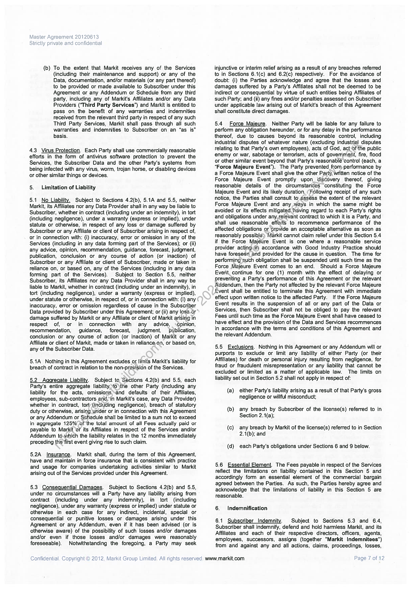
```  
```col-md
Master Agreement 20120613
Strictly private and confidential  
(b) To the extent that Markit receives any of the Services
{including their maintenance and support) or any of the
Data, documentation, and/or materials (or any part thereof)
to be provided or made available to Subscriber under this
Agreement or any Addendum or Schedule from any third
party, including any of Markit's Affiliates and/or any Data
Providers (‘Third Party Services") and Markit is entitled to
pass on the benefit of any warranties and indemnities
received from the relevant third party in respect of any such
Third Party Services, Markit shall pass through all such
warranties and indemnities to Subscriber on an “as is”
basis.  
4.3 Virus Protection. Each Party shall use commercially reasonable
efforts in the form of antivirus software protection to prevent the
Services, the Subscriber Data and the other Party’s systems from
being infected with any virus, worm, trojan horse, or disabling devices
or other similar things or devices,  
5. Limitation of Liability  
5.1 No Liability. Subject to Sections 4.2(b), 5.1A and 5.5, neither
Markit, its Affiliates nor any Data Provider shall in any way be liable to
Subscriber, whether in contract (including under an indemnity), in tort
(including negligence), under a warranty (express or implied), under
statute or otherwise, in respect of any loss or damage suffered by
Subscriber or any Affiliate or client of Subscriber arising in respect of,
or in connection with: (i) inaccuracy, error or omission in any of the
Services (including in any data forming part of the Services); or (ii)
any advice, opinion, recommendation, guidance, forecast, judgment,
publication, conclusion or any course of action (or inaction) of
Subscriber or any Affiliate or client of Subscriber, made or taken in
reliance on, or based on, any of the Services (including in any data
forming part of the Services). Subject to Section 5.5, neither
Subscriber, its Affiliates nor any Data Provider shall in any way be
liable to Markit, whether in contract (including under an indemnity), in
tort (including negligence), under a warranty (express or implied),
under statute or otherwise, in respect of, or in connection with: (i) any
inaccuracy, error or omission regardless of cause in the Subscriber
Data provided by Subscriber under this Agreement; or (ii) any loss-or
damage suffered by Markit or any Affiliate or client of Markit arising in
respect of, or in connection with any advice, opinion,
recommendation, guidance, forecast, judgment, publication,
conclusion or any course of action (or inaction) of Markit or any
Affiliate or client of Markit, made or taken in reliance,on, or based on,
any of the Subscriber Data.  
5.1A Nothing in this Agreement excludes or limits Markit's liability for
breach of contract in relation to the non-provision of the Services.  
5.2 Agaregate Liability. Subject to Sections 4.2(b) and 5.5, each
Party's entire aggregate liability to \the other Party (including any
liability for the acts, omissions and defaults of their Affiliates,
employees, sub-contractors. anu, in Markit's case, any Data Provider)
whether in contract, tort(including negligence), breach of statutory
duty or otherwise, arising under or in connection with this Agreement
or any Addendum or Sehedule shall be limited to a sum not to exceed
in aggregate 125% of the total amount of all Fees actually paid or
payable to Markit or its Affiliates in respect of the Services and/or
Addendum té.which the liability relates in the 12 months immediately
preceding the first event giving rise to such claim.  
5.2A Insurance. Markit shall, during the term of this Agreement,
have and maintain in force insurance that is consistent with practice
and usage for companies undertaking activities similar to Markit
arising out of the Services provided under this Agreement.  
5.3 Consequential Damages. Subject to Sections 4.2(b) and 5.5,
under no circumstances will a Party have any liability arising from
contract {including under any indemnity), in tort (including
negligence), under any warranty (express or implied) under statute or
otherwise in each case for any indirect, incidental, special or
consequential or punitive losses or damages arising under this
Agreement or any Addendum, even if it has been advised (or is
otherwise aware) of the possibility of such losses and/or damages
and/or even if those losses and/or damages were reasonably
foreseeable). Notwithstanding the foregoing, a Party may seek  
Confidential. Copyright © 2012, Markit Group Limited. All rights reserved. www,markit.com  
injunctive or interim relief arising as a result of any breaches referred
to in Sections 6.1(c) and 6.2(c) respectively. For the avoidance of
doubt: (i) the Parties acknowledge and agree that the losses and
damages suffered by a Party's Affiliates shall not be deemed to be
indirect or consequential by virtue of such entities being Affiliates of
such Party; and (ii) any fines and/or penalties assessed on Subscriber
under applicable law arising out of Markit’s breach of this Agreement
shall constitute direct damages.  
5.4 Force Majeure. Neither Party will be liable for any failure to
perform any obligation hereunder, or for any delay in the performance
thereof, due to causes beyond its reasonable control, including
industrial disputes of whatever nature (excluding industrial disputes
relating to that Party’s own employees), acts of God, act-of the public
enemy or war, sabotage or terrorism, acts of government, fire, flood
or other similar event beyond that Party's reasonablé control (each, a
“Force Majeure Event”). The Party prevented from performance by
a Force Majeure Event shall give the other Party written notice of the
Force Majeure Event promptly upon tiscovery thereof, giving
reasonable details of the circumstances constituting the Force
Majeure Event and its likely duration. (Following receipt of any such
notice, the Parties shall consult to asséss the extent of the relevant
Force Majeure Event and any ways in which the same might be
avoided or its effects mitigated having regard to each Party's rights
and obligations under any.relevant contract to which it is a Party, and
shall use reasonable efforts to recommence performance of the
affected obligations or provide an acceptable altemative as soon as
reasonably possible) Markit cannot claim relief under this Section 5.4
if the Force Majeure Event is one where a reasonable service
provider actingvin accordance with Good Industry Practice should
have foreseen_and provided for the cause in question. The time for
performing*such obligation shall be suspended until such time as the
Force Majeure Event comes to an end. Should a Force Majeure
Event continue for one (1) month with the effect of delaying or
preventing a Party's performance of this Agreement or the relevant
Addendum, then the Party not affected by the relevant Force Majeure
Event shall be entitled to terminate this Agreement with immediate
effect upon written notice to the affected Party. If the Force Majeure
Event results in the suspension of all or any part of the Data or
Services, then Subscriber shall not be obliged to pay the relevant
Fees until such time as the Force Majeure Event shall have ceased to
have effect and the provision of the Data and Services recommences
in accordance with the terms and conditions of this Agreement and
the relevant Addendum.  
5.5 Exclusions. Nothing in this Agreement or any Addendum will or
purports to exclude or limit any liability of either Party (or their
Affiliates) for death or personal injury resulting from negligence, for
fraud or fraudulent misrepresentation or any liability that cannot be
excluded or limited as a matter of applicable law. The limits on
liability set out in Section 5.2 shall not apply in respect of:  
(a) either Party's liability arising as a result of that Party's gross
negligence or willful misconduct;  
(b) any breach by Subscriber of the license(s) referred to in
Section 2.1(a);  
(c) any breach by Markit of the license(s) referred to in Section
2.1(b); and  
(d) each Party's obligations under Sections 6 and 9 below.  
5.6 Essential Element. The Fees payable in respect of the Services
reflect the limitations on fiability contained in this Section 5 and
accordingly form an essential element of the commercial bargain
agreed between the Parties. As such, the Parties hereby agree and
acknowledge that the limitations of liability in this Section 5 are
reasonable.  
6, Indemnification  
6.1 Subscriber Indemnity. Subject to Sections 5.3 and 6.4,
Subscriber shall indemnify, defend and hold harmless Markit, and its
Affiliates and each of their respective directors, officers, agents,
employees, successors, assigns (together "Markit Indemnitees")
from and against any and all actions, claims, proceedings, losses,  
Page 7 of 12  
```
````
Notes:    
````col
```col-md
flexGrow=.5
===
> [!info] [Page 8](_attachments/images_MS-Parent-3.6.1.19.1.1MorganStanley-MA2013-countersigned.pdf_212238/page_8.png)
> 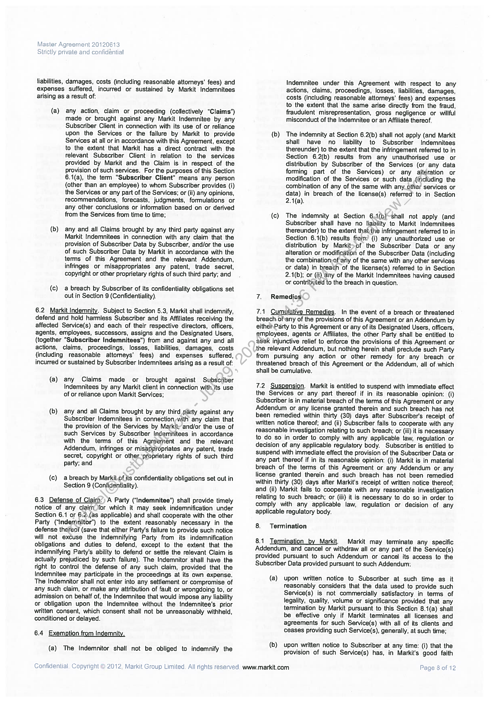
```  
```col-md
Master Agreement 20120613
Strictly private and confidential  
liabilities, damages, costs (including reasonable attomeys’ fees) and
expenses suffered, incurred or sustained by Markit Indemnitees
arising as a result of:  
(a) any action, claim or proceeding (collectively “Claims”)
made or brought against any Markit Indemnitee by any
Subscriber Client in connection with its use of or reliance
upon the Services or the failure by Markit to provide
Services at all or in accordance with this Agreement, except
to the extent that Markit has a direct contract with the
relevant Subscriber Client in relation to the services
provided by Markit and the Claim is in respect of the
provision of such services. For the purposes of this Section
6.1(a), the term "Subscriber Client" means any person
(other than an employee) to whom Subscriber provides (i)
the Services or any part of the Services; or (ii) any opinions,
fecommendations, forecasts, judgments, formulations or
any other conclusions or information based on or derived
from the Services from time to time;  
(b) any and all Claims brought by any third party against any
Markit Indemnitees in connection with any claim that the
provision of Subscriber Data by Subscriber, and/or the use
of such Subscriber Data by Markit in accordance with the
terms of this Agreement and the relevant Addendum,
infringes or misappropriates any patent, trade secret,
copyright or other proprietary rights of such third party; and  
(c) a breach by Subscriber of its confidentiality obligations set
out in Section S (Confidentiality).  
6.2 Markit Indemnity. Subject to Section 5.3, Markit shall indemnify,
defend and hold harmless Subscriber and its Affiliates receiving the
affected Service(s) and each of their respective directors, officers,
agents, employees, successors, assigns and the Designated Users,
(together "Subscriber Indemnitees") from and against any and all
actions, claims, proceedings, losses, liabilities, damages, costs
(including reasonable attomeys’ fees) and expenses suffered,
incurred or sustained by Subscriber Indemnitees arising as a result of:  
(a) any Claims made or brought against Subscriber
Indemnitees by any Markit client in connection with its use
of or reliance upon Markit Services;  
(b) any and all Claims brought by any third party against any
Subscriber Indemnitees in connection with any claim that
the provision of the Services by Markit; and/or the use of
such Services by Subscriber Indemnitees in accordance
with the terms of this Agreement and the relevant
Addendum, infringes or misappropriates any patent, trade
secret, copyright or other<proprietary rights of such third
party; and  
(c) a breach by Markit.of its confidentiality obligations set out in
Section 9 (Confidentiality).  
6.3 Defense of Claim.) A Party (‘Indemnitee") shal! provide timely
notice of any clairn for which it may seek indemnification under
Section 6.1 or 6:2\(as applicable) and shall cooperate with the other
Party (“indeminitor’) to the extent reasonably necessary in the
defense thereof (save that either Party's failure to provide such notice
will not excuse the indemnifying Party from its indemnification
obligations and duties to defend, except to the extent that the
indemnifying Party's ability to defend or settle the relevant Claim is
actually prejudiced by such failure). The Indemnitor shall have the
right to control the defense of any such claim, provided that the
Indemnitee may participate in the proceedings at its own expense.
The Indemnitor shall not enter into any settlement or compromise of
any such claim, or make any attribution of fault or wrongdoing to, or
admission on behalf of, the Indemnitee that would impose any liability
or obligation upon the Indemnitee without the indemnitee's prior
written consent, which consent shall not be unreasonably withheld,
conditioned or delayed.  
6.4 Exemption from Indemnity.
(a) The Indemnitor shall not be obliged to indemnify the  
Confidential. Copyright © 2012, Markit Group Limited. All rights reserved. www.markit.com  
Indemnitee under this Agreement with respect to any
actions, claims, proceedings, losses, liabilities, damages,
costs (including reasonable attorneys’ fees) and expenses
to the extent that the same arise directly from the fraud,
fraudulent misrepresentation, gross negligence or willful
misconduct of the Indemnitee or an Affiliate thereof.  
(b) The indemnity at Section 6.2(b) shall not apply (and Markit
shall have no liability to Subscriber Indemnitees
thereunder) to the extent that the infringement referred to in
Section 6.2(b) results from any unauthorised use or
distribution by Subscriber of the Services (or any data
forming part of the Services) or any aitération or
modification of the Services or such data {including the
combination of any of the same with any other services or
data) in breach of the license(s) referred’ to in Section
2.1(a).  
(c) The indemnity at Section 61(b)~shall not apply (and
Subscriber shall have no liability to Markit Indemnitees
thereunder) to the extent that;the infringement referred to in
Section 6.1(b) results frem:? (i) any unauthorized use or
distribution by Markit>of the Subscriber Data or any
alteration or modification of the Subscriber Data (including
the combination:of any of the same with any other services
or data) in breach of the license(s) referred to in Section
2.1(b); or (ji) any of the Markit Indemnitees having caused
or contributed to the breach in question.  
7. Remedies  
7.1 Cumulative Remedies. In the event of a breach or threatened
breach of'any of the provisions of this Agreement or an Addendum by
eithenParty to this Agreement or any of its Designated Users, officers,
employees, agents or Affiliates, the other Party shall be entitled to
seek injunctive relief to enforce the provisions of this Agreement or
the relevant Addendum, but nothing herein shall preclude such Party
from pursuing any action or other remedy for any breach or
threatened breach of this Agreement or the Addendum, all of which
shall be cumulative.  
7.2 Suspension. Markit is entitled to suspend with immediate effect
the Services or any part thereof if in its reasonable opinion: (i)
Subscriber is in material breach of the terms of this Agreement or any
Addendum or any license granted therein and such breach has not
been remedied within thirty (30) days after Subscriber's receipt of
written notice thereof; and (ii) Subscriber fails to cooperate with any
reasonable investigation relating to such breach; or (iii) it is necessary
to do so in order to comply with any applicable faw, regulation or
decision of any applicable regulatory body. Subscriber is entitled to
suspend with immediate effect the provision of the Subscriber Data or
any part thereof if in its reasonable opinion: (i) Markit is in material
breach of the terms of this Agreement or any Addendum or any
license granted therein and such breach has not been remedied
within thirty (30) days after Markit's receipt of written notice thereof:
and (ii) Markit fails to cooperate with any reasonable investigation
relating to such breach; or (iii) it is necessary to do so in order to
comply with any applicable law, regulation or decision of any
applicable regulatory body.  
8. Termination  
8.1 Termination by Markit Markit may terminate any specific
Addendum, and cancel or withdraw all or any part of the Service(s)  
provided pursuant to such Addendum or cancel its access to the
Subscriber Data provided pursuant to such Addendum:  
(a) upon written notice to Subscriber at such time as it
reasonably considers that the data used to provide such
Service(s) is not commercially satisfactory in terms of
legality, quality, volume or significance provided that any
termination by Markit pursuant to this Section 8.1(a) shall
be effective only if Markit terminates all licenses and
agreements for such Service(s) with all of its clients and
ceases providing such Service(s), generally, at such time;  
(b) upon written notice to Subscriber at any time: (i) that the
provision of such Service(s) has, in Markit's good faith  
Page 8 of 12  
```
````
Notes:    
````col
```col-md
flexGrow=.5
===
> [!info] [Page 9](_attachments/images_MS-Parent-3.6.1.19.1.1MorganStanley-MA2013-countersigned.pdf_212238/page_9.png)
> 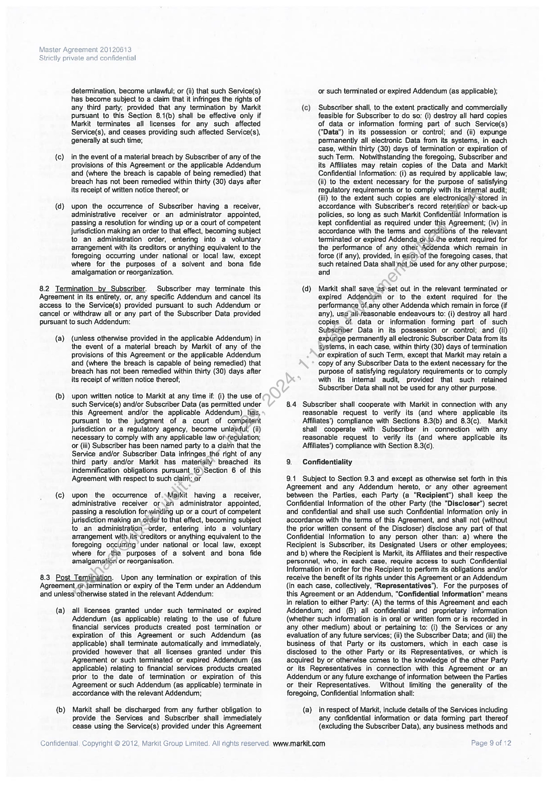
```  
```col-md
Master Agreement 20120613
Strictly private and confidential  
determination, become unlawful; or (ii) that such Service(s)
has become subject to a claim that it infringes the rights of
any third party; provided that any termination by Markit
pursuant to this Section 8.1(b) shall be effective only if
Markit terminates all licenses for any such affected
Service(s), and ceases providing such affected Service(s),
generally at such time;  
(c) in the event of a material breach by Subscriber of any of the
provisions of this Agreement or the applicable Addendum
and (where the breach is capable of being remedied) that
breach has not been remedied within thirty (30) days after
its receipt of written notice thereof; or  
(d} upon the occurrence of Subscriber having a receiver,
administrative receiver or an administrator appointed,
passing a resolution for winding up or a court of competent
jurisdiction making an order to that effect, becoming subject
to an administration order, entering into a voluntary
arrangement with its creditors or anything equivalent to the
foregoing occurring under national or local faw, except
where for the purposes of a solvent and bona fide
amalgamation or reorganization.  
8.2 Termination by Subscriber. Subscriber may terminate this
Agreement in its entirety, or, any specific Addendum and cancel its
access to the Service(s) provided pursuant to such Addendum or
cancel or withdraw all or any part of the Subscriber Data provided
pursuant to such Addendum:  
(a) (unless otherwise provided in the applicable Addendum) in
the event of a material breach by Markit of any of the
provisions of this Agreement or the applicable Addendum
and (where the breach is capable of being remedied) that
breach has not been remedied within thirty (30) days after
its receipt of written notice thereof,  
(b) upon written notice to Markit at any time if (i) the use of
such Service(s) and/or Subscriber Data (as permitted under
this Agreement and/or the applicable Addendum) has,
pursuant to the judgment of a court of competent
Jurisdiction or a regulatory agency, become unlawful; (ii)
necessary to comply with any applicable law ofregulation;
or (iii) Subscriber has been named party to a clairn that the
Service and/or Subscriber Data infringes thé right of any
third party and/or Markit has materially’ breached its
indemnification obligations pursuant_to)Section 6 of this
Agreement with respect to such claim; or  
(c) upon the occurrence of.\Maikit having a receiver,
administrative receiver or\ari administrator appointed,
passing a resolution forwinding up or a court of competent
jurisdiction making an order to that effect, becoming subject
to an administration order, entering into a voluntary
arrangement with iis*creditors or anything equivalent to the
foregoing occurring under national or local law, except
where for the purposes of a solvent and bona fide
amalgamation or reorganisation.  
8.3 Post Termination. Upon any termination or expiration of this
Agreement ot termination or expiry of the Term under an Addendum
and unless otherwise stated in the relevant Addendum:  
(a) all licenses granted under such terminated or expired
Addendum (as applicable) relating to the use of future
financial services products created post termination or
expiration of this Agreement or such Addendum (as
applicable) shall terminate automatically and immediately,
provided however that all licenses granted under this
Agreement or such terminated or expired Addendum (as
applicable) relating to financial services products created
prior to the date of termination or expiration of this
Agreement or such Addendum (as applicable) terminate in
accordance with the relevant Addendum;  
(b) Markit shal! be discharged from any further obligation to
provide the Services and Subscriber shall immediately
cease using the Service(s) provided under this Agreement  
Confidential. Copyright © 2012, Markit Group Limited. All rights reserved. www.markit.com  
or such terminated or expired Addendum (as applicable);  
(c) Subscriber shall, to the extent practically and commercially
feasible for Subscriber to do so: (i) destroy all hard copies
of data or information forming part of such Service(s)
("Data") in its possession or control; and (ii) expunge
permanently all electronic Data from its systems, in each
case, within thirty (30) days of termination or expiration of
such Term. Notwithstanding the foregoing, Subscriber and
its Affiliates may retain copies of the Data and Markit
Confidential Information: (i) as required by applicable law;
(ii) to the extent necessary for the purpose of satisfying
regulatory requirements or to comply with its internal audit;
(iii) to the extent such copies are electronically-stored in
accordance with Subscriber's record retention or back-up
policies, so long as such Markit Confidential Information is
kept confidential as required under this Agreement; (iv) in
accordance with the terms and conditions of the relevant
terminated or expired Addenda _orto-the extent required for
the performance of any other Addenda which remain in
force (if any), provided, in each-of the foregoing cases, that
such retained Data shall‘nat_be used for any other purpose;
and  
(d) Markit shalt save as*set out in the relevant terminated or
expired Addendum or to the extent required for the
performance of.any other Addenda which remain in force (if
any), us¢ allreasonable endeavours to: (i) destroy all hard
copies of data or information forming part of such
Subscriber Data in its possession or control; and (ii)
expunge permanently all electronic Subscriber Data from its
systems, in each case, within thirty (30) days of termination
or expiration of such Term, except that Markit may retain a
copy of any Subscriber Data to the extent necessary for the
purpose of satisfying regulatory requirements or to comply
with its intemal audit, provided that such retained
Subscriber Data shall not be used for any other purpose.  
8.4 Subscriber shall cooperate with Markit in connection with any
reasonable request to verify its (and where applicable its
Affiliates’) compliance with Sections 8.3(b) and 8.3(c). Markit
shall cooperate with Subscriber in connection with any
reasonable request to verify its (and where applicable its
Affiliates’) compliance with Section 8.3(d).  
9. Confidentiality  
9.1 Subject to Section 9.3 and except as otherwise set forth in this
Agreement and any Addendum hereto, or any other agreement
between the Parties, each Party (a "Recipient") shall keep the
Confidential Information of the other Party (the "Discloser") secret
and confidential and shall use such Confidential Information only in
accordance with the terms of this Agreement, and shall not (without
the prior written consent of the Discloser) disclose any part of that
Confidential Information to any person other than: a) where the
Recipient is Subscriber, its Designated Users or other employees;
and b) where the Recipient is Markit, its Affiliates and their respective
personnel, who, in each case, require access to such Confidential
Information in order for the Recipient to perform its obligations and/or
receive the benefit of its rights under this Agreement or an Addendum
(in each case, collectively, “Representatives”). For the purposes of
this Agreement or an Addendum, "Confidential Information" means
in relation to either Party: (A) the terms of this Agreement and each
Addendum; and (B) all confidential and proprietary information
(whether such information is in oral or written form or is recorded in
any other medium) about or pertaining to: (i) the Services or any
evaluation of any future services; (ii) the Subscriber Data; and (iii) the
business of that Party or its customers, which in each case is
disclosed to the other Party or its Representatives, or which is
acquired by or otherwise comes to the knowledge of the other Party
or its Representatives in connection with this Agreement or an
Addendum or any future exchange of information between the Parties
or their Representatives. Without limiting the generality of the
foregoing, Confidential Information shall:  
{a) in respect of Markit, include details of the Services including
any confidential information or data forming part thereof
(excluding the Subscriber Data), any business methods and  
Page 9 of 12  
```
````
Notes:    
````col
```col-md
flexGrow=.5
===
> [!info] [Page 10](_attachments/images_MS-Parent-3.6.1.19.1.1MorganStanley-MA2013-countersigned.pdf_212238/page_10.png)
> 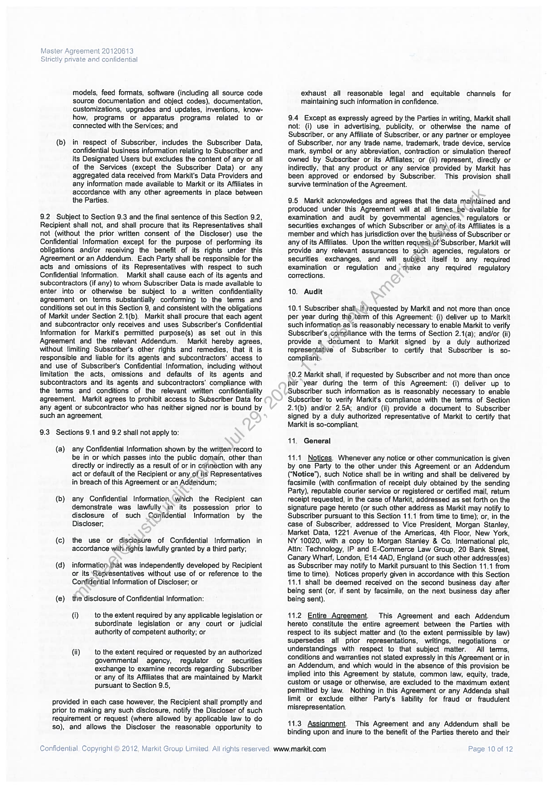
```  
```col-md
Master Agreement 20120613
Strictly private and confidential  
models, feed formats, software (including all source code
source documentation and object codes), documentation,
customizations, upgrades and updates, inventions, knowhow, programs or apparatus programs related to or
connected with the Services; and  
(b) in respect of Subscriber, includes the Subscriber Data,
confidential business information relating to Subscriber and
its Designated Users but excludes the content of any or all
of the Services (except the Subscriber Data) or any
aggregated data received from Markit's Data Providers and
any information made available to Markit or its Affiliates in
accordance with any other agreements in place between
the Parties.  
9.2 Subject to Section 9.3 and the final sentence of this Section 9.2,
Recipient shall not, and shall procure that its Representatives shall
not (without the prior written consent of the Discloser) use the
Confidential Information except for the purpose of performing its
obligations and/or receiving the benefit of its rights under this
Agreement or an Addendum. Each Party shall be responsible for the
acts and omissions of its Representatives with respect to such
Confidential Information. Markit shall cause each of its agents and
subcontractors (if any) to whom Subscriber Data is made available to
enter into or otherwise be subject to a written confidentiality
agreement on terms substantially conforming to the terms and
conditions set out in this Section 9, and consistent with the obligations
of Markit under Section 2.1(b). Markit shall procure that each agent
and subcontractor only receives and uses Subscriber's Confidential
Information for Markit's permitted purpose(s) as set out in this
Agreement and the relevant Addendum. Markit hereby agrees,
without limiting Subscriber's other rights and remedies, that it is
responsible and liable for its agents and subcontractors’ access to
and use of Subscriber's Confidential Information, including without
limitation the acts, omissions and defaults of its agents and
subcontractors and its agents and subcontractors’ compliance with
the terms and conditions of the relevant written confidentiality
agreement. Markit agrees to prohibit access to Subscriber Data for
any agent or subcontractor who has neither signed nor is bound by
such an agreement.  
9.3. Sections 9.1 and 9.2 shall not apply to:  
(a) any Confidential Information shown by the written record to
be in or which passes into the public domain, other than
directly or indirectly as a result of or in connection with any
act or default of the Recipient or any of its Representatives
in breach of this Agreement or an Addendum;  
(b) any Confidential Information which the Recipient can
demonstrate was lawfully\in’ its possession prior to
disclosure of such Confidential Information by the
Discloser,  
(c) the use or disclosure of Confidential Information in
accordance with-rights lawfully granted by a third party;  
(d)  information.that was independently developed by Recipient
or its ‘Representatives without use of or reference to the
Confidential Information of Discloser; or  
(e) the disclosure of Confidential Information:  
(i) to the extent required by any applicable legislation or
subordinate legislation or any court or judicial
authority of competent authority; or  
(ii) to the extent required or requested by an authorized
govemmental agency, regulator or securities
exchange to examine records regarding Subscriber
or any of its Affiliates that are maintained by Markit
pursuant to Section 9.5,  
provided in each case however, the Recipient shall promptly and
prior to making any such disclosure, notify the Discloser of such
requirement or request (where allowed by applicable law to do
so), and allows the Discloser the reasonable opportunity to  
Confidential. Copyright © 2012, Markit Group Limited. All rights reserved. www.markit.com  
exhaust all reasonable legal and equitable channels for
maintaining such information in confidence.  
9.4 Except as expressly agreed by the Parties in writing, Markit shall
not: (i) use in advertising, publicity, or otherwise the name of
Subscriber, or any Affiliate of Subscriber, or any partner or employee
of Subscriber, nor any trade name, trademark, trade device, service
mark, symbol or any abbreviation, contraction or simulation thereof
owned by Subscriber or its Affiliates; or (ii) represent, directly or
indirectly, that any product or any service provided by Markit has
been approved or endorsed by Subscriber. This provision shall
survive termination of the Agreement.  
9.5 Markit acknowedges and agrees that the data maintained and
produced under this Agreement will at all times _be-available for
examination and audit by govemmental agencies, regulators or
securities exchanges of which Subscriber or any\of its Affiliates is a
member and which has jurisdiction over the business of Subscriber or
any of its Affiliates. Upon the written request.of Subscriber, Markit will
provide any relevant assurances to such agencies, regulators or
securities exchanges, and will subject itself to any required
examination or regulation and make any required regulatory
corrections.  
10. Audit  
10.1 Subscriber shalhif,tequested by Markit and not more than once
per year during the term of this Agreement: (i) deliver up to Markit
such information.as is reasonably necessary to enable Markit to verify
Subscriber's compliance with the terms of Section 2.1(a); and/or (ii)
provide a ‘document to Markit signed by a duly authorized
representative of Subscriber to certify that Subscriber is socompliant:  
10.2 Markit shall, if requested by Subscriber and not more than once
pér year during the term of this Agreement: (i) deliver up to
Subscriber such information as is reasonably necessary to enable
Subscriber to verify Markit's compliance with the terms of Section
2.1(b) and/or 2.54; and/or (ii) provide a document to Subscriber
signed by a duly authorized representative of Markit to certify that
Markit is so-compliant.  
11. General  
11.1 Notices. Whenever any notice or other communication is given
by one Party to the other under this Agreement or an Addendum
(“Notice”), such Notice shall be in writing and shal! be delivered by
facsimile (with confirmation of receipt duly obtained by the sending
Party), reputable courier service or registered or certified mail, retum
receipt requested, in the case of Markit, addressed as set forth on the
signature page hereto (or such other address as Markit may notify to
Subscriber pursuant to this Section 11.1 from time to time); or, in the
case of Subscriber, addressed to Vice President, Morgan Stanley,
Market Data, 1221 Avenue of the Americas, 4th Floor, New York,
NY 10020, with a copy to Morgan Stanley & Co. Intemational plc,
Attn: Technology, IP and E-Commerce Law Group, 20 Bank Street,
Canary Wharf, London, E14 4AD, England (or such other address(es)
as Subscriber may notify to Markit pursuant to this Section 11.1 from
time to time). Notices properly given in accordance with this Section
11.1 shall be deemed received on the second business day after
being sent (or, if sent by facsimile, on the next business day after
being sent).  
11.2 Entire Agreement. This Agreement and each Addendum
hereto constitute the entire agreement between the Parties with
respect to its subject matter and (to the extent permissible by law)
supersedes ail prior representations, writings, negotiations or
understandings with respect to that subject matter. All terms,
conditions and warranties not stated expressly in this Agreement or in
an Addendum, and which would in the absence of this provision be
implied into this Agreement by statute, common law, equity, trade,
custom or usage or otherwise, are excluded to the maximum extent
permitted by law. Nothing in this Agreement or any Addenda shall
limit or exclude either Party's liability for fraud or fraudulent
misrepresentation.  
11.3 Assignment This Agreement and any Addendum shall be
binding upon and inure to the benefit of the Parties thereto and their  
Page 10 of 12  
```
````
Notes:    
````col
```col-md
flexGrow=.5
===
> [!info] [Page 11](_attachments/images_MS-Parent-3.6.1.19.1.1MorganStanley-MA2013-countersigned.pdf_212238/page_11.png)
> 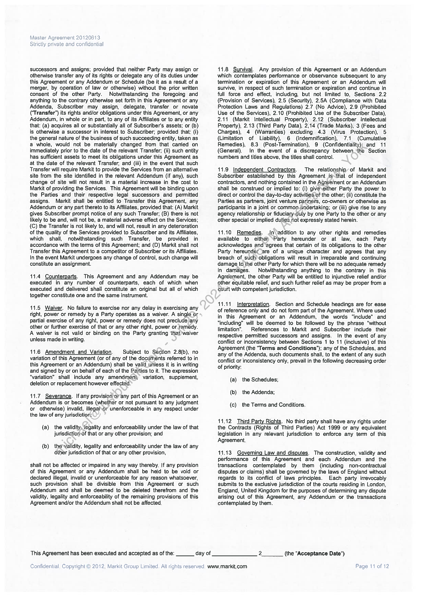
```  
```col-md
Master Agreement 20120613
Strictly private and confidential  
successors and assigns; provided that neither Party may assign or
otherwise transfer any of its rights or delegate any of its duties under
this Agreement or any Addendum or Schedule (be it as a result of a
merger, by operation of law or otherwise) without the prior written
consent of the other Party. Notwithstanding the foregoing and
anything to the contrary otherwise set forth in this Agreement or any
Addenda, Subscriber may assign, delegate, transfer or novate
(‘Transfer’) its rights and/or obligations under this Agreement, or any
Addendum, in whole or in part, to any of its Affiliates or to any entity
that: (a) acquires all or substantially all of Subscriber's assets; or (b)
is otherwise a successor in interest to Subscriber; provided that: (i)
the general nature of the business of such succeeding entity, taken as
a whole, would not be materially changed from that cared on
immediately prior to the date of the relevant Transfer; (ii) such entity
has sufficient assets to meet its obligations under this Agreement as
at the date of the relevant Transfer, and (iii) in the event that such
Transfer will require Markit to provide the Services from an altemative
site from the site identified in the relevant Addendum (if any), such
change of site will not result in a material increase in the cost to
Markit of providing the Services. This Agreement will be binding upon
the Parties and their respective legal successors and permitted
assigns. Markit shall be entitled to Transfer this Agreement, any
Addendum or any part thereto to its Affiliates, provided that: (A) Markit
gives Subscriber prompt notice of any such Transfer; (B) there is not
likely to be and, will not be, a material adverse effect on the Services;
(C) the Transfer is not likely to, and will not, result in any deterioration
of the quality of the Services provided to Subscriber and its Affiliates,
which shall, notwithstanding such Transfer, be provided in
accordance with the terms of this Agreement; and (D) Markit shall not
Transfer this Agreement to a competitor of Subscriber or its Affiliates.
In the event Markit undergoes any change of control, such change will
constitute an assignment.  
11.4 Counterparts. This Agreement and any Addendum may be
executed in any number of counterparts, each of which when
executed and delivered shall constitute an original but all of which
together constitute one and the same instrument.  
11.5 Waiver. No failure to exercise nor any delay in exercising any
right, power or remedy by a Party operates as a waiver. A singlé or
partial exercise of any right, power or remedy does not preclude any
other or further exercise of that or any other right, power or.femedy.
A waiver is not valid or binding on the Party granting that)waiver
unless made in writing.  
11.6 Amendment and Variation. Subject to Section 2.8(b), no
variation of this Agreement (or of any of the documents referred to in
this Agreement or an Addendum) shall be valid_unless it is in writing
and signed by or on behalf of each of the Parties to it. The expression
“variation” shall include any amendment; variation, supplement,
deletion or replacement however effected.  
11.7 Severance. If any provision or any part of this Agreement or an
Addendum is or becomes (whether or not pursuant to any judgment
or otherwise) invalid, illegal\or unenforceable in any respect under
the law of any jurisdiction:  
(a) the validity, legality and enforceability under the law of that
jurisdictior-of that or any other provision; and  
(b) thevalidity, legality and enforceability under the law of any
other jurisdiction of that or any other provision,  
shall not be affected or impaired in any way thereby. If any provision
of this Agreement or any Addendum shall be held to be void or
declared illegal, invalid or unenforceable for any reason whatsoever,
such provision shall be divisible from this Agreement or such
Addendum and shall be deemed to be deleted therefrom and the
validity, legality and enforceability of the remaining provisions of this
Agreement and/or the Addendum shall not be affected  
This Agreement has been executed and accepted as of the:  
Confidential. Copyright © 2012, Markit Group Limited. All rights reserved. www.markit.com  
day of  
11.8 Survival. Any provision of this Agreement or an Addendum
which contemplates performance or observance subsequent to any
termination or expiration of this Agreement or an Addendum will
survive, in respect of such termination or expiration and continue in
full force and effect, including, but not limited to, Sections 2.2
(Provision of Services), 2.5 (Security), 2.5A (Compliance with Data
Protection Laws and Regulations) 2.7 (No Advice), 2.9 (Prohibited
Use of the Services), 2.10 (Prohibited Use of the Subscriber Data),
2.11 (Markit Intellectual Property), 2.12 (Subscriber intellectual
Property), 2.13 (Third Party Data), 2,14 (Trade Marks), 3 (Fees and
Charges), 4 (Warranties) excluding 4.3 (Virus Protection), 5
(Limitation of Liability), 6 (Indemnification), 7.1 (Cumulative
Remedies), 8.3 (Post-Termination), 9 (Confidentiality)) and 11
(General). In the event of a discrepancy between the Section
numbers and titles above, the titles shall control.  
11.9 Independent Contractors. The relationship’ of Markit and
Subscriber established by this Agreement is-that of independent
contractors, and nothing contained in the Agreement or an Addendum
shall be construed or implied to: (i) giveveither Party the power to
direct or control the day-to-day activities of the other; (ii) constitute the
Parties as partners, joint venture partners, co-owners or otherwise as
participants in a joint or common.undertaking; or (iii) give rise to any
agency relationship or fiduciany.duiy by one Party to the other or any
other special or implied duties not expressly stated herein.  
11.10 Remedies. Jn addition to any other rights and remedies
available to eithen ‘Party hereunder or at law, each Party
acknowledges and agrees that certain of its obligations to the other
Party hereunder are of a unique character and agrees that any
breach of such) obligations will result in irreparable and continuing
damage to the other Party for which there will be no adequate remedy
in damages. Notwithstanding anything to the contrary in this
Agreement, the other Party will be entitled to injunctive relief and/or
other equitable relief, and such further relief as may be proper from a
court with competent jurisdiction.  
11.11 Interpretation. Section and Schedule headings are for ease
of reference only and do not form part of the Agreement. Where used
in this Agreement or an Addendum, the words “include” and
“including” will be deemed to be followed by the phrase "without
limitation’. References to Markit and Subscriber include their
respective permitted successors and assigns. In the event of any
conflict or inconsistency between Sections 1 to 11 (inclusive) of this
Agreement (the “Terms and Conditions"); any of the Schedules, and
any of the Addenda, such documents shall, to the extent of any such
conflict or inconsistency only, prevail in the following decreasing order
of priority:  
(a) the Schedules;
(b) the Addenda;  
(c) the Terms and Conditions,  
11.12 Third Party Rights. No third party shall have any rights under
the Contracts (Rights of Third Parties) Act 1999 or any equivalent
legislation in any relevant jurisdiction to enforce any term of this
Agreement.  
11.13 Governing Law and disputes. The construction, validity and
performance of this Agreement and each Addendum and the
transactions contemplated by them (including non-contractual
disputes or claims) shall be governed by the laws of England without
regards to its conflict of laws principles. Each party irrevocably
submits to the exclusive jurisdiction of the courts residing in London,
England, United Kingdom for the purposes of determining any dispute
arising out of this Agreement, any Addendum or the transactions
contemplated by them.  
2 (the “Acceptance Date")  
Page 11 of 12  
```
````
Notes:    
````col
```col-md
flexGrow=.5
===
> [!info] [Page 12](_attachments/images_MS-Parent-3.6.1.19.1.1MorganStanley-MA2013-countersigned.pdf_212238/page_12.png)
> 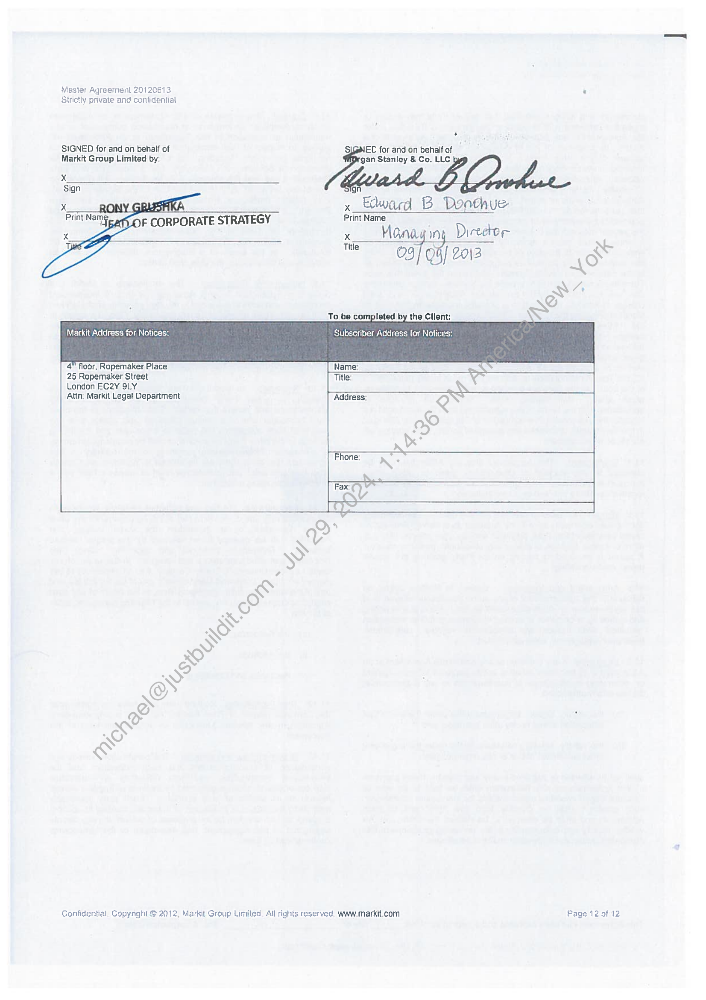
```  
```col-md
Master Agreement 20120613 .
Stnctly private and confidential  
SIGNED for and on behalf of S\GNED for and on behalfof
Markit Group Limited by:  
‘gan Stanley & Co, LLC  
ig  
x_ Edward B Doathue  
Print Name  
x Wanay ing Director
Title 03/cn} 20\ 3 Rm X  
To be completed by the Client:
Markit Address for, Notices: Subscriber Address for Notices:  
4" floor, Ropemaker Place
25 Ropemaker Street
London EC2Y SLY  
Attn: Markit Legat Department Address:  
Confidential. Copynght © 2012, Markit Group Limited. Atl rights reserved. www.markit.com Page 12 of 12  
```
````
Notes:  


![[_attachments/MS-Parent-3.6.1.19.1.1 Morgan Stanley - MA 2013 - countersigned.pdf]