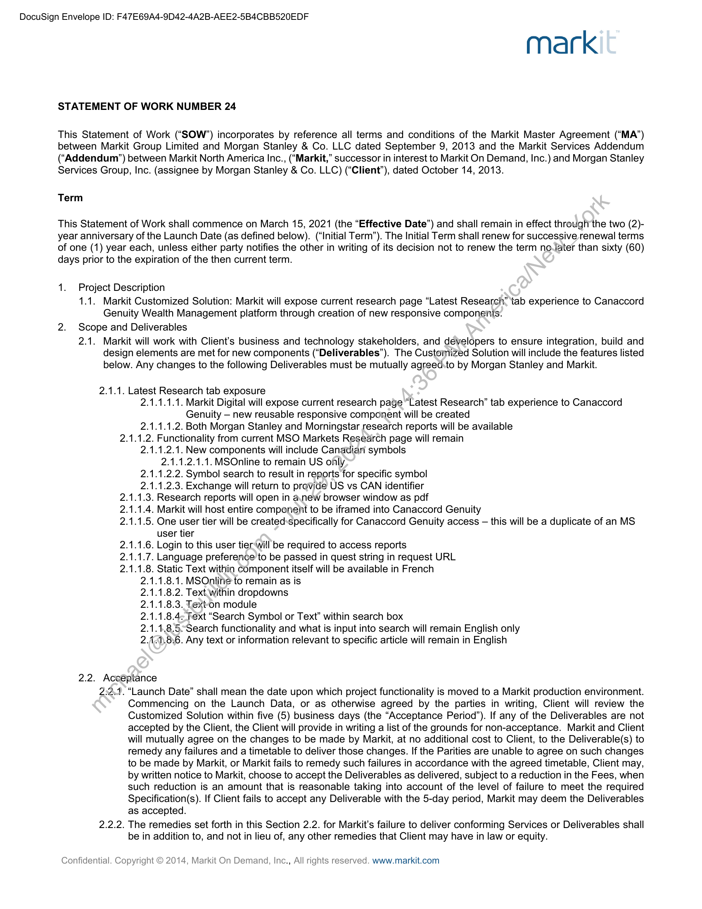
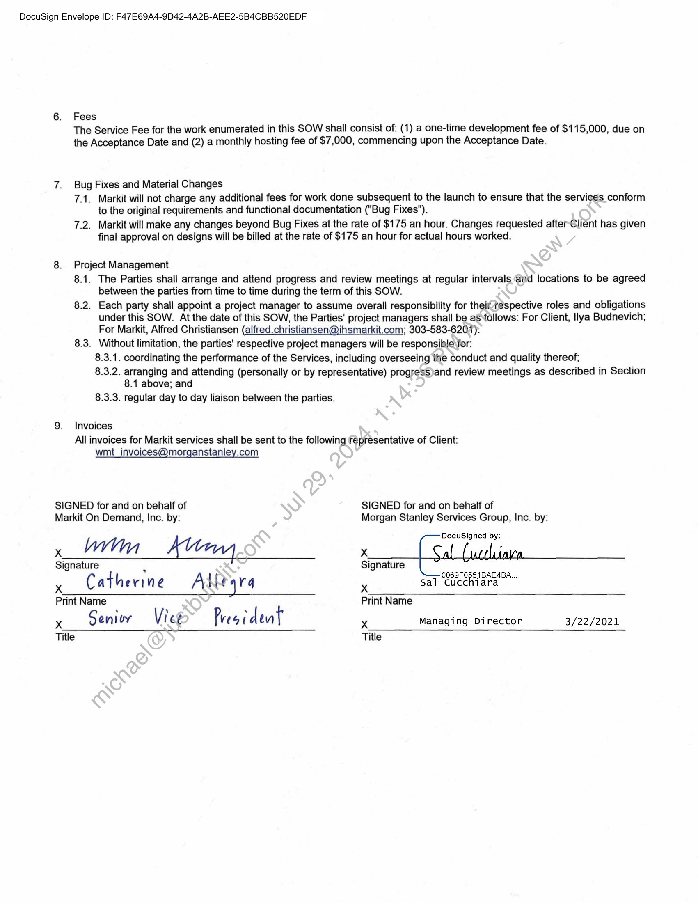

##### Statement of Work for Customized Solution - Canaccord Genuity Wealth Management Platform]

  
````col
```col-md
flexGrow=.5
===
> [!info] [Page 1](_attachments/images_MS-Parent-3.6.1.19.1.200186768.pdf_212153/page_1.png)
> 
```  
```col-md
DocuSign Envelope ID: F47E69A4-9D42-4A2B-AEE2-5B4CBB520EDF  
mark  
STATEMENT OF WORK NUMBER 24  
This Statement of Work (“SOW”) incorporates by reference all terms and conditions of the Markit Master Agreement (“MA”)
between Markit Group Limited and Morgan Stanley & Co. LLC dated September 9, 2013 and the Markit Services Addendum
(‘Addendum’) between Markit North America Inc., (“Markit,” successor in interest to Markit On Demand, Inc.) and Morgan Stanley
Services Group, Inc. (assignee by Morgan Stanley & Co. LLC) (“Client”), dated October 14, 2013.  
Term  
This Statement of Work shall commence on March 15, 2021 (the “Effective Date”) and shall remain in effect through the two (2)year anniversary of the Launch Date (as defined below). (“Initial Term”). The Initial Term shall renew for successive renewal terms
of one (1) year each, unless either party notifies the other in writing of its decision not to renew the term noJater than sixty (60)
days prior to the expiration of the then current term.  
1. Project Description
1.1. Markit Customized Solution: Markit will expose current research page “Latest Research” tab experience to Canaccord
Genuity Wealth Management platform through creation of new responsive components.
2. Scope and Deliverables
2.1. Markit will work with Client's business and technology stakeholders, and developers to ensure integration, build and
design elements are met for new components (“Deliverables”). The Customized Solution will include the features listed
below. Any changes to the following Deliverables must be mutually agreedsto by Morgan Stanley and Markit.  
2.1.1.  
Latest Research tab exposure
2.1.1.1.1. Markit Digital will expose current research page “Latest Research” tab experience to Canaccord
Genuity — new reusable responsive component will be created
2.1.1.1.2. Both Morgan Stanley and Morningstar research reports will be available  
2.1.1.2. Functionality from current MSO Markets Research page will remain  
2.1.1.2.1. New components will include Canadiari symbols
2.1.1.2.1.1. MSOnline to remain US ofly.  
2.1.1.2.2. Symbol search to result in reports for specific symbol
2.1.1.2.3. Exchange will return to provide US vs CAN identifier
2.1.1.3. Research reports will open in anew browser window as pdf
2.1.1.4. Markit will host entire component to be iframed into Canaccord Genuity
2.1.1.5. One user tier will be created:specifically for Canaccord Genuity access — this will be a duplicate of an MS
user tier
2.1.1.6. Login to this user tier‘will be required to access reports
2.1.1.7. Language preference to be passed in quest string in request URL
2.1.1.8. Static Text within component itself will be available in French  
2.1.1.8.1. MSOnline to remain as is  
2.1.1.8.2. Text.within dropdowns  
2.1.1.8.3. Texton module  
2.1.1.8.42 Text “Search Symbol or Text” within search box  
2.1.1.8.5.Search functionality and what is input into search will remain English only
2./-1).8:6. Any text or information relevant to specific article will remain in English  
2.2. Aceéptance  
2:29.  
2.2.2.  
“Launch Date” shall mean the date upon which project functionality is moved to a Markit production environment.
Commencing on the Launch Data, or as otherwise agreed by the parties in writing, Client will review the
Customized Solution within five (5) business days (the “Acceptance Period”). If any of the Deliverables are not
accepted by the Client, the Client will provide in writing a list of the grounds for non-acceptance. Markit and Client
will mutually agree on the changes to be made by Markit, at no additional cost to Client, to the Deliverable(s) to
remedy any failures and a timetable to deliver those changes. If the Parities are unable to agree on such changes
to be made by Markit, or Markit fails to remedy such failures in accordance with the agreed timetable, Client may,
by written notice to Markit, choose to accept the Deliverables as delivered, subject to a reduction in the Fees, when
such reduction is an amount that is reasonable taking into account of the level of failure to meet the required
Specification(s). If Client fails to accept any Deliverable with the 5-day period, Markit may deem the Deliverables
as accepted.  
The remedies set forth in this Section 2.2. for Markit’s failure to deliver conforming Services or Deliverables shall
be in addition to, and not in lieu of, any other remedies that Client may have in law or equity.  
Confidential. Copyright © 2014, Markit On Demand, Inc., All rights reserved. www.markit.com  
```
````
Notes:    
````col
```col-md
flexGrow=.5
===
> [!info] [Page 2](_attachments/images_MS-Parent-3.6.1.19.1.200186768.pdf_212153/page_2.png)
> 
```  
```col-md
DocuSign Envelope ID: F47E69A4-9D42-4A2B-AEE2-5B4CBB520EDF  
2.2.3. Notwithstanding the remainder of this section, Client’s right to accept the Customized Solution is applicable solely
to completion of listed project milestones and overall completion of development services. Hosting services are
not subject to Client’s acceptance. Client agrees that the usage of hosting services by Client constitutes
acceptance of the hosting services.  
2.3. Assumptions
2.3.1. Technology and QA Assumptions
2.3.1.1. Assumes 1,000 visitors per month
2.3.1.2. Markit Digital will have access to Canaccord Genuity integrated QA environments
2.3.1.3. This module will live behind login for 1 user tier
2.3.1.4. Morgan Stanley will need to provide specific Morgan Stanley user group to duplicate user tier entitlements
2.3.1.5. Canaccord Genuity and Morgan Stanley will be available to coordinate authentication necessary
2.3.1.6. This excludes all three right rail panel modules:
2.3.1.6.1. Global Investment Committee
2.3.1.6.2. What others are reading
2.3.1.6.3. Recent changes
2.3.1.7. Authentication will be based on existing SAML and OAuth methods
2.3.1.8. Browser support for Edge, IE11, Chrome, Firefox, Safari
2.3.1.9. Morgan Stanley will approve French translation language to be used on module prior to work beginning
2.3.1.10. Morgan Stanley will provide pilot users in QA and Production in order for Markit to test new features.
These users will be established by sprint 1.  
2.3.2. Design Assumptions
2.3.2.1. The design Ul for Canadian vs US symbols is to be reviewed and agreed upon by both Markit and Client to
ensure complexity does not impact timeline.  
3. Governance
The Services will be delivered via the agile methodolagy, in accordance with which deliverables for any given 2-week work
period (a “Sprint”) will be defined and mutually agréedin writing by Client and Markit, and documented within the software
application used by Markit at the beginning of each Sprint.  
4. Schedule
The project as described in Sections 1 and 2 above is expected to require six (6) sprints; work will begin during sprint kick off
of March 17 and Markit estimates the delivery dates to be 12 weeks later. The below table outlines dependencies and
deliverables required for Markit to meet the estimated timeline. The dependencies require effort on the Client’s side and if
they are not fulfilled timelines may be at risk. The parties acknowledge and agree that the project scope may need to be
mutually redefined by the parties in writing from time to time based on the progress of the Sprints.  
Dependencie ated ated Delive Accepta
Deliverable Delivery Date Date
March 17, 2021 Please refer to acceptance
Gosh tales At kick off criteria listed in Section 2.2
April 14, 2021 Please refer to acceptance2 sprints after criteria listed in Section 2.2
Integration .
kick off
June 9, 2021 Please refer to acceptance
6 sprints after criteria listed in Section 2.2
Launch Date kick off  
5. Content
Client will be responsible for licensing all data, content, and fonts required for this project. Markit can recommend and make
introductions to appropriate providers, but Client will be responsible for all agreements with and payments to such providers.  
```
````
Notes:    
````col
```col-md
flexGrow=.5
===
> [!info] [Page 3](_attachments/images_MS-Parent-3.6.1.19.1.200186768.pdf_212153/page_3.png)
> 
```  
```col-md
DocuSign En  
elope ID: F47E69A4-9D42-4A2B-AEE2-5B4CBB520EDF  
6. Fees
The Service Fee for the work enumerated in this SOW shall consist of: (1) a one-time development fee of $115,000, due on
the Acceptance Date and (2) a monthly hosting fee of $7,000, commencing upon the Acceptance Date.
7. Bug Fixes and Material Changes
7.1. Markit will not charge any additional fees for work done subsequent to the launch to ensure that the services conform
to the original requirements and functional documentation ("Bug Fixes").
7.2. Markit will make any changes beyond Bug Fixes at the rate of $175 an hour. Changes requested after-Client has given
final approval on designs will be billed at the rate of $175 an hour for actual hours worked.
8. Project Management
8.1. The Parties shall arrange and attend progress and review meetings at regular intervals and locations to be agreed
between the parties from time to time during the term of this SOW.
8.2. Each party shall appoint a project manager to assume overall responsibility for theittespective roles and obligations
under this SOW. At the date of this SOW, the Parties’ project managers shall be aS follows: For Client, Ilya Budnevich;
For Markit, Alfred Christiansen (alfred.christiansen@ihsmarkit.com; 303-583-6207).
8.3. Without limitation, the parties' respective project managers will be responsible for:
8.3.1. coordinating the performance of the Services, including overseeing the conduct and quality thereof;
8.3.2. arranging and attending (personally or by representative) progress)and review meetings as described in Section
8.1 above; and
8.3.3. regular day to day liaison between the parties.
9. Invoices
All invoices for Markit services shall be sent to the following representative of Client:
wmt_invoices@morganstanley.com
SIGNED for and on behalf of SIGNED for and on behalf of
Markit On Demand, Inc. by: Morgan Stanley Services Group, Inc. by:
DocuSigned by:
x Wn Kay x CA (aetlaya
Signature : Signature
O069F0551BAE4BA.
x Catherine Allegra x Sal Cucchiara
Print Name Print Name
‘ 1 .
x Senivv Vice President xX Managing Director 3/22/2021
Title Title  
```
````
Notes:    
````col
```col-md
flexGrow=.5
===
> [!info] [Page 4](_attachments/images_MS-Parent-3.6.1.19.1.200186768.pdf_212153/page_4.png)
> 
```  
```col-md
DocuSign Envelope ID: F47E69A4-9D42-4A2B-AEE2-5B4CBB520EDF  
mark  
INFORMATION SHEET  
Contract Information  
Contact Details for return of countersigned hardcopy contract to the client
Company Name  
Contact Name  
Contact Number  
Email address  
Note: A signed original contract will be returned to the client if at least two signed hardcopies of the contract are provided to
Markit Finance. If only one original or an electronic original is returned to Markit then the client will be emailed an electronic
countersigned contract.  
Please print, sign and return contract in duplicate to Markit Finance at:
Markit On Demand  
5718 Central Avenue  
Boulder, CO 80301  
Attention: Finance Department  
Service Delivery Information  
VAT Registration Number (If applicable)  
Special Instructions  
(e.g. Internal Client Invoicing Reference Number etc)  
Please list IP addresses of Client office locations (one IP address per location) from which you wish Services to be accessed by
Designated Users. For your convenience,.this information is normally obtained from your technology department.  
Markit Internal Use Only:  
i Yes
ce *y Rate By Beate No
[ ] Fedex
Returned to client Date By Delivery [ ] Post
[ ] Email  
Confidential. Copyright © 2014, Markit On Demand, Inc., All rights reserved. www.markit.com  
```
````
Notes:  


![[_attachments/MS-Parent-3.6.1.19.1.2 00186768.pdf]