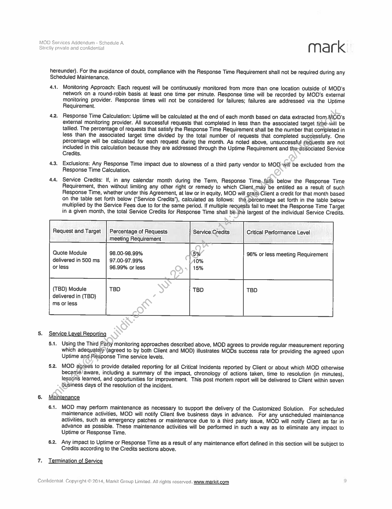

##### Statement of Work Number 4 - MOD Customized Solution for Morgan Stanley's Client Portal]

  
````col
```col-md
flexGrow=.5
===
> [!info] [Page 1](_attachments/images_MS-Parent-3.6.1.19.1.300183623.pdf_212752/page_1.png)
> 
```  
```col-md
MOD, Inc. - MOD Services Addendum mark  
STATEMENT OF WORK NUMBER 4  
This Statement of Work ("SOW") incorporates by reference all terms and conditions of the MOD Services Addendum
(‘Addendum’) between Markit On Demand, Inc. ("MOD") and Morgan Stanley & Co. LLC (‘Client’), dated October 14, 2013.  
Term  
This Statement of Work shall be deemed to be effective from July 15, 2014 (the “Effective Date’) and will and remain inetfect
for two years following the Launch Date (as defined below, the “Initial Term"). The Initial Term shall renew for-successive
renewal terms of one (1) year each, unless either party notifies the other in writing of its decision not to extend the, term no later
than ninety (90) days prior to the expiration of the term then in effect.  
1.  
Project Description
1.1. MOD Customized Solution: MOD will develop and host a series of market data-related components and tools for  
implementation in Morgan Stanley's client portal, MS Online (MSO), and MS Mobile~tablet application (the
“Customized Solution’).  
2. Scope and Deliverables  
2.1. MOD will work with Client's business and technology stakeholders and develdpers to create a series of components,
integrate the components into MSO and provide ongoing hosting for ‘the ‘components (“Deliverables”). The
Customized Solution will include the following features (such features may be modified by the parties from time to
time upon mutuat written agreement):  
2.1.1. General Requirements
2.1.1.1. Integration of the components/pages into the MSO portal, including authentication and entitlement
definition through a single sign-on process.
2.1.1.2, Components will be developed based on the/designs created through the MSO design engagement that
will match the branding guidelines\\for Client. These designs can be referenced at
http://www. protos. wallst.com/morganstanley/MSO/pha oVisuals.asp.  
2.1.1.3. Selected third party content, covered i Section B will be integrated and delivered into the components.  
2.1.1.3,1. Within the agreed datasets/ MOD will work with Client and the associated third parties (e.g.
Thomson Reuters, Momingstar) to identify specific data elements to be used.  
2.1.1.4, Integration with Client symbology for equities, indices, FOREX, mutual funds and ETFs. Integration with
Client symbology for fixed income will be determined.  
2.1.1.5. Provide quote counting services for Client that include counting and summation of real-time quote usage
by user for each relévant exchange (NYSE, NYSE MKT, NASDAQ, OPRA). MOD will provide report
aggregating usage_by Client provided user identification allowing Client to aggregate with other quote
usage and determine professional versus non-professional usage.  
2.1.2, Markets & news: Provide an overview of markets through components covering:
2.1.2.1, Global indices and market statistics (e.g. actives, gainers, losers)
2.1.2.2. Market.news and commentary
2.1.2.3. Foreign exchange and commodity details
2.1.2.4.Market events such as earnings announcements, economic events and corporate actions.
2.1.3. Research:
2:1:2.1, Provide a listing of current research reports from Morgan Stanley's equity and FICC analysts as well as
other third parties (e.g. Standard & Poor's).  
2.1.3.2. Search for research reports matching criteria such as provider, analyst, sector, report type as well as free
text search capability.  
2.1.3.3. Research to include ratings and price targets and daily updates  
2.1.3.4, MOD to work with Client to integrate proprietary data feed to surface or restrict applicable research content
to users based upon the data received by MOD from Client  
2.2.3.5. Any prior use of data feeds provided to MOD by Morgan Stanley Research shall be discontinued and
only the use contemplated in this SOW is permitted.  
2.1.4. Companies: Provide an overview of a company and its equities through:
2.1.4.1. Real-time and delayed equity quotes
2.1.4.2. Interactive charting
2.1.4.3. Company news and commentary  
Confidential. Copyright © 2014, Markil On Demand, Inc., All rights reserved. www.markit.com  
```
````
Notes:    
````col
```col-md
flexGrow=.5
===
> [!info] [Page 2](_attachments/images_MS-Parent-3.6.1.19.1.300183623.pdf_212752/page_2.png)
> 
```  
```col-md
2.2.  
2.3,  
2.1.4.4. Company profile
2.1.4.5, Equity research and ratings
2.1.4.6, Company fundamentals, financials and filings
2.1.4.7, Related equity options including populating options on trade pages as requested by Client
2.1.5. Funds and ETFs: Provide details on available mutual funds and ETFs including:
2.1.5.1. Fund performance
2.1,5.2. Portfolio composition
2.1.5.3, Risk and Ratings
2.1.5.4, Interactive Charting
2.1.6. Tools: Provide a series of screening tools that allow users to filter investment options covering:
2.1.6.1. Equity screener
2.1.6.2. Fund and ETF screeners
2.1.6.3, Option screener
2.1.6.4. Integration of Client-hosted fixed income screener into the Markets & Research‘manu and pages
2.1.7. Watchlists: Provide users the ability to save selected securities in lists for later retrieval
2.1.7.1. MOD will create and maintain watchlist module on MSO homepage.
2.1.8. Alerts: Provide alert set up and management via a user interface (e.g. Alert Hub}, monitor and trigger the alerts.
and send necessary information to Client for distribution to end users. Alerts include:
2.1.8.1. Market Data Alerts
2.1.8.2. News Alerts
2.1.9. Client internal view
2.1.9.1. MOD will create internat view for use by Client
2.1,9.1.1. Internal view will allow Client to portray avspecific user and access MSO for troubleshooting  
Purposes. Functionality within internal view will be view only, without the ability to add, edit, or
delete data.  
2.1.9.1.1.1. Specific requirements to be provided by Client and agreed to by MOD  
2.1.9.1.1.2. Depending when requirements are provided and Client's prioritization of this functionality,
launch of this functionality may be deferred until after launch of the initial solution  
2.1.9.2, MOD to ensure platiorm functions) properly with Livelook (screen share) and Tealeat (screen capture)  
applications
2.1.10. Receive and adhere to Client-passed criteria and securely maintain content through user session
2.1.10.1. User enabled for real-time or delayed  
2.1.10.2. User is professional.or non-professional
2.1.10.3. User enabled for online trading
2.1.10.4. User holdings_and relative size (ABC — 1 — largest, CDEF ~ 2, etc)
2.1.10.5. User location and barring of certain services based on user details
2.1.11. MOD will work.with Client and adhere to web content accessibility guidelines (WCAG 2.0) to create a version
accessible by a\siandard eReader, such as JAWS, providing a similar experience to users.
2.1,11.1. MOD and Client to determine content that is of highest priority to allow accessibility  
Acceptance  
2.2.1. Upor-receipt of the Deliverables outlined in Section 2.1 above, and execution and completion of Client testing
phase identified in section 3 below, Client will review and determine if Deliverables match the description and
Client's requirements ("Specifications"). Client will provide a written response (e.g. email) within 10 business
days with either acceptance of the Deliverable(s) ("Acceptance") or notice of non-acceptance of the
Detiverable(s).  
2.2.2. If any of the Deliverables are not accepted by the Client, the Client will provide a list of the grounds for nonacceptance in writing. MOD and Client will mutually agree on the changes to be made by MOD, at no additional
cost to Client, to the Deliverable(s) to remedy any failures and a time table to deliver those changes. If the
Parties are unable to agree on such changes to be made by MOD, or MOD fails to remedy such failures in
accordance with the agreed time table, Client may, by written notice to MOD, choose to accept the Deliverable
as delivered subject to a reduction in the Fees, such reduction to be an amount that is reasonable taking into
account of the level of failure to meet the required Specification(s);  
2.2.3. The remedies set forth in this Section 2.2 for MOD’s failure to deliver conforming Services or Detiverables shall
be in addition to, and not in lieu of, any other remedies that Client may have in law or equity.  
Browser Support  
```
````
Notes:    
````col
```col-md
flexGrow=.5
===
> [!info] [Page 3](_attachments/images_MS-Parent-3.6.1.19.1.300183623.pdf_212752/page_3.png)
> 
```  
```col-md
MOD will provide support for the Customized Solution in the following browsers and versions (including any
corresponding mobile versions), and such other browsers or versions that may be mutually agreed upon by the parties
from time to time:  
+ Internet Explorer 9.0+  
-  Windows/Mac Firefox 20+
-  Windows/Mac Safari 5.0+
-  Windows/Mac Chrome 30+  
MOD will support the most recent browser versions as they become available. Legacy versions will be retired in due
course. MOD and Client will periodically review browser and operating system usage statistics and requirements and
mutually agree upon versions to be supported.  
2.4, Assumptions
2.4.1. The start of development is contingent on acceptance of the final designs for the compofents/pages by Client.
2.4.2. Client will provide a list of all licensed data to be included in the Customized Solution-at.the Project kickoff.
2.4.3. MOD will make the Customized Solution available to Client in MOD's 1) integration environment 2) user testing
environment (Acceptance) and 3) live production environment (Production}>—if additional environments are
required, both parties will mutually agree on the appropriate set-up and any\additional costs required.  
2.4.4. As part of the integration, MOD will have access to Client's pre-productionenvironment(s) for integration testing,
troubleshooting and final testing.  
2.4.5. Site will be accessible per WCAG 2.0 guidelines as detailed above)iit Section 2.1.11 to provide accessibility via a
standard eReader allowing for a simitar user experience.  
3. Project Schedule  
The schedule for this project will be mutually agreed upon completion of the Definition Phase. Tentatively, the project
schedule is as follows:  
fraskName YY a ouration pra Finish
Milestone View 145 days? Mon 10/13/14 Fri 5/1/45
i )  
Development (Integration Areas Only} 50 days Mon 10/13/14 Fri 12/19/14
Dev (MOD Only pieces - in sprints) 100 days? Mon 10/13/14 Fri 2/27/15
Fri  
Dev Integration btwn MOD & MS 45 days led 11/19/14 Tue 1/20/15  
QA Agile (incremental Functional Deployments) 39 days ue 1/20/15 Fri 3/13/15
PAT a eas ni 313/15 Thu 4/23/15  
Production Release 1 day? Fri 5/1/15 Fri 5/1/15 .  
The schedule will be reviewed-after each major deliverable and amended as needed through mutual agreement between
MOD and Client.  
4. Reporting
MOD will provide our standard page usage reporting package when the Customized Solution is running in production and
will utilize our standard web hit logs to provide Client with page-view-by-page-view logs for mutually agreed upon criteria.
MOD will sendweb hit logs over to Client for their consumption and storage on mutually agreed upon schedule.  
MOD willl provide quote usage details to Client on a monthly basis via a computer readable file via FTP. The data can be
combined with other quote usage by MSO users for exchange reporting purposes. As detailed in section 2.1.1.5 above,
MOD will provide quote usage report that includes counting and summation of real-time quote/option chain usage by user
for each relevant exchange. Client will be able to determine professional versus non-professional usage based on user
identification being passed through the report.  
5. Content  
Client will be responsible for licensing all data, content, and fonts required for this project. MOD can recommend and make
introductions to appropriate providers, but Client will be responsible for all agreements with and payments to such providers.  
6. Fees
The Fees for the work enumerated in this SOW shall consist of a monthly service fee of US $95,000, commencing upon the
launch of the solution in production (‘Launch Date”) or July 31, 2015, whichever is earlier. After the expiration of the initial  
```
````
Notes:    
````col
```col-md
flexGrow=.5
===
> [!info] [Page 4](_attachments/images_MS-Parent-3.6.1.19.1.300183623.pdf_212752/page_4.png)
> 
```  
```col-md
term MOD may increase the Fees, but such increases shall not occur more than once in any twelve (12) month period and
shall not exceed an amount in excess of the lesser of: (a) five percent (5%) or (b) the percentage increase in the United
States Consumer Price Index (All Urban Consumers) (“CPI"), as published by the U.S. Department of Labor, during the
most recent twelve (12) month period for which such statistics are available at the time of the increase.  
6.1. Client is entitled to an Enhancement Budget equal to fifteen percent (15%) of the monthly service fee toNund
enhancements to the original project. Such enhancements could include design changes, addition of new features, or
integration of new data. The Enhancement Budget shall be accrued on a rolling twelve (12) month basis~ MOD wil}
multiply its standard hourly rate of $175 per hour by the number of hours worked on any enhancement, and subtract
the resulting product from the accrued Enhancement Budget. Such enhancements are subject to Accépiance criteria
as outlined in Section 2.2.  
6.2, Client will designate primary contacts to make decisions on prioritization and selection of items to. be included in the
Enhancement Budget. At the time of contract signature, the primary contacts are Vincent Benéfio and Harry Woods.
This contact list can be amended periodically as requested by Client.  
Bug Fixes and Material Changes  
7.1. MOD will not charge any additional fees for work done subsequent to the launch'to ensure that the services conform
to the original requirements and functional documentation ("Bug Fixes").  
7.2. MOD will make any changes beyond Bug Fixes and those covered by thé,Eniancement Budget at the rate of $175 an  
hour. Changes requested after Client has given final approval on desigris will be billed at the rate of $175 an hour for
actual hours worked.  
Whenever Client wants a firm bid for additional work, an additional Statemenbof Work will be created for that work.  
8.  
10.  
11,  
Service Level Agreement  
The Customized Solution will be hosted in MOD's data centers.and covered by the Service Level Agreement outlined in
Schedule A of this Agreement.  
Client shall notify MOD of any issues related to the Customized Solution which may affect MOD's service including, but not
limited to, periods of materially increased access to_ the Gustomized Solution, geographical spreads of users and therefore
likely access requirements. Client shall provide MOD Aion-binding forecasts of its requirements for hosting.  
MOD reserves the right, in its sole discretion, to make changes and enhancements to the equipment and software used to
provide the services from time to time to maintain operations and as required for problem management and/or system
security. MOD will use commercially reasonable efforts to implement changes during non-peak hours, except for changes
required for emergency purposes, which may be made at any time. To the extent reasonable and commercially practicable,
Client will be notified in advance of any expected outages.  
Client Responsibilities  
9.1. Client shall notify MQD: of any issues relating to the Customized Solution which may affect the Customized Solution,
including, but noblimited to, periods of likely materially increased access to the Customized Solution.  
9.2. Client shall provide MOD with non-binding forecasts of its user load requirements on a quarterly basis.  
9.3. MOD willinitially support up to a 45,000 concurrent user load and the parties shall periodically meet to review load  
requirements and shall mutually agree to any changes or updates that need to be made to support increase load
requirements.  
Intellectual Property  
10.0:As between MOD and Client, MOD agrees that all intellectual property rights in and to any portion of the Customized
Solution (including the Deliverables), to the extent originated and prepared, in whole or in part, by or on behalf of MOD
exclusively for Client pursuant to the provision of Services under this SOW {including, without limitation, any specific
designs, specifications or other documents developed or created for Client and based on material provided to MOD by
Client, and inctuding contributions by MOD personnel to any Subscriber Data) shall vest in and automatically be
assigned to Client upon creation.  
10.2. To the extent that MOD incorporates any materials that existed prior to and independent of performance of the
Services ("Pre-Existing Materials’) into the Customized Solution (including the Deliverables), MOD hereby grants to
Client a non-exclusive, royalty-free, fully paid up, transferable, sub-licensable, worldwide, , irrevocable license to use
such Pre-Existing Materials in connection with its use of the Customized Solution.  
Project Management  
```
````
Notes:    
````col
```col-md
flexGrow=.5
===
> [!info] [Page 5](_attachments/images_MS-Parent-3.6.1.19.1.300183623.pdf_212752/page_5.png)
> 
```  
```col-md
11.1. The Parties shall arrange and attend progress and review meetings at regular intervals and locations to be agreed
between the parties from time to time during the term of this SOW.  
11.2. Gach party shall appoint a project manager to assume overall responsibility for their respective roles and obligations
under this SOW. At the date of this SOW, the Parties’ project managers shail be as follows: For Client, Jon Stinson;
For MOO, Clint Randall (clint.randall@markit.com; 303-583-6394}.  
11.3. Without limitation, the parties’ respective projact managers will be responsible for:
11.3.1. coordinating the performance of the Services, including overseeing the conduct and quality thereof,
14.3.2. arranging and attending (personally or by representative) progress and review meetings as described in  
Section 11.1 above; and  
11.3.3. regular day to day llaison between the parties.  
11.4, Post launch of the solution in production, the Parties shall mutually agree to arrange and attend telephonic meetings to
discuss and review an aggregate of outstanding and unresolved reported incidents that require further investigation
and analysis by MOD.  
12. Ready for launch checks  
12.1, The Parties shall mutually agree to establishing requirements surrounding the necessary pages as well as data paints
within said pages to be monitored.  
12.2, The Client shall be given access to the dashboard to be used for ticket tracking, usage reporiing and performance
monitoring data.  
13. Invoices  
All invoices for MOD services shall be sent to the following representative of Client:
Morgan Stanley & Co. LLC  
iT-Market Data  
1 New York Plaza ~ 4" Floor  
New York, NY 10004  
Attn: Gail Villaruel  
14, Consequences of Termination  
Upon termination or expiry for any reason of this Statement of Work, MOD shail, as soon as reasonably practicable and
subject to the payment of the applicable Fees by Cliehnton a pro-rata basis, deliver to Client all portions of the Customized
Solution (including the Deliverables), to the extent originated and prepared, in whole or in part, by or on behalf of MOD
exclusively for Client pursuant to the provisiomof. Services under this SOW that exist at the date of termination, whether or
not complete. MOD hereby assigns to Client-ownership of any intellectual property rights in such materials to the extent
these have not already been assigned to Client in accordance section 10 above.  
SIGNED for and on behalf of SIGNED for and on behalf of
Markit On Demand, Inc. by: Morgan Stanley & Co. LLC. by:
x Ise x Learnt Mitel .
Signature Signature  
Ken Brady
x_ ben TARE AE x na Di _
Print Name Print Name:
x Ruse Head Cag ban Selctins xX 10 fl }2014. ee Title Title  
```
````
Notes:    
````col
```col-md
flexGrow=.5
===
> [!info] [Page 6](_attachments/images_MS-Parent-3.6.1.19.1.300183623.pdf_212752/page_6.png)
> 
```  
```col-md
MOD, Inc, - MOD Services Addendum - 20120130 { Y ld rk  
INFORMATION SHEET  
Contract Information  
Contact Details for return of countersigned hardcopy contract to the client  
Company Name  
Contact Name
Contact Number  
Email address  
Note: A signed original contract will be returned to the client if at least two signed hardcopies of the contract are provided to
MOD Finance. If only one original or an electronic original is returned to MOD then the client willbe emailed an electronic
countersigned contract.  
Please print, sign and return contract in duplicate to MOD Finance at:
Markit On Demand
5718 Central Avenue  
Boulder, CO 80301
Attention: Finance Department  
Service Delivery Information  
VAT Registration Number (If applicable)  
Special Instructions  
(e.g. Internal Client Invoicing Reference Number etc).  
Please list IP addresses of Client office locations (one IP address per location) from which you wish Services to be accessed by
Designated Users. For your convenience; ‘this information is normally obtained from your technology department.  
In { [Yes
duplicate? 1) No
Fe ei  
MOD Internal Use Only:
Received by
Finance
Returned to client  
Confidential Copyright © 2014, Markit Qn Demand, Inc., All rights reserved. www.markit.com  
```
````
Notes:    
````col
```col-md
flexGrow=.5
===
> [!info] [Page 7](_attachments/images_MS-Parent-3.6.1.19.1.300183623.pdf_212752/page_7.png)
> 
```  
```col-md
MOD Services Addendum - Schedule A
Sirictly private and confidential { | la rk
Schedule A - Service Level Aqreement  
1. Definitions
1.1. Third Party: Any data provider that is neither the Client nor Markit On Demand/ Markit Group Ltd.
1.2. End User: The End User is the Customer or end product user of the Client referenced in this service level agreement.  
1.3. Customized Solution: MOD Services or MOD hosted Services; refers to any and alt services provided by Markit Group
Ltd.  
1.4. Credit(s): Percentage of monthly fee to be reimbursed based on failure to meet established Uptime or-Response Time
metrics defined below in this service level agreement.  
1.5. Scheduled Maintenance: MOD will give Client at least five (5) business days prior written noti¢e (email to suffice) of
any Scheduled Maintenance. Scheduled Maintenance whereby the Customized Solution willbe impacted shall occur
No more often than once per month, on a designated Sunday between midnight and 4 a.m.Eastern Time, and will not
exceed (i} four (4) hours in duration for any individual instance.  
1.6. Incident: An unplanned interruption to the Customized Solution.  
1.7. Incident Response: MOD’s standard process for handling Incidents, including=internal and external communication,
documentation, and Incident resolution.  
1.8. Incident Manager: Staff trained in Incident Response, capable of coordinaling Incident investigation, and responsible
for communicating technical details to Client and MOD staff.  
2. Response and Escalation Services  
2.1. MOD will respond to any and ail incidents, requests for maintenance or any support services escalations or queries via
the Network Operations Center (‘NOC") 24 hours a day, 7 days per week. The NOC can be reached at MODNOC@markit.com or 303.583.4308. Response to any escalation related to the above will be from a tier 1 (or greater}
technical incident responder and not an automated reply.  
2.2. Upon notice of any incident, outage, performancedegradation or request of any kind retated to any part of the services
provided by MOD to the Client, a MOD support-agent will initiate Incident Response and provide the MOD tracking
ticket number within 15 minutes of initial escalation. The initial 15-minute response time is irrespective of severity level.  
2.3. For all issues deemed to be Critical, the. NOC will contact an Incident Manager in conjunction with creating the initial
tracking ticket. The Incident Manager will join the investigation within 15 minutes during MOD's core business hours
(7:00am to 5:00pm Mountain Time).and within 30 minutes otherwise, The Incident Manager will provide proactive
status updates via email or over the phone.  
2.4, Markit On Demand expects tobe contacted by Client or direct, approved representatives of Client only. Should an End
User of the Client contact.MOD directly, MOD shall professionally instruct End User to contact their Client service
representative for given Client and promptly inform the MOD Client solutions representative (Project Manager) to
follow up with Client's business contacts.  
2.5. Incident Severity. Determination
2.5.1. In consultation with Client and in good faith, MOD will classify escalation severity tevel for any incident (via Client
escalation or MOD internal monitoring alert) according to the following criteria;  
1 Critical: Defined as a site or service outage that has major widespread effect for the Client and Client's end
user base. This may include complete inaccessibility/ availability of site or services; one or more modules or a
mission critical service is completely unavailable to End Users.  
2 — High: Defined as an important issue that affects multiple symbols, sets of data or major functionality.  
3 — Medium: Defined as a less impactful incident; a single news story missing; a single data discrepancy;
sporadic behavior.
4 ~ Low: Defined as minor cosmetic issues that do not affect end users ability to access the site or research.  
2.5.2. lf, as a result of the ongoing investigation, severity is determined to be lower or higher than initially
observed/escalated, MOD will engage Client in cooperation to reset severity level and response expectations.
Client shall have final say of overall impact assessment and severity based on end user impact.  
2.6. Status Updates and Regular Communication  
Confidential, Copyright € 2014, Markit Group Limited. All rights reserved. www.markit.com  
```
````
Notes:    
````col
```col-md
flexGrow=.5
===
> [!info] [Page 8](_attachments/images_MS-Parent-3.6.1.19.1.300183623.pdf_212752/page_8.png)
> 
```  
```col-md
MOD Services Addendum - Schedule A
Strictly private and confidential { | la rk  
2.6.1. MOD will provide status updates with the following frequency:  
1 = Critical: Hourly until MOD identifies the problem and has a prospective plan for correction in production; once
the problem is identified, MOD will provide estimated time of completion.  
2— High: Once daily until MOD identifies the problem and has a prospective plan for correction in production.
Once the problem is identified, MOD will provide estimated time of completion.  
3 — Medium: Weekly Updates until MOD identifies the problem and has a prospective plan for correction in
Production. Once the problem is identified, MOD will provide estimated time of completion.  
4 — Low: Our Production Support teams will never set a Client reported issue to 4-Low. The majority of incidents
that would be considered Low will be handled personally by the Project Manager of assigned to the site in
question. Project Management will work with the Client directly to determine what aesthetié change is necessary
to meet the needs of the Client/user base.  
2.6.2. The MOD Incident Manager will be available to join a bridge line or other such cooperative coordination effort to
resolve a Critical incident. . If a Critical incident cannot be resolved within the timeframe communicated by the
MOD Incident Manager, the Client may escalate via the MOD Incident Manager to request a senior technicat
representative join the bridge line within 30 minutes during core business hours and 1 hour ail other times. MOD
will also proactively initiate conference calls or “Bridge” lines where its determined by MOD first that the
resolution depends on a coordinated effort with The Client.  
2.7, MOD shall provide Client with notice of any issue affecting the performance of the Customized Solution, within 15
minutes of which MOD becomes aware, even if MOD believes such \issue to be the result of an act or omission of any
other Third Party, and shall cooperate in partnership with Client\and Third Party to restore the solution to normal
functionality and service in a timely manner. MOD is not resporisible for any problem that MOD identifies as being due
to a data or content provider (Third Party). Outages or Performance concems determined to be caused by any Third
Party are not subject to the Credits defined in this SLA.  
3. Uptime Requirement: MOD wilt ensure that the MOD Services will be Available at least 99.9% of the time measured over
each calendar month during the Term, excluding Schsduled Maintenance (“Uptime Requirement’).  
3.1. Monitoring Approach: MOD will choose one orfmore pages to monitor to determine Uptime. Page selections will be
reviewed with the Client to ensure appropriateness. Each page will be continuously monitored from more than one
location outside of MOD's network on a round-robin basis at least one time per minute. A page fails a monitoring test if
two monitoring locations fail to access a page in two successive tries from each monitoring location.  
3.2, Uptime Calculation: Uptime will be.calculated at the end of each month based on data extracted from MOD's external
monitoring provider. In the event-of at least two successive failures, the page will be considered to be unavailable from
the time of the first failure.vntil the first subsequent success. All such intervals will be reviewed and validated by MOD
Uptime will then be calculated as the sum of all periods during which the API was available during the calendar month,
divided by the total time.in’the month. One percentage will be calculated for the month period.  
3.3. Exclusions: Any failute due to an outage of a third party vendor to MOD will be excluded from the Uptime Calculation
Incidents caused-by third party vendors will otherwise be classified and handled the same as issues caused by MOD.  
3.4. Service Credits: If, in any calendar month during the Term, Uptime falls below the Uptime Requirement, then without
limiting any other right or remedy to which Client may be entitled as a result of such Uptime, whether under this
Agreement, at law or in equity, MOD will grant Client a credit for that month based on the table set forth below
(‘Service Credits”), calculated as follows: the percentage set forth in the table below multiplied by the Service Fees  
due to for the same period.
Service Level Metric Uptime Service Credits Critical Performance Level
5% Uptime of 99.60% or less  
Uptime 99.80-99.89%
99.70-99.79%
99.69% or less  
10%
15%  
4. Response Time Requirement: MOD will ensure that the time to first byte delivery for the requests detailed below will meet
specific targets (the “Response Time Requirement”). For purposes of this Schedule, Response Time means the amount of
time it takes to deliver the first byte of the requested data to the end user, measured from the time the applicable call is
received by MOD's systems (not including transmission time over facilities not maintained by or on behalf of MOD  
Confidenvat Copynght 2 2014, Markit Group Limited. Alt rights reserved. www.markit.com  
```
````
Notes:    
````col
```col-md
flexGrow=.5
===
> [!info] [Page 9](_attachments/images_MS-Parent-3.6.1.19.1.300183623.pdf_212752/page_9.png)
> 
```  
```col-md
MOD Services Addendum - Schedule A
Strictly private and confidential { | la rk  
5.  
7.  
hereunder). For the avoidance of doubt, compliance with the Response Time Requirement shall not be required during any
Scheduled Maintenance.  
4.1.  
4.2.  
43.  
4.4,  
Monitoring Approach: Each request will be continuously monitored from more than one location outside of MOD's
network on a round-robin basis at least one time per minute. Response time will be recorded by MOD's external
monitoring provider. Response times will not be considered for failures; failures are addressed via the Uptime
Requirement.  
Response Time Calculation: Uptime will be calculated at the end of each month based on data extracted from MOD's
external monitoring provider. All successful requests that completed in less than the associated target time-will be
tallied. The percentage of requests that satisfy the Response Time Requirement shall be the number that completed in
less than the associated target time divided by the total number of requests that completed successfully. One
percentage will be calculated for each request during the month. As noted above, unsuccessful fequests are not
included in this calculation because they are addressed through the Uptime Requirement and the-associated Service
Credits.  
Exclusions: Any Response Time impact due to slowness of a third party vendor to MOD-will be excluded from the
Response Time Calculation.  
Service Credits: If, in any calendar month during the Term, Response Timefalls below the Response Time
Requirement, then without limiting any other right or remedy to which Client.may be entitled as a result of such
Response Time, whether under this Agreement, at law or in equity, MOD wilt graniClient a credit for that month based
on the table set forth below (“Service Credits’), calculated as follows: thé percentage set forth in the table below
multiplied by the Service Fees due to for the same period. If multiple requests fail to meet the Response Time Target
in a given month, the total Service Credits for Response Time shall bé-ihe largest of the individual Service Credits.  
Request and Target | Percentage of Requests Service Credits Critical Performance Level
meeting Requirement  
Quote Module 98.00-98.99% 5% 96% or less meeting Requirement
delivered in 500 ms | 97.00-97.99% A0%
or less 96.99% or less 15%  
(TBD) Module TBD TBD
delivered in (TBD}
ms or less  
Service Level Reporting  
5.1.  
5.2.  
Using the Third Pariy monitoring approaches described above, MOD agrees to provide regular measurement reporting
which adequately’ (agreed to by both Client and MOD) illustrates MODs success rate for providing the agreed upon
Uptime and.Reésponse Time service levels.  
MOD ayrees to provide detailed reporting for all Criticat Incidents reported by Client or about which MOD otherwise
became’ aware, including a summary of the impact, chronology of actions taken, time to resolution (in minutes),
lessons learned, and opportunities for improvement. This post mortem report will be delivered to Client within seven
business days of the resolution of the incident.  
Maintenance  
6.1.  
6.2,  
MOD may perform maintenance as necessary to support the delivery of the Customized Solution. For scheduled
maintenance activities, MOD will notify Client five business days in advance. For any unscheduled maintenance
activities, such as emergency patches or maintenance due to a third party issue, MOD will notify Client as far in
advance as possible. These maintenance activities will be performed in such a way as to eliminate any impact to
Uptime or Response Time.  
Any impact to Uptime or Response Time as a result of any maintenance effort defined in this section will be subject to
Credits according to the Credits sections above.  
Termination of Service  
Contidental Copyright © 2014, Maskit Group Limited. All rights reserved. www. markitcom  
```
````
Notes:    
````col
```col-md
flexGrow=.5
===
> [!info] [Page 10](_attachments/images_MS-Parent-3.6.1.19.1.300183623.pdf_212752/page_10.png)
> 
```  
```col-md
MOD Services Addendum - Schedule A
Strictly private and confidential { Y ld rk  
7.1, Inthe event any of the below occurs, Client shall have the right to terminate all services with Markit On Demand
7.1.1, Uptime drops below the Critical Performance Level for 3 consecutive months.
7.1.2, Response Time drops below the Critical Performance Level for 3 consecutive months.  
7.2, In the event Client exercises a right of termination, no payments will be due to MOD with respect to any periods
occurring after the date of termination of the SOW, and if Client has prepaid any monies for such periods MOD will
promptly issue a refund to Client.  
7.3. Client agrees to provide 30 days written notice to terminate.  
hedule B — Content Sets and Dat: ces  
Content Set’  
| Market Data: listed securities quotes, indices, foreign
exchange, interest rates  
Thomson Reuters TDF  
Market statistics and movers | MOD |  
Economic event/action data Thomson Reuters StreetEvents  
| Corporate event/action data Thomson Reuters StreetEvents  
Company Overview (Fundamentals)  
Thomson Reuters Knowledge Direct (TRKD)  
Company Overview (Estimates)  
Thomson Reuters Knowledge Direct (TRKD)  
—  
Company Overview (Key executives) Thomson Reuters Knowledge Direct (TRKD)  
Mutual Fund Overview | Morningstar  
| ETF Overview Morningstar  
Thomsen Reuters North American Online Report and Press
Release  
News and press)release information  
SEC Filings MOD  
Consensus Earnings Thomson Reuters IBES  
Confidential. Copynght © 2014, Markit Group Limited. All rights reserved, www.markitcom  
```
````
Notes:  


![[_attachments/MS-Parent-3.6.1.19.1.3 00183623.pdf]