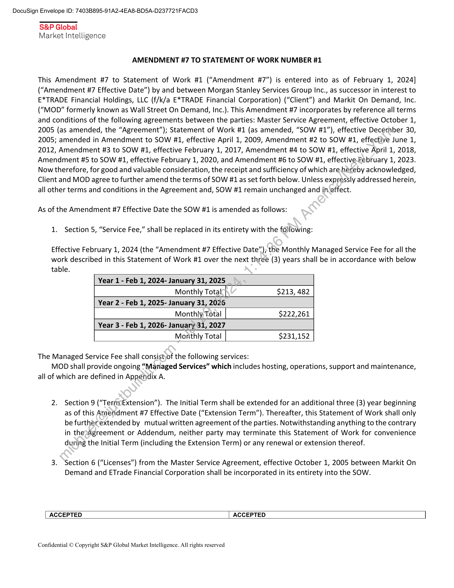
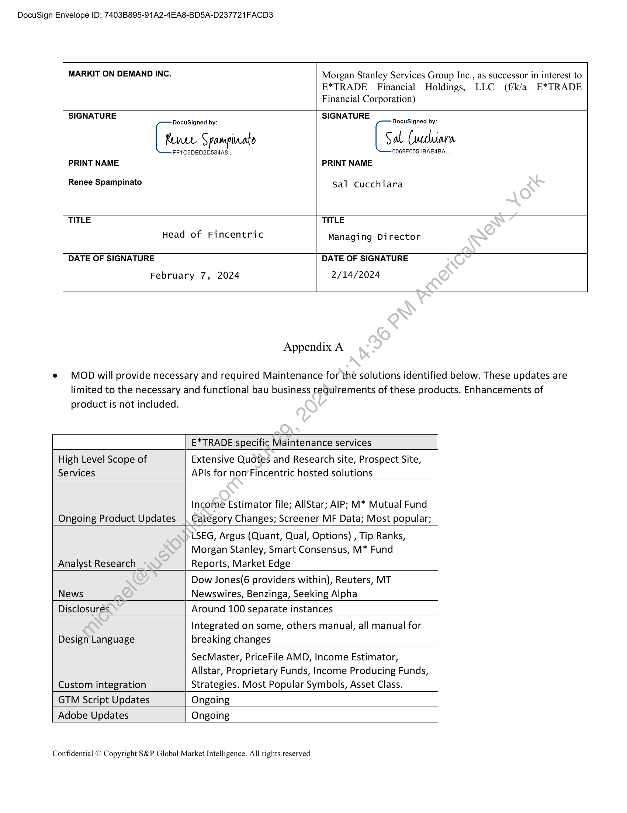
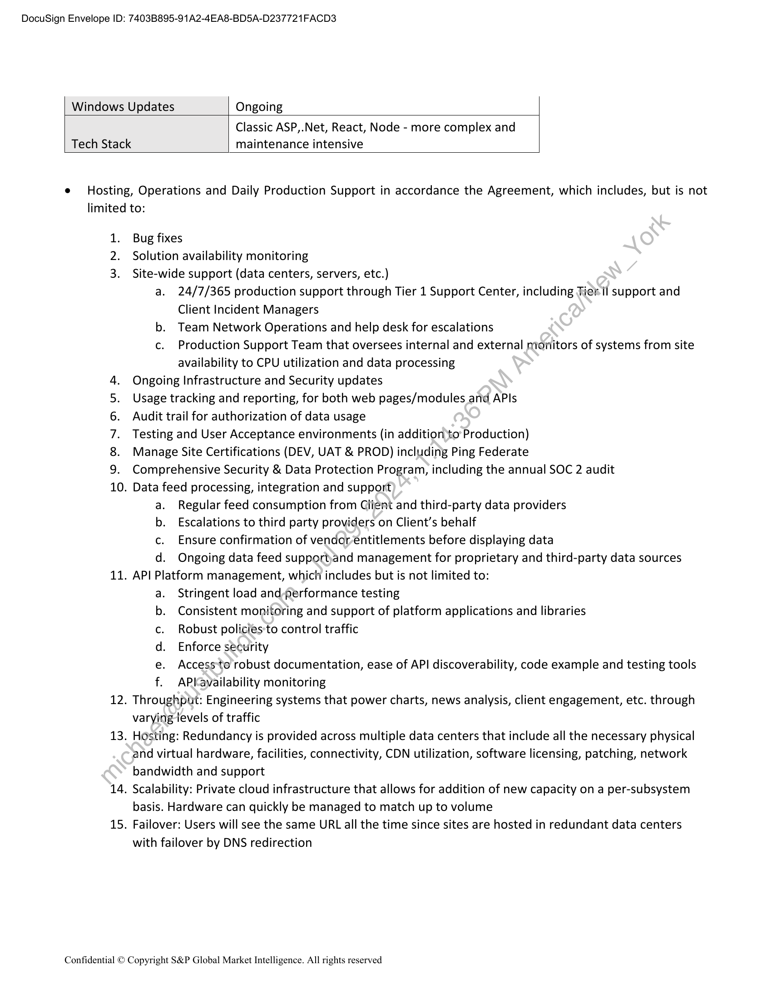

##### Amendment #7 to Statement of Work #1]

  
````col
```col-md
flexGrow=.5
===
> [!info] [Page 1](_attachments/images_MS-Services-3.6.1.19.2.100222724.pdf_211015/page_1.png)
> 
```  
```col-md
DocuSign Envelope ID: 7403B895-91A2-4EA8-BD5A-D237721FACD3  
S&P Global
Market Intelligence  
AMENDMENT #7 TO STATEMENT OF WORK NUMBER #1  
This Amendment #7 to Statement of Work #1 (“Amendment #7”) is entered into as of February 1, 2024]
(“Amendment #7 Effective Date”) by and between Morgan Stanley Services Group Inc., as successor in interest to
E*TRADE Financial Holdings, LLC (f/k/a E*TRADE Financial Corporation) (“Client”) and Markit On Demand, Inc.
(“MOD” formerly known as Wall Street On Demand, Inc.). This Amendment #7 incorporates by reference all terms
and conditions of the following agreements between the parties: Master Service Agreement, effective October 1,
2005 (as amended, the “Agreement”); Statement of Work #1 (as amended, “SOW #1”), effective Deceraber 30,
2005; amended in Amendment to SOW #1, effective April 1, 2009, Amendment #2 to SOW #1, effective June 1,
2012, Amendment #3 to SOW #1, effective February 1, 2017, Amendment #4 to SOW #1, effective April 1, 2018,
Amendment #5 to SOW #1, effective February 1, 2020, and Amendment #6 to SOW #1, effective.February 1, 2023.
Now therefore, for good and valuable consideration, the receipt and sufficiency of which are hereby acknowledged,
Client and MOD agree to further amend the terms of SOW #1 as set forth below. Unless expressly addressed herein,
all other terms and conditions in the Agreement and, SOW #1 remain unchanged and in-effect.  
As of the Amendment #7 Effective Date the SOW #1 is amended as follows:
1. Section 5, “Service Fee,” shall be replaced in its entirety with the following:  
Effective February 1, 2024 (the “Amendment #7 Effective Date”); the Monthly Managed Service Fee for all the
work described in this Statement of Work #1 over the next three (3) years shall be in accordance with below  
table.
Year 1 - Feb 1, 2024- January 31, 2025
Monthly Total $213, 482
Year 2 - Feb 1, 2025- January 31, 2026
Monthly, Total $222,261
Year 3 - Feb 1, 2026- January 31, 2027
Monthly Total $231,152  
The Managed Service Fee shall consistyof the following services:
MOD shall provide ongoing “Mariaged Services” which includes hosting, operations, support and maintenance,  
all of which are defined in Appendix A.  
2. Section 9 (“TernpExtension”). The Initial Term shall be extended for an additional three (3) year beginning
as of this Amendment #7 Effective Date (“Extension Term”). Thereafter, this Statement of Work shall only
be furtherextended by mutual written agreement of the parties. Notwithstanding anything to the contrary
in thep»Agreement or Addendum, neither party may terminate this Statement of Work for convenience
during the Initial Term (including the Extension Term) or any renewal or extension thereof.  
3. Section 6 (“Licenses”) from the Master Service Agreement, effective October 1, 2005 between Markit On
Demand and ETrade Financial Corporation shall be incorporated in its entirety into the SOW.  
ACCEPTED ACCEPTED  
Confidential © Copyright S&P Global Market Intelligence. All rights reserved  
```
````
Notes:    
````col
```col-md
flexGrow=.5
===
> [!info] [Page 2](_attachments/images_MS-Services-3.6.1.19.2.100222724.pdf_211015/page_2.png)
> 
```  
```col-md
DocuSign Envelope ID: 7403B895-91A2-4EA8-BD5A-D237721FACD3  
MARKIT ON DEMAND INC.  
Financial Corporation)  
Morgan Stanley Services Group Inc., as successor in interest to
E*TRADE Financial Holdings,  
E*TRADE  
SIGNATURE  
SIGNATURE  
DocuSigned by: DocuSigned by:  
Rene S pammpivato  
FF1C9DED2D584A8.  
[sl Cuecliara  
0069F0551BAE4BA  
PRINT NAME  
Renee Spampinato  
PRINT NAME  
Sal Cucchiara  
TITLE  
Head of Fincentric  
TITLE  
Managing Director  
DATE OF SIGNATURE DATE OF SIGNATURE
February 7, 2024 2/14/2024
Appendix A  
e MODwill provide necessary and required Maintenance for the solutions identified below. These updates are
limited to the necessary and functional bau business requirements of these products. Enhancements of  
product is not included.  
E*TRADE specific Maintenance services  
High Level Scope of
Services  
Extensive Quotes and Research site, Prospect Site,
APIs for non’Fincentric hosted solutions  
Ongoing Product Updates  
Income Estimator file; AllStar; AIP; M* Mutual Fund
Category Changes; Screener MF Data; Most popular;  
Analyst Research  
LSEG, Argus (Quant, Qual, Options) , Tip Ranks,
Morgan Stanley, Smart Consensus, M* Fund
Reports, Market Edge  
News  
Dow Jones(6 providers within), Reuters, MT
Newswires, Benzinga, Seeking Alpha  
Disclosures.  
Around 100 separate instances  
Design Language  
Integrated on some, others manual, all manual for
breaking changes  
Custom integration  
SecMaster, PriceFile AMD, Income Estimator,
Allstar, Proprietary Funds, Income Producing Funds,
Strategies. Most Popular Symbols, Asset Class.  
GTM Script Updates  
Ongoing  
Adobe Updates  
Ongoing  
Confidential © Copyright S&P Global Market Intelligence. All rights reserved  
```
````
Notes:    
````col
```col-md
flexGrow=.5
===
> [!info] [Page 3](_attachments/images_MS-Services-3.6.1.19.2.100222724.pdf_211015/page_3.png)
> 
```  
```col-md
DocuSign Envelope ID: 7403B895-91A2-4EA8-BD5A-D237721FACD3  
Windows Updates Ongoing  
Classic ASP,.Net, React, Node - more complex and
Tech Stack maintenance intensive  
e Hosting, Operations and Daily Production Support in accordance the Agreement, which includes, but is not
limited to:  
1. Bug fixes
2. Solution availability monitoring
3. Site-wide support (data centers, servers, etc.)
a. 24/7/365 production support through Tier 1 Support Center, including Tier. il support and
Client Incident Managers
b. Team Network Operations and help desk for escalations
c. Production Support Team that oversees internal and external mionitors of systems from site
availability to CPU utilization and data processing
Ongoing Infrastructure and Security updates
Usage tracking and reporting, for both web pages/modules and APIs
Audit trail for authorization of data usage
Testing and User Acceptance environments (in addition to Production)
Manage Site Certifications (DEV, UAT & PROD) including Ping Federate
Comprehensive Security & Data Protection Program, including the annual SOC 2 audit
10. Data feed processing, integration and support
a. Regular feed consumption from Glignt and third-party data providers
b. Escalations to third party providers on Client’s behalf
c. Ensure confirmation of vendorentitlements before displaying data
d. Ongoing data feed supportyand management for proprietary and third-party data sources
11. API Platform management, which includes but is not limited to:
a. Stringent load and-performance testing
Consistent monitoring and support of platform applications and libraries
Robust policies:to control traffic
Enforce security
Access‘to robust documentation, ease of API discoverability, code example and testing tools
AP{ayailability monitoring
12. Throughput: Engineering systems that power charts, news analysis, client engagement, etc. through
varying levels of traffic
13. Hosting: Redundancy is provided across multiple data centers that include all the necessary physical
and virtual hardware, facilities, connectivity, CDN utilization, software licensing, patching, network
bandwidth and support
14. Scalability: Private cloud infrastructure that allows for addition of new capacity on a per-subsystem
basis. Hardware can quickly be managed to match up to volume
15. Failover: Users will see the same URL all the time since sites are hosted in redundant data centers
with failover by DNS redirection  
WP ONaAMS  
>o a0  
Confidential © Copyright S&P Global Market Intelligence. All rights reserved  
```
````
Notes:  


![[_attachments/MS-Services-3.6.1.19.2.1 00222724.pdf]