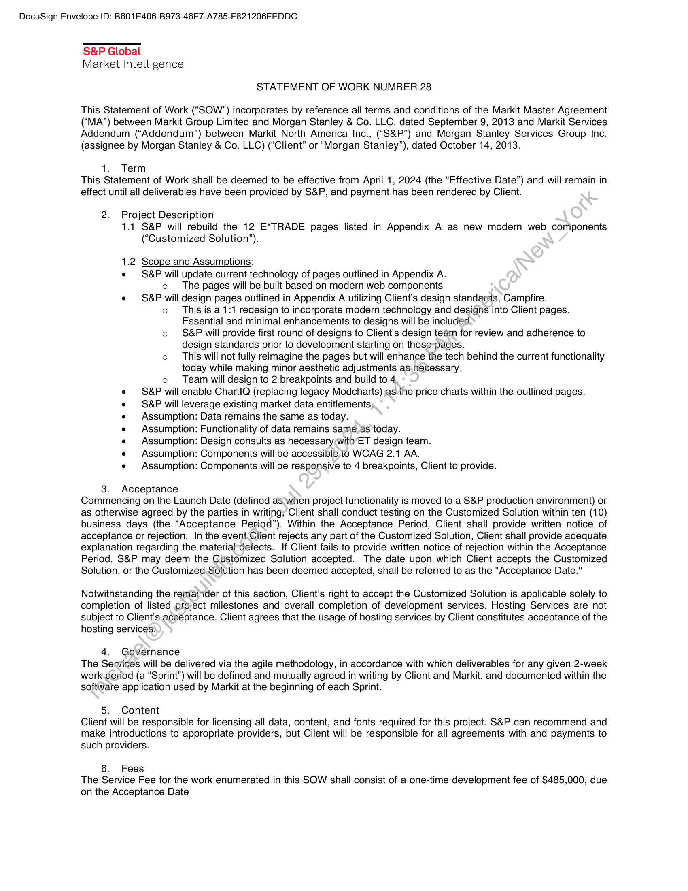
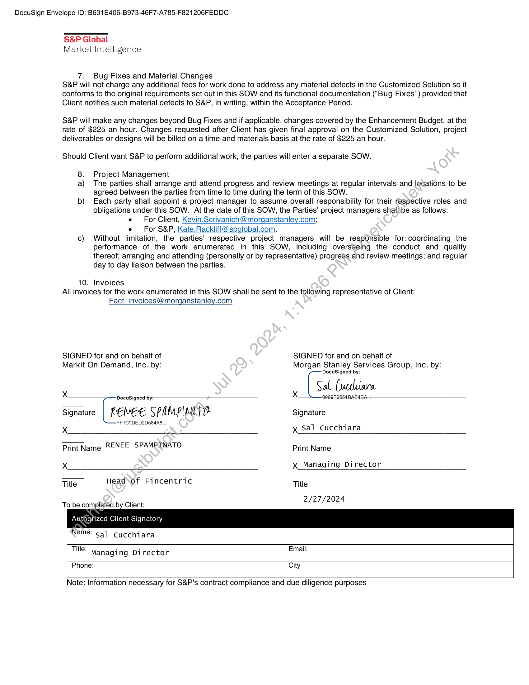
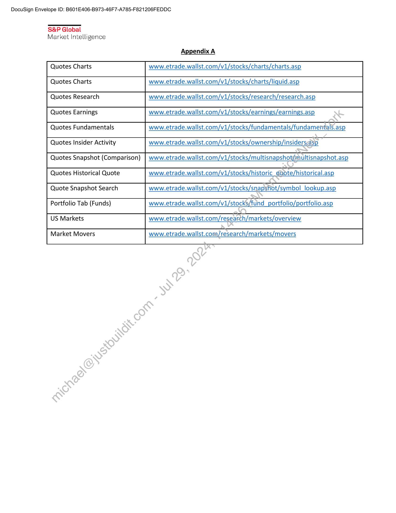

##### Statement of Work Number 28]

  
````col
```col-md
flexGrow=.5
===
> [!info] [Page 1](_attachments/images_MS-Services-3.6.1.19.2.200105245.pdf_212144/page_1.png)
> 
```  
```col-md
DocuSign Envelope ID: B601E406-B973-46F7-A785-F821206FEDDC  
S&P Global
Market Intelligence  
STATEMENT OF WORK NUMBER 28  
This Statement of Work (“SOW”) incorporates by reference all terms and conditions of the Markit Master Agreement
(“MA”) between Markit Group Limited and Morgan Stanley & Co. LLC. dated September 9, 2013 and Markit Services
Addendum (“Addendum”) between Markit North America Inc., (“S&P”) and Morgan Stanley Services Group Inc.
(assignee by Morgan Stanley & Co. LLC) (“Client” or “Morgan Stanley”), dated October 14, 2013.  
1. Term
This Statement of Work shall be deemed to be effective from April 1, 2024 (the “Effective Date”) and will remain in
effect until all deliverables have been provided by S&P, and payment has been rendered by Client.  
2. Project Description
1.1 S&P will rebuild the 12 E*TRADE pages listed in Appendix A as new modern web components
(“Customized Solution’).  
1.2 Scope and Assumptions:
e S&P will update current technology of pages outlined in Appendix A.
o The pages will be built based on modern web components
e S&P will design pages outlined in Appendix A utilizing Client's design standards, Campfire.
o This is a 1:1 redesign to incorporate modern technology and designs into Client pages.
Essential and minimal enhancements to designs will be included
o S&P will provide first round of designs to Client’s design team for review and adherence to
design standards prior to development starting on those-pages.
o This will not fully reimagine the pages but will enhance the tech behind the current functionality
today while making minor aesthetic adjustments as,necessary.
o Team will design to 2 breakpoints and build to 4.
S&P will enable ChartlQ (replacing legacy Modcharts) ;asvihe price charts within the outlined pages.
S&P will leverage existing market data entitlements»
Assumption: Data remains the same as today.
Assumption: Functionality of data remains same_as'today.
Assumption: Design consults as necessarywith’ET design team.
Assumption: Components will be accessible to WCAG 2.1 AA.
Assumption: Components will be responsive to 4 breakpoints, Client to provide.  
3. Acceptance  
Commencing on the Launch Date (defined as:\when project functionality is moved to a S&P production environment) or
as otherwise agreed by the parties in writing, Client shall conduct testing on the Customized Solution within ten (10)
business days (the “Acceptance Period”). Within the Acceptance Period, Client shall provide written notice of
acceptance or rejection. In the event-Client rejects any part of the Customized Solution, Client shall provide adequate
explanation regarding the material-defects. If Client fails to provide written notice of rejection within the Acceptance
Period, S&P may deem the Customized Solution accepted. The date upon which Client accepts the Customized
Solution, or the Customized.Solution has been deemed accepted, shall be referred to as the "Acceptance Date."  
Notwithstanding the remainder of this section, Client’s right to accept the Customized Solution is applicable solely to
completion of listed project milestones and overall completion of development services. Hosting Services are not
subject to Client's acceptance. Client agrees that the usage of hosting services by Client constitutes acceptance of the
hosting services:  
4. Governance
The Services will be delivered via the agile methodology, in accordance with which deliverables for any given 2-week
work period (a “Sprint”) will be defined and mutually agreed in writing by Client and Markit, and documented within the
software application used by Markit at the beginning of each Sprint.  
5. Content
Client will be responsible for licensing all data, content, and fonts required for this project. S&P can recommend and
make introductions to appropriate providers, but Client will be responsible for all agreements with and payments to
such providers.  
6. Fees
The Service Fee for the work enumerated in this SOW shall consist of a one-time development fee of $485,000, due
on the Acceptance Date  
```
````
Notes:    
````col
```col-md
flexGrow=.5
===
> [!info] [Page 2](_attachments/images_MS-Services-3.6.1.19.2.200105245.pdf_212144/page_2.png)
> 
```  
```col-md
DocuSign Envelope ID: B601E406-B973-46F7-A785-F821206FEDDC  
S&P Global
Market Intelligence  
7.  
Bug Fixes and Material Changes  
S&P will not charge any additional fees for work done to address any material defects in the Customized Solution so it
conforms to the original requirements set out in this SOW and its functional documentation (“Bug Fixes”) provided that
Client notifies such material defects to S&P, in writing, within the Acceptance Period.  
S&P will make any changes beyond Bug Fixes and if applicable, changes covered by the Enhancement Budget, at the
rate of $225 an hour. Changes requested after Client has given final approval on the Customized Solution, project
deliverables or designs will be billed on a time and materials basis at the rate of $225 an hour.  
Should Client want S&P to perform additional work, the parties will enter a separate SOW.  
8.
a)  
b)  
10.  
Project Management
The parties shall arrange and attend progress and review meetings at regular intervals and locations to be
agreed between the parties from time to time during the term of this SOW.
Each party shall appoint a project manager to assume overall responsibility for their respective roles and
obligations under this SOW. At the date of this SOW, the Parties’ project managers shall)be as follows:  
e For Client, Kevin.Scrivanich@morganstanley.com;  
e ~=For S&P, Kate.Rackliff@spglobal.com.
Without limitation, the parties' respective project managers will be responsible for: coordinating the
performance of the work enumerated in this SOW, including overs@eing the conduct and quality
thereof; arranging and attending (personally or by representative) progress and review meetings; and regular
day to day liaison between the parties.  
Invoices  
All invoices for the work enumerated in this SOW shall be sent to the following representative of Client:  
Fact_invoices@morganstanley.com  
SIGNED for and on behalf of SIGNED for and on behalf of
Markit On Demand, Inc. by: Morgan Stanley Services Group, Inc. by:  
xX.  
DocuSigned by:
Sal Cuccliara  
Signature REMEE SPAM PI MEE Signature  
FF1C9DED2D584A8.  
Xx x Sal Cucchiara
Print Name RENEE SPAMPINATO Print Name
Xx Xx Managing Director
Title Headsof Fincentric Title  
2/27/2024  
To be completed by Client:  
Authorized Client Signatory  
Name: sa] cucchiara  
Title:  
Managing Director Email:  
Phone: City  
Note: Information necessary for S&P's contract compliance and due diligence purposes  
```
````
Notes:    
````col
```col-md
flexGrow=.5
===
> [!info] [Page 3](_attachments/images_MS-Services-3.6.1.19.2.200105245.pdf_212144/page_3.png)
> 
```  
```col-md
DocuSign Envelope ID: B601E406-B973-46F7-A785-F821206FEDDC  
S&P Global
Market Intelligence  
Appendix A  
Quotes Charts www.etrade.wallst.com/v1/stocks/charts/charts.asp  
Quotes Charts www.etrade.wallst.com/v1/stocks/charts/liquid.asp  
Quotes Research www.etrade.wallst.com/v1/stocks/research/research.asp
Quotes Earnings www.etrade.wallst.com/v1/stocks/earnings/earnings.asp  
Quotes Fundamentals www.etrade.wallst.com/v1/stocks/fundamentals/fundamentals.asp  
Quotes Insider Activity www.etrade.wallst.com/v1/stocks/ownership/insiderscasp  
Quotes Snapshot (Comparison) | www.etrade.wallst.com/v1/stocks/multisnapshot/imultisnapshot.asp
Quotes Historical Quote www.etrade.wallst.com/v1/stocks/historic_@udte/historical.asp  
Quote Snapshot Search www.etrade.wallst.com/v1/stocks/snapshot/symbol_ lookup.asp  
Portfolio Tab (Funds) www.etrade.wallst.com/v1/stocks/fund_portfolio/portfolio.asp  
US Markets www.etrade.wallst.com/research/markets/overview  
Market Movers www.etrade.wallst.com/research/markets/movers  
```
````
Notes:  


![[_attachments/MS-Services-3.6.1.19.2.2 00105245.pdf]