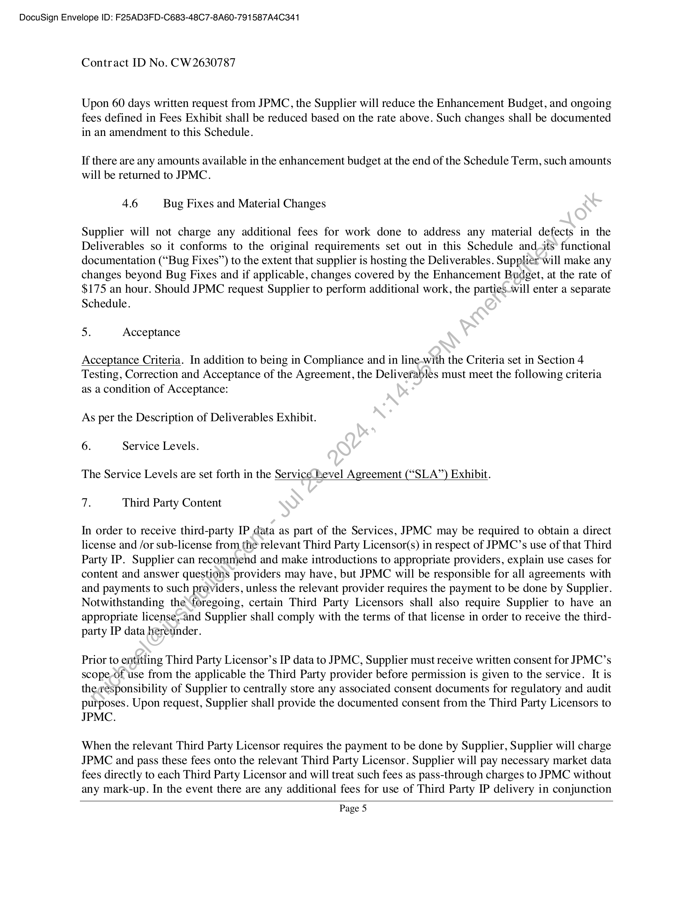
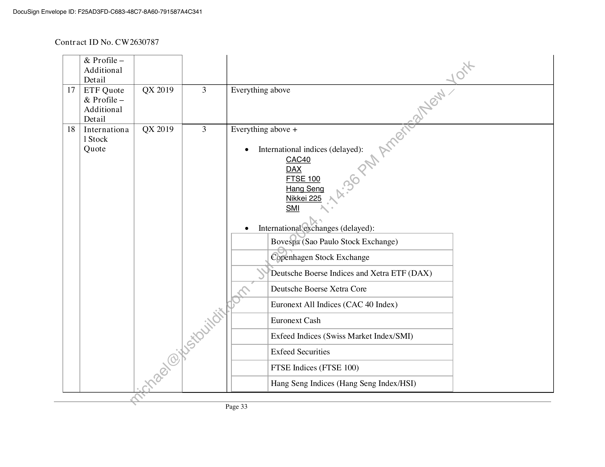
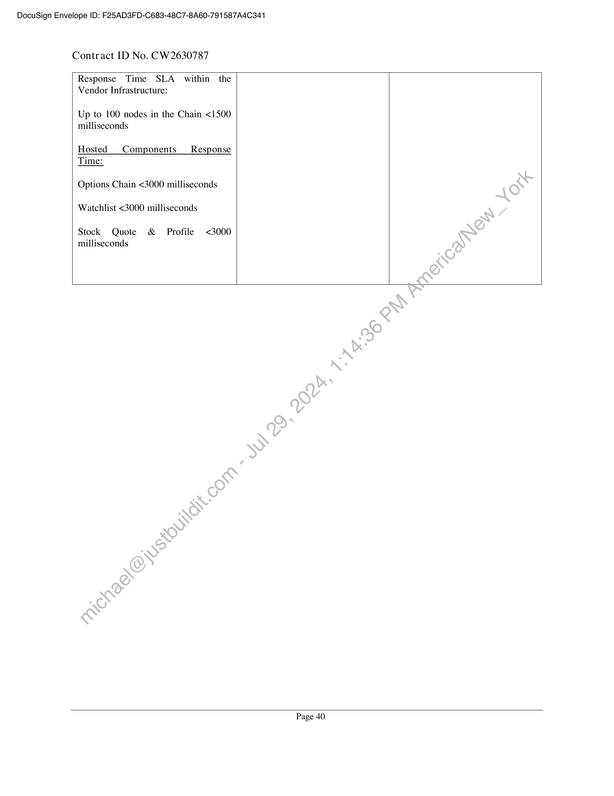

##### Schedule No. 2 to Master Agreement CW280805]

  
````col
```col-md
flexGrow=.5
===
> [!info] [Page 1](_attachments/images_JPMC-NA-3.6.1.20.3.100241786.pdf_212834/page_1.png)
> 
```  
```col-md
DocuSign Envelope ID: F25AD3FD-C683-48C7-8A60-791587A4C341  
Contract ID No. CW2630787  
SCHEDULE NO. 2
TO
MASTER AGREEMENT CW280805  
This Schedule No. 2 (“Schedule”), effective on the date of last signature of this Schedule (“Effective Date”’)
is an agreement between JPMorgan Chase Bank, National Association (“JPMC”) and Markit On Demand,
Inc. fka Wall Street On Demand (“Supplier” or “Markit”) and incorporates, by reference, all terms and
conditions contained in the Master Agreement CW280805, dated 6" February 2009 as amended from time
to time (“Agreement”). Except as otherwise expressly set forth in this Schedule, the defined terms usedin
this Schedule shall have the same meanings as the defined terms in the Agreement. In the event of.a conflict
or ambiguity between the terms and conditions of the Agreement and this Schedule, the terms and
conditions of the Agreement shall prevail.  
1. Incorporation of Agreement  
This Schedule is a separate agreement between Supplier and JPMC and incorporates the terms and
conditions of the Agreement CW280805 as amended from time to time between JPMorgan Chase Bank,
N.A. and Supplier, dated April 2, 2009. Capitalized terms used but not defined in this Schedule will have
the meanings given to them in the Agreement. If a term in this Schedule conflicts with a term in the
Agreement, the provisions of the Agreement will prevail unless this Schedule specifically states that the
term in the Schedule will prevail. References in this Schedule to>Sections and Exhibits will refer to the
Sections and Exhibits of this Schedule unless otherwise noted.  
2. Schedule Term.  
The term of this Schedule will begin on the Effective, Date and continue until 31 December 2020, unless
earlier terminated in accordance with the terms of the Agreement (“Initial Schedule Term”).  
Upon the expiration of the Initial Schedyle’Term, and JPMC’s request, this Schedule will renew for
successive 12 month periods (each a “Renewal Schedule Term”) unless terminated earlier in accordance
with Section 13 Term and Termination*of the Agreement. 90 days prior to the expiration of the Initial
Schedule Term and any Renewal Schedule Term, Supplier will notify JPMC of the pending term renewal.
JPMC will have the right to renew the term of this Schedule by providing Supplier with not less than 30
days’ prior notice of its intention to renew. The Initial Schedule Term together with the Renewal Schedule
Term(s) shall be referredsto as “Schedule Term.”  
Notwithstanding theabove, JPMC shall have the right to Terminate this Schedule for convenience, in whole
or in part, at any.time upon 30 days written notice to Supplier for its convenience after the completion of
the Initial Schedule Term.  
Further notwithstanding anything contained herein, this Schedule shall remain in full force and effect until
delivery. of any Service by Supplier pursuant to this Schedule including any End of Term Assistance
Services.  
3. Scope of Work.
Supplier will develop and support web components and APIs for Chase/J.P. Morgan personal online  
client portal (CPO/JPO), on both web and mobile platforms, as part of the Digital Wealth Management
program.  
Page |  
```
````
Notes:    
````col
```col-md
flexGrow=.5
===
> [!info] [Page 2](_attachments/images_JPMC-NA-3.6.1.20.3.100241786.pdf_212834/page_2.png)
> 
```  
```col-md
DocuSign Envelope ID: F25AD3FD-C683-48C7-8A60-791587A4C341  
Contract ID No. CW2630787  
For purposes of this Order Schedule, "Subscriber" shall mean:  
e JPMC’s Internal Users: Employees or consultants of JPMC or Affiliates of JPMC globally,
("JPMC Affiliates") that (i) support any aspect of the JPMC Portals or (ii) use the JPMC Portals
for JPMC’s internal use only. For avoidance of doubt, JPMC’s Internal Users shall be considered
"Professional Users"  
e JPMC’s Internal Technical Users: Technical Employees or consultants of JPMC or JPMC’s
Affiliates globally, not considered neither “Professional Users” nor “Non Professional Users”, that
will be differentiated during development period, where applicable and in accordance\with
applicable JPMC’s Policies, and report said usage accordingly. JPMC shall be responsible-for (i)
correctly categorizing users, and (ii) notifying Supplier of such users, where required  
e JPMC’s External Client Users: JPMC’s external client users that will have access,to the JPMC
Portals set forth below. Most of such JPMC’s External Client Users are\considered nonprofessional by definition (considered "Non-Professional Users"), but others. may have a job that
considers them professional but will be utilizing the Services in a personal,non-work related, nonprofessional capacity. JPMC shall be responsible for: (i) correctly categorizing and reporting to
Supplier whether such JPMC’s External Client User(s) are either Professional User(s) or NonProfessional User(s).  
The following are the platforms and websites from which the components defined herein will be accessed
by the JPMC’s Subscribers at the outset of this Schedule. Subject'to written agreement between the
parties, JPMC may add client portals, websites, URLs, etc. that are related to the JPMC Portals set forth
below. Additional Fees as set forth in Fees Exhibit may apply,  
e Wealth Management Client Portal (Private Bank, J.P. Morgan Securities)
o JPO aka J.P. Morgan Personal Online = JP. Morgan Secure Pages
Gpmorgan.chase.com; alias: jpmol.com; jpmorganonline.com; morganonline.com)
o JPM Mobile = the mobile version of the Wealth Management Client Portal websites
e Retail Bank Client Portal (Chase Retail)
o CPO aka Chase Personal Online = Chase Retail Secure Pages (chase.com)
o Chase Mobile = the mobile version of the Retail Bank Client Portal websites
e Chase Business Online (CBO)
o CBO aka Chase Business Online = Chase Business Secure Pages (chase.com)
o Same platform, including styling, as Retail Bank Client Portal; CBO is simply branded
as a Chase business portal  
The above is not intended to be an exhaustive list of websites / client portals alias'/redirects that lead to
the websites. JEMC will notify Supplier of any changes to this list when JPMC becomes aware of such
changes. There’are no restrictions to such changes as long as the aliases/redirects all pertain to the JPMC
Portals named above or that are subsequently added during the term as may be agreed by the parties in
writings  
JPMC acknowledges that the ability of Supplier to perform Services in the timeframe set forth herein is
contingent upon JPMC’s provision to Supplier of timely information; responses, and/or feedback.
Suppliers’ time of performance will be increased, day-for-day to match any delay caused by failure by
JPMC to submit information; responses, and/or feedback by the dates set forth in this Schedule. For
avoidance of doubt, there will be no extra charges assessed to JPMC for any such delay. For Services
performed under this Schedule, time of the essence shall not apply.  
Page 2  
```
````
Notes:    
````col
```col-md
flexGrow=.5
===
> [!info] [Page 3](_attachments/images_JPMC-NA-3.6.1.20.3.100241786.pdf_212834/page_3.png)
> 
```  
```col-md
DocuSign Envelope ID: F25AD3FD-C683-48C7-8A60-791587A4C341  
Contract ID No. CW2630787
4. Description of Services and Deliverables.  
4.1 Development Services. The Supplier shall provide the following Development Services to
JPMC:  
e Developing and provisioning custom APIs and web content delivery  
e Responsive, web-based applications for use in both web and mobile platforms (Android and
iOS compatibility); applications will be responsive across desktop, tablet and mobile based on
the following responsive grid ranges: 320 Extra-Small, 768 Small, 1024 Medium, 1200 Large  
e Implementing JPMC provisioned designs / design guides; Supplier will develop, content
modules in compliance with JPMC’s provided style guide; Supplier will author CSS for each
content application  
e QA and defect remediation  
JPMC and Supplier shall mutually agree upon detailed requirements of the items above and in the
Description of Deliverables Exhibit in advance of development.  
42 Administrative and Project Management Services. The’ Supplier shall provide the
following Administrative and Project Management Services to JPMC;  
e Services to be performed:  
o Project roadmap management in alignment\with JPMC scheduled releases; the parties
shall mutually agree upon release schedules during the development phase of the
Deliverables  
o Weekly checkpoints with JPMC design, architect, developer, and product teams  
o Market data delivery and exchange reporting; Supplier will provide monthly exchange
reporting to JPMC and/or the applicable sources  
e The manner in which the services will be performed:  
o Supplier will leveragevts JIRA for project tracking all work items, change controls,
QA testing, and defect logging; JPMC will be provided access.  
o All Supplier Deliverables under this work order will be integration tested and follow
the JPMC Digital sanctioned SDLC as a prerequisite to production implementation.  
e¢ Completion criteria for the project:  
o Deliverables are delivered, accepted by JPMC in accordance with Section 5
Acceptance below and as detailed in the Description of Services and Deliverables
Exhibit and implemented in accordance with JPMC requirements and integration
standards defined in the Agreement and this Schedule, and released into production
environment(s)  
4.3 Hosting and Support Services. The Supplier shall provide the following Hosting and
Support-Setvices to JPMC:  
e Standalone environment for Hosting, support and maintenance of the Deliverables
e Network connectivity and authentication
e Encrypted and tokenized data transfer
o Authentication will be facilitated through both Oauth client credentials grant and JWT
extension via browser cookie using TP-PSaaS and API calls from JPMC server side
prox. User access token expiry will be set at 10 minutes. The following endpoints and
JVM app names will be utilized for iFrame/Web content containers and APIs in both  
Page 3  
```
````
Notes:    
````col
```col-md
flexGrow=.5
===
> [!info] [Page 4](_attachments/images_JPMC-NA-3.6.1.20.3.100241786.pdf_212834/page_4.png)
> 
```  
```col-md
DocuSign Envelope ID: F25AD3FD-C683-48C7-8A60-791587A4C341  
Contract ID No. CW2630787  
Production (Prod) and Pre-Production (QA) environments:  
e API Prod: api-markit.chase.com to point to api.markitdigital.com  
e APIQA: qa-api-markit.chase.com to point qa-api.markitdigital.com  
e Web Content Prod: web-markit.chasecom to point to https://jpmcqr.markitdigital.com  
e Web Content QA: qa-web-markit.chase.com to point to https://jpmcqr.markitqa.com  
o Supplier will create Client IDs for the following apps:  
App Name Description Auth type Token  
WM_Gator API connectivity for GATOR WM system Client creds 2 houtexpiry
WML_RQSMargin | API connectivity for RQS/Margin WM system | Client creds |2:hour expiry
Digital_MW API connectivity for Digital Middleware Client creds’)* 2 hour expiry  
Digital_UI Web components for retail web JWT 10 minute expiry  
e Performance testing  
e Dynamic security and penetration testing - ensure thatindustry standard best practices are in
place for all policies and procedures related to data security (encryption, etc). Supplier will
conduct annual tests on their own, with 20 business day’s notification in advance by JPMC,
following OWASP Top 10 guidelines, and.send JPMC the results on all hosted components.
Supplier will also be subject to periodic’scans initiated by JPMC (currently annual, but may
change to semi-annual at JPMC’s if)mutually agreed by JPMC and Supplier). Upon the
identification of a security incident by Supplier or JPMC as a result of a security test or
otherwise in the normal cours¢)of business, and according to the definition in Supplier’s
incident management policy, Supplier shall remediate the identified incident as per the SLAs
identified in Section 10 of the-SLA Exhibit.  
e Web/data analytics; Supplier shall integrate web analytics tags into components provided to
JPMC  
44 Deliverables»~The Supplier shall provide the following Deliverables to JPMC:  
Supplier will provide.the Deliverables set forth in the Description of Deliverables Exhibit. All Deliverables
are deemed Developed Works.  
45 Enhancements.  
JPMC.is. entitled to an enhancement budget equal to fifteen percent (15%) of the monthly service fee to
fund.future enhancements to the Deliverables, which may include design changes, addition of new features,
ordntegration of new data (the “Enhancement Budget”). The Enhancement Budget shall be specified in
Fees Exhibit and shall be accrued on a monthly basis and the unused amount will be credited to JPMC on
the next invoice at the end of each quarter ending February, May, August and November. Supplier will
multiply its standard rate of $175 an hour by the number of hours worked on any enhancement and subtract
the resulting product from the accrued Enhancement Budget. Supplier will report allocated and available
Enhancement Budget to JPMC on a monthly basis. For the avoidance of doubt, JPMC may apply
Enhancement Budget toward any of the Deliverables.  
Page 4  
```
````
Notes:    
````col
```col-md
flexGrow=.5
===
> [!info] [Page 5](_attachments/images_JPMC-NA-3.6.1.20.3.100241786.pdf_212834/page_5.png)
> 
```  
```col-md
DocuSign Envelope ID: F25AD3FD-C683-48C7-8A60-791587A4C341  
Contract ID No. CW2630787  
Upon 60 days written request from JPMC, the Supplier will reduce the Enhancement Budget, and ongoing
fees defined in Fees Exhibit shall be reduced based on the rate above. Such changes shall be documented
in an amendment to this Schedule.  
If there are any amounts available in the enhancement budget at the end of the Schedule Term, such amounts
will be returned to JPMC.  
4.6 Bug Fixes and Material Changes
Supplier will not charge any additional fees for work done to address any material defects in the
Deliverables so it conforms to the original requirements set out in this Schedule and_<its’ functional
documentation (“Bug Fixes”) to the extent that supplier is hosting the Deliverables. Supplier will make any
changes beyond Bug Fixes and if applicable, changes covered by the Enhancement Budget, at the rate of
$175 an hour. Should JPMC request Supplier to perform additional work, the parties.will enter a separate
Schedule.
5. Acceptance
Acceptance Criteria. In addition to being in Compliance and in line-with the Criteria set in Section 4
Testing, Correction and Acceptance of the Agreement, the Deliverables must meet the following criteria
as a condition of Acceptance:
As per the Description of Deliverables Exhibit.  
6. Service Levels.  
The Service Levels are set forth in the Servicé bevel Agreement (“SLA”) Exhibit.  
7. Third Party Content  
In order to receive third-party IP data as part of the Services, JPMC may be required to obtain a direct
license and /or sub-license from {he relevant Third Party Licensor(s) in respect of JPMC’s use of that Third
Party IP. Supplier can recommend and make introductions to appropriate providers, explain use cases for
content and answer questions providers may have, but JPMC will be responsible for all agreements with
and payments to such providers, unless the relevant provider requires the payment to be done by Supplier.
Notwithstanding the foregoing, certain Third Party Licensors shall also require Supplier to have an
appropriate license;and Supplier shall comply with the terms of that license in order to receive the thirdparty IP data hereunder.  
Prior to entitling Third Party Licensor’s IP data to JPMC, Supplier must receive written consent for JPMC’s
scope,-of use from the applicable the Third Party provider before permission is given to the service. It is
thegesponsibility of Supplier to centrally store any associated consent documents for regulatory and audit
purposes. Upon request, Supplier shall provide the documented consent from the Third Party Licensors to
JPMC.  
When the relevant Third Party Licensor requires the payment to be done by Supplier, Supplier will charge
JPMC and pass these fees onto the relevant Third Party Licensor. Supplier will pay necessary market data
fees directly to each Third Party Licensor and will treat such fees as pass-through charges to JPMC without
any mark-up. In the event there are any additional fees for use of Third Party IP delivery in conjunction  
Page 5  
```
````
Notes:    
````col
```col-md
flexGrow=.5
===
> [!info] [Page 6](_attachments/images_JPMC-NA-3.6.1.20.3.100241786.pdf_212834/page_6.png)
> 
```  
```col-md
DocuSign Envelope ID: F25AD3FD-C683-48C7-8A60-791587A4C341  
Contract ID No. CW2630787  
with use of the data, JPMC must be notified in writing by Supplier for the additional fees and must receive
consent before any fees apply. Supplier will receive written approval from each Third Party Licensor prior
and provide evidence to JPMC before to entitling the content to JPMC.  
Upon request by JPMC to Supplier and an amendment to this Schedule, Supplier shall be authorized to act
as the agent of JPMC for the purchase of certain data and/or content required by JPMC for this project and
is authorized to contract on behalf of JPMC for such purchase. JPMC is responsible for all licensing
expenses; any amount of sales, use, excise, gross receipts, value added, goods and services, or other taxes;
and any other fees applicable to or arising from the provision or the use of such data and/or content,
including any additional fees should Third Party Licensor increase their fees at any time. Supplier will
notify JPMC in writing of any fee increases within thirty (30) days of receiving such notice from the
applicable source. Subject to the licensing terms with the applicable source, JPMC may elect to remove
such content upon written notice to Supplier, and JPMC and Supplier shall mutually agree-wpon a plan and
timeline to remove such content.  
Supplier email address for Third Party Content related requests: Data.SolutionsPOC @ihsmarkit.com  
8. Entitlement System Services, Reporting:  
e Entitlement: In addition and subject to all Third Party Licensors approvals, Supplier will also
provide, where applicable, data permissioning for data fromExchanges as well as other third party
data providers as may be mutually agreed to by the Parties for specific Subscribers as may be
requested by JPMC.  
e JPMC will provide Supplier with a unique identifier along with parameters indicating to which
Market Data Components (and Data Sources) Subscribers are entitled. JPMC’s External Client
Users shall have entered into a Client Agreement prior to JPMC’s provision to Supplier of such
unique identifier.  
e Entitlement Report for Market-Data Sources delivered via XML API based Delivery. On a
monthly basis, Supplier shall use commercially reasonable efforts to provide JPMC with an
Entitlement report within ten(10) business days of the calendar month end. Such Entitlement report
will summarize the quote-usage by each Subscriber User.  
e Third Party Supplier Reporting (including Exchanges): To the extent permitted by the Third
Party Licensors) the Supplier will perform quote counting where applicable for Real-Time
Exchanges-and provide specific usage reports of such quotes ("Quote Count Reports") to each
Third Party Licensor. Supplier will be responsible for the accuracy relating to its quote counting
and_quote’ consumption reporting mechanisms to each Third Party Licensor, and, to the extent its
quote counting and quote consumption reporting is inaccurate and additional fees are assessed,
Supplier shall be responsible for such additional fees. Notwithstanding the foregoing or anything
contained in this Schedule or the Agreement, in the event a Third Party Licensor determines that
Supplier under-reported quotes and such additional fees are assessed by such Third Party Licensor,
JPMC shall be responsible for the actual number of quotes consumed by Subscribers; provided
however, in such situation, JPMC shall not be responsible for any penalties assessed by a Third
Party Licensor in connection with such under-reporting.  
e Upon request, Supplier will provide a statistical usage report detailing real-time quote consumption,
grouped by Third Party Licensor and User Identifiers, as sent by JPMC with each quote request.  
Page 6  
```
````
Notes:    
````col
```col-md
flexGrow=.5
===
> [!info] [Page 7](_attachments/images_JPMC-NA-3.6.1.20.3.100241786.pdf_212834/page_7.png)
> 
```  
```col-md
DocuSign Envelope ID: F25AD3FD-C683-48C7-8A60-791587A4C341  
Contract ID No. CW2630787  
Supplier and JPMC will mutually agree with a format of such report.  
e Statistical Usage Report: Upon request, Supplier will provide statistical usage reports to JPMC.
Such reports are designed to include usage of market data consumption, real-time or delayed,
grouped by Third Party Licensors (Exchange, as well as aggregate usage on Supplier hosted
components. JPMC may request such monthly usage reports for the prior twelve (12) months.  
9. Performance Schedule.
As per the Description of Deliverables Exhibit.  
10. Location of Performance.  
The primary location(s) for provision of the Services during the Schedule Term are as-follows:  
All business may be transacted remotely between parties. Services will be performed and physical
meetings may be scheduled on an ad-hoc basis at primary JPMC offices locations including, but not
limited to:  
28 Liberty Street, New York, NY, USA
270 Park Ave, New York, NY, USA
383 Madison, New York, NY, USA  
5 Manhattan West, York, NY, USA  
1000 Polaris Pkwy, Columbus, OH, USA  
The Supplier will use JPMC facilities only to proyide the Services. All assets provided by JPMC will
remain in the JPMC facility where those assets were initially located unless JPMC otherwise agrees in
writing. JPMC may relocate any JPMC facility to another geographic location, or direct the Supplier to
cease using all or part of a JPMC facilityGn which event, JPMC will provide similar space in the same or
an alternate JPMC facility). When any JPMC facility is no longer being used or otherwise required for
performance of the Services, the Supplier will (a) promptly remove its property from that JPMC facility,
and (b) return that JPMC facility to substantially the same condition it was in when the Supplier began to
use that facility, subject to xeasonable wear and tear.  
In addition to the above;Services will be performed by Supplier remotely from the locations below.
Supplier will not change any Service Location without JPMC’s prior written consent.  
5775 Flatirens-Parkway, Boulder, CO USA — all services shall be provided from this location  
Green Boulevard, Tower C, Plot B-9A, Sector 62, Noida, India — development, QA testing and production
support shall be provided from this location  
11. Fees  
Fees are set forth in Fees Exhibit  
Page 7  
```
````
Notes:    
````col
```col-md
flexGrow=.5
===
> [!info] [Page 8](_attachments/images_JPMC-NA-3.6.1.20.3.100241786.pdf_212834/page_8.png)
> 
```  
```col-md
DocuSign Envelope ID: F25AD3FD-C683-48C7-8A60-791587A4C341  
Contract ID No. CW2630787
12. Invoicing  
JPMC will be invoiced by the Supplier and pay such invoices in accordance with the terms of Section 5 of
the Agreement. Invoices shall be sent to the following address:  
JPMorgan Chase Bank, National Association
1111 Polaris Parkway  
Columbus, Delaware  
OH, 43240  
United States  
Attention: JPMC Relationship Manager  
13. Reports  
Upon JPMC’s reasonable request, Supplier shall prepare a summary report in the format as agreed between
the parties detailing the activities for the time period covered by the request and ‘any open issues to be
addressed by the Supplier and JPMC. In addition, the Supplier shall contact JPMC without undue delay by
telephone, and if requested confirm by written notice, upon discovery of any problem that will materially
delay the provision of any Deliverable.  
14. Relationship Managers.  
JPMC Relationship Manager Supplier Relationship Manager
Name: Name:  
Frederick Duden Scott Kortgard  
Title: Title:  
Managing Director Executive Director, Markit Digital
Telephone Number: Telephone Number:  
W: +1-212-622-8406 W: +1 646 679 3011  
M: +1-415-515-4915 M: +1 612 702 4549  
Email: Email:  
frederick duden@ jpmorgancom scott.kortgard @ihsmarkit.com  
Address: Address:  
450 W 33rd St, Floor!6M 450 West 33rd Street, 5th floor | New York, NY
New York, NY, 10001, United States 10001  
JPMC Cybersecurity Contact Supplier Cybersecurity Contact *
Name; Scott Dwelley Name: Tier 1 Support  
Title: Technology Control Officer, Digital Title:  
Work and Mobile Telephone Numbers: Work and Mobile Telephone Numbers:
+1-603-896-8680 (work) +1.303.583.4308  
+1-603-759-8458 (mobile)  
Page 8  
```
````
Notes:    
````col
```col-md
flexGrow=.5
===
> [!info] [Page 9](_attachments/images_JPMC-NA-3.6.1.20.3.100241786.pdf_212834/page_9.png)
> 
```  
```col-md
DocuSign Envelope ID: F25AD3FD-C683-48C7-8A60-791587A4C341  
Contract ID No. CW2630787  
E-mail: scott.w.dwelley@jpmchase.com E-mail: MOD-NOC@ihsmarkit.com
Address: 4 Northeastern Blvd, Floor 03 | Address: 5775 Flatirons Parkway
Salem, NH, 03079-5916, United States Boulder, CO 80301  
*At no additional expense to JPMC, the Supplier Cybersecurity Contact must (i) respond to all cyber-related
inquiries within 24 hours, 7 days a week, and (ii) be available via mobile and SMS within 24 hours, 7 days
a week (with back-up resources when the Supplier Cybersecurity Contact is either unavailable or out of the
office (“Back-Up”)). Supplier will immediately provide written notice to JPMC when the Supplier
Cybersecurity Contact changes or when the Back-Up has the responsibility hereunder.  
15. Subcontractor Personnel.  
The following Subcontractor Personnel shall provide Services under this Schedule, and‘shall be regarded
as approved by JPMC for the purposes of the Agreement:  
NTT Data Services, LLC: Data Center Operations, Infrastructure as a Service (JaaS)
Globant: Development, Quality Assurance (QA), Dev/Ops  
16. Additional terms and conditions applicable to this Schedule onby\Gf any).  
1. Section 8.4, of Master Agreement CW280805, dated February 6th, 2009 Compliance with Laws, is
hereby amended to append the following additional new paragraph thereof:  
“To the extent Supplier is providing, serving, or hosting Internet, email or portable device ready user
interface elements or functionality, Supplier represents\and warrants that such elements and functionality
will conform to (i) the W3C Web Content Accessibility Guidelines Version 2.0 Level A & AA Success
Criteria; (ii) any state or federal laws applicable to Internet, email or portable device accessibility, including
the U.S. Americans with Disabilities Act;~and (ii) the JPMC TPP WCAG Standards (located at
https://www.jpmorganchase.com/corporate/About-JPMC/ab-personnel-policies .htm).”  
2. Pursuant to Section 1.10 Competitive Advantage as a Result of Services of the Amendment 1 to
the Agreement, JPMC and-Supplier hereby acknowledge and agree that, in the event JPMC deems
in its sole discretion thatany of Deliverables provide JPMC a competitive advantage, the Supplier
will not share or promote and in turn develop or implement any unique functionalities or designs
as part of the Deliverables for any competitor of JPMorgan Chase & Co. for a period of twelve
months after JPMC Accepts those Developed Works or Services. JPMC shall notify Supplier in
writing of spee?fic functionalities and designs it deems competitive prior to Supplier’s development
of the services; such notification shall include a clear description of specific design/functionality it
deems ‘unique. In addition, Supplier can provide similar services to JPMC competitors if Supplier
already began working on solution with competitor prior to JPMC providing notice and Supplier
cai substantiate that solution to the satisfaction of JPMC.  
[SIGNATURE PAGE TO FOLLOW]  
Page 9  
```
````
Notes:    
````col
```col-md
flexGrow=.5
===
> [!info] [Page 10](_attachments/images_JPMC-NA-3.6.1.20.3.100241786.pdf_212834/page_10.png)
> 
```  
```col-md
DocuSign Envelope ID: F25AD3FD-C683-48C7-8A60-791587A4C341  
Contract ID No. CW2630787  
IN WITNESS WHEREOF, the parties have caused duly authorised representatives of their respective
companies to execute this Schedule on the date or dates set forth below.  
JPMorgausifcca ase Bank, National Association Markit, Qridrgwand, Inc  
Rajesh R, Parwathar py | Latlerine Mlrgra  
B
y AGTSTETSESB ATE: D028124950F0428.
Rajesh R. Parwatkar Catherine Allegra
Name Name
Vice President
Title Title "
1/31/2019 1/31/2019
Date Date  
Page 10  
```
````
Notes:    
````col
```col-md
flexGrow=.5
===
> [!info] [Page 11](_attachments/images_JPMC-NA-3.6.1.20.3.100241786.pdf_212834/page_11.png)
> 
```  
```col-md
DocuSign Envelope ID: F25AD3FD-C683-48C7-8A60-791587A4C341  
Contract ID No. CW2630787  
DESCRIPTION OF DELIVERABLES EXHIBIT  
1. Dates of Service.  
The Services will start on 12/1/2018, and Deliverables are estimated to be completed on 12/31/2019
upon delivery JPMC acceptance.  
2. Services to Be Performed.  
Supplier will perform the following Services:
o Supplier resources will be on retainer for:  
Future amendments to work SCHEDULE NO. 2
Market data licensing and exchange reporting needs
Project roadmap management in alignment with JPMC sanctioned releases
Weekly checkpoints with JPMC design, architect, developer;and product teams
Developing and provisioning custom APIs and web content via component iFrame
— For each service delivered as a hostedyapplication (iFrame), the
application will be accompanied by a restful API; JPMC can leverage
the data available in the components via API for integration in other
areas of the site and/or mobile app, if needed
Provisioning responsive application to both web and mobile platforms (i.e. one
code base for all platforms), as specified‘below:
— In scope:
o  Variations,by browser window size, including:
= Fluid grid layout
e Page modules shift with device breakpoints
(card arrangement)
e Flexible grids
e Flexible media
= Display in response to designated breakpoints
e Content stacking
Content movement
Content scaling
Content omission
Smart content prioritization
e Conditional loading
= In-app modals
= Consistent positioning of elements
= Consistent styling of elements
e Examples: buttons, font, colors, etc.
= Consistent behaviors
e Examples: navigation, modals, popovers, etc.  
— Out of scope:  
o The following functionality shall be subject to review to
determine technical feasibility as designs are provided. If
supported by Supplier, these items may incur additional fees
and/or extend timelines.  
= Adaptive behavior
e Introducing breakpoint-specific layouts and  
Page 11  
```
````
Notes:    
````col
```col-md
flexGrow=.5
===
> [!info] [Page 12](_attachments/images_JPMC-NA-3.6.1.20.3.100241786.pdf_212834/page_12.png)
> 
```  
```col-md
DocuSign Envelope ID: F25AD3FD-C683-48C7-8A60-791587A4C341  
Contract ID No. CW2630787  
elements (not simply fluid)  
o Example: converting card layout on
web to table layout on mobile  
e¢ Mobile/tablet-specific interactions  
o Example: Actions that vary between
web and mobile  
e Custom styles:  
o Examples: buttons, font, colors, etc.
that are different between web and
mobile  
o JPMC may request minor adaptive design elements which
would be subject to Supplier’s approval
Implementing JPMC provisioned designs, as mutually reviewedsarid agreed upon
— Designs need to reflect Supplier’s API product capabilities
ADA compliance in accordance with WCAG 2.0 level: A/AA as a minimum
standard.
— JPMC shall consider compliance to the JPMC TPP WCAG Standard
in designs provided to Supplier
— Supplier has the responsibility tocadjust/modify designs as needed in
order to conform to the JEPMC TPP WCAG Standard
Network connectivity and authentication via OAuth extension grant for JWT and
Client credentials grant  
e A single standalone test environment for integration, QA and performance testing.  
e Production support ticket tracking  
e Defect remediation  
e Adequate controls to ensure cyber vulnerabilities are identified and remediated.
These controls should-include but not be limited to: open source scanning, static
scanning, dynamic scanning, penetration testing and firewall management;  
e Supplier’s standatd-web/data analytics; in addition, Supplier shall integrate JPMC
provided web analytics tags into analytics feed to JPMC Adobe Analytics  
e Mapping toJPMC’s symbology  
e Unless otherwise specified below, JPMC will call Supplier’s components and APIs
on a.request/response basis driven by end user page views of JPMC client portals  
e Uniess otherwise specified below, a max of 200 symbols can be requested by
JPMC in each quote API call  
3. Deliverables’ to be Provided.  
JPMC-and Supplier agree that the requirements contained herein are for initial work estimates only
and that refinement and final agreement may occur following the Schedule Effective Date.  
Supplier will provide to JPMC the following Deliverables. In terms of priority, JPMC has
requested and Supplier will deliver Options Quote & Chain first and Watchlist second. Requirements for
each Deliverable shall be mutually agreed upon before Supplier commences development of the applicable
Deliverable. Thereafter, any added requirements, including additional data sources, shall be subject to  
additional fees.  
Page 12  
```
````
Notes:    
````col
```col-md
flexGrow=.5
===
> [!info] [Page 13](_attachments/images_JPMC-NA-3.6.1.20.3.100241786.pdf_212834/page_13.png)
> 
```  
```col-md
DocuSign Envelope ID: F25AD3FD-C683-48C7-8A60-791587A4C341  
Contract ID No. CW2630787
3.1 Option Chain & Chain Quote  
o Description:
e Option chain component with standard options chain quote information
o Core functionality:
e Options chain app build with seamless experience for filtering on expirations,
calls/puts, and strike counts with real-time options data:
— Expiration
— Strike
— Bid
— Ask
— Last
— Change $/%
— Volume
— Open Interest
— Delta
— Midpoint
— Breakeven
o Data sources facilitated by Supplier:
e OPRA real-time and delayed data
o JPMC responsibilities:
e Provide user identifiers (JPMC PIDs) for entitlements and quote counting
e Provide hyperlinks to JPMC secure pages for contextual passing and redirects
e Provide designs in accordance with API specifications from Supplier
o Assumptions
e OPRA monthly quote reporting will be facilitated by Markit
e = This will be Markit Digital’s standard Option API product.  
3.2 Option Quote APIs  
o Description:
e Options;quote APIs
o Core functionality:
e~ API for use case 1
— Request type: request/response driven by end user page views of
JPMC client portals
— Input: Symbol
— Response: All Expirations (w/ flags for
Monday/Wednesday/Weeklies/Monthlys)
e API for use case 2
— Request type: request/response driven by end user page views of
JPMC client portals
— Input: Symbol + Expiration
— Response: All Strikes
e API for use case 3 (this can be used on the trading ticket for single option
quote, real-time data for individual user holdings per request, or delayed data
for scheduled snap use case for all client held option positions)
— Request types:  
Page 13  
```
````
Notes:    
````col
```col-md
flexGrow=.5
===
> [!info] [Page 14](_attachments/images_JPMC-NA-3.6.1.20.3.100241786.pdf_212834/page_14.png)
> 
```  
```col-md
DocuSign Envelope ID: F25AD3FD-C683-48C7-8A60-791587A4C341  
Contract ID No. CW2630787  
o Request/response driven by end user page views of JPMC
client portals
o Programmatic bulk request/response driven by a scheduled
job which requests up to 15,000 symbols with up to 2,000
symbols/per request every 5 minutes during trading hours
o Miulti-Quote request to be utilized for bulk request process:
* Initially, Supplier will support up to 200 symbols per
request. In a subsequent release based on a mutually
agreed upon timeline, Supplier increase support\up
to 2,000 symbols per request
" Initially, Supplier will also support multi-threaded
requests, enabling JPMC to send multiple requests in
the same or near same second, with-ap to 200
symbols per request
— Input: One or more symbol/expiration/strike requests
— Response: for each option contract:
o Expiration
Strike
Last
Change $/%
Bid
Bid size
Ask
Ask size
Multiplier
Midpoint
Volume
o Open Interest
o Data sources facilitated by Supplier:
e OPRA real-time.and delayed data
o JPMC responsibilities:
e Provide user identifiers for entitlements and quote counting
e Provide hyperlinks to JPMC secure pages for contextual passing and redirects
o Assumptions
e Supplier will provide its standard Option Quote API product
*-OPRA monthly quote reporting will be facilitated by Supplier  
oooo0o00000 0  
3.3 Gharts  
© Description:
e Basic (“Basic Chart”) and interactive (“Interactive Chart”) HTMLS charts for
stocks and funds
o Core functionality:
e Users can select:
— Timeframe (1 day, 5 day, 1 month, 3 month, 6 month, YTD, 1| year, 3
year, 5 year, 10 year, Max)
— Data intervals (daily, weekly, monthly)
— Graph types (Area, OHLC, HLC, Candlestick, Line, Bar, Dot)
— Crosshair  
Page 14  
```
````
Notes:    
````col
```col-md
flexGrow=.5
===
> [!info] [Page 15](_attachments/images_JPMC-NA-3.6.1.20.3.100241786.pdf_212834/page_15.png)
> 
```  
```col-md
DocuSign Envelope ID: F25AD3FD-C683-48C7-8A60-791587A4C341  
Contract ID No. CW2630787  
e Users can apply chart overlays including:
— Other securities / Benchmarks
— Corporate events (earnings, dividends, splits)
— Upper Indicators:
o Bollinger Bands
Exponential Moving Average (EMA)
High / Low Price
Linear Regression
Moving Average Envelope
Price Channel
Parabolic SAR (PSAR)
Simple Moving Average (SMA)
Time Series Forecast (TSF)
Volume by Price
o Weighted Moving Average (WMA)
— Lower Indicators:
o Accumulation / Distribution (ADL)
Average True Range
Awesome Oscillator
Bollinger Band %B
Bollinger Bands Width
Chaikin’s Volatility
Dividend Yield
Directional Movement Index (DMI)
Fast Stochastics
Historical Dividend
MACD
Mass-Index
Momentum
Money Flow
Money Flow Index
On Balance Volume
Price Rate of Change (PROC)
Relative Strength Index (RSI)
Slow Stochastics
Ultimate Oscillator
Volume
Volume Rate of Change (VROC)
o Williams %R
— Drawing / Annotation tools:
o Text box
Trend line
Horizontal line
Ray
Extended line
Arrow
Ellipse
Rectangle
Fibonacci Retracement
Fibonacci Arc  
ooo0oo0oco0o0 00000000 0000 0 ooo0o0o0o0000  
ooo0o0o0o0000  
Page 15  
```
````
Notes:    
````col
```col-md
flexGrow=.5
===
> [!info] [Page 16](_attachments/images_JPMC-NA-3.6.1.20.3.100241786.pdf_212834/page_16.png)
> 
```  
```col-md
DocuSign Envelope ID: F25AD3FD-C683-48C7-8A60-791587A4C341  
Contract ID No. CW2630787  
3.4  
o Fibonacci Circle
o Gann Fan
Users can zoom in and out of chart with dynamic X & Y axis panning
Users can grab and drag horizontally with dynamic X & Y axis panning
Users can save and load chart templates
Users can export chart to user device
Data sources facilitated by Supplier:
e Stock exchanges: NYSE (delayed), NASDAQ (delayed), NASDAQ Basic (realtime), OTC (delayed)
e Indices (for chart comparisons): DJIA (delayed & real-time), S&P 500 (delayed
& real-time), NASDAQ Composite (delayed & real-time)
e Performance data (for compare)
e Fundamental data (for fundamental events, to be used in overlays)
JPMC responsibilities:
e Provide user identifiers (JPMC PIDs) for entitlements, quote counting and saving  
charts
e Provide user actions (for export)
Assumptions:  
e Supplier will provide its existing client-side charting libraries  
e Charting capabilities will gracefully degrade when shown on mobile device
respecting the responsive nature of\the site
https://www.chartworks .io/Documentation/htm15#small-template-77 9pxwide-or-less  
e Exporting chart will consisbof downloading an image of the chart to client
device  
Watchlist  
Description:
e Watchlist to allowjuser to create and track securities within a watchlist
Core functionality:
e Baseline. functions will be:  
=> Create new watchlist from main Watchlist page  
— Create new watchlist from ‘Add to Watchlist’ button pattern  
— Add symbol from quote detail page  
— Toggle to different user watch lists  
— Quote detail side panel slide-in (invoked when clicking symbol from
watchlist)  
— Add symbol from quote detail side panel slide-in (invoked when
clicking symbol from watchlist)  
— Initiate trade from watch list; user will be redirected to JPEMC’s
trading page from watchlist  
e Data points:  
— Symbol/Name  
— Price / Day Change ($/%)  
— Day Range  
— 52-week range w/ visual  
— Disclaimer text in close proximity to quote, providing time stamp for
quote  
— Delayed pricing data for non-investment customers  
Page 16  
```
````
Notes:    
````col
```col-md
flexGrow=.5
===
> [!info] [Page 17](_attachments/images_JPMC-NA-3.6.1.20.3.100241786.pdf_212834/page_17.png)
> 
```  
```col-md
DocuSign Envelope ID: F25AD3FD-C683-48C7-8A60-791587A4C341  
Contract ID No. CW2630787  
— NASDAQ Basic real-time stock/ETF pricing data for investment
customers
— New functions beyond JPMC’s existing watchlist will include:
— Add symbol(s) from main watch list page
— Remove multiple symbols from user watch lists (multi-select)
— Delete user watch lists
— Rename user watch lists
— Sort user watch list columns
— Additional data points for custom views:
— Change since added ($/%)
— Basic Stock/ETF/Fund fundamentals (Market cap, EPS, P/E ratio,
Dividend Yield, Ex-Dividend date, etc.  )
— Performance data (YTD, | mo, 3 mo, 6 mo, | yr, 3:yr)5 yr, 10 yr)
— J.P. Morgan equity research:
o Rating
o Price Target
© Quarterly Earnings Estimates / Actuals
o Yearly Earnings Estimates / Actuals
o PDF report link
Watch list securities listed in tile pattern_w/ spark line chart
View and add recently searched, by user, securities to user watch list from
main watch list page (recycles last \)O’securities viewed); JPMC will pass
symbols to Markit
View recently searched securities to user watch list from symbol lookup
menu (recycles last 10 seourities viewed; invoked on first click)
View market insights; including Supplier’s MIND events, for securities held
in user watch list(s) including with ‘Trade’ CTA
Universe of MIND-events shall be mutually agreed upon between the parties
and is subject.to JPMC’s content licenses
Technical events (e.g. company xyz reached its 52-week high)
Corporate events (e.g. company xyz dividend pay date is xx/xx)
3rd party research (e.g. Morningstar rating changes)
JPM equity research (e.g. JPM price target change)
Note: this section will be located in the right rail of the page and
configurable by user to display events chronologically or by relevancy.
Additionally, the user will be able to collapse/expand the section by toggle.
Market indices
Select/toggle to comparative line charts where user can view each securities
performance over time periods (YTD, 1mo, 3mo, 6mo, lyr, 3yr, Syr, and 10
yr).
User can overlay additional benchmarks (i.e. DJIA, S&P500, Nasdaq).  
>  
o Data sources facilitated by Supplier:  
Stock exchanges: NYSE (delayed), NASDAQ (delayed), NASDAQ Basic (realtime), OTC (delayed)  
Indices: DJIA (delayed & real-time), S&P 500 (delayed & real-time), NASDAQ
Composite (delayed & real-time)  
Equity fundamentals: Morningstar  
Fund fundamentals and ratings: Morningstar DataWarehouse — U.S. funds
Equity research: J.P. Morgan Research & Estimates  
Page 17  
```
````
Notes:    
````col
```col-md
flexGrow=.5
===
> [!info] [Page 18](_attachments/images_JPMC-NA-3.6.1.20.3.100241786.pdf_212834/page_18.png)
> 
```  
```col-md
DocuSign Envelope ID: F25AD3FD-C683-48C7-8A60-791587A4C341  
Contract ID No. CW2630787  
3.5  
— JPMC may elect to include two (2) additional equity research sources
currently available on Supplier’s platform  
o JPMC responsibilities:  
Provide user identifiers (JPMC PIDs) for saving watchlist symbols and
preferences  
Provide access to existing JPMC user watchlist symbols to upload/migrate in a
mutually agreed upon format and timeline  
Provide user actions (e.g. Recently viewed securities) in a mutually agreed upon
format (e.g. REST API)  
Provide entitlements as part of authentication handshake indicating whether user
is entitled to real-time/delayed quotes.  
Provide hyperlinks to JPMC secure pages for contextual passing and, redirects.
Provide identifier for investment users.  
Provide designs in accordance with API specifications from-Supplier  
o Assumptions:  
Users can create up to 20 individual watchlist with up4050 symbols per
watchlist.  
JPMC will provide a consolidated file in a mutually agreed upon format (e.g.
CSV) with mutually agreed upon symbology  
If Supplier is required to integrate additional JPMC research at the database
level, additional fees may apply  
Stock Quote & Profile  
o Description:  
Primary equity quote detail and profile page with snapshot performance
measures, profile information, news and research  
o Core functionality:  
View detailed quote information for stocks  
View company description and key fundamentals  
View Basi¢Chart with links to historical pricing data table and Interactive Chart
View company-specific news headlines with links to news article pages  
View snapshot of JPMC equity research and estimate  
View snapshot of ESG ratings  
Link to Options Chain  
Link to JPMC trade ticket  
Ability to add symbol to Watchlist (a specific watchlist the user has set up)  
@©?Data sources facilitated by Supplier:  
Stock exchanges: NYSE (delayed), NASDAQ (delayed), NASDAQ Basic (real-  
time), OTC (delayed)  
Indices (for chart comparisons): DJIA (delayed & real-time), S&P 500 (delayed  
& real-time), NASDAQ Composite (delayed & real-time)  
Equity profile and fundamentals: Morningstar  
Equity research: J.P. Morgan Research & Estimates, MSCI ESG research/ratings
— JPMC may elect to include two (2) additional equity research sources  
currently available on Supplier’s platform
Corporate events: Morningstar
Company news: Comtex Public Companies Select press release feed  
Page 18  
```
````
Notes:    
````col
```col-md
flexGrow=.5
===
> [!info] [Page 19](_attachments/images_JPMC-NA-3.6.1.20.3.100241786.pdf_212834/page_19.png)
> 
```  
```col-md
DocuSign Envelope ID: F25AD3FD-C683-48C7-8A60-791587A4C341  
Contract ID No. CW2630787  
— Supplier will sublicense Comtex Public Companies Select press release
feed to JPMC and pass through content fees as per Fees Exhibit
— JPMC may elect to include two (2) additional news sources currently
available on Supplier’s platform
o JPMC responsibilities:
e Provide user identifiers (JPMC PIDs) for entitlements and quote counting
e Provide hyperlinks to JPMC secure pages for contextual passing and redirects
e Provide access to J.P. Morgan Research & Estimates via restful API, if required
e Provide designs in accordance with API specifications from Supplier
o Assumptions
e Supplier will integrate J.P. Morgan Research & Estimates within Stock Quote &
Profile via a request/response API provided by JPMC
— If Supplier is required to integrate additional JPMC research at the
database level, additional fees may apply
e JPMC shall be responsible for ensuring this API meets any vequired performance
standards
e The parties shall mutually agree upon an appropriateauthentication protocol for
Supplier to access the API  
3.6 Symbol Search API  
o Description:
e Predictive type ahead API to allow users to search for securities to view
quotes
e Ability to search for securities by ticker or company/fund name  
3.7 Mutual Fund Quote & Profile  
o Description:
e Primary mutual.fund quote detail and profile page with snapshot performance
measures, (both gross and net of fees) profile information and rating
o Core functionality:
e View NAV and key performance information
e Fund description/profile
e Fund characteristics including sector and geographical breakdown
*) Fund ratings
View Basic Chart with links to historical pricing data table and Interactive Chart
e Link to JPMC trade ticket - Supplier to process two files: tradable funds at
JPMC, tradable funds for You Invest
e Ability to add symbol to Watchlist (a specific watchlist the user has set up)
e Portfolio Composition - X-ray level (asset allocation / sector weights / regional
exposure / market cap)
e Top 10 holdings
e Growth of 10K over various timeframes (1 year, 5 year, 10 years, etc) including
both gross and net of fees
o Data sources facilitated by Supplier:
e Stock exchanges: NASDAQ NEN quote data (real-time MFQS daily valuation
data)  
Page 19  
```
````
Notes:    
````col
```col-md
flexGrow=.5
===
> [!info] [Page 20](_attachments/images_JPMC-NA-3.6.1.20.3.100241786.pdf_212834/page_20.png)
> 
```  
```col-md
DocuSign Envelope ID: F25AD3FD-C683-48C7-8A60-791587A4C341  
Contract ID No. CW2630787  
e Fund fundamentals and ratings: Morningstar DataWarehouse — U.S. funds
o JPMC responsibilities:
e Provide hyperlinks to JPMC secure pages for contextual passing and redirects
e Provide designs in accordance with API specifications from Supplier
e To pass two files: tradable funds at JPMC, tradable funds for You Invest
o Assumptions
e Supplier will leverage is client-side charting library for charting
e Requirements for the tradable funds file integration need to be determined and
additional fees may apply  
3.8 ETF Quote & Profile  
o Description:
e Primary ETF quote detail and profile page with snapshot performance measures,
profile information and rating
o Core functionality:
e View price and key performance information
Fund description/profile
Fund characteristics including sector and geographical breakdown
Fund ratings
View Basic Chart with links to historical pricing data table and Interactive Chart
Link to Options Chain
Link to JPMC trade ticket
Ability to add symbol to Watchlist (a specific watchlist the user has set up)
Portfolio Composition - Xtay/level (asset allocation / sector weights / regional
exposure / market cap)
e Top 10 holdings
o Growth of 10K over various timeframes (1 year, 5 year, 10 years, etc)Data sources
facilitated by Supplier:
e Stock exchanges: NYSE (delayed), NASDAQ (delayed), NASDAQ Basic (realtime), OTC (delayed)
e Indices-(for chart comparisons): DJIA (delayed & real-time), S&P 500 (delayed
& real-time), NASDAQ Composite (delayed & real-time)
e Fund fundamentals and ratings: Morningstar DataWarehouse — U.S. funds
o JPMC-esponsibilities:
* Provide user identifiers (JPMC PIDs) for entitlements and quote counting
e Provide hyperlinks to JPMC secure pages for contextual passing and redirects
e Provide designs in accordance with API specifications from Supplier
© Assumptions
e NA  
3.9 Stock Quote & Profile — Extended Quotes & OTC Notification  
o Description:
e Add pre and post market quotes to Stock Quote & Profile component, Basic
Chart and Interactive Chart
e Add message notifying users they are viewing an OTC pink sheets stock trading
at less than $5  
Page 20  
```
````
Notes:    
````col
```col-md
flexGrow=.5
===
> [!info] [Page 21](_attachments/images_JPMC-NA-3.6.1.20.3.100241786.pdf_212834/page_21.png)
> 
```  
```col-md
DocuSign Envelope ID: F25AD3FD-C683-48C7-8A60-791587A4C341  
Contract ID No. CW2630787  
[e)  
Core functionality:
e View extended hours quotes
e Alert users who are viewing Penny stock / Pink / Grey message for OTC
securities under $5
Data sources facilitated by Supplier:
e Stock exchanges: NYSE (delayed), NASDAQ (delayed), NASDAQ Basic (realtime), OTC (delayed)
e Indices (for chart comparisons): DJIA (delayed & real-time), S&P 500 (delayed
& real-time), NASDAQ Composite (delayed & real-time)
JPMC responsibilities:
e Provide designs in accordance with API specifications from Supplier,
Assumptions
e NA  
Stock Top Holders  
Description  
e Top mutual fund and ETF holders of a stock
Core functionality:  
e View list of mutual funds and ETFs with largest holdings of the specified stock
Data sources facilitated by Supplier:  
e Top 10 holdings: Morningstar DataWarehouse — U.S. mutual funds and ETFs
JPMC responsibilities:  
e Provide designs in accordance \with API specifications from Supplier
Assumptions  
e NA  
Stock Fundamentals  
Description
e Detailed-fundamental performance information added to the Stock Quote &
Profile.component
e Components for financials statements (income statement, balance sheet, cash
flow)
Core finctionality:
® View various fundamental data and performance for stocks
Data sources facilitated by Supplier:
e Equity profile and fundamentals: Morningstar
JPMC responsibilities:
e Provide designs in accordance with API specifications from Supplier
Assumptions
e NA  
Stock Performance Comparison
Description  
e Performance of specified stock compared to its industry peers and benchmarks
(indices/sector/subsector)  
Page 21  
```
````
Notes:    
````col
```col-md
flexGrow=.5
===
> [!info] [Page 22](_attachments/images_JPMC-NA-3.6.1.20.3.100241786.pdf_212834/page_22.png)
> 
```  
```col-md
DocuSign Envelope ID: F25AD3FD-C683-48C7-8A60-791587A4C341  
Contract ID No. CW2630787  
o Core functionality:
e View various price performance comparisons for stocks
o Data sources facilitated by Supplier:
e Equity profile and fundamentals: Morningstar
o JPMC responsibilities:
e Provide designs in accordance with API specifications from Supplier
o Assumptions
e NA  
3.13. Stock Research  
o Description
e Ratings, research and earnings estimates for a specified stock
o Core functionality:
e View research data and reports for stocks
o Data sources facilitated by Supplier:
e Research: J.P. Morgan Research & Estimates
e 3" party research provider(s) as mutually coordinated between JPMC and
Supplier
o JPMC responsibilities:
e JPMC will be responsible for delivering JPMC research to Supplier for
integration in Stock Research compohent(s)
e Provide designs in accordance withAPI specifications from Supplier
o Assumptions
e NA  
3.14 Stock ESG Research  
o Description
e Environmental,social and governance ratings for a specified stock
o Core functionality;
e View ESG research data and reports for stocks
o Data sources facilitated by Supplier:
e Research: MSCI ESG research
o JPMC responsibilities:
@~ Provide designs in accordance with API specifications from Supplier
o Assumptions
e NA  
3A5 Stock News  
o Description  
e News delivery and exploration capabilities for a specified stock
o Core functionality:  
e Filter news by various parameters including source, news category,  
keywords/phrase, timeframe  
o Data sources facilitated by Supplier:  
e News: Comtex  
— JPMC may elect to include two (2) additional news sources currently  
Page 22  
```
````
Notes:    
````col
```col-md
flexGrow=.5
===
> [!info] [Page 23](_attachments/images_JPMC-NA-3.6.1.20.3.100241786.pdf_212834/page_23.png)
> 
```  
```col-md
DocuSign Envelope ID: F25AD3FD-C683-48C7-8A60-791587A4C341  
Contract ID No. CW2630787  
[e)  
available on Supplier’s platform
JPMC responsibilities:
e JPMC will be responsible for delivering JPMC research to Supplier for
integration in Stock Research component(s)
e Provide designs in accordance with API specifications from Supplier
Assumptions
e NA  
Mutual Fund Quote & Profile — Additional Detail  
Description:
e Additional content/modules added to Mutual Quote & Profile
Core functionality:
e Additional ratings
e Peer comparison; peer comparison methodology shall be mutually agreed upon
between the parties
e ESG details
Data sources facilitated by Supplier:
e Fund fundamentals and ratings: Morningstar DataWarehouse — U.S. funds
e Other research/ratings?
JPMC responsibilities:
e Provide designs in accordance with API specifications from Supplier
e
Assumptions
e NA  
ETF Quote & Profile — Additional Detail  
Description:
e Additional content/modules added to ETF & Profile
Core functionality:
e Additional ratings
e Peer.comparison
e ES@details
Data sources facilitated by Supplier:
«» Fund fundamentals and ratings: Morningstar DataWarehouse — U.S. funds
© Other research/ratings?
JPMC responsibilities:
e Provide designs in accordance with API specifications from Supplier
e
Assumptions
e NA  
International Stock Quote  
Description:
e Detailed quote information for stocks listed outside of U.S.  
Page 23  
```
````
Notes:    
````col
```col-md
flexGrow=.5
===
> [!info] [Page 24](_attachments/images_JPMC-NA-3.6.1.20.3.100241786.pdf_212834/page_24.png)
> 
```  
```col-md
DocuSign Envelope ID: F25AD3FD-C683-48C7-8A60-791587A4C341  
Contract ID No. CW2630787  
o Core functionality:
e View detailed quote information and charts for international stocks
e News headlines (subject to availability from news sources)
e Ability to add symbol to Watchlist (a specific watchlist the user has set up)
o Data sources facilitated by Supplier:
e Stock exchanges:
Exchanges Currency Name
Bovespa (Sao Paulo
Stock Exchange) N/A N/A  
Copenhagen Stock  
Exchange  
EUR Euro
Deutsche Boerse Indices
and Xetra ETF  
EUR Euro
Deutsche Boerse Xetra
Core  
EUR Euro
Euronext All Indices  
EUR Euro
Euronext Cash EUR Euro
Exfeed Indices NA N/A
Exfeed/Securities  
CHF Swiss Franc
FTSE Indices GBP Pound
Hang Seng Indices Hong Kong  
HKD Dollar
Hong Kong Securities  
Hong Kong  
HKD Dollar
Irish Stock Exchange  
EUR Euro  
Page 24  
```
````
Notes:    
````col
```col-md
flexGrow=.5
===
> [!info] [Page 25](_attachments/images_JPMC-NA-3.6.1.20.3.100241786.pdf_212834/page_25.png)
> 
```  
```col-md
DocuSign Envelope ID: F25AD3FD-C683-48C7-8A60-791587A4C341  
Contract ID No. CW2630787  
London Stock Exchange  
GBP Pound
Nikkei 5 Updates NA N/A
Oslo Stock Exchange .
Norwegian
NOK Krone  
Toronto Stock Exchange
(TSX/TSXV)
United States
USD Dollar  
e Indices (for chart comparisons): DJIA (delayed. & real-time), S&P 500 (delayed
& real-time), NASDAQ Composite (delayed & real-time)
e International indices (delayed):
CAC40
DAX
FTSE 100
Hang Seng
Nikkei 225
SMI  
JPMC responsibilities:
e Provide user identtfiers (JPMC PIDs) for entitlements and quote counting
e Provide hyperlinks to JPMC secure pages for contextual passing and redirects
e Provide designs in accordance with API specifications from Supplier
Assumptions
e NA  
Market Overview  
Description:
e Key market indicators across regions, securities, benchmarks and events
Core functionality:
e Today's Market summary / analysis message
e Basic charting for indices
e Regions/Instruments
e US
DJIA
NASDAQ
S&P 500
NYSE
AMEX  
Page 25  
```
````
Notes:    
````col
```col-md
flexGrow=.5
===
> [!info] [Page 26](_attachments/images_JPMC-NA-3.6.1.20.3.100241786.pdf_212834/page_26.png)
> 
```  
```col-md
DocuSign Envelope ID: F25AD3FD-C683-48C7-8A60-791587A4C341  
Contract ID No. CW2630787  
e Global
CAC40
DAX
FTSE 100
Hang Seng
Nikkei 225
SMI  
e Currencies
U.S. Dollar
Argentinean Peso
Brazilian Real
Canadian Dollar
Chilean Peso
Dominican Peso
Mexican Peso
British Pound
Czech Koruna
Danish Krone
European Euro
Hungarian Forint
Norwegian Krone
Polish Zloty
Russian Ruble
Swedish Krona
Swiss Franc
Australian Dollar
Renminbi
Hong Kong Dollar
Indian Rupee
Indonesian Rupiah
Japanese Yen
Malaysian Ringgit
New Zealand Dollar
Pakistani Rupee
Singapore Dollar
South Korean Won
Taiwanese Dollar
Thai Baht
Egyptian Pound
Israeli Shekel
South African Rand
Turkish Lira
UAE Dirham  
e Bond & treasury yields  
e Economic Events
— Producer price index
— Consumer price index
— Treasury budget  
Page 26  
```
````
Notes:    
````col
```col-md
flexGrow=.5
===
> [!info] [Page 27](_attachments/images_JPMC-NA-3.6.1.20.3.100241786.pdf_212834/page_27.png)
> 
```  
```col-md
DocuSign Envelope ID: F25AD3FD-C683-48C7-8A60-791587A4C341  
Contract ID No. CW2630787  
— Existing home sales  
— GDP  
— S&P Case-Shiller HPI  
— Crude oil inventories  
— Fed Funds rate & FOMC forecasts
Sectors and Industries
Actives/Gainers/Losers for each region, sector and industry and visuals
Historical performance for each region, sector and industry and visuals
Comparison for each region, sector and industry and visuals (P/E, Earnings
Yield, Earnings Growth, Revenue Growth, etc)
Economic calendar — summary view
e Upcoming company events (earnings, acquisitions, etc), as availablé,from data  
source — summary view with link to detailed Market Calendar  
e Market news  
Data sources facilitated by Supplier:
e Leverage data entitlements from Deliverables above?including stock exchanges,
indices, news, research and other benchmarks
e Economic events from Econoday or a 3" party,data provider alike available on
Suppliers platform, as mutually agreed upon between JPMC and Supplier
JPMC responsibilities:
e Provide user identifiers (JPMC PIDs)for entitlements and quote counting
e Provide hyperlinks to JPMC secure\pages for contextual passing and redirects
e Provide designs in accordance with API specifications from Supplier
Assumptions
e NA  
Market Calendar  
Description:  
e Calendar of key U.S. economic and company events
Core functionality:  
e Economic calendar  
e Upcoming company events (earnings, acquisitions, etc)  
e «Stock analyst upgrades/downgrades (subject to content licensing)
Data.sources facilitated by Supplier:  
e Economic calendar: Econoday  
e Corporate events: Morningstar  
e Analyst research
JPMC responsibilities:  
e Provide designs in accordance with API specifications from Supplier
Assumptions  
e NA  
News & Events Experience  
Description:
e News and events tailored to user’s holdings, watchlist, and recently viewed  
Page 27  
```
````
Notes:    
````col
```col-md
flexGrow=.5
===
> [!info] [Page 28](_attachments/images_JPMC-NA-3.6.1.20.3.100241786.pdf_212834/page_28.png)
> 
```  
```col-md
DocuSign Envelope ID: F25AD3FD-C683-48C7-8A60-791587A4C341  
Contract ID No. CW2630787  
securities
o Core functionality:
e Display events (e.g. earnings, dividends, corporate actions, technical analysis
etc.) relevant to user’s holdings, watchlist and browsing behavior
o Data sources facilitated by Supplier:
e Leverage data entitlements from Deliverables above
o JPMC responsibilities:
e Provide designs in accordance with API specifications from Supplier
o Assumptions
e NA  
3.22 Stock Research Overview  
o Description
e Landing page key equity research information
o Core functionality:
e View various summaries of research content, including:
— New coverage
— Changes (price target, ratings, etc)
— Earnings surprises
— Top analysts
— Improved ESG
— Potential breakouts
e Launch into research reports and more research on a specific stock (Stock
Research)
o Data sources facilitated by Supplier:
e Equity research: J.P. Morgan Research & Estimates, MSCI ESG research/ratings
— JPMC may elect to include two (2) additional equity research sources
currently available on Supplier’s platform
o JPMC responsibilities:
e JPMC willbe responsible for delivering JPMC research to Supplier for
integration in Stock Research Overview
e Proyide/designs in accordance with API specifications from Supplier
o Assumptions
e {Supplier is required to integrate additional JPMC research at the database
level, additional fees may apply  
4. Requizements.
Supplier’s Services and Deliverables will meet the following requirements:  
- Initial Load - Pass to Markit
- Investment user  
- Trade enabled  
- Options enabled  
- Profile ID  
-  Pro/non pro  
- Styling: CPO or JPO  
- Navigation / Context Passing  
Page 28  
```
````
Notes:    
````col
```col-md
flexGrow=.5
===
> [!info] [Page 29](_attachments/images_JPMC-NA-3.6.1.20.3.100241786.pdf_212834/page_29.png)
> 
```  
```col-md
DocuSign Envelope ID: F25AD3FD-C683-48C7-8A60-791587A4C341  
Contract ID No. CW2630787  
-  Equity/Mutual Fund/Options trade ticket from 'Trade' button  
- Watch list migration & storage  
- Recently searched symbols  
- Add symbol to Watch list (initially from legacy quote page)  
- Add symbol to Watch list from Recently searched symbol search fly-out
- Option trade ticket redirect from Chain  
- Symbol search type-ahead hand-off  
- Slide in panels iFrame takeover  
- Analytics tags  
Browser Support. Browser compatibility for Client's Web site shall be maintained for IFRAME/API for
the 4 most commonly used browsers (Internet Explorer, Mozilla FireFox, Google Chrome, and Apple
Safari) outlined below. For Internet Explorer, note that emulated older versions are not supported.
Emulation refers to “Compatibility Mode”, which forces a newer version of IE to emulate an older
version.  
- Microsoft Edge (any version)  
- Internet Explorer 11 and higher
- Firefox 35.0 and higher  
- Chrome 38.0 and higher  
- Safari 7.1 and higher  
Page 29  
```
````
Notes:    
````col
```col-md
flexGrow=.5
===
> [!info] [Page 30](_attachments/images_JPMC-NA-3.6.1.20.3.100241786.pdf_212834/page_30.png)
> 
```  
```col-md
DocuSign Envelope ID: F25AD3FD-C683-48C7-8A60-791587A4C341  
Contract ID No. CW2630787  
Market Data Licensing & Reporting  
Deliverable | Estimated | Milestone Market Data Licensing & Reporting
Date Group
! Options QI 2019 ! OPRA | OPRA RT snap and/or Delayed
Chain &
Chain
Quote
2 | Option QI 2019 ! OPRA | OPRA RT snap and/or Delayed
Quote API
3 | Watchlist QI 2019 ! Nasdaq | NASDAQ RT snap and/or Delayed  
Nasdaq | OTCBB RT snap and/or Delayed  
Nasdaq _ | Nasdaq Basic RT snap  
Nasdaq | Nasdaq NFN (Mutual Funds)  
NYSE | NYSE, NYSE American (formerly AMEX) RT snap and/or Delayed
NYSE _ | NYSE Corporate Actions (dividends, splits)  
OTC Markets PINKSHEET RT snap and/or Delayed
Inc  
Morningstar existing:  
Agreement ||JJPM CWUse/Distribution  
Product  
License cws37634 log, CE, ETF Retail and Advisor use detailed in
Agreement agreement  
(main)  
Added: ETF (expanded
Amend 1 CW634460_|/data set for private bank ||Private Bank — client reporting
use) and UIT  
Page 30  
```
````
Notes:    
````col
```col-md
flexGrow=.5
===
> [!info] [Page 31](_attachments/images_JPMC-NA-3.6.1.20.3.100241786.pdf_212834/page_31.png)
> 
```  
```col-md
DocuSign Envelope ID: F25AD3FD-C683-48C7-8A60-791587A4C341  
Contract ID No. CW2630787  
Reduced distribution to account for
Cw815531 - OE, CE, ETF, UIT JPM divestirigyof custodial platform for
third party, non JPM advisors  
Day Prices  
Additional Morningstar (pending):
- US. Stock Data Packages:  
> Morningstare Company and Share Class Reference License
> Morningstare Company Profiles Package
> Morningstare Asset-Classification Package
> Morningstare Performance and Performance Statistics Package
> Morningstar Fundamentals Package
> Morningstare Corporate Actions Package
> Morningstare Ownership Package
> Morningstare Short Interest Package
> Morningstare Estimates Package
> Morningstare Corporate Communications Package
> Morningstare Executive Insight Package  
4 | Charts Q2 2019 2 Everything above +  
CBOE | CBOE (S&P 500 Index) RT snap and/or delayed  
Dow Jones | Dow Jones Index RT snap and/or delayed  
Nasdaq | Nasdaq GIDS (Nasdaq Composite Index) RT snap and/or delayed  
5 | Stock Quote | Q2 2019 2 Everything above +
& Profile e¢ Comtex Public Companies Select news feed  
Additional news (pending):
e =Benzinga  
Page 31  
```
````
Notes:    
````col
```col-md
flexGrow=.5
===
> [!info] [Page 32](_attachments/images_JPMC-NA-3.6.1.20.3.100241786.pdf_212834/page_32.png)
> 
```  
```col-md
DocuSign Envelope ID: F25AD3FD-C683-48C7-8A60-791587A4C341  
Contract ID No. CW2630787  
6 | Symbol QX 2019 2 Everything above
Search API
7 | Mutual QX 2019 2 Everything above
Fund Quote
& Profile
8 | ETF Quote QX 2019 2 Everything above
& Profile
9 | Stock Quote | QX 2019 3 Everything above
& Profile —
Extended
Quotes &
OTC
Notification
10 | Stock Top QX 2019 3 Everything above
Holders
11 | Stock QX 2019 3 Everything above
Fundamenta
Is
12 | Stock QX 2019 3 Everything above
Per formanc
e
Comparison
13 | Stock QX 2019 3 Everything above +
Research ~ Morningstare Estimates Package (pending; if not secured during Milestone 1)
- CFRA Research (Pending)
14 | Stock ESG QX 2019 3 Everything above +
Research e MSCIESG Research
15 | Stock News QX 2019 3 Everything above +
Additional news (pending; if not secured during Milestone 2):
e Benzinga
16 | Mutual QX 2019 3 Everything above
Fund Quote  
Page 32  
```
````
Notes:    
````col
```col-md
flexGrow=.5
===
> [!info] [Page 33](_attachments/images_JPMC-NA-3.6.1.20.3.100241786.pdf_212834/page_33.png)
> 
```  
```col-md
DocuSign Envelope ID: F25AD3FD-C683-48C7-8A60-791587A4C341  
Contract ID No. CW2630787  
& Profile —
Additional
Detail
17 | ETF Quote QX 2019 3 Everything above
& Profile —
Additional
Detail
18 | Internationa | QX 2019 3 Everything above +
1 Stock
Quote e International indices (delayed):
CAC40
DAX
FTSE 100
Hang Seng
Nikkei 225
SMI  
e International exchanges (delayed):  
Bovespa (Sao Paulo Stock Exchange)
Copenhagen Stock Exchange  
Deutsche Boerse Indices and Xetra ETF (DAX)
Deutsche Boerse Xetra Core  
Euronext All Indices (CAC 40 Index)  
Euronext Cash  
Exfeed Indices (Swiss Market Index/SMI)
Exfeed Securities  
FTSE Indices (FTSE 100)  
Hang Seng Indices (Hang Seng Index/HSI)  
Page 33  
```
````
Notes:    
````col
```col-md
flexGrow=.5
===
> [!info] [Page 34](_attachments/images_JPMC-NA-3.6.1.20.3.100241786.pdf_212834/page_34.png)
> 
```  
```col-md
DocuSign Envelope ID: F25AD3FD-C683-48C7-8A60-791587A4C341  
Contract ID No. CW2630787  
Market
Overview  
QX 2019  
Hong Kong Securities  
Trish Stock Exchange  
London Stock Exchange  
Nikkei 225 Index - 5 Updates Daily
Oslo Stock Exchange  
Toronto Stock Exchange (TSX/TSXV)  
Everything above +
e Currencies  
U.S. Dollar
Argentinean Peso
Brazilian.Real
Canadian Dollar
Chilean Peso
Dominican Peso
Mexican Peso
British Pound
Czech Koruna
Danish Krone
European Euro
Hungarian Forint
Norwegian Krone
Polish Zloty
Russian Ruble
Swedish Krona
Swiss Franc
Australian Dollar
Renminbi
Hong Kong Dollar
Indian Rupee
Indonesian Rupiah
Japanese Yen  
Page 34  
```
````
Notes:    
````col
```col-md
flexGrow=.5
===
> [!info] [Page 35](_attachments/images_JPMC-NA-3.6.1.20.3.100241786.pdf_212834/page_35.png)
> 
```  
```col-md
DocuSign Envelope ID: F25AD3FD-C683-48C7-8A60-791587A4C341  
Contract ID No. CW2630787  
Malaysian Ringgit
New Zealand Dollar
Pakistani Rupee
Singapore Dollar
South Korean Won
Taiwanese Dollar  
Thai Baht
Egyptian Pound
Israeli Shekel
South African Rand
Turkish Lira
UAE Dirham
20 | Market QX 2019 4 Everything above +
Calendar e Econoday or comparative supported by Supplier for corporate calendar (pending)
21 | News & QX 2019 4 Everything above
Events
Experience
22 | Stock QX 2019 4 Everything above
Research
Overview  
Page 35  
```
````
Notes:    
````col
```col-md
flexGrow=.5
===
> [!info] [Page 36](_attachments/images_JPMC-NA-3.6.1.20.3.100241786.pdf_212834/page_36.png)
> 
```  
```col-md
DocuSign Envelope ID: F25AD3FD-C683-48C7-8A60-791587A4C341  
Contract ID No. CW2630787  
SERVICE LEVELS EXHIBIT  
EXHIBIT B
SERVICE LEVELS
1. DEFINITIONS.
The following terms will have the following meanings when used in this Schedule:
“Credit” means one (1) percent of the Fee for the Services during the Measurement Period.  
“Disruptive Maintenance” means a Measurement Interval during which the Services or System is
unavailable due to maintenance, of which JPMC has received, at least five (5) business days prior notice.  
“Downtime” means a Measurement Interval during which Supplier fails to-provide the full functionality
of the Services and System, excluding Disruptive Maintenance.  
“End User” means the ultimate user of the System in a production environment.  
“Incident” means any issue that prevents the System from \functioning as intended in a production
environment.  
“Incident Response” means Supplier’s standard process ‘for handling Incidents, including internal and
external communication, documentation and resolution.  
“Incident Manager” means Supplier staff train¢din Incident Response; capable of coordinating Incident
investigation and responsible for communicating technical details to JPMC and Supplier staff.  
“Measurement Interval” means one minute.  
“Measurement Period” means one month, less any Disruptive Maintenance.  
“Resolution Time” means the elapsed clock time between (i) JPMC’s Service Call to report a problem and
(ii) implementation of achange in or adjustment to the System that corrects the problem and causes the
System to be in Compliance and operate without malfunction.  
“Response Time*smeans the elapsed clock time between (i) the Service Call to report a problem and (ii) a
Supplier technical support analyst capable of understanding the problem speaking to JPMC’s support
contact about the problem.  
“Right-of Termination for Deficiency” means JPMC’s right to terminate the Services without penalty,
effective upon notice to Supplier, which may be exercised within 30 days following the completion of the
applicable Measurement Period.  
“Service Network” means the network used by Supplier to provide the services.  
“Third Party” means any service, data or content provider that is neither the JPMC nor Supplier.  
Page 36  
```
````
Notes:    
````col
```col-md
flexGrow=.5
===
> [!info] [Page 37](_attachments/images_JPMC-NA-3.6.1.20.3.100241786.pdf_212834/page_37.png)
> 
```  
```col-md
DocuSign Envelope ID: F25AD3FD-C683-48C7-8A60-791587A4C341  
Contract ID No. CW2630787  
“Workaround” means a solution that resolves a problem without decreasing System features, functionality
or performance or resulting in an added burden or expense to JPMC.  
2. RESPONSE AND ESCALATION SERVICES.  
Supplier will respond to any and all Incidents, requests for maintenance, support services escalations, or
queries via its Tier 1 Support Center (“Tier 1”) 24 hours a day, 7 days per week, 365 days per year. Tier 1
can be reached at MOD-NOC @ihsmarkit.com or +1 .303.583.4308. Response to any escalation will be from
a technical incident responder in the Tier 1 and not an automated reply.  
Upon notice of any Incident related to any part of the services provided by Supplier to JPMC, Tier 1
personnel will initiate the Incident Response procedure and provide the Supplier tracking ticket number
within 15 minutes. Tier 1 will respond within 15 minutes of receiving notice of the Incident; regardless of
severity level.  
For all issues classified “Sev 1 —Total Outage” or “Sev 2 — Major Outage” as per Table 2 below, Tier 1 will
contact an Incident Manager in conjunction with creating the initial tracking ticket. The Incident Manager
will join the investigation within 15 minutes during Supplier’s core support hours (24 hours a day, Monday
through Friday, excluding holidays) and within 30 minutes otherwise (including weekends). The Incident
Manager will provide JPMC with proactive status updates via email.orphone.  
Supplier will respond to Incidents, requests for maintenance, support service escalations, or queries from
JPMC or approved representatives of JPMC only. Should an End User contact Supplier directly, Supplier
will (i) instruct the End User to contact JPMC directly and\(ii) request the Project Manager to follow up
with JPMC.  
Incident Severity Determination: Supplier will classify escalation severity level for any Incident (whether
reported by JPMC or via Supplier internal monitoring alert) according to the criteria in Table 2.  
If, as a result of the ongoing investigation, severity is determined to be lower or higher than initially
observed, Supplier will reset severity level and response expectations.  
Incidents caused by Supplier third.party vendors (contracting directly with Supplier) will be classified and
handled the same as Supplier-related issues.  
3. SERVICE LEVELS  
System Operation Service Levels. Supplier will provide the Services to JPMC so that all of the quantitative
measurements-set-forth in the first column of Table 1 below (each, a “Metric’’) satisfy the corresponding
specifications.set forth in the second column of Table 1 below (each, a “Standard”). If any Metric does not
satisfy one‘or more of its corresponding Standards, then JPMC will be entitled to receive the corresponding
remedy(i¢s) set forth in the third column of Table 1 (each, a “Remedy”).  
Table 1. Service Levels for System Operation  
Metric Standard Remedy  
Availability -— Percentage of | 99.89% + of each Measurement | One Credit for each 0.5  
Measurement Intervals that are | Period percentage points below Standard  
not Downtime 98.00% + of any Measurement | Right of Termination for
Period Deficiency  
Page 37  
```
````
Notes:    
````col
```col-md
flexGrow=.5
===
> [!info] [Page 38](_attachments/images_JPMC-NA-3.6.1.20.3.100241786.pdf_212834/page_38.png)
> 
```  
```col-md
DocuSign Envelope ID: F25AD3FD-C683-48C7-8A60-791587A4C341  
Contract ID No. CW2630787  
System Response Time -J|See “System Response Time | See “System Response Time
Percentage of requests that satisfy | Requirement” section below Requirement” section below  
the System Response Time | 96% or less meeting Requirement | Right of Termination for
Requirement Deficiency  
Total Credits accumulated during | 20 Credits Right of Termination for
any Measurement Period Deficiency  
Response and Resolution Times. Supplier will respond to and resolve problems so as to meet all of, the
Service Levels in Table 2 below. If Supplier does not satisfy one or more of those Service Levels, JPMC
will be entitled to receive the credits specified below. (For example, if Supplier provides a Werkaround
for a Priority 1 problem in eight hours, Supplier will owe four Credits. Such credits will be deemed to be
price reductions reflecting a diminution in the value of such services as a result of the failure to meet the
service levels rather than liquidated damages or a penalty. Any failure by Supplier to\meet any service
levels rather than liquidated damages or a penalty. Any failure by Supplier to meet any’service level two or
more times in any six-month period will be deemed a material breach by Supplier that-is incapable of cure.  
Notice of Delayed Resolution. If Supplier does not resolve a problem within the Resolution Times listed
in Table 2 below, Supplier will immediately notify JPMC. This notice will include (i) a reasonable
explanation for the delay and (ii) a good faith schedule and plan fon correction. This notice will not
constitute an excuse or waiver of performance. Supplier will keep-JPMC informed of the progress of its
efforts to resolve Severity 1 or 2 problems at appropriate intervals or'as requested by JPMC.  
4. Availability Requirement  
Supplier will ensure that the System will be available at least 99.9% of the time as measured over each
calendar month during the Term (“Availability Requirement”).  
Monitoring Approach: Supplier will choos¢One or more pages of the System to monitor in order to
determine Availability. Page selections will be reviewed with the JPMC to ensure appropriateness. Each
page will be monitored continuously frommore than one location outside of Supplier’s network on a roundrobin basis at least once per minute. A page fails a monitoring test if two monitoring locations fail to access
a page in two successive tries fromeach monitoring location.  
Availability Calculation: Availability will be calculated at the end of each month based on data provided
by Supplier’s external monitoring provider. A page will be considered to be unavailable from the time of
the first failure until the,first subsequent success. All such intervals will be reviewed and validated by
Supplier. Availability will then be calculated as the sum of all periods during which the page was available
during the calendar-month, divided by the total time in the month. One percentage will be calculated per
month.  
Exclusions:“Any failure due to an outage of a Third Party will be excluded from the Availability calculation.
5. System Response Time Requirement  
Supplier will ensure that the Customized Solution meets specific targets as set forth below (“System
Response Time Requirement”).  
Monitoring Approach: Each request will be continuously monitored from more than one location outside
of Supplier’s network on a round-robin basis at least once per minute. System response time will be  
Page 38  
```
````
Notes:    
````col
```col-md
flexGrow=.5
===
> [!info] [Page 39](_attachments/images_JPMC-NA-3.6.1.20.3.100241786.pdf_212834/page_39.png)
> 
```  
```col-md
DocuSign Envelope ID: F25AD3FD-C683-48C7-8A60-791587A4C341  
Contract ID No. CW2630787  
recorded by Supplier’s external monitoring provider. System response times will not be considered for
failures, as failures are addressed by the Uptime Requirement.  
System Response Time Calculation: Response Time will be calculated at the end of each month based on
data provided by Supplier’s external monitoring provider. The percentage of requests that satisfy the
Response Time Requirement shall be the number that completed in less than the associated target time
divided by the total number of requests that completed successfully. One percentage will be calculated for
each request during the month.  
Exclusions: Any impact due to a Third Party will be excluded from the System Response Time Requirement
calculation.  
Credits: If, in any calendar month during the Term, Supplier falls below the System Response Time
Requirement, then without limiting any other right or remedy to which Client may be entitled as a result of
such System Response Time, whether under this Agreement, at law or in equity, Supplier will grant JPMC
a proportional credit for that month based on the table set forth below, calculated ayfollows: the percentage
set forth in the table below multiplied by the Service Fees due to for the same-period. If multiple requests
fail to meet the System Response Time Requirement in a given month, the total Credits shall be the largest
of the individual Credits.  
For clarity, the page to be monitored for the System Response Time Requirement and the System Response
Time Target shall be:  
Request and Target Percentage of Requests meeting | Credit
Requirement  
API Response Times: 98.00-98.99% One Credit
97.00-97,99% Two Credits  
Number of Securities per Request | 9g 99% or less Three Credits  
Average 10-30 fields per security per
response 95% of the time — Response
Time SLA within the Vendor
Infrastructure:  
1-5 symbols <100 milliseconds  
6-10 symbols < 150 milliseconds
11-25 symbols < 300)milliseconds
26-50 symbols-< 600 milliseconds
51-100<41000 milliseconds  
101° -200 symbols < 1500
milliseconds*  
Over 200 symbols No specific SLA  
Listed Options Chain for a Underlying
Equity/Index 95% of the time -  
Page 39  
```
````
Notes:    
````col
```col-md
flexGrow=.5
===
> [!info] [Page 40](_attachments/images_JPMC-NA-3.6.1.20.3.100241786.pdf_212834/page_40.png)
> 
```  
```col-md
DocuSign Envelope ID: F25AD3FD-C683-48C7-8A60-791587A4C341  
Contract ID No. CW2630787  
Response Time SLA within the
Vendor Infrastructure:  
Up to 100 nodes in the Chain <1500
milliseconds  
Hosted Components _ Response
Time:  
Options Chain <3000 milliseconds
Watchlist <3000 milliseconds  
Stock Quote & Profile <3000
milliseconds  
Page 40  
```
````
Notes:    
````col
```col-md
flexGrow=.5
===
> [!info] [Page 41](_attachments/images_JPMC-NA-3.6.1.20.3.100241786.pdf_212834/page_41.png)
> 
```  
```col-md
DocuSign Envelope ID: F25AD3FD-C683-48C7-8A60-791587A4C341  
Contract ID No. CW2630787  
6.  
REPORTS.  
Supplier will provide to JPMC, upon written request, within 15 business days of the end of each calendar
month during the term of this Schedule, a report or series of reports that cover, at a minimum, the following
information regarding the performance of the System and Services:  
7.  
To be automated for distribution to JPMC on a monthly basis (Issue Response):  
(A) the Service Credits earned by JPMC;  
(B) the monthly System Availability percentage;  
(C) monthly reporting on System Response Time Requirement;  
(D) the number of client reported Issues received during the preceding month; date and time received;
date and time that Issue was closed for Issues resolved during previousmonth; and a listing of all
outstanding problems;  
(E) asummary of JPMC requests for upgrades and/or modifications to the System; and  
To be distributed to JPMC upon occurrence and/or request(Demand Management):  
(A) asummary of actions taken or planned to remedy aiiy failure by Supplier to meet any of the Service
Levels set forth in this Exhibit.  
(B) Post Mortem - Markit will provide detailed reporting for all Sev 1 — Total Outage or Sev 2 — Major
Outage Incidents, including a summaryyof the Incident and its impact, chronology of actions taken,
time to resolution, lessons learned, and opportunities for improvement. Such report will be
delivered to Client within five (5)*business days of the resolution of the Incident.  
(C) Ad-hoc Reports — To the extent that the information requested from JPMC is available  
For avoidance of doubt, the foregoing reports are in addition to any reports and analytics described  
elsewhere in this Agreement.  
[THEREMINDER OF THIS PAGE WAS INTENTIONALLY LEFT BLANK]  
Page 41  
```
````
Notes:    
````col
```col-md
flexGrow=.5
===
> [!info] [Page 42](_attachments/images_JPMC-NA-3.6.1.20.3.100241786.pdf_212834/page_42.png)
> 
```  
```col-md
DocuSign Envelope ID: F25AD3FD-C683-48C7-8A60-791587A4C341  
Contract ID No. CW2630787  
9. Incidents and Software Errors Severity Level - JPMC Definition  
Severity Level  
Examples  
Pl - Critical  
Description  
(a) IFRAME/API is non-operational, resulting in a critical/condition
or a critical impact on Client’s business, requiring immediate Workaround or
Resolution. Incidents that cannot be resolved by Level 1 Support within one (1) hour will
be immediately escalated to Supplier’s Level 2 customer support. Support personnel will
continuously work to resolve the problem(s) and will apprise Client/of the status every
hour. Supplier will assign a crisis manager who shall be responsible for and manage the
Resolution of the problem to its completion.  
Website down  
Hardware failure  
Login failure  
Major software failure
System hanging up
Customer unable to complete
an interaction with the
Website or cannot complete
an action within the customer
workflow.  
API Failure  
P2- High  
(b) IFRAME/API is operational but a significant feature or function is
not operating properly or is not operational and there is an immediate impact on Client's
business. Severity Level 2 (P2) Incidents that cannot be resolved by Level 1 Support
will be escalated to Supplier’s.Leyel 2 Support within two (2) hours. Support personnel
will continuously work to stesolve the problem(s) and will apprise Client, at Client’s
request, of progress toward.a)Resolution.  
Data upload failure (ie data
out of date)  
Secure messaging not
operational  
Slow response time  
A. dysfunctional Software
function/feature  
P3 — Medium/Low  
(@)) IFRAME/API is operational with problems or errors, which do
not fall within the definition of Severity 1 or Severity 2 Incident. Severity 3 Incidents
will be addressed and resolved in a future Update of the IFRAME/API.  
Intermittent slowness
General Software defects  
Page 42  
```
````
Notes:    
````col
```col-md
flexGrow=.5
===
> [!info] [Page 43](_attachments/images_JPMC-NA-3.6.1.20.3.100241786.pdf_212834/page_43.png)
> 
```  
```col-md
DocuSign Envelope ID: F25AD3FD-C683-48C7-8A60-791587A4C341  
Contract ID No. CW2630787  
10. Incidents and Software Errors Severity Level - Supplier Definition
Severity Severity Definition Service Level Metrics and Standards
Priority Required Response Required Resolution Time/ Remedy Required Action/Escalation
Time/ Remedy
Severity | An issue that has major | Standard: Immediate Standard: 4 hours for a Mitigation. Supplier will use all commercially
1 (Total widespread effect on _ all | (ie., less than 30 reasonable efforts to resolve each
Outage) | Supplier Clients and/or End | minutes). Remedy: 1 Credits: problem as quickly as possible within 2
Users. Example: complete e if Resolution Time for a Mitigation hours after Supplier learns of the
inaccessibility or unavailability | Remedy: | Credit: exceeds 4 hours; and problem, or within a shorter timeframe
of the Customized Solution due | ¢ if Response Time e for each 1 hour interval thereafter untila | as the parties may otherwise agree.
to a major failure across | exceeds 30 minutes; Mitigation is provided: Supplier will provide qualified Supplier
multiple clients. and technical support and developer
¢ for each 30 minute Standard: 48 houis for a fully tested personnel, as needed, to work on the
interval thereafter until | permanent correction. problem exclusively and continuously
a response is provided. until it is corrected.
Remedy; 1 Credits:
¢ ifResolution Time for a permanent If not resolved within 2 hours, Supplier’s
correction exceeds 48 hours; and Chief Operating Officer will be paged
@’ for each 24 hour interval thereafter until | 224 Supplier will further escalate its
a permanent correction is provided. efforts to resolve the problem.
Severity | An Issue that has significant | Standard: Immediate Standard: 24 hours for a Mitigation. Supplier will use all commercially
2 (Major | impact on JPMC and/or its End | (i.e., less than 60 reasonable efforts to resolve each
Outage) | Users. Examples: complete | minutes) Remedy: 1 Credits: problem as quickly as possible within 24
inaccessibility or unavailability e if Resolution Time for a Mitigation hours after Supplier learns of the
Mapsto | of the System or a key page or | Remedy Credit: exceeds hours; and problem, or within a shorter timeframe
JPMC module therein e if. Response Time e for each 24-hour interval thereafter until | as the parties may otherwise agree.
Pl A Severity 2 problem may be | excgeds 60 minutes; a Mitigation is provided. Supplier will provide qualified Supplier
composed of a collection of |and technical support and developer
problems that would otherwise) e for each 60-minute Standard: 120 hours for a fully tested personnel, as needed, to work on the
individually constitute Seyerity | interval thereafter until | permanent correction. problem exclusively and continuously
3 or Severity 6 problems; but | a response is provided. Remedy: 1 Credits: until it is corrected.
which, taken as a whole, have e if Resolution Time for a permanent
correction exceeds 120 hours; and  
Page 43  
```
````
Notes:    
````col
```col-md
flexGrow=.5
===
> [!info] [Page 44](_attachments/images_JPMC-NA-3.6.1.20.3.100241786.pdf_212834/page_44.png)
> 
```  
```col-md
DocuSign Envelope ID: F25AD3FD-C683-48C7-8A60-791587A4C341  
Contract ID No. CW2630787  
the effect of a Severity 2 e for each 24-hour interval thereafter until | If not resolved within 24 hours,
problem. a permanent correction is provided. Supplier’s Chief Operating Officer will
be ~paged and Supplier will further
escalate its efforts to resolve the problem
Severity | An Issue that affects one of | Standard: 24 hours. Standard: 120 hours for a Mitigation. Supplier will use all commercially
3a Supplier’s products or services, reasonable efforts to resolve each
(Major multiple users; a _ single | Remedy: 1 Credit: Remedy: 1 Credit: Severity 3 problem within 51 days after
Impact) symbol’s business __ critical | e if Response Time e if Resolution Time for a Mitigation Supplier learns of the problem, or within
content; Examples: multiple | exceeds 24 hours; and exceeds 240 hours; and a shorter timeframe as the parties may
Mapsto | data points on multiple | e for each 8 hour e for each 24 hour interval thereafter until | otherwise agree. Supplier will provide
JPMC securities have discrepancies or | interval thereafter until | a Mitigation is provided. qualified Supplier technical support and
P2 multiple incorrectly calculated | a response is provided. developer personnel, as needed, to work
data Standard: A fully tested permanent on the problem until it is corrected.
points.  
intermittent/sporadic correction as part of Supplier’s next
issues. regularly scheduled release or update.
Remedy: Credit:
e if a permanent correction is not provided
witli Supplier’s next release or update; and
*. for each release or update thereafter until
#& permanent correction is provided.
Severity | Any minor service or data | Standard: 2 business Standard: Supplier will provide JPMC
3b degradation or stale non- | day. with a permanent correction as part of
(Minor business critical data. Supplier’s next regularly scheduled release
Impact) Examples: multiple documents | Remedy: 1 Credit: or update or as otherwise mutually agreed
or multiple symbols impacted | e if Response Time by the parties.
Mapsto_ | by same data point. exceeds.2-business
JPMC day2;\and Remedy: | Credit if a permanent
P3 ¢<for each 1 business correction is not provided with Supplier’s
day thereafter until a next regularly scheduled release or update
response is provided. or as mutually agreed by the parties.
Severity | An Issue has some impact~on | Standard: 2 business Standard: Supplier will provide JPMC
6 (Minor | JPMC and/or End Users,but has | day. with a permanent correction as part of
Issue or | no material impact. Examples: a Supplier’s next regularly scheduled release
Inquiries) | single __data__-point _has | Remedy: 1 Credit:  
Page 44  
```
````
Notes:    
````col
```col-md
flexGrow=.5
===
> [!info] [Page 45](_attachments/images_JPMC-NA-3.6.1.20.3.100241786.pdf_212834/page_45.png)
> 
```  
```col-md
DocuSign Envelope ID: F25AD3FD-C683-48C7-8A60-791587A4C341  
Contract ID No. CW2630787  
discrepancies; a question about | ¢ if Response Time or update or as otherwise mutually agreed
a single data source or | exceeds 2 business by the parties.
calculation of a data point. day2; and
e for each 1 business Remedy: 1| Credit if a permanent
day thereafter until a correction is not provided with Supplier’s
response is provided. next regularly scheduled release or updaté  
or as mutually agreed by the parties.  
Note: Sev 4 and Sev 5 issues are reserved for internal Supplier issues.  
Page 45  
```
````
Notes:    
````col
```col-md
flexGrow=.5
===
> [!info] [Page 46](_attachments/images_JPMC-NA-3.6.1.20.3.100241786.pdf_212834/page_46.png)
> 
```  
```col-md
DocuSign Envelope ID: F25AD3FD-C683-48C7-8A60-791587A4C341  
Contract ID No. CW2630787  
11.  
Software Update  
Software updates shall be provided to Client no less frequently than monthly and will usually
be weekly so as to accommodate the needs arising from the IFRAME/API Incidents Severity
Definitions as described in Section 9.  
a)  
b)  
d)  
e)
f)  
Supplier shall respond to Client’s request for assistance so as to meet all of the Service
Levels in the Response and Resolution Schedule above. The Incident(s) will be
categorized by JPMC in accordance with the Severity definitions defined in Section 9 \If
Supplier disagrees with JPMC’s severity categorization, then Supplier shall notify, PMC
and the dispute will be resolved by management review at the earliest opportunity.
Notwithstanding the foregoing, JPMC shall have final determination of severity
categorization. Any objection made by Supplier shall not result in Supplier’ sobligation to
meet the time requirements as set forth in the Section 5 above, however those requirements
(and resulting penalties) may be adjusted once mutual resolution between the parties has
occurred.  
Supplier shall communicate with the client the Root Cause Analysis and Resolution  
plan for Severity 1 and 2 Incidents and provide status on the-Workaround and/or
Resolution on daily basis or as mutually agreed via emaihor phone until issue is
permanently fixed.  
Supplier shall document, test, and communicate with)Client the process methodology
prior to any update.  
Supplier shall notify the Client of upcoming ‘software updates (and impacts of such
planned update/release) as reasonably far in‘advance as practicable but no less than ten
(10) Business Days from the planned) date of release (unless notification otherwise
inhibits Supplier from meeting its ether SLA requirements).  
Supplier and Client shall diseuss,and mutually agree on any software update schedule
that is significantly changing infrastructure, functionality or introduces new features.  
The implementation of,all)software updates will be as seamless as possible.  
Page 46  
```
````
Notes:    
````col
```col-md
flexGrow=.5
===
> [!info] [Page 47](_attachments/images_JPMC-NA-3.6.1.20.3.100241786.pdf_212834/page_47.png)
> 
```  
```col-md
DocuSign Envelope ID: F25AD3FD-C683-48C7-8A60-791587A4C341  
Contract ID No. CW2630787  
12. COMPLIANCE AND QUALITY MONITORING  
Supplier will make reasonable efforts to work within the SaaS compliance criteria and to provide
evidence of the work as needed or requested to Client as follows:  
a) Software development  
Coding. Secure coding practices which includes secure coding guidelines, code
reviews, and static analysis test results  
Documentation and review of known product risks, issues and errors, plus.a
mitigation strategy where applicable  
Results from dynamic testing to prove that countermeasures put in¢place mitigate any
security risks identified through threat modeling and source codé,analysis  
Complete release notes covering the details of the update/upgrade and software
changes, including applet / data impacts and end user experience changes  
b) Software testing  
Usage of sufficient amounts of varied test data to perform testing and cover CLIENT
requirements, including boundary conditions.  
100% execution of planned test cases and regression with at least a 95% pass rate
Review of test results with CLIENT and’ sign off on items, resolved, deferred or
closed  
c) Product data storage and security  
Test results pertaining to the use of approved grade of encryption ciphers for
sensitive data exchange  
Security defect management process and all (relevant) security defects to Client
including both openand resolved Change Requests  
Test results to ensuré data integrity as it pertains to proper synchronization of data
between on-premise and SaaS-based systems  
Demonstration of sufficient separation of CLIENT data and services from other
customers.-Data of each enterprise tenant should not be available for other clients
throughout lifecycle of the data.  
Sufficient industry grade encryption for data storage including salt/hashing for
authentication related credentials  
Data obfuscation (where applicable) in test environments to protect sensitive data and
PII (Personally Identifiable Information)  
d)~ Performance testing  
Test results for response time and throughput across geographically dispersed hosting
endpoints, or extrapolation thereof  
Test results over public internet or private VPN line (off of public network) - where
applicable  
Simulate real world behavior by properly stressing all applicable tenants (in a multitenant environment) - Results must demonstrate that consistent performance and
reliability is achieved across multi-tenant architecture  
Test environments are physically and/or logically representative of production
systems  
Page 47  
```
````
Notes:    
````col
```col-md
flexGrow=.5
===
> [!info] [Page 48](_attachments/images_JPMC-NA-3.6.1.20.3.100241786.pdf_212834/page_48.png)
> 
```  
```col-md
DocuSign Envelope ID: F25AD3FD-C683-48C7-8A60-791587A4C341  
Contract ID No. CW2630787  
e Test results as it pertains to mutually agreed upon scalability requirements to ensure
compliance with capacity planning  
e) Monitoring
e Sufficient test results and data as it pertains to scripting, execution, diagnostics,
monitoring, and reporting
Confirmation and approach for synthetic transaction monitoring in production
Test results for redundancy and failover, DR cut-over exercises and business
continuity plan to ensure timely availability of services  
Page 48  
```
````
Notes:    
````col
```col-md
flexGrow=.5
===
> [!info] [Page 49](_attachments/images_JPMC-NA-3.6.1.20.3.100241786.pdf_212834/page_49.png)
> 
```  
```col-md
DocuSign Envelope ID: F25AD3FD-C683-48C7-8A60-791587A4C341  
Contract ID No. CW2630787  
FEE EXHIBIT  
1. INTRODUCTION.  
This Exhibit sets forth the terms and conditions for the pricing and invoicing of fees and other amounts
payable by JPMC to Supplier, and the crediting of certain amounts against such payments, pursuant to this
Schedule.  
In this Fee Exhibit, a fee payable for Services and Deliverables is payable for the Supplier_correctly
processing the applicable item(s), or otherwise delivering the applicable Services and Deliverables, in
accordance with the terms of this Schedule, including the Service Levels set forth in the Service Levels
Exhibit.  
The fees payable with respect to ongoing Services in each month shall be calculated.as the sum of:  
ongoing Fees as set forth in Section 2 of this Fee Exhibit;  
less any Performance Credits to which JPMC is entitled under the terms of the Service Levels
Exhibit;  
less any Deliverable Credits to which JPMC is entitled under the terms of this Schedule;  
less all other applicable fee credits;  
plus any Pass Through Expenses payable under Section 3 of;this Fee Exhibit.  
All pricing provided by Supplier under this Schedule shall be consistent with this Fee Exhibit, including
volume-based discounts and hourly rates.  
The fees set forth in this Fee Exhibit are intended itvthe aggregate to compensate Supplier for all costs
incurred and resources used in providing the-Seivices. Supplier acknowledges and agrees that, other than
taxes due on the Services and Deliverables.in‘accordance with the Master Agreement, JPMC shall pay no
additional or separate charges for any Services or Deliverables, management, production, operational
support and other services relating or incidental to the performance of the Services and delivery of the
Deliverables.  
Without limiting the paragraph-above, the Services and Deliverables provided under this Schedule include
the acquisition, provisioning, staging, configuring, installing, testing, operating, maintaining, upgrading,
and enhancing the equipment and connectivity. All costs and expenses related to complying with this
provision will be borne’by Supplier and are included within the Ongoing Fees as described below.  
2. ONGOING FEES.  
Ongoing Fees will be payable by JPMC from the date each respective Deliverable has been delivered,
Accepted by JPMC and released into Supplier’s production environment. Monthly Ongoing Fee will be
prorated based on the day of the month each deliverable has been released.  
Deliverable Estimated Payment (per month) Milestone
Date Group
1 | Options Chain & Chain Quote Ql 2019 Total fee: $3,600 per 1
month  
Page 49  
```
````
Notes:    
````col
```col-md
flexGrow=.5
===
> [!info] [Page 50](_attachments/images_JPMC-NA-3.6.1.20.3.100241786.pdf_212834/page_50.png)
> 
```  
```col-md
DocuSign Envelope ID: F25AD3FD-C683-48C7-8A60-791587A4C341  
Contract ID No. CW2630787  
Includes $3,060 for managed
services, $540 for
Enhancement Budget  
Option Quote API  
QI 2019  
Total fee: $8,100per month
Includes $6,885for managed
services, $1,215for
Enhancement Budget  
Watchlist  
Q2 2019  
Total fee: $9,000per month
Includes $7,650for managed
services, $1,350for
Enhancement Budget  
Charts  
Q2 2019  
Total fee: $7,200per nvonth
Includes $6,120for mariaged
services, $1,080for
Enhancement Budget  
Stock Quote & Profile  
Q2 2019  
Total fee: $9,000per month
Includes-$7,650for managed
services, $1,350for
Enhancement Budget  
Symbol Search API  
Q2 2019  
Total fee: $0,000 per
month  
Mutual Fund Quote & Profile  
QX 2019  
Total fee: $5,400per month
Includes $4,590for managed
services, $810for
Enhancement Budget  
ETF Quote & Profile  
OX 2019  
Total fee: $5,400per month
Includes $4,590for managed
services, $810for
Enhancement Budget  
Stock Quote & Profile — Extended
Quotes & OTC Notification  
QX 2019  
Total fee: $900per month
Includes
$765
for managed services,
$135for Enhancement
Budget  
10  
Stock Top Holders  
QX 2019  
Total fee: $2,700per month
Includes $2,295for managed
services, $405for
Enhancement Budget  
11  
Stock Fundamentals  
QX 2019  
Total fee: $4,500per month
Includes $3,825for managed
services, $675for
Enhancement Budget  
12  
Stock Performance Comparison  
QX 2019  
Total fee: $3,600per month
Includes $3,060for managed
services, $540for
Enhancement Budget  
13  
Stock Research  
QX 2019  
Total fee: $7,200 per
month  
Page 50  
```
````
Notes:    
````col
```col-md
flexGrow=.5
===
> [!info] [Page 51](_attachments/images_JPMC-NA-3.6.1.20.3.100241786.pdf_212834/page_51.png)
> 
```  
```col-md
DocuSign Envelope ID: F25AD3FD-C683-48C7-8A60-791587A4C341  
Contract ID No. CW2630787  
Includes $6,120for managed
services, $1,080for
Enhancement Budget
14 | Stock ESG Research QX 2019 Total fee: $5,400per month 3
Includes $4,590for managed
services, $810for
Enhancement Budget
15 | Stock News QX 2019 Total fee: $7,200per month 3
Includes $6,120for managed
services, $1,080for
Enhancement Budget  
16 | Mutual Fund Quote & Profile — QX 2019 Total fee: $3,600per nyonth 3
Additional Detail Includes $3,060for mariaged
services, $540for
Enhancement Budget
17 | ETF Quote & Profile — Additional QX 2019 Total fee: $3;600per month 3
Detail Includes-$3,060for managed
Services, $540for
Enhancement Budget
18 | International Stock Quote QX 2019 Total fee: 3
$13,500
per month  
Includes $11 ,475for
managed services, $2,025for
Enhancement Budget
19 | Market Overview QX 2019 Total fee: $$9,000per 4
month
Includes $7,650for managed
services, $1,350for
Enhancement Budget
20 | Market Calendar QX 2019 Total fee: $5,400per month 4
Includes $4,590for managed
services, $810for
Enhancement Budget
21 | News & Events Experience QX 2019 Total fee: $9,000per month 4
Includes $7,650for managed
services, $1,350for
Enhancement Budget
22 | Stock-Research Over view QX 2019 Total fee: $9,000per month 4
Includes $7,650for managed
services, $1,350for
Enhancement Budget  
Supplier will work on the Deliverables in the order as set in the Milestone Group column of the table above.
Supplier will start the work on each Milestone Group Deliverables when the Deliverables from the
preceding Group are delivered and Accepted by JPMC.  
Page 51  
```
````
Notes:    
````col
```col-md
flexGrow=.5
===
> [!info] [Page 52](_attachments/images_JPMC-NA-3.6.1.20.3.100241786.pdf_212834/page_52.png)
> 
```  
```col-md
DocuSign Envelope ID: F25AD3FD-C683-48C7-8A60-791587A4C341  
Contract ID No. CW2630787  
3. PASS THROUGH EXPENSES.
The following are valid Pass Through Expenses:  
Travel expenses as agreed between the parties. All Supplier travel, per diem, and stay costs that
Supplier incurs, shall be incurred in accordance with JPMorgan Chase Supplier Travel Policy (a
current copy of which is located at https://www.jpmorganchase.com/corporate/About-JPMC/ab=
personnel-policies htm or is otherwise available from JPMC upon request) and shall be subject to
approval by JPMC in advance of incurring such expense.  
Meals and Entertainment Expenses: JPMC and Supplier agree that if JPMC reimburses meal and/or
entertainment costs incurred by Supplier, any Internal Revenue Code Section 2744imitation on
deductibility of the costs will be the responsibility of Supplier not JPMC.  
Third Party Content:
e Comtex Public Companies Select news licensing pass through fees: $1,000 per month  
Page 52  
```
````
Notes:  


![[_attachments/JPMC-NA-3.6.1.20.3.1 00241786.pdf]