##### Amendment No. CW301723 to Master Agreement CW280805]

  
````col
```col-md
flexGrow=.5
===
> [!info] [Page 1](_attachments/images_JPMC-Parent-3.6.1.20.2.12010_JPMorgan_AmendmenttoMSACW301723.pdf_210718/page_1.png)
> 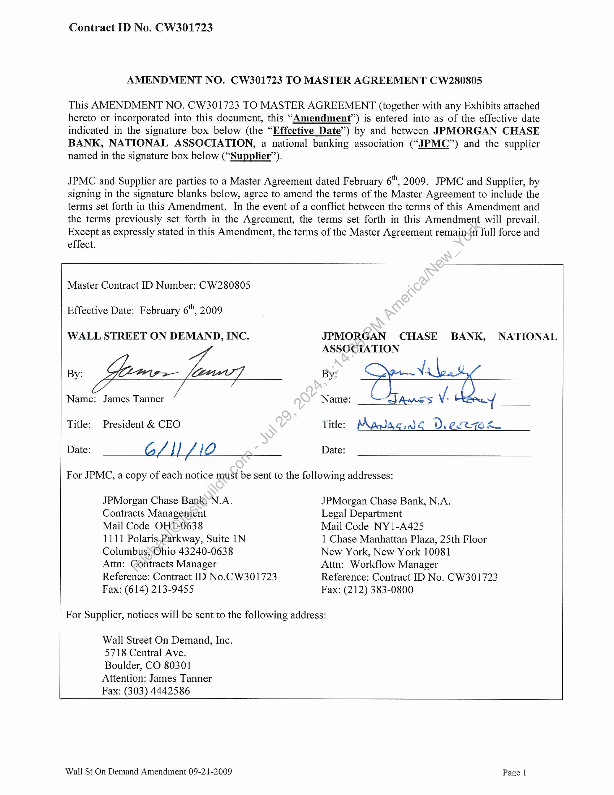
```  
```col-md
Contract ID No. CW301723  
AMENDMENT NO. CW301723 TO MASTER AGREEMENT CW280805  
This AMENDMENT NO. CW301723 TO MASTER AGREEMENT (together with any Exhibits attached
hereto or incorporated into this document, this “Amendment”) is entered into as of the effective date
indicated in the signature box below (the “Effective Date”) by and between JPMORGAN CHASE
BANK, NATIONAL ASSOCIATION, a national banking association (“JPMC’) and the supplier
named in the signature box below (“Supplier”).  
JPMC and Supplier are parties to a Master Agreement dated February 6", 2009. JPMC and Supplier, by
signing in the signature blanks below, agree to amend the terms of the Master Agreement to include the
terms set forth in this Amendment. In the event of a conflict between the terms of this Amendment and
the terms previously set forth in the Agreement, the terms set forth in this Amendment will prevail.
Except as expressly stated in this Amendment, the terms of the Master Agreement remain-in full force and
effect.  
Master Contract ID Number: CW280805  
Effective Date: February 6", 2009  
WALL STREET ON DEMAND, INC. JPMORGAN CHASE BANK, NATIONAL
ASSOCIATION
By: omen Duusy By: Ys  
Name: James Tanner Name: AMES v.  
=
Title: President & CEO Title: Meglag rad 6 Det  
Date: (VA ll Ps 10 Date:  
For JPMC, a copy of each notice must be sent to the following addresses:  
JPMorgan Chase Bank, N.A. JPMorgan Chase Bank, N.A.  
Contracts Management Legal Department  
Mail Code OH1-0638 Mail Code NY 1-A425  
1111 Polaris.Parkway, Suite 1N 1 Chase Manhattan Plaza, 25th Floor
Columbus;\Ohio 43240-0638 New York, New York 10081  
Attn: Contracts Manager Attn: Workflow Manager  
Reference: Contract ID No.CW301723 Reference: Contract ID No. CW301723
Fax: (614) 213-9455 Fax: (212) 383-0800  
For Supplier, notices will be sent to the following address:  
Wall Street On Demand, Inc.
5718 Central Ave.  
Boulder, CO 80301
Attention: James Tanner
Fax: (303) 4442586  
Wall St On Demand Amendment 09-21-2009 Page |  
```
````
Notes:    
````col
```col-md
flexGrow=.5
===
> [!info] [Page 2](_attachments/images_JPMC-Parent-3.6.1.20.2.12010_JPMorgan_AmendmenttoMSACW301723.pdf_210718/page_2.png)
> 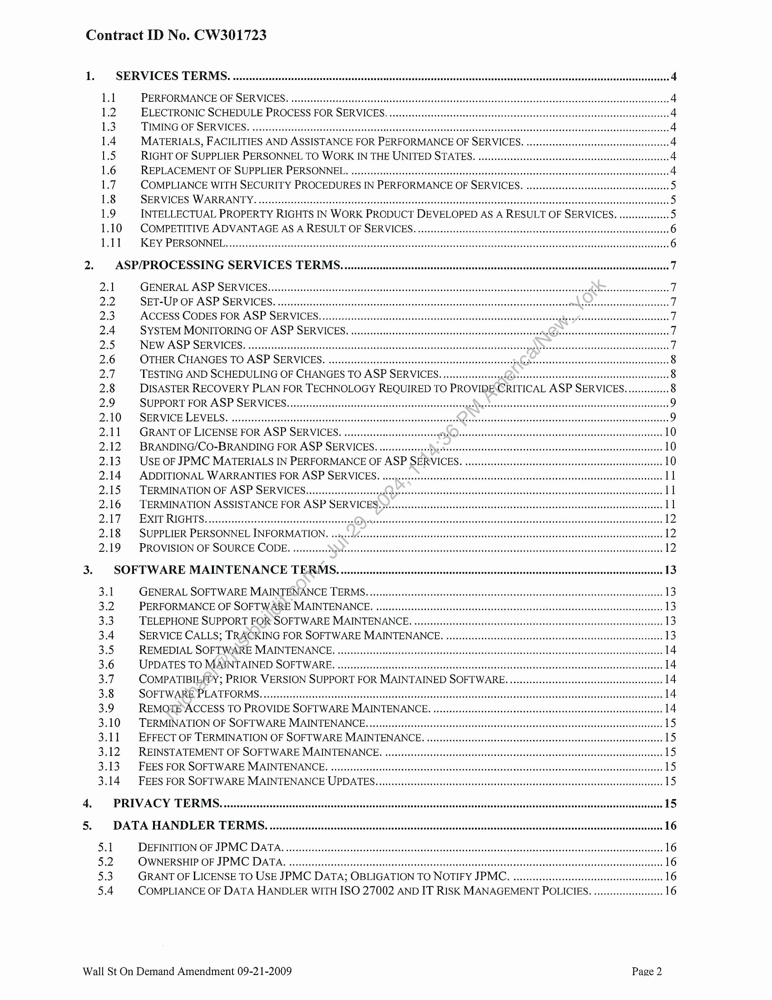
```  
```col-md
Contract ID No. CW301723  
1. SERVICES TERMG. .    
scssssssscsssssssssesesssssseassesesenseseneeeeseeee  
ll
12
13
1.4
Ls
1.6
L.7
1.8
1.9
1.10
11  
2. ASP/PROCESSING SERVICES TERMS.  
PERFORMANCE OF SERVICES.
ELECTRONIC SCHEDULE PROCESS FOR SERVICES.
TIMING OF SERVICES: sessssssssxsasiavces osversesannascaces
MATERIALS, FACILITIES AND ASSISTANCE FOR PERFORMANCE OF SERVICES
RIGHT OF SUPPLIER PERSONNEL TO WORK IN THE UNITED STATES. .
REPLACEMENT OF SUPPLIER PERSONNEL. .   
COMPLIANCE WITH SECURITY PROCEDURES IN PERFORMANCE OF SERVICES.
SERVICES WARRANTY .  :ca0sncns aenrenvar tmnt mi
INTELLECTUAL PROPERTY RIGHTS IN WORK PRODUCT DEVELOPED AS A RESULT OF SERVICES.
COMPETITIVE ADVANTAGE AS A RESULT OF SERVICES.
KEY PERSONNEL  
CommemrIynyaIyn UY anunukRaRARA B&B  
2.1 GENERAL ASP SERVICES.  
22 SET-UP OF ASP SERVICES. .
2.3 ACCESS CODES FOR ASP SERVICES.  

2.4 SYSTEM MONITORING OF ASP SERVICES,
25 NEW ASP SERVICES. .   
sssssessssesseoneees
2.6 OTHER CHANGES TO ASP SERVICES. .  

2.7 TESTING AND SCHEDULING OF CHANGES TO ASP SERVICES.
2.8 DISASTER RECOVERY PLAN FOR TECHNOLOGY REQUIRED TO PROVIDECRITICAL ASP SERVICES.
2.9 SUPPORT FOR ASP SERVICES.  

2.10 SERVICE LEVELS. «0.  
2.11. GRANT OF LICENSE FOR ASP SERVICES.
2.12 | BRANDING/CO-BRANDING FOR ASP SERVICES
2.13 USE OF JPMC MATERIALS IN PERFORMANCE OF ASP SERVICES.
2.14. ADDITIONAL WARRANTIES FOR ASP SERVICES
2.15 | TERMINATION OF ASP SERVICES
2.16 TERMINATION ASSISTANCE FOR ASP SERVICES
2.17. EXIT RIGHTS.
2.18 | SUPPLIER PERSONNEL INFORMATION. .
2.19 | PROVISION OF SOURCE CODE. .  
3. SOFTWARE MAINTENANGE, TERMSncssnsscsssnvsssosssoncssisenscovcosenerpevsocsasesenrecsscossannsenbavascasancnsbodenssersnseanioess 13
3.1 GENERAL SOFTWARE MAINTENANCE TERMS.  
3.2 PERFORMANCE OF SOFTWARE MAINTENANCE.
33 TELEPHONE SUPPORT FOR SOFTWARE MAINTENANCE. .
3.4 SERVICE CALLS; TRACKING FOR SOFTWARE MAINTENANCE. .
3.5 REMEDIAL SOFTWARE MAINTENANCE. .   
ssssssssessssessstesesseneseene
3.6 UPDATES TO NAQINTAINED SOFTWARE. .  sessscssessesssscscosesenssveseassesessseaenes eS
3.7 COMPATIBILITY; PRIOR VERSION SUPPORT FOR MAINTAINED SOFTWARE. . 14
3.8 SOFTWARE PLATFORMS. «ld
3.9 REMOTE’ACCESS TO PROVIDE SOFTWARE MAINTENANCE al 4.
3.10 | TERMINATION OF SOFTWARE MAINTENANCE.
3.11 EFFECT OF TERMINATION OF SOFTWARE MAINTENANCE. .
3.12 REINSTATEMENT OF SOFTWARE MAINTENANCE.
3.13. FEES FOR SOFTWARE MAINTENANCE. .
3.14. FEES FOR SOFTWARE MAINTENANCE UPDATES
4; PRIVACY TERM Siisesisassssvscesssecsseccescraseccccvestancorsanpeornsescsasacescsastvesswevesevscvsusrtassornustnastasssssnenesovturamnesinnsaeaninaseass 15
5. DATA HANDLER TERMG.    cccssssssscssssseseresssssssssseessuscecavevesensesessensuauauesesavacecesessesesesseseeesnseseseseessarseseseranes 16
5.1 DEFINITION OF JPMC DATA.  
5.2 OWNERSHIP OF JPMC DATA. .
5.3 GRANT OF LICENSE TO USE JPMC DATA; OBLIGATION TO NOTIFY JPMC.
5.4 COMPLIANCE OF DATA HANDLER WITH ISO 27002 AND IT RISK MANAGEMENT POLICIES.  
Wall St On Demand Amendment 09-21-2009 Page 2  
```
````
Notes:    
````col
```col-md
flexGrow=.5
===
> [!info] [Page 3](_attachments/images_JPMC-Parent-3.6.1.20.2.12010_JPMorgan_AmendmenttoMSACW301723.pdf_210718/page_3.png)
> 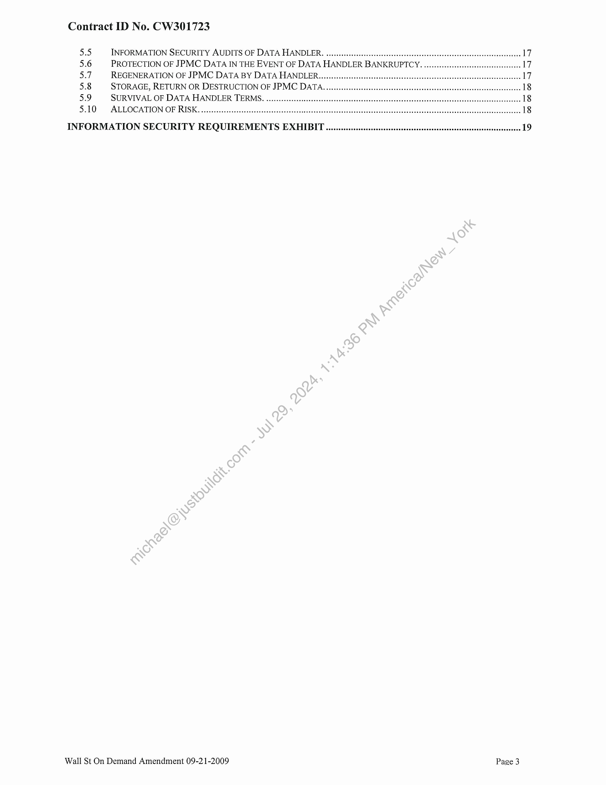
```  
```col-md
Contract ID No. CW301723  
5.5 INFORMATION SECURITY AUDITS OF DATA HANDLER, .  scccsssecsssesessesesesssseeseseseseceeseeeeseseenesteatenesuenteneeneaeene 17
5.6 PROTECTION OF JPMC DATA IN THE EVENT OF DATA HANDLER BANKRUPTCY.
5.7 REGENERATION OF JPMC DATA BY DATA HANDLER.  
5.8 STORAGE, RETURN OR DESTRUCTION OF JPMC DATA.
5.9 SURVIVAL OF DATA HANDLER TERMS.
5.10 | ALLOCATION OF RISK.
INFORMATION SECURITY REQUIREMENTS EXHIBIT .    
cssssssssssssesessecesssessseesseesessssssesessesnsseesesscensseesssess 19  
Wall St On Demand Amendment 09-21-2009 Page 3  
```
````
Notes:    
````col
```col-md
flexGrow=.5
===
> [!info] [Page 4](_attachments/images_JPMC-Parent-3.6.1.20.2.12010_JPMorgan_AmendmenttoMSACW301723.pdf_210718/page_4.png)
> 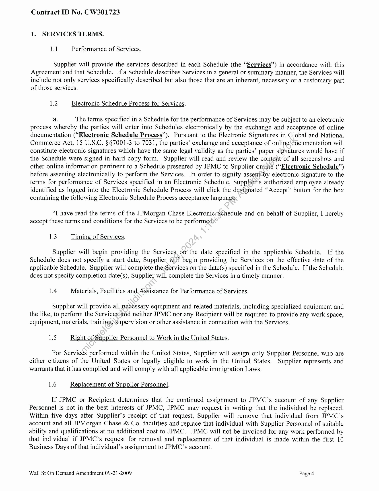
```  
```col-md
Contract ID No. CW301723  
1. SERVICES TERMS.  
el Performance of Services.  
Supplier will provide the services described in each Schedule (the “Services”) in accordance with this
Agreement and that Schedule. If a Schedule describes Services in a general or summary manner, the Services will
include not only services specifically described but also those that are an inherent, necessary or a customary part
of those services.  
1.2 Electronic Schedule Process for Services.  
a. The terms specified in a Schedule for the performance of Services may be subject to an electronic
process whereby the parties will enter into Schedules electronically by the exchange and acceptance of online
documentation (“Electronic Schedule Process”). Pursuant to the Electronic Signatures in Global and National
Commerce Act, 15 U.S.C. §§7001-3 to 7031, the parties’ exchange and acceptance of online‘documentation will
constitute electronic signatures which have the same legal validity as the parties’ paper signatures would have if
the Schedule were signed in hard copy form. Supplier will read and review the content of all screenshots and
other online information pertinent to a Schedule presented by JPMC to Supplier online (“Electronic Schedule”)
before assenting electronically to perform the Services. In order to signify assent’by electronic signature to the
terms for performance of Services specified in an Electronic Schedule, Suppliér’s authorized employee already
identified as logged into the Electronic Schedule Process will click the designated “Accept” button for the box
containing the following Electronic Schedule Process acceptance language:  
“T have read the terms of the JPMorgan Chase ElectroniccSchedule and on behalf of Supplier, I hereby
accept these terms and conditions for the Services to be performed?”  
1.3 Timing of Services.  
Supplier will begin providing the Services on the date specified in the applicable Schedule. If the
Schedule does not specify a start date, Supplier will begin providing the Services on the effective date of the
applicable Schedule. Supplier will complete the,Services on the date(s) specified in the Schedule. If the Schedule
does not specify completion date(s), Supplier will complete the Services in a timely manner.  
1.4 Materials, Facilities and.Assistance for Performance of Services.  
Supplier will provide all necessary equipment and related materials, including specialized equipment and
the like, to perform the Services-and neither JPMC nor any Recipient will be required to provide any work space,
equipment, materials, training; Supervision or other assistance in connection with the Services.  
1.5 Right of Supplier Personnel to Work in the United States.  
For Services performed within the United States, Supplier will assign only Supplier Personnel who are
either citizens of the United States or legally eligible to work in the United States. Supplier represents and
warrants that it has complied and will comply with all applicable immigration Laws.  
1.6 Replacement of Supplier Personnel.  
If JPMC or Recipient determines that the continued assignment to JPMC’s account of any Supplier
Personnel is not in the best interests of JPMC, JPMC may request in writing that the individual be replaced.
Within five days after Supplier’s receipt of that request, Supplier will remove that individual from JPMC’s
account and all JPMorgan Chase & Co. facilities and replace that individual with Supplier Personnel of suitable
ability and qualifications at no additional cost to JPMC. JPMC will not be invoiced for any work performed by
that individual if JPMC’s request for removal and replacement of that individual is made within the first 10
Business Days of that individual’s assignment to JPMC’s account.  
Wall St On Demand Amendment 09-21-2009 Page 4  
```
````
Notes:    
````col
```col-md
flexGrow=.5
===
> [!info] [Page 5](_attachments/images_JPMC-Parent-3.6.1.20.2.12010_JPMorgan_AmendmenttoMSACW301723.pdf_210718/page_5.png)
> 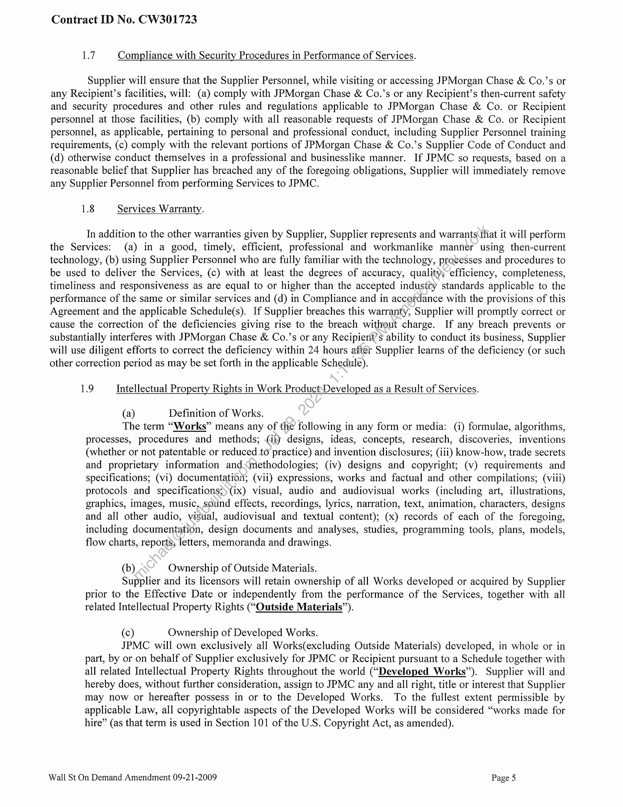
```  
```col-md
Contract ID No. CW301723  
1.7 Compliance with Security Procedures in Performance of Services.  
Supplier will ensure that the Supplier Personnel, while visiting or accessing JPMorgan Chase & Co.’s or
any Recipient’s facilities, will: (a) comply with JPMorgan Chase & Co.’s or any Recipient’s then-current safety
and security procedures and other rules and regulations applicable to JPMorgan Chase & Co. or Recipient
personnel at those facilities, (b) comply with all reasonable requests of JPMorgan Chase & Co. or Recipient
personnel, as applicable, pertaining to personal and professional conduct, including Supplier Personnel training
requirements, (c) comply with the relevant portions of JPMorgan Chase & Co.’s Supplier Code of Conduct and
(d) otherwise conduct themselves in a professional and businesslike manner. If JPMC so requests, based on a
reasonable belief that Supplier has breached any of the foregoing obligations, Supplier will immediately remove
any Supplier Personnel from performing Services to JPMC.  
1.8 Services Warranty.  
In addition to the other warranties given by Supplier, Supplier represents and warrants that it will perform
the Services: (a) in a good, timely, efficient, professional and workmanlike manter using then-current
technology, (b) using Supplier Personnel who are fully familiar with the technology, processes and procedures to
be used to deliver the Services, (c) with at least the degrees of accuracy, quality; efficiency, completeness,
timeliness and responsiveness as are equal to or higher than the accepted industty standards applicable to the
performance of the same or similar services and (d) in Compliance and in accordance with the provisions of this
Agreement and the applicable Schedule(s). If Supplier breaches this warranty, Supplier will promptly correct or
cause the correction of the deficiencies giving rise to the breach without charge. If any breach prevents or
substantially interferes with JPMorgan Chase & Co.’s or any Recipierit’s ability to conduct its business, Supplier
will use diligent efforts to correct the deficiency within 24 hours after Supplier learns of the deficiency (or such
other correction period as may be set forth in the applicable Schedule).  
1.9 Intellectual Property Rights in Work Product:Developed as a Result of Services.  
(a) Definition of Works.  
The term “Works” means any of the following in any form or media: (i) formulae, algorithms,
processes, procedures and methods; (i) designs, ideas, concepts, research, discoveries, inventions
(whether or not patentable or reduced to practice) and invention disclosures; (iii) know-how, trade secrets
and proprietary information and<methodologies; (iv) designs and copyright; (v) requirements and
specifications; (vi) documentation; (vii) expressions, works and factual and other compilations; (viii)
protocols and specifications;;(ix) visual, audio and audiovisual works (including art, illustrations,
graphics, images, music, sound effects, recordings, lyrics, narration, text, animation, characters, designs
and all other audio, visual, audiovisual and textual content); (x) records of each of the foregoing,
including documentation, design documents and analyses, studies, programming tools, plans, models,
flow charts, reports, letters, memoranda and drawings.  
(b) Ownership of Outside Materials.  
Supplier and its licensors will retain ownership of all Works developed or acquired by Supplier
prior to the Effective Date or independently from the performance of the Services, together with all
related Intellectual Property Rights (“Outside Materials”).  
(c) Ownership of Developed Works.  
JPMC will own exclusively all Works(excluding Outside Materials) developed, in whole or in
part, by or on behalf of Supplier exclusively for JPMC or Recipient pursuant to a Schedule together with
all related Intellectual Property Rights throughout the world (“Developed Works”). Supplier will and
hereby does, without further consideration, assign to JPMC any and all right, title or interest that Supplier
may now or hereafter possess in or to the Developed Works. To the fullest extent permissible by
applicable Law, all copyrightable aspects of the Developed Works will be considered “works made for
hire” (as that term is used in Section 101 of the U.S. Copyright Act, as amended).  
Wall St On Demand Amendment 09-21-2009 Page 5  
```
````
Notes:    
````col
```col-md
flexGrow=.5
===
> [!info] [Page 6](_attachments/images_JPMC-Parent-3.6.1.20.2.12010_JPMorgan_AmendmenttoMSACW301723.pdf_210718/page_6.png)
> 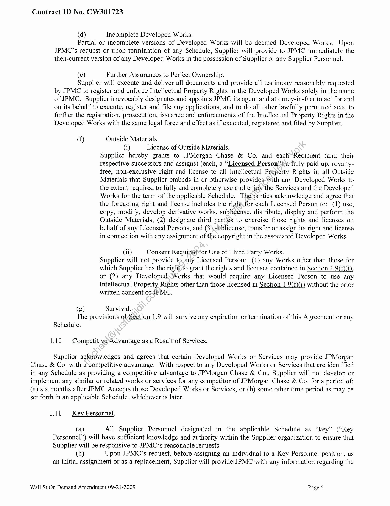
```  
```col-md
Contract ID No. CW301723  
(d) Incomplete Developed Works.  
Partial or incomplete versions of Developed Works will be deemed Developed Works. Upon
JPMC’s request or upon termination of any Schedule, Supplier will provide to JPMC immediately the
then-current version of any Developed Works in the possession of Supplier or any Supplier Personnel.  
(e) Further Assurances to Perfect Ownership.  
Supplier will execute and deliver all documents and provide all testimony reasonably requested
by JPMC to register and enforce Intellectual Property Rights in the Developed Works solely in the name
of JPMC. Supplier irrevocably designates and appoints JPMC its agent and attorney-in-fact to act for and
on its behalf to execute, register and file any applications, and to do all other lawfully permitted acts, to
further the registration, prosecution, issuance and enforcements of the Intellectual Property Rights in the
Developed Works with the same legal force and effect as if executed, registered and filed by Supplier.  
(f) Outside Materials.
(i) License of Outside Materials.  
Supplier hereby grants to JPMorgan Chase & Co. and each Recipient (and their
respective successors and assigns) (each, a “Licensed Person”):a fully-paid up, royaltyfree, non-exclusive right and license to all Intellectual Property Rights in all Outside
Materials that Supplier embeds in or otherwise provides-with any Developed Works to
the extent required to fully and completely use and enjoy the Services and the Developed
Works for the term of the applicable Schedule. The parties acknowledge and agree that
the foregoing right and license includes the right.for each Licensed Person to: (1) use,
copy, modify, develop derivative works, sublicense, distribute, display and perform the
Outside Materials, (2) designate third partieS’ to exercise those rights and licenses on
behalf of any Licensed Persons, and (3),sublicense, transfer or assign its right and license
in connection with any assignment of the copyright in the associated Developed Works.  
(ii) Consent Required'for Use of Third Party Works.
Supplier will not provide to any Licensed Person: (1) any Works other than those for
which Supplier has the right to grant the rights and licenses contained in Section 1.9(f)(i),
or (2) any Developed. Works that would require any Licensed Person to use any
Intellectual Property Rights other than those licensed in Section 1.9(f)(i) without the prior
written consent of SPMC.  
(g) Survival.
The provisions of-Séction 1.9 will survive any expiration or termination of this Agreement or any
Schedule.  
1.10 Competitive:Advantage as a Result of Services.  
Supplier acknowledges and agrees that certain Developed Works or Services may provide JPMorgan
Chase & Co. with a competitive advantage. With respect to any Developed Works or Services that are identified
in any Schedule as providing a competitive advantage to JPMorgan Chase & Co., Supplier will not develop or
implement any similar or related works or services for any competitor of JPMorgan Chase & Co. for a period of:
(a) six months after JPMC Accepts those Developed Works or Services, or (b) some other time period as may be
set forth in an applicable Schedule, whichever is later.  
1.11 Key Personnel.  
(a) All Supplier Personnel designated in the applicable Schedule as “key” (“Key
Personnel”) will have sufficient knowledge and authority within the Supplier organization to ensure that
Supplier will be responsive to JPMC’s reasonable requests.  
(b) Upon JPMC’s request, before assigning an individual to a Key Personnel position, as
an initial assignment or as a replacement, Supplier will provide JPMC with any information regarding the  
Wall St On Demand Amendment 09-21-2009 Page 6  
```
````
Notes:    
````col
```col-md
flexGrow=.5
===
> [!info] [Page 7](_attachments/images_JPMC-Parent-3.6.1.20.2.12010_JPMorgan_AmendmenttoMSACW301723.pdf_210718/page_7.png)
> 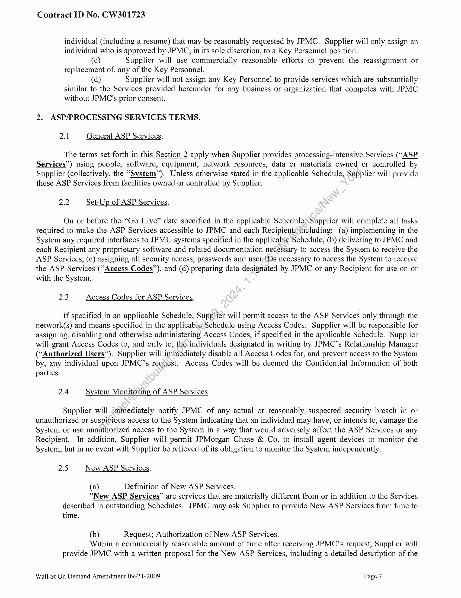
```  
```col-md
Contract ID No. CW301723  
individual (including a resume) that may be reasonably requested by JPMC. Supplier will only assign an
individual who is approved by JPMC, in its sole discretion, to a Key Personnel position.  
(c) Supplier will use commercially reasonable efforts to prevent the reassignment or
replacement of, any of the Key Personnel.
(d) Supplier will not assign any Key Personnel to provide services which are substantially  
similar to the Services provided hereunder for any business or organization that competes with JPMC
without JPMC's prior consent.  
2. ASP/PROCESSING SERVICES TERMS.
2.1 General ASP Services.  
The terms set forth in this Section 2 apply when Supplier provides processing-intensive Services (“ASP
Services”) using people, software, equipment, network resources, data or materials owned or controlled by
Supplier (collectively, the “System”). Unless otherwise stated in the applicable Schedule, Supplier will provide
these ASP Services from facilities owned or controlled by Supplier.  
oud Set-Up of ASP Services.  
On or before the “Go Live” date specified in the applicable Schedule,\Supplier will complete all tasks
required to make the ASP Services accessible to JPMC and each Recipients‘including: (a) implementing in the
System any required interfaces to JPMC systems specified in the applicable Schedule, (b) delivering to JPMC and
each Recipient any proprietary software and related documentation necessary to access the System to receive the
ASP Services, (c) assigning all security access, passwords and user-IDs necessary to access the System to receive
the ASP Services (“Access Codes”), and (d) preparing data designated by JPMC or any Recipient for use on or
with the System.  
2.3 Access Codes for ASP Services.  
If specified in an applicable Schedule, Supplier will permit access to the ASP Services only through the
network(s) and means specified in the applicable\Schedule using Access Codes. Supplier will be responsible for
assigning, disabling and otherwise administering Access Codes, if specified in the applicable Schedule. Supplier
will grant Access Codes to, and only to, the individuals designated in writing by JPMC’s Relationship Manager
(“Authorized Users”). Supplier will immediately disable all Access Codes for, and prevent access to the System
by, any individual upon JPMC’s request. Access Codes will be deemed the Confidential Information of both
parties.  
2.4 System Monitoring of ASP Services.  
Supplier will immediately notify JPMC of any actual or reasonably suspected security breach in or
unauthorized or suspicious access to the System indicating that an individual may have, or intends to, damage the
System or use unauthorized access to the System in a way that would adversely affect the ASP Services or any
Recipient. In addition, Supplier will permit JPMorgan Chase & Co. to install agent devices to monitor the
System, but in no event will Supplier be relieved of its obligation to monitor the System independently.  
2,5 New ASP Services.  
(a) Definition of New ASP Services.  
“New ASP Services” are services that are materially different from or in addition to the Services
described in outstanding Schedules. JPMC may ask Supplier to provide New ASP Services from time to
time.  
(b) Request; Authorization of New ASP Services.  
Within a commercially reasonable amount of time after receiving JPMC’s request, Supplier will
provide JPMC with a written proposal for the New ASP Services, including a detailed description of the  
Wall St On Demand Amendment 09-21-2009 Page 7  
```
````
Notes:    
````col
```col-md
flexGrow=.5
===
> [!info] [Page 8](_attachments/images_JPMC-Parent-3.6.1.20.2.12010_JPMorgan_AmendmenttoMSACW301723.pdf_210718/page_8.png)
> 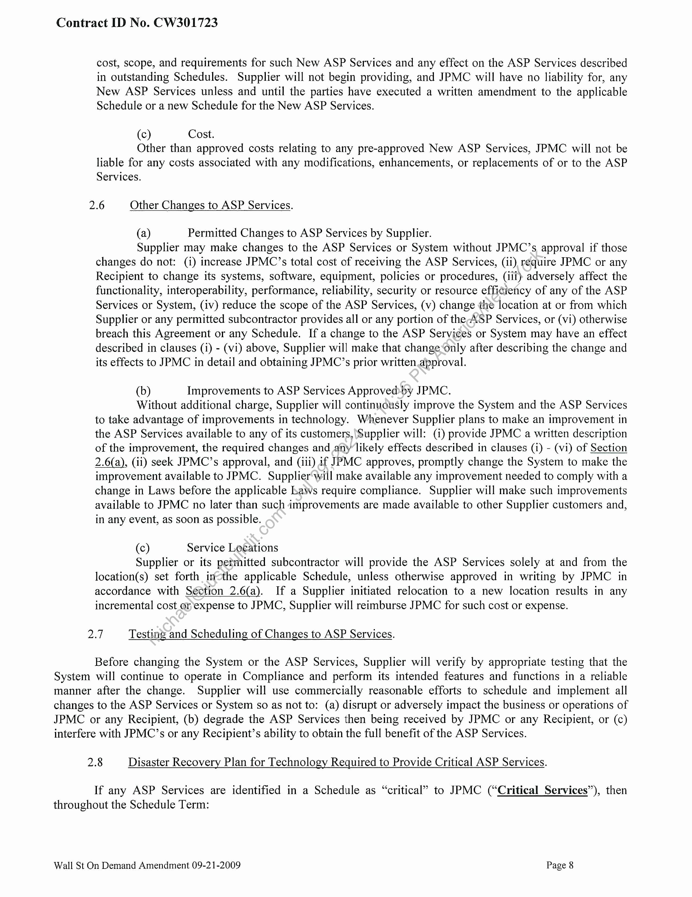
```  
```col-md
Contract ID No. CW301723  
cost, scope, and requirements for such New ASP Services and any effect on the ASP Services described
in outstanding Schedules. Supplier will not begin providing, and JPMC will have no liability for, any
New ASP Services unless and until the parties have executed a written amendment to the applicable
Schedule or a new Schedule for the New ASP Services.  
(c) Cost.  
Other than approved costs relating to any pre-approved New ASP Services, JPMC will not be
liable for any costs associated with any modifications, enhancements, or replacements of or to the ASP
Services.  
2.6 Other Changes to ASP Services.  
(a) Permitted Changes to ASP Services by Supplier.  
Supplier may make changes to the ASP Services or System without JPMC’s approval if those
changes do not: (i) increase JPMC’s total cost of receiving the ASP Services, (ii), require JPMC or any
Recipient to change its systems, software, equipment, policies or procedures, (iti) adversely affect the
functionality, interoperability, performance, reliability, security or resource efficiency of any of the ASP
Services or System, (iv) reduce the scope of the ASP Services, (v) change the location at or from which
Supplier or any permitted subcontractor provides all or any portion of the ASP Services, or (vi) otherwise
breach this Agreement or any Schedule. If a change to the ASP Services or System may have an effect
described in clauses (i) - (vi) above, Supplier will make that change ‘only after describing the change and
its effects to JPMC in detail and obtaining JPMC’s prior written approval.  
(b) Improvements to ASP Services Approvedby JPMC.  
Without additional charge, Supplier will continuously improve the System and the ASP Services
to take advantage of improvements in technology. Whenever Supplier plans to make an improvement in
the ASP Services available to any of its customers,\Supplier will: (i) provide JPMC a written description
of the improvement, the required changes and any likely effects described in clauses (i) - (vi) of Section
2.6(a), (ii) seek JPMC’s approval, and (iii) if JPMC approves, promptly change the System to make the
improvement available to JPMC. Supplier‘will make available any improvement needed to comply with a
change in Laws before the applicable Laws require compliance. Supplier will make such improvements
available to JPMC no later than such improvements are made available to other Supplier customers and,
in any event, as soon as possible.  
(c) Service Locations  
Supplier or its petmitted subcontractor will provide the ASP Services solely at and from the
location(s) set forth inothe applicable Schedule, unless otherwise approved in writing by JPMC in
accordance with Section 2.6(a). If a Supplier initiated relocation to a new location results in any
incremental cost orexpense to JPMC, Supplier will reimburse JPMC for such cost or expense.  
2.7 Testing and Scheduling of Changes to ASP Services.  
Before changing the System or the ASP Services, Supplier will verify by appropriate testing that the
System will continue to operate in Compliance and perform its intended features and functions in a reliable
manner after the change. Supplier will use commercially reasonable efforts to schedule and implement all
changes to the ASP Services or System so as not to: (a) disrupt or adversely impact the business or operations of
JPMC or any Recipient, (b) degrade the ASP Services then being received by JPMC or any Recipient, or (c)
interfere with JPMC’s or any Recipient’s ability to obtain the full benefit of the ASP Services.  
2.8 Disaster Recovery Plan for Technology Required to Provide Critical ASP Services.  
If any ASP Services are identified in a Schedule as “critical” to JPMC (“Critical Services”), then
throughout the Schedule Term:  
Wall St On Demand Amendment 09-21-2009 Page 8  
```
````
Notes:    
````col
```col-md
flexGrow=.5
===
> [!info] [Page 9](_attachments/images_JPMC-Parent-3.6.1.20.2.12010_JPMorgan_AmendmenttoMSACW301723.pdf_210718/page_9.png)
> 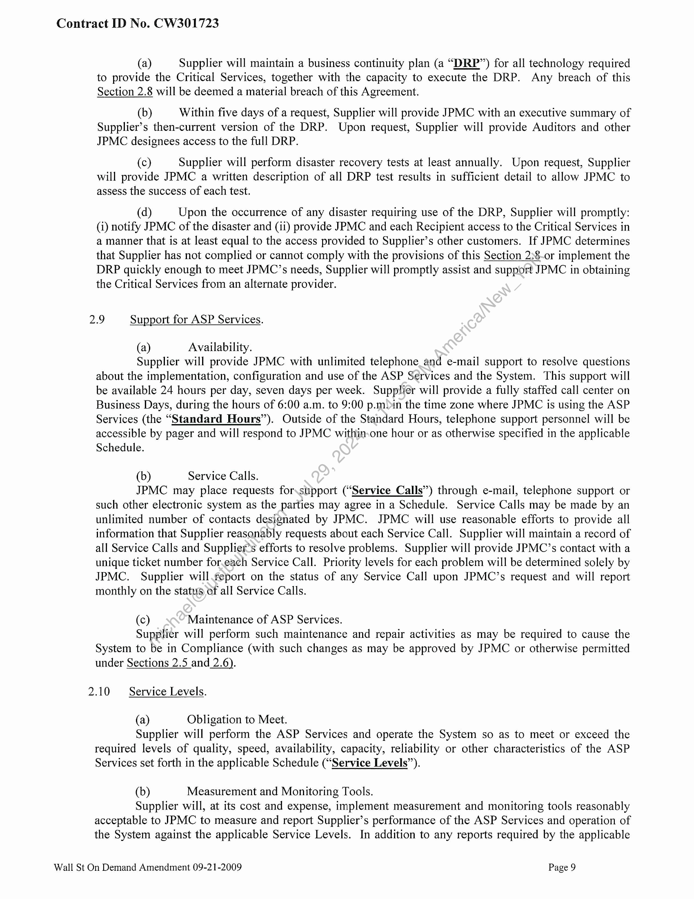
```  
```col-md
Contract ID No. CW301723  
(a) Supplier will maintain a business continuity plan (a “DRP”) for all technology required
to provide the Critical Services, together with the capacity to execute the DRP. Any breach of this
Section 2.8 will be deemed a material breach of this Agreement.  
(b) Within five days of a request, Supplier will provide JPMC with an executive summary of
Supplier’s then-current version of the DRP. Upon request, Supplier will provide Auditors and other
JPMC designees access to the full DRP.  
(c) Supplier will perform disaster recovery tests at least annually. Upon request, Supplier
will provide JPMC a written description of all DRP test results in sufficient detail to allow JPMC to
assess the success of each test.  
(d) Upon the occurrence of any disaster requiring use of the DRP, Supplier will promptly:
(i) notify JPMC of the disaster and (ii) provide JPMC and each Recipient access to the Critical Services in
a manner that is at least equal to the access provided to Supplier’s other customers. If JPMC determines
that Supplier has not complied or cannot comply with the provisions of this Section 2:8-or implement the
DRP quickly enough to meet JPMC’s needs, Supplier will promptly assist and support JPMC in obtaining
the Critical Services from an alternate provider.  
2.9 Support for ASP Services.  
(a) Availability.  
Supplier will provide JPMC with unlimited telephone_and e-mail support to resolve questions
about the implementation, configuration and use of the ASP Services and the System. This support will
be available 24 hours per day, seven days per week. Supplier will provide a fully staffed call center on
Business Days, during the hours of 6:00 a.m. to 9:00 p.m>in the time zone where JPMC is using the ASP
Services (the “Standard Hours”). Outside of the Standard Hours, telephone support personnel will be
accessible by pager and will respond to JPMC within.one hour or as otherwise specified in the applicable
Schedule.  
(b) Service Calls.  
JPMC may place requests for.support (“Service Calls”) through e-mail, telephone support or
such other electronic system as the parties may agree in a Schedule. Service Calls may be made by an
unlimited number of contacts designated by JPMC. JPMC will use reasonable efforts to provide all
information that Supplier reasonably requests about each Service Call. Supplier will maintain a record of
all Service Calls and Supplier’s efforts to resolve problems. Supplier will provide JPMC’s contact with a
unique ticket number foreach Service Call. Priority levels for each problem will be determined solely by
JPMC. Supplier will.report on the status of any Service Call upon JPMC’s request and will report
monthly on the status of all Service Calls.  
(c) Maintenance of ASP Services.  
Supplier will perform such maintenance and repair activities as may be required to cause the
System to be in Compliance (with such changes as may be approved by JPMC or otherwise permitted
under Sections 2.5 and _2.6).  
2.10 Service Levels.  
(a) Obligation to Meet.  
Supplier will perform the ASP Services and operate the System so as to meet or exceed the
required levels of quality, speed, availability, capacity, reliability or other characteristics of the ASP
Services set forth in the applicable Schedule (“Service Levels”).  
(b) Measurement and Monitoring Tools.  
Supplier will, at its cost and expense, implement measurement and monitoring tools reasonably
acceptable to JPMC to measure and report Supplier’s performance of the ASP Services and operation of
the System against the applicable Service Levels. In addition to any reports required by the applicable  
Wall St On Demand Amendment 09-21-2009 Page 9  
```
````
Notes:    
````col
```col-md
flexGrow=.5
===
> [!info] [Page 10](_attachments/images_JPMC-Parent-3.6.1.20.2.12010_JPMorgan_AmendmenttoMSACW301723.pdf_210718/page_10.png)
> 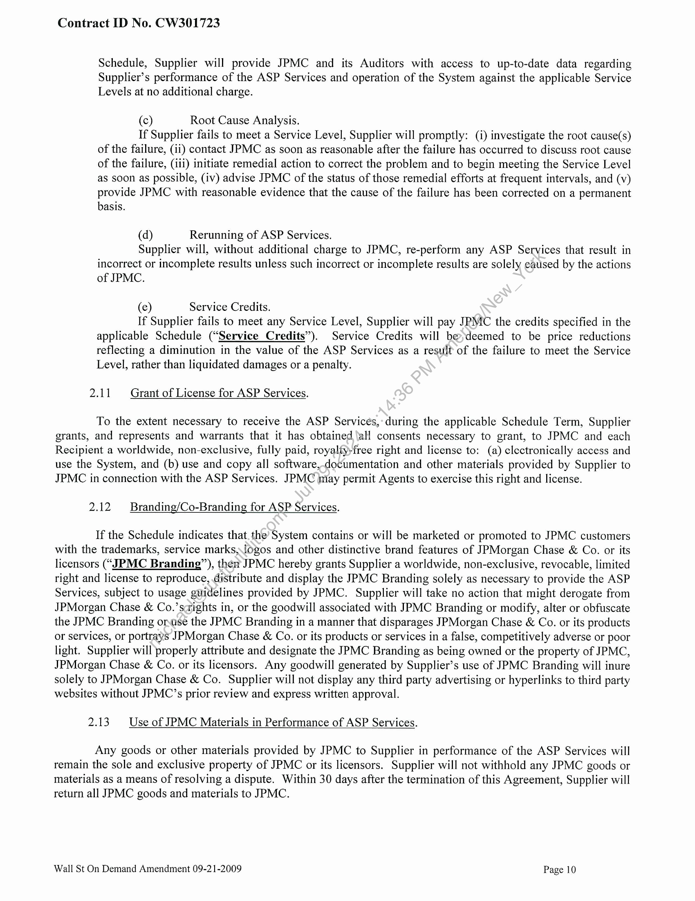
```  
```col-md
Contract ID No. CW301723  
Schedule, Supplier will provide JPMC and its Auditors with access to up-to-date data regarding
Supplier’s performance of the ASP Services and operation of the System against the applicable Service
Levels at no additional charge.  
(c) Root Cause Analysis.  
If Supplier fails to meet a Service Level, Supplier will promptly: (i) investigate the root cause(s)
of the failure, (ii) contact JPMC as soon as reasonable after the failure has occurred to discuss root cause
of the failure, (iii) initiate remedial action to correct the problem and to begin meeting the Service Level
as soon as possible, (iv) advise JPMC of the status of those remedial efforts at frequent intervals, and (v)
provide JPMC with reasonable evidence that the cause of the failure has been corrected on a permanent
basis.  
(d) Rerunning of ASP Services.  
Supplier will, without additional charge to JPMC, re-perform any ASP Services that result in
incorrect or incomplete results unless such incorrect or incomplete results are solely caused by the actions
of JPMC.  
(e) Service Credits.  
If Supplier fails to meet any Service Level, Supplier will pay JPMC the credits specified in the
applicable Schedule (“Service Credits”). Service Credits will be,deemed to be price reductions
reflecting a diminution in the value of the ASP Services as a result of the failure to meet the Service
Level, rather than liquidated damages or a penalty.  
2.11 Grant of License for ASP Services.  
To the extent necessary to receive the ASP Services, during the applicable Schedule Term, Supplier
grants, and represents and warrants that it has obtained \all consents necessary to grant, to JPMC and each
Recipient a worldwide, non-exclusive, fully paid, royalty-free right and license to: (a) electronically access and
use the System, and (b) use and copy all software,documentation and other materials provided by Supplier to
JPMC in connection with the ASP Services. JPMC may permit Agents to exercise this right and license.  
2.12 Branding/Co-Branding for ASP Services.  
If the Schedule indicates that. the’ System contains or will be marketed or promoted to JPMC customers
with the trademarks, service marks,Jogos and other distinctive brand features of JPMorgan Chase & Co. or its
licensors (“JPMC Branding”), ther JPMC hereby grants Supplier a worldwide, non-exclusive, revocable, limited
right and license to reproduce, distribute and display the JPMC Branding solely as necessary to provide the ASP
Services, subject to usage guidelines provided by JPMC. Supplier will take no action that might derogate from
JPMorgan Chase & Co.’scights in, or the goodwill associated with JPMC Branding or modify, alter or obfuscate
the JPMC Branding oruse the JPMC Branding in a manner that disparages JPMorgan Chase & Co. or its products
or services, or portrays JPMorgan Chase & Co. or its products or services in a false, competitively adverse or poor
light. Supplier will properly attribute and designate the JPMC Branding as being owned or the property of JPMC,
JPMorgan Chase & Co. or its licensors. Any goodwill generated by Supplier’s use of JPMC Branding will inure
solely to JPMorgan Chase & Co. Supplier will not display any third party advertising or hyperlinks to third party
websites without JPMC’s prior review and express written approval.  
2.13 Use of JPMC Materials in Performance of ASP Services.  
Any goods or other materials provided by JPMC to Supplier in performance of the ASP Services will
remain the sole and exclusive property of JPMC or its licensors. Supplier will not withhold any JPMC goods or
materials as a means of resolving a dispute. Within 30 days after the termination of this Agreement, Supplier will
return all JPMC goods and materials to JPMC.  
Wall St On Demand Amendment 09-21-2009 Page 10  
```
````
Notes:    
````col
```col-md
flexGrow=.5
===
> [!info] [Page 11](_attachments/images_JPMC-Parent-3.6.1.20.2.12010_JPMorgan_AmendmenttoMSACW301723.pdf_210718/page_11.png)
> 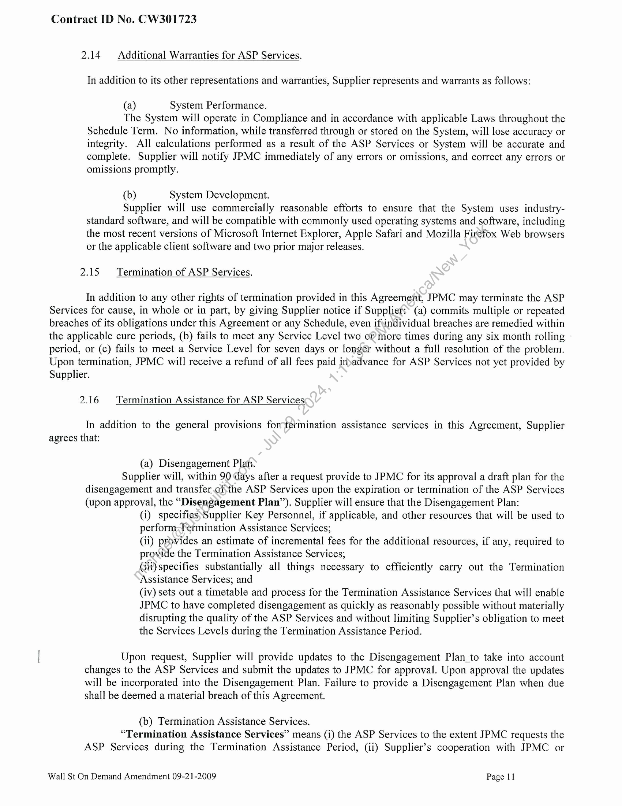
```  
```col-md
Contract ID No. CW301723  
2.14 Additional Warranties for ASP Services.  
In addition to its other representations and warranties, Supplier represents and warrants as follows:  
(a) System Performance.  
The System will operate in Compliance and in accordance with applicable Laws throughout the
Schedule Term. No information, while transferred through or stored on the System, will lose accuracy or
integrity. All calculations performed as a result of the ASP Services or System will be accurate and
complete. Supplier will notify JPMC immediately of any errors or omissions, and correct any errors or
omissions promptly.  
(b) System Development.  
Supplier will use commercially reasonable efforts to ensure that the System uses industrystandard software, and will be compatible with commonly used operating systems and software, including
the most recent versions of Microsoft Internet Explorer, Apple Safari and Mozilla Firefox Web browsers
or the applicable client software and two prior major releases.  
2.15 Termination of ASP Services.  
In addition to any other rights of termination provided in this Agreement, JPMC may terminate the ASP
Services for cause, in whole or in part, by giving Supplier notice if Suppliet: (a) commits multiple or repeated
breaches of its obligations under this Agreement or any Schedule, even iftindividual breaches are remedied within
the applicable cure periods, (b) fails to meet any Service Level two or more times during any six month rolling
period, or (c) fails to meet a Service Level for seven days or longer without a full resolution of the problem.
Upon termination, JPMC will receive a refund of all fees paid irbadvance for ASP Services not yet provided by
Supplier.  
2.16 Termination Assistance for ASP Services;  
In addition to the general provisions for termination assistance services in this Agreement, Supplier
agrees that:  
(a) Disengagement Plan:  
Supplier will, within 90 days after a request provide to JPMC for its approval a draft plan for the
disengagement and transfer.of,the ASP Services upon the expiration or termination of the ASP Services
(upon approval, the “Disengagement Plan”). Supplier will ensure that the Disengagement Plan:  
(i) specifiesSupplier Key Personnel, if applicable, and other resources that will be used to
perform-Termination Assistance Services;  
(ii) provides an estimate of incremental fees for the additional resources, if any, required to
provide the Termination Assistance Services;  
Gii) specifies substantially all things necessary to efficiently carry out the Termination
Assistance Services; and  
(iv) sets out a timetable and process for the Termination Assistance Services that will enable
JPMC to have completed disengagement as quickly as reasonably possible without materially
disrupting the quality of the ASP Services and without limiting Supplier’s obligation to meet
the Services Levels during the Termination Assistance Period.  
Upon request, Supplier will provide updates to the Disengagement Plan_to take into account
changes to the ASP Services and submit the updates to JPMC for approval. Upon approval the updates
will be incorporated into the Disengagement Plan. Failure to provide a Disengagement Plan when due
shall be deemed a material breach of this Agreement.  
(b) Termination Assistance Services.  
“Termination Assistance Services” means (i) the ASP Services to the extent JPMC requests the
ASP Services during the Termination Assistance Period, (ii) Supplier’s cooperation with JPMC or  
Wall St On Demand Amendment 09-21-2009 Page 11  
```
````
Notes:    
````col
```col-md
flexGrow=.5
===
> [!info] [Page 12](_attachments/images_JPMC-Parent-3.6.1.20.2.12010_JPMorgan_AmendmenttoMSACW301723.pdf_210718/page_12.png)
> 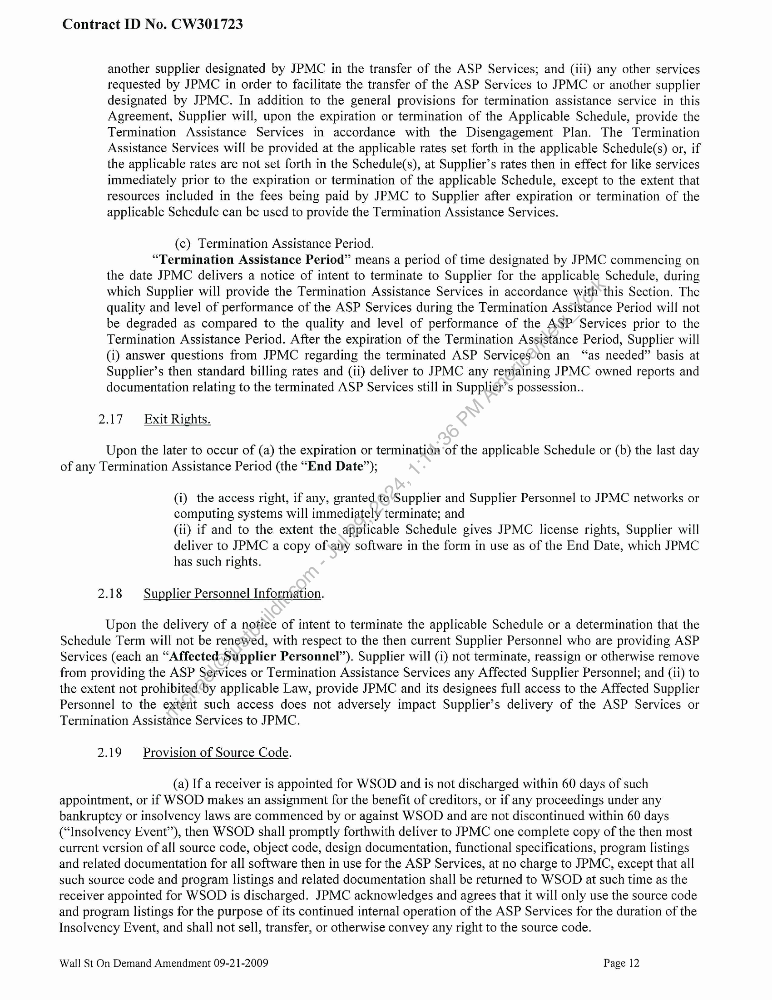
```  
```col-md
Contract ID No. CW301723  
another supplier designated by JPMC in the transfer of the ASP Services; and (iii) any other services
requested by JPMC in order to facilitate the transfer of the ASP Services to JPMC or another supplier
designated by JPMC. In addition to the general provisions for termination assistance service in this
Agreement, Supplier will, upon the expiration or termination of the Applicable Schedule, provide the
Termination Assistance Services in accordance with the Disengagement Plan. The Termination
Assistance Services will be provided at the applicable rates set forth in the applicable Schedule(s) or, if
the applicable rates are not set forth in the Schedule(s), at Supplier’s rates then in effect for like services
immediately prior to the expiration or termination of the applicable Schedule, except to the extent that
resources included in the fees being paid by JPMC to Supplier after expiration or termination of the
applicable Schedule can be used to provide the Termination Assistance Services.  
(c) Termination Assistance Period.  
“Termination Assistance Period” means a period of time designated by JPMC commencing on
the date JPMC delivers a notice of intent to terminate to Supplier for the applicable Schedule, during
which Supplier will provide the Termination Assistance Services in accordance with this Section. The
quality and level of performance of the ASP Services during the Termination Assistance Period will not
be degraded as compared to the quality and level of performance of the ASP Services prior to the
Termination Assistance Period. After the expiration of the Termination Assistance Period, Supplier will
(i) answer questions from JPMC regarding the terminated ASP Services0on an “as needed” basis at
Supplier’s then standard billing rates and (ii) deliver to JPMC any remaining JPMC owned reports and
documentation relating to the terminated ASP Services still in Supplier’s possession.  
  
2.17 Exit Rights.  
Upon the later to occur of (a) the expiration or termination of the applicable Schedule or (b) the last day
of any Termination Assistance Period (the “End Date”);  
(i) the access right, if any, granted fo Supplier and Supplier Personnel to JPMC networks or
computing systems will immediately terminate; and  
(ii) if and to the extent the applicable Schedule gives JPMC license rights, Supplier will
deliver to JPMC a copy of-any software in the form in use as of the End Date, which JPMC
has such rights.  
2.18 Supplier Personnel Information.  
Upon the delivery of a notice of intent to terminate the applicable Schedule or a determination that the
Schedule Term will not be renewed, with respect to the then current Supplier Personnel who are providing ASP
Services (each an “Affected Supplier Personnel”). Supplier will (i) not terminate, reassign or otherwise remove
from providing the ASP Services or Termination Assistance Services any Affected Supplier Personnel; and (ii) to
the extent not prohibited‘by applicable Law, provide JPMC and its designees full access to the Affected Supplier
Personnel to the extent such access does not adversely impact Supplier’s delivery of the ASP Services or
Termination Assistance Services to JPMC.  
2.19 Provision of Source Code.  
(a) If a receiver is appointed for WSOD and is not discharged within 60 days of such
appointment, or if WSOD makes an assignment for the benefit of creditors, or if any proceedings under any
bankruptcy or insolvency laws are commenced by or against WSOD and are not discontinued within 60 days
(“Insolvency Event”), then WSOD shall promptly forthwith deliver to JPMC one complete copy of the then most
current version of all source code, object code, design documentation, functional specifications, program listings
and related documentation for all software then in use for the ASP Services, at no charge to JPMC, except that all
such source code and program listings and related documentation shall be returned to WSOD at such time as the
receiver appointed for WSOD is discharged. JPMC acknowledges and agrees that it will only use the source code
and program listings for the purpose of its continued internal operation of the ASP Services for the duration of the
Insolvency Event, and shall not sell, transfer, or otherwise convey any right to the source code.  
Wall St On Demand Amendment 09-21-2009 Page 12  
```
````
Notes:    
````col
```col-md
flexGrow=.5
===
> [!info] [Page 13](_attachments/images_JPMC-Parent-3.6.1.20.2.12010_JPMorgan_AmendmenttoMSACW301723.pdf_210718/page_13.png)
> 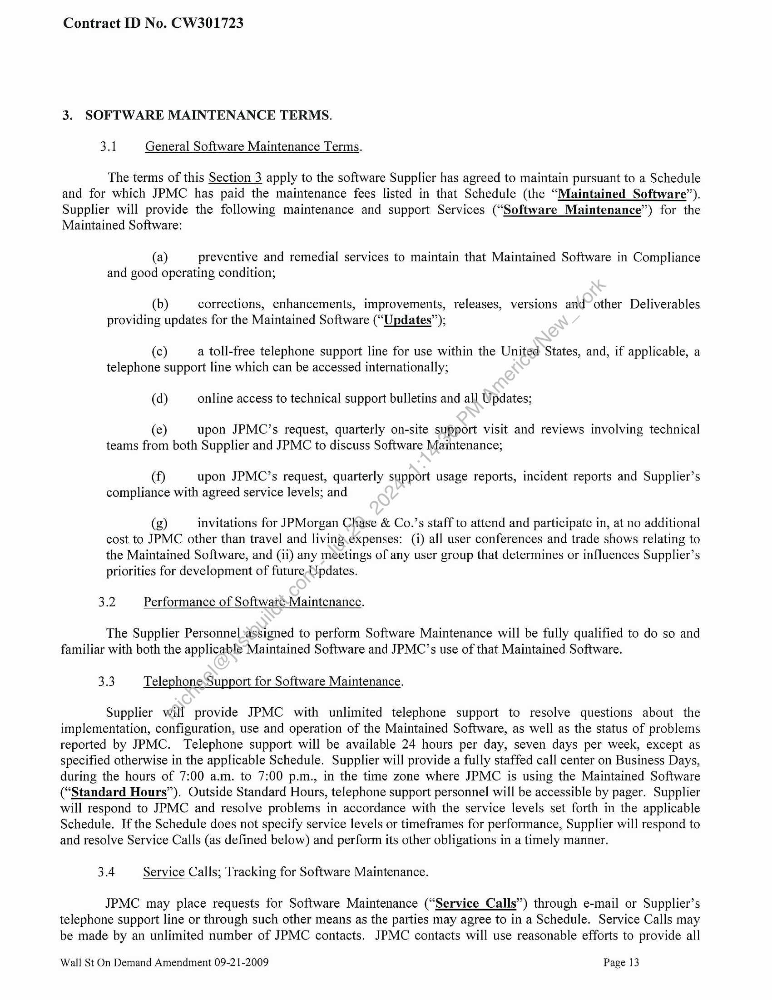
```  
```col-md
Contract ID No. CW301723  
3. SOFTWARE MAINTENANCE TERMS.  
3.1 General Software Maintenance Terms.  
The terms of this Section 3 apply to the software Supplier has agreed to maintain pursuant to a Schedule
and for which JPMC has paid the maintenance fees listed in that Schedule (the “Maintained Software”).
Supplier will provide the following maintenance and support Services (“Software Maintenance”) for the
Maintained Software:  
(a) preventive and remedial services to maintain that Maintained Software in Compliance
and good operating condition;  
(b) corrections, enhancements, improvements, releases, versions and~ other Deliverables
providing updates for the Maintained Software (“Updates”);  
(c) a toll-free telephone support line for use within the United States, and, if applicable, a
telephone support line which can be accessed internationally;  
(d) online access to technical support bulletins and all Updates;  
(e) upon JPMC’s request, quarterly on-site support visit and reviews involving technical
teams from both Supplier and JPMC to discuss Software Maintenance;  
(f) upon JPMC’s request, quarterly support usage reports, incident reports and Supplier’s
compliance with agreed service levels; and  
(g) invitations for JPMorgan Chase & Co.’s staff to attend and participate in, at no additional
cost to JPMC other than travel and living.expenses: (i) all user conferences and trade shows relating to
the Maintained Software, and (ii) any meetings of any user group that determines or influences Supplier’s
priorities for development of future Updates.  
cw Performance of Software-Maintenance.  
The Supplier Personnel »assigned to perform Software Maintenance will be fully qualified to do so and
familiar with both the applicable Maintained Software and JPMC’s use of that Maintained Software.  
3.3 Telephone.Support for Software Maintenance.  
Supplier will provide JPMC with unlimited telephone support to resolve questions about the
implementation, configuration, use and operation of the Maintained Software, as well as the status of problems
reported by JPMC. Telephone support will be available 24 hours per day, seven days per week, except as
specified otherwise in the applicable Schedule. Supplier will provide a fully staffed call center on Business Days,
during the hours of 7:00 a.m. to 7:00 p.m., in the time zone where JPMC is using the Maintained Software
(“Standard Hours”). Outside Standard Hours, telephone support personnel will be accessible by pager. Supplier
will respond to JPMC and resolve problems in accordance with the service levels set forth in the applicable
Schedule. If the Schedule does not specify service levels or timeframes for performance, Supplier will respond to
and resolve Service Calls (as defined below) and perform its other obligations in a timely manner.  
3.4 Service Calls; Tracking for Software Maintenance.  
JPMC may place requests for Software Maintenance (“Service Calls”) through e-mail or Supplier’s
telephone support line or through such other means as the parties may agree to in a Schedule. Service Calls may
be made by an unlimited number of JPMC contacts. JPMC contacts will use reasonable efforts to provide all  
Wall St On Demand Amendment 09-21-2009 Page 13  
```
````
Notes:    
````col
```col-md
flexGrow=.5
===
> [!info] [Page 14](_attachments/images_JPMC-Parent-3.6.1.20.2.12010_JPMorgan_AmendmenttoMSACW301723.pdf_210718/page_14.png)
> 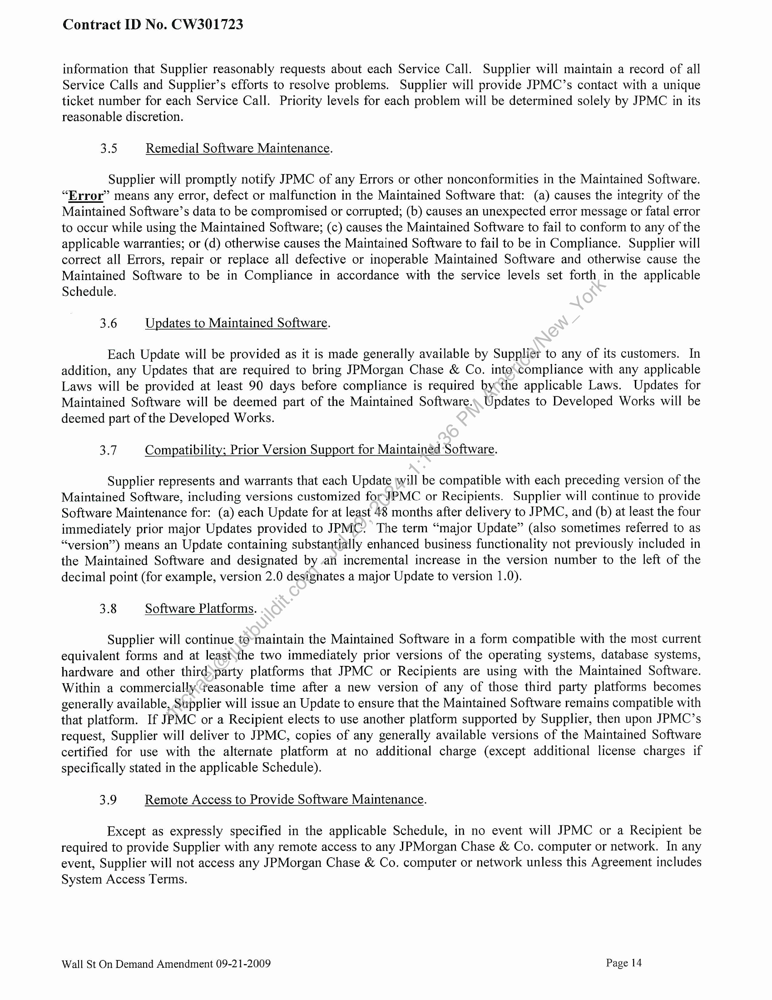
```  
```col-md
Contract ID No. CW301723  
information that Supplier reasonably requests about each Service Call. Supplier will maintain a record of all
Service Calls and Supplier’s efforts to resolve problems. Supplier will provide JPMC’s contact with a unique
ticket number for each Service Call. Priority levels for each problem will be determined solely by JPMC in its
reasonable discretion.  
3.5 Remedial Software Maintenance.  
Supplier will promptly notify JPMC of any Errors or other nonconformities in the Maintained Software.
“Error” means any error, defect or malfunction in the Maintained Software that: (a) causes the integrity of the
Maintained Software’s data to be compromised or corrupted; (b) causes an unexpected error message or fatal error
to occur while using the Maintained Software; (c) causes the Maintained Software to fail to conform to any of the
applicable warranties; or (d) otherwise causes the Maintained Software to fail to be in Compliance. Supplier will
correct all Errors, repair or replace all defective or inoperable Maintained Software and otherwise cause the
Maintained Software to be in Compliance in accordance with the service levels set forth in the applicable
Schedule.  
3.6 Updates to Maintained Software.  
Each Update will be provided as it is made generally available by Suppliér to any of its customers. In
addition, any Updates that are required to bring JPMorgan Chase & Co. into\compliance with any applicable
Laws will be provided at least 90 days before compliance is required by the applicable Laws. Updates for
Maintained Software will be deemed part of the Maintained Software.  Updates to Developed Works will be
deemed part of the Developed Works.  
a7 Compatibility; Prior Version Support for Maintained Software.  
Supplier represents and warrants that each Update will be compatible with each preceding version of the
Maintained Software, including versions customized for JPMC or Recipients. Supplier will continue to provide
Software Maintenance for: (a) each Update for at least 48 months after delivery to JPMC, and (b) at least the four
immediately prior major Updates provided to JPMC: The term “major Update” (also sometimes referred to as
“version”) means an Update containing substantially enhanced business functionality not previously included in
the Maintained Software and designated by an incremental increase in the version number to the left of the
decimal point (for example, version 2.0 designates a major Update to version 1.0).  
3.8 Software Platforms.  
Supplier will continue to-maintain the Maintained Software in a form compatible with the most current
equivalent forms and at least<the two immediately prior versions of the operating systems, database systems,
hardware and other third>party platforms that JPMC or Recipients are using with the Maintained Software.
Within a commerciallyteasonable time after a new version of any of those third party platforms becomes
generally available, Supplier will issue an Update to ensure that the Maintained Software remains compatible with
that platform. If JPMC or a Recipient elects to use another platform supported by Supplier, then upon JPMC’s
request, Supplier will deliver to JPMC, copies of any generally available versions of the Maintained Software
certified for use with the alternate platform at no additional charge (except additional license charges if
specifically stated in the applicable Schedule).  
39 Remote Access to Provide Software Maintenance.  
Except as expressly specified in the applicable Schedule, in no event will JPMC or a Recipient be
required to provide Supplier with any remote access to any JPMorgan Chase & Co. computer or network. In any
event, Supplier will not access any JPMorgan Chase & Co. computer or network unless this Agreement includes
System Access Terms.  
Wall St On Demand Amendment 09-21-2009 Page 14  
```
````
Notes:    
````col
```col-md
flexGrow=.5
===
> [!info] [Page 15](_attachments/images_JPMC-Parent-3.6.1.20.2.12010_JPMorgan_AmendmenttoMSACW301723.pdf_210718/page_15.png)
> 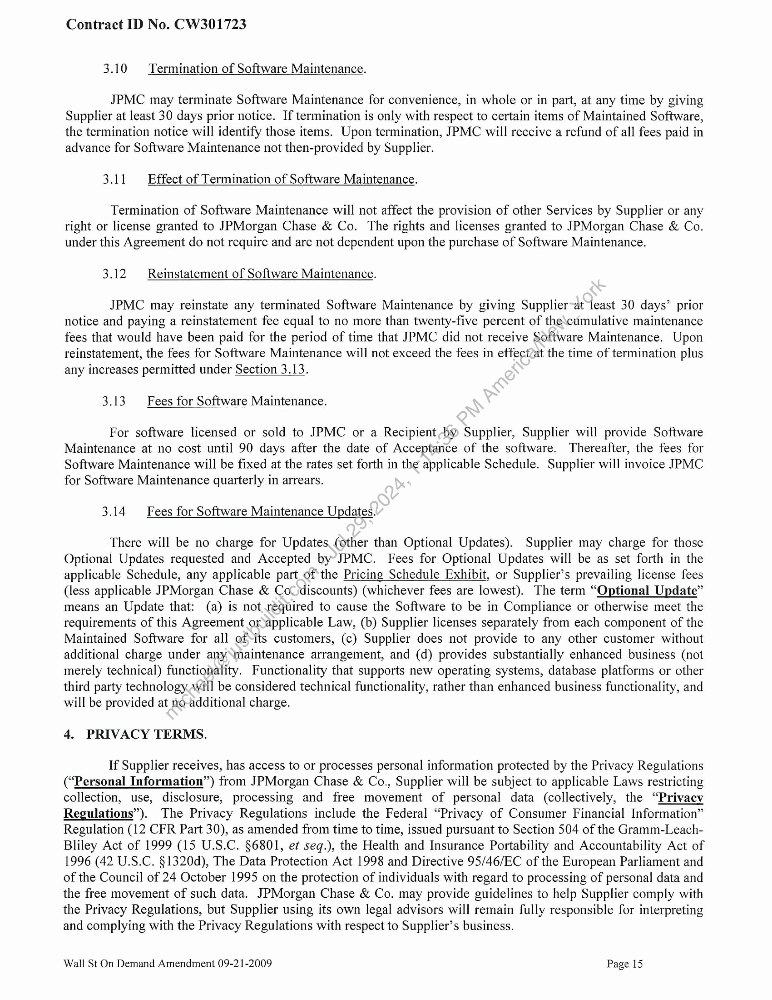
```  
```col-md
Contract ID No. CW301723  
3.10 Termination of Software Maintenance.  
JPMC may terminate Software Maintenance for convenience, in whole or in part, at any time by giving
Supplier at least 30 days prior notice. If termination is only with respect to certain items of Maintained Software,
the termination notice will identify those items. Upon termination, JPMC will receive a refund of all fees paid in
advance for Software Maintenance not then-provided by Supplier.  
3.11 Effect of Termination of Software Maintenance.  
Termination of Software Maintenance will not affect the provision of other Services by Supplier or any
right or license granted to JPMorgan Chase & Co. The rights and licenses granted to JPMorgan Chase & Co.
under this Agreement do not require and are not dependent upon the purchase of Software Maintenance.  
3.12 Reinstatement of Software Maintenance.  
JPMC may reinstate any terminated Software Maintenance by giving Supplier-at least 30 days’ prior
notice and paying a reinstatement fee equal to no more than twenty-five percent of the\cumulative maintenance
fees that would have been paid for the period of time that JPMC did not receive Software Maintenance. Upon
reinstatement, the fees for Software Maintenance will not exceed the fees in effectat the time of termination plus
any increases permitted under Section 3.13.  
3.13 Fees for Software Maintenance.  
For software licensed or sold to JPMC or a Recipient -by Supplier, Supplier will provide Software
Maintenance at no cost until 90 days after the date of Acceptance of the software. Thereafter, the fees for
Software Maintenance will be fixed at the rates set forth in the applicable Schedule. Supplier will invoice JEPMC
for Software Maintenance quarterly in arrears.  
3.14 Fees for Software Maintenance Updates.  
There will be no charge for Updates (other than Optional Updates). Supplier may charge for those
Optional Updates requested and Accepted by’ JPMC. Fees for Optional Updates will be as set forth in the
applicable Schedule, any applicable part_of the Pricing Schedule Exhibit, or Supplier’s prevailing license fees
(less applicable JPMorgan Chase & Cou discounts) (whichever fees are lowest). The term “Optional Update”
means an Update that: (a) is not required to cause the Software to be in Compliance or otherwise meet the
requirements of this Agreement or applicable Law, (b) Supplier licenses separately from each component of the
Maintained Software for all of-its customers, (c) Supplier does not provide to any other customer without
additional charge under any\maintenance arrangement, and (d) provides substantially enhanced business (not
merely technical) functionality. Functionality that supports new operating systems, database platforms or other
third party technology will be considered technical functionality, rather than enhanced business functionality, and
will be provided at no-additional charge.  
4. PRIVACY TERMS.  
If Supplier receives, has access to or processes personal information protected by the Privacy Regulations
(“Personal Information”) from JPMorgan Chase & Co., Supplier will be subject to applicable Laws restricting
collection, use, disclosure, processing and free movement of personal data (collectively, the “Privacy
Regulations”). The Privacy Regulations include the Federal “Privacy of Consumer Financial Information”
Regulation (12 CFR Part 30), as amended from time to time, issued pursuant to Section 504 of the Gramm-LeachBliley Act of 1999 (15 U.S.C. §6801, et seq.), the Health and Insurance Portability and Accountability Act of
1996 (42 U.S.C. §1320d), The Data Protection Act 1998 and Directive 95/46/EC of the European Parliament and
of the Council of 24 October 1995 on the protection of individuals with regard to processing of personal data and
the free movement of such data. JPMorgan Chase & Co. may provide guidelines to help Supplier comply with
the Privacy Regulations, but Supplier using its own legal advisors will remain fully responsible for interpreting
and complying with the Privacy Regulations with respect to Supplier’s business.  
Wall St On Demand Amendment 09-21-2009 Page 15  
```
````
Notes:    
````col
```col-md
flexGrow=.5
===
> [!info] [Page 16](_attachments/images_JPMC-Parent-3.6.1.20.2.12010_JPMorgan_AmendmenttoMSACW301723.pdf_210718/page_16.png)
> 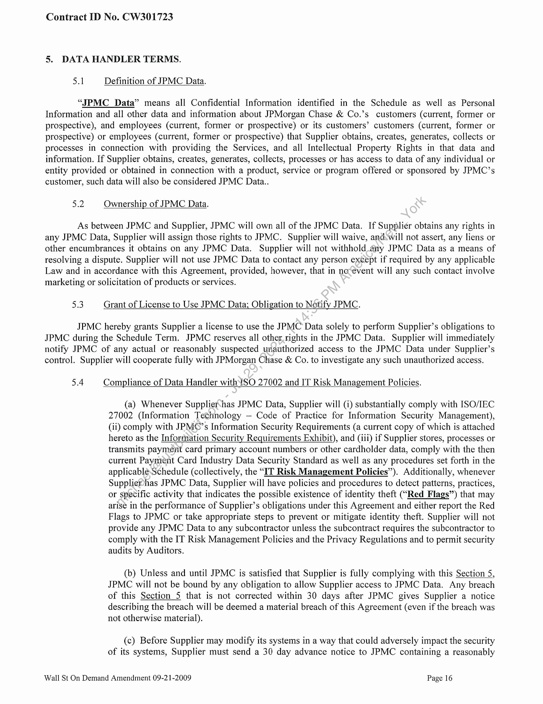
```  
```col-md
Contract ID No. CW301723  
5. DATA HANDLER TERMS.  
5.1 Definition of JPEMC Data.  
“JPMC Data” means all Confidential Information identified in the Schedule as well as Personal
Information and all other data and information about JPMorgan Chase & Co.’s customers (current, former or
prospective), and employees (current, former or prospective) or its customers’ customers (current, former or
prospective) or employees (current, former or prospective) that Supplier obtains, creates, generates, collects or
processes in connection with providing the Services, and all Intellectual Property Rights in that data and
information. If Supplier obtains, creates, generates, collects, processes or has access to data of any individual or
entity provided or obtained in connection with a product, service or program offered or sponsored by JPMC’s
customer, such data will also be considered JPMC Data.  
  
5.2 Ownership of JPMC Data.  
As between JPMC and Supplier, JPMC will own all of the JPMC Data. If Supplier obtains any rights in
any JPMC Data, Supplier will assign those rights to JPMC. Supplier will waive, and-will not assert, any liens or
other encumbrances it obtains on any JPMC Data. Supplier will not withhold amy JPMC Data as a means of
resolving a dispute. Supplier will not use JPMC Data to contact any person except if required by any applicable
Law and in accordance with this Agreement, provided, however, that in no‘event will any such contact involve
marketing or solicitation of products or services.  
5.3 Grant of License to Use JPMC Data; Obligation to Notify JPMC.  
JPMC hereby grants Supplier a license to use the JPMC Data solely to perform Supplier’s obligations to
JPMC during the Schedule Term. JPMC reserves all other.rights in the JPMC Data. Supplier will immediately
notify JPMC of any actual or reasonably suspected unauthorized access to the JPMC Data under Supplier’s
control. Supplier will cooperate fully with JPMorgan Chase & Co. to investigate any such unauthorized access.  
5.4 Compliance of Data Handler with SO 27002 and IT Risk Management Policies.  
(a) Whenever Supplier-has JPMC Data, Supplier will (i) substantially comply with ISO/IEC
27002 (Information Technology — Code of Practice for Information Security Management),
(ii) comply with JPMC’s Information Security Requirements (a current copy of which is attached
hereto as the Information Security Requirements Exhibit), and (iii) if Supplier stores, processes or
transmits payment card primary account numbers or other cardholder data, comply with the then
current Payment Card Industry Data Security Standard as well as any procedures set forth in the
applicable.Schedule (collectively, the “IT Risk Management Policies”). Additionally, whenever
SupplieMhas JPMC Data, Supplier will have policies and procedures to detect patterns, practices,
or specific activity that indicates the possible existence of identity theft (‘Red Flags”) that may
arise in the performance of Supplier’s obligations under this Agreement and either report the Red
Flags to JPMC or take appropriate steps to prevent or mitigate identity theft. Supplier will not
provide any JPMC Data to any subcontractor unless the subcontract requires the subcontractor to
comply with the IT Risk Management Policies and the Privacy Regulations and to permit security
audits by Auditors.  
(b) Unless and until JPMC is satisfied that Supplier is fully complying with this Section 5,
JPMC will not be bound by any obligation to allow Supplier access to JPMC Data. Any breach
of this Section 5 that is not corrected within 30 days after JPMC gives Supplier a notice
describing the breach will be deemed a material breach of this Agreement (even if the breach was
not otherwise material).  
(c) Before Supplier may modify its systems in a way that could adversely impact the security
of its systems, Supplier must send a 30 day advance notice to JPMC containing a reasonably  
Wall St On Demand Amendment 09-21-2009 Page 16  
```
````
Notes:    
````col
```col-md
flexGrow=.5
===
> [!info] [Page 17](_attachments/images_JPMC-Parent-3.6.1.20.2.12010_JPMorgan_AmendmenttoMSACW301723.pdf_210718/page_17.png)
> 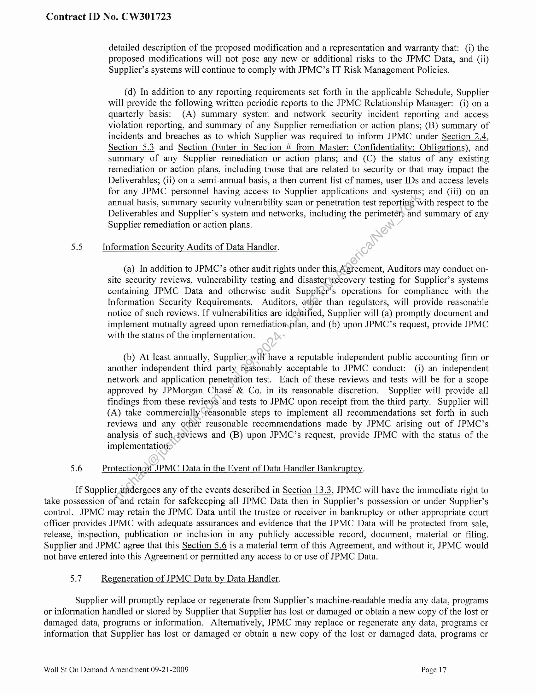
```  
```col-md
Contract ID No. CW301723  
detailed description of the proposed modification and a representation and warranty that: (i) the
proposed modifications will not pose any new or additional risks to the JPMC Data, and (ii)
Supplier’s systems will continue to comply with JPMC’s IT Risk Management Policies.  
(d) In addition to any reporting requirements set forth in the applicable Schedule, Supplier
will provide the following written periodic reports to the JPMC Relationship Manager: (i) on a
quarterly basis: (A) summary system and network security incident reporting and access
violation reporting, and summary of any Supplier remediation or action plans; (B) summary of
incidents and breaches as to which Supplier was required to inform JPMC under Section 2.4,
Section 5.3 and Section (Enter in Section from Master: Confidentiality: Obligations), and
summary of any Supplier remediation or action plans; and (C) the status of any existing
remediation or action plans, including those that are related to security or that may impact the
Deliverables; (ii) on a semi-annual basis, a then current list of names, user IDs and access levels
for any JPMC personnel having access to Supplier applications and systems; and (iii) on an
annual basis, summary security vulnerability scan or penetration test reporting with respect to the
Deliverables and Supplier’s system and networks, including the perimeter; and summary of any
Supplier remediation or action plans.  
5.5 Information Security Audits of Data Handler.  
(a) In addition to JPMC’s other audit rights under this Agreement, Auditors may conduct onsite security reviews, vulnerability testing and disaster\recovery testing for Supplier’s systems
containing JPMC Data and otherwise audit Supplier’s operations for compliance with the
Information Security Requirements. Auditors, otlier than regulators, will provide reasonable
notice of such reviews. If vulnerabilities are identified, Supplier will (a) promptly document and
implement mutually agreed upon remediation.plan, and (b) upon JPMC’s request, provide JPMC
with the status of the implementation.  
(b) At least annually, Supplier_will have a reputable independent public accounting firm or
another independent third party reasonably acceptable to JPMC conduct: (i) an independent
network and application penetration test. Each of these reviews and tests will be for a scope
approved by JPMorgan Chase & Co. in its reasonable discretion. Supplier will provide all
findings from these reviews and tests to JPMC upon receipt from the third party. Supplier will
(A) take commercially \veasonable steps to implement all recommendations set forth in such
reviews and any other reasonable recommendations made by JPMC arising out of JPMC’s
analysis of such-teviews and (B) upon JPMC’s request, provide JPMC with the status of the
implementation:  
5.6 Protectioncof JPMC Data in the Event of Data Handler Bankruptcy.  
If Supplier undergoes any of the events described in Section 13.3, JPMC will have the immediate right to
take possession of and retain for safekeeping all JPMC Data then in Supplier’s possession or under Supplier’s
control. JPMC may retain the JPMC Data until the trustee or receiver in bankruptcy or other appropriate court
officer provides JPMC with adequate assurances and evidence that the JPMC Data will be protected from sale,
release, inspection, publication or inclusion in any publicly accessible record, document, material or filing.
Supplier and JPMC agree that this Section 5.6 is a material term of this Agreement, and without it, JPMC would
not have entered into this Agreement or permitted any access to or use of JPMC Data.  
5.7 Regeneration of JPMC Data by Data Handler.  
Supplier will promptly replace or regenerate from Supplier’s machine-readable media any data, programs
or information handled or stored by Supplier that Supplier has lost or damaged or obtain a new copy of the lost or
damaged data, programs or information. Alternatively, JPMC may replace or regenerate any data, programs or
information that Supplier has lost or damaged or obtain a new copy of the lost or damaged data, programs or  
Wall St On Demand Amendment 09-21-2009 Page 17  
```
````
Notes:    
````col
```col-md
flexGrow=.5
===
> [!info] [Page 18](_attachments/images_JPMC-Parent-3.6.1.20.2.12010_JPMorgan_AmendmenttoMSACW301723.pdf_210718/page_18.png)
> 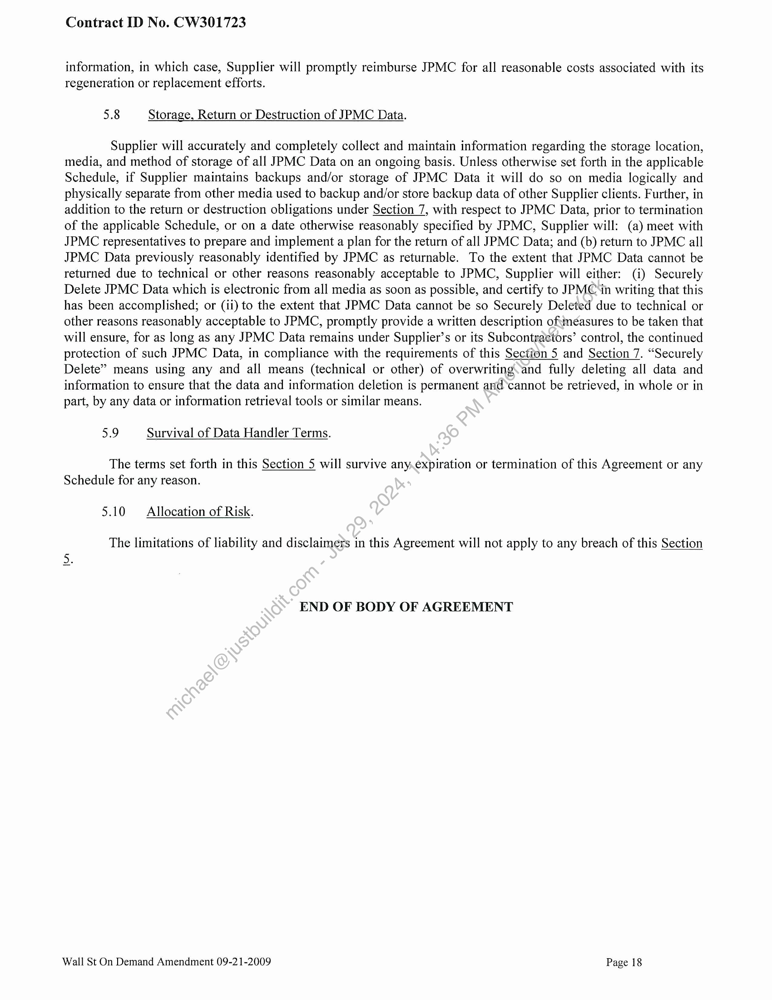
```  
```col-md
Contract ID No. CW301723  
information, in which case, Supplier will promptly reimburse JPMC for all reasonable costs associated with its
regeneration or replacement efforts.  
5.8 Storage, Return or Destruction of JPMC Data.  
Supplier will accurately and completely collect and maintain information regarding the storage location,
media, and method of storage of all JPMC Data on an ongoing basis. Unless otherwise set forth in the applicable
Schedule, if Supplier maintains backups and/or storage of JPMC Data it will do so on media logically and
physically separate from other media used to backup and/or store backup data of other Supplier clients. Further, in
addition to the return or destruction obligations under Section 7, with respect to JPMC Data, prior to termination
of the applicable Schedule, or on a date otherwise reasonably specified by JPMC, Supplier will: (a) meet with
JPMC representatives to prepare and implement a plan for the return of all JPMC Data; and (b) return to JPMC all
JPMC Data previously reasonably identified by JPMC as returnable. To the extent that JPMC Data cannot be
returned due to technical or other reasons reasonably acceptable to JPMC, Supplier will either: (i) Securely
Delete JPMC Data which is electronic from all media as soon as possible, and certify to JPMC in writing that this
has been accomplished; or (ii) to the extent that JPMC Data cannot be so Securely Deleted due to technical or
other reasons reasonably acceptable to JPMC, promptly provide a written description ofimeasures to be taken that
will ensure, for as long as any JPMC Data remains under Supplier’s or its Subcontractors’ control, the continued
protection of such JPMC Data, in compliance with the requirements of this Section 5 and Section 7. “Securely
Delete” means using any and all means (technical or other) of overwritingsand fully deleting all data and
information to ensure that the data and information deletion is permanent and cannot be retrieved, in whole or in
part, by any data or information retrieval tools or similar means.  
5.9 Survival of Data Handler Terms.  
The terms set forth in this Section 5 will survive any,expiration or termination of this Agreement or any
Schedule for any reason.  
5.10 Allocation of Risk.  
The limitations of liability and disclaimers in this Agreement will not apply to any breach of this Section  
Jn  
END OF BODY OF AGREEMENT  
Wall St On Demand Amendment 09-21-2009 Page 18  
```
````
Notes:    
````col
```col-md
flexGrow=.5
===
> [!info] [Page 19](_attachments/images_JPMC-Parent-3.6.1.20.2.12010_JPMorgan_AmendmenttoMSACW301723.pdf_210718/page_19.png)
> 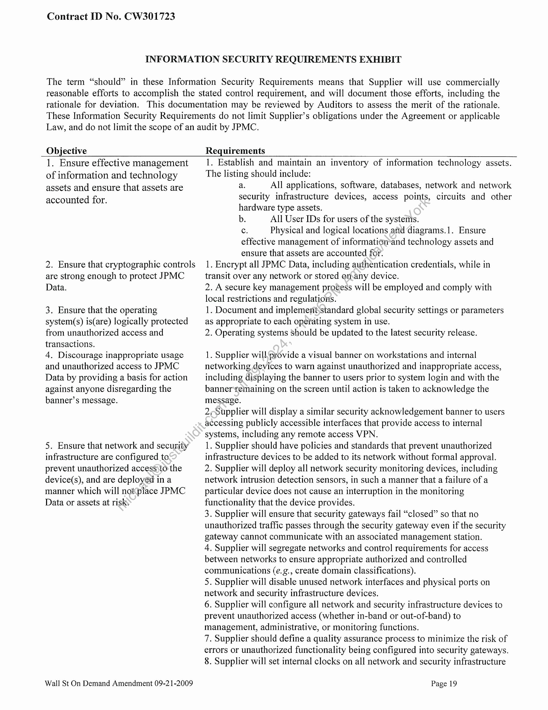
```  
```col-md
Contract ID No. CW301723  
INFORMATION SECURITY REQUIREMENTS EXHIBIT  
The term “should” in these Information Security Requirements means that Supplier will use commercially
reasonable efforts to accomplish the stated control requirement, and will document those efforts, including the
rationale for deviation. This documentation may be reviewed by Auditors to assess the merit of the rationale.
These Information Security Requirements do not limit Supplier’s obligations under the Agreement or applicable
Law, and do not limit the scope of an audit by JPMC.  
Objective  
Requirements  
1. Ensure effective management
of information and technology
assets and ensure that assets are
accounted for.  
2. Ensure that cryptographic controls
are strong enough to protect JPMC
Data.  
3. Ensure that the operating
system(s) is(are) logically protected
from unauthorized access and
transactions.  
4. Discourage inappropriate usage
and unauthorized access to JPMC
Data by providing a basis for action
against anyone disregarding the
banner’s message.  
5. Ensure that network and security
infrastructure are configured to
prevent unauthorized access\to the
device(s), and are deployed in a
manner which will notplace JPMC
Data or assets at risk:  
Wall St On Demand Amendment 09-21-2009  
1. Establish and maintain an inventory of information technology assets.
The listing should include:
a. All applications, software, databases, network and network
security infrastructure devices, access points, circuits and other
hardware type assets.
b. All User IDs for users of the systems.
c. Physical and logical locations atid diagrams.1. Ensure
effective management of information*and technology assets and
ensure that assets are accounted for.
1. Encrypt all JPMC Data, including authentication credentials, while in
transit over any network or stored onany device.
2. A secure key management process will be employed and comply with
local restrictions and regulations.
1. Document and implement)standard global security settings or parameters
as appropriate to each operating system in use.
2. Operating systems Should be updated to the latest security release.  
1. Supplier will'provide a visual banner on workstations and internal
networking devices to warn against unauthorized and inappropriate access,
including displaying the banner to users prior to system login and with the
banner ‘remaining on the screen until action is taken to acknowledge the
message.  
2-Supplier will display a similar security acknowledgement banner to users
accessing publicly accessible interfaces that provide access to internal
systems, including any remote access VPN.  
1. Supplier should have policies and standards that prevent unauthorized
infrastructure devices to be added to its network without formal approval.  
2. Supplier will deploy all network security monitoring devices, including
network intrusion detection sensors, in such a manner that a failure of a
particular device does not cause an interruption in the monitoring
functionality that the device provides.  
3. Supplier will ensure that security gateways fail “closed” so that no
unauthorized traffic passes through the security gateway even if the security
gateway cannot communicate with an associated management station.  
4. Supplier will segregate networks and control requirements for access
between networks to ensure appropriate authorized and controlled
communications (e.g., create domain classifications).  
5. Supplier will disable unused network interfaces and physical ports on
network and security infrastructure devices.  
6. Supplier will configure all network and security infrastructure devices to
prevent unauthorized access (whether in-band or out-of-band) to
management, administrative, or monitoring functions.  
7. Supplier should define a quality assurance process to minimize the risk of
errors or unauthorized functionality being configured into security gateways.
8. Supplier will set internal clocks on all network and security infrastructure  
Page 19  
```
````
Notes:    
````col
```col-md
flexGrow=.5
===
> [!info] [Page 20](_attachments/images_JPMC-Parent-3.6.1.20.2.12010_JPMorgan_AmendmenttoMSACW301723.pdf_210718/page_20.png)
> 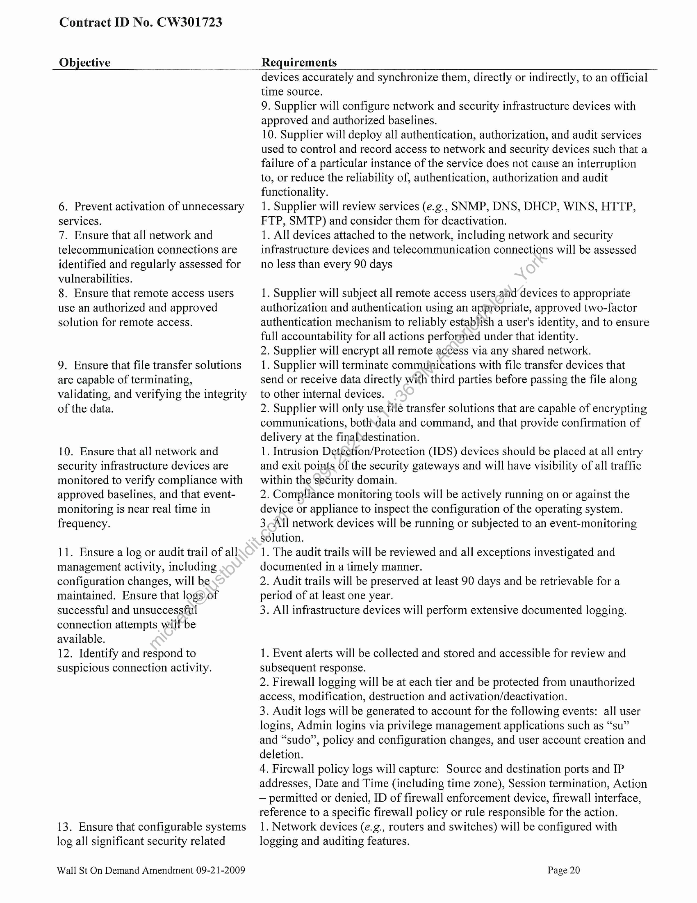
```  
```col-md
Contract ID No. CW301723  
Objective  
Requirements  
6. Prevent activation of unnecessary
services.  
7. Ensure that all network and
telecommunication connections are
identified and regularly assessed for
vulnerabilities.  
8. Ensure that remote access users
use an authorized and approved
solution for remote access.  
9. Ensure that file transfer solutions
are capable of terminating,
validating, and verifying the integrity
of the data.  
10. Ensure that all network and
security infrastructure devices are
monitored to verify compliance with
approved baselines, and that eventmonitoring is near real time in
frequency.  
11. Ensure a log or audit trail of all
management activity, including
configuration changes, will be
maintained. Ensure that logs of
successful and unsuccessful
connection attempts will be
available.  
12. Identify and respond to
suspicious connection activity.  
13. Ensure that configurable systems
log all significant security related  
Wall St On Demand Amendment 09-21-2009  
devices accurately and synchronize them, directly or indirectly, to an official
time source.  
9. Supplier will configure network and security infrastructure devices with
approved and authorized baselines.  
10. Supplier will deploy all authentication, authorization, and audit services
used to control and record access to network and security devices such that a
failure of a particular instance of the service does not cause an interruption
to, or reduce the reliability of, authentication, authorization and audit
functionality.  
1. Supplier will review services (e.g., SNMP, DNS, DHCP, WINS, HTTP,
FTP, SMTP) and consider them for deactivation.  
1. All devices attached to the network, including network and security
infrastructure devices and telecommunication connections will be assessed
no less than every 90 days  
1. Supplier will subject all remote access users and devices to appropriate
authorization and authentication using an appropriate, approved two-factor
authentication mechanism to reliably establish a user's identity, and to ensure
full accountability for all actions performed under that identity.  
2. Supplier will encrypt all remote access via any shared network.  
1. Supplier will terminate communications with file transfer devices that
send or receive data directly with third parties before passing the file along
to other internal devices.  
2. Supplier will only use file transfer solutions that are capable of encrypting
communications, botlidata and command, and that provide confirmation of
delivery at the finabdestination.  
1. Intrusion Detection/Protection (IDS) devices should be placed at all entry
and exit points of the security gateways and will have visibility of all traffic
within the security domain.  
2. Compliance monitoring tools will be actively running on or against the
device or appliance to inspect the configuration of the operating system.  
3 All network devices will be running or subjected to an event-monitoring
solution.  
1. The audit trails will be reviewed and all exceptions investigated and
documented in a timely manner.  
2. Audit trails will be preserved at least 90 days and be retrievable for a
period of at least one year.  
3. All infrastructure devices will perform extensive documented logging.  
1. Event alerts will be collected and stored and accessible for review and
subsequent response.  
2. Firewall logging will be at each tier and be protected from unauthorized
access, modification, destruction and activation/deactivation.  
3. Audit logs will be generated to account for the following events: all user
logins, Admin logins via privilege management applications such as “su”
and “sudo”, policy and configuration changes, and user account creation and
deletion.  
4. Firewall policy logs will capture: Source and destination ports and IP
addresses, Date and Time (including time zone), Session termination, Action
— permitted or denied, ID of firewall enforcement device, firewall interface,
reference to a specific firewall policy or rule responsible for the action.  
1. Network devices (e.g., routers and switches) will be configured with
logging and auditing features.  
Page 20  
```
````
Notes:    
````col
```col-md
flexGrow=.5
===
> [!info] [Page 21](_attachments/images_JPMC-Parent-3.6.1.20.2.12010_JPMorgan_AmendmenttoMSACW301723.pdf_210718/page_21.png)
> 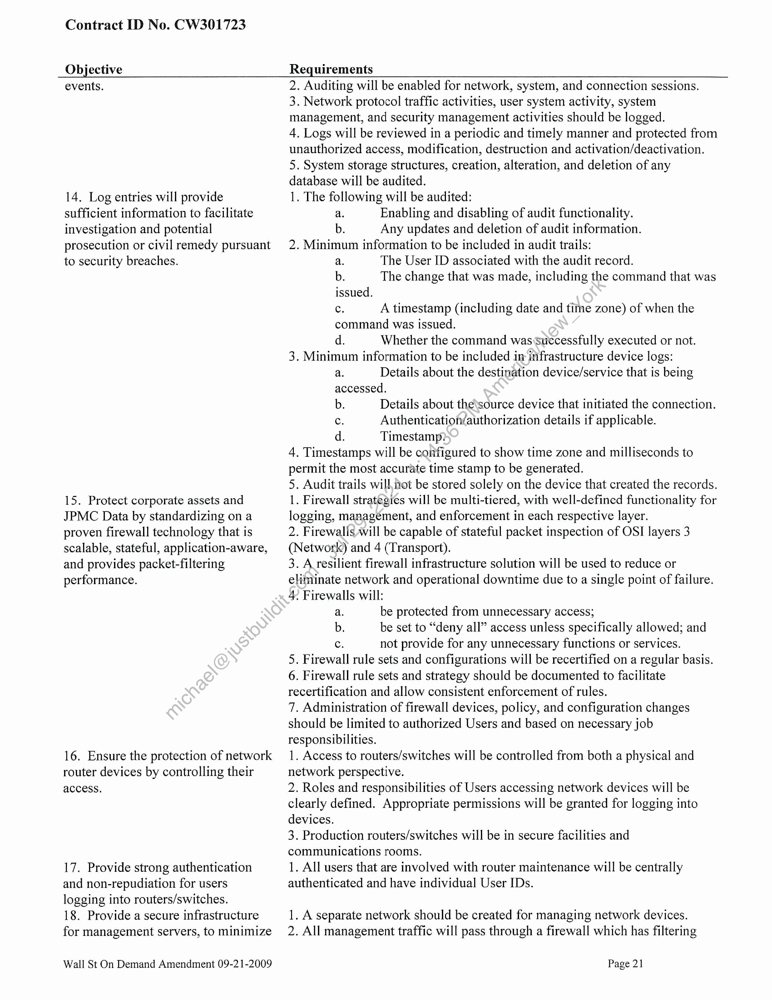
```  
```col-md
Contract ID No. CW301723  
Objective  
Requirements  
events.  
14. Log entries will provide
sufficient information to facilitate
investigation and potential
prosecution or civil remedy pursuant
to security breaches.  
15. Protect corporate assets and
JPMC Data by standardizing on a
proven firewall technology that is
scalable, stateful, application-aware,
and provides packet-filtering
performance.  
16. Ensure the protection of network
router devices by controlling their
access.  
17. Provide strong authentication
and non-repudiation for users
logging into routers/switches.  
18. Provide a secure infrastructure
for management servers, to minimize  
Wall St On Demand Amendment 09-21-2009  
2. Auditing will be enabled for network, system, and connection sessions.  
3. Network protocol traffic activities, user system activity, system
management, and security management activities should be logged.  
4. Logs will be reviewed in a periodic and timely manner and protected from
unauthorized access, modification, destruction and activation/deactivation.
5. System storage structures, creation, alteration, and deletion of any
database will be audited.  
1. The following will be audited:  
a. Enabling and disabling of audit functionality.
b. Any updates and deletion of audit information.  
2. Minimum information to be included in audit trails:
a. The User ID associated with the audit record.
b. The change that was made, including the command that was
issued.
e, A timestamp (including date and time zone) of when the
command was issued.
d. Whether the command was successfully executed or not.  
3. Minimum information to be included in infrastructure device logs:
a. Details about the destination device/service that is being
accessed.
b. Details about the\source device that initiated the connection.
c. Authentication/authorization details if applicable.
d. Timestamp?  
4. Timestamps will be configured to show time zone and milliseconds to
permit the most accurate time stamp to be generated.  
5. Audit trails will not be stored solely on the device that created the records.
1. Firewall strategies will be multi-tiered, with well-defined functionality for
logging, management, and enforcement in each respective layer.  
2. Firewalls will be capable of stateful packet inspection of OSI layers 3
(Network) and 4 (Transport).  
3. A resilient firewall infrastructure solution will be used to reduce or
eliminate network and operational downtime due to a single point of failure.
4 Firewalls will:  
a. be protected from unnecessary access;
b. be set to “deny all” access unless specifically allowed; and
©. not provide for any unnecessary functions or services.  
5. Firewall rule sets and configurations will be recertified on a regular basis.
6. Firewall rule sets and strategy should be documented to facilitate
recertification and allow consistent enforcement of rules.  
7. Administration of firewall devices, policy, and configuration changes
should be limited to authorized Users and based on necessary job
responsibilities.  
1. Access to routers/switches will be controlled from both a physical and
network perspective.  
2. Roles and responsibilities of Users accessing network devices will be
clearly defined. Appropriate permissions will be granted for logging into
devices.  
3. Production routers/switches will be in secure facilities and
communications rooms.  
1. All users that are involved with router maintenance will be centrally
authenticated and have individual User IDs.  
1. A separate network should be created for managing network devices.
2. All management traffic will pass through a firewall which has filtering  
Page 21  
```
````
Notes:    
````col
```col-md
flexGrow=.5
===
> [!info] [Page 22](_attachments/images_JPMC-Parent-3.6.1.20.2.12010_JPMorgan_AmendmenttoMSACW301723.pdf_210718/page_22.png)
> 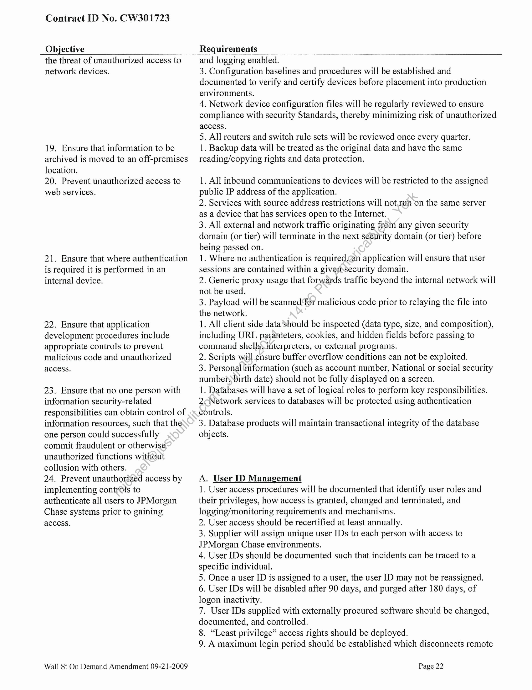
```  
```col-md
Contract ID No. CW301723  
Objective  
Requirements  
the threat of unauthorized access to
network devices.  
19. Ensure that information to be
archived is moved to an off-premises
location.  
20. Prevent unauthorized access to
web services.  
21. Ensure that where authentication
is required it is performed in an
internal device.  
22. Ensure that application
development procedures include
appropriate controls to prevent
malicious code and unauthorized
access.  
23. Ensure that no one person with
information security-related
responsibilities can obtain control of
information resources, such that the
one person could successfully
commit fraudulent or otherwise
unauthorized functions without
collusion with others.  
24. Prevent unauthorized access by
implementing controls to
authenticate all users to JPMorgan
Chase systems prior to gaining
access.  
Wall St On Demand Amendment 09-21-2009  
and logging enabled.  
3. Configuration baselines and procedures will be established and
documented to verify and certify devices before placement into production
environments.  
4. Network device configuration files will be regularly reviewed to ensure
compliance with security Standards, thereby minimizing risk of unauthorized
access.  
5. All routers and switch rule sets will be reviewed once every quarter.  
1. Backup data will be treated as the original data and have the same
reading/copying rights and data protection.  
1. All inbound communications to devices will be restricted to the assigned
public IP address of the application.  
2. Services with source address restrictions will not,run on the same server
as a device that has services open to the Internet.  
3. All external and network traffic originating from any given security
domain (or tier) will terminate in the next security domain (or tier) before
being passed on.  
1. Where no authentication is required@n application will ensure that user
sessions are contained within a givenssecurity domain.  
2. Generic proxy usage that forwards traffic beyond the internal network will
not be used.  
3. Payload will be scanned for malicious code prior to relaying the file into
the network.  
1. All client side data’should be inspected (data type, size, and composition),
including URL parameters, cookies, and hidden fields before passing to
command shells, interpreters, or external programs.  
2. Scripts will ensure buffer overflow conditions can not be exploited.  
3. Personal information (such as account number, National or social security
number; birth date) should not be fully displayed on a screen.  
1. Databases will have a set of logical roles to perform key responsibilities.
2 Network services to databases will be protected using authentication
controls.  
3. Database products will maintain transactional integrity of the database
objects.  
A. User ID Management
1. User access procedures will be documented that identify user roles and  
their privileges, how access is granted, changed and terminated, and
logging/monitoring requirements and mechanisms.  
2. User access should be recertified at least annually.  
3. Supplier will assign unique user IDs to each person with access to
JPMorgan Chase environments.  
4, User IDs should be documented such that incidents can be traced to a
specific individual.  
5. Once a user ID is assigned to a user, the user ID may not be reassigned.
6. User IDs will be disabled after 90 days, and purged after 180 days, of
logon inactivity.  
7. User IDs supplied with externally procured software should be changed,
documented, and controlled.  
8. “Least privilege” access rights should be deployed.  
9. A maximum login period should be established which disconnects remote  
Page 22  
```
````
Notes:    
````col
```col-md
flexGrow=.5
===
> [!info] [Page 23](_attachments/images_JPMC-Parent-3.6.1.20.2.12010_JPMorgan_AmendmenttoMSACW301723.pdf_210718/page_23.png)
> 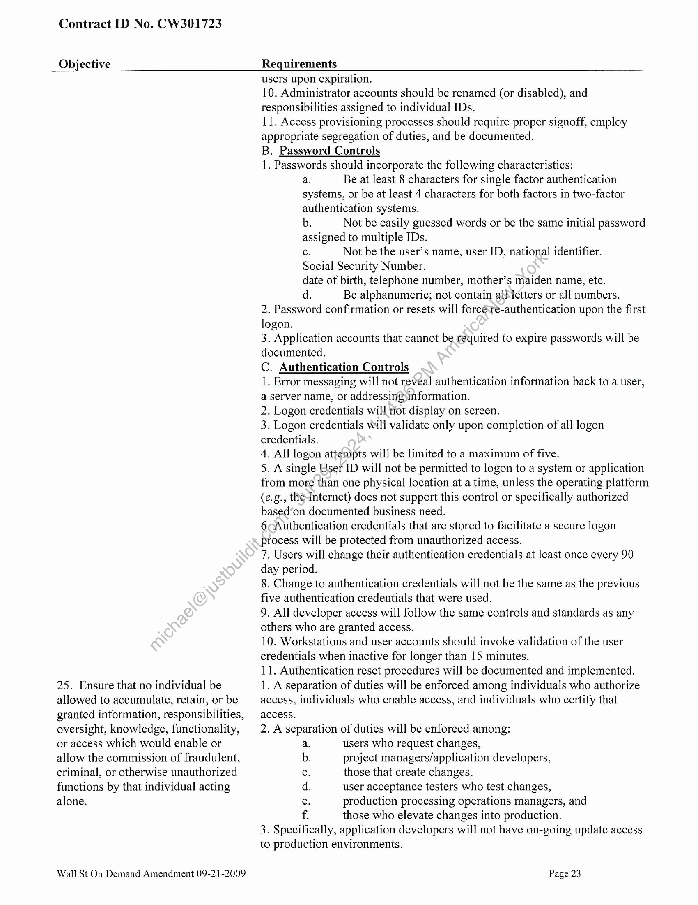
```  
```col-md
Contract ID No. CW301723  
Objective  
Requirements  
25. Ensure that no individual be
allowed to accumulate, retain, or be
granted information, responsibilities,
oversight, knowledge, functionality,
or access which would enable or
allow the commission of fraudulent,
criminal, or otherwise unauthorized
functions by that individual acting
alone.  
Wall St On Demand Amendment 09-21-2009  
users upon expiration.  
10. Administrator accounts should be renamed (or disabled), and  
responsibilities assigned to individual IDs.  
11. Access provisioning processes should require proper signoff, employ  
appropriate segregation of duties, and be documented.  
B. Password Controls  
1. Passwords should incorporate the following characteristics:
a. Be at least 8 characters for single factor authentication
systems, or be at least 4 characters for both factors in two-factor
authentication systems.  
b. Not be easily guessed words or be the same initial password
assigned to multiple IDs.
c Not be the user’s name, user ID, national identifier.  
Social Security Number.  
date of birth, telephone number, mother’s maiden name, etc.  
d. Be alphanumeric; not contain all letters or all numbers.
2. Password confirmation or resets will forcére-authentication upon the first
logon.
3. Application accounts that cannot be required to expire passwords will be
documented.
C. Authentication Controls
1. Error messaging will not reveal authentication information back to a user,
a server name, or addressing information.
2. Logon credentials will riot display on screen.
3. Logon credentials will validate only upon completion of all logon
credentials.
4. All logon attempts will be limited to a maximum of five.
5. A single User ID will not be permitted to logon to a system or application
from more than one physical location at a time, unless the operating platform
(e.g., theinternet) does not support this control or specifically authorized
based’on documented business need.
6 Authentication credentials that are stored to facilitate a secure logon
process will be protected from unauthorized access.
7. Users will change their authentication credentials at least once every 90
day period.
8. Change to authentication credentials will not be the same as the previous
five authentication credentials that were used.
9. All developer access will follow the same controls and standards as any
others who are granted access.
10. Workstations and user accounts should invoke validation of the user
credentials when inactive for longer than 15 minutes.
11. Authentication reset procedures will be documented and implemented.
1. A separation of duties will be enforced among individuals who authorize
access, individuals who enable access, and individuals who certify that
access.
2. A separation of duties will be enforced among:
users who request changes,
project managers/application developers,
those that create changes,
user acceptance testers who test changes,
production processing operations managers, and
those who elevate changes into production.
3. Specifically, application developers will not have on-going update access
to production environments.  
i> eo Bogp  
Page 23  
```
````
Notes:    
````col
```col-md
flexGrow=.5
===
> [!info] [Page 24](_attachments/images_JPMC-Parent-3.6.1.20.2.12010_JPMorgan_AmendmenttoMSACW301723.pdf_210718/page_24.png)
> 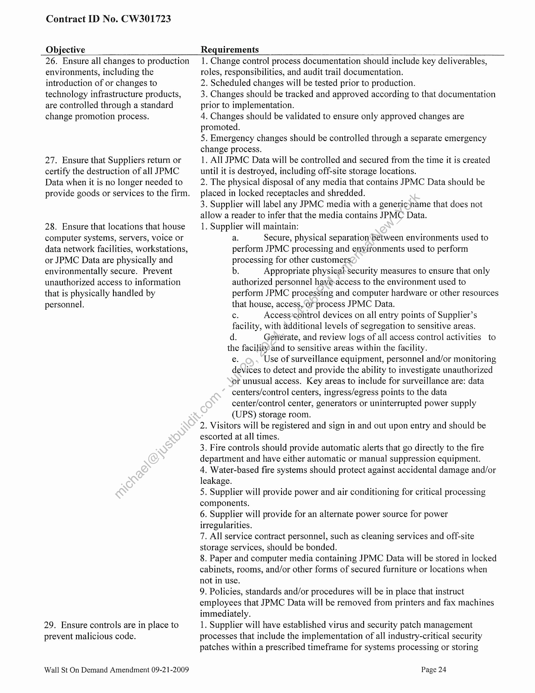
```  
```col-md
Contract ID No. CW301723  
Objective  
Requirements  
26. Ensure all changes to production
environments, including the
introduction of or changes to
technology infrastructure products,
are controlled through a standard
change promotion process.  
27. Ensure that Suppliers return or
certify the destruction of all JPMC
Data when it is no longer needed to
provide goods or services to the firm.  
28. Ensure that locations that house
computer systems, servers, voice or
data network facilities, workstations,
or JPMC Data are physically and
environmentally secure. Prevent
unauthorized access to information
that is physically handled by
personnel.  
29. Ensure controls are in place to
prevent malicious code.  
Wall St On Demand Amendment 09-21-2009  
1. Change control process documentation should include key deliverables,
roles, responsibilities, and audit trail documentation.
2. Scheduled changes will be tested prior to production.
3. Changes should be tracked and approved according to that documentation
prior to implementation.
4. Changes should be validated to ensure only approved changes are
promoted.
5. Emergency changes should be controlled through a separate emergency
change process.
1, All JPMC Data will be controlled and secured from the time it is created
until it is destroyed, including off-site storage locations.
2. The physical disposal of any media that contains JPMC Data should be
placed in locked receptacles and shredded.
3. Supplier will label any JPMC media with a generiename that does not
allow a reader to infer that the media contains JPMC Data.
1. Supplier will maintain:
a. Secure, physical separation between environments used to
perform JPMC processing and environments used to perform
processing for other customers?
b. Appropriate physical security measures to ensure that only
authorized personnel have-access to the environment used to
perform JPMC processing and computer hardware or other resources
that house, access,‘or process JPMC Data.
c. Access control devices on all entry points of Supplier’s
facility, with additional levels of segregation to sensitive areas.
d. Generate, and review logs of all access control activities to
the facility and to sensitive areas within the facility.
& Use of surveillance equipment, personnel and/or monitoring
devices to detect and provide the ability to investigate unauthorized
or unusual access. Key areas to include for surveillance are: data
centers/control centers, ingress/egress points to the data
center/control center, generators or uninterrupted power supply
(UPS) storage room.
2. Visitors will be registered and sign in and out upon entry and should be
escorted at all times.
3. Fire controls should provide automatic alerts that go directly to the fire
department and have either automatic or manual suppression equipment.
4. Water-based fire systems should protect against accidental damage and/or
leakage.
5. Supplier will provide power and air conditioning for critical processing
components.
6. Supplier will provide for an alternate power source for power
irregularities.
7. All service contract personnel, such as cleaning services and off-site
storage services, should be bonded.
8. Paper and computer media containing JPMC Data will be stored in locked
cabinets, rooms, and/or other forms of secured furniture or locations when
not in use.
9. Policies, standards and/or procedures will be in place that instruct
employees that JPMC Data will be removed from printers and fax machines
immediately.
1. Supplier will have established virus and security patch management
processes that include the implementation of all industry-critical security
patches within a prescribed timeframe for systems processing or storing  
Page 24  
```
````
Notes:    
````col
```col-md
flexGrow=.5
===
> [!info] [Page 25](_attachments/images_JPMC-Parent-3.6.1.20.2.12010_JPMorgan_AmendmenttoMSACW301723.pdf_210718/page_25.png)
> 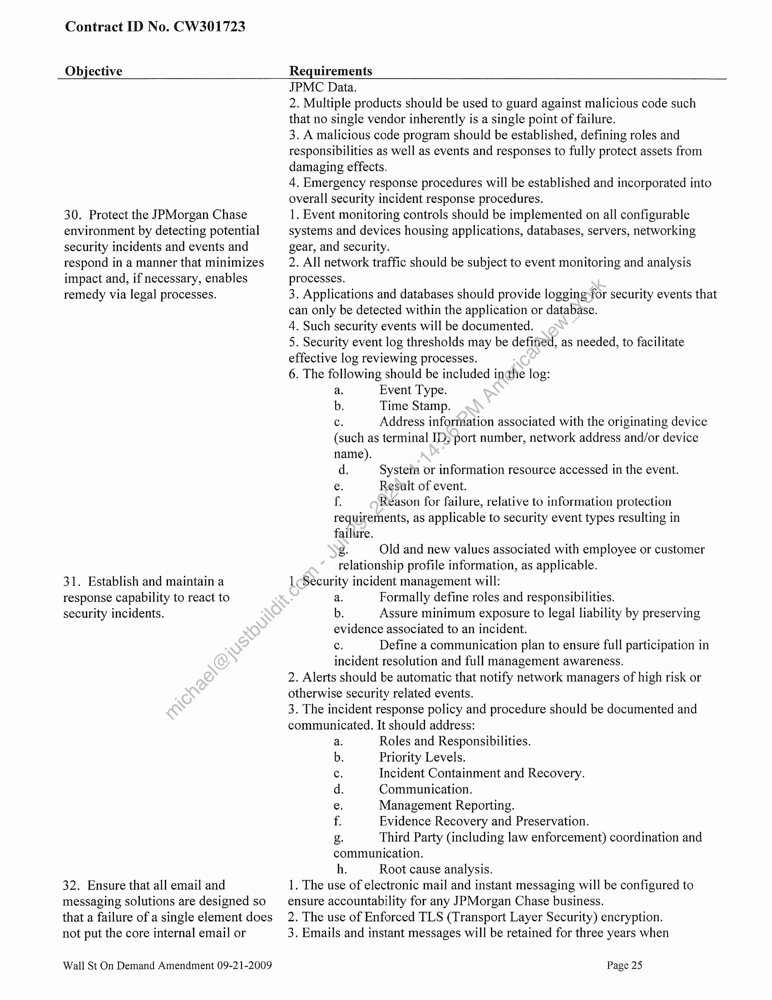
```  
```col-md
Contract ID No. CW301723  
Objective  
Requirements  
30. Protect the JPMorgan Chase
environment by detecting potential
security incidents and events and
respond in a manner that minimizes
impact and, if necessary, enables
remedy via legal processes.  
31. Establish and maintain a
response capability to react to
security incidents.  
32. Ensure that all email and
messaging solutions are designed so
that a failure of a single element does
not put the core internal email or  
Wall St On Demand Amendment 09-21-2009  
JPMC Data.  
2. Multiple products should be used to guard against malicious code such
that no single vendor inherently is a single point of failure.  
3. A malicious code program should be established, defining roles and
responsibilities as well as events and responses to fully protect assets from
damaging effects.  
4. Emergency response procedures will be established and incorporated into
overall security incident response procedures.  
1. Event monitoring controls should be implemented on all configurable
systems and devices housing applications, databases, servers, networking
gear, and security.  
2. All network traffic should be subject to event monitoring and analysis
processes.  
3. Applications and databases should provide logging for security events that
can only be detected within the application or database.  
4. Such security events will be documented.  
5. Security event log thresholds may be defitied, as needed, to facilitate
effective log reviewing processes.  
6. The following should be included inthe log:  
a. Event Type.  
b. Time Stamp.  
c. Address information associated with the originating device
(such as terminal ID; port number, network address and/or device
name).  
d. System or information resource accessed in the event.  
e. Result of event.  
i Reason for failure, relative to information protection
requirements, as applicable to security event types resulting in
failure.  
g. Old and new values associated with employee or customer  
relationship profile information, as applicable.
LcSecurity incident management will:  
a. Formally define roles and responsibilities.  
b. Assure minimum exposure to legal liability by preserving
evidence associated to an incident.  
iG. Define a communication plan to ensure full participation in  
incident resolution and full management awareness.
2. Alerts should be automatic that notify network managers of high risk or
otherwise security related events.
3. The incident response policy and procedure should be documented and
communicated. It should address:
a. Roles and Responsibilities.
b Priority Levels.
c Incident Containment and Recovery.
d. Communication.
e Management Reporting.
f. Evidence Recovery and Preservation.
g. Third Party (including law enforcement) coordination and
communication.
h. Root cause analysis.
1. The use of electronic mail and instant messaging will be configured to
ensure accountability for any JPMorgan Chase business.
2. The use of Enforced TLS (Transport Layer Security) encryption.
3. Emails and instant messages will be retained for three years when  
Page 25  
```
````
Notes:    
````col
```col-md
flexGrow=.5
===
> [!info] [Page 26](_attachments/images_JPMC-Parent-3.6.1.20.2.12010_JPMorgan_AmendmenttoMSACW301723.pdf_210718/page_26.png)
> 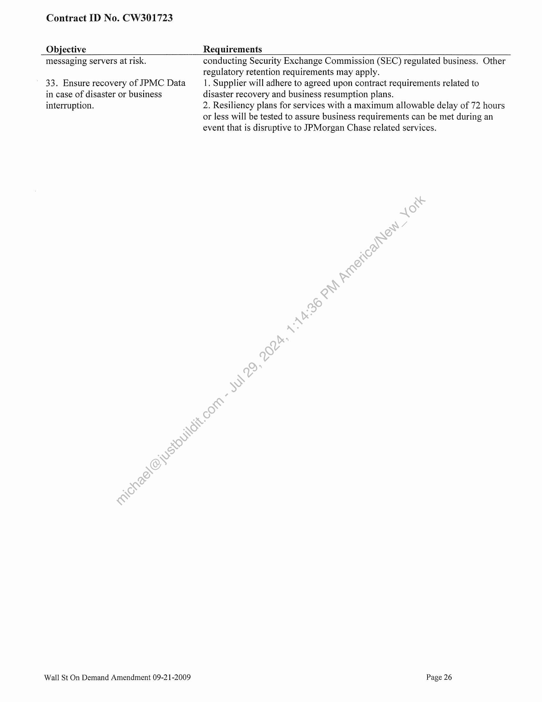
```  
```col-md
Contract ID No. CW301723  
Objective  
Requirements  
messaging servers at risk.
33. Ensure recovery of JPMC Data  
in case of disaster or business
interruption.  
Wall St On Demand Amendment 09-21-2009  
conducting Security Exchange Commission (SEC) regulated business. Other
regulatory retention requirements may apply.  
1. Supplier will adhere to agreed upon contract requirements related to
disaster recovery and business resumption plans.  
2. Resiliency plans for services with a maximum allowable delay of 72 hours
or less will be tested to assure business requirements can be met during an
event that is disruptive to JPMorgan Chase related services.  
Page 26  
```
````
Notes:  


![[_attachments/JPMC-Parent-3.6.1.20.2.1 2010_JPMorgan_Amendment to MSA CW301723.pdf]