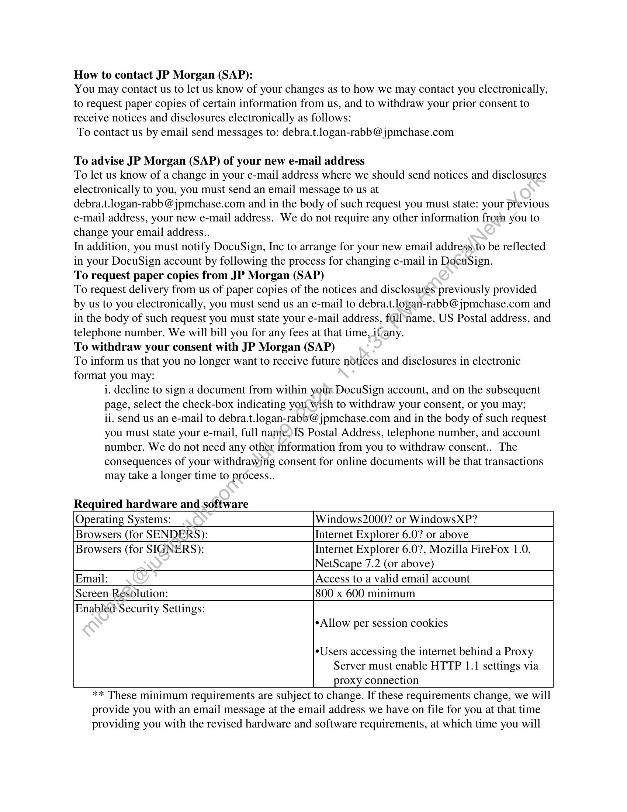

##### Amendment #2 to Schedule No. 3 (Contract ID No. CW2714055)]

  
````col
```col-md
flexGrow=.5
===
> [!info] [Page 1](_attachments/images_JPMC-Parent-3.6.1.20.2.200172892.pdf_210407/page_1.png)
> 
```  
```col-md
DocuSign Envelope ID: A3C098E2-DA1C-421E-B892-CC6735192C6C  
Contract Workspace ID: CW2714055
Amendment #2  
Amendment 2 to Schedule No. 3
(Contract ID No. CW2714055)  
This Amendment | (“Schedule Amendment”) to Schedule No. 3 dated 1* June 2019 by
JPMorgan Chase Bank, National Association, (“JPMC”) and Markit On Demand, Inc. fka Wall Street On
demand (“Supplier”) (“Schedule”) is made and entered into as of June 1 2023 (“Schedule Amendment
Effective Date’) by JPMC, and Supplier.  
WHEREAS, JPMC and Supplier have entered into the Schedule, and
WHEREAS, JPMC and Supplier now wish to amend the Schedule as set forth herein.  
NOW, THEREFORE, in consideration of the foregoing premises and the promisés}terms and conditions
set forth below and other good and valuable consideration, the receipt and sufficiency of which are hereby
acknowledged, the parties hereto, intending to be legally bound, agree as follows:  
1. To amend the Schedule as of the Schedule Amendment Effective‘Date as follows:  
a) The Schedule Term as per Section 2 under the Schedule is-hereby extended from June 1* 2023 to
May 31* 2025  
b) A fixed fee of $35,944 per month will be paid as defined in Section 9 of the Schedule  
c) Termination for convenience: JPMC may terminate this Schedule for convenience, in whole or in
part, at any time by giving supplier atleast 60 days’ prior written notice of the termination date.
Upon termination, JPMC will receive a-pro-rata refund of all fees paid in advance  
Except as amended by this Schedule Amendment, the Schedule remains in full force and effect. Terms
with initial capital letters not defined in this Schedule Amendment have the definitions given in the
Schedule. By executing this Schedule Amendment, JPMC and Supplier ratify the terms of the Schedule,
as modified by this Schedule Amendment. This Schedule Amendment may be executed in one or more
counterparts, each of which\will be deemed an original, together constituting the same instrument. If a
provision of the Schedule-and a provision of this Schedule Amendment conflict, the provision of this
Schedule Amendment controls. All references in the Schedule to “this Schedule” or the like are deemed to
refer to the Schedule, as amended by this Schedule Amendment.  
- SIGNATURE PAGE FOLLOWS -  
Amendment to Schedule Page | of 2  
```
````
Notes:    
````col
```col-md
flexGrow=.5
===
> [!info] [Page 2](_attachments/images_JPMC-Parent-3.6.1.20.2.200172892.pdf_210407/page_2.png)
> 
```  
```col-md
DocuSign Envelope ID: A3C098E2-DA1C-421E-B892-CC6735192C6C  
Contract Workspace ID: CW2714055
Amendment #2  
IN WITNESS WHEREOF, JPMC and Supplier have caused duly authorized representatives of their
respective companies to execute this Schedule Amendment as of the Schedule Amendment Effective Date.  
JPMORGAN CHASE BANK,N.A. MARKIT ON DEMAND, INC.
DocuSigned by: DocuSigned by:
By: ANDREW C. SUMUWERS By: Kure Spompinato
yr CECFATOS7SET2F y 2D2ETISZTABSAME:  
ANDREW C. SUMMERS Printed Name: Renee Spampinato  
6/5/2023
Date: Date: 6/5/2023  
Printed Name:  
vP- Global Supplier Services Head of Markit Digital
Title: Title:  
The parties acknowledge and agree that this Schedule Amendment.may be signed using a digital
image of the signing party’s hand-written signature and that such: electronic signature will be
considered legally binding.  
Amendment to Schedule Page 2 of 2  
```
````
Notes:    
````col
```col-md
flexGrow=.5
===
> [!info] [Page 3](_attachments/images_JPMC-Parent-3.6.1.20.2.200172892.pdf_210407/page_3.png)
> 
```  
```col-md
Certificate Of Completion  
Envelope Id: A3CO98E2DA1C421EB892CC6735192C6C
Subject: CRW3341799 - JPMC Amendment 2 to Schedule 3 JPM 02172023 (2).docx  
Source Envelope:  
Document Pages: 2  
Certificate Pages: 5  
AutoNav: Enabled  
Envelopeld Stamping: Enabled  
Signatures: 2
Initials: 0  
Time Zone: (UTC-05:00) Eastern Time (US & Canada)  
Record Tracking  
Status: Original
6/5/2023 5:56:10 AM  
Signer Events  
Renee Spampinato
Renee.Spampinato @spglobal.com
Head of Markit Digital  
Security Level: Email, Account Authentication
(None)  
Electronic Record and Signature Disclosure:
Accepted: 6/5/2023 8:21:19 AM
ID: 31ab9709-d5b3-4a63-91 bb-d3f817155cbe  
ANDREW C. SUMMERS
andrew.c.summers@jpmchase.com
VP- Global Supplier Services
JPMorgan Chase & Co.  
Security Level: Email, Account Authentication
(None)  
Electronic Record and Signature Disclosure:
Not Offered via DocuSign  
In Person Signer Events
Editor Delivery Events
Agent Delivery Events
Intermediary Delivery Events
Certified Delivery.Events
Carbon Copy Events
Witness Events  
Notary Events  
Envelope Summary Events
Envelope Sent  
Certified Delivered  
Signing Complete  
Holder: Mohammed Kashief  
mohammed.kashief@jpmchase.com  
Signature
Docusigned by  
Rune Spampinato  
-2D2E73927AB344E,  
Signature Adoption: Pre-selected Style
Using IP Address: 165.225.220.239  
DocuSigned by:  
ANDREW (. SUNUWERS  
2CBCFAT6573B42F.  
Signature Adoption: Pre-selected Style  
Using IP Address: 159.53.110.140  
Signature
Status
Status
Status
Status
Status
Signature
Signature  
Status
Hashed/Encrypted
Security Checked
Security Checked  
DocuSign  
Status: Completed  
Envelope Originator:  
Mohammed Kashief  
270 Park Ave FL 12  
New York, NY 10017
mohammed.kashief@jpmchase.com
IP Address: 34.71.29.60  
Location: DocuSign  
Timestamp  
Sent: 6/5/2023 5:57:27 AM
Viewed6/5/2023 8:21:19 AM
Sigried: 6/5/2023 9:50:12 AM  
Sent: 6/5/2023 9:50:13 AM
Viewed: 6/5/2023 10:37:17 AM
Signed: 6/5/2023 10:37:28 AM  
Timestamp
Timestamp
Timestamp
Timestamp
Timestamp
Timestamp
Timestamp
Timestamp
Timestamps
6/5/2023 5:57:27 AM  
6/5/2023 10:37:17 AM
6/5/2023 10:37:28 AM  
```
````
Notes:    
````col
```col-md
flexGrow=.5
===
> [!info] [Page 4](_attachments/images_JPMC-Parent-3.6.1.20.2.200172892.pdf_210407/page_4.png)
> 
```  
```col-md
Envelope Summary Events Status Timestamps
Completed Security Checked 6/5/2023 10:37:28 AM  
Payment Events Status Timestamps  
Electronic Record and Signature Disclosure  
```
````
Notes:    
````col
```col-md
flexGrow=.5
===
> [!info] [Page 5](_attachments/images_JPMC-Parent-3.6.1.20.2.200172892.pdf_210407/page_5.png)
> 
```  
```col-md
Electronic Record and Signature Disclosure created on: 10/28/2016 10:06:15 AM
Parties agreed to: Renee Spampinato  
ELECTRONIC RECORD AND SIGNATURE DISCLOSURE  
From time to time, JP Morgan (SAP) (we, us or Company) may be required by law to provide to
you certain written notices or disclosures. Described below are the terms and conditions for
providing to you such notices and disclosures electronically through your DocuSign, Inc.
(DocuSign) Express user account. Please read the information below carefully and thoroughly,
and if you can access this information electronically to your satisfaction and agree to these terms
and conditions, please confirm your agreement by clicking the 'I agree’ button at the bottom of,
this document.  
Getting paper copies  
At any time, you may request from us a paper copy of any record provided or made available
electronically to you by us. For such copies, as long as you are an authorized user_ofthe
DocuSign system you will have the ability to download and print any documents we send to you
through your DocuSign user account for a limited period of time (usually 30:days) after such
documents are first sent to you. After such time, if you wish for us to send ‘you paper copies of
any such documents from our office to you, you will be charged a $0.00 per-page fee. You may
request delivery of such paper copies from us by following the procedure described below.
Withdrawing your consent  
If you decide to receive notices and disclosures from us electronically, you may at any time
change your mind and tell us that thereafter you want to receive required notices and disclosures
only in paper format. How you must inform us of your décision to receive future notices and
disclosure in paper format and withdraw your consent to receive notices and disclosures
electronically is described below.  
Consequences of changing your mind  
If you elect to receive required notices and disclosures only in paper format, it will slow the
speed at which we can complete certain steps in transactions with you and delivering services to
you because we will need first to send the required notices or disclosures to you in paper format,
and then wait until we receive back from you your acknowledgment of your receipt of such
paper notices or disclosures. To indicate to us that you are changing your mind, you must
withdraw your consent using the DocuSign 'Withdraw Consent' form on the signing page of your
DocuSign account. This willindicate to us that you have withdrawn your consent to receive
required notices and disclosures electronically from us and you will no longer be able to use your
DocuSign Express useraccount to receive required notices and consents electronically from us
or to sign electronically documents from us.  
All notices and. disclosures will be sent to you electronically  
Unless you tellus otherwise in accordance with the procedures described herein, we will provide
electronically to you through your DocuSign user account all required notices, disclosures,
authorizations, acknowledgements, and other documents that are required to be provided or
madesavailable to you during the course of our relationship with you. To reduce the chance of
you inadvertently not receiving any notice or disclosure, we prefer to provide all of the required
notices and disclosures to you by the same method and to the same address that you have given
us. Thus, you can receive all the disclosures and notices electronically or in paper format through
the paper mail delivery system. If you do not agree with this process, please let us know as
described below. Please also see the paragraph immediately above that describes the
consequences of your electing not to receive delivery of the notices and disclosures
electronically from us.  
```
````
Notes:    
````col
```col-md
flexGrow=.5
===
> [!info] [Page 6](_attachments/images_JPMC-Parent-3.6.1.20.2.200172892.pdf_210407/page_6.png)
> 
```  
```col-md
How to contact JP Morgan (SAP):  
You may contact us to let us know of your changes as to how we may contact you electronically,
to request paper copies of certain information from us, and to withdraw your prior consent to
receive notices and disclosures electronically as follows:  
To contact us by email send messages to: debra.t.logan-rabb @jpmchase.com  
To advise JP Morgan (SAP) of your new e-mail address
To let us know of a change in your e-mail address where we should send notices and disclosures
electronically to you, you must send an email message to us at
debra.t.logan-rabb @jpmchase.com and in the body of such request you must state: your previous
e-mail address, your new e-mail address. We do not require any other information from you to
change your email address.  

In addition, you must notify DocuSign, Inc to arrange for your new email address\to be reflected
in your DocuSign account by following the process for changing e-mail in DocuSign.
To request paper copies from JP Morgan (SAP)
To request delivery from us of paper copies of the notices and disclosures previously provided
by us to you electronically, you must send us an e-mail to debra.t.logan-rabb @jpmchase.com and
in the body of such request you must state your e-mail address, fallname, US Postal address, and
telephone number. We will bill you for any fees at that time, ifrany.
To withdraw your consent with JP Morgan (SAP)
To inform us that you no longer want to receive future notices and disclosures in electronic
format you may:
i. decline to sign a document from within your DocuSign account, and on the subsequent
page, select the check-box indicating you wish to withdraw your consent, or you may;
ii. send us an e-mail to debra.t.logan-rabb@ jpmchase.com and in the body of such request
you must state your e-mail, full name,IS Postal Address, telephone number, and account
number. We do not need any other information from you to withdraw consent.  
 The
consequences of your withdrawing consent for online documents will be that transactions
may take a longer time to process.  
  
Required hardware and software  
Operating Systems: Windows2000? or WindowsXP?  
Browsers (for SENDERS): Internet Explorer 6.0? or above  
Browsers (for SIGNERS): Internet Explorer 6.0?, Mozilla FireFox 1.0,
NetScape 7.2 (or above)  
Email: Access to a valid email account  
Screen Resolution: 800 x 600 minimum  
Enabléd Security Settings:
eAllow per session cookies  
Users accessing the internet behind a Proxy
Server must enable HTTP 1.1 settings via
proxy connection  
** These minimum requirements are subject to change. If these requirements change, we will  
provide you with an email message at the email address we have on file for you at that time  
providing you with the revised hardware and software requirements, at which time you will  
```
````
Notes:    
````col
```col-md
flexGrow=.5
===
> [!info] [Page 7](_attachments/images_JPMC-Parent-3.6.1.20.2.200172892.pdf_210407/page_7.png)
> 
```  
```col-md
have the right to withdraw your consent.  
Acknowledging your access and consent to receive materials electronically  
To confirm to us that you can access this information electronically, which will be similar to
other electronic notices and disclosures that we will provide to you, please verify that you
were able to read this electronic disclosure and that you also were able to print on paper or
electronically save this page for your future reference and access or that you were able to
e-mail this disclosure and consent to an address where you will be able to print on paper or
save it for your future reference and access. Further, if you consent to receiving notices and
disclosures exclusively in electronic format on the terms and conditions described above,
please let us know by clicking the 'I agree’ button below.  
By checking the 'I Agree’ box, I confirm that:  
¢ Ican access and read this Electronic CONSENT TO ELECTRONIC RECEIPT OF
ELECTRONIC RECORD AND SIGNATURE DISCLOSURES document; and  
¢ Ican print on paper the disclosure or save or send the disclosure to a place where I can
print it, for future reference and access; and  
¢ Until or unless I notify JP Morgan (SAP) as described) above, I consent to receive from
exclusively through electronic means all notices, disclosures, authorizations,
acknowledgements, and other documents that,are required to be provided or made
available to me by JP Morgan (SAP) duringthe course of my relationship with you.  
```
````
Notes:  


![[_attachments/JPMC-Parent-3.6.1.20.2.2 00172892.pdf]