##### MASTER AGREEMENT]

  
````col
```col-md
flexGrow=.5
===
> [!info] [Page 1](_attachments/images_JPMC-Parent-3.6.1.20.2.32009_WSOD_JPMorganMSACW2808051.pdf_210317/page_1.png)
> 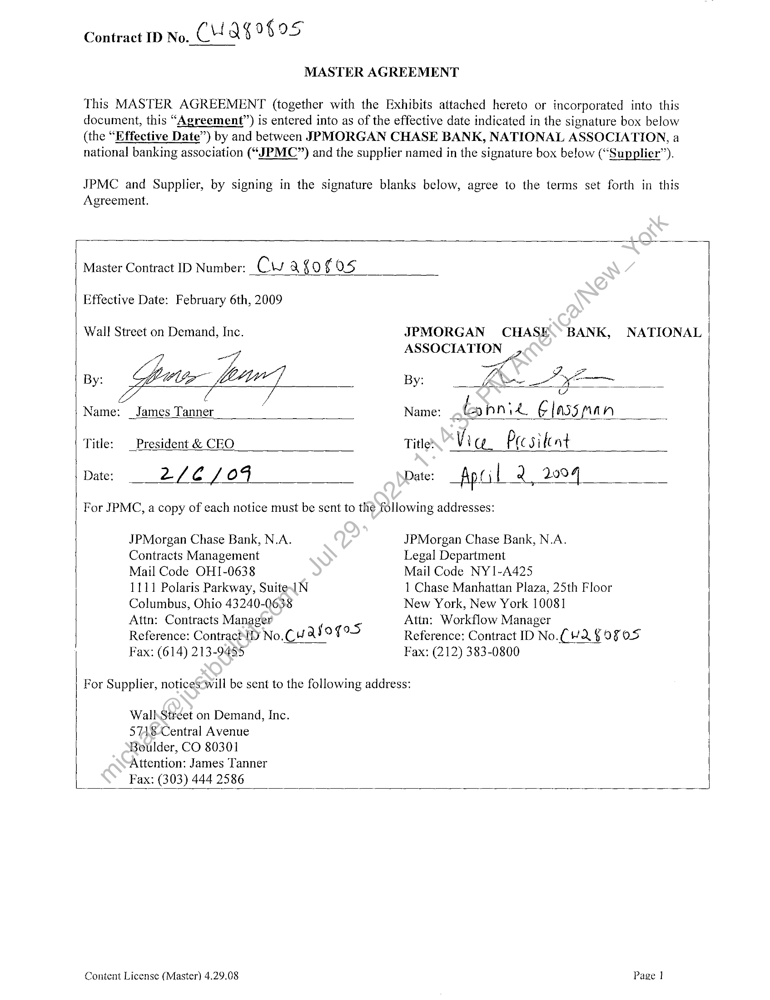
```  
```col-md
co
Contract ID No. Cu ag 06 95  
MASTER AGREEMENT  
This MASTER AGREEMENT (together with the Exhibits attached hereto or incorporated into this
document, this “Agreement” is entered into as of the effective date indicated in the signature box below
(the “Effective Date”) by and between JEMORGAN CHASE BANK, NATIONAL ASSOCIATION, a
national banking association (“JPMC”) and the supplier named in the signature box below (“Supplier”).  
JPMC and Supplier, by signing in the signature blanks below, agree to the terms set forth in this  
Agreement.  
Master Contract ID Number, Cv & (OFOS  
Effective Date: February 6th, 2009  
Wall Street on Demand, Inc.  
By: forxbwd  
Name: _ James Tanner  
Title: _ President & CEO  
Date: 2/C/ oF  
JPMORGAN CHASES BANK, NATIONAL
ASSOCIATION _,  
_
By: hoe a o———  
Name: banned Glassman  
titer Vice Presilent
Date: Ap. | aq. 2994  
For JPMC, a copy of each notice must be sent to the following addresses:  
JPMorgan Chase Bank, N.A.  
Contracts Management  
Mail Code OH1-0638  
1111 Polaris Parkway, Suites|N
Columbus, Ohio 43240-0638  
Attn: Contracts Manager  
Reference: Contract 1D No.C¥ & fogos
Fax: (614) 213-9455  
JPMorgan Chase Bank, N.A.  
Legal Department  
Mail Code NY1-A425  
1 Chase Manhattan Plaza, 25th Floor
New York, New York 10081  
Attn: Workflow Manager  
Reference: Contract ID No.C #2 § Of 0S
Fax: (212) 383-0800  
For Supplier, noticesswill be sent to the following address:  
WalhStréeet on Demand, Inc.
578 Central Avenue
Boulder, CO 80301
Attention: James Tanner
Fax: (303) 444 2586  
Content License (Master) 4.29.08  
Page 1  
```
````
Notes:    
````col
```col-md
flexGrow=.5
===
> [!info] [Page 2](_attachments/images_JPMC-Parent-3.6.1.20.2.32009_WSOD_JPMorganMSACW2808051.pdf_210317/page_2.png)
> 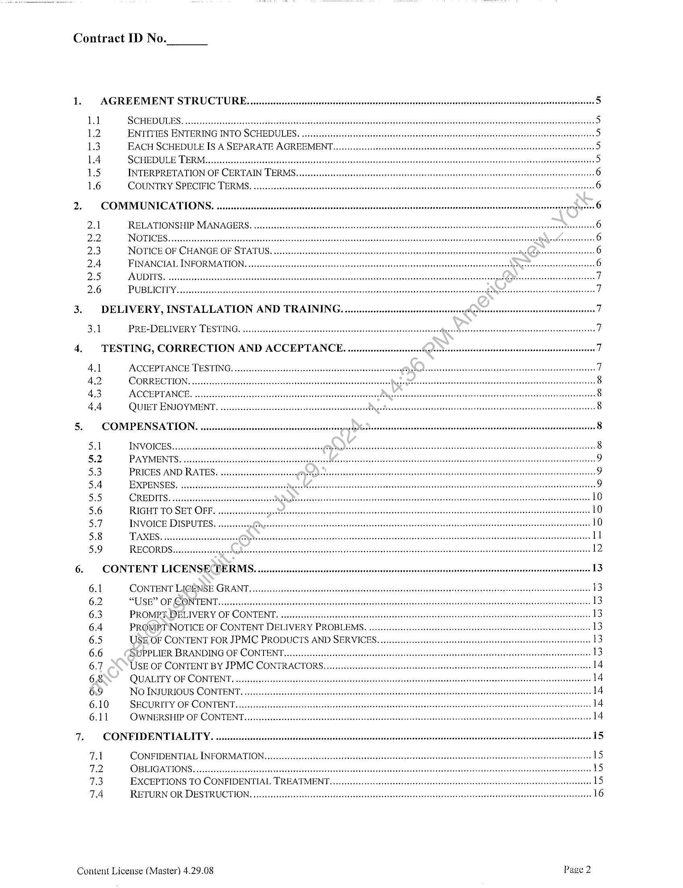
```  
```col-md
Contract ID No.  
1. AGREEMENT STRUCTURE. 5
11 SCHEDULES. .  5
1.2 ENTITIES ENTERING INTO SCHEDULES. 5
1.3 EACH SCHEDULE IS A SEPARATE AGREEMENT.  5
14 SCHEDULE TERM.  see i)
1.5 INTERPRETATION OF CERTAIN TERMS. 6
1.6 COUNTRY SPECIFIC TERMS. .    
seeecees  
2. COMMUNICATIONS. .   
ccssscssssssssssssssseserecesssssesavevsvsesesscscssesscseressaceeauseavacavensenesesassesestecseeseatarersnsrscacapvurtaenes 6
2.1 RELATIONSHIP MANAGERS. u.csscsesesssesssenenesecesseseusesnseessesscesucecseseseseneneacacaescavevevsceveceraverscecsearereutisesenebreseitiees 6
2.2 NOTICES 6
2.3 NOTICE OF CHANGE OF STATUS 6
2.4 FINANCIAL INFORMATION. .     
 6
2.5 AUDITS. .   a7
2.6 PUBLICITY.  
 a7  
3. DELIVERY, INSTALLATION AND TRAINING.  cscsessssessrsesesecnsesessesesnenseg@idbentersnseseerersrsantsseeersesenenseeers 7
3.1 PRE-DELIVERY TESTING, vescsecccsesesesseeseseeeeneseeesseeeereneeseneeeeacenevencecaeserssifersdesveueasscssessesesseeessssserseeeensasereses 7  
4, TESTING, CORRECTION AND ACCEPTANCE. .  scsssssscssercesssessingsuentvescssnsnsersssssesasseseseasacnenenessarsnseneneess 7
4 ACCEPTANCE TESTING.  
42 CORRECTION
43 ACCEPTANCE, «0.  
44 QUIET ENJOYMENT. .  
5. COMPENSATION. .   
cessssesssssssesssssrsssrersceseesesssecsscgmnpaplissbessessvsssesesesssessessnsessescaseseussssssessessesaceveseseceeerensaesrensres 8
5.1 INVOICES.  8
5.2 PAYMENTS. .  9
5.3 PRICES AND RATES. . 9
5.4 EXPENSES. . .
5.5 CREDITS.  
 .  
 10
5.6 RIGHT TO SET OFF 10
5.7 INVOICE DISPUTES 10
5.8 TAXES.    
5.9 RECORDS  
6. CONTENT LICENSECLERMS. .   
sescsssssssssssscssssresssscssevessssesnencareneneeeevenenesecssaenenensnscsesseneneenanenenssaceusasanenseneces 13
6.1 CONTENT LICENSE GRANT. 213
6.2 “USE” OF CONTENT.  13
63 PROMPT DELIVERY OF CONTENT. .  3
64 PROMPT NOTICE OF CONTENT DELIVERY PROBLEMS. 3
6.5 USE OF CONTENT FOR JPMC PRODUCTS AND SERVICES. 3
6.6 SUPPLIER BRANDING OF CONTENT.  
 13
6.7 USE OF CONTENT BY JPMC CONTRACTORS.  
 14
68 QUALITY OF CONTENT.  14
69 No INJURIOUS CONTENT. 14
6.10 SECURITY OF CONTENT.  
 wl4
6.11 OWNERSHIP OF CONTENT.  14  
JT. CONFIDENTIALITY. ou. eeessscsssssosssersssscsssesssssssserevssorscessesesevenssescsarscsssecsceecacevessseseeneneseeseteneeneneeseseavensneness 15
7A CONFIDENTIAL INFORMATION.  
 ww lS
72 OBLIGATIONS.  iS
73 EXCEPTIONS TO CONFIDEN’ 1S
TA RETURN OR DESTRUCTION, 16  
Content License (Master) 4.29.08 Page 2  
```
````
Notes:    
````col
```col-md
flexGrow=.5
===
> [!info] [Page 3](_attachments/images_JPMC-Parent-3.6.1.20.2.32009_WSOD_JPMorganMSACW2808051.pdf_210317/page_3.png)
> 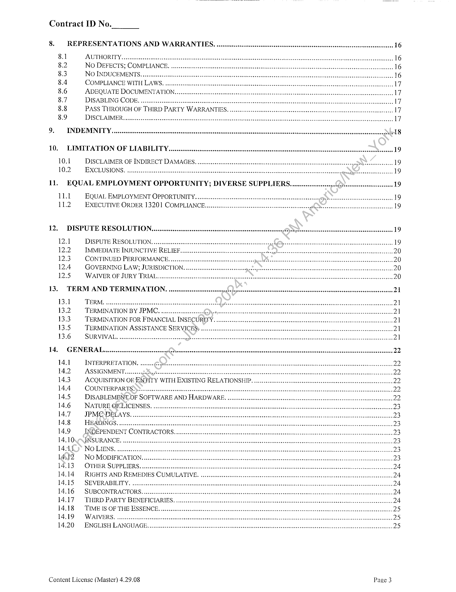
```  
```col-md
Contract ID No.  
8. REPRESENTATIONS AND WARRANTIES. w.ccscssssscssssscesesessscessesssesseenecnesscsesssssessssesscsnesarescenssscsssssaves 16  
8.1  
AUTHORITY  
8.2 No DEFECTS; COMPLIANCE. .  
 16
8.3 NO INDUCEMENTS. .  seeseseese 16
8.4 COMPLIANCE WITH LAWS. . 17
8.6 ADEQUATE DOCUMENTATION 17
8.7 DISABLING CODE. .  secsseccsestesereseeeeeetenesteeeseeses 17
8.8 PASS THROUGH OF THIRD PARTY WARRANTIES 17
8.9 DISCLAIMER.  eessseccseseeesrereeeeetstseeeeneneeeeeneneseeee 17
9. INDEMNITY.  csessecsssseeeeseerecssssecesseseseserereee b18
10, LIMITATION OF LIABILITY.  cccsssesessscseesecsssessecetencsssessscsssausnssusssassnsenstacsecserscsersessesssssesscsersrelbcavenes 19
0.1 DISCLAIMER OF INDIRECT DAMAGES
0.2. EXCLUSIONS. .  
11. EQUAL EMPLOYMENT OPPORTUNITY; DIVERSE SUPPLIERS.   
  
IL
1.2  
EQUAL EMPLOYMENT OPPORTUNITY. .
EXECUTIVE ORDER 13201 COMPLIANCE.  
12, DISPUTE RESOLUTION .    
cccsesssesesssecsesssscsssssesssevsvesssecessssossceesscscssidjebueissseecsesesscaceeesuscesarsevseseusssusaseusesees 19
2.1 DISPUTE RESOLUTION. . wld
12.2 IMMEDIATE INJUNCTIVE RELIEF 20
2.3 CONTINUED PERFORMANCE.    
 20
24 GOVERNING LAW; JURISDICTION. . 20
2.5 WAIVER OF JURY TRIAL
13. TERM AND TERMINATION, .  
scssecssssssesssrsscssssesaefeporesscnssesssssaratssessussssecsssesssacsesesasansessscessesessencaseesseevesenee 21
13.1 TERM, vecseessesesestererereteneee
13,2 TERMINATION BY JPMC.
13.3 TERMINATION FOR FINANCIAL INSECURITY.  
13.5 TERMINATION ASSISTANCE SERVICE
13.6 SURVIVAL, vecccesseceeseeteeeeseseeterensdes
14, GENERAL.  eessessesessssessesensenavletbacereusseavevsvssucscesensssesesesesscsssasssessesesesnsessseeearansassossgsesaducneercasarenssrerseeassnsesaees 22
14.1 INTERPRETATION. oosssssGiopesssesssvesvssesessesssesecereusnesssacseaueeseseucanencaesusueseaveseaeanesessessaeasensassnsueseeveseasassecsneseseness 22
14.2 ASSIGNMENT.
14.3 ACQUISITION OF ENTITY WITH EXISTING RELATIONSHIP
14.4 COUNTERPARTS) oes ssesecsesesesseceesesesrerenenensneeseeteneasacneneseasanee
14.5 DISABLEMENT_OF SOFTWARE AND HARDWARE.
14.6 | NATURE OF LICENSES. .
14.7, JPME€DELAYS.
14.8 HEADINGS.
14.9 INDEPENDENT CONTRACTORS
14, LOENSURANCE, vcccceecseseteeeseeeeeeee
14.A105° NO LIENS, ween
14.12 NO MODIFICATION
14.13 OTHER SUPPLIERS.  
14.14 RIGHTS AND REMEDIES CUMULATIVE.
14.15 SEVERABILITY. .   
14.16 SUBCONTRACTORS
14.17 THIRD PARTY BENEFICIARIES.
14.18 TIME IS OF THE ESSENCE.
14.19 WAIVERS. uo.
14.20 ENGLISH LANGUAGE.  
Content License (Master) 4.29.08 Page 3  
```
````
Notes:    
````col
```col-md
flexGrow=.5
===
> [!info] [Page 4](_attachments/images_JPMC-Parent-3.6.1.20.2.32009_WSOD_JPMorganMSACW2808051.pdf_210317/page_4.png)
> 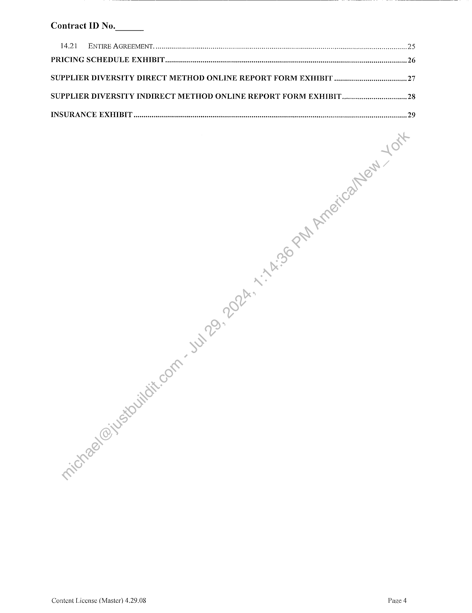
```  
```col-md
Contract ID No.  
14.21 ENTIRE AGREEMENT, .cscssessssesessesesssseseccsseseseeecsneueseseercseseceessacsessnsecerensseensaesesseacaneneseeussesesesseansneesaneateveees 25
PRICING SCHEDULE EXHIDBIT.     
c.scscssssessssesssesssssssssesssscsnssssssecevecssacessscsssncsssveessesesecsnsseneaseveteenessessseasaversnenese 26
SUPPLIER DIVERSITY DIRECT METHOD ONLINE REPORT FORM EXHIBIT .     sesesessscseseecrereneeees 27  
SUPPLIER DIVERSITY INDIRECT METHOD ONLINE REPORT FORM EXHIBIT.    
INSURANCE EXHIBIT .   cccccsssssssesssssssssecssssssssesessssssssessrecesesssssessssessransscassssansssasscsencarsaseveresseeaevssonrensesaenearensnenees 29  
Content License (Master) 4,29,08 Page 4  
```
````
Notes:    
````col
```col-md
flexGrow=.5
===
> [!info] [Page 5](_attachments/images_JPMC-Parent-3.6.1.20.2.32009_WSOD_JPMorganMSACW2808051.pdf_210317/page_5.png)
> 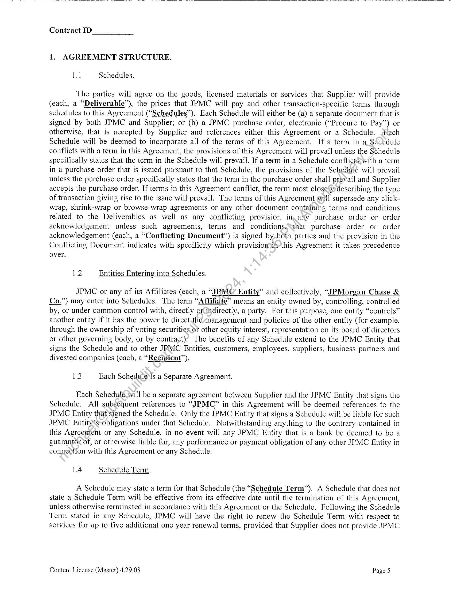
```  
```col-md
Contract ID  
1. AGREEMENT STRUCTURE.
Ll Schedules.  
The parties will agree on the goods, licensed materials or services that Supplier will provide
(each, a “Deliverable”), the prices that JPMC will pay and other transaction-specific terms through
schedules to this Agreement (“Schedules”). Each Schedule will either be (a) a separate document that is
signed by both JPMC and Supplier; or (b) a JPMC purchase order, electronic (“Procure to Pay”) or
otherwise, that is accepted by Supplier and references either this Agreement or a Schedule. (Each
Schedule will be deemed to incorporate all of the terms of this Agreement. If a term in a Schedule
conflicts with a term in this Agreement, the provisions of this Agreement will prevail unless the Schedule
specifically states that the term in the Schedule will prevail. If a term in a Schedule conflicts with a term
in a purchase order that is issued pursuant to that Schedule, the provisions of the Schedtwle will prevail
unless the purchase order specifically states that the term in the purchase order shall prevail and Supplier
accepts the purchase order. If terms in this Agreement conflict, the term most closely describing the type
of transaction giving rise to the issue will prevail. The terms of this Agreement will supersede any clickwrap, shrink-wrap or browse-wrap agreements or any other document containing terms and conditions
related to the Deliverables as well as any conflicting provision inyany purchase order or order
acknowledgement unless such agreements, terms and conditions,\that purchase order or order
acknowledgement (each, a “Conflicting Document”) is signed by.both parties and the provision in the
Conflicting Document indicates with specificity which provisiominthis Agreement it takes precedence
over.  
1.2 Entities Entering into Schedules.  
JPMC or any of its Affiliates (each, a “JRMC Entity” and collectively, “JPMorgan Chase &
Co.”) may enter into Schedules. The term “Affiliate” means an entity owned by, controlling, controlled
by, or under common control with, directly or@ndirectly, a party. For this purpose, one entity “controls”
another entity if it has the power to direct.the management and policies of the other entity (for example,
through the ownership of voting securities.or other equity interest, representation on its board of directors
or other governing body, or by contract): The benefits of any Schedule extend to the JPMC Entity that
signs the Schedule and to other JPMC Entities, customers, employees, suppliers, business partners and
divested companies (each, a “Recipient”).  
13 Each Schedules a Separate Agreement.  
Each Scheduléwill be a separate agreement between Supplier and the JPMC Entity that signs the
Schedule. All subsequent references to “JPMC” in this Agreement will be deemed references to the
JPMC Entity that signed the Schedule. Only the JPMC Entity that signs a Schedule will be liable for such
JPMC Entity’s-obligations under that Schedule. Notwithstanding anything to the contrary contained in
this Agreement or any Schedule, in no event will any JPMC Entity that is a bank be deemed to be a
guarantor of, or otherwise liable for, any performance or payment obligation of any other JPMC Entity in
connection with this Agreement or any Schedule.  
1.4 Schedule Term.  
A Schedule may state a term for that Schedule (the “Schedule Term”). A Schedule that does not
state a Schedule Term will be effective from its effective date until the termination of this Agreement,
unless otherwise terminated in accordance with this Agreement or the Schedule. Following the Schedule
Term stated in any Schedule, JPMC will have the right to renew the Schedule Term with respect to
services for up to five additional one year renewal terms, provided that Suppiier does not provide JPMC  
Content License (Master) 4.29.08 Page 5  
```
````
Notes:    
````col
```col-md
flexGrow=.5
===
> [!info] [Page 6](_attachments/images_JPMC-Parent-3.6.1.20.2.32009_WSOD_JPMorganMSACW2808051.pdf_210317/page_6.png)
> 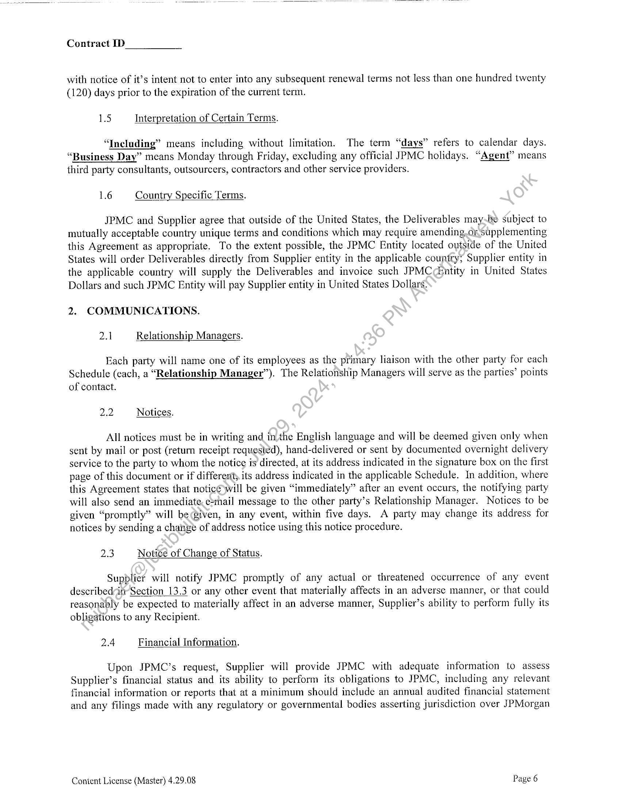
```  
```col-md
Contract ID  
with notice of it’s intent not to enter into any subsequent renewal terms not less than one hundred twenty
(120) days prior to the expiration of the current term.  
1.5 Interpretation of Certain Terms.  
“Including” means including without limitation. The term “days” refers to calendar days.
“Business Day” means Monday through Friday, excluding any official JPMC holidays. “Agent” means
third party consultants, outsourcers, contractors and other service providers.  
1.6 Country Specific Terms.  
JPMC and Supplier agree that outside of the United States, the Deliverables may-be subject to
mutually acceptable country unique terms and conditions which may require amending.or Supplementing
this Agreement as appropriate. To the extent possible, the JPMC Entity located outside of the United
States will order Deliverables directly from Supplier entity in the applicable country; Supplier entity in
the applicable country will supply the Deliverables and invoice such JPMC Entity in United States
Dollars and such JPMC Entity will pay Supplier entity in United States Dollars.  
2. COMMUNICATIONS.  
2.1 Relationship Managers.  
Each party will name one of its employees as the primary liaison with the other party for each
Schedule (cach, a “Relationship Manager”). The Relationship Managers will serve as the parties’ points
of contact.  
2.2 Notices.  
All notices must be in writing and inthe English language and will be deemed given only when
sent by mail or post (return receipt requested), hand-delivered or sent by documented overnight delivery
service to the party to whom the notice is’ directed, at its address indicated in the signature box on the first
page of this document or if different; its address indicated in the applicable Schedule. In addition, where
this Agreement states that notice will be given “immediately” after an event occurs, the notifying party
will also send an immediate. e*rnail message to the other party’s Relationship Manager. Notices to be
given “promptly” will be @iven, in any event, within five days. A party may change its address for
notices by sending a change of address notice using this notice procedure.  
2.3 Notice of Change of Status.  
Supplier will notify JPMC promptly of any actual or threatened occurrence of any event
described Section 13.3 or any other event that materially affects in an adverse manner, or that could
reasonably be expected to materially affect in an adverse manner, Supplier’s ability to perform fully its
obligations to any Recipient.  
2.4 Financial Information.
Upon JPMC’s request, Supplier will provide JPMC with adequate information to assess
Supplier’s financial status and its ability to perform its obligations to JPMC, including any relevant  
financial information or reports that at a minimum should include an annual audited financial statement
and any filings made with any regulatory or governmental bodies asserting jurisdiction over JPMorgan  
Content License (Master) 4.29.08 Page 6  
```
````
Notes:    
````col
```col-md
flexGrow=.5
===
> [!info] [Page 7](_attachments/images_JPMC-Parent-3.6.1.20.2.32009_WSOD_JPMorganMSACW2808051.pdf_210317/page_7.png)
> 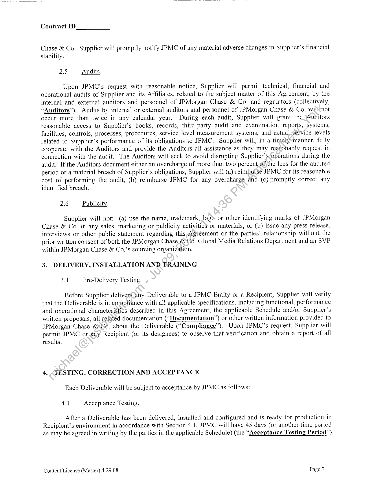
```  
```col-md
Contract ID  
Chase & Co. Supplier will promptly notify JPMC of any material adverse changes in Supplier’s financial
stability.  
2.5 Audits.  
Upon JPMC’s request with reasonable notice, Supplier will permit technical, financial and
operational audits of Supplier and its Affiliates, related to the subject matter of this Agreement, by the
internal and external auditors and personnel of JPMorgan Chase & Co. and regulators (collectively,
“Auditors”), Audits by internal or external auditors and personnel of JPMorgan Chase & Co. willnot
occur more than twice in any calendar year. During each audit, Supplier will grant the Auditors
reasonable access to Supplier’s books, records, third-party audit and examination reports, systems,
facilities, controls, processes, procedures, service level measurement systems, and actual-seivice levels
related to Supplier’s performance of its obligations to JPMC. Supplier will, in a timely-manner, fully
cooperate with the Auditors and provide the Auditors all assistance as they may reasonably request in
connection with the audit. The Auditors will seek to avoid disrupting Supplier’s operations during the
audit. If the Auditors document either an overcharge of more than two percent ofthe fees for the audited
period or a material breach of Supplier’s obligations, Supplier will (a) reimburse JPMC for its reasonable
cost of performing the audit, (b) reimburse JPMC for any overcharge and (c) promptly correct any
identified breach.  
2.6 Publicity.  
Supplier will not: (a) use the name, trademark, jogo or other identifying marks of JPMorgan
Chase & Co. in any sales, marketing or publicity activities or materials, or (b) issue any press release,
interviews or other public statement regarding this Agréement or the parties’ relationship without the
prior written consent of both the JPMorgan Chase & Go. Global Media Relations Department and an SVP
within JPMorgan Chase & Co.’s sourcing organization.  
3. DELIVERY, INSTALLATION AND TRAINING.  
3.1 Pre-Delivery Testing.  
Before Supplier delivers any Deliverable to a JPMC Entity or a Recipient, Supplier will verify
that the Deliverable is in compliance with all applicable specifications, including functional, performance
and operational characteristits described in this Agreement, the applicable Schedule and/or Supplier’s
written proposals, all related documentation (“Documentation”) or other written information provided to
JPMorgan Chase &*Go. about the Deliverable (“Compliance”). Upon JPMC’s request, Supplier will
permit JPMC or any Recipient (or its designees) to observe that verification and obtain a report of all
results.  
4, TESTING, CORRECTION AND ACCEPTANCE.
Each Deliverable will be subject to acceptance by JPMC as follows:  
4 Acceptance Testing.  
After a Deliverable has been delivered, installed and configured and is ready for production in
Recipient’s environment in accordance with Section 4.1, JPMC will have 45 days (or another time period
as may be agreed in writing by the parties in the applicable Schedule) (the “Acceptance Testing Period”)  
Content License (Master) 4.29.08 Page 7  
```
````
Notes:    
````col
```col-md
flexGrow=.5
===
> [!info] [Page 8](_attachments/images_JPMC-Parent-3.6.1.20.2.32009_WSOD_JPMorganMSACW2808051.pdf_210317/page_8.png)
> 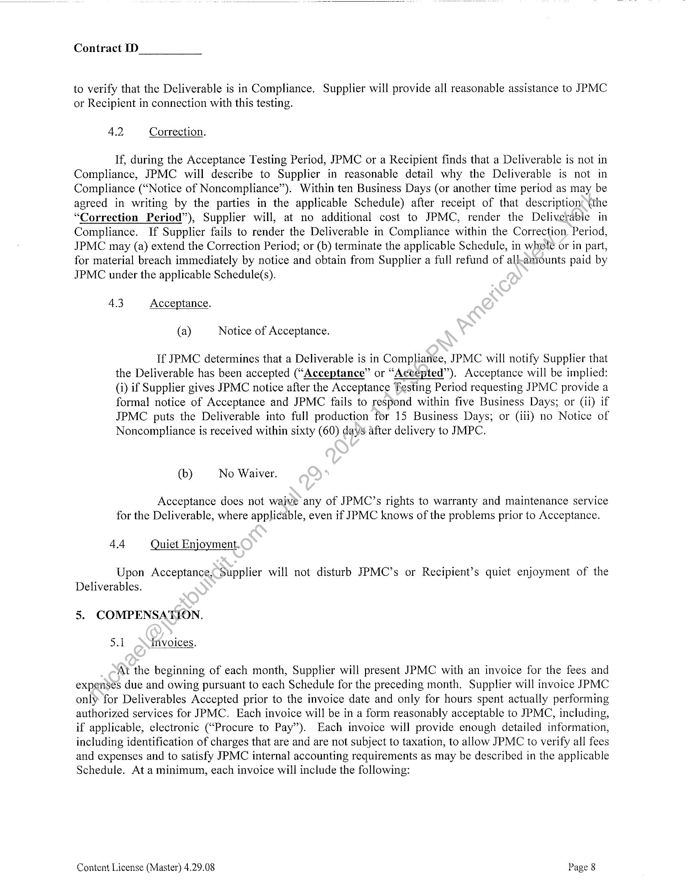
```  
```col-md
Contract ID  
to verify that the Deliverable is in Compliance. Supplier will provide all reasonable assistance to JPMC
or Recipient in connection with this testing.  
42 Correction.  
If, during the Acceptance Testing Period, JPMC or a Recipient finds that a Deliverable is not in
Compliance, JPMC will describe to Supplier in reasonabie detail why the Deliverable is not in
Compliance (“Notice of Noncompliance”). Within ten Business Days (or another time period as may be
agreed in writing by the parties in the applicable Schedule) after receipt of that description (the
“Correction Period”), Supplier will, at no additional cost to JPMC, render the Deliverable in
Compliance. If Supplier fails to render the Deliverable in Compliance within the Correction Period,
JPMC may (a) extend the Correction Period; or (b) terminate the applicable Schedule, in whole or in part,
for material breach immediately by notice and obtain from Supplier a full refund of allanrounts paid by
JPMC under the applicable Schedule(s).  
43 Acceptance.  
(a) Notice of Acceptance.  
If JPMC determines that a Deliverable is in Compliance, JPMC will notify Supplier that
the Deliverable has been accepted (“Acceptance” or “Accépted”). Acceptance will be implied:
(i) if Supplier gives JPMC notice after the Acceptance Testing Period requesting JPMC provide a
formal notice of Acceptance and JPMC fails to respond within five Business Days; or (ii) if
JPMC puts the Deliverable into full production for 15 Business Days; or (iii) no Notice of
Noncompliance is received within sixty (60) days after delivery to JMPC.  
(b) No Waiver.  
Acceptance does not waive any of JPMC’s rights to warranty and maintenance service
for the Deliverable, where applicable, even if JPMC knows of the problems prior to Acceptance.  
44 Quiet Enjoyment.  
Upon Acceptance, Supplier will not disturb JPMC’s or Recipient’s quiet enjoyment of the
Deliverables.  
5. COMPENSATION.
5.1 invoices.  
At the beginning of each month, Supplier will present JPMC with an invoice for the fees and
expensés due and owing pursuant to each Schedule for the preceding month. Supplier will invoice JPMC
only for Deliverables Accepted prior to the invoice date and only for hours spent actually performing
authorized services for JPMC. Each invoice will be in a form reasonably acceptable to JPMC, including,
if applicable, electronic (“Procure to Pay”). Each invoice will provide enough detailed information,
including identification of charges that are and are not subject to taxation, to allow JPMC to verify all fees
and expenses and to satisfy JPMC internal accounting requirements as may be described in the applicable
Schedule. At a minimum, each invoice will include the following:  
Content License (Master) 4.29.08 Page 8  
```
````
Notes:    
````col
```col-md
flexGrow=.5
===
> [!info] [Page 9](_attachments/images_JPMC-Parent-3.6.1.20.2.32009_WSOD_JPMorganMSACW2808051.pdf_210317/page_9.png)
> 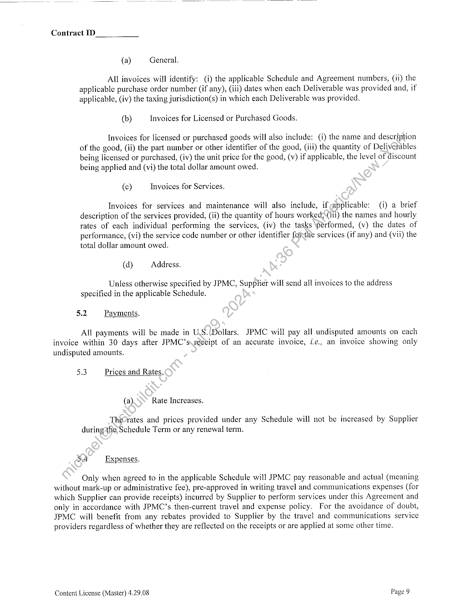
```  
```col-md
Contract ID  
(a) General.  
All invoices will identify: (i) the applicable Schedule and Agreement numbers, (ii) the
applicable purchase order number (if any), (iii) dates when each Deliverable was provided and, if
applicable, (iv) the taxing jurisdiction(s) in which each Deliverable was provided.  
(b) Invoices for Licensed or Purchased Goods.  
Invoices for licensed or purchased goods will also include: (i) the name and description
of the good, (ii) the part number or other identifier of the good, (iii) the quantity of Deliverables
being licensed or purchased, (iv) the unit price for the good, (v) if applicable, the level of discount
being applied and (vi) the total dollar amount owed.  
(c) Invoices for Services.  
Invoices for services and maintenance will also include, if applicable: (i) a brief
description of the services provided, (ii) the quantity of hours worked; (iii) the names and hourly
rates of each individual performing the services, (iv) the tasks \performed, (v) the dates of
performance, (vi) the service code number or other identifier forthe services (if any) and (vii) the
total dollar amount owed.  
(d) Address.  
Unless otherwise specified by JPMC, Supplier will send all invoices to the address
specified in the applicable Schedule.  
5.2 Payments.  
All payments will be made in U,S.\Dollars. JPMC will pay all undisputed amounts on each
invoice within 30 days after JPMC’s\receipt of an accurate invoice, ie., an invoice showing only
undisputed amounts.  
5.3 Prices and Rates.  
(a). Rate Increases.  
Therates and prices provided under any Schedule will not be increased by Supplier
during the Schedule Term or any renewal term.  
D4 Expenses.  
Only when agreed to in the applicable Schedule will JPMC pay reasonable and actual (meaning
without mark-up or administrative fee), pre-approved in writing travel and communications expenses (for
which Supplier can provide receipts) incurred by Supplier to perform services under this Agreement and
only in accordance with JPMC’s then-current travel and expense policy. For the avoidance of doubt,
JPMC will benefit from any rebates provided to Supplier by the travel and communications service
providers regardless of whether they are reflected on the receipts or are applied at some other time.  
Content License (Master) 4.29.08 Page 9  
```
````
Notes:    
````col
```col-md
flexGrow=.5
===
> [!info] [Page 10](_attachments/images_JPMC-Parent-3.6.1.20.2.32009_WSOD_JPMorganMSACW2808051.pdf_210317/page_10.png)
> 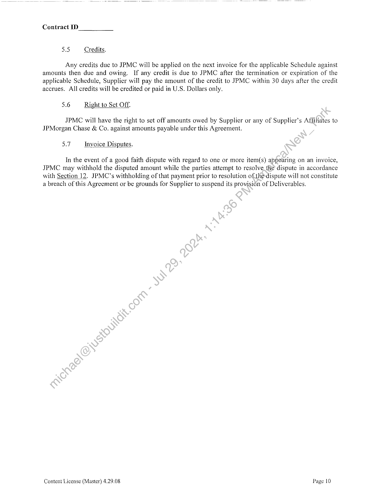
```  
```col-md
Contract ID  
5.5 Credits.  
Any credits due to JPMC will be applied on the next invoice for the applicable Schedule against
amounts then due and owing. If any credit is due to JPMC after the termination or expiration of the
applicable Schedule, Supplier will pay the amount of the credit to JPMC within 30 days after the credit
accrues. All credits will be credited or paid in U.S. Dollars only.  
5.6 Right to Set Off.  
JPMC will have the right to set off amounts owed by Supplier or any of Supplier’s Affiliates to
JPMorgan Chase & Co. against amounts payable under this Agreement.  
5.7 Invoice Disputes.  
In the event of a good faith dispute with regard to one or more item(s) appearing on an invoice,
JPMC may withhold the disputed amount while the parties attempt to resolve the dispute in accordance
with Section 12. JPMC’s withholding of that payment prior to resolution of. the-dispute will not constitute
a breach of this Agreement or be grounds for Supplier to suspend its provision of Deliverables.  
Content License (Master) 4.29.08 Page 10  
```
````
Notes:    
````col
```col-md
flexGrow=.5
===
> [!info] [Page 11](_attachments/images_JPMC-Parent-3.6.1.20.2.32009_WSOD_JPMorganMSACW2808051.pdf_210317/page_11.png)
> 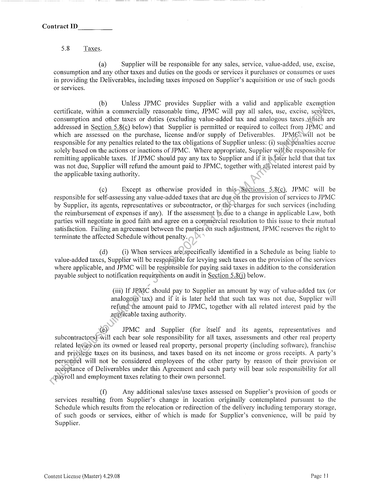
```  
```col-md
Contract ID  
5.8 Taxes.  
(a) Supplier will be responsible for any sales, service, value-added, use, excise,
consumption and any other taxes and duties on the goods or services it purchases or consumes or uses
in providing the Deliverables, including taxes imposed on Supplier’s acquisition or use of such goods
or services.  
(b) Unless JPMC provides Supplier with a valid and applicable exemption
certificate, within a commercially reasonable time, JPMC will pay all sales, use, excise, servives,
consumption and other taxes or duties (excluding value-added tax and analogous taxes which are
addressed in Section 5.8(c) below) that Supplier is permitted or required to collect from JPMC and
which are assessed on the purchase, license and/or supply of Deliverables. JPMG\will not be
responsible for any penalties related to the tax obligations of Supplier unless: (i) sueh{penalties accrue
solely based on the actions or inactions of JPMC. Where appropriate, Supplier will\be responsible for
remitting applicable taxes. If JPMC should pay any tax to Supplier and if it is ater held that that tax
was not due, Supplier will refund the amount paid to JPMC, together with allrelated interest paid by
the applicable taxing authority.  
(c) Except as otherwise provided in thissSections 5.8(c), JPMC will be
responsible for self-assessing any value-added taxes that are due on the provision of services to JEMC
by Supplier, its agents, representatives or subcontractor, or the-charges for such services (including
the reimbursement of expenses if any). If the assessment ts.due to a change in applicable Law, both
parties will negotiate in good faith and agree on a commercial resolution to this issue to their mutual
satisfaction. Failing an agreement between the parties on such adjustment, JPMC reserves the right to
terminate the affected Schedule without penalty.  
(d) (i) When services are specifically identified in a Schedule as being liable to
value-added taxes, Supplier will be responsible for levying such taxes on the provision of the services
where applicable, and JPMC will be responsible for paying said taxes in addition to the consideration
payable subject to notification requirements on audit in Section 5.8(j) below.  
(iii) If JPMIC should pay to Supplier an amount by way of value-added tax (or
analogous tax) and if it is later held that such tax was not due, Supplier will
refund-the amount paid to JPMC, together with all related interest paid by the
applicable taxing authority.  
(e) JPMC and Supplier (for itself and its agents, representatives and
subcontractors)-will each bear sole responsibility for all taxes, assessments and other real property
related levies\on its owned or leased real property, personal property (including software), franchise
and privilege taxes on its business, and taxes based on its net income or gross receipts. A party’s
personnel will not be considered employees of the other party by reason of their provision or
acceptance of Deliverables under this Agreement and each party will bear sole responsibility for all
payroll and employment taxes relating to their own personnel.  
(f) Any additional sales/use taxes assessed on Supplier’s provision of goods or
services resulting from Supplier’s change in location originally contemplated pursuant to the
Schedule which results from the relocation or redirection of the delivery including temporary storage,
of such goods or services, either of which is made for Supplier’s convenience, will be paid by
Supplier.  
Content License (Master) 4.29.08 Page 11  
```
````
Notes:    
````col
```col-md
flexGrow=.5
===
> [!info] [Page 12](_attachments/images_JPMC-Parent-3.6.1.20.2.32009_WSOD_JPMorganMSACW2808051.pdf_210317/page_12.png)
> 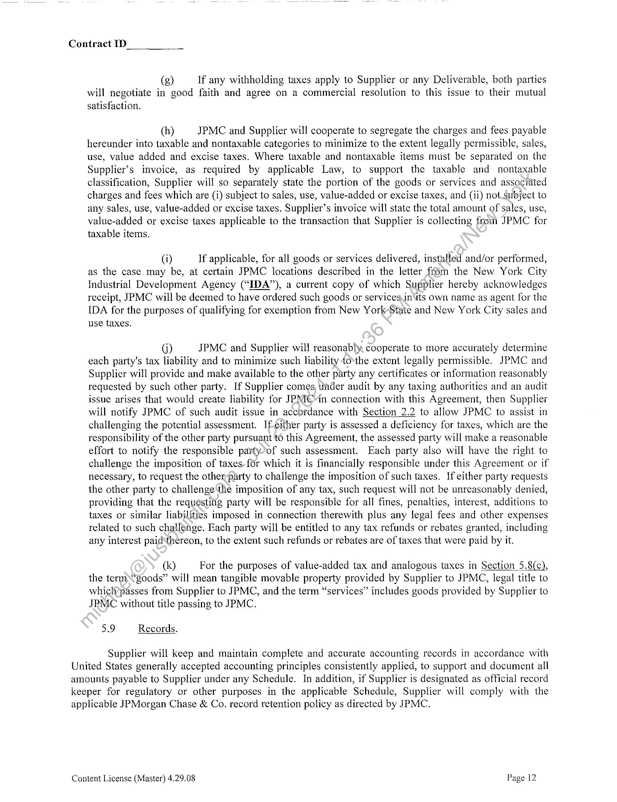
```  
```col-md
Contract ID  
(g) If any withholding taxes apply to Supplier or any Deliverable, both parties
will negotiate in good faith and agree on a commercial resolution to this issue to their mutual
satisfaction.  
(h) JPMC and Supplier will cooperate to segregate the charges and fees payable
hereunder into taxable and nontaxable categories to minimize to the extent legally permissible, sales,
use, value added and excise taxes. Where taxable and nontaxable items must be separated on the
Supplier’s invoice, as required by applicable Law, to support the taxable and nontaxable
classification, Supplier will so separately state the portion of the goods or services and associated
charges and fees which are (i) subject to sales, use, value-added or excise taxes, and (ii) not.subject to
any sales, use, value-added or excise taxes. Supplier’s invoice will state the total amount of sales, use,
value-added or excise taxes applicable to the transaction that Supplier is collecting from JPMC for
taxable items.  
@ If applicable, for all goods or services delivered, installed and/or performed,
as the case may be, at certain JPMC locations described in the letter from the New York City
Industrial Development Agency (“IDA”), a current copy of which Supplier hereby acknowledges
receipt, JPMC will be deemed to have ordered such goods or servicesin‘its own name as agent for the
IDA for the purposes of qualifying for exemption from New York-State and New York City sales and
use taxes.  
g) JPMC and Supplier will reasonably, cooperate to more accurately determine
each party's tax liability and to minimize such liability tothe extent legally permissible. JPMC and
Supplier will provide and make available to the other party any certificates or information reasonably
requested by such other party. If Supplier comes, wader audit by any taxing authorities and an audit
issue arises that would create liability for JPMCvin connection with this Agreement, then Supplier
will notify JPMC of such audit issue in accordance with Section 2.2 to allow JPMC to assist in
challenging the potential assessment. If-cither party is assessed a deficiency for taxes, which are the
responsibility of the other party pursuant to this Agreement, the assessed party will make a reasonable
effort to notify the responsible partyof such assessment. Each party also will have the right to
challenge the imposition of taxes, for which it is financially responsible under this Agreement or if
necessary, to request the other-party to challenge the imposition of such taxes. If either party requests
the other party to challenge ‘the imposition of any tax, such request will not be unreasonably denied,
providing that the requestitig party will be responsible for all fines, penalties, interest, additions to
taxes or similar liabilities imposed in connection therewith plus any legal fees and other expenses
related to such challenge. Each party will be entitled to any tax refunds or rebates granted, including
any interest paid‘thereon, to the extent such refunds or rebates are of taxes that were paid by it.  
ck) For the purposes of value-added tax and analogous taxes in Section 5.8(c),
the term“goods” will mean tangible movable property provided by Supplier to JPMC, legal title to
whicl?passes from Supplier to JPMC, and the term “services” includes goods provided by Supplier to
JPMC without title passing to JPMC.  
5.9 Records.  
Supplier will keep and maintain complete and accurate accounting records in accordance with
United States generally accepted accounting principles consistently applied, to support and document all
amounts payable to Supplier under any Schedule. In addition, if Supplier is designated as official record
keeper for regulatory or other purposes in the applicable Schedule, Supplier will comply with the
applicable JPMorgan Chase & Co. record retention policy as directed by JPMC.  
Content License (Master) 4.29.08 Page 12  
```
````
Notes:    
````col
```col-md
flexGrow=.5
===
> [!info] [Page 13](_attachments/images_JPMC-Parent-3.6.1.20.2.32009_WSOD_JPMorganMSACW2808051.pdf_210317/page_13.png)
> 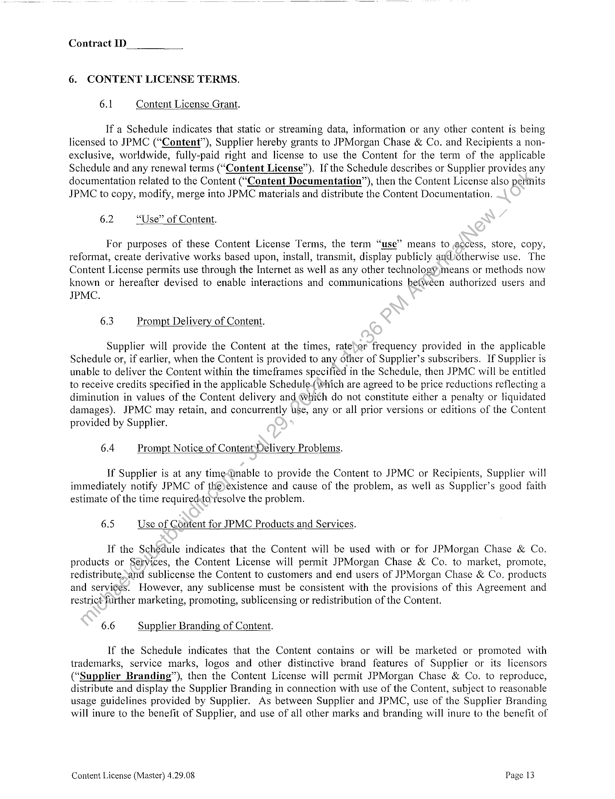
```  
```col-md
Contract ID  
6. CONTENT LICENSE TERMS.
6.1 Content License Grant.  
If a Schedule indicates that static or streaming data, information or any other content is being
licensed to JPMC (“Content”), Supplier hereby grants to JPMorgan Chase & Co. and Recipients a nonexclusive, worldwide, fully-paid right and license to use the Content for the term of the applicable
Schedule and any renewal terms (“Content License”). If the Schedule describes or Supplier provides any
documentation related to the Content (“Content Documentation’), then the Content License also permits
JPMC to copy, modify, merge into JPMC materials and distribute the Content Documentation.  
6.2 “Use” of Content.  
For purposes of these Content License Terms, the term “use” means to access, store, copy,
reformat, create derivative works based upon, install, transmit, display publicly andvotherwise use. The
Content License permits use through the Internet as well as any other technology,means or methods now
known or hereafter devised to enable interactions and communications between authorized users and
JPMC,  
6.3 Prompt Delivery of Content.  
Supplier will provide the Content at the times, rate)or frequency provided in the applicable
Schedule or, if earlier, when the Content is provided to any other of Supplier’s subscribers. If Supplier is
unable to deliver the Content within the timeframes specified in the Schedule, then JPMC will be entitled
to receive credits specified in the applicable Schedule-(which are agreed to be price reductions reflecting a
diminution in values of the Content delivery and which do not constitute either a penalty or liquidated
damages). JPMC may retain, and concurrently use, any or all prior versions or editions of the Content
provided by Supplier.  
6.4 Prompt Notice of Contentelivery Problems.  
If Supplier is at any time-dnable to provide the Content to JPMC or Recipients, Supplier will
immediately notify JPEMC of the)éxistence and cause of the problem, as well as Supplier’s good faith
estimate of the time required:to-resolve the problem.  
6.5 Use of Content for JPMC Products and Services.  
If the Schedule indicates that the Content will be used with or for JPMorgan Chase & Co.
products or Services, the Content License will permit JPMorgan Chase & Co. to market, promote,
redistribute, and sublicense the Content to customers and end users of JPMorgan Chase & Co, products
and services. However, any sublicense must be consistent with the provisions of this Agreement and
restrict further marketing, promoting, sublicensing or redistribution of the Content.  
6.6 Supplier Branding of Content.  
If the Schedule indicates that the Content contains or will be marketed or promoted with
trademarks, service marks, logos and other distinctive brand features of Supplier or its licensors
(“Supplier Branding”), then the Content License will permit JPMorgan Chase & Co. to reproduce,
distribute and display the Supplier Branding in connection with use of the Content, subject to reasonable
usage guidelines provided by Supplier. As between Supplier and JPMC, use of the Supplier Branding
will inure to the benefit of Supplier, and use of all other marks and branding will inure to the benefit of  
Content License (Master) 4.29.08 Page 13  
```
````
Notes:    
````col
```col-md
flexGrow=.5
===
> [!info] [Page 14](_attachments/images_JPMC-Parent-3.6.1.20.2.32009_WSOD_JPMorganMSACW2808051.pdf_210317/page_14.png)
> 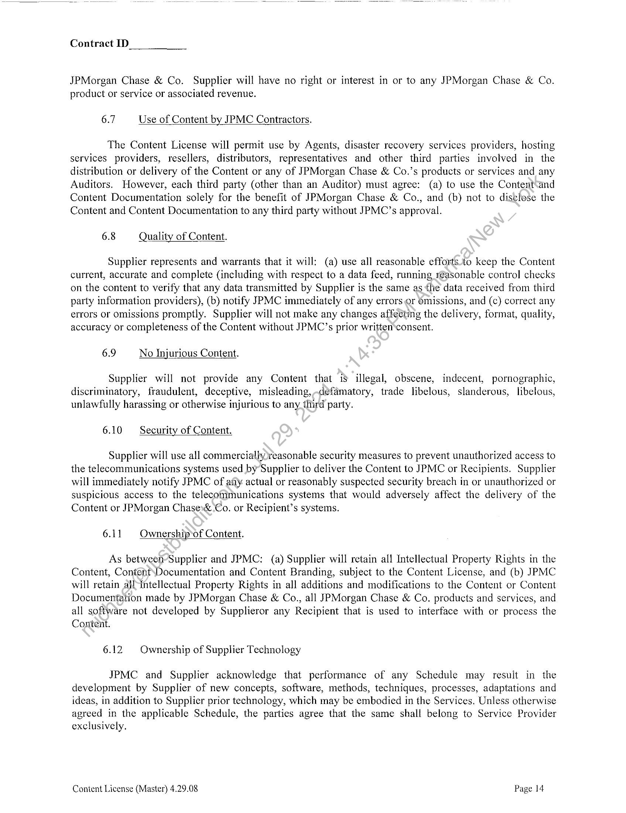
```  
```col-md
Contract ID  
JPMorgan Chase & Co. Supplier will have no right or interest in or to any JPMorgan Chase & Co.
product or service or associated revenue.  
6.7 Use of Content by JPMC Contractors.  
The Content License will permit use by Agents, disaster recovery services providers, hosting
services providers, resellers, distributors, representatives and other third parties involved in the
distribution or delivery of the Content or any of JPMorgan Chase & Co.’s products or services and any
Auditors. However, each third party (other than an Auditor) must agree: (a) to use the Content‘and
Content Documentation solely for the benefit of JPMorgan Chase & Co., and (b) not to disclose the
Content and Content Documentation to any third party without JPMC’s approval.  
6.8 Quality of Content.  
Supplier represents and warrants that it will: (a) use all reasonable effortsito keep the Content
current, accurate and complete (including with respect to a data feed, running 1@asonable control checks
on the content to verify that any data transmitted by Supplier is the same as the data received from third
party information providers), (b) notify JPMC immediately of any errors or omissions, and (c) correct any
errors or omissions promptly. Supplier will not make any changes affetting the delivery, format, quality,
accuracy or completeness of the Content without JPMC’s prior written ‘consent.  
6.9 No Injurious Content.  
Supplier will not provide any Content that is illegal, obscene, indecent, pornographic,
discriminatory, fraudulent, deceptive, misleading,-defamatory, trade libelous, slanderous, libelous,
unlawfully harassing or otherwise injurious to any third party.  
6.10 Security of Content.  
Supplier will use all commercially reasonable security measures to prevent unauthorized access to
the telecommunications systems used by Supplier to deliver the Content to JPMC or Recipients. Supplier
will immediately notify JPMC of any actual or reasonably suspected security breach in or unauthorized or
suspicious access to the telecommunications systems that would adversely affect the delivery of the
Content or JPMorgan Chasex& Co. or Recipient’s systems.  
6.11 Ownership of Content.  
As between-Supplier and JPMC: (a) Supplier will retain all Intellectual Property Rights in the
Content, Content\Documentation and Content Branding, subject to the Content License, and (b) JPMC
will retain allIntellectual Property Rights in all additions and modifications to the Content or Content
Documentation made by JPMorgan Chase & Co., all JPMorgan Chase & Co. products and services, and
all software not developed by Supplieror any Recipient that is used to interface with or process the
Content.  
6.12 Ownership of Supplier Technology  
JPMC and Supplier acknowledge that performance of any Schedule may result in the
development by Supplier of new concepts, software, methods, techniques, processes, adaptations and
ideas, in addition to Supplier prior technology, which may be embodied in the Services. Unless otherwise
agreed in the applicable Schedule, the parties agree that the same shall belong to Service Provider
exclusively.  
Conient License (Master) 4.29.08 Page 14  
```
````
Notes:    
````col
```col-md
flexGrow=.5
===
> [!info] [Page 15](_attachments/images_JPMC-Parent-3.6.1.20.2.32009_WSOD_JPMorganMSACW2808051.pdf_210317/page_15.png)
> 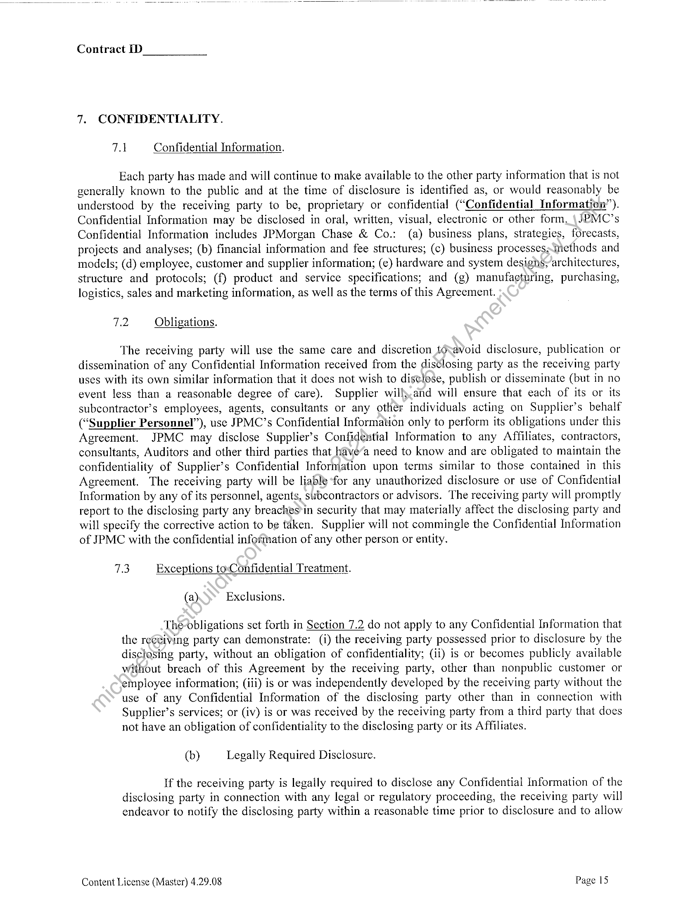
```  
```col-md
Contract ID  
7. CONFIDENTIALITY.  
TA Confidential Information.  
Each party has made and will continue to make available to the other party information that is not
generally known to the public and at the time of disclosure is identified as, or would reasonably be
understood by the receiving party to be, proprietary or confidential (“Confidential Information”).
Confidential Information may be disclosed in oral, written, visual, electronic or other form, \JPMC’s
Confidential Information includes JPMorgan Chase & Co.: (a) business plans, strategies, forecasts,
projects and analyses; (b) financial information and fee structures; (c) business processes inethods and
models; (d) employee, customer and supplier information; (e) hardware and system designs,/architectures,
structure and protocols; (f) product and service specifications; and (g) manufaeturing, purchasing,
logistics, sales and marketing information, as well as the terms of this Agreement.  
7.2 Obligations.  
The receiving party will use the same care and discretion tovavoid disclosure, publication or
dissemination of any Confidential Information received from the dis¢losing party as the receiving party
uses with its own similar information that it does not wish to distlose, publish or disseminate (but in no
event less than a reasonable degree of care). Supplier will).and will ensure that each of its or its
subcontractor’s employees, agents, consultants or any other individuals acting on Supplier’s behalf
(“Supplier Personnel”), use JPMC’s Confidential Information only to perform its obligations under this
Agreement. JPMC may disclose Supplier’s Confidential Information to any Affiliates, contractors,
consultants, Auditors and other third parties that have’a need to know and are obligated to maintain the
confidentiality of Supplier's Confidential Information upon terms similar to those contained in this
Agreement. The receiving party will be liable *for any unauthorized disclosure or use of Confidential
Information by any of its personnel, agents, subcontractors or advisors. The receiving party will promptly
report to the disclosing party any breaches’in security that may materially affect the disclosing party and
will specify the corrective action to be taken. Supplier will not commingle the Confidential Information
of JPMC with the confidential information of any other person or entity.  
73 Exceptions toConfidential Treatment.  
(a) Exclusions.  
The obligations set forth in Section 7.2 do not apply to any Confidential Information that
the reeéiving party can demonstrate: (i) the receiving party possessed prior to disclosure by the
disclosing party, without an obligation of confidentiality; (ii) is or becomes publicly available
without breach of this Agreement by the receiving party, other than nonpublic customer or
employee information; (iii) is or was independently developed by the receiving party without the
use of any Confidential Information of the disclosing party other than in connection with
Supplier’s services; or (iv) is or was received by the receiving party from a third party that does
not have an obligation of confidentiality to the disclosing party or its Affiliates.  
(b) Legally Required Disclosure.
If the receiving party is legally required to disclose any Confidential Information of the  
disclosing party in connection with any legal or regulatory proceeding, the receiving party will
endeavor to notify the disclosing party within a reasonable time prior to disclosure and to allow  
Content License (Master) 4.29.08 Page 15  
```
````
Notes:    
````col
```col-md
flexGrow=.5
===
> [!info] [Page 16](_attachments/images_JPMC-Parent-3.6.1.20.2.32009_WSOD_JPMorganMSACW2808051.pdf_210317/page_16.png)
> 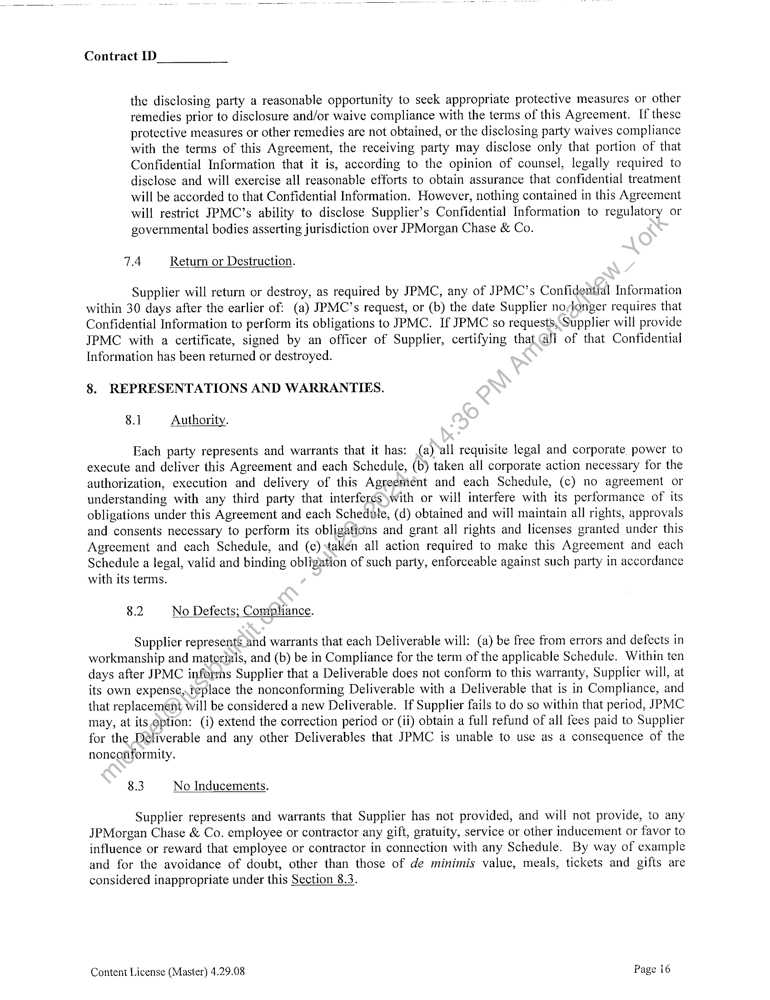
```  
```col-md
Contract ID  
the disclosing party a reasonable opportunity to seek appropriate protective measures or other
remedies prior to disclosure and/or waive compliance with the terms of this Agreement. If these
protective measures or other remedies are not obtained, or the disclosing party waives compliance
with the terms of this Agreement, the receiving party may disclose only that portion of that
Confidential Information that it is, according to the opinion of counsel, legally required to
disclose and will exercise all reasonable efforts to obtain assurance that confidential treatment
will be accorded to that Confidential Information. However, nothing contained in this Agreement
will restrict JPMC’s ability to disclose Supplier’s Confidential Information to regulatory or
governmental bodies asserting jurisdiction over JPMorgan Chase & Co.  
TA Return or Destruction.  
Supplier will return or destroy, as required by JPMC, any of JPMC’s Confidential Information
within 30 days after the earlier of: (a) JPMC’s request, or (b) the date Supplier no¢longer requires that
Confidential Information to perform its obligations to JPMC. If JPMC so requests,Supplier will provide
JPMC with a certificate, signed by an officer of Supplier, certifying that@ll of that Confidential
Information has been returned or destroyed.  
8. REPRESENTATIONS AND WARRANTIES.  
8.1 Authority.  
Each party represents and warrants that it has: ,(a) ‘all requisite legal and corporate, power to
execute and deliver this Agreement and each Schedule, (b) taken all corporate action necessary for the
authorization, execution and delivery of this Agreement and each Schedule, (c) no agreement or
understanding with any third party that interferésywith or will interfere with its performance of its
obligations under this Agreement and each Schedule, (d) obtained and will maintain all rights, approvals
and consents necessary to perform its obligations and grant all rights and licenses granted under this
Agreement and each Schedule, and (c)stakén all action required to make this Agreement and each
Schedule a legal, valid and binding obligation of such party, enforceable against such party in accordance
with its terms.  
8.2 No Defects; Compliance.  
Supplier representS and warrants that each Deliverable will: (a) be free from errors and defects in
workmanship and materials, and (b) be in Compliance for the term of the applicable Schedule. Within ten
days after JPMC informs Supplier that a Deliverable does not conform to this warranty, Supplier will, at
its own expense, ieplace the nonconforming Deliverable with a Deliverable that is in Compliance, and
that replacement Will be considered a new Deliverable. If Supplier fails to do so within that period, JPMC
may, at its option: (i) extend the correction period or (ii) obtain a full refund of all fees paid to Supplier
for the Deliverable and any other Deliverables that JPMC is unable to use as a consequence of the
noncofiformity.  
8.3 No Inducements.  
Supplier represents and warrants that Supplier has not provided, and will not provide, to any
JPMorgan Chase & Co. employee or contractor any gift, gratuity, service or other inducement or favor to
influence or reward that employee or contractor in connection with any Schedule. By way of example
and for the avoidance of doubt, other than those of de minimis value, meals, tickets and gifts are
considered inappropriate under this Section 8.3.  
Content License (Master) 4.29.08 Page 16  
```
````
Notes:    
````col
```col-md
flexGrow=.5
===
> [!info] [Page 17](_attachments/images_JPMC-Parent-3.6.1.20.2.32009_WSOD_JPMorganMSACW2808051.pdf_210317/page_17.png)
> 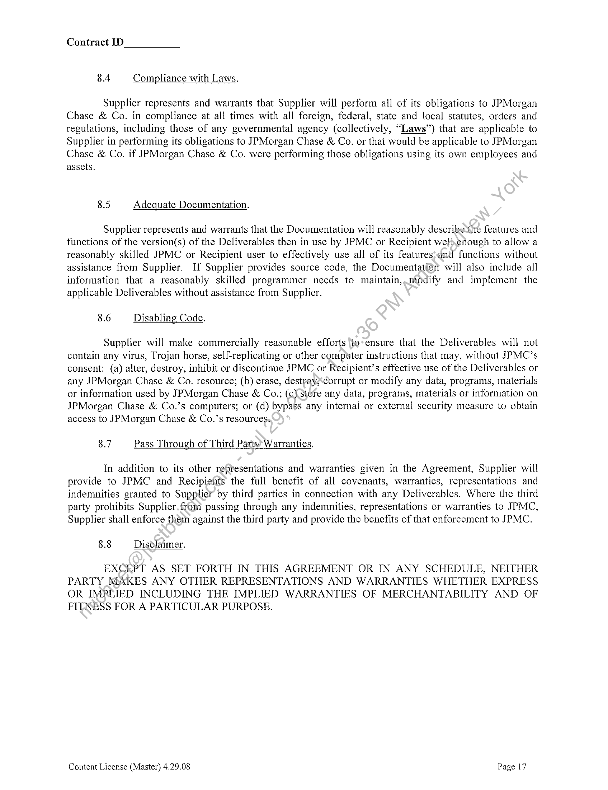
```  
```col-md
Contract ID  
8.4 Compliance with Laws.  
Supplier represents and warrants that Supplier will perform all of its obligations to JPMorgan
Chase & Co. in compliance at all times with all foreign, federal, state and local statutes, orders and
regulations, including those of any governmental agency (collectively, “Laws’”) that are applicable to
Supplier in performing its obligations to JPMorgan Chase & Co. or that would be applicable to JPMorgan
Chase & Co. if JPMorgan Chase & Co. were performing those obligations using its own employees and
assets.  
8.5 Adequate Documentation.  
Supplier represents and warrants that the Documentation will reasonably describe‘the features and
functions of the version(s) of the Deliverables then in use by JPMC or Recipient wel}enough to allow a
reasonably skilled JPMC or Recipient user to effectively use all of its features;and functions without
assistance from Supplier. If Supplier provides source code, the Documentation will also include all
information that a reasonably skilled programmer needs to maintain, modify and implement the
applicable Deliverables without assistance from Supplier.  
8.6 Disabling Code.  
Supplier will make commercially reasonable efforts \to-ensure that the Deliverables will not
contain any virus, Trojan horse, self-replicating or other computer instructions that may, without JPMC’s
consent: (a) alter, destroy, inhibit or discontinue JPMC or Recipient’s effective use of the Deliverables or
any JPMorgan Chase & Co. resource; (b) erase, destreycorrupt or modify any data, programs, materials
or information used by JPMorgan Chase & Co.; (c) store any data, programs, materials or information on
JPMorgan Chase & Co.’s computers; or (d) bypass any internal or external security measure to obtain
access to JPMorgan Chase & Co.’s resources.  
8.7 Pass Through of Third Party’ Warranties.  
In addition to its other representations and warranties given in the Agreement, Supplier will
provide to JPMC and Recipients the full benefit of all covenants, warranties, representations and
indemnities granted to Supplier by third parties in connection with any Deliverables. Where the third
party prohibits Supplier.from passing through any indemnities, representations or warranties to JPMC,
Supplier shall enforce them against the third party and provide the benefits of that enforcement to JPMC.  
8.8 Disclaimer.  
EXCEPT AS SET FORTH IN THIS AGREEMENT OR IN ANY SCHEDULE, NEITHER
PARTY MAKES ANY OTHER REPRESENTATIONS AND WARRANTIES WHETHER EXPRESS
OR IMPLIED INCLUDING THE IMPLIED WARRANTIES OF MERCHANTABILITY AND OF
FITNESS FOR A PARTICULAR PURPOSE.  
Content License (Master) 4.29.08 Page 17  
```
````
Notes:    
````col
```col-md
flexGrow=.5
===
> [!info] [Page 18](_attachments/images_JPMC-Parent-3.6.1.20.2.32009_WSOD_JPMorganMSACW2808051.pdf_210317/page_18.png)
> 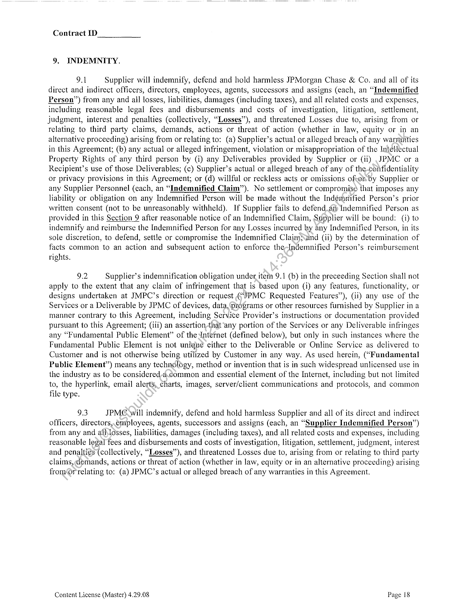
```  
```col-md
Contract ID  
9. INDEMNITY.  
91 Supplier will indemnify, defend and hold harmless JPMorgan Chase & Co. and all of its
direct and indirect officers, directors, employees, agents, successors and assigns (each, an “Indemnified
Person”) from any and all losses, liabilities, damages (including taxes), and all related costs and expenses,
including reasonable legal fees and disbursements and costs of investigation, litigation, settlement,
judgment, interest and penalties (collectively, “Losses”), and threatened Losses due to, arising from or
relating to third party claims, demands, actions or threat of action (whether in law, equity or in an
alternative proceeding) arising from or relating to: (a) Supplier’s actual or alleged breach of any warranties
in this Agreement; (b) any actual or alleged infringement, violation or misappropriation of the Intellectual
Property Rights of any third person by (i) any Deliverables provided by Supplier or (ii) .JPMC or a
Recipient’s use of those Deliverables; (c) Supplier’s actual or alleged breach of any of the-confidentiality
or privacy provisions in this Agreement; or (d) willful or reckless acts or omissions of-er by Supplier or
any Supplier Personnel (each, an “Indemnified Claim”). No settlement or compromise that imposes any
liability or obligation on any Indemnified Person will be made without the Indémnified Person’s prior
written consent (not to be unreasonably withheld). If Supplier fails to defend ary Indemnified Person as
provided in this Section 9 after reasonable notice of an Indemnified Claim, Supplier will be bound: (i) to
indemnify and reimburse the Indemnified Person for any Losses incurred by any Indemnified Person, in its
sole discretion, to defend, settle or compromise the Indemnified Claim and (ii) by the determination of
facts common to an action and subsequent action to enforce the-Indemnified Person’s reimbursement
rights.  
9.2 Supplier’s indemnification obligation under item 9.1 (b) in the preceeding Section shall not
apply to the extent that any claim of infringement that is based upon (i) any features, functionality, or
designs undertaken at JMPC’s direction or request <“VPMC Requested Features”), (ii) any use of the
Services or a Deliverable by JPMC of devices, data, programs or other resources furnished by Supplier in a
manner contrary to this Agreement, including Service Provider’s instructions or documentation provided
pursuant to this Agreement; (iii) an assertion-that ‘any portion of the Services or any Deliverable infringes
any “Fundamental Public Element” of the Internet (defined below), but only in such instances where the
Fundamental Public Element is not unique either to the Deliverable or Online Service as delivered to
Customer and is not otherwise being utilized by Customer in any way. As used herein, (“Fundamental
Public Element”) means any technology, method or invention that is in such widespread unlicensed use in
the industry as to be considered-a.common and essential element of the Internet, including but not limited
to, the hyperlink, email alerts, charts, images, server/client communications and protocols, and common
file type.  
9.3 JPMG. will indemnify, defend and hold harmless Supplier and all of its direct and indirect
officers, directors,.employees, agents, successors and assigns (each, an “Supplier Indemnified Person”)
from any and allylosses, liabilities, damages (including taxes), and all related costs and expenses, including
reasonable legal fees and disbursements and costs of investigation, litigation, settlement, judgment, interest
and penalti¢s (collectively, “Losses”), and threatened Losses due to, arising from or relating to third party
claims, demands, actions or threat of action (whether in law, equity or in an alternative proceeding) arising
fromOr relating to: (a) JPMC’s actual or alleged breach of any warranties in this Agreement.  
Content License (Master) 4.29.08 Page 18  
```
````
Notes:    
````col
```col-md
flexGrow=.5
===
> [!info] [Page 19](_attachments/images_JPMC-Parent-3.6.1.20.2.32009_WSOD_JPMorganMSACW2808051.pdf_210317/page_19.png)
> 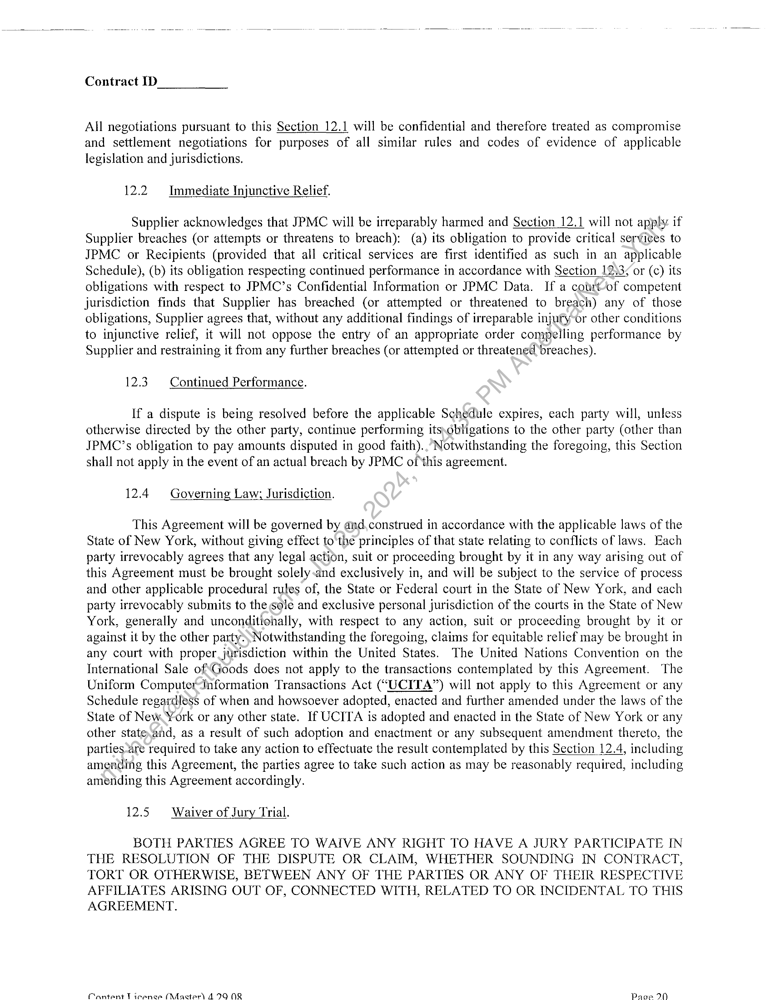
```  
```col-md
Contract ID.  
All negotiations pursuant to this Section 12.1] will be confidential and therefore treated as compromise
and settlement negotiations for purposes of all similar rules and codes of evidence of applicable
legislation and jurisdictions.  
12.2 Immediate Injunctive Relief.  
Supplier acknowledges that JPMC will be irreparably harmed and Section 12.1 will not apply if
Supplier breaches (or attempts or threatens to breach): (a) its obligation to provide critical servives to
JPMC or Recipients (provided that all critical services are first identified as such in an applicable
Schedule), (b) its obligation respecting continued performance in accordance with Section 12)3¢ or (c) its
obligations with respect to JPMC’s Confidential Information or JPMC Data. If a court/of competent
jurisdiction finds that Supplier has breached (or attempted or threatened to breach) any of those
obligations, Supplier agrees that, without any additional findings of irreparable injufy-or other conditions
to injunctive relief, it will not oppose the entry of an appropriate order compelling performance by
Supplier and restraining it from any further breaches (or attempted or threatened breaches).  
12.3. Continued Performance.  
If a dispute is being resolved before the applicable Schedule expires, each party will, unless
otherwise directed by the other party, continue performing itsobligations to the other party (other than
JPMC’s obligation to pay amounts disputed in good faith).  
 Notwithstanding the foregoing, this Section
shall not apply in the event of an actual breach by JPMC ofthis agreement.  
12.4 Governing Law; Jurisdiction.  
This Agreement will be governed by and,construed in accordance with the applicable laws of the
State of New York, without giving effect to the principles of that state relating to conflicts of laws. Each
party irrevocably agrees that any legal action, suit or proceeding brought by it in any way arising out of
this Agreement must be brought solely-and exclusively in, and will be subject to the service of process
and other applicable procedural rules of, the State or Federal court in the State of New York, and each
party irrevocably submits to the sole and exclusive personal jurisdiction of the courts in the State of New
York, generally and unconditionally, with respect to any action, suit or proceeding brought by it or
against it by the other party; Notwithstanding the foregoing, claims for equitable relief may be brought in
any court with proper jurisdiction within the United States. The United Nations Convention on the
International Sale of\Goods does not apply to the transactions contemplated by this Agreement. The
Uniform Computerdnformation Transactions Act (“CUCITA”) will not apply to this Agreement or any
Schedule regardless of when and howsoever adopted, enacted and further amended under the laws of the
State of New York or any other state. If UCITA is adopted and enacted in the State of New York or any
other state.and, as a result of such adoption and enactment or any subsequent amendment thereto, the
parties are required to take any action to effectuate the result contemplated by this Section 12.4, including
amending this Agreement, the parties agree to take such action as may be reasonably required, including
amending this Agreement accordingly.  
12.5 Waiver of Jury Trial.  
BOTH PARTIES AGREE TO WAIVE ANY RIGHT TO HAVE A JURY PARTICIPATE IN
THE RESOLUTION OF THE DISPUTE OR CLAIM, WHETHER SOUNDING IN CONTRACT,
TORT OR OTHERWISE, BETWEEN ANY OF THE PARTIES OR ANY OF THEIR RESPECTIVE
AFFILIATES ARISING OUT OF, CONNECTED WITH, RELATED TO OR INCIDENTAL TO THIS
AGREEMENT.  
Cantent T icenee (Mater) 4d 990 OR Paooe I)  
```
````
Notes:    
````col
```col-md
flexGrow=.5
===
> [!info] [Page 20](_attachments/images_JPMC-Parent-3.6.1.20.2.32009_WSOD_JPMorganMSACW2808051.pdf_210317/page_20.png)
> 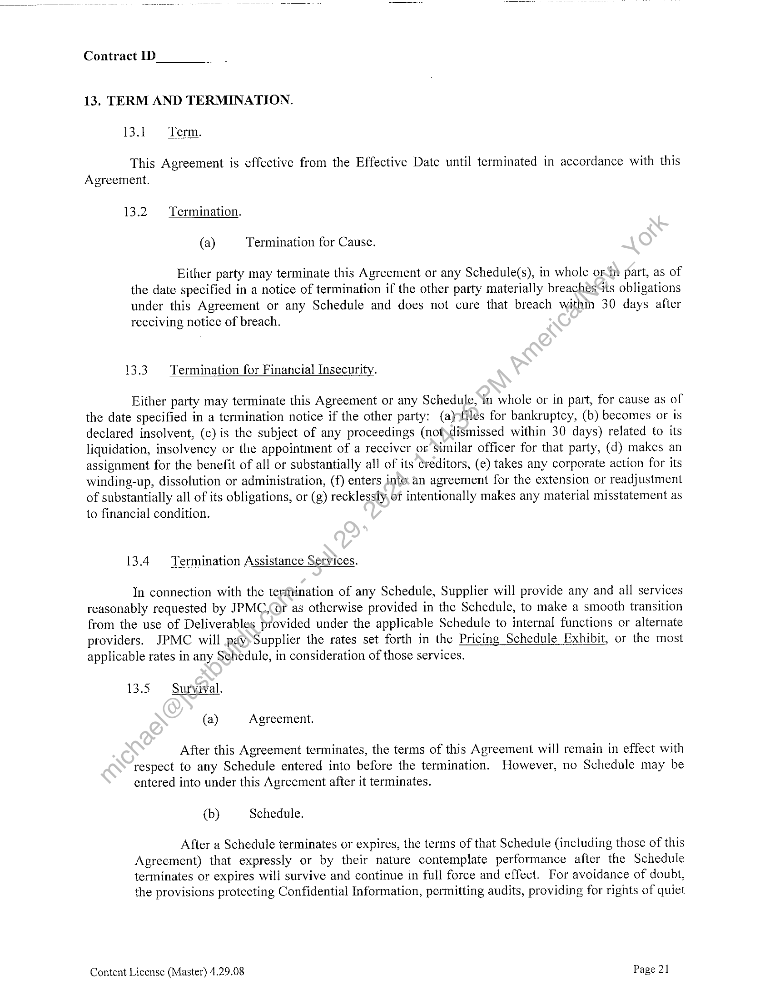
```  
```col-md
Contract ID  
13. TERM AND TERMINATION.
13.1 Term,  
This Agreement is effective from the Effective Date until terminated in accordance with this
Agreement.  
13.2 Termination.
(a) Termination for Cause.
Either party may terminate this Agreement or any Schedule(s), in whole orn part, as of
the date specified in a notice of termination if the other party materially breaches“ts obligations  
under this Agreement or any Schedule and does not cure that breach within 30 days after
receiving notice of breach.  
13.3. Termination for Financial Insecurity.  
Either party may terminate this Agreement or any Schedule, in whole or in part, for cause as of
the date specified in a termination notice if the other party: (a)}ofilés for bankruptcy, (b) becomes or is
declared insolvent, (c) is the subject of any proceedings (not\dismissed within 30 days) related to its
liquidation, insolvency or the appointment of a receiver or similar officer for that party, (d) makes an
assignment for the benefit of all or substantially all of its creditors, (e) takes any corporate action for its
winding-up, dissolution or administration, (f) enters into. an agreement for the extension or readjustment
of substantially all of its obligations, or (g) recklessly, of intentionally makes any material misstatement as
to financial condition.  
13.4 Termination Assistance Services.  
In connection with the termination of any Schedule, Supplier will provide any and all services
reasonably requested by JPMC,©r as otherwise provided in the Schedule, to make a smooth transition
from the use of Deliverables provided under the applicable Schedule to internal functions or alternate
providers. JPMC will payy Supplier the rates set forth in the Pricing Schedule Exhibit, or the most
applicable rates in any Schedule, in consideration of those services.  
13.5 Survival.
(a) Agreement.  
After this Agreement terminates, the terms of this Agreement will remain in effect with
respect to any Schedule entered into before the termination. However, no Schedule may be
entered into under this Agreement after it terminates.  
(b) Schedule.  
After a Schedule terminates or expires, the terms of that Schedule (including those of this  
Agreement) that expressly or by their nature contemplate performance after the Schedule  
terminates or expires will survive and continue in full force and effect. For avoidance of doubt,
the provisions protecting Confidential Information, permitting audits, providing for rights of quiet  
Content License (Master) 4.29.08 Page 21  
```
````
Notes:    
````col
```col-md
flexGrow=.5
===
> [!info] [Page 21](_attachments/images_JPMC-Parent-3.6.1.20.2.32009_WSOD_JPMorganMSACW2808051.pdf_210317/page_21.png)
> 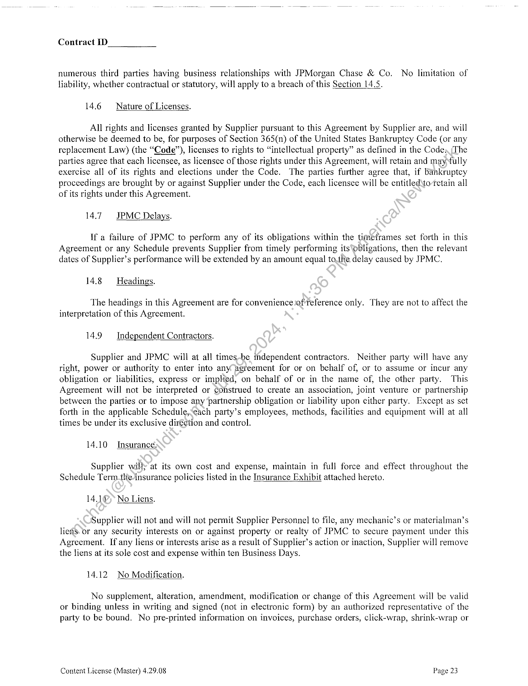
```  
```col-md
Contract ID  
numerous third parties having business relationships with JPMorgan Chase & Co. No limitation of
liability, whether contractual or statutory, will apply to a breach of this Section 14.5.  
14.6 Nature of Licenses.  
All rights and licenses granted by Supplier pursuant to this Agreement by Supplier are, and will
otherwise be deemed to be, for purposes of Section 365(n) of the United States Bankruptcy Code (or any
replacement Law) (the “Code”), licenses to rights to “intellectual property” as defined in the Codes The
parties agree that each licensee, as licensee of those rights under this Agreement, will retain and mayfully
exercise all of its rights and elections under the Code. The parties further agree that, if bankruptcy
proceedings are brought by or against Supplier under the Code, each licensee will be entitled\toretain all
of its rights under this Agreement.  
14.7. JPMC Delays.
If a failure of SPMC to perform any of its obligations within the timeframes set forth in this  
Agreement or any Schedule prevents Supplier from timely performing its\obligations, then the relevant
dates of Supplier’s performance will be extended by an amount equal to.the delay caused by JPMC.  
14.8 Headings.  
The headings in this Agreement are for convenience ofreference only. They are not to affect the
interpretation of this Agreement.  
14.9 Independent Contractors.  
Supplier and JPMC will at all times-be independent contractors. Neither party will have any
right, power or authority to enter into any agreement for or on behalf of, or to assume or incur any
obligation or liabilities, express or implied, on behalf of or in the name of, the other party. This
Agreement will not be interpreted or construed to create an association, joint venture or partnership
between the parties or to impose any ‘partnership obligation or liability upon either party. Except as set
forth in the applicable Schedule,seach party’s employees, methods, facilities and equipment will at all
times be under its exclusive direction and control.  
14.10 Insurance,  
Supplier willy at its own cost and expense, maintain in full force and effect throughout the
Schedule Term_the insurance policies listed in the Insurance Exhibit attached hereto.  
14.1%)° No Liens.  
Supplier will not and will not permit Supplier Personnel to file, any mechanic’s or materialman’s
liens. or any security interests on or against property or realty of JPMC to secure payment under this
Agreement. If any liens or interests arise as a result of Supplier’s action or inaction, Supplier will remove
the liens at its sole cost and expense within ten Business Days.  
14.12 No Modification.
No supplement, alteration, amendment, modification or change of this Agreement will be valid  
or binding unless in writing and signed (not in electronic form) by an authorized representative of the
party to be bound. No pre-printed information on invoices, purchase orders, click-wrap, shrink-wrap or  
Content License (Master) 4.29.08 Page 23  
```
````
Notes:    
````col
```col-md
flexGrow=.5
===
> [!info] [Page 22](_attachments/images_JPMC-Parent-3.6.1.20.2.32009_WSOD_JPMorganMSACW2808051.pdf_210317/page_22.png)
> 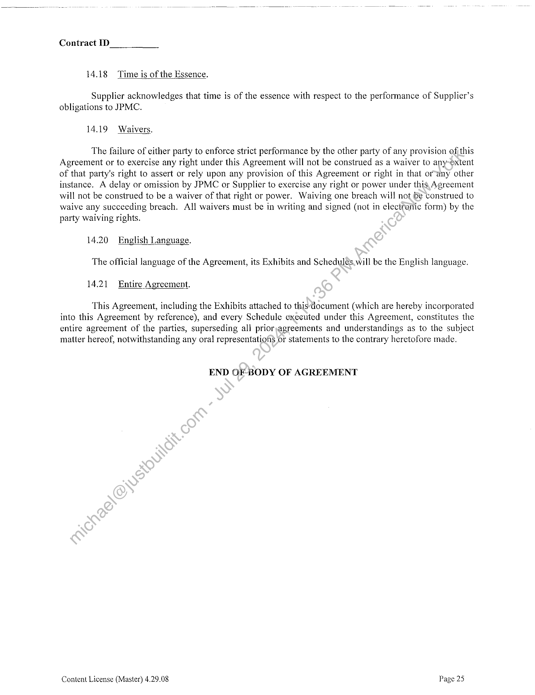
```  
```col-md
Contract ID  
14.18 Time is of the Essence.  
Supplier acknowledges that time is of the essence with respect to the performance of Supplier’s
obligations to JPMC.  
14.19 Waivers.  
The failure of either party to enforce strict performance by the other party of any provision ofthis
Agreement or to exercise any right under this Agreement will not be construed as a waiver to any-extent
of that party's right to assert or rely upon any provision of this Agreement or right in that orany other
instance. A delay or omission by JPMC or Supplier to exercise any right or power under this, Agreement
will not be construed to be a waiver of that right or power. Waiving one breach will not be construed to
waive any succeeding breach. All waivers must be in writing and signed (not in electronic form) by the
party waiving rights.  
14.20 English Language.
The official language of the Agreement, its Exhibits and Schedules.will be the English language.
14.21 Entire Agreement.
This Agreement, including the Exhibits attached to thisdocument (which are hereby incorporated
into this Agreement by reference), and every Schedule executed under this Agreement, constitutes the  
entire agreement of the parties, superseding all prioryagreements and understandings as to the subject
matter hereof, notwithstanding any oral representations or statements to the contrary heretofore made.  
END OF BODY OF AGREEMENT  
Content License (Master) 4.29.08 Page 25  
```
````
Notes:    
````col
```col-md
flexGrow=.5
===
> [!info] [Page 23](_attachments/images_JPMC-Parent-3.6.1.20.2.32009_WSOD_JPMorganMSACW2808051.pdf_210317/page_23.png)
> 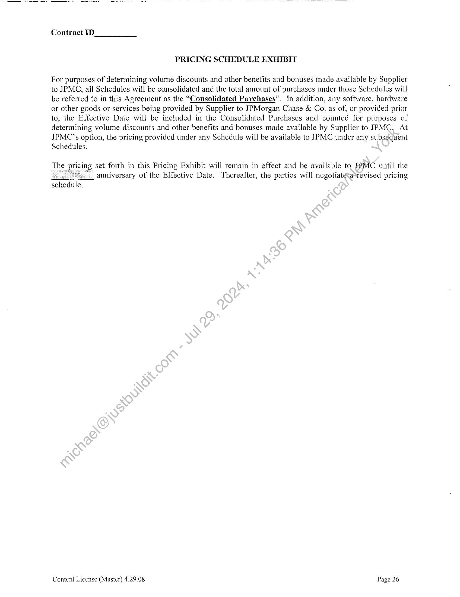
```  
```col-md
Contract ID  
PRICING SCHEDULE EXHIBIT  
For purposes of determining volume discounts and other benefits and bonuses made available by Supplier
to JPMC, all Schedules will be consolidated and the total amount of purchases under those Schedules will
be referred to in this Agreement as the “Consolidated Purchases”. In addition, any software, hardware
or other goods or services being provided by Supplier to JPMorgan Chase & Co. as of, or provided prior
to, the Effective Date will be included in the Consolidated Purchases and counted for purposes of
determining volume discounts and other benefits and bonuses made available by Supplier to JPMC. At
JPMC’s option, the pricing provided under any Schedule will be available to JPMC under any subsequent
Schedules.  
The pricing set forth in this Pricing Exhibit will remain in effect and be available to JPMC until the
fe mniversary of the Effective Date. Thereafter, the parties will negotiatea*revised pricing  
schedule.  
Content License (Master) 4.29.08 Page 26  
```
````
Notes:    
````col
```col-md
flexGrow=.5
===
> [!info] [Page 24](_attachments/images_JPMC-Parent-3.6.1.20.2.32009_WSOD_JPMorganMSACW2808051.pdf_210317/page_24.png)
> 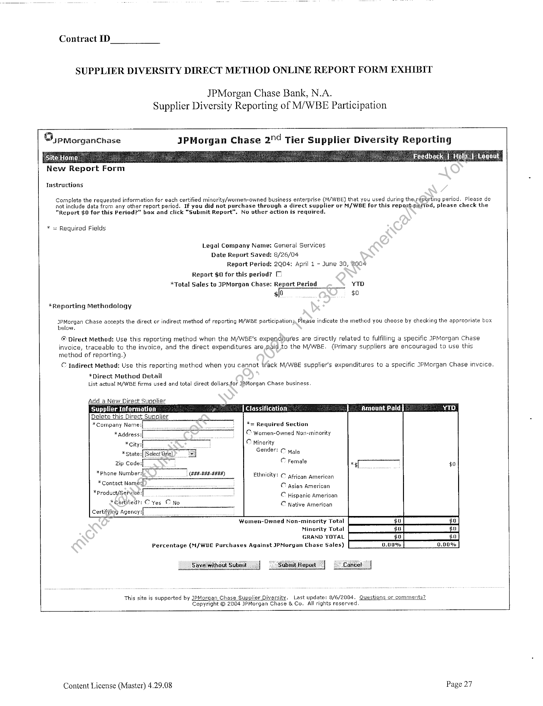
```  
```col-md
Contract ID  
SUPPLIER DIVERSITY DIRECT METHOD ONLINE REPORT FORM EXHIBIT  
JPMorgan Chase Bank, N.A.
Supplier Diversity Reporting of M/WBE Participation  
[o  
JPMorganChase JPMorgan Chase 2d Tier Supplier Diversity Reporting  
ome eedba alg Hao  
New Report Form  
Instructions  
Complete the requested information for each certified minority/women-owned business enterprise (M/WBE) that you used during thereporting period, Please do
not include data from any other report period. If you did not purchase through a direct supplier or M/WBE for this report-period, please check the
“Report $0 for this Period?” box and click “Submit Report”. No other action is required.  
* = Required Fields  
Legal Company Name: General Services
Date Report Saved: 8/26/04
Report Period: 2Q04; April 1 - June 30, @004
Report $0 for this period? [~
*Total Sales to JPMorgan Chase: Report Period YTD
$0, $0  
*Reporting Methodology  
JPMorgan Chase accepts the direct or indirect method of reporting M/WBE participations Please indicate the methed you choose by checking the appropriate box
below,  
® Direct Method: Use this reporting method when the M/WBE's expendibures are directly related to fulfilling a specific JPMorgan Chase
invoice, traceable to the invoice, and the direct expenditures are paid to the M/WBE. (Primary suppliers are encouraged to use this
method of reporting.)  
<7 Indirect Method: Use this reporting method when you cannot track M/WBE supplier's expenditures to a specific JPMorgan Chase invoice.  
*Direct Method Detail
List actual M/WBE firrns used and total direct dollars.for JPMorgan Chase business.  
Add a New Direct Supplier
Supplier Information
Delete this Direct Supplier  
* Company Name:  
address  
*city:{  
*state:| [Select Ore]  
Zip Codef  
*Phone Numbers) | Ghee RHR)  
* Contact Name  
*Product/Sefvlee! ee
*Certified?: ves T No  
Certifying Agency:{ :  
Amount Paid}  
Women-Owned Non-minority Total a CE  
[Classification  
= Required Section
© Women-Owned Non-minority
© Minority  
Gender! @ male  
T Female  
Ethnicity: ¢ african american
Asian American  
© Hispanic American
© Native American  
This site is supported by J@Morgan Chase Supplier Diversity, Last update: 8/6/2004, Questions ar comments?
Copyright © 2004 JPMorgan Chase & Co, All rights reserved,  
Content License (Master) 4.29.08 Page 27  
```
````
Notes:    
````col
```col-md
flexGrow=.5
===
> [!info] [Page 25](_attachments/images_JPMC-Parent-3.6.1.20.2.32009_WSOD_JPMorganMSACW2808051.pdf_210317/page_25.png)
> 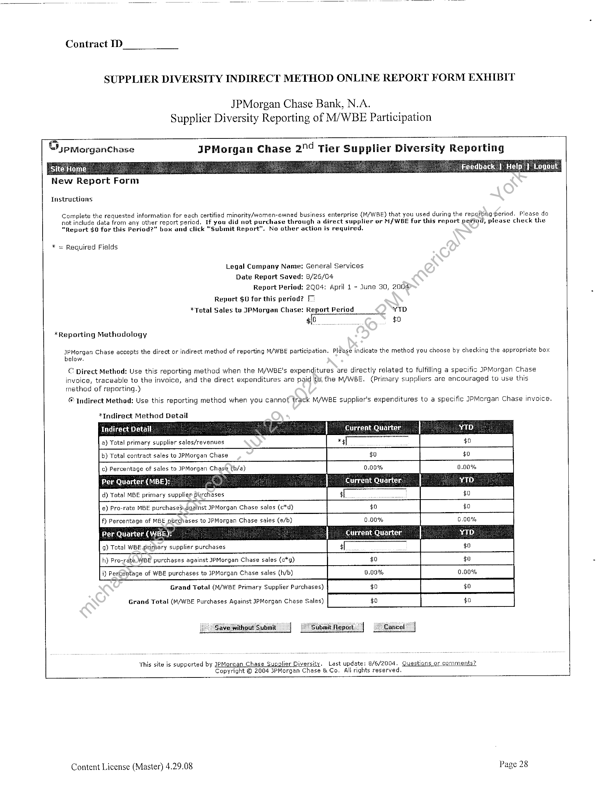
```  
```col-md
Contract ID  
SUPPLIER DIVERSITY INDIRECT METHOD ONLINE REPORT FORM EXHIBIT  
JPMorgan Chase Bank, N.A.
Supplier Diversity Reporting of M/WBE Participation  
Oy pmorganchase 3IPMorgan Chase 2"d Tier Supplier Diversity Reporting  
New Report Form  
pedba eip 000  
Instructions  
Complete the requested information for each certified minority/women-owned business enterprise (M/WBE) that you used during the repoftitg-period. Please do  
not include data from any other report period, If you did not purchase through a direct supplier or M/ WBE for this report period, please check the
“Report $0 for this Period?" box and click "Submit Report". No other action is required.  
* = Required Fields  
Legal Company Name: General Services
Date Report Saved: 8/26/04
Report Period: 2Q04: April 1 - June 30, 200¢
Report $0 for this period? [7
*Total Sales to JPMorgan Chase: Report Period YTD
cn $0
*Reporting Methodology  
JPMorgan Chase accepts the direct or indirect method of reporting M/WBE participation. Please indicate the method you choose by checking the appropriate box
below.  
© Direct Method: Use this reporting method when the M/WBE's expenditures are directly related to fulfilling a specific JPMorgan Chase
invoice, traceable to the invoice, and the direct expenditures are paid te, the M/WBE. (Primary suppliers are encouraged to use this  
method of reporting.)  
@ Indirect Method: Use this reporting method when you cannot track M/WBE supplier's expenditures to a specific JPMorgan Chase invoice.
“Indirect Method Detail
Indirect Detail | Current.Quarter  
a) Total primary supplier sales/revenues xf  
b) Total contract sales to JPMorgan Chase  
$0
f) Percentage of MBE pirchases to JPMorgan Chase sales (e/b) 0.00%
Per Quarter (WEE):  
Current Quarter: | XID  
Grand Total (M/WBE Primary Supplier Purchases)  
Grand Total (W/WBE Purchases Against JPMorgan Chase Sales)  
This site is supported by JPMoraan Chase Supplier Diversity. Last update: 8/6/2004. Questions or comments?
Copyright © 2004 JPMorgan Chase & Co, All rights reserved.  
Content License (Master) 4.29.08 Page 28  
```
````
Notes:    
````col
```col-md
flexGrow=.5
===
> [!info] [Page 26](_attachments/images_JPMC-Parent-3.6.1.20.2.32009_WSOD_JPMorganMSACW2808051.pdf_210317/page_26.png)
> 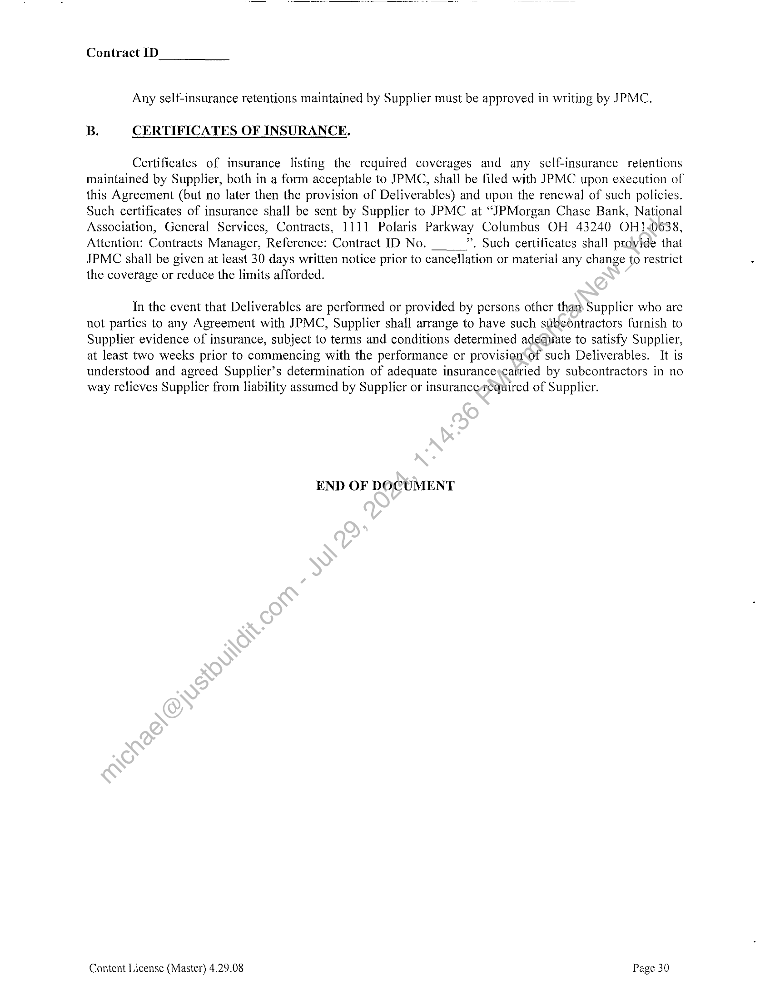
```  
```col-md
Contract ID  
Any self-insurance retentions maintained by Supplier must be approved in writing by JPMC.  
B. CERTIFICATES OF INSURANCE.  
Certificates of insurance listing the required coverages and any selfinsurance retentions
maintained by Supplier, both in a form acceptable to JPMC, shall be filed with JPMC upon execution of
this Agreement (but no later then the provision of Deliverables) and upon the renewal of such policies.
Such certificates of insurance shall be sent by Supplier to JPMC at “JPMorgan Chase Bank, National
Association, General Services, Contracts, 1111 Polaris Parkway Columbus OH 43240 OH1.0638,
Attention: Contracts Manager, Reference: Contract ID No. ” Such certificates shall provide that
JPMC shall be given at least 30 days written notice prior to cancellation or material any change to restrict
the coverage or reduce the limits afforded.  
In the event that Deliverables are performed or provided by persons other than Supplier who are
not parties to any Agreement with JPMC, Supplier shall arrange to have such subcontractors furnish to
Supplier evidence of insurance, subject to terms and conditions determined adequate to satisfy Supplier,
at least two weeks prior to commencing with the performance or provisien‘of such Deliverables. It is
understood and agreed Supplier’s determination of adequate insuranceycarried by subcontractors in no
way relieves Supplier from liability assumed by Supplier or insurancerequired of Supplier.  
END OF DOCUMENT  
Content License (Master) 4.29.08 Page 30  
```
````
Notes:  


![[_attachments/JPMC-Parent-3.6.1.20.2.3 2009_WSOD_JPMorganMSA CW280805 (1).pdf]