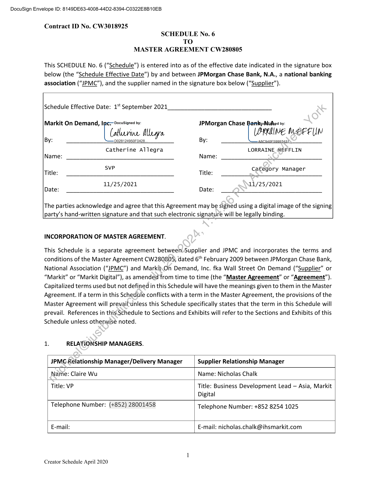

##### Schedule No. 6 to Master Agreement CW280805]

  
````col
```col-md
flexGrow=.5
===
> [!info] [Page 1](_attachments/images_JPMC-Singapore-3.6.1.20.1.100143597.pdf_210357/page_1.png)
> 
```  
```col-md
DocuSign Envelope ID: 8149DE63-4008-44D2-8394-C0322E8B10EB  
Contract ID No. CW3018925
SCHEDULE No. 6
TO
MASTER AGREEMENT CW280805  
This SCHEDULE No. 6 (“Schedule”) is entered into as of the effective date indicated in the signature box
below (the “Schedule Effective Date”) by and between JPMorgan Chase Bank, N.A., a national banking
association (“JPMC”), and the supplier named in the signature box below (“Supplier”).  
Schedule Effective Date: 15t September 2021  
Markit On Demand, Ine Docusigned by: JPMorgan Chase Ip ddkidved by:
[ (alban Mara (PRRMINE MEPEUIN
By: D028124950F0428 By: LS
Catherine Allegra LORRAINE (WEFFLIN
Name: Name:
SVP
Title: Title: category Manager
11/25/2021 11/25/2021
Date: Date:  
The parties acknowledge and agree that this Agreement may be sighed using a digital image of the signing
party’s hand-written signature and that such electronic signature will be legally binding.  
INCORPORATION OF MASTER AGREEMENT.  
This Schedule is a separate agreement between Supplier and JPMC and incorporates the terms and
conditions of the Master Agreement CW280805, dated 6‘ February 2009 between JPMorgan Chase Bank,
National Association (“JPMC”) and Markit.On Demand, Inc. fka Wall Street On Demand (“Supplier” or
“Markit” or “Markit Digital”), as amended from time to time (the “Master Agreement” or “Agreement”).
Capitalized terms used but not defined in this Schedule will have the meanings given to them in the Master
Agreement. If a term in this Schedule conflicts with a term in the Master Agreement, the provisions of the
Master Agreement will prevail‘unless this Schedule specifically states that the term in this Schedule will
prevail. References in this Schedule to Sections and Exhibits will refer to the Sections and Exhibits of this
Schedule unless otherwise noted.  
1. RELATIONSHIP MANAGERS.
JPMG.Relationship Manager/Delivery Manager Supplier Relationship Manager
Name: Claire Wu Name: Nicholas Chalk
Title: VP Title: Business Development Lead — Asia, Markit
Digital
Telephone Number: (+852) 28001458 Telephone Number: +852 8254 1025
E-mail: E-mail: nicholas.chalk@ihsmarkit.com  
Creator Schedule April 2020  
```
````
Notes:    
````col
```col-md
flexGrow=.5
===
> [!info] [Page 2](_attachments/images_JPMC-Singapore-3.6.1.20.1.100143597.pdf_210357/page_2.png)
> 
```  
```col-md
DocuSign Envelope ID: 8149DE63-4008-44D2-8394-C0322E8B10EB  
Contract ID No. CW3018925  
SCHEDULE No. 6
TO
MASTER AGREEMENT CW280805  
Address: Address: 5775 Flatiron Pkwy Boulder, CO 80301
JPMC Executive Sponsor Supplier Cybersecurity Contact*
Name: Chris Maher Name: Tier 1 Support
Title: Executive Director Title:
Telephone Number: Work and Cell Telephone Numbers:  
+1.303.583.4308
E-mail: christopher.j.maher@jpmorgan.com E-mail: MOD-NOC@ihsmarkit.com
Address: Address:5775 Flatirons Parkway  
Boulder, CO 80301  
*At no additional expense to JPMC, the Supplier Cybersecurity Contact\must (i) respond to all cyberrelated inquiries within 24 hours, 7 days a week, and (ii) be available via mobile and SMS within 24 hours,
7 days a week (with back-up resources when the Supplier Cybersecurity Contact is either unavailable or
out of the office (“Back-Up”)). Supplier will immediately provid&written notice to JPMC when the Supplier
Cybersecurity Contact changes or when the Back-Up has the responsibility hereunder.  
2. SCHEDULE TERM.  
The initial term of this Schedule will begin on the Schedule Effective Date and remain in effect for twentyfour (24) months from the Launch Date (defined as when project functionality is moved to a Supplier’s
production environment) (“Initial Schedule Term”). Upon the expiration of the Initial Schedule Term, and
JPMC’s request, this Schedule will renew for successive twelve (12) month periods (each a “Renewal
Schedule Term”). Not less than 60 days and not more than 90 days prior to the expiration of the Initial
Schedule Term and any Renewal Schedule Term, Supplier will notify JPMC of the pending term renewal.
JPMC will have the right to renew the term of this Schedule by providing Supplier with not less than 30
days’ prior notice of its intention to renew. The Initial Schedule Term together with the Renewal Schedule
Term(s) shall be referred:to-as “Schedule Term.”  
3. BACKGROUND AND OBJECTIVES.  
As part of the Schedule, Supplier will provide Alerts APIs and SIP feed for back up purposes only to JPMC,
as part of the Digital Private Banking and Wealth Management program.  
4. DESCRIPTION OF DELIVERABLES.  
Supplier will provide the:  
4.1 API Hosting Services. The Supplier shall provide alerts API to JPMC (the “API Solution”):  
The supplier will provide client-specific trigger logic to deliver HTML-based data through a client-hosted
API according to our delivery spec. JPMC will build and deliver the alerts to the end user.  
Creator Schedule April 2020  
```
````
Notes:    
````col
```col-md
flexGrow=.5
===
> [!info] [Page 3](_attachments/images_JPMC-Singapore-3.6.1.20.1.100143597.pdf_210357/page_3.png)
> 
```  
```col-md
DocuSign Envelope ID: 8149DE63-4008-44D2-8394-C0322E8B10EB  
Contract ID No. CW3018925
SCHEDULE No. 6
TO
MASTER AGREEMENT CW280805  
e =Markit Digital will provide the alerting APIs with the following modifications:
oO noclient email delivery setting
ono from-address configuration needed
© noarchival of alerts  
e =Markit will create and deliver HTML based alert events to a client hosted API, for detailed
description, please refer to the Description of Services and Deliverables Exhibit.  
4.2 Administrative and Project Management Services. The Supplier shall provide the following
Administrative and Project Management Services to JPMC:  
e Services to be performed:  
o Project roadmap management in alignment with JPMC scheduled releases; the
parties shall mutually agree in writing (including email and/or JIRA Platform) release
schedules during the development phase of the Deliverables  
o Weekly checkpoints with JPMC design, architect, developer, and product teams  
o Market data delivery and exchange reportingas defined in Section 4.6 below; Supplier
will provide monthly exchange reporting todPMC and/or the applicable sources  
e The manner in which the services will be performed:  
o Supplier will leverage its JIRA for project tracking all work items, change controls, QA
testing, and defect logging; JPMCjwill be provided access.  
o All Supplier Deliverables underthis work order will be integration tested and follow
the JPMC Digital sanctioned SDLC as a prerequisite to production implementation.  
e Completion criteria for the project:
Deliverables are delivered, accepted by JPMC in accordance with Section 5 Acceptance below and as
detailed in the Description of Services and Deliverables Exhibit and implemented in accordance with JPMC
requirements and integration standards defined in the Agreement and this Schedule, and released into
production environment(s).  
4.3 Hosting\and Support Services. The Supplier shall provide the following Hosting and
Support Services tovPMC:  
e Standalone environment for Hosting, support, and maintenance of the Deliverables
e Network connectivity and authentication will follow existing integration approach
© © Encrypted and tokenized data transfer
o Authentication will be facilitated through both Oauth client credentials grant and JWT
extension via browser cookie using TP-PSaaS and API calls from JPMC server-side
prox. User access token expiry will be set at 10 minutes. The following endpoints and
JVM app names will be utilized for iFrame/Web content containers and APIs in both
Production (Prod) and Pre-Production (QA) environments:
e API Prod: api-markit.chase.com to point to api.markitdigital.com
e APIQA: qa-api-markit.chase.com to point qa-api.markitdigital.com
e Web Content Prod: web-markit.chase.com to point to https://jpmcqr.markitdigital.com  
Creator Schedule April 2020  
```
````
Notes:    
````col
```col-md
flexGrow=.5
===
> [!info] [Page 4](_attachments/images_JPMC-Singapore-3.6.1.20.1.100143597.pdf_210357/page_4.png)
> 
```  
```col-md
DocuSign Envelope ID: 8149DE63-4008-44D2-8394-C0322E8B10EB  
Contract ID No. CW3018925
SCHEDULE No. 6
TO
MASTER AGREEMENT CW280805  
4.3.1 Supplier will enable 2 additional exchanges for use in all services set out in Schedule 4 and this
Schedule 6 (the “Exchange Enablement Solution”)  
a. Additional delayed international exchanges include:
i. Tokyo Stock Exchange (TSE)
Assumptions:  
a. JPMC maintains the necessary data licensing to power all functional requirements:
b. Delayed data only therefore exchange reporting is out of scope;
c. Additional exchanges are out of scope and would be subject to additional ees which will  
be outlined under a new Schedule entered into between the parties.  
4.3.2 Supplier will provide the backup SIP feed using Morningstar as quote provider (the “Backup SIP
Feed Solution”)  
a. Modify the current equity quote API to include the following:
i. Feed selection updated to include NBBO data from-foreign exchanges:
a. Nasdaq and NYSE & includes OTC
ii. Update all order pad users (single app name JPMC_IPB_SIP as below or the name
of the app to be agreed upon between parties in writing) to have access to Real
time data NBBO data
b. Supplier will create Client IDs for the following apps:  
App Name Description Auth type | Token
JPMC_IPB_SIP* | API connectivity for Client expiry period to be agreed upon by JPMC
backup SIP feed creds and Supplier in writing (including email).  
*App name is subject to change as agreed between parties in writing, including email  
Assumptions:  
a. JPMC maintains.the necessary data licensing to power all functional requirements.  
b. | UTP OTC data)will be used (if UTP + OTCBB (bid/ask) data is needed, a separate license outside of the
composite feed is needed)  
c. JPMCwwill deliver quote reporting to the exchanges (Markit will provide the reports to JPMC)  
d. JPRMEwill ensure that it has signed subscriber agreement(s) with the applicable exchanges and third
party data providers (the “Third Party Licensors”) listed in this Schedule (or as mutually agreed to by
the parties in writing under the instructions of JPMC) covering and consenting to the access and use
of the data by JPM and its users.  
e. Upto 2 million quotes per month, additional quotes above 2M will be charged at $0.001/quote per
month  
f. Supplier will provide Quote reports for the Backup SIP feed Solution both to JPM and direct to the
exchange (the “Exchange Reporting Solution”)  
e = =Markit will provide standard aggregated quote report to JPMC (for OTC as well)  
Creator Schedule April 2020  
```
````
Notes:    
````col
```col-md
flexGrow=.5
===
> [!info] [Page 5](_attachments/images_JPMC-Singapore-3.6.1.20.1.100143597.pdf_210357/page_5.png)
> 
```  
```col-md
DocuSign Envelope ID: 8149DE63-4008-44D2-8394-C0322E8B10EB  
Contract ID No. CW3018925
SCHEDULE No. 6
TO
MASTER AGREEMENT CW280805  
e Quote report is delivered automatically monthly to JPMC provided email address and
direct to Exchange  
e Quote report will include number of quotes per user. Professional/Non-Professional
designation is not required and therefore out of scope  
e Quote reports will be delivered within first 5 days of the month for the previous month.  
e Quote reports will be delivered by email to the following email address as provided by.
JPMC as of the Schedule Effective Date: claire. wu@jpmorgan.com and  
e kaibo.huang@jpmorgan.com. Should there be any changes to the above email address
or Markit receives a bounce back then Markit will notify JPMC promptly foran alternate
email address. JPMC agrees to provide Markit with an updated email address from time
to time, during the Term.  
Assumptions:  
o  
JPMC will have the necessary exchange agreements in place  
b. UTP OTC data will be used (if UTP + OTCBB (bid/ask) data iseeded, a separate license outside
of the  
c. composite feed is needed)  
d. Markit will deliver quote reporting directly to the exchanges in line with Section 4.6 above  
e. JPMCwill ensure all users have signed subscribenagreements  
Assumptions  
JPMC will ensure it has signed subscriber agreements with the Third-Party Licensors listed in this Schedule
(or as mutually agreed to by the parties in writing under the instructions of JPMC) covering and consenting
to the access and use of the Third-Party Licensors data by JPM and its users.  
44 Enhancements.  
JPMC is entitled to an enhancement budget equal to twelve (12) hours per month commencing on
Acceptance of Deliverables‘by JPMC. Such enhancements to the Deliverables, which may include design
changes, addition of new features, or integration of new data (the “Enhancement Budget”). The
Enhancement Budgetsshall be accrued on a rolling 12 month basis, and if unused it shall lapse. Supplier
will use commercially reasonable endeavours to report allocated and available enhancement budget to
JPMC on a monthly basis. For the avoidance of doubt, JPMC may apply Enhancement Budget towards any
of the Deliverables upon approval by JPMorgan Online International product representative. JPMorgan
Online ~tnhternational product representatives are currently Claire.wu@jpmorgan.com and
Kaibo\huang@jpmorgan.com, and said representatives will be confirmed by JPMC annually (in writing)
and\may be updated by mutual agreement of the parties including email.  
Upon sixty (60) days written request from JPMC, the Supplier will reduce the Enhancement Budget, and
ongoing fees defined in Fee Exhibit shall be reduced based on the rate above. Such changes shall be
documented in an amendment to this Schedule.  
Creator Schedule April 2020  
```
````
Notes:    
````col
```col-md
flexGrow=.5
===
> [!info] [Page 6](_attachments/images_JPMC-Singapore-3.6.1.20.1.100143597.pdf_210357/page_6.png)
> 
```  
```col-md
DocuSign Envelope ID: 8149DE63-4008-44D2-8394-C0322E8B10EB  
Contract ID No. CW3018925
SCHEDULE No. 6
TO
MASTER AGREEMENT CW280805  
4.5 Bug Fixes and Material Changes  
Supplier will not charge any additional fees for work done to address any material defects in the
Deliverables so it conforms to the original requirements set out in this Schedule and its functional
documentation (“Bug Fixes”) to the extent that supplier is hosting the Deliverables. Supplier will make any
changes beyond Bug Fixes and if applicable, changes covered by the Enhancement Budget, at the rate-of
$175 an hour. Should JPMC request Supplier to perform additional work, the parties will enterinto a
separate Schedule.  
5. ACCEPTANCE  
Acceptance Criteria. In line with the Criteria set in Section 4 Testing, Correction and Acceptance of the
Agreement, the Deliverables must meet the following criteria as a condition of Aeceptance:  
As per Exhibit A (Description of Services and Deliverables Exhibit)
The parties agree and acknowledge that Acceptance Testing Period is 20-business days from Launch
Date.  
6. SERVICE LEVELS.  
The Service Levels are set forth in the Service Level Exhibit.  
7. THIRD PARTY CONTENT  
In order to receive third-party IP data as partoofithe Services, JPMC may be required to obtain a direct
license and /or sub-license from the relevant Third Party Licensor(s) in respect of JPMC’s use of that Third
Party IP. Supplier can recommend and make introductions to appropriate providers, explain use cases for
content and answer questions providérs may have, but JPMC will be responsible for all agreements with
and payments to such providers, unless the relevant provider requires the payment to be done by
Supplier. Notwithstanding the foregoing, certain Third Party Licensors shall also require Supplier to have
an appropriate license, and,Supplier shall comply with the terms of that license in order to receive the
hird-party IP data hereunder.  
n the event that Supplier is also required to have an appropriate licence with the Third Party Licensors (in
addition to JPMC's direct licence with the Third Party Licensors), prior to entitling Third Party Licensor’s IP
data to JPMC, Supplier must receive written consent for JPMC’s scope of use from the applicable Third
Party provider before permission is given to the service (unless the redistribution of the Third Party
Licensor’s data as set out in this Schedule 6 is allowed under the existing agreement with the Third Party
Licensor). It is the responsibility of Supplier to centrally store any associated consent documents which
will specify the division and geographic location of JPMC which is to be entitled for regulatory and audit
purposes. Upon request, Supplier shall provide the documented consent from the Third Party Licensors
‘o the disclosure of its data to JPMC. Should JPMC cancel or ceases to have an agreement with a Third
Party which is relevant to this Schedule, JPMC must notify the Supplier in order to de-permission the
appropriate data.  
When the relevant Third Party Licensor requires the payment to be done by Supplier, Supplier will charge  
Creator Schedule April 2020  
```
````
Notes:    
````col
```col-md
flexGrow=.5
===
> [!info] [Page 7](_attachments/images_JPMC-Singapore-3.6.1.20.1.100143597.pdf_210357/page_7.png)
> 
```  
```col-md
DocuSign Envelope ID: 8149DE63-4008-44D2-8394-C0322E8B10EB  
Contract ID No. CW3018925
SCHEDULE No. 6
TO
MASTER AGREEMENT CW280805  
JPMC and pass these fees onto the relevant Third Party Licensor. Supplier will pay necessary market data
fees directly to each Third Party Licensor and will treat such fees as pass-through charges to JPMC without
any mark-up. In the event there are any additional fees for use of Third Party IP delivery in conjunction
with use of the data, JPMC must be notified in writing by Supplier for the additional fees and must receive
consent before any fees apply. Supplier will receive written approval from each Third Party Licensor and
provide evidence to JPMC before entitling the content to JPMC.  
Upon request by JPMC to Supplier and an amendment to this Schedule, Supplier shall be authorized to
act as the agent of JPMC for the purchase of certain data and/or content required by JPMC for this project
and is authorized to contract on behalf of JPMC for such purchase. JPMC is responsiblefor all licensing
expenses; any amount of sales, use, excise, gross receipts, value added, goods and services, or other taxes;
and any other fees applicable to or arising from the provision or the use of suchdata and/or content,
including any additional fees should Third Party Licensor increase their fees at any time. Supplier will notify
JPMC in writing of any fee increases within thirty (30) days of receiving suctnotice from the applicable
source. Subject to the licensing terms with the applicable source, JPMC%may elect to remove such content
upon written notice to Supplier, and JPMC and Supplier shall mutually.agree upon a plan and timeline to
remove such content.  
Supplier email address for Third Party Content related requests: Data.SolutionsPOC@ihsmarkit.com  
Entitlement System Services, Reporting:  
Entitlement: In addition and subject to all Third Party Licensors approvals, Supplier will also
provide, where applicable, data permissioning for data from Exchanges as well as other third party
data providers as may be mutually agreed to by the Parties for specific Subscribers as may be
requested by JPMC.  
JPMC will provide Supplier with a unique identifier along with parameters indicating to which
Market Data Components (and Data Sources) Subscribers are entitled. JPMC’s External Client
Users shall havecentered into a Client Agreement prior to JPMC’s provision to Supplier of such
unique identifier.  
Entitlement Report for Market Data Sources delivered via CSV email based Delivery. On a
monthly basis, Supplier shall use commercially reasonable efforts to provide JPMC with an
Entitlement report within ten (10) business days of the calendar month end. Such Entitlement
report will summarize the quote usage by each Subscriber User.  
Third Party Supplier Reporting (including Exchanges): To the extent permitted by the Third-Party
Licensors, the Supplier will perform quote counting where applicable for Real-Time Exchanges and
provide specific usage reports of such quotes ("Quote Count Reports") to each Third-Party
Licensor. Supplier will be responsible for the accuracy relating to its quote counting and quote
consumption reporting mechanisms to each Third-Party Licensor, and, to the extent its quote  
Creator Schedule April 2020  
```
````
Notes:    
````col
```col-md
flexGrow=.5
===
> [!info] [Page 8](_attachments/images_JPMC-Singapore-3.6.1.20.1.100143597.pdf_210357/page_8.png)
> 
```  
```col-md
DocuSign Envelope ID: 8149DE63-4008-44D2-8394-C0322E8B10EB  
Contract ID No. CW3018925
SCHEDULE No. 6
TO
MASTER AGREEMENT CW280805  
counting, and quote consumption reporting is inaccurate and additional fees are assessed,
Supplier shall be responsible for such additional fees. Notwithstanding the foregoing or anything
contained in this Schedule or the Agreement, in the event a Third-Party Licensor determines that
Supplier under-reported quotes and such additional fees are assessed by such Third-Party
Licensor, JPMC shall be responsible for the actual number of quotes consumed by Subscribers;
provided however, in such situation, JPMC shall not be responsible for any penalties assessed by
a Third Party Licensor in connection with such under-reporting.  
Statistical Usage Report: Upon request, Supplier will provide statistical usage reports to JPMC.
Such reports are designed to include usage of market data consumption, real-time or delayed,
grouped by Third Party Licensors (Exchange, as well as aggregate usage on Supplier hosted
components. JPMC may request such monthly usage reports for the prior twelve (12) months.  
8. PERFORMANCE SCHEDULE.
As per Exhibit A (Description of Services and Deliverables Exhibit).
9. LOCATION OF PERFORMANCE.  
Supplier and its permitted subcontractors will provide the Services at and from the following location(s)
or if required remotely):  
5775 Flatirons Parkway, Boulder, CO USA — all services shall be provided from this location  
Green Boulevard, Tower C, Plot B-9A, Sector 62, Noida, India — development, QA testing and production
support shall be provided from this location  
Infrastructure hosting services sub-contracted to NTT Data Service, LLC (refer to section 13 Subcontractor
Personnel) with physical data centérs located in Plano, TX and Cincinnati, OH.  
(“Service Location(s)”). Supplier will not add or change any of the Service Locations without the express
written authorization of JPIVIC in each instance.  
10. FEES.  
The fees for the‘Deliverables as well as other compensation related terms are due and payable set forth
in the Fee Exhibit.  
11. MANAGEMENT OF ISSUES.  
Supplier will proactively manage issues in a manner that ensures all tasks required to be performed
pursuant to this Schedule are performed in a timely manner. Supplier Personnel will immediately escalate
an issue if their performance is directly impacted by the failure of JPMC to perform a preceding required
task, including as set forth in the JPMC Delays Section 14.7 of the Master Agreement.  
Creator Schedule April 2020  
```
````
Notes:    
````col
```col-md
flexGrow=.5
===
> [!info] [Page 9](_attachments/images_JPMC-Singapore-3.6.1.20.1.100143597.pdf_210357/page_9.png)
> 
```  
```col-md
DocuSign Envelope ID: 8149DE63-4008-44D2-8394-C0322E8B10EB  
Contract ID No. CW3018925
SCHEDULE No. 6
TO
MASTER AGREEMENT CW280805
12. NON-PUBLIC CONFIDENTIAL SUPERVISORY INFORMATION.  
Both parties will maintain confidentiality under this Schedule in accordance with Confidentiality section 7
of the Master Agreement.  
13. SUBCONTRACTOR PERSONNEL.  
The following Subcontractor Personnel shall provide Services under this Schedule, and shall be regarded
as approved by JPMC for the purposes of the Agreement:  
NTT Data Services, LLC: Data Center Operations, Infrastructure as a Service (laaS)  
Creator Schedule April 2020  
```
````
Notes:    
````col
```col-md
flexGrow=.5
===
> [!info] [Page 10](_attachments/images_JPMC-Singapore-3.6.1.20.1.100143597.pdf_210357/page_10.png)
> 
```  
```col-md
DocuSign Envelope ID: 8149DE63-4008-44D2-8394-C0322E8B10EB  
Contract ID No. CW3018925
SCHEDULE No. 6
TO
MASTER AGREEMENT CW280805  
EXHIBIT A
DESCRIPTION OF SERVICES AND DELIVERABLES EXHIBIT  
1. Dates of Service.  
The Services will start on 1 September 2021 and are estimated to be completed on 30 December
2021. The Services will remain in effect in accordance with the Schedule Term section 2 of this.
Schedule.  
2. Deliverables to be Provided.  
Supplier will provide to JPMC the following deliverables:
2a) Alerts Deliverable:  
e Users can setup alerts based on the following:
© set and update user preferences, includes double opt-in for setting/changing email
addresses
Oo manage alert subscriptions
o simple alert history view
e For JPM IPB Users:
Foreign exchanges on which alerts can be triggered will include:
US Composite
Hong Kong SE
Euronext Cash
Deutsche Boerse Xetra Core
London SE
Exfeed Securities (SIX Swiss Exchange)
Copenhagen SE
Oslo SE
Irish SE
Bovespa SE(Sao Paulo SE)  
fe)  
0000000000  
e Supplier will provide data analytics to record the following:
eAlerts:
oO» Triggered data via monthly reports
e
«©» Assumptions:
o Implementation will be for JPM IPB users  
o Setup of alert trigger and delivery of data to client hosted API endpoint will be the
same across JPM IPB users  
o Includes foreign and US exchanges listed  
o Ulor email design is out of scope  
co Real/time vs delayed handling consistent and static per user tier  
o Up to 20 alerts from no more than 3 categories (e.g. price, news, time)  
oO. Processing task for deleted or closed accounts included  
10
Creator Schedule April 2020  
```
````
Notes:    
````col
```col-md
flexGrow=.5
===
> [!info] [Page 11](_attachments/images_JPMC-Singapore-3.6.1.20.1.100143597.pdf_210357/page_11.png)
> 
```  
```col-md
DocuSign Envelope ID: 8149DE63-4008-44D2-8394-C0322E8B10EB  
Contract ID No. CW3018925
SCHEDULE No. 6
TO
MASTER AGREEMENT CW280805  
o Upto 50K users and 500K monthly alerts, no more than 1000 alerts/minute at peak
periods  
o Single time zone (HKT) for all alerts  
o JPMC API to process alerts according to Markit Digital standard specifications  
o Payload includes trigger event data only, with supplemental Quote and Company
data according to the spec to be agreed upon with JPMC  
o Security / auth via 2-way SSL or encrypted query string parameters  
o Up to 500,000 alerts per month, additional alerts above 500,000 will be charged at
$0.001/alert per month  
2b) Exchange Enablement:  
o Supplier will enable the following exchanges for all deliverables provided in this Schedule as
well as those laid out in Schedule 4 for JPM IPB Users:
=" Tokyo Stock Exchange (TSE)
o Assumptions:
= Exchange data is delayed
= Deliverables in Production as of Effective Date will be updated to include these
exchanges
= Alerts Deliverable in this Schedule willbe updated to include these exchanges
= Back-up SIP Feed Deliverable does,not include these exchanges
= Additional language support is out of scope
= Additional quote reporting fon these exchanges is out of scope as data is delayed  
2c) Backup SIP Feed :  
o Supplier will enable a back up NBBO feed on the US Composite (NASDAQ and NYSE Including
OTC) exchanges
o Supplier will use reasonable commercial efforts to provide a monthly quote report via email
to JPMC within first-5 days of every month as defined in Section 4.5 (iv) above.
o Assumptions:
= JPMC maintains the necessary data licensing to power all functional requirements.
= UTP OTC data will be used (if UTP + OTCBB (bid/ask) data is needed, a separate license
outside of the composite feed is needed)
=) JPMC will deliver quote reporting to the exchanges (Markit will provide the reports to
JPMC)
= JPMC will ensure that it has signed subscriber agreements with the Third Party
Licensors listed in this Schedule (or as mutually agreed to by the parties in writing
under the instructions of JPMC) covering and consenting to the access and use of the
Third Party Licensor’s data by JPM and its users.
c. Up to 2 million quotes per month, additional quotes above 2M
will be charged at $0.001/quote per month
2d) Exchange Reporting Solution:  
o Supplier will provide standard aggregated quote report to JPMC (for OTC as well)  
11
Creator Schedule April 2020  
```
````
Notes:    
````col
```col-md
flexGrow=.5
===
> [!info] [Page 12](_attachments/images_JPMC-Singapore-3.6.1.20.1.100143597.pdf_210357/page_12.png)
> 
```  
```col-md
DocuSign Envelope ID: 8149DE63-4008-44D2-8394-C0322E8B10EB  
Contract ID No. CW3018925
SCHEDULE No. 6
TO
MASTER AGREEMENT CW280805  
© Quote report is delivered automatically monthly to JPMC provided email address and direct
to Exchange
© Quote report will include number of quotes per user. Professional/Non-Professional
designation is not required and therefore out of scope
o Quote reports will be delivered within first 5 days of the month for the previous month.
¢ Quote reports will be delivered by email to: claire wu@jpmorgan.com and
kaibo.huang@jpmorgan.com Should there be any changes to the above email address,
JPMC agrees to provide Markit with an updated email address from time to time, during
the Term.  
o Assumptions:  
= JPMC will have the necessary exchange agreements in place  
= UTP OTC data will be used (if UTP + OTCBB (bid/ask) data is heeded, a separate
license outside of the composite feed is needed)  
= Markit will deliver quote reporting directly to the exchanges in line with Section 4.6
above  
= JPMC will ensure all users have signed subscriber agreements  
= Exchange reporting applies only for back up.SiP feed / NBBO data from NASDAQ and
NYSE (including OTC). All other exchanges'are out of scope  
3. Requirements.  
Supplier’s Services and Deliverables will meet the following requirements:  
e Network connectivity and authentication via OAuth extension grant for JWT and Client credentials
grant.  
12
Creator Schedule April 2020  
```
````
Notes:    
````col
```col-md
flexGrow=.5
===
> [!info] [Page 13](_attachments/images_JPMC-Singapore-3.6.1.20.1.100143597.pdf_210357/page_13.png)
> 
```  
```col-md
DocuSign Envelope ID: 8149DE63-4008-44D2-8394-C0322E8B10EB  
Contract ID No. CW3018925
SCHEDULE No. 6
TO
MASTER AGREEMENT CW280805  
FEE EXHIBIT  
1. INTRODUCTION.  
This Exhibit sets forth the terms and conditions for the pricing and invoicing of fees and other amounts
payable by JPMC to Supplier, and the crediting of certain amounts against such payments, pursuant to
this Schedule.  
In this Fee Exhibit, a fee payable for Services priced by is payable for the Supplier correctly. processing the
applicable item(s), or otherwise delivering the applicable Services, in accordance with\the terms of this
Schedule, including the Service Levels set forth in the Service Levels Exhibit.  
The fees payable with respect to ongoing Services in each month shall be calculated as the sum of:  
d. the Implementation Fees as set;forth in Section 2 of this Fee  
Exhibit;  
Ongoing Fees as set forthnin-Section 3 of this Fee Exhibit;
f. less any Performance Credits to which JPMC is entitled under the
terms of the Service Levels Exhibit;
less all other applicable fee credits;
plus any Pass, Through Expenses payable under Section 4 of this
Fee Exhibit;  
i. plus any Termination Assistance Services Fees, if applicable.  
All pricing provided by Supplier under this Schedule shall be consistent with this Fee Exhibit, including any
volume-based discounts and hourly rates:  
=o  
The fees set forth in this Fee Exhibit are intended in the aggregate to compensate Supplier for all costs
incurred and resources used in providing the Services. Supplier acknowledges and agrees that, other than
taxes due on the Services in accordance with the Master Agreement, JPMC shall pay no additional or
separate charges for any-Services, management, production, operational support and other services
relating or incidental tothe performance of the Services.  
Without limiting the;paragraph above, the Services provided under this Schedule include the acquisition,
provisioning, staging, configuring, installing, testing, operating, maintaining, upgrading, and enhancing
the equipmentand connectivity. All costs and expenses related to complying with this provision will be
borne by Supplier and are included within the Ongoing Fees as described below.  
2. ONE-TIME IMPLEMENTATION FEES.
Milestone Name Date Payment
1 | Backup SIP Feed Payable at Launch USS15,000
Solution Date  
13
Creator Schedule April 2020  
```
````
Notes:    
````col
```col-md
flexGrow=.5
===
> [!info] [Page 14](_attachments/images_JPMC-Singapore-3.6.1.20.1.100143597.pdf_210357/page_14.png)
> 
```  
```col-md
DocuSign Envelope ID: 8149DE63-4008-44D2-8394-C0322E8B10EB  
Contract ID No. CW3018925
SCHEDULE No. 6
TO
MASTER AGREEMENT CW280805  
1. ONE-TIME EXCHANGE ENABLEMENT FEES.
Milestone Name Date Payment
1 | SET UP FEES — Payable at Launch USS36,000
EXCHANGES Date, or November
15, 2021 whichever
is earlier
2. ONGOING FEES.  
Starting from the Launch Date of the API Solution and for the duration of the Schedule Term, JPMC will
pay Supplier a total of US$162,000 per annum payable on a monthlybasis.  
Fees for the API Solution will be in effect as long as the API Solution is in Production.  
Milestone Name Date Payment  
ray  
API Solution Commencé)at USS12,000 per month
Launch-Date of the
API Solution  
2| Exchange Reporting Solution. | Commence at USS1,500 per month
Launch Date of the
Exchange Reporting
Solution  
Additional ongoing fees:up to 500,000 alerts triggered per month, additional alerts above 500,000 will be
charged at $0.001/alért triggered per month and invoiced monthly. Subscriber will be alerted in the event
the threshold hasbeen reached via monthly reporting and will be entitled to invoice for such additional
alerts above the, permitted alerts cap as aforementioned.  
Additional Implementation fees: one-time fees above cover up to 2 million quotes per month, additional
quotes above 2M will be charged at $0.001/quote per month  
3. PASS THROUGH EXPENSES.  
The following are valid Pass Through Expenses:  
j. Travel expenses as agreed between the parties. All Supplier
travel, per diem, and stay costs that Supplier incurs, shall be  
14
Creator Schedule April 2020  
```
````
Notes:    
````col
```col-md
flexGrow=.5
===
> [!info] [Page 15](_attachments/images_JPMC-Singapore-3.6.1.20.1.100143597.pdf_210357/page_15.png)
> 
```  
```col-md
DocuSign Envelope ID: 8149DE63-4008-44D2-8394-C0322E8B10EB  
Contract ID No. CW3018925  
4. INVOICING.  
SCHEDULE No. 6
TO  
MASTER AGREEMENT CW280805  
incurred in accordance with JPMorgan Chase Supplier Travel
Policy (a current copy of which is located at
https://www.jpmorganchase.com/corporate/About-JPMC/abpersonnel-policies.htm or is otherwise available from JPMC upon
request) and shall be subject to approval by JPMC in advance of
incurring such expense.  
Meals and Entertainment Expenses: JPMC and Supplier agree
that if JPMC reimburses meal and/or entertainment costs
incurred by Supplier, any Internal Revenue Code ‘Section 274
limitation on deductibility of the costs will be the-responsibility
of Supplier not JPMC.  
JPMC will be invoiced by the Supplier and pay such invoices in accordance with the terms of Section 5 of  
the Agreement.  
Creator Schedule April 2020  
15  
```
````
Notes:    
````col
```col-md
flexGrow=.5
===
> [!info] [Page 16](_attachments/images_JPMC-Singapore-3.6.1.20.1.100143597.pdf_210357/page_16.png)
> 
```  
```col-md
DocuSign Envelope ID: 8149DE63-4008-44D2-8394-C0322E8B10EB  
Contract ID No. CW3018925
SCHEDULE No. 6
TO
MASTER AGREEMENT CW280805
SERVICE LEVELS EXHIBIT
5. DEFINITIONS.
The following terms will have the following meanings when used in this Schedule:  
“Credit” means one (1) percent of the Fee for the Services during the Measurement Period.  
“Disruptive Maintenance” means a Measurement Interval during which the Services of System is
unavailable due to maintenance, of which JPMC has received, at least five (5) business days prior notice.  
“Downtime” means a Measurement Interval during which Supplier fails to provide the full functionality
of the Services and System, excluding Disruptive Maintenance.  
“End User” means the ultimate user of the System in a production environment.  
“Incident” means any issue that prevents the System from funetioning as intended in a production
environment.  
“Incident Response” means Supplier’s standard process )for. handling Incidents, including internal and
external communication, documentation and resolution.  
“Incident Manager” means Supplier staff trained in4ncident Response; capable of coordinating Incident
investigation and responsible for communicating,technical details to JPMC and Supplier staff.  
“Measurement Interval” means one minute.
“Measurement Period” means onemonth, less any Disruptive Maintenance.  
“Resolution Time” means the elapsed clock time between (i) JPMC’s Service Call to report a problem and
(ii) implementation of a.chahge in or adjustment to the System that corrects the problem and causes the
System to be in Compliance and operate without malfunction.  
“Response Time’\means the elapsed clock time between (i) the Service Call to report a problem and (ii) a
Supplier technical support analyst capable of understanding the problem speaking to JPMC’s support
contact abeut the problem.  
“Right-of Termination for Deficiency” means JPMC’s right to terminate the Services without penalty,
effective upon notice to Supplier, which may be exercised within 30 days following the completion of the
applicable Measurement Period.  
“Service Network” means the network used by Supplier to provide the services.  
“Third Party” means any service, data or content provider that is neither the JPMC nor Supplier.  
16
Creator Schedule April 2020  
```
````
Notes:    
````col
```col-md
flexGrow=.5
===
> [!info] [Page 17](_attachments/images_JPMC-Singapore-3.6.1.20.1.100143597.pdf_210357/page_17.png)
> 
```  
```col-md
DocuSign Envelope ID: 8149DE63-4008-44D2-8394-C0322E8B10EB  
Contract ID No. CW3018925
SCHEDULE No. 6
TO
MASTER AGREEMENT CW280805  
“Workaround” means a solution that resolves a problem without decreasing System features,
functionality or performance or resulting in an added burden or expense to JPMC.  
6. RESPONSE AND ESCALATION SERVICES.  
Supplier will respond to any and all Incidents, requests for maintenance, support services escalations) or
queries via its Tier 1 Support Center (“Tier 1”) 24 hours a day, 7 days per week, 365 days per year. Tier 1
can be reached at MOD-NOC@ihsmarkit.com or +1.303.583.4308. Response to any escalation wil! be
from a technical incident responder in the Tier 1 and not an automated reply.  
Upon notice of any Incident related to any part of the services provided by Supplier toJPMC, Tier 1
personnel will initiate the Incident Response procedure and provide the Supplier tracking ticket number
within 15 minutes. Tier 1 will respond within 15 minutes of receiving notice of thencident, regardless of
severity level.  
For all issues classified “Sev 1 —-Total Outage” or “Sev 2 — Major Outage“sas per Table 2 below, Tier 1 will
contact an Incident Manager in conjunction with creating the initial.tracking ticket. The Incident
Manager will join the investigation within 15 minutes during Supplier’s core support hours (24 hours a
day, Monday through Friday, excluding holidays) and within 30 minutes otherwise (including weekends).
The Incident Manager will provide JPMC with proactive status updates via email or phone.  
Supplier will respond to Incidents, requests for maintenance, support service escalations, or queries
from JPMC or approved representatives of JPMC.enly. Should an End User contact Supplier directly,
Supplier will (i) instruct the End User to contact JPMC directly and (ii) request the Project Manager to
follow up with JPMC.  
Incident Severity Determination: Supplierwill classify escalation severity level for any Incident (whether
reported by JPMC or via Supplier internal monitoring alert) according to the criteria in Table 2.  
If, as a result of the ongoing investigation, severity is determined to be lower or higher than initially
observed, Supplier will reset.severity level and response expectations.  
Incidents caused by Supplier third party vendors (contracting directly with Supplier) will be classified and
handled the same as Supplier-related issues.  
7. System Response Time Requirement  
Supplier will ensure that the Customized Solution meets specific targets as set forth below (“System
Response Time Requirement”).  
Monitoring Approach: Each request will be continuously monitored from more than one location outside
of Supplier’s network on a round-robin basis at least once per minute. System response time will be
recorded by Supplier’s external monitoring provider. System response times will not be considered for
failures, as failures are addressed by the Uptime Requirement.  
17
Creator Schedule April 2020  
```
````
Notes:    
````col
```col-md
flexGrow=.5
===
> [!info] [Page 18](_attachments/images_JPMC-Singapore-3.6.1.20.1.100143597.pdf_210357/page_18.png)
> 
```  
```col-md
DocuSign Envelope ID: 8149DE63-4008-44D2-8394-C0322E8B10EB  
Contract ID No. CW3018925
SCHEDULE No. 6
TO
MASTER AGREEMENT CW280805  
System Response Time Calculation: Response Time will be calculated at the end of each month based on
data provided by Supplier’s external monitoring provider. The percentage of requests that satisfy the
Response Time Requirement shall be the number that completed in less than the associated target time
divided by the total number of requests that completed successfully. One percentage will be calculated
for each request during the month.  
Exclusions: Any impact due to a Third Party will be excluded from the System Response Time Requirement
calculation.  
Credits: If, in any calendar month during the Term, Supplier falls below the Systera-Response Time
Requirement, then without limiting any other right or remedy to which Client may beentitled as a result
of such System Response Time, whether under this Agreement, at law or in equity, Supplier will grant
JPMC a proportional credit for that month based on the table set forth below; Calculated as follows: the
percentage set forth in the table below multiplied by the Service Fees dueé’to for the same period. If
multiple requests fail to meet the System Response Time Requirement.in-a given month, the total Credits
shall be the largest of the individual Credits.  
For clarity, the page to be monitored for the System Response Time Requirement and the System
Response Time Target shall be:  
Request and Target Percentage of Requests | Credit
meeting Requirement  
Real Time Price Alerts: 98.00-98:99% One Credit
95.00-97.99% Two Credits  
Real-time price alerts must be sent 94°99% or less Three Credits  
within 5 minutes of triggering
event occurrence  
Non-Real Time Price Alerts:  
All non-real-time price alerts must
be sent within 30-minutes of the
scheduled times  
The-above Service Levels apply to alerts successfully delivered on the first try. These do not apply to
alerts that experience any ISP issues, email bounces, etc.  
8. REPORTS.  
Supplier will provide to JPMC, upon written request, within 15 business days of the end of each calendar
month during the term of this Schedule, a report or series of reports that cover, at a minimum, the
following information regarding the performance of the System and Services:  
18
Creator Schedule April 2020  
```
````
Notes:    
````col
```col-md
flexGrow=.5
===
> [!info] [Page 19](_attachments/images_JPMC-Singapore-3.6.1.20.1.100143597.pdf_210357/page_19.png)
> 
```  
```col-md
DocuSign Envelope ID: 8149DE63-4008-44D2-8394-C0322E8B10EB  
Contract ID No. CW3018925  
10.  
SCHEDULE No. 6
TO
MASTER AGREEMENT CW280805
To be automated for distribution to JPMC on a monthly basis (Issue Response):
(A) the Service Credits earned by JPMC;
(B) standard monthly usage report
(C) monthly reporting on System Response Time Requirement;  
To be distributed to JPMC upon occurrence and/or request (Demand Management):  
(A) a summary of actions taken or planned to remedy any failure by Supplier to\meet any of the
Service Levels set forth in this Exhibit.  
(B) Postmortem - Markit will provide detailed reporting for all Sev 1 — Total'Outage or Sev 2 — Major
Outage Incidents, including a summary of the Incident and its impact>chronology of actions taken,
time to resolution, lessons learned, and opportunities for improvement. Such report will be
delivered to Client within five (5) business days of the resolution of the Incident.  
(C) Ad-hoc Reports — To the extent that the information requested from JPMC is available  
For avoidance of doubt, the foregoing reports are in addition to any reports and analytics described
elsewhere in this Agreement.  
19  
Creator Schedule April 2020  
```
````
Notes:    
````col
```col-md
flexGrow=.5
===
> [!info] [Page 20](_attachments/images_JPMC-Singapore-3.6.1.20.1.100143597.pdf_210357/page_20.png)
> 
```  
```col-md
Certificate Of Completion  
Envelope Id: 8149DE63400844D28394C0322E8B10EB
Subject: CW3018925 - Markit on Demand Inc_IPB HK Alerts and SIP Feed_JPMCBNA_(CW3018925) final.pdf  
Source Envelope:  
Document Pages: 19
Certificate Pages: 5  
AutoNav: Enabled  
Envelopeld Stamping: Enabled  
Signatures: 2
Initials: 0  
Time Zone: (UTC-08:00) Pacific Time (US & Canada)  
Record Tracking  
Status: Original
11/25/2021 3:21:48 AM  
Signer Events  
LORRAINE MEFFLIN
lorraine.a.mefflin@jpmorgan.com
Category Manager  
JP Morgan (SAP)  
Security Level: Email, Account Authentication
(None)  
Electronic Record and Signature Disclosure:  
Not Offered via DocuSign  
Catherine Allegra
catherine.allegra@ihsmarkit.com
SVP  
Security Level: Email, Account Authentication
(None)  
Electronic Record and Signature Disclosure:  
Accepted: 11/25/2021 11:35:56 AM
ID: 6520f962-a005-4cbb-867a-ff6cdfdfa813  
In Person Signer Events
Editor Delivery Events
Agent Delivery Events
Intermediary Delivery Events
Certified Delivery.Events
Carbon Copy Events
Witness Events  
Notary Events  
Envelope Summary Events
Envelope Sent  
Certified Delivered  
Signing Complete  
Holder: Mefflin, Lorraine A
lorraine.a.mefflin@jpmorgan.com  
Signature  
UBRRLIVE EFEUN  
A8C940F59997431.  
Signature Adoption: Pre-selected Style
Using IP Address: 170.148.215.156  
1028124950F 0428
Signature Adoption) Pre-selected Style  
Using IP Address:166.205.159.61
Signed using mobile  
Signature
Status
Status
Status
Status
Status
Signature
Signature  
Status
Hashed/Encrypted
Security Checked
Security Checked  
DocuSign  
Status: Completed  
Envelope Originator:  
Mefflin, Lorraine A  
270 Park Ave FL 12  
New York, NY 10017
lorraine.a.mefflin@jpmorgan.com
IP Address: 216.109.110.11  
Location: DocuSign  
Timestamp  
Sent: 11/25/2021 3:23:00 AM
Viewed™11/25/2021 3:25:01 AM
Sigried: 11/25/2021 3:25:04 AM  
Sent: 11/25/2021 3:25:06 AM
Viewed: 11/25/2021 11:35:56 AM
Signed: 11/25/2021 12:27:58 PM  
Timestamp
Timestamp
Timestamp
Timestamp
Timestamp
Timestamp
Timestamp
Timestamp
Timestamps
11/25/2021 3:23:00 AM  
11/25/2021 11:35:56 AM
11/25/2021 12:27:58 PM  
```
````
Notes:    
````col
```col-md
flexGrow=.5
===
> [!info] [Page 21](_attachments/images_JPMC-Singapore-3.6.1.20.1.100143597.pdf_210357/page_21.png)
> 
```  
```col-md
Envelope Summary Events Status Timestamps
Completed Security Checked 11/25/2021 12:27:58 PM  
Payment Events Status Timestamps  
Electronic Record and Signature Disclosure  
```
````
Notes:    
````col
```col-md
flexGrow=.5
===
> [!info] [Page 22](_attachments/images_JPMC-Singapore-3.6.1.20.1.100143597.pdf_210357/page_22.png)
> 
```  
```col-md
Electronic Record and Signature Disclosure created on: 10/28/2016 7:06:15 AM
Parties agreed to: Catherine Allegra  
ELECTRONIC RECORD AND SIGNATURE DISCLOSURE  
From time to time, JP Morgan (SAP) (we, us or Company) may be required by law to provide to
you certain written notices or disclosures. Described below are the terms and conditions for
providing to you such notices and disclosures electronically through your DocuSign, Inc.
(DocuSign) Express user account. Please read the information below carefully and thoroughly,
and if you can access this information electronically to your satisfaction and agree to these terms
and conditions, please confirm your agreement by clicking the 'I agree’ button at the bottom of,
this document.  
Getting paper copies  
At any time, you may request from us a paper copy of any record provided or made available
electronically to you by us. For such copies, as long as you are an authorized user_ofthe
DocuSign system you will have the ability to download and print any documents we send to you
through your DocuSign user account for a limited period of time (usually 30:days) after such
documents are first sent to you. After such time, if you wish for us to send ‘you paper copies of
any such documents from our office to you, you will be charged a $0.00 per-page fee. You may
request delivery of such paper copies from us by following the procedure described below.
Withdrawing your consent  
If you decide to receive notices and disclosures from us electronically, you may at any time
change your mind and tell us that thereafter you want to receive required notices and disclosures
only in paper format. How you must inform us of your décision to receive future notices and
disclosure in paper format and withdraw your consent to receive notices and disclosures
electronically is described below.  
Consequences of changing your mind  
If you elect to receive required notices and disclosures only in paper format, it will slow the
speed at which we can complete certain steps in transactions with you and delivering services to
you because we will need first to send the required notices or disclosures to you in paper format,
and then wait until we receive back from you your acknowledgment of your receipt of such
paper notices or disclosures. To indicate to us that you are changing your mind, you must
withdraw your consent using the DocuSign 'Withdraw Consent' form on the signing page of your
DocuSign account. This willindicate to us that you have withdrawn your consent to receive
required notices and disclosures electronically from us and you will no longer be able to use your
DocuSign Express useraccount to receive required notices and consents electronically from us
or to sign electronically documents from us.  
All notices and. disclosures will be sent to you electronically  
Unless you tellus otherwise in accordance with the procedures described herein, we will provide
electronically to you through your DocuSign user account all required notices, disclosures,
authorizations, acknowledgements, and other documents that are required to be provided or
madesavailable to you during the course of our relationship with you. To reduce the chance of
you inadvertently not receiving any notice or disclosure, we prefer to provide all of the required
notices and disclosures to you by the same method and to the same address that you have given
us. Thus, you can receive all the disclosures and notices electronically or in paper format through
the paper mail delivery system. If you do not agree with this process, please let us know as
described below. Please also see the paragraph immediately above that describes the
consequences of your electing not to receive delivery of the notices and disclosures
electronically from us.  
```
````
Notes:    
````col
```col-md
flexGrow=.5
===
> [!info] [Page 23](_attachments/images_JPMC-Singapore-3.6.1.20.1.100143597.pdf_210357/page_23.png)
> 
```  
```col-md
How to contact JP Morgan (SAP):  
You may contact us to let us know of your changes as to how we may contact you electronically,
to request paper copies of certain information from us, and to withdraw your prior consent to
receive notices and disclosures electronically as follows:  
To contact us by email send messages to: debra.t.logan-rabb @jpmchase.com  
To advise JP Morgan (SAP) of your new e-mail address
To let us know of a change in your e-mail address where we should send notices and disclosures
electronically to you, you must send an email message to us at
debra.t.logan-rabb @jpmchase.com and in the body of such request you must state: your previous
e-mail address, your new e-mail address. We do not require any other information from you to
change your email address.  

In addition, you must notify DocuSign, Inc to arrange for your new email address\to be reflected
in your DocuSign account by following the process for changing e-mail in DocuSign.
To request paper copies from JP Morgan (SAP)
To request delivery from us of paper copies of the notices and disclosures previously provided
by us to you electronically, you must send us an e-mail to debra.t.logan-rabb @jpmchase.com and
in the body of such request you must state your e-mail address, fallname, US Postal address, and
telephone number. We will bill you for any fees at that time, ifrany.
To withdraw your consent with JP Morgan (SAP)
To inform us that you no longer want to receive future notices and disclosures in electronic
format you may:
i. decline to sign a document from within your DocuSign account, and on the subsequent
page, select the check-box indicating you wish to withdraw your consent, or you may;
ii. send us an e-mail to debra.t.logan-rabb@ jpmchase.com and in the body of such request
you must state your e-mail, full name,IS Postal Address, telephone number, and account
number. We do not need any other information from you to withdraw consent.  
 The
consequences of your withdrawing consent for online documents will be that transactions
may take a longer time to process.  
  
Required hardware and software  
Operating Systems: Windows2000? or WindowsXP?  
Browsers (for SENDERS): Internet Explorer 6.0? or above  
Browsers (for SIGNERS): Internet Explorer 6.0?, Mozilla FireFox 1.0,
NetScape 7.2 (or above)  
Email: Access to a valid email account  
Screen Resolution: 800 x 600 minimum  
Enabléd Security Settings:
eAllow per session cookies  
Users accessing the internet behind a Proxy
Server must enable HTTP 1.1 settings via
proxy connection  
** These minimum requirements are subject to change. If these requirements change, we will  
provide you with an email message at the email address we have on file for you at that time  
providing you with the revised hardware and software requirements, at which time you will  
```
````
Notes:    
````col
```col-md
flexGrow=.5
===
> [!info] [Page 24](_attachments/images_JPMC-Singapore-3.6.1.20.1.100143597.pdf_210357/page_24.png)
> 
```  
```col-md
have the right to withdraw your consent.  
Acknowledging your access and consent to receive materials electronically  
To confirm to us that you can access this information electronically, which will be similar to
other electronic notices and disclosures that we will provide to you, please verify that you
were able to read this electronic disclosure and that you also were able to print on paper or
electronically save this page for your future reference and access or that you were able to
e-mail this disclosure and consent to an address where you will be able to print on paper or
save it for your future reference and access. Further, if you consent to receiving notices and
disclosures exclusively in electronic format on the terms and conditions described above,
please let us know by clicking the 'I agree’ button below.  
By checking the 'I Agree’ box, I confirm that:  
¢ Ican access and read this Electronic CONSENT TO ELECTRONIC RECEIPT OF
ELECTRONIC RECORD AND SIGNATURE DISCLOSURES document; and  
¢ Ican print on paper the disclosure or save or send the disclosure to a place where I can
print it, for future reference and access; and  
¢ Until or unless I notify JP Morgan (SAP) as described) above, I consent to receive from
exclusively through electronic means all notices, disclosures, authorizations,
acknowledgements, and other documents that,are required to be provided or made
available to me by JP Morgan (SAP) duringthe course of my relationship with you.  
```
````
Notes:  


![[_attachments/JPMC-Singapore-3.6.1.20.1.1 00143597.pdf]