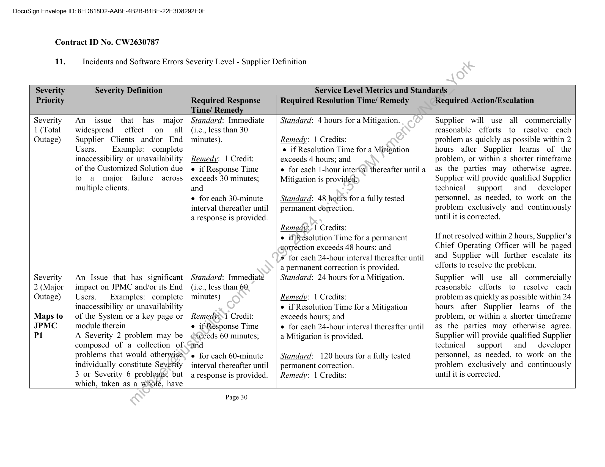

##### Schedule No. 7 to Master Agreement (CW288707)]

  
````col
```col-md
flexGrow=.5
===
> [!info] [Page 1](_attachments/images_JPMC-Singapore-3.6.1.20.1.200143598.pdf_212515/page_1.png)
> 
```  
```col-md
DocuSign Envelope ID: 8ED818D2-AABF-4B2B-B1BE-22E3D8292E0F  
Contract ID No. CW3266226  
SCHEDULE NO. 7
TO
MASTER AGREEMENT (CW288707)  
This Schedule No. 7 (“Schedule”), effective on Ist January 2023 (“Effective_Date”) is an agreement
between JPMorgan Chase Bank, National Association (“JPMC”) and Markit On Demand, Inc. fka Wall
Street On Demand (‘“‘Supplier” or “Markit”) and incorporates, by reference, all terms and conditions
contained in the Master Agreement (CW288707), dated 6" February 2009 as amended from time to time
(“Agreement”). Except as otherwise expressly set forth in this Schedule, the defined terms used in this
Schedule shall have the same meanings as the defined terms in the Agreement. In the event of a conflict or
ambiguity between the terms and conditions of the Agreement and this Schedule, the terms and conditions
of the Agreement shall prevail.  
1. Incorporation of Agreement  
This Schedule is a separate agreement between Supplier and JPMC and incorporates the terms and
conditions of the Agreement. Capitalized terms used but not defined in this Schedule will have the meanings
given to them in the Agreement. If a term in this Schedule conflicts with a term in the Agreement, the
provisions of the Agreement will prevail unless this Schedule specifically states that the term in the
Schedule will prevail. References in this Schedule to Sections and Exhibits will refer to the Sections and
Exhibits of this Schedule unless otherwise noted.  
2. Schedule Term.  
The term of this Schedule will begin on the Effective Date’and continue until 1 March 2024, unless earlier
terminated in accordance with the terms of the Agreement (“Initial Schedule Term”).  
Upon the expiration of the Initial Schedule\Term, and JPMC’s request, this Schedule will renew for
successive 12 -month periods (each a “Renewal Schedule Term”) unless terminated earlier in accordance
with Section 13 Term and Terminationsof the Agreement. 90 days prior to the expiration of the Initial
Schedule Term and any Renewal Schediile Term, Supplier will notify JPMC of the pending term renewal.
JPMC will have the right to renew the term of this Schedule by providing Supplier with not less than 30
days’ prior notice of its intention to renew. The Initial Schedule Term together with the Renewal Schedule
Term(s) shall be referred to as “Schedule Term.”  
Notwithstanding the above, JPMC shall have the right to Terminate this Schedule for convenience, in whole
or in part, at any timesipon 30 days written notice to Supplier for its convenience after the completion of
the Initial Schedule Term. Upon any termination or expiration of this Schedule, JPMC shall pay all unpaid
and outstanding fees for the Services provided up until the date of such termination.  
Further notwithstanding anything contained herein, this Schedule shall remain in full force and effect until
delivery. of any Service by Supplier pursuant to this Schedule including any End of Term Assistance
Services.  
3. Scope of Work.  
Supplier will develop and support APIs for JPMC International Private Banking Online (IPBOL), for use
on both web and mobile platforms, as part of the Digital Wealth Management program.  
For purposes of this Schedule, "Subscriber" shall mean:  
Page 1  
```
````
Notes:    
````col
```col-md
flexGrow=.5
===
> [!info] [Page 2](_attachments/images_JPMC-Singapore-3.6.1.20.1.200143598.pdf_212515/page_2.png)
> 
```  
```col-md
DocuSign Envelope ID: 8ED818D2-AABF-4B2B-B1BE-22E3D8292E0F  
Contract ID No. CW3266226  
o JPMC’s Internal Technical Users: Technical Employees or consultants of JPMC or
JPMC’s Affiliates globally, not considered neither “Professional Users” nor “Non
Professional Users”, that will be differentiated during development period, where
applicable and in accordance with applicable JPMC’s Policies, and report said usage
accordingly. JPMC shall be responsible for (i) correctly categorizing users, and (ii)
notifying Supplier of such users, where required  
The following are the platforms and websites from which the components defined herein will be accessed
by the JPMC’s Subscribers at the outset of this Schedule. Subject to written agreement between the
parties, JPMC may add client portals, websites, URLs, etc. that are related to the JPMC Portals set forth
below. Additional Fees as set forth in Exhibit C (Fees Exhibit) may apply.  
e International Private Bank
o IPB aka IPBOL)(ie. www.jpmpb.com and J.P.Morgan Private Bank app)  
The above is not intended to be an exhaustive list of websites / client portals-alias'/redirects that lead to
the websites. JPMC will notify Supplier of any changes to this list when JPMC becomes aware of such
changes. There are no restrictions to such changes as long as the aliases/redirects all pertain to the JPMC
Portals named above or that are subsequently added during the term-as may be agreed by the parties in
writing.  
JPMC acknowledges that the ability of Supplier to perform Services in the timeframe set forth herein is
contingent upon JPMC’s provision to Supplier of timely information; responses, and/or feedback.
Suppliers' time of performance will be increased, day-foi-day to match any delay caused by failure by
JPMC to submit information; responses, and/or feedback by the dates set forth in this Schedule. For
avoidance of doubt, there will be no extra charges assessed to JPMC for any such delay. For Services
performed under this Schedule, time of the essence shall not apply.  
4. Description of Services and Deliverables: please refer to Exhibit A for a description of all services
and deliverables  
5. Development Services,-‘The Supplier shall provide the following Development Services to JPMC:  
e Developing. and provisioning custom APIs as described in sections 3.1 of Exhibit A (the
DESCRIPTION OF DELIVERABLES EXHIBIT).
e QA and'defect remediation  
JPMC and Supplier shall mutually agree upon detailed requirements of the items above and in Exhibit A
(the Description of Deliverables Exhibit) in advance of development. These requirements will be
documented in Supplier’s JIRA as well as email confirmation as required  
JPME and Supplier acknowledge that Deliverables described in sections 3.2 to 3.18 of Exhibit A (the
DESCRIPTION OF DELIVERABLES EXHIBIT) are provided to JPMC pursuant to Schedule 2
CW2630787 and agree that in the event Schedule 2 is terminated for any reason prior to this Schedule Term
end date, Supplier will continue to support all Deliverables which have met completion criteria for the
project (as defined in Section 6 below), at the time of termination of Schedule 2 for the benefit of JPMC
as provided in this Schedule.  
Page 2  
```
````
Notes:    
````col
```col-md
flexGrow=.5
===
> [!info] [Page 3](_attachments/images_JPMC-Singapore-3.6.1.20.1.200143598.pdf_212515/page_3.png)
> 
```  
```col-md
DocuSign Envelope ID: 8ED818D2-AABF-4B2B-B1BE-22E3D8292E0F  
Contract ID No. CW3266226  
6. Administrative and Project Management Services. The Supplier shall provide the following
Administrative and Project Management Services to JPMC:  
e Services to be performed:  
o Project roadmap management in alignment with JPMC scheduled releases; the parties
shall mutually agree upon release schedules during the development phase of the
Deliverables  
o Weekly checkpoints with JPMC design, architect, developer, and product teams  
e The manner in which the services will be performed:  
o Supplier will leverage its JIRA for project tracking all work items, change-controls,
QA testing, and defect logging; JPMC will be provided access.  
e Completion criteria for the project:  
o Deliverables are delivered, accepted by JPMC in accordance\with Section 5
Acceptance below and as detailed in Exhibit A (the Description of Deliverables
Exhibit) and implemented in accordance with JPMC requirements defined in the
Agreement and this Schedule, and released into production,en-vironment(s)  
7. Hosting and Support Services. The Supplier shall provide the ‘following Hosting and Support
Services to JPMC:  
e Network connectivity and authentication
e Encrypted and tokenized data transfer
o Authentication will be facilitated through.either Oauth client credentials grant or JWT
extension via browser cookie using TP-PSaaS and API calls from JPMC server side
proxy. User access token expiry wwiil be set at 10 minutes. The following endpoints
and JPM app names will besutilized for APIs in both Production (Prod) and PreProduction (QA) environments:
e API Prod: Singie-domain name to be confirmed by JPMC and agreed with
Supplier in writing (including email) point to api.markitdigital.com
e API QA: Single domain name to be confirmed by JPMC and agreed with
Supplier in writing (including email) to point qa-api.markitdigital.com
o Supplier willcreate Client IDs for the following apps:  
App Name Description Auth type Token
IPB_MW* API connectivity for | Client creds expiry period to be agreed upon
Digital Middleware by JPMC and Supplier in writing
(including email)
Web components JWT expiry period to be agreed upon
IPB_UINNEWS for retail web by JPMC and Supplier in writing
IPBSUi_RESEARCH* (including email)  
*App name is subject to change as agreed between parties in writing, including email
e Performance testing
e Dynamic security and penetration testing - ensure that industry standard best practices are in
place for all policies and procedures related to data security (encryption, etc). Supplier will
conduct annual tests on their own, with 20 business day’s notification in advance by JPMC,  
Page 3  
```
````
Notes:    
````col
```col-md
flexGrow=.5
===
> [!info] [Page 4](_attachments/images_JPMC-Singapore-3.6.1.20.1.200143598.pdf_212515/page_4.png)
> 
```  
```col-md
DocuSign Envelope ID: 8ED818D2-AABF-4B2B-B1BE-22E3D8292E0F  
Contract ID No. CW3266226  
following OWASP Top 10 guidelines, and send JPMC the results on all hosted components.
Supplier will also be subject to periodic scans initiated by JPMC (currently annual, but may
change to semi-annual at JPMC’s if mutually agreed by JPMC and Supplier). Upon the
identification of a security incident by Supplier or JPMC as a result of a security test or
otherwise in the normal course of business, and according to the definition in Supplier’s
incident management policy, Supplier shall remediate the identified incident as per the SLAs
identified in Section 10 of Exhibit B (the SLA Exhibit).  
8. Deliverables. The Supplier shall provide the following Deliverables to JPMC:  
Supplier will provide the Deliverables set forth in Exhibit A (the Description of Deliverables Exhibit). All
Deliverables are deemed Developed Works.  
9. Enhancements.  
JPMC is entitled to an enhancement budget equal to twenty -eight (28) hours per month commencing on
Acceptance of Deliverables by JPMC. Such enhancements to the Deliverables, which may include design
changes, addition of new features, or integration of new data (the, “Enhancement Budget”). The
Enhancement Budget shall be accrued on a rolling 12 month basis, anduf unused it shall lapse. For the
avoidance of doubt, JPMC may apply Enhancement Budget toward_any. of the Deliverables.  
Upon 60 days written request from JPMC, the Supplier will reduce the Enhancement Budget, and ongoing
fees defined in Exhibit C (Fee Exhibit) shall be reduced based on the rate above. Such changes shall be
documented in an amendment to this Schedule.  
10. Bug Fixes and Material Changes  
Supplier will not charge any additional. fees for work done to address any material defects in the
Deliverables so it conforms to the original requirements set out in this Schedule and its functional
documentation (“Bug Fixes”) to the extent that supplier is hosting the Deliverables. Supplier will make any
changes beyond Bug Fixes and if applicable, changes covered by the Enhancement Budget, at the rate of
$175 an hour. Should JPMC request Supplier to perform additional work, the parties will enter a separate
Schedule.  
11. Acceptance  
Acceptance Criteria” In addition to being in Compliance and in line with the Criteria set in Section 4
Testing, Correction and Acceptance of the Agreement, the Deliverables must meet the following criteria
as a condition-of Acceptance:  
As per Exhibit A (the Description of Deliverables Exhibit).  
12: Service Levels.  
The Service Levels are set forth in Exhibit B (the Service Level Agreement (“SLA”) Exhibit).  
13. Third Party Content  
In order to receive third-party IP data as part of the Services, JPMC may be required to obtain a direct  
Page 4  
```
````
Notes:    
````col
```col-md
flexGrow=.5
===
> [!info] [Page 5](_attachments/images_JPMC-Singapore-3.6.1.20.1.200143598.pdf_212515/page_5.png)
> 
```  
```col-md
DocuSign Envelope ID: 8ED818D2-AABF-4B2B-B1BE-22E3D8292E0F  
Contract ID No. CW3266226  
license and /or sub-license from the relevant Third Party Licensor(s) in respect of JPMC’s use of that Third
Party IP. Supplier can recommend and make introductions to appropriate providers, explain use cases for
content and answer questions providers may have, but JPMC will be responsible for all agreements with
and payments to such providers, unless the relevant provider requires the payment to be done by Supplier.
Notwithstanding the foregoing, certain Third Party Licensors shall also require Supplier to have an
appropriate license, and Supplier shall comply with the terms of that license in order to receive the thirdparty IP data hereunder.  
Prior to entitling Third Party Licensor’s IP data to JPMC, Supplier must receive written consent for JPMC’s
scope of use from the applicable the Third Party provider before permission is given to the service: It is
the responsibility of Supplier to centrally store any associated consent documents for regulatory and audit
purposes. Upon request, Supplier shall provide the documented consent from the Third PartyLicensors to
JPMC.  
When the relevant Third Party Licensor requires the payment to be done by Supplier;-Supplier will charge
JPMC and pass these fees onto the relevant Third Party Licensor. Supplier will pay necessary market data
fees directly to each Third Party Licensor and will treat such fees as pass-through charges to JPMC without
any mark-up. In the event there are any additional fees for use of Third Party IP delivery in conjunction
with use of the data, JPMC must be notified in writing by Supplier forthe-additional fees and must receive
consent before any fees apply. Supplier will receive written approval from each Third Party Licensor prior
and provide evidence to JPMC before to entitling the content to JPMC.  
Upon request by JPMC to Supplier and an amendment to this Schedule, Supplier shall be authorized to act
as the agent of JPMC for the purchase of certain data and/or content required by JPMC for this project and
is authorized to contract on behalf of JPMC for such’purchase. JPMC is responsible for all licensing
expenses; any amount of sales, use, excise, gross receipts, value added, goods and services, or other taxes;
and any other fees applicable to or arising from the provision or the use of such data and/or content,
including any additional fees should Third Party Licensor increase their fees at any time. Supplier will
notify JPMC in writing of any fee increases’ within thirty (30) days of receiving such notice from the
applicable source. Subject to the licensing terms with the applicable source, JPMC may elect to remove
such content upon written notice to Supplier, and JPMC and Supplier shall mutually agree upon a plan and
timeline to remove such content.  
Supplier email address for Third Party Content related requests: Data.SolutionsPOC@ihsmarkit.com  
14, Entitlement System Services, Reporting:  
o .Entitlement: In addition and subject to all Third Party Licensors approvals, Supplier will
also provide, where applicable, data permissioning for data from Exchanges as well as
other third party data providers as may be mutually agreed to by the Parties for specific
Subscribers as may be requested by JPMC.  
o JPMC will provide Supplier with a unique identifier along with parameters indicating to
which Market Data Components (and Data Sources) Subscribers are entitled. JPMC’s
External Client Users shall have entered into a Client Agreement prior to JPMC’s provision
to Supplier of such unique identifier.  
o Entitlement Report for Market Data Sources delivered via XML API based Delivery.
On a monthly basis, Supplier shall use commercially reasonable efforts to provide JPMC
with an Entitlement report within ten (10) business days of the calendar month end. Such  
Page 5  
```
````
Notes:    
````col
```col-md
flexGrow=.5
===
> [!info] [Page 6](_attachments/images_JPMC-Singapore-3.6.1.20.1.200143598.pdf_212515/page_6.png)
> 
```  
```col-md
DocuSign Envelope ID: 8ED818D2-AABF-4B2B-B1BE-22E3D8292E0F  
Contract ID No. CW3266226
Entitlement report will summarize the quote usage by each Subscriber User.  
o Third Party Supplier Reporting (including Exchanges): To the extent permitted by the
Third Party Licensors, the Supplier will perform quote counting where applicable for RealTime Exchanges and provide specific usage reports of such quotes ("Quote Count
Reports") to each Third Party Licensor. Supplier will be responsible for the accuracy
relating to its quote counting and quote consumption reporting mechanisms to each Third
Party Licensor, and, to the extent its quote counting and quote consumption reporting is
inaccurate and additional fees are assessed, Supplier shall be responsible for<such
additional fees. Notwithstanding the foregoing or anything contained in this Schedule or
the Agreement, in the event a Third Party Licensor determines that Supplier under-reported
quotes and such additional fees are assessed by such Third Party Licensor, JPMC shall be
responsible for the actual number of quotes consumed by Subscribers; provided however,
in such situation, JPMC shall not be responsible for any penalties assessed by a Third Party
Licensor in connection with such under-reporting.  
o Upon request, Supplier will provide a statistical usage report detailing real-time quote
consumption, grouped by Third Party Licensor and User Identifiers, as sent by JPMC with
each quote request. Supplier and JPMC will mutually agree with a format of such report.  
o Statistical Usage Report: Upon request, Supplier will provide statistical usage reports to
JPMC. Such reports are designed to include usage of market data consumption, real-time
or delayed, grouped by Third Party Licensors\(Exchange, as well as aggregate usage on
Supplier hosted components. JPMC may request such monthly usage reports for the prior
twelve (12) months.  
15. Performance Schedule.  
As per Exhibit A (the Description of Deliverables Exhibit).  
16. Location of Performance.  
The primary location(s) for provision of the Services during the Schedule Term are as follows:  
All business may be transacted remotely between parties. Services will be performed and physical meetings
may be scheduled on an‘ad-hoc basis at primary JPMC offices locations as requested by JPMC and agreed
to in writing (whichuneludes email) by Supplier.  
The Supplier will use JPMC facilities only to provide the Services. All assets provided by JPMC will remain
in the JPM@facility where those assets were initially located unless JPMC otherwise agrees in writing.
JPMC.may relocate any JPMC facility to another geographic location, or direct the Supplier to cease using
all or(part of a JPMC facility (in which event, JPMC will provide similar space in the same or an alternate
JPMC facility). When any JPMC facility is no longer being used or otherwise required for performance of
the Services, the Supplier will (a) promptly remove its property from that JPMC facility, and (b) return that
JPMC facility to substantially the same condition it was in when the Supplier began to use that facility,
subject to reasonable wear and tear.  
In addition to the above, Services will be performed by Supplier remotely from the locations below.
Supplier will not change any Service Location without JPMC’s prior written consent.  
Page 6  
```
````
Notes:    
````col
```col-md
flexGrow=.5
===
> [!info] [Page 7](_attachments/images_JPMC-Singapore-3.6.1.20.1.200143598.pdf_212515/page_7.png)
> 
```  
```col-md
DocuSign Envelope ID: 8ED818D2-AABF-4B2B-B1BE-22E3D8292E0F  
Contract ID No. CW3266226  
5775 Flatirons Parkway, Boulder, CO USA — all services shall be provided from this location  
Green Boulevard, Tower C, Plot B-9A, Sector 62, Noida, India — development, QA testing and production
support shall be provided from this location  
17. Fees
Fees are set forth in Exhibit C (Fee Exhibit)
18. Invoicing  
JPMC will be invoiced by the Supplier and pay such invoices in accordance with the terms.of Section 5 of
the Agreement. Invoices shall be sent to the following address:  
JPMorgan Chase Bank, National Association
1111 Polaris Parkway  
Columbus, Delaware  
OH, 43240  
United States  
Attention: JPMC Relationship Manager  
19. Reports  
Upon JPMC’s reasonable request, Supplier shall preparea summary report in the format as agreed between
the parties detailing the activities for the time periodvcovered by the request and any open issues to be
addressed by the Supplier and JPMC-. In addition, the Supplier shall contact JPMC without undue delay by
telephone, and if requested confirm by written notice, upon discovery of any problem that will materially
delay the provision of any Deliverable.  
20. Relationship Managers.  
JPMC Relationship Manager Supplier Relationship Manager
Name: Name:
Claire Wu Ryan Welley
Title: Title:
VP, JP Morgan Chase Regional Head, APAC
Telephone Number: Telephone Number:
W +852-28001458 M: +852-5508-7775 W: +61 8076 1118
M: +61 417 004 368
Email; Email:
Claire. wu@jpmorgan.com ryan.welley@spglobal.com
Address: Address:
77 Hoi Bun Road, Floor 17, Kwun Tong, Hong | 2 Bulletin Place Level 13 | Sydney, NSW 2000
Kong,
JPMC Cybersecurity Contact Supplier Cybersecurity Contact *
Name: Scott Dwelley Name: Tier 1 Support  
Page 7  
```
````
Notes:    
````col
```col-md
flexGrow=.5
===
> [!info] [Page 8](_attachments/images_JPMC-Singapore-3.6.1.20.1.200143598.pdf_212515/page_8.png)
> 
```  
```col-md
DocuSign Envelope ID: 8ED818D2-AABF-4B2B-B1BE-22E3D8292E0F  
Contract ID No. CW3266226  
Title: Technology Control Officer, Digital Title:
Work and Mobile Telephone Numbers: Work and Mobile Telephone Numbers:
+1-603-896-8680 (work) +1.303.583.4308  
+1-603-759-8458 (mobile)  
E-mail: scott.w.dwelley@jpmchase.com E-mail: MOD-NOC@ihsmarkit.com  
Address: 4 Northeastern Blvd, Floor 03 | Address: 5775 Flatirons Parkway
Salem, NH, 03079-5916, United States Boulder, CO 80301  
*At no additional expense to JPMC, the Supplier Cybersecurity Contact must (i) respond to albcyber-related
inquiries within 24 hours, 7 days a week, and (ii) be available via mobile and SMS within-24 hours, 7 days
a week (with back-up resources when the Supplier Cybersecurity Contact is either unavailable or out of the
office (“Back-Up”)). Supplier will immediately provide written notice to JPMG/’when the Supplier
Cybersecurity Contact changes or when the Back-Up has the responsibility hereunder.  
21. Subcontractor Personnel.  
The following Subcontractor Personnel shall provide Services under_this Schedule, and shall be regarded
as approved by JPMC for the purposes of the Agreement:  
NTT Data Services, LLC: Data Center Operations, Infrastructure as a Service (IaaS)
Globant: Development, Quality Assurance (QA), Dev/Ops  
22. Additional terms and conditions applicable‘to, this Schedule only (if any).  
1. Section 8.4, of Master Agreement CW280805, dated February 6th, 2009 Compliance with Laws,
is hereby amended to append the following additional new paragraph thereof:  
2. Pursuant to Section 1.10 Compétitive Advantage as a Result of Services of the Amendment | to
the Agreement, JPMC and-Supplier hereby acknowledge and agree that, in the event JPMC deems
in its sole discretion that any of Deliverables provide JPMC a competitive advantage, the Supplier
will not share or promote and in turn develop or implement any unique functionalities or designs
as part of the Deliverables for any competitor of JPMorgan Chase & Co. for a period of twelve
months after JPMC Accepts those Developed Works or Services. JPMC shall notify Supplier in
writing of specific functionalities and designs it deems competitive prior to Supplier’s development
of the services; such notification shall include a clear description of specific design/functionality it
deems‘unique. In addition, Supplier can provide similar services to JPMC competitors if Supplier
already began working on solution with competitor prior to JPMC providing notice and Supplier
can substantiate that solution to the satisfaction of JPMC.  
[SIGNATURE PAGE TO FOLLOW]  
Page 8  
```
````
Notes:    
````col
```col-md
flexGrow=.5
===
> [!info] [Page 9](_attachments/images_JPMC-Singapore-3.6.1.20.1.200143598.pdf_212515/page_9.png)
> 
```  
```col-md
DocuSign Envelope ID: 8ED818D2-AABF-4B2B-B1BE-22E3D8292E0F  
Contract ID No. CW3266226  
IN WITNESS WHEREOF, the parties have caused duly authorised representatives of their respective
companies to execute this Schedule on the date or dates set forth below.  
JPMorgan secBankyyNational Association Markit O) addy hac
Terry Froggatt  
by 2 Freie by __| Catarina Maye  
Terry Froggatt Catherine Allegra
Name Name  
Category Manager VP
Title gory Manag Title °  
1/4/2023 1/4/2023
Date Date  
Page 9  
```
````
Notes:    
````col
```col-md
flexGrow=.5
===
> [!info] [Page 10](_attachments/images_JPMC-Singapore-3.6.1.20.1.200143598.pdf_212515/page_10.png)
> 
```  
```col-md
DocuSign Envelope ID: 8ED818D2-AABF-4B2B-B1BE-22E3D8292E0F  
Contract ID No. CW3266226  
EXHIBIT A  
DESCRIPTION OF DELIVERABLES EXHIBIT  
1. Dates of Service.  
The Services will start on the Effective Date.  
2. Services to Be Performed.  
Supplier will perform the following Services:  
e Project roadmap management in alignment with JPMC sanctioned:réleases
e Weekly checkpoints with JPMC design, architect, developer, did product teams
e Future amendments to work Schedule 7 and charge under enhancement hours
e Developing and provisioning custom APIs
— JPMC can leverage the data available inthe components via API for
integration in other areas of the site arid/or mobile app, if needed
— Out of scope:  
o The following functignality shall be subject to review to
determine technical’ feasibility as designs are provided. If
supported by Supplier, these items may incur additional fees
and/or extend)timelines.  
e API Customization:
o Examples: inputs or outputs of APIs
custom for IPBOL use  
e Network connectivity and authentication via OAuth extension grant for JWT or
Client credentials.grant  
e Asingle standalone test environment for integration, QA and performance testing.  
e Production support ticket tracking  
e Defect remediation  
e Adequate controls to ensure cyber vulnerabilities are identified and remediated.
These controls should include but not be limited to: open source scanning, static
scanning, dynamic scanning, penetration testing and firewall management;  
Unless otherwise specified below, JPMC will call Supplier’s APIs on a
request/response basis driven by end user page views of JPMC client portals  
e Unless otherwise specified below, a max of 200 symbols can be requested by
JPMC in each quote API call  
3. Deliverables to be Provided and optional additional services or APIs.  
JPMC and Supplier agree that the requirements contained herein are for initial work estimates only
and that refinement and final agreement may occur following the Schedule Effective Date.  
Supplier will provide to JPMC the following Deliverables. Deliverables described below in sections
3.2 to 3.18 will be completed according to schedule and priority set out in Schedule 2 Exhibit 3
Requirements for each Deliverable shall be mutually agreed upon before Supplier commences development
of the applicable Deliverable, the requirements for the API only Deliverables listed below is indicative and  
Page 10  
```
````
Notes:    
````col
```col-md
flexGrow=.5
===
> [!info] [Page 11](_attachments/images_JPMC-Singapore-3.6.1.20.1.200143598.pdf_212515/page_11.png)
> 
```  
```col-md
DocuSign Envelope ID: 8ED818D2-AABF-4B2B-B1BE-22E3D8292E0F  
Contract ID No. CW3266226  
subject to change. Thereafter, any added requirements, including additional data sources, shall be subject
to additional fees. All data sources listed in this section 3 will be provided to the extent that, and provided
that Supplier continues to have a licence to such third party data.  
3.1  
[e)  
oo0°0  
Security Quote Screen APIs
Description:  
= Primary equity quote detail and profile page with snapshot performance  
measures, profile information, news and research  
Core functionality:  
= APIs for detailed quote information for securities  
= APIs for company description and key fundamentals  
= APIs for Intraday and historical charting  
= APIs for company-specific news headlines with links to news article pages
Data sources facilitated by Supplier:  
= Stock exchanges all delayed:
US Composite covers NYSE Tape A/Tape B, and Nasdaq (this will cover Nasdaq, NYSE,
NYSE Arca, AMEX) — Stocks and ETFs
Hong Kong SE — Stocks only (no ETFs)
Euronext Cash — Stocks only (no ETFs)
Deutsche Boerse Xetra Core — Stocks only (no ETFs)
London SE — Stocks only (no ETFs)  
= Indices (for chart comparisons):  
o DJIA (delayed only)
S&P 500 (delayed only)
NASDAQ Composite (delayed only)
HSI (delayed only)
Euronext All Indices (delayed only)
o Deutsche Boerse Indices and Xetra ETF (delayed only)  
= Equity profile and. fundamentals: Morningstar  
= Corporate events:Morningstar  
= Company news: MT Newswires displayed only for users not entitled to research
Industry Peer, including top 5 industry peers in the JPM universe and its data points
including Last,price, price target and P/E (TTM)
News filtered by stock ticker unless no results then display news for company unless no
results then display news for industry  
oo0°0  
JPMC responsibilities:
« Provide user identifiers (JPMC PIDs) for entitlements and quote counting
= Provide hyperlinks to JPMC secure pages for contextual passing and redirects
= Provide designs in accordance with API specifications from Supplier;. Minor
design updates may be made after this date so long as both JPMC and Supplier
agree in writing (including email) changes do not impact delivery date.
= All relevant data licenses maintained for API functionality
= Add disclaimer to front end for peers only being returned within tradeable
universe.
Assumptions
= The parties shall use JWT Authentication protocol for JPMC to access the APIs
For clarity, the API endpoints which are considered as part of this deliverable are as
follows using the Supplier naming convention:
= XREF — used for symbol search and cross referencing  
Page 11  
```
````
Notes:    
````col
```col-md
flexGrow=.5
===
> [!info] [Page 12](_attachments/images_JPMC-Singapore-3.6.1.20.1.200143598.pdf_212515/page_12.png)
> 
```  
```col-md
DocuSign Envelope ID: 8ED818D2-AABF-4B2B-B1BE-22E3D8292E0F  
Contract ID No. CW3266226  
Additional optional API services/access which are not consumed as of Effective Date of this Schedule but
can be enabled as per the fees set out in the Fee table Deliverable 2 in Exhibit'C. Enablement of these APIs
is dependent on them being created and being accessed by JPMC as»per Schedule 2 (CW2630787 and
having an effective date January 31, 2019). If APIs have not been created under Schedule 2 than additional  
Quote — used for quote details  
News — used for licensed news data  
Quote — Intraday — Historical — used for charting data for short term intraday
charts  
Quote — Historical — used for charting data for longer term end of day charts
Equities — Morningstar — Estimates — used for key financials  
Equities — Morningstar — Financial Ratios — used for key financials  
Equities - Morningstar - Management — used for key financials  
Equities - Morningstar - Asset Classification — used for key financials
Equities - Morningstar - Earnings — used for key financials  
Equities - Morningstar - Peers — used for key financials  
Equities - Morningstar - General Information — used for company description  
Equities-morningstar-corporateactions-dividends — used for charting overlays and  
dividend data
equities-morningstar-corporateactions-splits — used for charting overlays  
build fees may apply and will be stated under a separate Schedule entered into between the parties.  
3.2  
[e)  
Option Chain & Chain Quote API  
Description:  
Option chain component withstandard options chain quote information  
Core functionality:  
Options chain app build with seamless experience for filtering on expirations,
calls/puts, and strike counts with real-time options data:  
— Expiration  
— Strike  
— Bid  
—-\Ask  
Last  
— Change $/%  
— Volume  
— Open Interest  
— Delta  
— Midpoint  
— Breakeven  
Data sources facilitated by Supplier:  
OPRA real-time and delayed data  
JPMC responsibilities:  
Provide user identifiers (JPMC PIDs) for entitlements and quote counting
Provide designs in accordance with API specifications from Supplier  
Assumptions  
OPRA monthly quote reporting will be facilitated by Markit
This will be Markit Digital’s standard Option API product.  
Page 12  
```
````
Notes:    
````col
```col-md
flexGrow=.5
===
> [!info] [Page 13](_attachments/images_JPMC-Singapore-3.6.1.20.1.200143598.pdf_212515/page_13.png)
> 
```  
```col-md
DocuSign Envelope ID: 8ED818D2-AABF-4B2B-B1BE-22E3D8292E0F  
Contract ID No. CW3266226
3.3 Option Quote APIs  
o Description:
e Options quote APIs
o Core functionality:
e API for use case |
— Request type: request/response driven by end user page views of
JPMC client portals
— Input: Symbol
— Response: All Expirations (w/ flags for
Monday/Wednesday/Weeklies/Monthlys)
e API for use case 2
— Request type: request/response driven by end user page views of
JPMC client portals
— Input: Symbol + Expiration
— Response: All Strikes
e API for use case 3 (this can be used on the tradingsticket for single option
quote, real-time data for individual user holdings per request, or delayed data
for scheduled snap use case for all client Held option positions)
— Request types:
o Request/response driven by end user page views of JPMC
client portals
o Programmatic. bulk request/response driven by a scheduled
job which, requests up to 15,000 symbols with up to 2,000
symbols/per request every 5 minutes during trading hours
o  Multi-Quote request to be utilized for bulk request process:
=“ Initially, Supplier will support up to 200 symbols per
request. In a subsequent release based on a mutually
agreed upon timeline, Supplier increase support up to
2,000 symbols per request
* Initially, Supplier will also support multi-threaded
requests, enabling JPMC to send multiple requests in
the same or near same second, with up to 200 symbols
per request
— Input: One or more symbol/expiration/strike requests
— Response: for each option contract:
o Expiration
Strike
Last
Change $/%
Bid
Bid size
Ask
Ask size
Multiplier
Midpoint
Volume
o Open Interest
o Data sources facilitated by Supplier:  
ooo0o0o00000 0  
Page 13  
```
````
Notes:    
````col
```col-md
flexGrow=.5
===
> [!info] [Page 14](_attachments/images_JPMC-Singapore-3.6.1.20.1.200143598.pdf_212515/page_14.png)
> 
```  
```col-md
DocuSign Envelope ID: 8ED818D2-AABF-4B2B-B1BE-22E3D8292E0F  
Contract ID No. CW3266226  
e OPRA real-time and delayed data
o JPMC responsibilities:
e Provide user identifiers for entitlements and quote counting
e
o Assumptions
e Supplier will provide its standard Option Quote API product
e OPRA monthly quote reporting will be facilitated by Supplier  
3.4 Watchlist APIs  
o Description:
e Watchlist to allow user to create and track securities within a watchlist
o Core functionality:
e Baseline functions will be:
— Create new watchlist from main Watchlist page
— Create new watchlist from ‘Add to Watchlist” button pattern
— Add symbol from quote detail page
— Toggle to different user watch lists.
— Quote detail side panel slide-in (invoked when clicking symbol from
watchlist)
— Add symbol from quote detail-side panel slide-in (invoked when
clicking symbol from watchlist)
e Data points:
— Symbol/Name
— Price / Day Change ($/%)
— Day Range
— 52-week range
— Time stamp for quote
— Delayed pricing data for non-investment customers
— NASDAQ Basic real-time stock/ETF pricing data for investment
customers
-.*New data returned via web services include:
—— Remove multiple symbols from user watch lists (multi-select)
— Delete user watch lists
— Rename user watch lists
— Additional data points for custom views:
— Change since added ($/%)
— Basic Stock/ETF/Fund fundamentals (Market cap, EPS, P/E ratio,
Dividend Yield, Ex-Dividend date, etc.  )
— Performance data (YTD, | mo, 3 mo, 6 mo, | yr, 3 yr, 5 yr, 10 yr)
— J.P. Morgan equity research:
o Rating
o Price Target
o Quarterly Earnings Estimates / Actuals
o Yearly Earnings Estimates / Actuals
o PDF report link
e Universe of MIND events shall be mutually agreed upon between the parties
and is subject to JPMC’s content licenses
e Technical events (e.g. company xyz reached its 52-week high)  
Page 14  
```
````
Notes:    
````col
```col-md
flexGrow=.5
===
> [!info] [Page 15](_attachments/images_JPMC-Singapore-3.6.1.20.1.200143598.pdf_212515/page_15.png)
> 
```  
```col-md
DocuSign Envelope ID: 8ED818D2-AABF-4B2B-B1BE-22E3D8292E0F  
Contract ID No. CW3266226  
Corporate events (e.g. company xyz dividend pay date is xx/xx)
3rd party research (e.g. Morningstar rating changes)  
JPM equity research (e.g. JPM price target change)  
Market indices  
o Data sources facilitated by Supplier:  
Stock exchanges: NYSE (delayed), NASDAQ (delayed), NASDAQ Basic (realtime),
Indices: DJIA (delayed & real-time), S&P 500 (delayed & real-time), NASDAQ
Composite (delayed & real-time)
Equity fundamentals: Morningstar
Fund fundamentals and ratings: Morningstar DataWarehouse — U.S.funds
Equity research: J.P. Morgan Research & Estimates  
— JPMC may elect to include two (2) additional equity research sources  
currently available on Supplier’s platform  
o JPMC responsibilities:  
Provide user identifiers (JPMC PIDs) for saving watchlist symbols and
preferences  
Provide access to existing JPMC user watchlist symbols to upload/migrate in a
mutually agreed upon format and timeline, Specification of watchlist data for
migration to be provided by JPMC to Supplier at least 8 weeks prior to expected
delivery  
Provide entitlements as part of authentication handshake indicating whether user
is entitled to real-time/delayed quotes.  
Provide identifier for investment users.  
o Assumptions:  
Users can create up to.20 individual watchlist with up to 50 symbols per
watchlist via API:  
JPMC will provide a consolidated file in a mutually agreed upon format (e.g.
CSV) with mutually agreed upon symbology  
If Suppliers required to integrate additional JPMC research at the database
level, additional fees may apply  
3.5 Muteal Fund Quote & Profile APIs  
o Deseription:  
Primary mutual fund quote detail and profile page with snapshot performance
measures, (both gross and net of fees) profile information and rating  
©. Core functionality:  
NAV and key performance information  
Fund description/profile  
Fund characteristics including sector and geographical breakdown  
Fund ratings  
Basic Chart with links to historical pricing data table and Interactive Chart
Link to JPMC trade ticket - Supplier to process two files: tradable funds at
JPMC, tradable funds for You Invest  
Ability to add symbol to Watchlist (a specific watchlist the user has set up)
Portfolio Composition - X-ray level (asset allocation / sector weights / regional  
Page 15  
```
````
Notes:    
````col
```col-md
flexGrow=.5
===
> [!info] [Page 16](_attachments/images_JPMC-Singapore-3.6.1.20.1.200143598.pdf_212515/page_16.png)
> 
```  
```col-md
DocuSign Envelope ID: 8ED818D2-AABF-4B2B-B1BE-22E3D8292E0F  
Contract ID No. CW3266226  
exposure / market cap)
e Top 10 holdings
e Growth of 10K over various timeframes (1 year, 5 year, 10 years, etc) including
both gross and net of fees
o Data sources facilitated by Supplier:
e Stock exchanges: NASDAQ NEN quote data (real-time MFQS daily valuation
data)
e Fund fundamentals and ratings: Morningstar DataWarehouse — U.S. funds
o JPMC responsibilities:
e To pass two files: tradable funds at JPMC, tradable funds for You Invest
o Assumptions
e Requirements for the tradable funds file integration need to be determined and
additional fees may apply  
3.6 ETF Quote & Profile APIs  
o Description:
e Primary ETF quote detail and profile page with.snapshot performance measures,
profile information and rating
o Core functionality:
e price and key performance information
Fund description/profile
Fund characteristics including sector and geographical breakdown
Fund ratings
Basic Chart with links to historical pricing data table and Interactive Chart
Link to Options Chain
Link to JPMC trade ticket
Ability to add symbol'to Watchlist (a specific watchlist the user has set up)
Portfolio Composition - X-ray level (asset allocation / sector weights / regional
exposure / market cap)
e Top 10 holdings
o Growth of 10K-over various timeframes (1 year, 5 year, 10 years, etc)Data sources
facilitated by Supplier:
e Stock exchanges: NYSE (delayed), NASDAQ (delayed), NASDAQ Basic (realtime), OTC (delayed)
e» Indices (for chart comparisons): DJIA (delayed & real-time), S&P 500 (delayed
& real-time), NASDAQ Composite (delayed & real-time)
e Fund fundamentals and ratings: Morningstar DataWarehouse — U.S. funds
@ JPMC responsibilities:
e Provide user identifiers (JPMC PIDs) for entitlements and quote counting
o Assumptions
e NA  
3.7 Stock Quote & Profile — Extended Quotes & OTC Notification APIs  
o Description:
e Extend quote and OTC market data as entitled
o Data sources facilitated by Supplier:  
Page 16  
```
````
Notes:    
````col
```col-md
flexGrow=.5
===
> [!info] [Page 17](_attachments/images_JPMC-Singapore-3.6.1.20.1.200143598.pdf_212515/page_17.png)
> 
```  
```col-md
DocuSign Envelope ID: 8ED818D2-AABF-4B2B-B1BE-22E3D8292E0F  
Contract ID No. CW3266226  
e Stock exchanges: NYSE (delayed), NASDAQ (delayed), NASDAQ Basic (realtime), OTC (delayed)
e Indices (for chart comparisons): DJIA (delayed & real-time), S&P 500 (delayed
& real-time), NASDAQ Composite (delayed & real-time)
o JPMC responsibilities:
o N/A Assumptions
e N/A  
3.8 Stock Top Holders APIs  
o Description
e Top mutual fund and ETF holders of a stock
o Core functionality:
e list of mutual funds and ETFs with largest holdings of the specified stock
o Data sources facilitated by Supplier:
e Top 10 holdings: Morningstar DataWarehouse — U.S. mutual funds and ETFs
o JPMC responsibilities:
o Assumptions
e NA  
3.9 Stock Fundamentals APIs  
o Description
e Detailed fundamental performance information added to the Stock Quote &
Profile component
e Components for financials statements (income statement, balance sheet, cash
flow)
o Core functionality:
e various fundamental data and performance for stocks
o Data sources facilitated by Supplier:
e Equity profile and fundamentals: Morningstar
o JPMC responsibilities:
o N/A Assumptions
e NA  
3.10 Stock Performance Comparison APIs  
oO) Description
e Performance of specified stock compared to its industry peers and benchmarks
(indices/sector/subsector)
o Core functionality:
e Various price performance comparisons for stocks
o Data sources facilitated by Supplier:
e Equity profile and fundamentals: Morningstar
o JPMC responsibilities:
o N/A Assumptions
e NA  
Page 17  
```
````
Notes:    
````col
```col-md
flexGrow=.5
===
> [!info] [Page 18](_attachments/images_JPMC-Singapore-3.6.1.20.1.200143598.pdf_212515/page_18.png)
> 
```  
```col-md
DocuSign Envelope ID: 8ED818D2-AABF-4B2B-B1BE-22E3D8292E0F  
Contract ID No. CW3266226
3.11 Stock Research APIs  
o Description
e Ratings, research and earnings estimates for a specified stock
o Core functionality:
e Research data and reports for stocks
o Data sources facilitated by Supplier:
e Research: J.P. Morgan Research & Estimates
e 3" party research provider(s) as mutually coordinated between JPMC and
Supplier
o JPMC responsibilities:
e JPMC will be responsible for delivering JPMC research to Supplierfor
integration in Stock Research component(s)
o Assumptions
e NA  
3.12 Stock News APIs  
o Description
e News delivery and exploration capabilities for a specified stock
o Core functionality:
e Filter news by various parameters ineluding source, news category,
keywords/phrase, timeframe
o Data sources facilitated by Supplier:
e News: Comtex
— JPMC may electitoinclude two (2) additional news sources currently
available on Supplier’s platform
o JPMC responsibilities:
e JPMC will be responsible for delivering JPMC research to Supplier for
integration in Stock Research component(s)
o Assumptions
e NA  
3.13. MutualFund Quote & Profile — Additional Detail APIs  
o Deseription:
» Additional content/modules added to Mutual Quote & Profile
oO) Core functionality:
e Additional ratings
e Peer comparison; peer comparison methodology shall be mutually agreed upon
between the parties
o Data sources facilitated by Supplier:
e Fund fundamentals and ratings: Morningstar DataWarehouse — U.S. funds
e Other research/ratings?
o JPMC responsibilities:  
N/A
o Assumptions
e NA  
Page 18  
```
````
Notes:    
````col
```col-md
flexGrow=.5
===
> [!info] [Page 19](_attachments/images_JPMC-Singapore-3.6.1.20.1.200143598.pdf_212515/page_19.png)
> 
```  
```col-md
DocuSign Envelope ID: 8ED818D2-AABF-4B2B-B1BE-22E3D8292E0F  
Contract ID No. CW3266226
3.14 ETF Quote & Profile — Additional Detail APIs  
o Description:
e Additional content/modules added to ETF & Profile
o Core functionality:
e Additional ratings
e Peer comparison
o Data sources facilitated by Supplier:
e Fund fundamentals and ratings: Morningstar DataWarehouse — U.S. funds
e Other research/ratings?
o JPMC responsibilities:  
e NA
o Assumptions
e NA  
3.15 Market Overview APIs  
o Description:
e Key market indicators across regions, securities, benchmarks and events
o Core functionality:
e Today's Market summary / analysis message
e Basic charting for indices
e Regions/Instruments
e US
DJIA
NASDAQ
S&P 500
NYSE
AMEX  
e Global
Hang Seng  
e Currencies
U.S. Dollar
Argentinean Peso
Brazilian Real
Canadian Dollar
Chilean Peso
Dominican Peso
Mexican Peso
British Pound
Czech Koruna
Danish Krone
European Euro
Hungarian Forint
Norwegian Krone
Polish Zloty
Russian Ruble  
Page 19  
```
````
Notes:    
````col
```col-md
flexGrow=.5
===
> [!info] [Page 20](_attachments/images_JPMC-Singapore-3.6.1.20.1.200143598.pdf_212515/page_20.png)
> 
```  
```col-md
DocuSign Envelope ID: 8ED818D2-AABF-4B2B-B1BE-22E3D8292E0F  
Contract ID No. CW3266226  
Swedish Krona
Swiss Franc
Australian Dollar
Renminbi
Hong Kong Dollar
Indian Rupee
Indonesian Rupiah
Japanese Yen
Malaysian Ringgit
New Zealand Dollar
Pakistani Rupee
Singapore Dollar
South Korean Won
Taiwanese Dollar
Thai Baht
Egyptian Pound
Israeli Shekel
South African Rand
Turkish Lira
UAE Dirham
e Bond & treasury yields
e Economic Events
— Producer price index
— Consumer price index
— Treasury budget
— Existing home'sales
— GDP
— S&P Case-Shiller HPI
— Crudevil inventories
— Fed Funds rate & FOMC forecasts
Sectors and Industries
Actives/Gainers/Losers for each region, sector and industry and visuals
Historical performance for each region, sector and industry and visuals
Comparison for each region, sector and industry and visuals (P/E, Earnings
Yield, Earnings Growth, Revenue Growth, etc)
Economic calendar — summary
» Upcoming company events (earnings, acquisitions, etc), as available from data
source — summary with link to detailed Market Calendar
e Market news  
o Data sources facilitated by Supplier:
e Leverage data entitlements from Deliverables above, including stock exchanges,
indices, news, research and other benchmarks
e Economic events from Econoday or a 3" party data provider alike available on
Supplier’s platform, as mutually agreed upon between JPMC and Supplier
o JPMC responsibilities:
e Provide user identifiers (JPMC PIDs) for entitlements and quote counting
o Assumptions
e NA  
Page 20  
```
````
Notes:    
````col
```col-md
flexGrow=.5
===
> [!info] [Page 21](_attachments/images_JPMC-Singapore-3.6.1.20.1.200143598.pdf_212515/page_21.png)
> 
```  
```col-md
DocuSign Envelope ID: 8ED818D2-AABF-4B2B-B1BE-22E3D8292E0F  
Contract ID No. CW3266226  
3.16 Market Calendar APIs  
o Description:
e Calendar of key U.S. economic and company events
o Core functionality:
e Economic calendar
e Upcoming company events (earnings, acquisitions, etc)
e Stock analyst upgrades/downgrades (subject to content licensing)
o Data sources facilitated by Supplier:
e Economic calendar: Econoday
e Corporate events: Morningstar
e Analyst research
o JPMC responsibilities:  
e NA
o Assumptions
e NA  
3.17 News & Events Experience APIs  
o Description:
e News and events tailored to user’s holdings, watchlist, and recently viewed
securities
o Core functionality:
e Events (e.g. earnings, dividends, corporate actions, technical analysis etc.)
relevant to user’s holdings, watchlist and browsing behavior
o Data sources facilitated by Supplier:
e Leverage data entitlements from Deliverables above
o JPMC responsibilities:  
o NA
o Assumptions
e NA  
3.18 | StockResearch Overview APIs  
o Deséfiption
® Key equity research information
oa) Core functionality:
e Summaries of research content, including:
— New coverage
— Changes (price target, ratings, etc)
— Earnings surprises
— Top analysts
— Potential breakouts
e Launch into research reports and more research on a specific stock (Stock
Research)
o Data sources facilitated by Supplier:
e Equity research: J.P. Morgan Research & Estimates,
— JPMC may elect to include two (2) additional equity research sources  
Page 21  
```
````
Notes:    
````col
```col-md
flexGrow=.5
===
> [!info] [Page 22](_attachments/images_JPMC-Singapore-3.6.1.20.1.200143598.pdf_212515/page_22.png)
> 
```  
```col-md
DocuSign Envelope ID: 8ED818D2-AABF-4B2B-B1BE-22E3D8292E0F  
Contract ID No. CW3266226  
currently available on Supplier’s platform  
o JPMC responsibilities:
e JPMC will be responsible for delivering JPMC research to Supplier for
integration in Stock Research Overview
o Assumptions
e If Supplier is required to integrate additional JPMC research at the database
level, additional fees may apply
4. Requirements.  
Supplier’s Services and Deliverables will meet the following requirements:  
ooo0o0o0000 0  
Initial Load - Pass to Markit (watchlist related)
Investment user  
Options enabled  
Profile ID (watchlist related)  
Styling: IPBOL  
Navigation / Context Passing  
Watch list migration & storage  
Recently searched symbols  
Symbol search type-ahead hand-off  
Analytics tags  
Page 22  
```
````
Notes:    
````col
```col-md
flexGrow=.5
===
> [!info] [Page 23](_attachments/images_JPMC-Singapore-3.6.1.20.1.200143598.pdf_212515/page_23.png)
> 
```  
```col-md
DocuSign Envelope ID: 8ED818D2-AABF-4B2B-B1BE-22E3D8292E0F  
Contract ID No. CW2630787  
SERVICE LEVELS EXHIBIT  
EXHIBIT B
SERVICE LEVELS
1. DEFINITIONS.
The following terms will have the following meanings when used in this Schedule:
“Credit” means one (1) percent of the Fee for the Services during the Measurement Period.  
“Disruptive Maintenance” means a Measurement Interval during which the Services or System is
unavailable due to maintenance, of which JPMC has received, at least five (5) business days prior notice.  
“Downtime” means a Measurement Interval during which Supplier fails toyprovide the full functionality
of the Services and System, excluding Disruptive Maintenance.  
“End User” means the ultimate user of the System in a production environment.  
“Incident” means any issue that prevents the System from \functioning as intended in a production
environment.  
“Incident Response” means Supplier’s standard provess for handling Incidents, including internal and
external communication, documentation and resolution.  
“Incident Manager” means Supplier staff trained’ in Incident Response; capable of coordinating Incident
investigation and responsible for communicating technical details to JPMC and Supplier staff.  
“Measurement Interval” means one minute.  
“Measurement Period” means one month, less any Disruptive Maintenance.  
“Resolution Time” means the elapsed clock time between (i) JPMC’s Service Call to report a problem and
(ii) implementation of a\change in or adjustment to the System that corrects the problem and causes the
System to be in Compliance and operate without malfunction.  
“Response Time”smeans the elapsed clock time between (i) the Service Call to report a problem and (ii) a
Supplier technical support analyst capable of understanding the problem speaking to JPMC’s support
contact about the problem.  
“Right of Termination for Deficiency” means JPMC’s right to terminate the Services without penalty,
effective upon notice to Supplier, which may be exercised within 30 days following the completion of the
applicable Measurement Period.  
“Service Network” means the network used by Supplier to provide the services.  
“Third Party” means any service, data or content provider that is neither the JPMC nor Supplier.  
Page 23  
```
````
Notes:    
````col
```col-md
flexGrow=.5
===
> [!info] [Page 24](_attachments/images_JPMC-Singapore-3.6.1.20.1.200143598.pdf_212515/page_24.png)
> 
```  
```col-md
DocuSign Envelope ID: 8ED818D2-AABF-4B2B-B1BE-22E3D8292E0F  
Contract ID No. CW2630787  
“Workaround” means a solution that resolves a problem without decreasing System features, functionality
or performance or resulting in an added burden or expense to JPMC.  
2. RESPONSE AND ESCALATION SERVICES.  
Supplier will respond to any and all Incidents, requests for maintenance, support services escalations, or
queries via its Tier 1 Support Center (“Tier 1”) 24 hours a day, 7 days per week, 365 days per year. Tier 1
can be reached at MOD-NOC@ihsmarkit.com or +1.303.583.4308. Response to any escalation will be from
a technical incident responder in the Tier 1 and not an automated reply.  
Upon notice of any Incident related to any part of the services provided by Supplier to JPMC, Tier 1
personnel will initiate the Incident Response procedure and provide the Supplier tracking-ticket number
within 15 minutes. Tier 1 will respond within 15 minutes of receiving notice of the Incident, regardless of
severity level.  
For all issues classified “Sev 1 Total Outage” or “Sev 2 — Major Outage” as per. Table 2 below, Tier 1 will
contact an Incident Manager in conjunction with creating the initial tracking ticket. The Incident Manager
will join the investigation within 15 minutes during Supplier’s core support hours (24 hours a day, Monday
through Friday, excluding holidays) and within 30 minutes otherwise Gicluding weekends). The Incident
Manager will provide JPMC with proactive status updates via email-or phone.  
Supplier will respond to Incidents, requests for maintenance, s\ipport service escalations, or queries from
JPMC or approved representatives of JPMC only. Should an End User contact Supplier directly, Supplier
will (i) instruct the End User to contact JPMC directly and\{ii) request the Project Manager to follow up
with JPMC.  
Incident Severity Determination: Supplier will classify escalation severity level for any Incident (whether
reported by JPMC or via Supplier internal monitoring alert) according to the criteria in Table 2.  
If, as a result of the ongoing investigation, severity is determined to be lower or higher than initially
observed, Supplier will reset severity level and response expectations.  
Incidents caused by Supplier third,party vendors (contracting directly with Supplier) will be classified and
handled the same as Supplier-related issues.  
3. SERVICE LEVEES  
System Operation. Service Levels. Supplier will provide the Services to JPMC so that all of the quantitative
measurements-set'forth in the first column of Table 1 below (each, a “Metric”) satisfy the corresponding
specifications-set forth in the second column of Table 1 below (each, a “Standard”). If any Metric does not
satisfy one or more of its corresponding Standards, then JPMC will be entitled to receive the corresponding
remedy(ies) set forth in the third column of Table 1 (each, a “Remedy”).  
Table 1. Service Levels for System Operation  
Metric Standard Remedy
99.89% + of each Measurement | One Credit for each 0.5
Period percentage points below Standard  
Page 24  
```
````
Notes:    
````col
```col-md
flexGrow=.5
===
> [!info] [Page 25](_attachments/images_JPMC-Singapore-3.6.1.20.1.200143598.pdf_212515/page_25.png)
> 
```  
```col-md
Contract ID No. CW2630787  
DocuSign Envelope ID: 8ED818D2-AABF-4B2B-B1BE-22E3D8292E0F  
Percentage of requests that satisfy  
Requirement” section below  
Availability — Percentage of | 98.00% + of any Measurement | Right of Termination for
Measurement Intervals that are | Period Deficiency  
not Downtime  
System Response Time -J| See “System Response Time | See “System Response Time  
Requirement” section below  
the System Response Time | 96% or less meeting Requirement | Right of Termination for
Requirement Deficiency
Total Credits accumulated during | 20 Credits Right of Termination. for
any Measurement Period Deficiency  
Response and Resolution Times. Supplier will respond to and resolve problems so as to meet all of the
Service Levels in Table 2 below. If Supplier does not satisfy one or more of those Service devels, JPMC
will be entitled to receive the credits specified below. (For example, if Supplier provides'a Workaround
for a Priority 1 problem in eight hours, Supplier will owe four Credits. Such credits-will be deemed to be
price reductions reflecting a diminution in the value of such services as a result of the failure to meet the
service levels rather than liquidated damages or a penalty. Any failure by Supplier to meet any service
levels rather than liquidated damages or a penalty. Any failure by Supplier témeet any service level two or
more times in any six-month period will be deemed a material breach by Supplier that is incapable of cure.  
Notice of Delayed Resolution. If Supplier does not resolve a problem within the Resolution Times listed
in Table 2 below, Supplier will immediately notify JPMC. ,This notice will include (i) a reasonable
explanation for the delay and (ii) a good faith schedule and plan for correction. This notice will not
constitute an excuse or waiver of performance. Supplier will keep JPMC informed of the progress of its
efforts to resolve Severity 1 or 2 problems at appropriate intervals or as requested by JPMC.  
4. Availability Requirement  
Supplier will ensure that the System will beyavailable at least 99.9% of the time as measured over each
calendar month during the Term (“Availability Requirement”).  
Monitoring Approach: Supplier will choose one or more APIs of the System to monitor in order to
determine Availability. API Endpoint selections will be reviewed with the JPMC to ensure appropriateness.
Each API will be monitored continuously from more than one location outside of Supplier’s network on a
round-robin basis at least onde-per minute. An API fails a monitoring test if two monitoring locations fail
to access an API in two successive tries from each monitoring location.  
Availability Calculation: Availability will be calculated at the end of each month based on data provided
by Supplier’s extenal monitoring provider. An API will be considered to be unavailable from the time of
the first failure until the first subsequent success. All such intervals will be reviewed and validated by
Supplier. Availability will then be calculated as the sum of all periods during which the API was available
during the)calendar month, divided by the total time in the month. One percentage will be calculated per
month.  
Exclusions: Any failure due to an outage of a Third Party will be excluded from the Availability calculation.
5. System Response Time Requirement  
Supplier will ensure that the Customized Solution meets specific targets as set forth below (“System
Response Time Requirement”).  
Page 25  
```
````
Notes:    
````col
```col-md
flexGrow=.5
===
> [!info] [Page 26](_attachments/images_JPMC-Singapore-3.6.1.20.1.200143598.pdf_212515/page_26.png)
> 
```  
```col-md
DocuSign Envelope ID: 8ED818D2-AABF-4B2B-B1BE-22E3D8292E0F  
Contract ID No. CW2630787  
Monitoring Approach: Each request will be continuously monitored from more than one location outside
of Supplier’s network on a round-robin basis at least once per minute. System response time will be
recorded by Supplier’s external monitoring provider. System response times will not be considered for
failures, as failures are addressed by the Uptime Requirement.  
System Response Time Calculation: Response Time will be calculated at the end of each month based on
data provided by Supplier’s external monitoring provider. The percentage of requests that satisfy the
Response Time Requirement shall be the number that completed in less than the associated target_ time
divided by the total number of requests that completed successfully. One percentage will be calculated-for
each request during the month.  
Exclusions: Any impact due to a Third Party will be excluded from the System Response Time-Requirement
calculation.  
Credits: If, in any calendar month during the Term, Supplier falls below the System Response Time
Requirement, then without limiting any other right or remedy to which Client maybe entitled as a result of
such System Response Time, whether under this Agreement, at law or in equity,Supplier will grant JPMC
a proportional credit for that month based on the table set forth below, calculated as follows: the percentage
set forth in the table below multiplied by the Service Fees due to for the Same period. If multiple requests
fail to meet the System Response Time Requirement in a given month, the total Credits shall be the largest
of the individual Credits.  
For clarity, the API to be monitored for the System Response Time Requirement and the System Response
Time Target shall be:  
Request and Target Percentage of ‘Requests meeting | Credit
Requirement  
API Response Times: 98.00-98.99% One Credit
97,00-97.99% Two Credits  
Number of Securities per Request | 96299% or less Three Credits  
Average 10-30 fields per security per.
response 95% of the time — Response
Time SLA _ within the Vendor
Infrastructure:  
1-5 symbols <100 milliseconds  
6-10 symbols <.150 milliseconds
11-25 symbels< 300 milliseconds
26-50symbols < 600 milliseconds
512100 < 1000 milliseconds  
101-200 symbols < 1500
milliseconds*  
Over 200 symbols No specific SLA  
Page 26  
```
````
Notes:    
````col
```col-md
flexGrow=.5
===
> [!info] [Page 27](_attachments/images_JPMC-Singapore-3.6.1.20.1.200143598.pdf_212515/page_27.png)
> 
```  
```col-md
DocuSign Envelope ID: 8ED818D2-AABF-4B2B-B1BE-22E3D8292E0F  
Contract ID No. CW2630787  
Listed Options Chain for a Underlying
Equity/Index 95% of the time Response Time SLA within the
Vendor Infrastructure:  
Up to 100 nodes in the Chain <1500
milliseconds  
Page 27  
```
````
Notes:    
````col
```col-md
flexGrow=.5
===
> [!info] [Page 28](_attachments/images_JPMC-Singapore-3.6.1.20.1.200143598.pdf_212515/page_28.png)
> 
```  
```col-md
DocuSign Envelope ID: 8ED818D2-AABF-4B2B-B1BE-22E3D8292E0F  
Contract ID No. CW2630787  
6.  
REPORTS.  
Supplier will provide to JPMC, upon written request, within 15 business days of the end of each calendar
month during the term of this Schedule, a report or series of reports that cover, at a minimum, the following
information regarding the performance of the System and Services:  
7.  
To be automated for distribution to JPMC on a monthly basis (Issue Response):  
(A) the monthly System Availability percentage;  
(B) monthly reporting on System Response Time Requirement;  
(C) the number of client reported Issues received during the preceding month; dateand time received;
date and time that Issue was closed for Issues resolved during previous month; and a listing of all
outstanding problems;  
(D) a summary of JPMC requests for upgrades and/or modifications to the System; and
To be distributed to JPMC upon occurrence and/or request (Demand Management):  
the Service Credits earned by JPMC;  
(A) a summary of actions taken or planned to remedy any failure by Supplier to meet any of the Service
Levels set forth in this Exhibit.  
(B) Post Mortem - Markit will provide detailéd reporting for all Sev 1 — Total Outage or Sev 2 — Major
Outage Incidents, including a summanyyof the Incident and its impact, chronology of actions taken,
time to resolution, lessons learned, and opportunities for improvement. Such report will be
delivered to Client within five (5) business days of the resolution of the Incident.  
(C) Ad-hoc Reports — To the extent that the information requested from JPMC is available  
For avoidance of doubt, the foregoing reports are in addition to any reports and analytics described  
elsewhere in this Agreement.  
[THEREMINDER OF THIS PAGE WAS INTENTIONALLY LEFT BLANK]  
Page 28  
```
````
Notes:    
````col
```col-md
flexGrow=.5
===
> [!info] [Page 29](_attachments/images_JPMC-Singapore-3.6.1.20.1.200143598.pdf_212515/page_29.png)
> 
```  
```col-md
Contract ID No. CW2630787  
DocuSign Envelope ID: 8ED818D2-AABF-4B2B-B1BE-22E3D8292E0F  
10. Incidents and Software Errors Severity Level - JPMC Definition  
Examples  
P1 - Critical  
Description  
(a) API is non-operational, resulting in a critical condition or a
critical impact on Client’s business, requiring immediate Workaround _of Resolution.
Incidents that cannot be resolved by Level 1 Support within one. (1)hour will be
immediately escalated to Supplier’s Level 2 customer support. Support personnel will
continuously work to resolve the problem(s) and will apprise Client of the status every
hour. Supplier will assign a crisis manager who shall be responsible for and manage the
Resolution of the problem to its completion.  
Website down  
Hardware failure  
Login failure  
Major software failure
System hanging up
Customer unable to complete
an interaction with the
Website or cannot complete
an action within the customer
workflow.  
API Failure  
P2- High  
(b) API is operational but'a significant feature or function is not operating
properly or is not operational and_-theré is an immediate impact on Client's business.
Severity Level 2 (P2) Incidents that cannot be resolved by Level 1 Support will be
escalated to Supplier’s Level 2\Support within two (2) hours. Support personnel will
continuously work to resolve the problem(s) and will apprise Client, at Client’s request,
of progress toward a Resolution.  
Data upload failure (ie data
out of date)
Secure  
operational  
messaging not  
Slow response time  
A. dysfunctional
function/feature  
Software  
P3 — Medium/Low  
(¢)) API is operational with problems or errors, which do not fall
within the definition of Severity 1 or Severity 2 Incident. Severity 3 Incidents will be  
addressed .and*resolved in a future Update of the API.  
Intermittent slowness
General Software defects  
Page 29  
```
````
Notes:    
````col
```col-md
flexGrow=.5
===
> [!info] [Page 30](_attachments/images_JPMC-Singapore-3.6.1.20.1.200143598.pdf_212515/page_30.png)
> 
```  
```col-md
DocuSign Envelope ID: 8ED818D2-AABF-4B2B-B1BE-22E3D8292E0F  
Contract ID No. CW2630787  
11. Incidents and Software Errors Severity Level - Supplier Definition
Severity Severity Definition Service Level Metrics and Standards
Priority Required Response Required Resolution Time/ Remedy Required Action/Escalation
Time/ Remedy
Severity | An issue that has major | Standard: Immediate Standard: 4 hours for a Mitigation. Supplier will use all commercially
1(Total | widespread effect on _ all | (ie., less than 30 reasonable efforts to resolve each
Outage) | Supplier Clients and/or End | minutes). Remedy: 1 Credits: problem as quickly as possible within 2
Users. Example: complete e if Resolution Time for a Mitigation hours after Supplier learns of the
inaccessibility or unavailability | Remedy: 1 Credit: exceeds 4 hours; and problem, or within a shorter timeframe
of the Customized Solution due | e if Response Time e for each 1-hour interval thereafter until a | as the parties may otherwise agree.
to a major failure across | exceeds 30 minutes; Mitigation is provided: Supplier will provide qualified Supplier
multiple clients. and technical support and developer
e for each 30-minute | Standard: 48 hours for a fully tested personnel, as needed, to work on the
interval thereafter until | permanent correction. problem exclusively and continuously
a response is provided. until it is corrected.
Remedy: 1 Credits:
¢ if)R¢solution Time for a permanent Ifnot resolved within 2 hours, Supplier’s
correction exceeds 48 hours; and Chief Operating Officer will be paged
® for each 24-hour interval thereafter until | 224 Supplier will further escalate its
a permanent correction is provided. efforts to resolve the problem.
Severity | An Issue that has significant | Standard: Immediate Standard: 24 hours for a Mitigation. Supplier will use all commercially
2 (Major | impact on JPMC and/or its End | (i.e., less than 60 reasonable efforts to resolve each
Outage) | Users. Examples: complete | minutes) Remedy: | Credits: problem as quickly as possible within 24
inaccessibility or unavailability e if Resolution Time for a Mitigation hours after Supplier learns of the
Maps to | of the System or a key page or | Remedy:>s1 Credit: exceeds hours; and problem, or within a shorter timeframe
JPMC module therein e if\Response Time e for each 24-hour interval thereafter until | as the parties may otherwise agree.
Pl A Severity 2 problem may be | ¢xcéeds 60 minutes; a Mitigation is provided. Supplier will provide qualified Supplier
composed of a collection of “and technical support and developer
problems that would otherwises) e for each 60-minute Standard: 120 hours for a fully tested personnel, as needed, to work on the
individually constitute Severity | interval thereafter until permanent correction. problem exclusively and continuously
3 or Severity 6 problems} but a response is provided. | Remedy: 1 Credits: until it is corrected.
which, taken as a whole, have  
Page 30  
```
````
Notes:    
````col
```col-md
flexGrow=.5
===
> [!info] [Page 31](_attachments/images_JPMC-Singapore-3.6.1.20.1.200143598.pdf_212515/page_31.png)
> 
```  
```col-md
Contract ID No. CW2630787  
DocuSign Envelope ID: 8ED818D2-AABF-4B2B-B1BE-22E3D8292E0F  
the effect of a Severity 2 e if Resolution Time for a permanent If not resolved within 24 hours,
problem. correction exceeds 120 hours; and Supplier*s Chief Operating Officer will
e for each 24-hour interval thereafter until | be paged, and Supplier will further
a permanent correction is provided. escalate its efforts to resolve the problem
Severity | An Issue that affects one of | Standard: 24 hours. Standard: 120 hours for a Mitigation. Supplier will use all commercially
3a Supplier’s products or services, reasonable efforts to resolve each
(Major multiple users; a _ single | Remedy: 1 Credit: Remedy: | Credit: Severity 3 problem within 51 days after
Impact) symbol’s business __ critical | e if Response Time e if Resolution Time for a Mitigation Supplier learns of the problem, or within
content, Examples: multiple | exceeds 24 hours; and | exceeds 240 hours; and a shorter timeframe as the parties may
Mapsto | data points on multiple | e for each 8 hour e for each 24 hour interval thereafter until | otherwise agree. Supplier will provide
JPMC securities have discrepancies or | interval thereafter until | a Mitigation is provided. qualified Supplier technical support and
P2 multiple incorrectly calculated | a response is provided. developer personnel, as needed, to work
data Standard: A fully tested permanent on the problem until it is corrected.
points.  
intermittent/sporadic correction as part.of Supplier’s next
issues. regularly scheduled release or update.
Remedy:\s| Credit:
e if apermanent correction is not provided
with Supplier’s next release or update; and
®) for each release or update thereafter until
a permanent correction is provided.
Severity | Any minor service or data | Standard: 2 business Standard: Supplier will provide JPMC
3b degradation or stale non- | day. with a permanent correction as part of
(Minor business critical data. Supplier’s next regularly scheduled release
Impact) Examples: multiple documents | Remedy: 1 Credit: or update or as otherwise mutually agreed
or multiple symbols impacted | e if Response Time by the parties.
Maps to | by same data point. exceeds)2 business
JPMC day2and Remedy: 1 Credit if a permanent
P3 * for each 1 business correction is not provided with Supplier’s
day thereafter until a next regularly scheduled release or update
response is provided. or as mutually agreed by the parties.
Severity | An Issue has some impact on | Standard: 2 business Standard: Supplier will provide JPMC
6 (Minor | JPMC and/or End Users?but has | day. with a permanent correction as part of
no material impact. Examples: a Supplier’s next regularly scheduled release  
Page 31  
```
````
Notes:    
````col
```col-md
flexGrow=.5
===
> [!info] [Page 32](_attachments/images_JPMC-Singapore-3.6.1.20.1.200143598.pdf_212515/page_32.png)
> 
```  
```col-md
DocuSign Envelope ID: 8ED818D2-AABF-4B2B-B1BE-22E3D8292E0F  
Contract ID No. CW2630787  
Issue or | single data point _—ihas
Inquiries) | discrepancies; a question about
a single data source or
calculation of a data point.  
Remedy: | Credit:  
e if Response Time
exceeds 2 business
day2; and  
e for each | business
day thereafter until a
response is provided.  
or update or as otherwise mutually agreed
by the parties.  
Remedy: 1 Credit if a permanent
correction is not provided with Supplier’s
next regularly scheduled release or update
or as mutually agreed by the parties.  
Note: Sev 4 and Sev 5 issues are reserved for internal Supplier issues.  
Page 32  
```
````
Notes:    
````col
```col-md
flexGrow=.5
===
> [!info] [Page 33](_attachments/images_JPMC-Singapore-3.6.1.20.1.200143598.pdf_212515/page_33.png)
> 
```  
```col-md
DocuSign Envelope ID: 8ED818D2-AABF-4B2B-B1BE-22E3D8292E0F  
Contract ID No. CW2630787  
12.  
Software Update  
Software updates shall be provided to Client no less frequently than monthly and will usually
be weekly so as to accommodate the needs arising from the API Incidents Severity Definitions  
as described in Section 9.
a) Supplier shall respond to Client’s request for assistance so as to meet all of the Service  
b)  
Cc  
d  
J)  
YS  
LS  
Levels in the Response and Resolution Schedule above. The Incident(s) will be
categorized by JPMC in accordance with the Severity definitions defined in Section 9 If
Supplier disagrees with JPMC’s severity categorization, then Supplier shall notify, JPMC
and the dispute will be resolved by management review at the earliest opportunity.
Notwithstanding the foregoing, JPMC shall have final determination of severity
categorization. Any objection made by Supplier shall not result in Supplier’sobligation to
meet the time requirements as set forth in the Section 5 above, however those requirements
(and resulting penalties) may be adjusted once mutual resolution between the parties has
occurred.  
Supplier shall communicate with the client the Root Cause Analysis and Resolution  
plan for Severity 1 and 2 Incidents and provide status on thé-Workaround and/or
Resolution on daily basis or as mutually agreed via emailor phone until issue is
permanently fixed.  
Supplier shall document, test, and communicate with Client the process methodology
prior to any update.  
Supplier shall notify the Client of upcoming software updates (and impacts of such
planned update/release) as reasonably far in advance as practicable but no less than ten
(10) Business Days from the planned\ date of release (unless notification otherwise
inhibits Supplier from meeting its other SLA requirements).  
Supplier and Client shall discUss\and mutually agree on any software update schedule
that is significantly changing infrastructure, functionality or introduces new features.  
f) The implementation of\all)software updates will be as seamless as possible.  
Page 33  
```
````
Notes:    
````col
```col-md
flexGrow=.5
===
> [!info] [Page 34](_attachments/images_JPMC-Singapore-3.6.1.20.1.200143598.pdf_212515/page_34.png)
> 
```  
```col-md
DocuSign Envelope ID: 8ED818D2-AABF-4B2B-B1BE-22E3D8292E0F  
Contract ID No. CW2630787  
13. COMPLIANCE AND QUALITY MONITORING  
Supplier will make reasonable efforts to work within the SaaS compliance criteria and to provide
evidence of the work as needed or requested to Client as follows:  
a) Software development  
Coding. Secure coding practices which include secure coding guidelines, code
reviews, and static analysis test results  
Documentation and review of known product risks, issues and errors, plus a
mitigation strategy where applicable  
Results from dynamic testing to prove that countermeasures put in place mitigate any
security risks identified through threat modeling and source code analysis  
Complete release notes covering the details of the update/upgrade and-software
changes, including applet / data impacts and end user experience changes  
b) Software testing  
Usage of sufficient amounts of varied test data to perform‘testing and cover CLIENT
requirements, including boundary conditions.  
100% execution of planned test cases and regression, with at least a 95% pass rate
Review of test results with CLIENT and sign-oif on items, resolved, deferred or
closed  
c) Product data storage and security  
Test results pertaining to the use of approved grade of encryption ciphers for
sensitive data exchange  
Security defect management proc¢ss and all (relevant) security defects to Client
including both open and resolved Change Requests  
Test results to ensure data-integrity as it pertains to proper synchronization of data
between on-premise and SaaS-based systems  
Demonstration of sufficient separation of CLIENT data and services from other
customers. Data of ach enterprise tenant should not be available for other clients
throughout lifecycle of the data.  
Sufficient industry grade encryption for data storage including salt/hashing for
authentication related credentials  
Data obfuscation (where applicable) in test environments to protect sensitive data and
PlI\Personally Identifiable Information)  
d) Performance testing  
Test results for response time and throughput across geographically dispersed hosting
endpoints, or extrapolation thereof  
Test results over public internet or private VPN line (off of public network) - where
applicable  
Simulate real world behavior by properly stressing all applicable tenants (in a multitenant environment) - Results must demonstrate that consistent performance and
reliability is achieved across multi-tenant architecture  
Test environments are physically and/or logically representative of production
systems  
Test results as it pertains to mutually agreed upon scalability requirements to ensure
compliance with capacity planning  
Page 34  
```
````
Notes:    
````col
```col-md
flexGrow=.5
===
> [!info] [Page 35](_attachments/images_JPMC-Singapore-3.6.1.20.1.200143598.pdf_212515/page_35.png)
> 
```  
```col-md
DocuSign Envelope ID: 8ED818D2-AABF-4B2B-B1BE-22E3D8292E0F  
Contract ID No. CW2630787  
e) Monitoring
e Sufficient test results and data as it pertains to scripting, execution, diagnostics,
monitoring, and reporting
e Confirmation and approach for synthetic transaction monitoring in production
e Test results for redundancy and failover, DR cut-over exercises and business
continuity plan to ensure timely availability of services  
Page 35  
```
````
Notes:    
````col
```col-md
flexGrow=.5
===
> [!info] [Page 36](_attachments/images_JPMC-Singapore-3.6.1.20.1.200143598.pdf_212515/page_36.png)
> 
```  
```col-md
DocuSign Envelope ID: 8ED818D2-AABF-4B2B-B1BE-22E3D8292E0F  
Contract ID No. CW2630787
EXHIBIT C  
FEE EXHIBIT  
1. INTRODUCTION.  
This Exhibit sets forth the terms and conditions for the pricing and invoicing of fees and other amounts
payable by JPMC to Supplier, and the crediting of certain amounts against such payments, pursuantto this
Schedule.  
In this Fee Exhibit, a fee payable for Services and Deliverables is payable for the Supplier correctly
processing the applicable item(s), or otherwise delivering the applicable Services and-Deliverables, in
accordance with the terms of this Schedule, including the Service Levels set forth inthe Service Levels
Exhibit.  
The fees payable with respect to ongoing Services in each month shall be calculated as the sum of:  
ongoing Fees as set forth in Section 2 of this Fee Exhibit;  
less any Performance Credits to which JPMC is entitled under the terms of the Service Levels
Exhibit;  
less any Deliverable Credits to which JPMC is entitled underthe terms of this Schedule;  
less all other applicable fee credits;  
plus any Pass Through Expenses payable under Section 3 of this Fee Exhibit.  
All pricing provided by Supplier under this Schedule ‘shall be consistent with this Fee Exhibit, including
volume-based discounts and hourly rates.  
The fees set forth in this Fee Exhibit are‘intended in the aggregate to compensate Supplier for all costs
incurred and resources used in providing,the Services. Supplier acknowledges and agrees that, other than
taxes due on the Services and Deliverables in accordance with the Master Agreement, JPMC shall pay no
additional or separate charges for.any Services or Deliverables, management, production, operational
support and other services relating or incidental to the performance of the Services and delivery of the
Deliverables.  
Without limiting the paragraph above, the Services and Deliverables provided under this Schedule include
the acquisition, provisioning, staging, configuring, installing, testing, operating, maintaining, upgrading,
and enhancing the-equipment and connectivity. All costs and expenses related to complying with this
provision willbe borne by Supplier and are included within the Fees as described below.  
2. FEES.  
Ongoing Fees and One-Time Fees will be payable by JPMC from the date each respective Deliverable has
been delivered, Accepted by JPMC and released into Supplier’s production environment. Monthly Ongoing
Fee will be prorated based on the day of the month each deliverable has been released. For clarity the Fees
will be due and payable in accordance with the Fee table below.  
Page 36  
```
````
Notes:    
````col
```col-md
flexGrow=.5
===
> [!info] [Page 37](_attachments/images_JPMC-Singapore-3.6.1.20.1.200143598.pdf_212515/page_37.png)
> 
```  
```col-md
DocuSign Envelope ID: 8ED818D2-AABF-4B2B-B1BE-22E3D8292E0F  
Contract ID No. CW2630787  
Fee Table
Deliverable Effective Date | Ongoing Fees (per month) | One-Time
Fees
1 Transfer of API to JPMC as | 1 Jan 2023 $13,000 Includes 16 hours $45,000
described in Deliverables to be monthly for Enhancement
Provided sections 3.1 Budget (Total of 28 hours
including 12 hours as stated
under Schedule 6)
2 Optional API Access as described | Solely for the | $5,00 per API endpoint per N/A
in Deliverables to be Provided | APIs that have | month up to a maximum of
under sections 3.2 to 3.18 been built under | $7,500 per month (multiple  
the Schedule 2, | set up) or $5,000 per month
upon request | for access to all APIs(single
and set up)  
confirmation by | Inclusive of fees-for  
JPMC that the | managed services
Deliverable has
moved to
Supplier
production
environment
(“Launch
Date”)  
3. PASS THROUGH EXPENSES.
The following are valid Pass -Through Expenses:  
Travel expenses as agreed between the parties. All Supplier travel, per diem, and stay costs that Supplier
incurs, shall be incurred in-accordance with JPMorgan Chase Supplier Travel Policy (a current
copy of which is ¢located at https://www.jpmorganchase.com/corporate/About-JPMC/abpersonnel-policies:htm’ or is otherwise available from JPMC upon request) and shall be subject to
approval by JPM@-in advance of incurring such expense.  
Meals and Entertainment Expenses: JPMC and Supplier agree that if JPMC reimburses meal and/or
entertainment costs incurred by Supplier, any Internal Revenue Code Section 274 limitation on
deductibility of the costs will be the responsibility of Supplier not JPMC.  
Third Patty Content:
Applicable’licensing pass through fees to be agreed between the parties in writing after the Schedule  
Effective Date.  
Page 37  
```
````
Notes:    
````col
```col-md
flexGrow=.5
===
> [!info] [Page 38](_attachments/images_JPMC-Singapore-3.6.1.20.1.200143598.pdf_212515/page_38.png)
> 
```  
```col-md
DocuSign  
Certificate Of Completion  
Envelope Id: 8ED818D2AABF4B2BB1BE22E3D8292E0F Status: Completed
Subject: CRW3266053 - CW3266226 Markit Digital JPMC Schedule 7_20221212_AN_clean.pdf
Source Envelope:  
Document Pages: 37 Signatures: 2 Envelope Originator:
Certificate Pages: 5 Initials: 0 Terry Froggatt  
AutoNav: Enabled 270 Park Ave FL 12
Envelopeld Stamping: Enabled New York, NY 10017  
Time Zone: (UTC-05:00) Eastern Time (US & Canada) Terry.Froggatt@jpmorgan.com  
IP Address: 216.109.110.11  
Record Tracking  
Status: Original Holder: Terry Froggatt Location: DocuSign
1/4/2023 12:15:43 PM Terry.Froggatt@jpmorgan.com
Signer Events Signature Timestamp
Terry Froggatt Laat eke Sent: 1/4/2023 12:18:36 PM
terry.froggatt@jpmorgan.com Terry Froggatt Viewed1/4/2023 12:19:30 PM
0&3656244DC0424  
Category Manager  
Security Level: Email, Account Authentication . .
(None) Signature Adoption: Pre-selected Style  
Using IP Address: 170.148.215.156  
Sigried: 1/4/2023 12:19:49 PM  
Electronic Record and Signature Disclosure:
Not Offered via DocuSign  
Catherine Allegra Coote EAL Sent: 1/4/2023 12:19:51 PM
catherine.allegra@spglobal.com Catluevine Meare Viewed: 1/4/2023 12:56:23 PM
sVP SOS TBS 19240F. Signed: 1/4/2023 4:20:07 PM
Security Level: Email, Account Authentication . .  
(None) Signature Adoption) Pre-selected Style  
Using IP Address: 74.63.73.236
Signed using mobile  
Electronic Record and Signature Disclosure:
Accepted: 1/4/2023 12:56:23 PM
ID: 84fc8094-bb4e-4821-981 8-f5601c283a61  
In Person Signer Events Signature Timestamp
Editor Delivery Events Status Timestamp
Agent Delivery Events Status Timestamp
Intermediary Delivery Events Status Timestamp
Certified Delivery.Events Status Timestamp
Carbon Copy Events Status Timestamp
Witness Events Signature Timestamp
Notary Events Signature Timestamp
Envelope Summary Events Status Timestamps
Envelope Sent Hashed/Encrypted 1/4/2023 12:18:36 PM
Certified Delivered Security Checked 1/4/2023 12:56:23 PM  
Signing Complete Security Checked 1/4/2023 4:20:07 PM  
```
````
Notes:    
````col
```col-md
flexGrow=.5
===
> [!info] [Page 39](_attachments/images_JPMC-Singapore-3.6.1.20.1.200143598.pdf_212515/page_39.png)
> 
```  
```col-md
Envelope Summary Events Status Timestamps
Completed Security Checked 1/4/2023 4:20:07 PM  
Payment Events Status Timestamps  
Electronic Record and Signature Disclosure  
```
````
Notes:    
````col
```col-md
flexGrow=.5
===
> [!info] [Page 40](_attachments/images_JPMC-Singapore-3.6.1.20.1.200143598.pdf_212515/page_40.png)
> 
```  
```col-md
Electronic Record and Signature Disclosure created on: 10/28/2016 10:06:15 AM
Parties agreed to: Catherine Allegra  
ELECTRONIC RECORD AND SIGNATURE DISCLOSURE  
From time to time, JP Morgan (SAP) (we, us or Company) may be required by law to provide to
you certain written notices or disclosures. Described below are the terms and conditions for
providing to you such notices and disclosures electronically through your DocuSign, Inc.
(DocuSign) Express user account. Please read the information below carefully and thoroughly,
and if you can access this information electronically to your satisfaction and agree to these terms
and conditions, please confirm your agreement by clicking the 'I agree’ button at the bottom of,
this document.  
Getting paper copies  
At any time, you may request from us a paper copy of any record provided or made available
electronically to you by us. For such copies, as long as you are an authorized user_ofthe
DocuSign system you will have the ability to download and print any documents we send to you
through your DocuSign user account for a limited period of time (usually 30:days) after such
documents are first sent to you. After such time, if you wish for us to send ‘you paper copies of
any such documents from our office to you, you will be charged a $0.00 per-page fee. You may
request delivery of such paper copies from us by following the procedure described below.
Withdrawing your consent  
If you decide to receive notices and disclosures from us electronically, you may at any time
change your mind and tell us that thereafter you want to receive required notices and disclosures
only in paper format. How you must inform us of your décision to receive future notices and
disclosure in paper format and withdraw your consent to receive notices and disclosures
electronically is described below.  
Consequences of changing your mind  
If you elect to receive required notices and disclosures only in paper format, it will slow the
speed at which we can complete certain steps in transactions with you and delivering services to
you because we will need first to send the required notices or disclosures to you in paper format,
and then wait until we receive back from you your acknowledgment of your receipt of such
paper notices or disclosures. To indicate to us that you are changing your mind, you must
withdraw your consent using the DocuSign 'Withdraw Consent' form on the signing page of your
DocuSign account. This willindicate to us that you have withdrawn your consent to receive
required notices and disclosures electronically from us and you will no longer be able to use your
DocuSign Express useraccount to receive required notices and consents electronically from us
or to sign electronically documents from us.  
All notices and. disclosures will be sent to you electronically  
Unless you tellus otherwise in accordance with the procedures described herein, we will provide
electronically to you through your DocuSign user account all required notices, disclosures,
authorizations, acknowledgements, and other documents that are required to be provided or
madesavailable to you during the course of our relationship with you. To reduce the chance of
you inadvertently not receiving any notice or disclosure, we prefer to provide all of the required
notices and disclosures to you by the same method and to the same address that you have given
us. Thus, you can receive all the disclosures and notices electronically or in paper format through
the paper mail delivery system. If you do not agree with this process, please let us know as
described below. Please also see the paragraph immediately above that describes the
consequences of your electing not to receive delivery of the notices and disclosures
electronically from us.  
```
````
Notes:    
````col
```col-md
flexGrow=.5
===
> [!info] [Page 41](_attachments/images_JPMC-Singapore-3.6.1.20.1.200143598.pdf_212515/page_41.png)
> 
```  
```col-md
How to contact JP Morgan (SAP):  
You may contact us to let us know of your changes as to how we may contact you electronically,
to request paper copies of certain information from us, and to withdraw your prior consent to
receive notices and disclosures electronically as follows:  
To contact us by email send messages to: debra.t.logan-rabb @jpmchase.com  
To advise JP Morgan (SAP) of your new e-mail address
To let us know of a change in your e-mail address where we should send notices and disclosures
electronically to you, you must send an email message to us at
debra.t.logan-rabb @jpmchase.com and in the body of such request you must state: your previous
e-mail address, your new e-mail address. We do not require any other information from you to
change your email address.  

In addition, you must notify DocuSign, Inc to arrange for your new email address\to be reflected
in your DocuSign account by following the process for changing e-mail in DocuSign.
To request paper copies from JP Morgan (SAP)
To request delivery from us of paper copies of the notices and disclosures previously provided
by us to you electronically, you must send us an e-mail to debra.t.logan-rabb @jpmchase.com and
in the body of such request you must state your e-mail address, fallname, US Postal address, and
telephone number. We will bill you for any fees at that time, ifrany.
To withdraw your consent with JP Morgan (SAP)
To inform us that you no longer want to receive future notices and disclosures in electronic
format you may:
i. decline to sign a document from within your DocuSign account, and on the subsequent
page, select the check-box indicating you wish to withdraw your consent, or you may;
ii. send us an e-mail to debra.t.logan-rabb@ jpmchase.com and in the body of such request
you must state your e-mail, full name,IS Postal Address, telephone number, and account
number. We do not need any other information from you to withdraw consent.  
 The
consequences of your withdrawing consent for online documents will be that transactions
may take a longer time to process.  
  
Required hardware and software  
Operating Systems: Windows2000? or WindowsXP?  
Browsers (for SENDERS): Internet Explorer 6.0? or above  
Browsers (for SIGNERS): Internet Explorer 6.0?, Mozilla FireFox 1.0,
NetScape 7.2 (or above)  
Email: Access to a valid email account  
Screen Resolution: 800 x 600 minimum  
Enabléd Security Settings:
eAllow per session cookies  
Users accessing the internet behind a Proxy
Server must enable HTTP 1.1 settings via
proxy connection  
** These minimum requirements are subject to change. If these requirements change, we will  
provide you with an email message at the email address we have on file for you at that time  
providing you with the revised hardware and software requirements, at which time you will  
```
````
Notes:    
````col
```col-md
flexGrow=.5
===
> [!info] [Page 42](_attachments/images_JPMC-Singapore-3.6.1.20.1.200143598.pdf_212515/page_42.png)
> 
```  
```col-md
have the right to withdraw your consent.  
Acknowledging your access and consent to receive materials electronically  
To confirm to us that you can access this information electronically, which will be similar to
other electronic notices and disclosures that we will provide to you, please verify that you
were able to read this electronic disclosure and that you also were able to print on paper or
electronically save this page for your future reference and access or that you were able to
e-mail this disclosure and consent to an address where you will be able to print on paper or
save it for your future reference and access. Further, if you consent to receiving notices and
disclosures exclusively in electronic format on the terms and conditions described above,
please let us know by clicking the 'I agree’ button below.  
By checking the 'I Agree’ box, I confirm that:  
¢ Ican access and read this Electronic CONSENT TO ELECTRONIC RECEIPT OF
ELECTRONIC RECORD AND SIGNATURE DISCLOSURES document; and  
¢ Ican print on paper the disclosure or save or send the disclosure to a place where I can
print it, for future reference and access; and  
¢ Until or unless I notify JP Morgan (SAP) as described) above, I consent to receive from
exclusively through electronic means all notices, disclosures, authorizations,
acknowledgements, and other documents that,are required to be provided or made
available to me by JP Morgan (SAP) duringthe course of my relationship with you.  
```
````
Notes:  


![[_attachments/JPMC-Singapore-3.6.1.20.1.2 00143598.pdf]