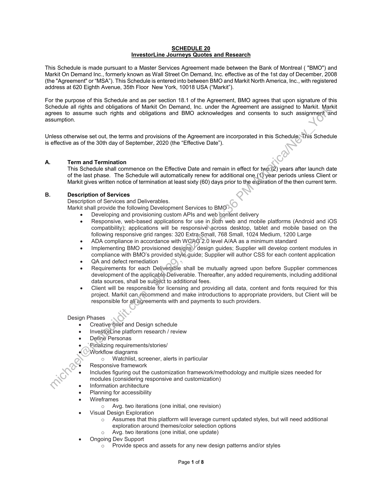
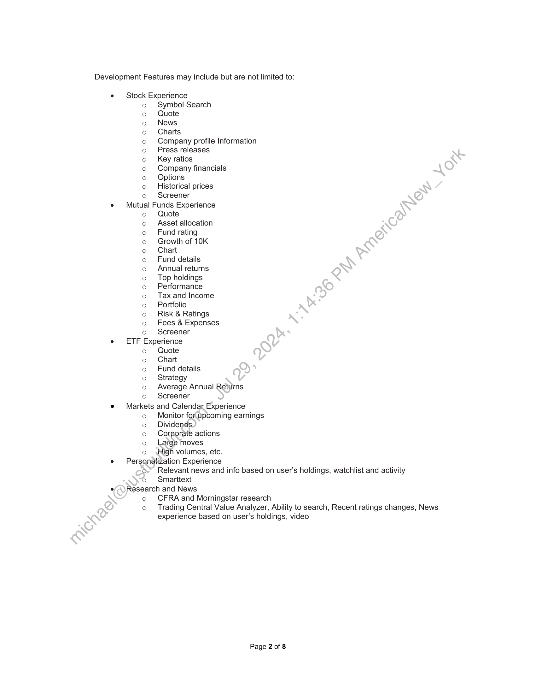
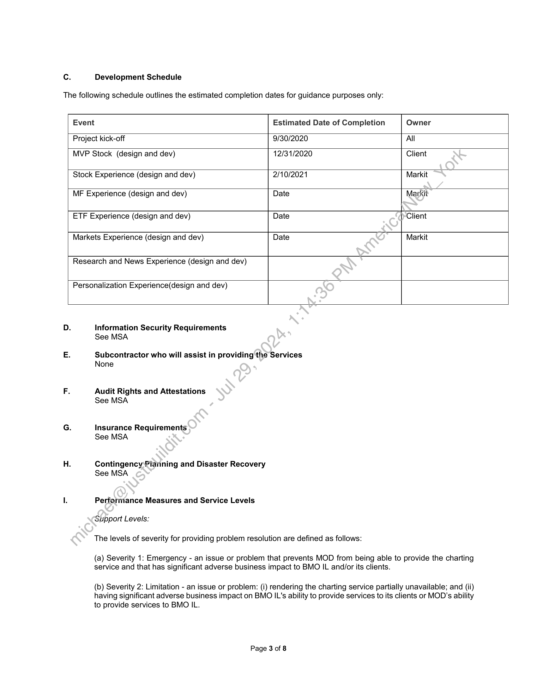
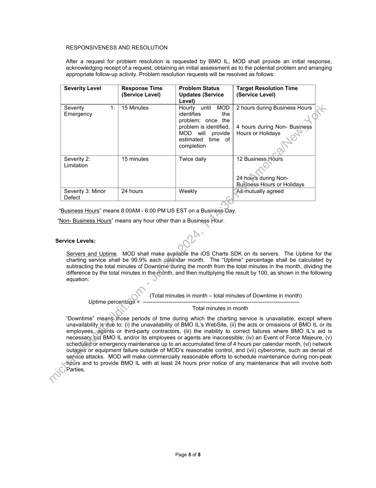
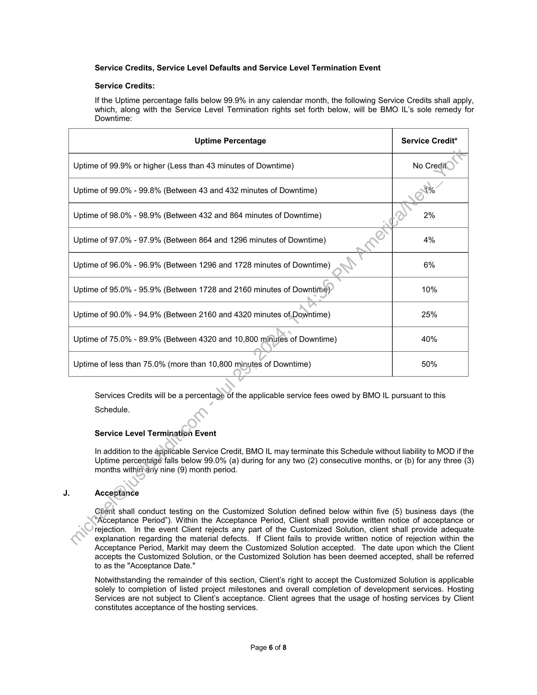
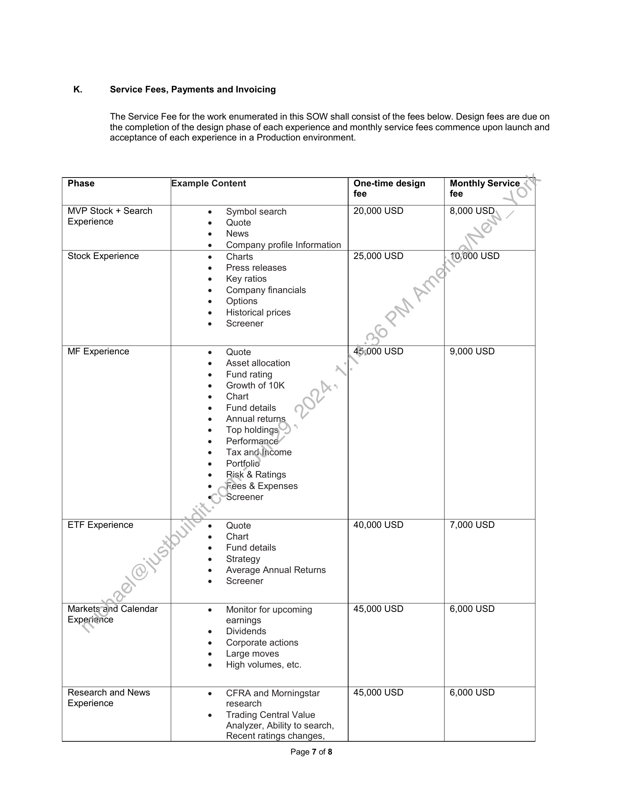
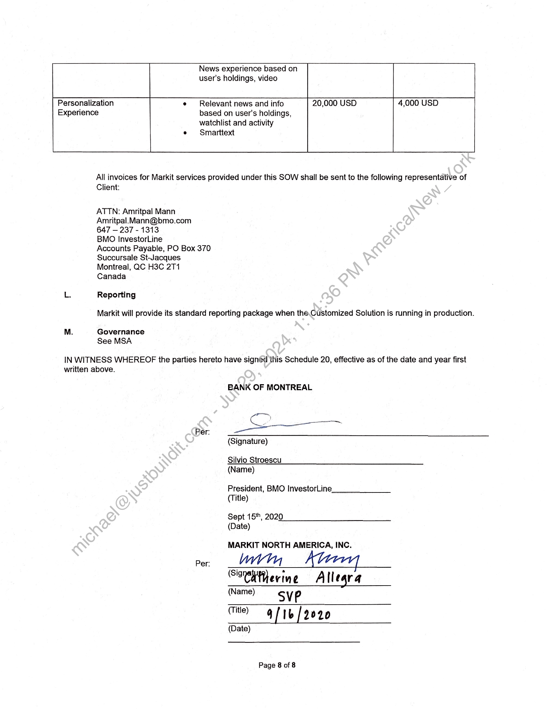

##### Schedule 20: InvestorLine Journeys Quotes and Research]

  
````col
```col-md
flexGrow=.5
===
> [!info] [Page 1](_attachments/images_BMO-3.6.1.21.100220228.pdf_212923/page_1.png)
> 
```  
```col-md
SCHEDULE 20
InvestorLine Journeys Quotes and Research  
This Schedule is made pursuant to a Master Services Agreement made between the Bank of Montreal ( "BMO") and
Markit On Demand Inc., formerly known as Wall Street On Demand, Inc. effective as of the 1st day of December, 2008
(the "Agreement" or “MSA’). This Schedule is entered into between BMO and Markit North America, Inc., with registered
address at 620 Eighth Avenue, 35th Floor New York, 10018 USA (“Markit”).  
For the purpose of this Schedule and as per section 18.1 of the Agreement, BMO agrees that upon signature of this
Schedule all rights and obligations of Markit On Demand, Inc. under the Agreement are assigned to Markit. Markit
agrees to assume such rights and obligations and BMO acknowledges and consents to such assignment and
assumption.  
Unless otherwise set out, the terms and provisions of the Agreement are incorporated in this ScheduleThis Schedule
is effective as of the 30th day of September, 2020 (the “Effective Date”).  
A. Term and Termination
This Schedule shall commence on the Effective Date and remain in effect for two<(2) years after launch date
of the last phase. The Schedule will automatically renew for additional one_(1.)\year periods unless Client or
Markit gives written notice of termination at least sixty (60) days prior to the expiration of the then current term.  
B. Description of Services
Description of Services and Deliverables.
Markit shall provide the following Development Services to BMO
e Developing and provisioning custom APIs and web content delivery
e Responsive, web-based applications for use in both web and mobile platforms (Android and iOS
compatibility); applications will be responsive\across desktop, tablet and mobile based on the
following responsive grid ranges: 320 Extra-Small, 768 Small, 1024 Medium, 1200 Large
e ADAcompliance in accordance with WGAG 2.0 level A/AA as a minimum standard
e Implementing BMO provisioned desigins)/ design guides; Supplier will develop content modules in
compliance with BMO’s provided style guide; Supplier will author CSS for each content application
e QA and defect remediation
e Requirements for each Deliverable shall be mutually agreed upon before Supplier commences
development of the applicablé.Deliverable. Thereafter, any added requirements, including additional
data sources, shall be subject to additional fees.
e Client will be responsible for licensing and providing all data, content and fonts required for this
project. Markit canywecommend and make introductions to appropriate providers, but Client will be
responsible for ali agreements with and payments to such providers.  
Design Phases
e Creative*brief and Design schedule
InvestorLine platform research / review
Definé Personas
Finalizing requirements/stories/
Workflow diagrams
o Watchlist, screener, alerts in particular
Responsive framework
e — Includes figuring out the customization framework/methodology and multiple sizes needed for
modules (considering responsive and customization)
Information architecture
Planning for accessibility
e Wireframes
o Avg. two iterations (one initial, one revision)
e Visual Design Exploration
o Assumes that this platform will leverage current updated styles, but will need additional
exploration around themes/color selection options
o Avg. two iterations (one initial, one update)
e Ongoing Dev Support
o Provide specs and assets for any new design patterns and/or styles  
Page 1 of 8  
```
````
Notes:    
````col
```col-md
flexGrow=.5
===
> [!info] [Page 2](_attachments/images_BMO-3.6.1.21.100220228.pdf_212923/page_2.png)
> 
```  
```col-md
Development Features may include but are not limited to:  
e Stock Experience
o Symbol Search
Quote
News
Charts
Company profile Information
Press releases
Key ratios
Company financials
Options
Historical prices
o Screener
e Mutual Funds Experience
o Quote
Asset allocation
Fund rating
Growth of 10K
Chart
Fund details
Annual returns
Top holdings
Performance
Tax and Income
Portfolio
Risk & Ratings
Fees & Expenses
o Screener
e ETF Experience  
oo00000000  
eoo00000000000  
o Quote  
o Chart  
o Fund details  
o Strategy  
o Average Annual Returns  
o Screener
e Markets and Calendar Experience
o Monitor for. upcoming earnings
o Dividends
o Corporate actions
o Large moves
o High volumes, etc.
e Personalization Experience
o- Relevant news and info based on user's holdings, watchlist and activity
o  =©Smarttext
e/)Research and News
o CFRA and Morningstar research
co Trading Central Value Analyzer, Ability to search, Recent ratings changes, News
experience based on user’s holdings, video  
Page 2 of 8  
```
````
Notes:    
````col
```col-md
flexGrow=.5
===
> [!info] [Page 3](_attachments/images_BMO-3.6.1.21.100220228.pdf_212923/page_3.png)
> 
```  
```col-md
Cc. Development Schedule  
The following schedule outlines the estimated completion dates for guidance purposes only:  
Event Estimated Date of Completion Owner
Project kick-off 9/30/2020 All
MVP Stock (design and dev) 12/31/2020 Client
Stock Experience (design and dev) 2/10/2021 Markit
MF Experience (design and dev) Date Markit
ETF Experience (design and dev) Date Client
Markets Experience (design and dev) Date Markit
Research and News Experience (design and dev)
Personalization Experience(design and dev)
D. Information Security Requirements
See MSA
E. Subcontractor who will assist in providing the Services
None
F. Audit Rights and Attestations
See MSA
G. Insurance Requirements
See MSA
H. Contingency:Pianning and Disaster Recovery
See MSA  
I. Performance Measures and Service Levels  
Support Levels:  
The levels of severity for providing problem resolution are defined as follows:  
(a) Severity 1: Emergency - an issue or problem that prevents MOD from being able to provide the charting
service and that has significant adverse business impact to BMO IL and/or its clients.  
(b) Severity 2: Limitation - an issue or problem: (i) rendering the charting service partially unavailable; and (ii)
having significant adverse business impact on BMO IL's ability to provide services to its clients or MOD’s ability  
to provide services to BMO IL.  
Page 3 of 8  
```
````
Notes:    
````col
```col-md
flexGrow=.5
===
> [!info] [Page 4](_attachments/images_BMO-3.6.1.21.100220228.pdf_212923/page_4.png)
> 
```  
```col-md
(c) Severity 3: Minor Defect - an issue or problem in which charting services are generally available and
functionality is not significantly affected, but in which a correction or modification is required to enable the
normal function and operation of the services.  
Page 4 of 8  
```
````
Notes:    
````col
```col-md
flexGrow=.5
===
> [!info] [Page 5](_attachments/images_BMO-3.6.1.21.100220228.pdf_212923/page_5.png)
> 
```  
```col-md
RESPONSIVENESS AND RESOLUTION  
After a request for problem resolution is requested by BMO IL, MOD shall provide an initial response,
acknowledging receipt of a request, obtaining an initial assessment as to the potential problem and arranging
appropriate follow-up activity. Problem resolution requests will be resolved as follows:  
Severity Level Response Time Problem Status Target Resolution Time
(Service Level) Updates (Service (Service Level)
Level)
Severity 1: | 15 Minutes Hourly until MOD | 2 hours during Business Hours
Emergency identifies the  
problem; once the
problem is identified, | 4 hours during Non- Business
MOD will provide | Hours or Holidays  
estimated time of  
completion
Severity 2: 15 minutes Twice daily 12 Business.Hours
Limitation
24 hours during NonBusiness Hours or Holidays
Severity 3: Minor 24 hours Weekly As*mutually agreed
Defect  
“Business Hours” means 8:00AM - 6:00 PM US EST on a Businéss:Day.  
“Non- Business Hours” means any hour other than a Business Hour.  
Service Levels:  
Servers and Uptime. MOD shall make available the iOS Charts SDK on its servers. The Uptime for the
charting service shall be 99.9% each calendar month. The “Uptime” percentage shall be calculated by
subtracting the total minutes of Downtime”during the month from the total minutes in the month, dividing the
difference by the total minutes in the:month, and then multiplying the result by 100, as shown in the following
equation:  
(Total minutes in month — total minutes of Downtime in month)
Uptime percentage = ------------------------------------------------ nn nanan nnn nnn anna nena nnn nnn
Total minutes in month  
“Downtime” means.ihose periods of time during which the charting service is unavailable, except where
unavailability isdue to: (i) the unavailability of BMO IL’s WebSite, (ii) the acts or omissions of BMO IL or its
employees, -agénts or third-party contractors, (iii) the inability to correct failures where BMO IL’s aid is
necessary but BMO IL and/or its employees or agents are inaccessible; (iv) an Event of Force Majeure, (v)
scheduled‘or emergency maintenance up to an accumulated time of 4 hours per calendar month, (vi) network
outages’or equipment failure outside of MOD’s reasonable control, and (vii) cybercrime, such as denial of
service attacks. MOD will make commercially reasonable efforts to schedule maintenance during non-peak
hours and to provide BMO IL with at least 24 hours prior notice of any maintenance that will involve both
Parties.  
Page 5 of 8  
```
````
Notes:    
````col
```col-md
flexGrow=.5
===
> [!info] [Page 6](_attachments/images_BMO-3.6.1.21.100220228.pdf_212923/page_6.png)
> 
```  
```col-md
Service Credits, Service Level Defaults and Service Level Termination Event  
Service Credits:  
If the Uptime percentage falls below 99.9% in any calendar month, the following Service Credits shall apply,
which, along with the Service Level Termination rights set forth below, will be BMO IL’s sole remedy for
Downtime:  
Uptime Percentage Service Credit*
Uptime of 99.9% or higher (Less than 43 minutes of Downtime) No Credit
Uptime of 99.0% - 99.8% (Between 43 and 432 minutes of Downtime) T%
Uptime of 98.0% - 98.9% (Between 432 and 864 minutes of Downtime) 2%
Uptime of 97.0% - 97.9% (Between 864 and 1296 minutes of Downtime) 4%
Uptime of 96.0% - 96.9% (Between 1296 and 1728 minutes of Downtime) 6%
Uptime of 95.0% - 95.9% (Between 1728 and 2160 minutes of Downtime) 10%
Uptime of 90.0% - 94.9% (Between 2160 and 4320 minutes of, Downtime) 25%
Uptime of 75.0% - 89.9% (Between 4320 and 10,800 minutes of Downtime) 40%
Uptime of less than 75.0% (more than 10,800 minutes of Downtime) 50%  
Services Credits will be a percentage of the applicable service fees owed by BMO IL pursuant to this
Schedule.  
Service Level Termination Event  
In addition to the applicable Service Credit, BMO IL may terminate this Schedule without liability to MOD if the
Uptime percentage falls below 99.0% (a) during for any two (2) consecutive months, or (b) for any three (3)
months withinany nine (9) month period.  
Acceptance  
Client shall conduct testing on the Customized Solution defined below within five (5) business days (the
“Acceptance Period”). Within the Acceptance Period, Client shall provide written notice of acceptance or
rejection. In the event Client rejects any part of the Customized Solution, client shall provide adequate
explanation regarding the material defects. If Client fails to provide written notice of rejection within the
Acceptance Period, Markit may deem the Customized Solution accepted. The date upon which the Client
accepts the Customized Solution, or the Customized Solution has been deemed accepted, shall be referred
to as the "Acceptance Date."  
Notwithstanding the remainder of this section, Client’s right to accept the Customized Solution is applicable
solely to completion of listed project milestones and overall completion of development services. Hosting
Services are not subject to Client’s acceptance. Client agrees that the usage of hosting services by Client
constitutes acceptance of the hosting services.  
Page 6 of 8  
```
````
Notes:    
````col
```col-md
flexGrow=.5
===
> [!info] [Page 7](_attachments/images_BMO-3.6.1.21.100220228.pdf_212923/page_7.png)
> 
```  
```col-md
K. Service Fees, Payments and Invoicing  
The Service Fee for the work enumerated in this SOW shall consist of the fees below. Design fees are due on
the completion of the design phase of each experience and monthly service fees commence upon launch and
acceptance of each experience in a Production environment.  
Phase Example Content One-time design Monthly Service
fee fee
MVP Stock + Search e Symbol search 20,000 USD 8,000 USD
Experience e Quote
e News
e Company profile Information
Stock Experience e = Charts 25,000 USD 10,000 USD  
e Press releases  
e Key ratios  
e Company financials
e = Options  
e — Historical prices  
e Screener  
MF Experience e Quote 45;000 USD 9,000 USD
e Asset allocation  
e Fund rating  
e Growth of 10K  
e Chart  
e Fund details  
e Annual returns  
e — Top holdings.  
e Performance  
e = Tax and.lncome
e — Portfolio  
e = Risk & Ratings  
e Fees & Expenses
e«~ Screener  
ETF Experience e Quote 40,000 USD 7,000 USD
e Chart
e Fund details
e =. Strategy  
e Average Annual Returns
e Screener  
Markets“and Calendar e — Monitor for upcoming 45,000 USD 6,000 USD
Experience earnings
e Dividends  
e Corporate actions
e Large moves
e — High volumes, etc.  
Research and News e CFRA and Morningstar 45,000 USD 6,000 USD  
Experience research  
e Trading Central Value
Analyzer, Ability to search,
Recent ratings changes,  
Page 7 of 8  
```
````
Notes:    
````col
```col-md
flexGrow=.5
===
> [!info] [Page 8](_attachments/images_BMO-3.6.1.21.100220228.pdf_212923/page_8.png)
> 
```  
```col-md
Personalization
Experience based on user's holdings,  
News experience based on
user's holdings, video  
ry ———T 2. AAA TICA.|UU! UF! UL
e Relevant news and info 20,000 USD 4,000 USD  
watchlist and activity
e  Smarttext  
M.  
All invoices for Markit services provided under this SOW shall be sent to the following representative of
Client:  
ATTN: Amritpal Mann
Amritpal.Mann@bmo.com  
647 — 237 - 1313  
BMO InvestorLine  
Accounts Payable, PO Box 370
Succursale St-Jacques
Montreal, QC H3C 2T1  
Canada  
Reporting
Markit will provide its standard reporting package when the.Customized Solution is running in production.  
Governance
See MSA  
IN WITNESS WHEREOF the parties hereto have signed this Schedule 20, effective as of the date and year first
written above.  
BANK OF MONTREAL  
Co.
Per: cate  
(Signature)  
Silvio Stroescu
(Name)  
President, BMO InvestorLine.
(Title)  
Sept 15", 2020
(Date)  
MARKIT NORTH AMERICA, INC.  
Per: wry
Sirgtherime A Ilegra  
(Name) sve
(Date)  
Page 8 of 8  
```
````
Notes:  


![[_attachments/BMO-3.6.1.21.1 00220228.pdf]