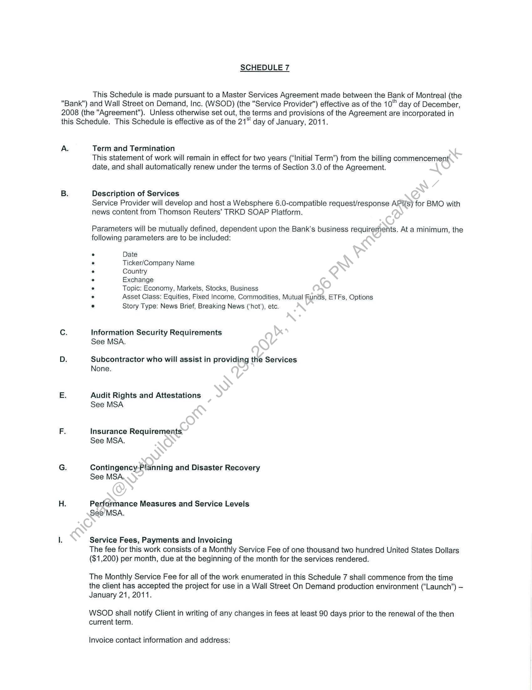
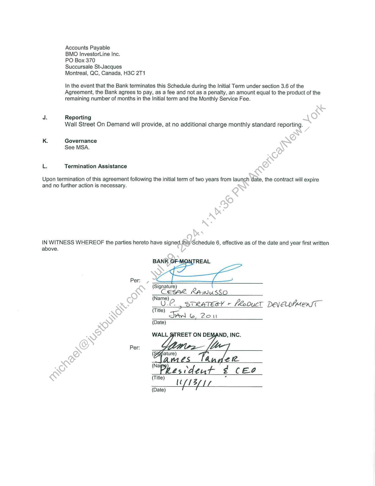

##### Schedule 7 - Statement of Work for Thomson Reuters TRKD SOAP Platform Integration]

  
````col
```col-md
flexGrow=.5
===
> [!info] [Page 1](_attachments/images_BMO-3.6.1.21.1000221868.pdf_210849/page_1.png)
> 
```  
```col-md
SCHEDULE 7  
This Schedule is made pursuant to a Master Services Agreement made between the Bank of Montreal (the  
"Bank") and Wall Street on Demand, Inc. (WSOD) (the "Service Provider") effective as of the 10" day of December,
2008 (the "Agreement"). Unless otherwise set out, the terms and provisions of the Agreement are incorporated in
this Schedule. This Schedule is effective as of the 21* day of January, 2011.  
A.  
Term and Termination
This statement of work will remain in effect for two years (‘Initial Term”) from the billing commencement
date, and shall automatically renew under the terms of Section 3.0 of the Agreement.  
Description of Services
Service Provider will develop and host a Websphere 6.0-compatible request/response API(s) for BMO with
news content from Thomson Reuters’ TRKD SOAP Platform.  
Parameters will be mutually defined, dependent upon the Bank’s business requirements. At a minimum, the
following parameters are to be included:  
Date  
Ticker/Company Name  
Country  
Exchange  
Topic: Economy, Markets, Stocks, Business  
Asset Class: Equities, Fixed Income, Commodities, Mutual Funds, ETFs, Options
Story Type: News Brief, Breaking News (‘hot’), etc.  
Information Security Requirements
See MSA.  
Subcontractor who will assist in providing the Services
None.  
Audit Rights and Attestations
See MSA  
Insurance Requirements
See MSA.  
Contingency-Planning and Disaster Recovery
See MSA.  
Performance Measures and Service Levels
See MSA.  
Service Fees, Payments and Invoicing
The fee for this work consists of a Monthly Service Fee of one thousand two hundred United States Dollars
($1,200) per month, due at the beginning of the month for the services rendered.  
The Monthly Service Fee for all of the work enumerated in this Schedule 7 shall commence from the time
the client has accepted the project for use in a Wall Street On Demand production environment (“Launch”) —
January 21, 2011.  
WSOD shall notify Client in writing of any changes in fees at least 90 days prior to the renewal of the then
current term.  
Invoice contact information and address:  
```
````
Notes:    
````col
```col-md
flexGrow=.5
===
> [!info] [Page 2](_attachments/images_BMO-3.6.1.21.1000221868.pdf_210849/page_2.png)
> 
```  
```col-md
Accounts Payable  
BMO InvestorLine Inc.  
PO Box 370  
Succursale St-Jacques
Montreal, QC, Canada, H3C 2T1  
In the event that the Bank terminates this Schedule during the Initial Term under section 3.6 of the
Agreement, the Bank agrees to pay, as a fee and not as a penalty, an amount equal to the product of the
remaining number of months in the Initial term and the Monthly Service Fee.  
J. Reporting
Wall Street On Demand will provide, at no additional charge monthly standard reporting.  
K. Governance
See MSA.
Le Termination Assistance  
Upon termination of this agreement following the initial term of two years from launch date, the contract will expire
and no further action is necessary.  
IN WITNESS WHEREOF the parties hereto have signed.this ‘Schedule 6, effective as of the date and year first written
above.  
Per:
(Signature)
CEesse Rawusso
(Name)
U-C_, sneatesy + fouct DeyeoymenT
(Title)
Tan 6, Zou
(Date)
WALL STREET ON DEMAND, INC.
Per:
S ele
(Na
Peesdent ¢ Ceo
(Titley 4  
3
(Date) ft fLL  
```
````
Notes:  


![[_attachments/BMO-3.6.1.21.10 00221868.pdf]