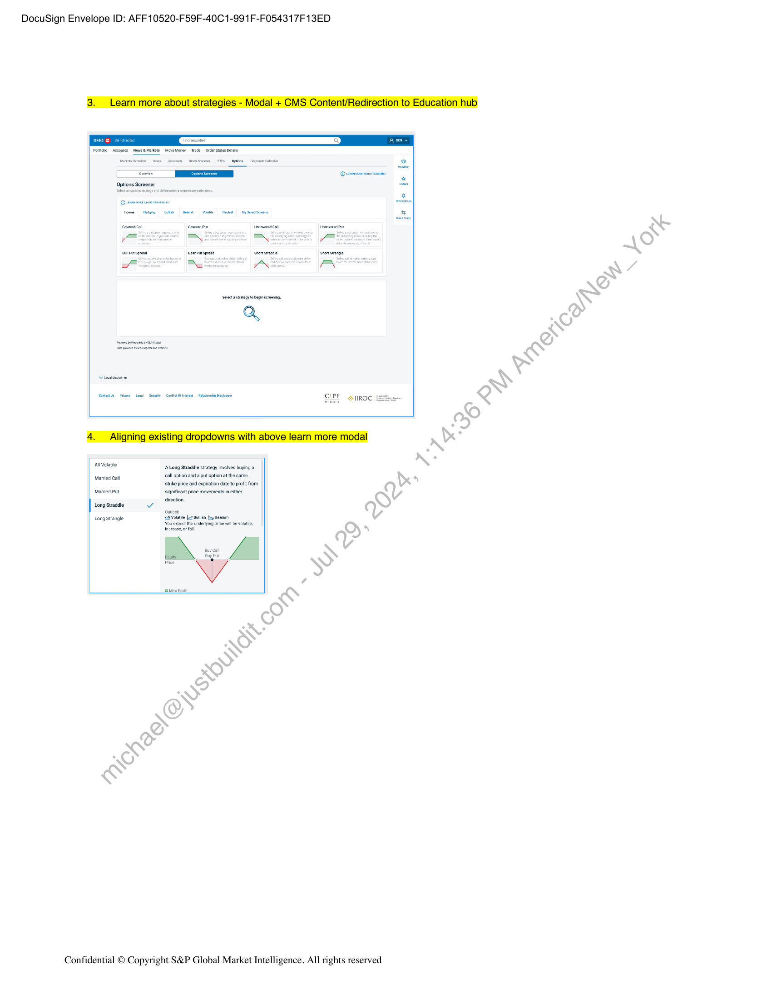

##### Schedule #30: Fincentric FTEs for BMO InvestorLine Retail Options Phase 2 Enhancements]

  
````col
```col-md
flexGrow=.5
===
> [!info] [Page 1](_attachments/images_BMO-3.6.1.21.1100220238.pdf_212617/page_1.png)
> 
```  
```col-md
DocuSign Envelope ID: AFF10520-F59F-40C1-991F-F054317F13ED  
S&P Global  
Market Intelligence  
SCHEDULE #30:  
Fincentric FTEs for BMO InvestorLine retail options  
phase 2 enhancements  
This Schedule (“Schedule”) is entered into between Markit On
Demand, Inc. (“S&P”) and the Bank of Montreal (“Customer’,  
“BMO”)  
pursuant to, and incorporating by reference all terms and  
conditions of the Master Agreement between Markit On Demand,
Inc. and Customer dated December 1, 2008 (the “Agreement’).
References to “MOD” /“Markit” / “IHS Markit” / “Fincentric” and
“Subscriber’/“Client” (as the case may be in the Agreement) shall
be read, for the purpose of this Schedule, to mean “S&P” and
“Customer” as defined herein.  
This Schedule constitutes a separate agreement between S&P and
Customer for the services described herein. The parties agree that
this Schedule and the services provided hereunder are subject to
the terms and conditions of the Agreement, incorporated into this
Schedule by reference. In case of inconsistency between the terms
of the Agreement and the terms of this Schedule, the terms of this
Schedule shall prevail. All capitalized terms used but not defined in
this Schedule shall have the meanings given to such terms in the  
Agreement.  
This Schedule commences on March 1, 2024 (“Effective Date”)  
1 Project Description  
Customized Solution  
S&P will support the BMO InvestorLine 2.0 platform through
enhancements to Phase 2 of Schedule #28 displayed in Appendix
A (the “Customized Solution”) where applicable.  
The Customized Solution shall include the seventeen (17) items
listed below to be guided by BMO-approved designs where
applicable, as illustrated in Appendix B.  
S&P will provide personnel equivalent to three fourths (0:75) of a
full-time employee (each an “FTE”) for eleven (8) months to'work on
the Customized Solution (3/1/2024 to 10/31/2024). For clarity, this
is a total of 6 FTE months.  
A. New requests  
1.  
oe PN DA  
10.  
11.  
Learn More CMS for each Options Category in
Filters section  
Learn More for each Stocks/ETF categories in
Filters section  
Learn more about strategies - Modal + CMS
Content/Redirection to Education hub  
Alignirig existing dropdowns with above learn more
modal  
View Chart from Screener results  
View Options Chain from Screener results  
View News from Screener results  
Strategy Descriptions on click in Screener results
Heat Map/Color coding results  
Strategy descriptive section above Filters with
dynamic info icons and tool tips  
Enable BMO Pilot release to limited users  
Confidential © Copyright S&P Global Market Intelligence. All rights reserved  
12. Display message for CA symbols that users cannot
trade multi legs for CA symbols.  
13. Scope out 2 strategies from Phase 2 Covered
Put/Married Call. Enable feature flags to hide these  
Change requests
14. Minor translation updates to strategy dropdown  
15. Open interest chart-Implement Minimum bubble size
for accessibility concern  
16. Open interest chart enhancement to allow updating
based on strike price  
17. Strategy Builder - tool tips, design update for
Accessibility concern  
Assumptions  
The items are to be delivered in time for the expected
completion date of-Phase 2 of Schedule #28 which is
June of 2024 at thestime this Schedule is drafted.  
Customized Solution will be in French and English with
translations provided by BMO.  
Responsive mobile  
breakpoints  
experience scaled down to  
Customized Solution is limited to those portions of the BIL
2.0 platform that are hosted or supported by S&P.  
All items are for delivery into SD (Self-Directed).  
Prioritization order of items can be guided by BMO with
advanced notice and subject to readiness of design, data
and development dependencies.  
S&P will implement Customer's specifications that
Customer believes are compliant with WCAG 2.0 level
A/AA as a minimum standard. S&P does not warrant or
assert that Customer's specifications will be compliant
with the guidelines.  
At BMO’s discretion and with agreement from S&P, FTEs
can increase monthly FTE allotment upto a maximum of
2 FTEs total per month provided that the total FTE months
provided by S&P does not surpass 6 FTEs for the term of
this Schedule.  
Per-item assumptions
° Items 4,5,6,7,8  
= These are dependent on future
development of existing
requirements from Schedule
#28.  
o Items  
. Charting constitutes leveraging
of the existing components and
thus no custom changes to the
charting toolset will be required.  
® Mobile  
o Item7
® Recent news constitutes
leveraging of the existing
components and thus no
custom changes to the  
```
````
Notes:    
````col
```col-md
flexGrow=.5
===
> [!info] [Page 2](_attachments/images_BMO-3.6.1.21.1100220238.pdf_212617/page_2.png)
> 
```  
```col-md
DocuSign Envelope ID: AFF10520-F59F-40C1-991F-F054317F13ED  
charting toolset will be
required.
o Item 12
= This will be a simple message
displayed on the page from
translations provided by BMO.
o Item 16Data is available through
existing integrations. If not,
Fincentric will not be able to
execute this change request.
o Item 17Update is for existing Phase 2
features only and existing
production features don't need
update. Also updated designs
to get approved by BMO by
Feb 15, 2024, after which
delay will add to scope that is
not included in this Schedule.  
e Out of scope
o Data mapping
o OptionsPlay data  
o For any item, no new feature requests or
design updates beyond minor design
updates that may be required to handle
select edge cases.  
o New data sources  
Browser Support  
S&P will provide support for the Customized Solution in the following
browsers. S&P will use reasonable efforts to support the most
recent browser versions after they become available. Legacy
versions will be retired in due course.  
Windows Edge
Windows/Mac Firefox
Mac Safari
Windows/Mac Chrome.  
11 Operation Systemand Hardware Support  
S&P will provide support for the Customized Solution in the following
mobile operating systems and hardware platforms:  
«  Apple-iQS 9.0 and greater
e — Google Android 6.x (Marshmallow) and greater  
S&P will use reasonable efforts to support the most recent operating
system version for both Apple iOS and Google Android after they
become available. Support for legacy versions (typically 2 major
(e.g. 1.x vs 2.x) versions back from current) will be retired over time.  
For S&P QA, the Customized Solution will be optimized for the
following hardware devices:  
e Apple iPad 2 and greater  
Confidential © Copyright S&P Global Market Intelligence. All rights reserved  
e — Any Android device running Marshmallow (6.0) or greater  
The version and hardware support may be reviewed and adjusted if
mutually agreed upon by the parties.  
2 Redundancy  
The Customized Solution will be operational in all of S&P managed
data centers.  
3 Reporting  
S&P will provide its standard reporting package. when the
Customized Solution is running in production.  
4 Content  
Customer will be responsible for licensing>arid providing all data,
content and fonts required for this project.S&P can recommend and
make introductions to appropriate providers, but Customer will be
responsible for all agreements with-and payments to such providers.  
5 Term  
The term of this Scheduieis set out in Section 1.1 above (“Initial
Term’).  
6 Service Fee  
The Service.Fee for the work enumerated in this Schedule is USD
$22,500,per FTE per month, starting on March 1, 2024. In the event
Customer requests and S&P agrees in writing to the increase the
number of total FTEs during the term of this Schedule, the Service
Fee per month will increase accordingly.  
For clarity, the Customer will be invoiced monthly a fixed fee of
$16,875 USD over the period of the term.  
Customer shall pay S&P for any reimbursable expenses incurred by
S&P that have been agreed to in advance between the parties within
thirty (30) days of the date of the relevant invoice from S&P.  
7 Representations and Warranties  
Each party represents and warrants that: (i) when executed and
delivered, this Schedule shall constitute the legal, valid and binding
obligation of such party, enforceable against it pursuant to its terms;
(ii) it shall comply with all applicable federal and state laws,
regulations and statutes in the performance of its obligations
hereunder; (iii) it has full power and authority to enter into and
perform its obligations under this Schedule; (iv) it has obtained all
necessary corporate approvals to enter into and execute this
Schedule; and (v) its performance under this Schedule does not and
shall not conflict with any other material agreement or obligation to
which it is a party or by which it is bound.  
8 Data Protection  
Customer represents and warrants to S&P that those individuals or
entities for which they provide Personal Data to S&P have
consented to the processing and transfer of their Personal Data as
contemplated by this Schedule, including but not limited to
individuals authorized to access the Services on its behalf
(‘Designated Users”). This information may include personal data
such as but not limited to names, titles and work contact information,
(‘Personal Data’).  
Each party agrees that it shall comply with all applicable data
privacy laws including implementing appropriate technical and  
```
````
Notes:    
````col
```col-md
flexGrow=.5
===
> [!info] [Page 3](_attachments/images_BMO-3.6.1.21.1100220238.pdf_212617/page_3.png)
> 
```  
```col-md
DocuSign Envelope ID: AFF10520-F59F-40C1-991F-F054317F13ED  
organisational measures against the unauthorised or unlawful
processing of Personal Data and against the accidental loss or
destruction of, or damage to, Personal Data. S&P will handle all
Personal Data in accordance with S&P’s Privacy Policy which can
be found at https://insmarkit.com/legal/privacy-policy.html. In order
to provide the Services S&P may use, collect, store, disclose and
process the Personal Data and transfer the Personal Data inside of,
and outside of, the United States and the European Economic Area.  
9 Change Management  
S&P reserves the right, in its sole discretion, to make changes and
enhancements to the equipment and software used to provide the
services from time to time to maintain operations and as required
for problem management and/or system security. S&P will use
commercially reasonable efforts to implement changes during nonpeak hours, except for changes required for emergency purposes,
which may be made at any time. To the extent reasonable and
commercially practicable, Customer will be notified in advance of
any expected outages.  
10 ‘Invoices  
All invoices for S&P services provided under this Schedule shall be
sent to the following representative(s) of Customer:  
ATTN: Mohamed Lamine Khezihi
mohamedlamine.khezihi@bmo.com
416-951-2735  
BMO InvestorLine  
Accounts Payable, PO Box 370
Succursale St-Jaques
Montreal, QC H3C 2T1
Canada  
Confidential © Copyright S&P Global Market Intelligence. All rights reserved  
```
````
Notes:    
````col
```col-md
flexGrow=.5
===
> [!info] [Page 4](_attachments/images_BMO-3.6.1.21.1100220238.pdf_212617/page_4.png)
> 
```  
```col-md
DocuSign Envelope ID: AFF10520-F59F-40C1-991F-F054317F13ED  
Renee Spampinato  
ACCEPTED ACCEPTED
MARKIT ON DEMAND, INC. BANK OF MONTREAL
SIGNATURE ; SIGNATURE
DocuSigned by: DocuSigned by:
Kure Spompinato Andrea Casciato
‘CEE17D9CD69A42A 49020759201F4DC
PRINT NAME PRINT NAME  
Andrea Casciato  
TITLE  
Head of Fincentric  
TITLE  
Head of Digital Investing BMO InvestorLine.  
DATE OF SIGNATURE
2/23/2024  
DATE OF SIGNATURE
2/23/2024  
To be completed by the Customer:  
Au  
rized Customer Signatory  
Name: Mohamed Lamine Khezihi  
Title: Senior Investment Product Manager  
Emailmohamedlamine.khezihi@bmo.com  
Phone:  
City: Toronto, ON  
Note: Information necessary for S&P's contract compliance ‘and due diligence purposes  
Appendix Afollows immediately on the next page.  
Confidential © Copyright S&P Global Market Intelligence. All rights reserved  
```
````
Notes:    
````col
```col-md
flexGrow=.5
===
> [!info] [Page 5](_attachments/images_BMO-3.6.1.21.1100220238.pdf_212617/page_5.png)
> 
```  
```col-md
DocuSign Envelope ID: AFF10520-F59F-40C1-991F-F054317F13ED  
A. Phase 1
a.  
epaos  
B. Phase2  
Po  
a9  
Appendix A: Phase 2 of Schedule #28 (Modernized Options Investing for InvestorLine 2.0)  
Options tab modernized experience
i. Tab sections: Learn about options; Options chain
ii. User experience customization
Option chain UI (for calls and/or puts)
Quote bar: SmartText (inspectable, plain-speak technology) to summarize instruments’ data points
Learn about options
Analyzer tool  
Updates to October milestone items  
i. Options tab additional sections: Explore scenarios; Discover; Options market overview  
ii. Additional user experience customization parameters for Options tab  
iii. Option chain UI added for Vertical spreads, horizontal spreads, straddles, long/short strangle  
iv. Quote bar: graphic of historical/contextualized _IV (implied volatility)  
v. Analyzer tool visualizations for the following: profit & loss; open interest; IV; volatility skew
Explore scenarios (My outlook / Strategy builder): explore and research options strategies\by user thesis
Discover: generate investing ideas by strategy or themes
Option market overview: generate investing ideas by discovery of most active options-on the market  
Confidential © Copyright S&P Global Market Intelligence. All rights reserved  
```
````
Notes:    
````col
```col-md
flexGrow=.5
===
> [!info] [Page 6](_attachments/images_BMO-3.6.1.21.1100220238.pdf_212617/page_6.png)
> 
```  
```col-md
DocuSign Envelope ID: AFF10520-F59F-40C1-991F-F054317F13ED  
Appendix B: Details for items A through J of the Customized Solution  
The below screenshots per item are in nature intended as demonstrative of designs that have been signed off on by BMO at the time of drafting
the Schedule and, for any given item, constitute neither an exhaustive representation nor a development asset.  
A Filters + 6 appli  
A. Option Fitters
Time  
Lguiaty  
Option rise  
sire Price  
Risk Return
Implied Volt  
A\ Stock Filters  
/ Option Volume Today  
Greater than Less than  
to [inputnumder |  
Input Number  
Previous Day Option Volume  
Greater than  
Less than
Input Number to [Input Numba  
Open Interest  
Grenter than Less than  
@ tem nore  
Liquidity
Liquidity in options trading refers tothe ease with which a particular  
options contract ean be bought or sod in the market vithout
causing a significant impact onits price.  
Learnore >  
A Fitters + 6 soplie
A. Option Filters
Time  
Liquidity  
Option Price  
Strike Price
Risk / Return  
Implied Volatility  
A Stock Filters  
/ Oplion Volume Today  
Greater than Less than  
v
Input Numbe ta | input Number
Previous Day Option Volume
Greater than Less than
Input Numbe to [Input Number
pen Interest
Greater than Lesa than  
© teainwoge  
Liquidity  
Liguidity in options trading Yefbrso the ease with which a particular
‘options contract can bie botigtior sold inthe market without
causing » signitidant}mplet on its pice  
LeaRwMoRe >  
Confidential © Copyright S&P Global Market Intelligence. All rights reserved  
```
````
Notes:    
````col
```col-md
flexGrow=.5
===
> [!info] [Page 7](_attachments/images_BMO-3.6.1.21.1100220238.pdf_212617/page_7.png)
> 
```  
```col-md
DocuSign Envelope ID: AFF10520-F59F-40C1-991F-F054317F13ED  
ae x x P  
Sect satay tba seeing.  
CIPE es ROC  
allvolatle ‘Long Stradale strategy involves buying a  
Movied Cat call option anda put option atthe same
strike price and expiration date to profit from  
Maried Put significant price movements in ether
diecton  
Long Sale v  
Long Svangle ‘Vola L2 push by Sean
“ou expect he undering rin wal bela,
increase, orf  
VY  
ottoxPrott  
Confidential © Copyright S&P Global Market Intelligence. All rights reserved  
```
````
Notes:    
````col
```col-md
flexGrow=.5
===
> [!info] [Page 8](_attachments/images_BMO-3.6.1.21.1100220238.pdf_212617/page_8.png)
> 
```  
```col-md
DocuSign Envelope ID: AFF10520-F59F-40C1-991F-F054317F13ED  
AMCIUS sew ore, 40 ENTERTAINMENT HOLDRGSINE A)
196.32 +268 2.44%)  
‘More Options Options Chan Reeort Mews chart
(Chart for AMC-US  
10 50 MOM YTD WY SY TOF MAX iv Y Indelors Bevems Compare  
Volume = Open= close = Hig = tow =  
AMC:US NewYork) AMIC ENTERTAINMENT HOLDINGS INC (A) \
155.32 +3.68 (12.44%)  
ute -Lastiade 200PMNST C  
‘More Options Options Chain Recent News Chart,  
AMC:US Options Expiring on Jun 02, 2023
Strikes Near  
© seected sue CO) curent Price  
calls . Puts
Bist Biase Aske  
615  
rT
12:50  
13,00
Near 13.50  
1350
14.00  
1450  
View FULL OPTIONS CHAIN  
Confidential © Copyright S&P Global Market Intelligence. All rights reserved  
```
````
Notes:    
````col
```col-md
flexGrow=.5
===
> [!info] [Page 9](_attachments/images_BMO-3.6.1.21.1100220238.pdf_212617/page_9.png)
> 
```  
```col-md
DocuSign Envelope ID: AFF10520-F59F-40C1-991F-F054317F13ED  
AMCLUS sen vone ANIC ENTERTAINMENT HOLOINGS NC)
155,32 +3.68(42.44%)
‘cuency 0 USD=Lai wade 200M MST CD  
More Options Options Chan ResentNews chart  
Recent News for AMC:US  
18 ey Loners AMC Entrtanmert Holdings P4012 From S15, Notes Nos Term Domestic nity Box tie
Cones Keeps Netra Rating  
Chama Sweets  
AMC Enetacmant Enters Exchange Agee  
“The Mat: ven HO 202824 sason canine wih vo anmizion of Vrs Naboo on Sato Januar 6
provente by Fathom Everts  
‘AMC Enertainment Hong ne. Sucessuly Competes 880 Mien At-The Moret Equity feng end Reduces Debt
by $62 lion, Bolstring iui andtengthering the Blane Sheet  
Options Screener  
Slectanopon tsegy and defn cetera o generate de ess © searvore;  
Income Hosiing _Bullsh earch Voltlo Nuts My Savod Sreone  
Covered Put Uncovered call  
Covered Call  
Bear Put Spread Short Stradale  
Selecta Covered Call heme  
ERIE wv esrnisese con
=p Bul /Nei Unto Uni  
covered Call  
ingeit Suspendisse st amet ites et Note offi AEQUaM eat oor peti eu aust, phate ae ougue Ener pots
bet lca asend ea  
‘Covered cal svateey Ineves sling  
‘callontion aginst a fong stock  
postentogenetteRcome end EE geawegse
ES Uneing Limit tomy holdings a  
Confidential © Copyright S&P Global Market Intelligence. All rights reserved  
```
````
Notes:    
````col
```col-md
flexGrow=.5
===
> [!info] [Page 10](_attachments/images_BMO-3.6.1.21.1100220238.pdf_212617/page_10.png)
> 
```  
```col-md
DocuSign Envelope ID: AFF10520-F59F-40C1-991F-F054317F13ED  
nee int ee cote sa) GIF otnoe Ss  
Confidential © Copyright S&P Global Market Intelligence. All rights reserved  
```
````
Notes:  


![[_attachments/BMO-3.6.1.21.11 00220238.pdf]