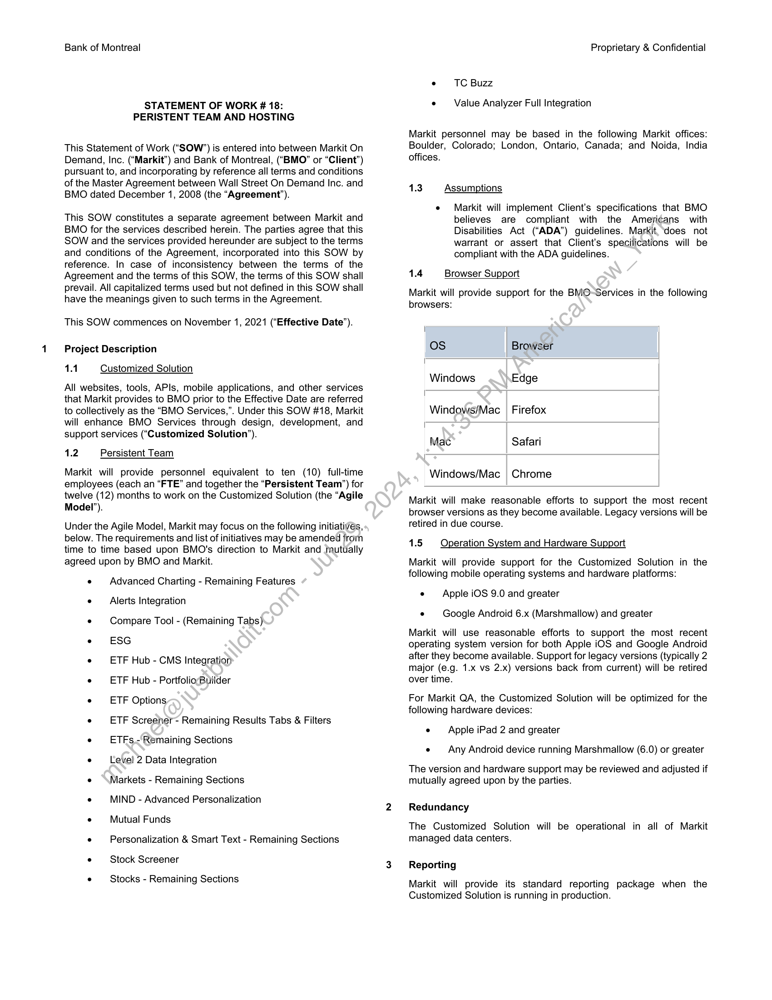
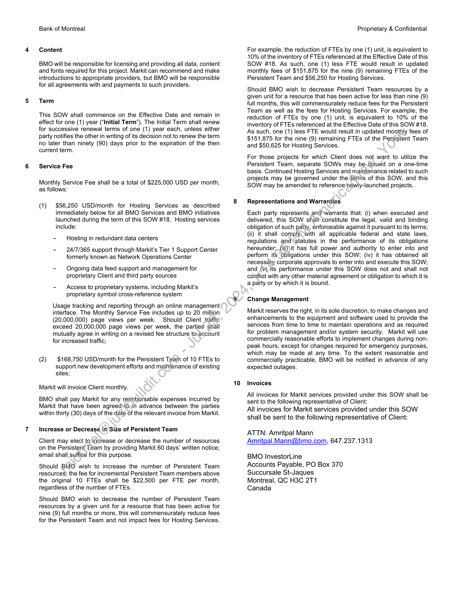
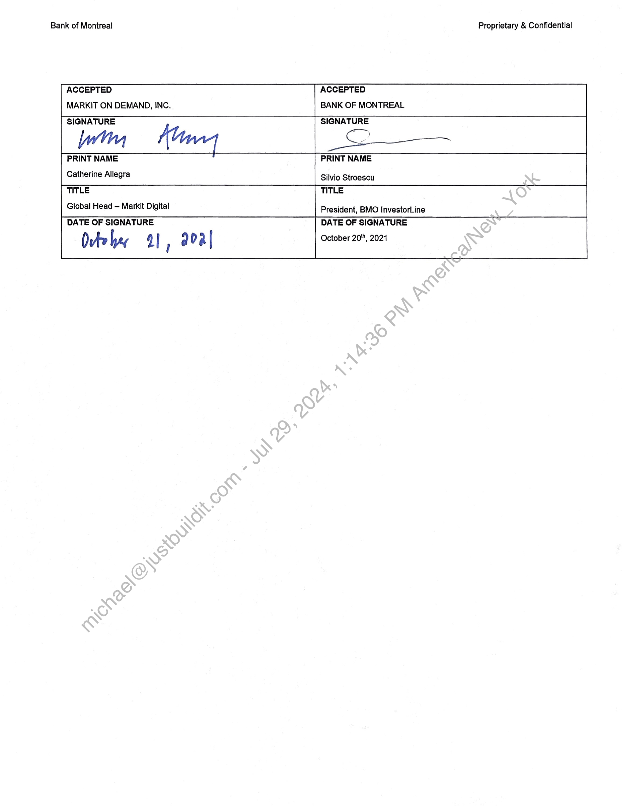

##### Statement of Work # 18: Persistent Team and Hosting]

  
````col
```col-md
flexGrow=.5
===
> [!info] [Page 1](_attachments/images_BMO-3.6.1.21.1200221924.pdf_212636/page_1.png)
> 
```  
```col-md
Bank of Montreal  
STATEMENT OF WORK 18:
PERISTENT TEAM AND HOSTING  
This Statement of Work (“SOW”) is entered into between Markit On
Demand, Inc. (“Markit”) and Bank of Montreal, (“BMO” or “Client”)
pursuant to, and incorporating by reference all terms and conditions
of the Master Agreement between Wall Street On Demand Inc. and
BMO dated December 1, 2008 (the “Agreement’).  
This SOW constitutes a separate agreement between Markit and
BMO for the services described herein. The parties agree that this
SOW and the services provided hereunder are subject to the terms
and conditions of the Agreement, incorporated into this SOW by
reference. In case of inconsistency between the terms of the
Agreement and the terms of this SOW, the terms of this SOW shall
prevail. All capitalized terms used but not defined in this SOW shall
have the meanings given to such terms in the Agreement.  
This SOW commences on November 1, 2021 (‘Effective Date”).  
Project Description
11 Customized Solution  
All websites, tools, APIs, mobile applications, and other services
that Markit provides to BMO prior to the Effective Date are referred
to collectively as the “BMO Services,”. Under this SOW #18, Markit
will enhance BMO Services through design, development, and
support services (“Customized Solution’).  
1.2 Persistent Team  
Markit will provide personnel equivalent to ten (10) full-time
employees (each an “FTE” and together the “Persistent Team’) for
twelve (12) months to work on the Customized Solution (the “Agile
Model’).  
Under the Agile Model, Markit may focus on the following initiatives,
below. The requirements and list of initiatives may be amended from
time to time based upon BMO's direction to Markit and mutually
agreed upon by BMO and Markit.  
e — Advanced Charting - Remaining Features  
e — Alerts Integration  
e Compare Tool - (Remaining Tabs)  
. ESG  
. ETF Hub - CMS Integration  
. ETF Hub - PortfoliocBuilder  
. ETF Options,  
. ETF Screener- Remaining Results Tabs & FiltersETFs.- Remaining Sections  
. Level 2 Data Integration  
. Markets - Remaining Sections  
. MIND - Advanced Personalization  
. Mutual Funds  
. Personalization & Smart Text - Remaining Sections
e« Stock Screener  
e — Stocks - Remaining Sections  
Proprietary & Confidential  
e TC Buzz  
e — Value Analyzer Full Integration  
Markit personnel may be based in the following Markit offices:
Boulder, Colorado; London, Ontario, Canada; and Noida, India
offices.  
1.3 Assumptions  
e  =Markit will implement Client’s specifications that BMO
believes are compliant with the Americans with
Disabilities Act (“ADA”) guidelines. Markit, ‘does not
warrant or assert that Client’s specifications will be
compliant with the ADA guidelines.  
1.4 Browser Support  
Markit will provide support for the BMO~-Services in the following
browsers:  
Os Browser  
Windows Edge  
Windows/Mac | Firefox  
Mac Safari  
Windows/Mac | Chrome  
Markit will make reasonable efforts to support the most recent
browser versions as they become available. Legacy versions will be
retired in due course.  
1.5 Operation System and Hardware Support  
Markit will provide support for the Customized Solution in the
following mobile operating systems and hardware platforms:  
. Apple iOS 9.0 and greater
e — Google Android 6.x (Marshmallow) and greater  
Markit will use reasonable efforts to support the most recent
operating system version for both Apple iOS and Google Android
after they become available. Support for legacy versions (typically 2
major (e.g. 1.x vs 2.x) versions back from current) will be retired
over time.  
For Markit QA, the Customized Solution will be optimized for the
following hardware devices:  
. Apple iPad 2 and greater  
e — Any Android device running Marshmallow (6.0) or greater
The version and hardware support may be reviewed and adjusted if
mutually agreed upon by the parties.
Redundancy
The Customized Solution will be operational in all of Markit
managed data centers.
Reporting  
Markit will provide its standard reporting package when the
Customized Solution is running in production.  
```
````
Notes:    
````col
```col-md
flexGrow=.5
===
> [!info] [Page 2](_attachments/images_BMO-3.6.1.21.1200221924.pdf_212636/page_2.png)
> 
```  
```col-md
Bank of Montreal  
Content  
BMO will be responsible for licensing and providing all data, content
and fonts required for this project. Markit can recommend and make
introductions to appropriate providers, but BMO will be responsible
for all agreements with and payments to such providers.  
Term  
This SOW shall commence on the Effective Date and remain in
effect for one (1) year (“Initial Term’). The Initial Term shall renew
for successive renewal terms of one (1) year each, unless either
party notifies the other in writing of its decision not to renew the term
no later than ninety (90) days prior to the expiration of the then
current term.  
Service Fee  
Monthly Service Fee shall be a total of $225,000 USD per month,
as follows:  
(1) $56,250 USD/month for Hosting Services as described
immediately below for all BMO Services and BMO initiatives
launched during the term of this SOW #18. Hosting services
include:  
- Hosting in redundant data centers  
-  24/7/365 support through Markit’s Tier 1 Support Center
formerly known as Network Operations Center  
- Ongoing data feed support and management for
proprietary Client and third party sources  
- Access to proprietary systems, including Markit’s
proprietary symbol cross-reference system  
Usage tracking and reporting through an online management
interface. The Monthly Service Fee includes up to 20 million
(20,000,000) page views per week. Should Client traffic
exceed 20,000,000 page views per week, the parties shall
mutually agree in writing on a revised fee structure to.account
for increased traffic;  
(2) $168,750 USD/month for the Persistent Team of 10 FTEs to
support new development efforts and maifitenance of existing
sites;  
Markit will invoice Client monthly.  
BMO shall pay Markit for any reimbursable expenses incurred by
Markit that have been agreed*to.in advance between the parties
within thirty (30) days of the date of the relevant invoice from Markit.  
Increase or Decrease in Size of Persistent Team  
Client may elect to increase or decrease the number of resources
on the Persistent Team by providing Markit 60 days’ written notice;
email shall suffice for this purpose.  
Should BMO wish to increase the number of Persistent Team
resources; the fee for incremental Persistent Team members above
the original 10 FTEs shall be $22,500 per FTE per month,
regardless of the number of FTEs.  
Should BMO wish to decrease the number of Persistent Team
resources by a given unit for a resource that has been active for
nine (9) full months or more, this will commensurately reduce fees
for the Persistent Team and not impact fees for Hosting Services.  
10  
Proprietary & Confidential  
For example, the reduction of FTEs by one (1) unit, is equivalent to
10% of the inventory of FTEs referenced at the Effective Date of this
SOW #18. As such, one (1) less FTE would result in updated
monthly fees of $151,875 for the nine (9) remaining FTEs of the
Persistent Team and $56,250 for Hosting Services.  
Should BMO wish to decrease Persistent Team resources by a
given unit for a resource that has been active for less than nine (9)
full months, this will commensurately reduce fees for the Persistent
Team as well as the fees for Hosting Services. For example, the
reduction of FTEs by one (1) unit, is equivalent to 10% of the
inventory of FTEs referenced at the Effective Date of this SOW #18.
As such, one (1) less FTE would result in updated monthly fees of
$151,875 for the nine (9) remaining FTEs of the Persistent Team
and $50,625 for Hosting Services.  
For those projects for which Client does not want to utilize the
Persistent Team, separate SOWs may be.issuéd on a one-time
basis. Continued Hosting Services and maintenance related to such
projects may be governed under the\ierms of this SOW, and this
SOW may be amended to reference‘hewly-launched projects.  
Representations and Warranties  
Each party represents and warrants that: (i) when executed and
delivered, this SOW shall constitute the legal, valid and binding
obligation of such party, enforceable against it pursuant to its terms;
(ii) it shall comply-with all applicable federal and state laws,
regulations and\statutes in the performance of its obligations
hereunder; (iif))it has full power and authority to enter into and
perform its obligations under this SOW; (iv) it has obtained all
necessaly corporate approvals to enter into and execute this SOW;
and_(V) its performance under this SOW does not and shall not
conflict with any other material agreement or obligation to which it is
a party or by which it is bound.  
Change Management  
Markit reserves the right, in its sole discretion, to make changes and
enhancements to the equipment and software used to provide the
services from time to time to maintain operations and as required
for problem management and/or system security. Markit will use
commercially reasonable efforts to implement changes during nonpeak hours, except for changes required for emergency purposes,
which may be made at any time. To the extent reasonable and
commercially practicable, BMO will be notified in advance of any
expected outages.  
Invoices  
All invoices for Markit services provided under this SOW shall be
sent to the following representative of Client:  
All invoices for Markit services provided under this SOW
shall be sent to the following representative of Client:  
ATTN: Amritpal Mann
Amritpal.Mann@bmo.com, 647.237.1313  
BMO InvestorLine  
Accounts Payable, PO Box 370
Succursale St-Jaques
Montreal, QC H3C 2T1  
Canada  
```
````
Notes:    
````col
```col-md
flexGrow=.5
===
> [!info] [Page 3](_attachments/images_BMO-3.6.1.21.1200221924.pdf_212636/page_3.png)
> 
```  
```col-md
Bank of Montreal Proprietary & Confidential  
ACCEPTED ACCEPTED  
MARKIT ON DEMAND, INC. BANK OF MONTREAL  
SIGNATURE SIGNATURE  
[catherine tere | Sta toes  
PRINT NAME
Catherine Allegra Silvio Stroescu
TITLE TITLE
Global Head — Markit Digital  
President, BMO InvestorLine
DATE OF SIGNATURE DATE OF SIGNATURE  
Ovte hey 9] F aval October 20", 2021  
```
````
Notes:  


![[_attachments/BMO-3.6.1.21.12 00221924.pdf]