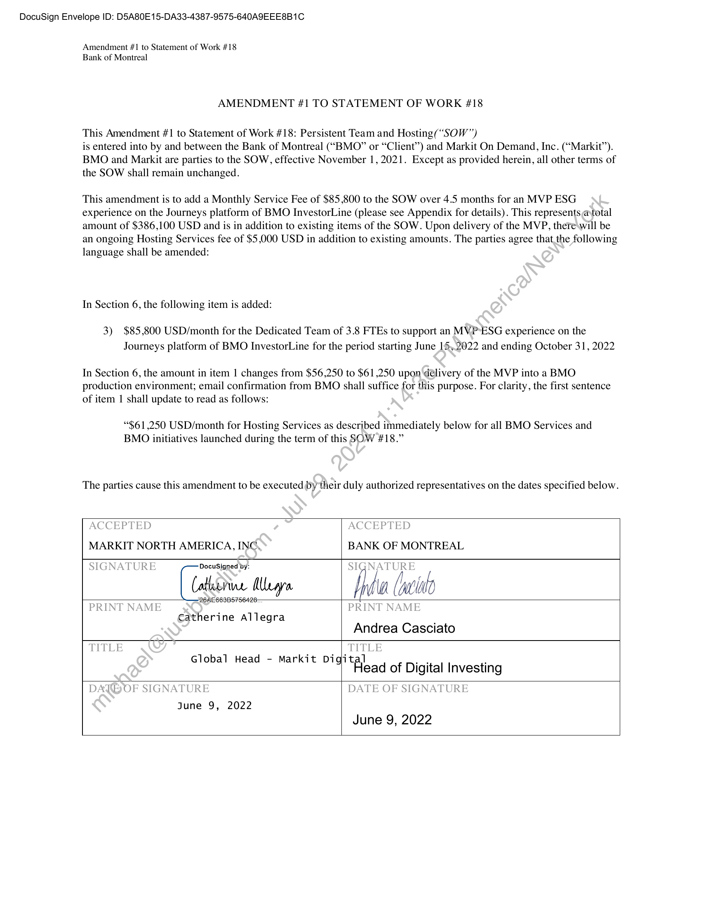
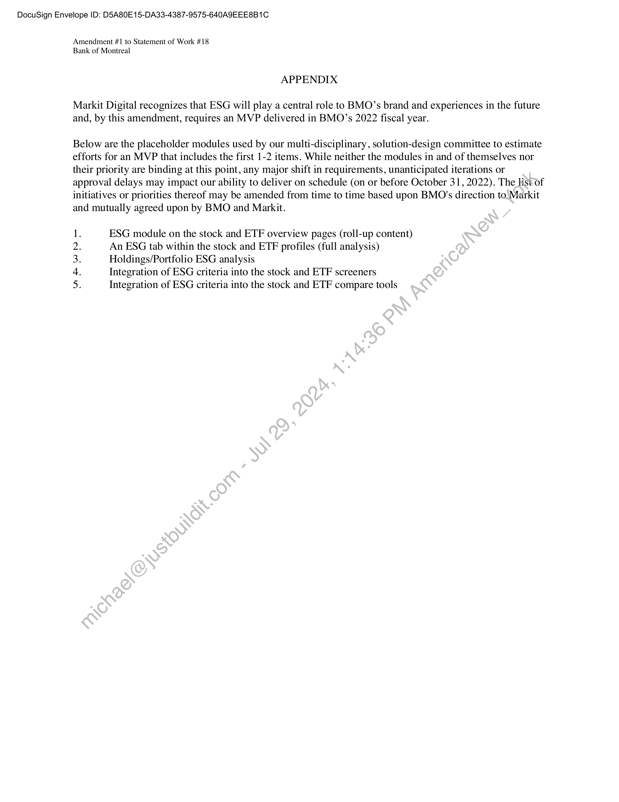

##### Amendment #1 to Statement of Work #18: Persistent Team and Hosting]

  
````col
```col-md
flexGrow=.5
===
> [!info] [Page 1](_attachments/images_BMO-3.6.1.21.1300221895.pdf_210945/page_1.png)
> 
```  
```col-md
DocuSign Envelope ID: D5A80E15-DA33-4387-9575-640A9EEE8B1C  
Amendment #1 to Statement of Work #18
Bank of Montreal  
AMENDMENT #1 TO STATEMENT OF WORK #18  
This Amendment #1 to Statement of Work #18: Persistent Team and Hosting(“SOW”)  
is entered into by and between the Bank of Montreal (““BMO” or “Client”) and Markit On Demand, Inc. (“Markit”).
BMO and Markit are parties to the SOW, effective November 1, 2021. Except as provided herein, all other terms of
the SOW shall remain unchanged.  
This amendment is to add a Monthly Service Fee of $85,800 to the SOW over 4.5 months for an MVP ESG
experience on the Journeys platform of BMO InvestorLine (please see Appendix for details). This represents @ total
amount of $386,100 USD and is in addition to existing items of the SOW. Upon delivery of the MVP, therewill be
an ongoing Hosting Services fee of $5,000 USD in addition to existing amounts. The parties agree that.the following
language shall be amended:  
In Section 6, the following item is added:  
3) $85,800 USD/month for the Dedicated Team of 3.8 FTEs to support an MVP*ESG experience on the
Journeys platform of BMO InvestorLine for the period starting June 15,2022 and ending October 31, 2022  
In Section 6, the amount in item 1 changes from $56,250 to $61,250 upon delivery of the MVP into a BMO
production environment; email confirmation from BMO shall suffice for this purpose. For clarity, the first sentence  
of item | shall update to read as follows:  
“$61,250 USD/month for Hosting Services as described immediately below for all BMO Services and
BMO initiatives launched during the term of this SOW #18.”  
The parties cause this amendment to be executed by their duly authorized representatives on the dates specified below.  
MARKIT NORTH AMERICA, INC. BANK OF MONTREAL  
DocuSigned by:  
(alliorine Mea Prd (otal  
Catherine Allegra ;
Andrea Casciato  
Global Head - Markit Digital an .
9"“Flead of Digital Investing  
June 9, 2022
June 9, 2022  
```
````
Notes:    
````col
```col-md
flexGrow=.5
===
> [!info] [Page 2](_attachments/images_BMO-3.6.1.21.1300221895.pdf_210945/page_2.png)
> 
```  
```col-md
DocuSign Envelope ID: D5A80E15-DA33-4387-9575-640A9EEE8B1C  
Amendment #1 to Statement of Work #18
Bank of Montreal  
APPENDIX  
Markit Digital recognizes that ESG will play a central role to BMO’s brand and experiences in the future
and, by this amendment, requires an MVP delivered in BMO’s 2022 fiscal year.  
Below are the placeholder modules used by our multi-disciplinary, solution-design committee to estimate
efforts for an MVP that includes the first 1-2 items. While neither the modules in and of themselves nor
their priority are binding at this point, any major shift in requirements, unanticipated iterations or
approval delays may impact our ability to deliver on schedule (on or before October 31, 2022). The list of
initiatives or priorities thereof may be amended from time to time based upon BMO's direction to Markit
and mutually agreed upon by BMO and Markit.  
ESG module on the stock and ETF overview pages (roll-up content)
An ESG tab within the stock and ETF profiles (full analysis)
Holdings/Portfolio ESG analysis  
Integration of ESG criteria into the stock and ETF screeners
Integration of ESG criteria into the stock and ETF compare tools  
nRwWN Ee  
```
````
Notes:  


![[_attachments/BMO-3.6.1.21.13 00221895.pdf]