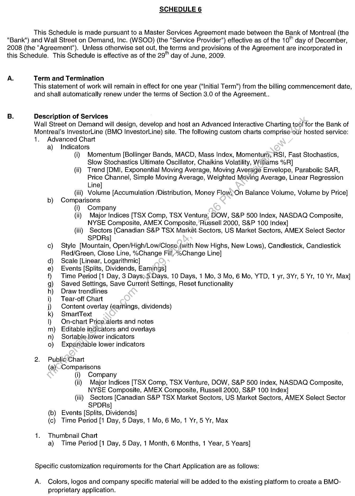
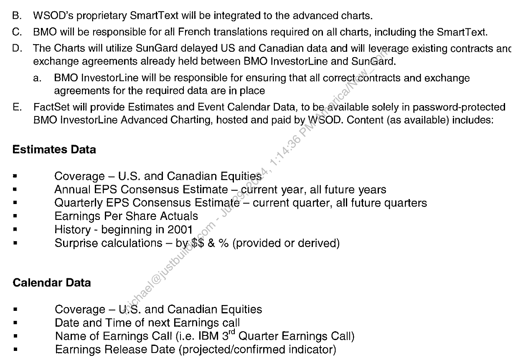
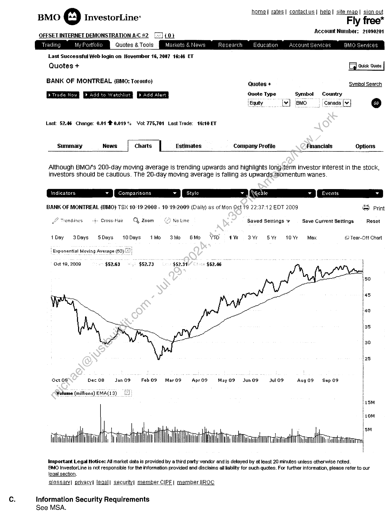
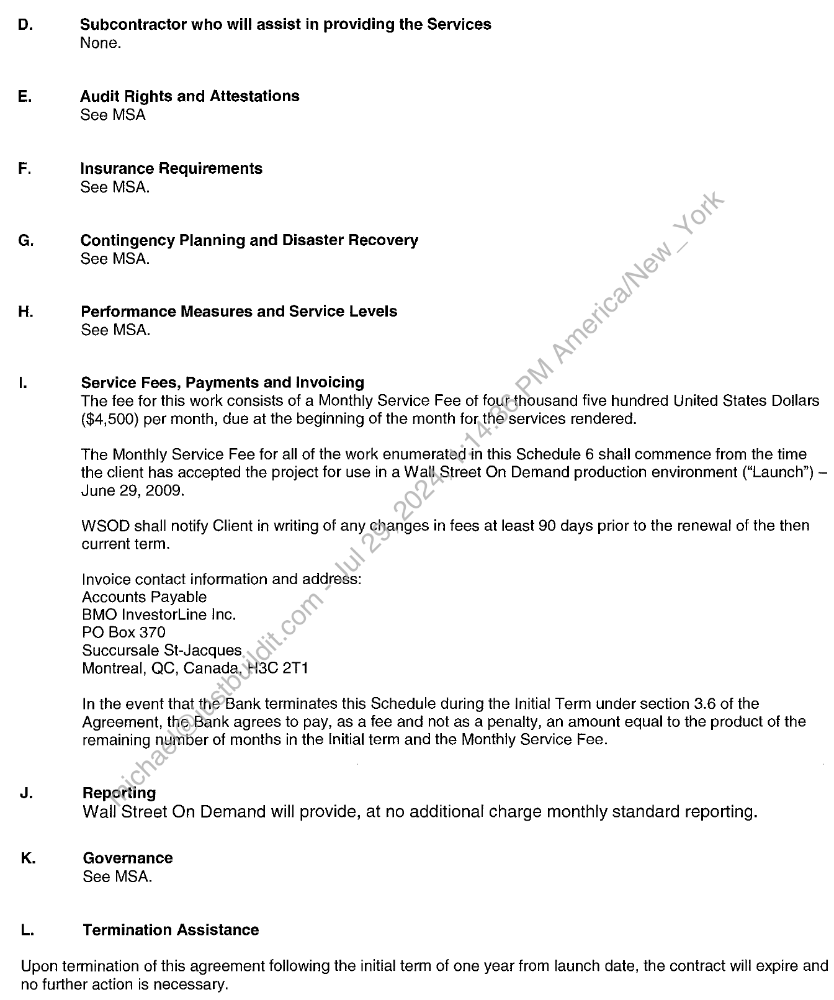
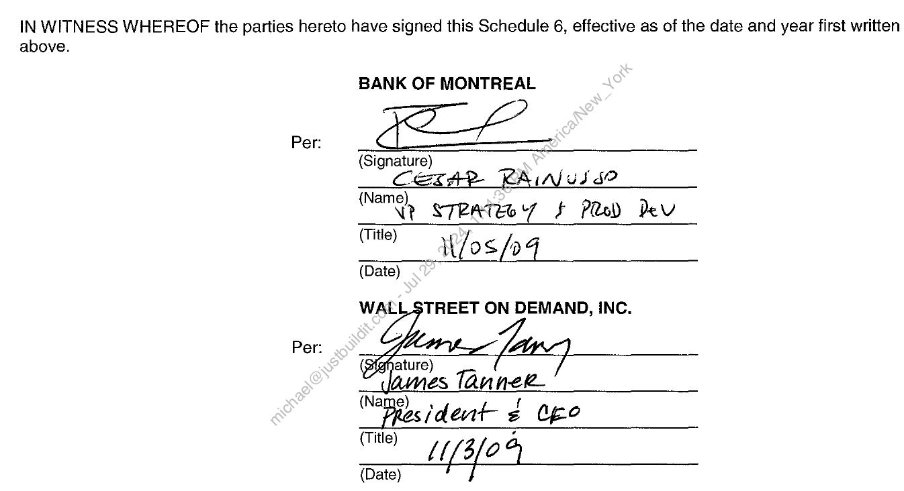

##### Statement of Work for Advanced Interactive Charting Tool]

  
````col
```col-md
flexGrow=.5
===
> [!info] [Page 1](_attachments/images_BMO-3.6.1.21.1400221870.pdf_211315/page_1.png)
> 
```  
```col-md
SCHEDULE 6  
This Schedule is made pursuant to a Master Services Agreement made between the Bank of Montreal (the
“Bank") and Wall Street on Demand, Inc. (WSOD) (the "Service Provider") effective as of the 10" day of December,
2008 (the "Agreement'). Unless otherwise set out, the terms and provisions of the Agreement are incorporated in
this Schedule. This Schedule is effective as of the 29" day of June, 2009.  
A. Term and Termination
This statement of work will remain in effect for one year (“Initial Term”) from the billing commencement date,
and shall automatically renew under the terms of Section 3.0 of the Agreement.  
  
B. Description of Services
Wall Street on Demand will design, develop and host an Advanced Interactive Charting tool for the Bank of
Montreal's InvestorLine (BMO InvestorLine) site. The following custom charts comprise-our hosted service:
1. Advanced Chart
a) Indicators
(i) Momentum [Bollinger Bands, MACD, Mass Index, Momentum, RSI, Fast Stochastics,
Slow Stochastics Ultimate Oscillator, Chaikins Volatility, Williams %R]
(ii) Trend [DMI, Exponential Moving Average, Moving Average Envelope, Parabolic SAR,
Price Channel, Simple Moving Average, Weighted Moving Average, Linear Regression
Line]
(iii), Volume [Accumulation /Distribution, Money Flow, On Balance Volume, Volume by Price]
b) Comparisons
(i) Company
(ii) Major Indices [TSX Comp, TSX Venture, BOW, S&P 500 Index, NASDAQ Composite,
NYSE Composite, AMEX Composite,’Russell 2000, S&P 100 Index]
(iii) Sectors [Canadian S&P TSX Market Sectors, US Market Sectors, AMEX Select Sector
SPDRs]
c) Style [Mountain, Open/High/Low/Close,(with New Highs, New Lows), Candlestick, Candlestick
Red/Green, Close Line, %Change Filly%Change Line]
d) Scale [Linear, Logarithmic]
e) Events [Splits, Dividends, Earnings]
f) Time Period [1 Day, 3 Days;5.Days, 10 Days, 1 Mo, 3 Mo, 6 Mo, YTD, 1 yr, 3Yr, 5 Yr, 10 Yr, Max]
g) Saved Settings, Save Current Settings, Reset functionality
h) Draw trendlines
i) Tear-off Chart
j) Content overlay (earnings, dividends)
k) SmariText
l) On-chart Price-alerts and notes
m) Editable indicators and overlays
n) Sortable.lower indicators
0) Expandable lower indicators  
2. Public‘Chart
(a) Comparisons
(i) Company
{ii) Major Indices [TSX Comp, TSX Venture, DOW, S&P 500 Index, NASDAQ Composite,
NYSE Composite, AMEX Composite, Russell 2000, S&P 100 Index]
(iii) Sectors [Canadian S&P TSX Market Sectors, US Market Sectors, AMEX Select Sector
SPDRs]
(b) Events [Splits, Dividends]
(c) Time Period [1 Day, 5 Days, 1 Mo, 6 Mo, 1 Yr, 5 Yr, Max  
1. Thumbnail Chart
a) Time Period [1 Day, 5 Day, 1 Month, 6 Months, 1 Year, 5 Years]
Specific customization requirements for the Chart Application are as follows:  
A. Colors, logos and company specific material will be added to the existing platform to create a BMOproprietary application.  
```
````
Notes:    
````col
```col-md
flexGrow=.5
===
> [!info] [Page 2](_attachments/images_BMO-3.6.1.21.1400221870.pdf_211315/page_2.png)
> 
```  
```col-md
B. WSOD’s proprietary SmartText will be integrated to the advanced charts.  
BMO will be responsible for all French translations required on all charts, including the SmartText.  
D. The Charts will utilize SunGard delayed US and Canadian data and will leverage existing contracts anc
exchange agreements already held between BMO InvestorLine and SunGard.
a. BMO InvestorLine will be responsible for ensuring that all correctcontracts and exchange  
agreements for the required data are in place  
E. FactSet will provide Estimates and Event Calendar Data, to be available solely in password-protected  
BMO InvestorLine Advanced Charting, hosted and paid by WSOD. Content (as available) includes:  
ie)  
Estimates Data  
Coverage — U.S. and Canadian Equities  
Annual EPS Consensus Estimate —current year, all future years
Quarterly EPS Consensus Estimate — current quarter, all future quarters
Earnings Per Share Actuals  
History - beginning in 2001  
Surprise calculations — by. $$ & % (provided or derived)  
Calendar Data  
Coverage — UiS. and Canadian Equities  
Date and Time of next Earnings call  
Name of Earnings Call (i.e. IBM 3 Quarter Earnings Call)
Earnings Release Date (projected/confirmed indicator)  
```
````
Notes:    
````col
```col-md
flexGrow=.5
===
> [!info] [Page 3](_attachments/images_BMO-3.6.1.21.1400221870.pdf_211315/page_3.png)
> 
```  
```col-md
home] rates| contactus| help| site map| sign out  
BMO © InvestorLine’ Fly free*  
Account Number: 21090201  
OFFSET INTERNET DEMONSTRATION A‘C #2
Quotes & Tools  
Last Successful Web login on Hovember 14, 2007 16:46 ET
Quotes +  
BANK OF MONTREAL (BMO: Toronto)  
Last: 52.46 Change: 0.01 0.019% Yok 775,701 Last Trade: 16:10 ET  
Summary News Charts | Estimates Company Profile Financials Options  
Although BMO?s 200-day moving average is trending upwards and highlights long-term investor interest in the stock,
investors should be cautious. The 20-day moving average is falling as upwards tfnomentum wanes.  
ee Print  
BANK OF MONTREAL (BMO) TSx 10:19:2008 - 10.19.2009 (Daily) as of Man Oct 19 22:37:12 EDT 2009  
Saved Sattings + Save Current Settings Reset  
(O Tendines 4 Cross-Hair = Zoom  
1Day SDays SDays 10Days 1Mo 3Mo 6SMo YID f¥r S¥r S¥r 10%r Max G Tear-Ott Chart  
| Exponential Moving Average (50;  
Get 19, 2008 $52.63 $5273 $52  
50  
45  
40  
35  
FebO9 = Mar09 Aprog MayG9 = Jun 09 Jul 09 AugO9 Sep Oo  
Oct OF Dec 08 Jan 09  
‘Volume (millions) EMA(13)  
Important Legal Notice: All market data is provided by a third party vendor and is delayed by at least 20 minutes unless otherwise noted.
BMO InvestorLine is not responsible for the information provided and disclaims ail ability for such quotes. For further information, please refer to our  
legal section.
glossary| privacy| legal] security] member CIPF| member IROC  
Information Security Requirements
See MSA.  
```
````
Notes:    
````col
```col-md
flexGrow=.5
===
> [!info] [Page 4](_attachments/images_BMO-3.6.1.21.1400221870.pdf_211315/page_4.png)
> 
```  
```col-md
L.  
Subcontractor who will assist in providing the Services
None.  
Audit Rights and Aitestations
See MSA  
Insurance Requirements
See MSA.  
Contingency Planning and Disaster Recovery
See MSA.  
Performance Measures and Service Levels
See MSA.  
Service Fees, Payments and Invoicing
The fee for this work consists of a Monthly Service Fee of four-thousand five hundred United States Dollars
($4,500) per month, due at the beginning of the month for,the services rendered.  
The Monthly Service Fee for all of the work enumerated in this Schedule 6 shall commence from the time
the client has accepted the project for use in a WallStreet On Demand production environment (“Launch”) —
June 29, 2009.  
WSOD shall notify Client in writing of any changes in fees at least 90 days prior to the renewal of the then
current term.  
Invoice contact information and address:
Accounts Payable  
BMO InvestorLine Inc.  
PO Box 370  
Succursale St-Jacques  
Montreal, QC, Canada, H3C 2T1  
In the event that the Bank terminates this Schedule during the Initial Term under section 3.6 of the  
Agreement, the Bank agrees to pay, as a fee and not as a penalty, an amount equal to the product of the
remaining number of months in the Initial term and the Monthly Service Fee.  
Reporting
Wail Street On Demand will provide, at no additional charge monthly standard reporting.  
Governance
See MSA.  
Termination Assistance  
Upon termination of this agreement following the initial term of one year from launch date, the contract will expire and
no further action is necessary.  
```
````
Notes:    
````col
```col-md
flexGrow=.5
===
> [!info] [Page 5](_attachments/images_BMO-3.6.1.21.1400221870.pdf_211315/page_5.png)
> 
```  
```col-md
IN WITNESS WHEREOF the parties hereto have signed this Schedule 6, effective as of the date and year first written  
above.  
Per:  
BANK OF MONTREAL
(Signature)
CexcAPp RAIA us §?
N
(Name e7pRteey $ Pee) Dev
(Title) it /o S fp 4
(Date)
WALLSTREET ON DEMAND, INC.  
Bident ¢ O60  
(Title) 0
{Date) LY 3/0 *)  
```
````
Notes:  


![[_attachments/BMO-3.6.1.21.14 00221870.pdf]