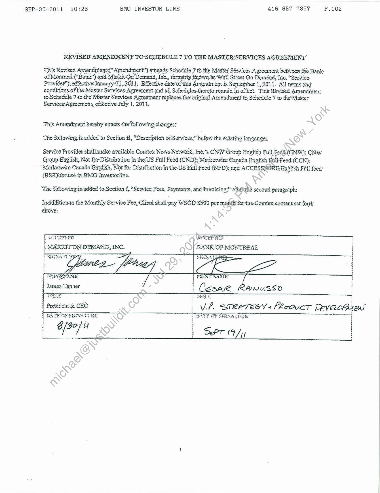

##### Revised Amendment to Schedule 7 to the Master Services Agreement]

  
````col
```col-md
flexGrow=.5
===
> [!info] [Page 1](_attachments/images_BMO-3.6.1.21.1500221872.pdf_205934/page_1.png)
> 
```  
```col-md
SEP-30-2011 10:25 BMO INVESTOR LINE 416 867 7357 P.002  
REVISED AMENDMENT TOSCHEDULE 7 TO THE MASTER ‘SERVICES AGREEMENT  
This Revited Amondnient: (“Amendment”) arhonds’ Schedule 7 to the Mastét Séévices Agreement betwee
of! Moncredtt nie) and Markit OnDemand, Inc., formerly‘kKuown.ts ‘Wall Street On Damani, tne, “Serv
z f ry 21,2011, Effective dateofthis Amendment is Séprember 1,2011. All terms and
saatebaent the: Master Services Agreement aind all Schedules.theteto remait Iu effect. This. Revived Amendiient
to Schedule 7 to-the Muster ' ‘Services. Agreement replaces. the origisal Amendmeiit t6 Schedule 7 to the Master
Services Agreement, effective July 1, 2011.  
This Anwpdment hereby enacts the:following-chariges*  
The following is. added to Section B, “Description of Services,” below the existing longange:.  
Service Provider shallmake available: Comitex: News Newwork, Inc,"s CNW'Group English Pull Fee YOnw); CNW
GrompBaglish, Not for’ Distikation | inthe: US Full Feed ({CND); Marketwire Canade English-Rulleed:¢(CCN),
Marketwire Canada Bnyglish, Noe for Disteibution‘in the US Full: Feed (NED); and ACCESSWIRE: English Full teed:
(8SR)\for.use in:BMO Ihvestoriine.  
‘The followingiis-added to-Section f.  
 “Service: Fees, Paynrents, and Invoicing; aftethe second paragraph:
Inyaddition to the Monthly Service fee, Client shall :pay WSOD-$500:per month for the. Comtexcontent set forth  
WEE Ong a POT IY  
: coisa DEMAND, INC. “BANK-OF MONTREAL  
j DS VEY SUGNATORE  
epee SPT /y |  
```
````
Notes:  


![[_attachments/BMO-3.6.1.21.15 00221872.pdf]