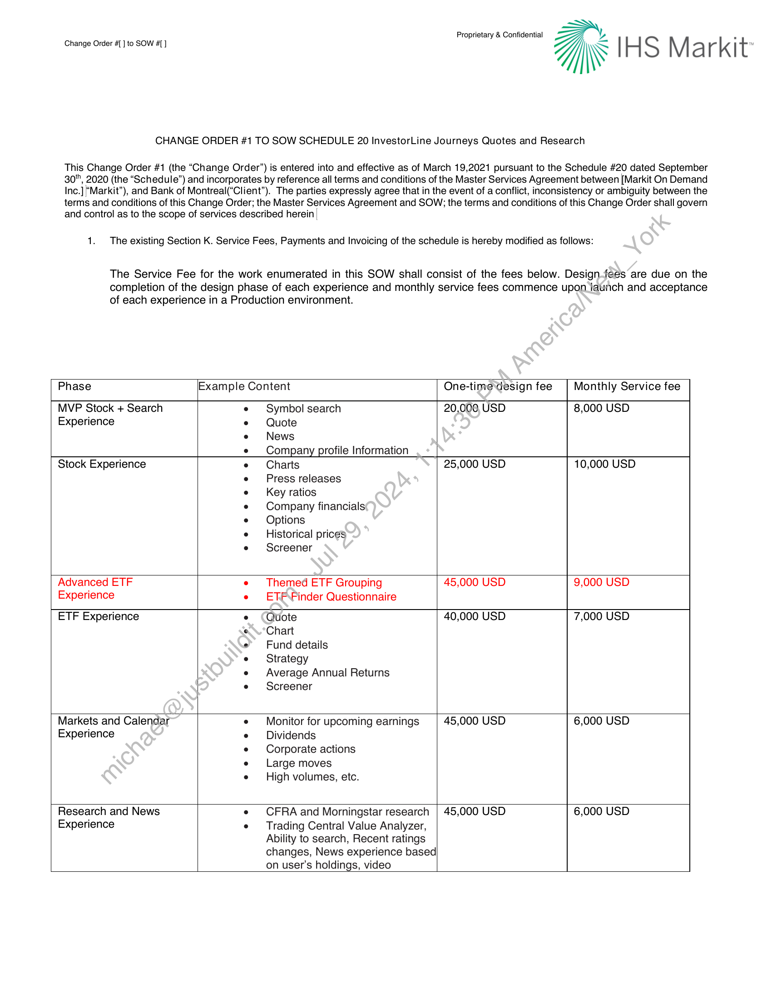
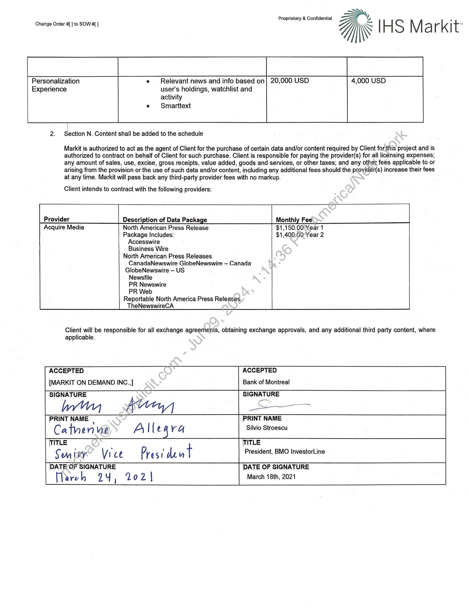

##### Change Order #1 to SOW Schedule 20 InvestorLine Journeys Quotes and Research]

  
````col
```col-md
flexGrow=.5
===
> [!info] [Page 1](_attachments/images_BMO-3.6.1.21.1600221934.pdf_210712/page_1.png)
> 
```  
```col-md
Proprietary & Confidential  
crange Ose :6 SOW 7]\\* IHS Markit  
CHANGE ORDER #1 TO SOW SCHEDULE 20 InvestorLine Journeys Quotes and Research  
This Change Order #1 (the “Change Order”) is entered into and effective as of March 19,2021 pursuant to the Schedule #20 dated September
30", 2020 (the “Schedule”) and incorporates by reference all terms and conditions of the Master Services Agreement between [Markit On Demand
Inc.]|‘Markit”), and Bank of Montreal(“Client”). The parties expressly agree that in the event of a conflict, inconsistency or ambiguity between the
terms and conditions of this Change Order; the Master Services Agreement and SOW; the terms and conditions of this Change Order shall govern
and control as to the scope of services described herein |  
1. The existing Section K. Service Fees, Payments and Invoicing of the schedule is hereby modified as follows:  
The Service Fee for the work enumerated in this SOW shall consist of the fees below. Designfees are due on the
completion of the design phase of each experience and monthly service fees commence upon launch and acceptance
of each experience in a Production environment.  
Phase Example Content One-time design fee Monthly Service fee
MVP Stock + Search e¢ Symbol search 20,000, USD 8,000 USD
Experience e Quote  
e News  
e Company profile Information
Stock Experience e = Charts 25,000 USD 10,000 USD  
e Press releases  
e = Key ratios  
e Company financials
e Options  
e — Historical prices  
e Screener  
Advanced ETF « Themed ETF Grouping 45,000 USD 9,000 USD
Experience e ETFFinder Questionnaire
ETF Experience e (QUote 40,000 USD 7,000 USD
Chart
Fund details
° Strategy  
e Average Annual Returns
e° Screener  
Markets and Calendar e Monitor for upcoming earnings 45,000 USD 6,000 USD
Experience e Dividends  
e Corporate actions
e Large moves  
e High volumes, etc.  
Research and News e CFRA and Morningstar research | 45,000 USD 6,000 USD
Experience ¢ Trading Central Value Analyzer,
Ability to search, Recent ratings
changes, News experience based|
on user’s holdings, video  
```
````
Notes:    
````col
```col-md
flexGrow=.5
===
> [!info] [Page 2](_attachments/images_BMO-3.6.1.21.1600221934.pdf_210712/page_2.png)
> 
```  
```col-md
Proprietary & Confidential  
Change Order #{] to SOW] js | HS M a rkit ,  
Personalization Relevant news and info based on} 20,000 USD 4,000 USD
Experience user's holdings, watchlist and  
activity
Smarttext  
2. Section N. Content shall be added to the schedule  
Markit is authorized to act as the agent of Client for the purchase of certain data and/or content required by Client for this project and is
authorized to contract on behalf of Client for such purchase. Client is responsible for paying the provider(s) for all licensing expenses;
any amount of sales, use, excise, gross receipts, value added, goods and services, or other taxes; and any other fees applicable to or
arising from the provision or the use of such data and/or content, including any additional fees should the provider(s) increase their fees
at any time. Markit will pass back any third-party provider fees with no markup.  
Client intends to contract with the following providers:  
Provider Description of Data Package Monthly Fee
Acquire Media North American Press Release $1,150.00 Year 1
Package Includes: $1,400:00-Year 2
Accesswire  
Business Wire
North American Press Releases  
CanadaNewswire GlobeNewswire — Canada
GlobeNewswire — US  
Newsfile  
PR Newswire  
PR Web
Reportable North America Press Releases.  
TheNewswireCA  
Client will be responsible for all exchange agreemenis, obtaining exchange approvals, and any additional third party content, where  
applicable.
ACCEPTED ACCEPTED
[MARKIT ON DEMAND INC.,] Bank of Montreal
SIGNATURE SIGNATURE
Win tly _——
PRINT NAME : PRINT NAME
Ca tn ene Ay | { cava Silvio Stroescu
) TITLE TITLE
Sm wy Vi ce Pres 1 dk u | President, BMO InvestorLine
| DATE OF SIGNATURE [PATE OF SIGNATURE
Hlareh 24, 202] March 18th, 2021  
```
````
Notes:  


![[_attachments/BMO-3.6.1.21.16 00221934.pdf]