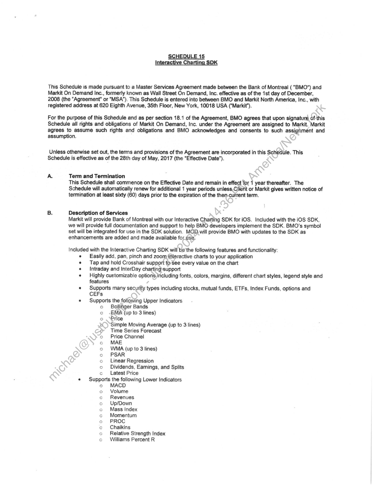
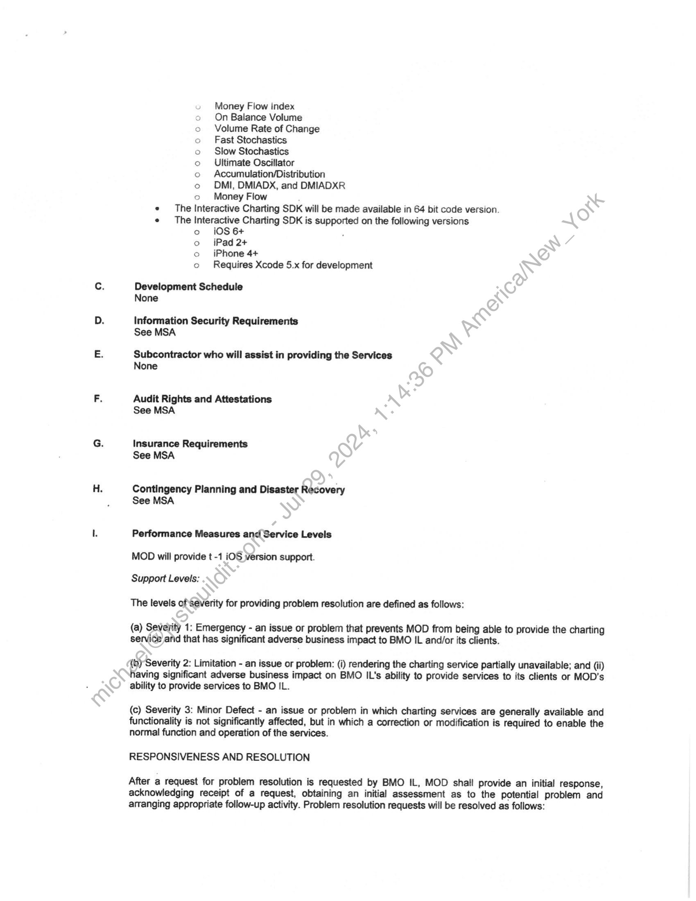
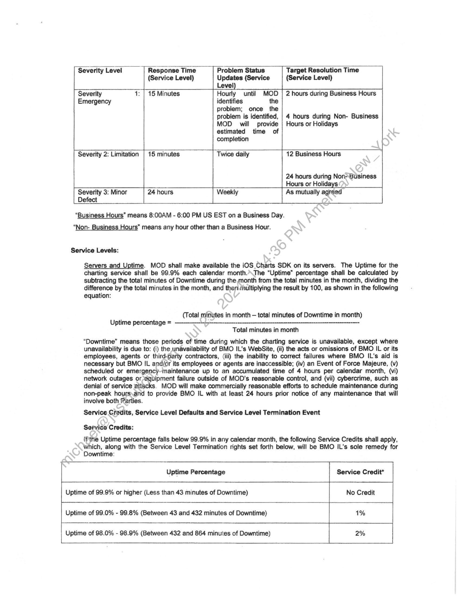
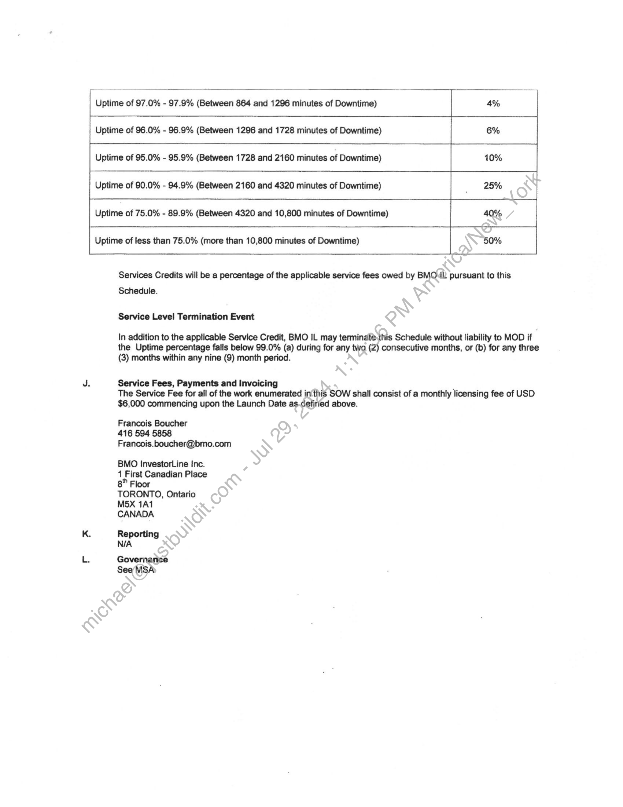
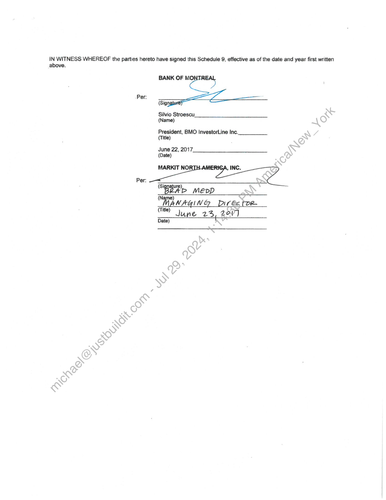

##### Schedule 15: Interactive Charting SDK for iOS]

  
````col
```col-md
flexGrow=.5
===
> [!info] [Page 1](_attachments/images_BMO-3.6.1.21.1700221919.pdf_210148/page_1.png)
> 
```  
```col-md
SCHEDULE 15
Interactive Charti DK  
This Schedule is made pursuant to a Master Services Agreement made between the Bank of Montreal ( "BMO") and
Markit On Demand Inc., formerly known as Wall Street On Demand, Inc. effective as of the 1st day of December,
2008 (the "Agreement" or “MSA’). This Schedule is entered into between BMO and Markit North America, Inc., with
registered address at 620 Eighth Avenue, 35th Floor, New York, 10018 USA (“Markit”).  
For the purpose of this Schedule and as per section 18.1 of the Agreement, BMO agrees that upon signature of this
Schedule all rights and obligations of Markit On Demand, Inc. under the Agreement are assigned to Markit. Markit
agrees to assume such rights and obligations and BMO acknowledges and ‘consents to such assignment and  
assumption.  
Unless otherwise set out, the terms and provisions of the Agreement are incorporated in this Schedule. This
Schedule is effective as of the 28th day of May, 2017 (the “Effective Date”).  
A. Term and Termination
This Schedule shall commence on the Effective Date and remain in effect for 1 year thereafter. The
Schedule will automatically renew for additional 1 year periods unless Client or Markit gives written notice of
termination at least sixty (60) days prior to the expiration of the then-cuirent term.  
B. Description of Services
Markit will provide Bank of Montreal with our Interactive Charting SDK for iOS. Included with the iOS SDK,
we will provide full documentation and support to help BMO developers implement the SDK. BMO’s symbol
set will be integrated for use in the SDK solution. MOD.will provide BMO with updates to the SDK as
enhancements are added and made available for.use.  
Included with the Interactive Charting SDK will ba’ the following features and functionality:  
Easily add, pan, pinch and zoom interactive charts to your application
Tap and hold Crosshair support to’See every value on the chart
Intraday and InterDay chartingsupport
Highly customizable options, including fonts, colors, margins, different chart styles, legend style and
features
Supports many security types including stocks, mutual funds, ETFs, Index Funds, options and
CEFs
Supports the following Upper Indicators
o Bollinger Bands
EMA (up to 3 lines)
Price
Simple Moving Average (up to 3 lines)
Time Series Forecast
Price Channel
MAE
WMA (up to 3 lines)
PSAR
Linear Regression
Dividends, Eamings, and Splits
c Latest Price
Supports the following Lower Indicators
co MACD
Volume
Revenues
Up/Down
Mass index
Momentum
PROC
Chaikins
Relative Strength Index
Williams Percent R  
00000 OWPWOO  
eoo00000000  
```
````
Notes:    
````col
```col-md
flexGrow=.5
===
> [!info] [Page 2](_attachments/images_BMO-3.6.1.21.1700221919.pdf_210148/page_2.png)
> 
```  
```col-md
» Money Flow index
o On Balance Volume
Volume Rate of Change
Fast Stochastics
Slow Stochastics
Ultimate Oscillator
Accumulation/Distribution
DMI, DMIADX, and DMIADXR
o ©Money Flow
* The Interactive Charting SDK will be made available in 64 bit code version.
¢ The Interactive Charting SDK is supported on the following versions
o iOS 6+ ;
o iPad 2+
oc iPhone 4+
o Requires Xcode 5.x for development  
°  
o0000  
Development Schedule
None  
Information Security Requirements
See MSA  
Subcontractor who will assist in providing the Services
None  
Audit Rights and Attestations
See MSA  
Insurance Requirements
See MSA  
Contingency Planning and Disaster Recovery
See MSA  
Performance Measures and Service Levels
MOD will provide t -1 iOS version support.
Support Levels:  
The levels of Severity for providing problem resolution are defined as follows:  
(a) Severity 1: Emergency - an issue or problem that prevents MOD from being able to provide the charting
service arid that has significant adverse business impact to BMO IL and/or its clients.  
() Severity 2: Limitation - an issue or problem: (i) rendering the charting service partially unavailable; and (ji)
having significant adverse business impact on BMO IL's ability to provide services to its clients or MOD’s
ability to provide services to BMO IL.  
(c) Severity 3: Minor Defect - an issue or problem in which charting services are generally available and
functionality is not significantly affected, but in which a correction or modification is required to enable the
normal function and operation of the services.  
RESPONSIVENESS AND RESOLUTION
After a request for problem resolution is requested by BMO IL, MOD shall provide an initial response,  
acknowledging receipt of a request, obtaining an initial assessment as to the potential problem and
arranging appropriate follow-up activity. Problem resolution requests will be resolved as follows:  
```
````
Notes:    
````col
```col-md
flexGrow=.5
===
> [!info] [Page 3](_attachments/images_BMO-3.6.1.21.1700221919.pdf_210148/page_3.png)
> 
```  
```col-md
Severity Level | Response Time Problem Status | Target Resolution Time  
(Service Level) Updates (Service (Service Level)
Level)
Severity 1: | 15 Minutes Hourly until MOD | 2 hours during Business Hours
Emergency identifies the  
problem; once the
problem is identified, | 4 hours during Non- Business
MOD will provide | Hours or Holidays  
estimated time of  
completion
7 Severity 2: Limitation | 15 minutes Twice daily 12 Business Hours
24 hours during Non-Business
Hours or Holidays |
Severity 3: Minor 24 hours Weekly As mutually agreed  
Defect  
“Business Hours” means 8:00AM - 6:00 PM US EST on a Business Day.
“Non- Business Hours” means any hour other than a Business Hour.  
Service Levels:  
Servers and Uptime. MOD shall make available the iOS Charts SDK on its servers. The Uptime for the
charting service shall be 99.9% each calendar month.’\The “Uptime” percentage shall be calculated by
subtracting the total minutes of Downtime during the month from the total minutes in the month, dividing the
difference by the total minutes in the month, and then /hultiplying the result by 100, as shown in the following
equation:  
(Total minutes in month — total minutes of Downtime in month)
Uptime percentage = ————---——-—-—--—______-__---_______--_—__----—--—Total minutes in month  
“Downtime” means those periods of time during which the charting service is unavailable, except where
unavailability is due to: (i) the unavailability of BMO IL'’s WebSite, (ii) the acts or omissions of BMO IL or its
employees, agents or third-party contractors, (iii) the inability to correct failures where BMO IL’s aid is
necessary but BMO IL and/or its employees or agents are inaccessible; (iv) an Event of Force Majeure, (v)
scheduled or emergency~maintenance up to an accumulated time of 4 hours per calendar month, (vi)
network outages or equipment failure outside of MOD’s reasonable control, and (vii) cybercrime, such as
denial of service attacks. MOD will make commercially reasonable efforts to schedule maintenance during
non-peak hours\and to provide BMO IL with at least 24 hours prior notice of any maintenance that will
involve both Parties.  
Service Credits, Service Level Defaults and Service Level Termination Event  
Service Credits:  
iPthe Uptime percentage falls below 99.9% in any calendar month, the following Service Credits shall apply,
which, along with the Service Level Termination rights set forth below, will be BMO IL’s sole remedy for
Downtime:  
Uptime Percentage Service Credit*
Uptime of 99.9% or higher (Less than 43 minutes of Downtime) No Credit
Uptime of 99.0% - 99.8% (Between 43 and 432 minutes of Downtime) 1%  
Uptime of 98.0% - 98.9% (Between 432 and 864 minutes of Downtime) 2%  
```
````
Notes:    
````col
```col-md
flexGrow=.5
===
> [!info] [Page 4](_attachments/images_BMO-3.6.1.21.1700221919.pdf_210148/page_4.png)
> 
```  
```col-md
L a 97.0% - 97.9% (Between 864 and 1296 minutes of Downtime) 4%  
Uptime of 96.0% - 96.9% (Between 1296 and 1728 minutes of Downtime) 6%
—=—  
Uptime of 95.0% - 95.9% (Between 1728 and 2160 minutes of Downtime) 10%  
Uptime of 90.0% - 94.9% (Between 2160 and 4320 minutes of Downtime) | 25%  
Uptime of 75.0% - 89.9% (Between 4320 and 10,800 minutes of Downtime) 40%  
Uptime of less than 75.0% (more than 10,800 minutes of Downtime) L 50%  
Services Credits will be a percentage of the applicable service fees owed by BMOul. pursuant to this  
Schedule.  
Service Level Termination Event  
In addition to the applicable Service Credit, BMO IL may terminate.this Schedule without liability to MOD if
the Uptime percentage falls below 99.0% (a) during for any two (2) consecutive months, or (b) for any three  
(3) months within any nine (9) month period.  
J. Service Fees, Payments and Invoicing  
The Service Fee for all of the work enumerated in‘this SOW shall consist of a monthly licensing fee of USD  
$6,000 commencing upon the Launch Date as-defiried above.  
Francois Boucher
416 594 5858
Francois.boucher@bmo.com  
BMO InvestorLine Inc.
1 First Canadian Place
8" Floor  
TORONTO, Ontario
M5X 1A1  
CANADA  
K. Reporting
N/A  
L. Governanse
SeeMSA  
```
````
Notes:    
````col
```col-md
flexGrow=.5
===
> [!info] [Page 5](_attachments/images_BMO-3.6.1.21.1700221919.pdf_210148/page_5.png)
> 
```  
```col-md
IN WITNESS WHEREOF the parties hereto have signed this Schedule 9, effective as of the date and year first written  
above.  
Per:  
Per:  
BANK OF Mi  
(Sig  
Silvio Stroescu,
(Name)  
President, BMO InvestorLine Inc.
(Title)  
June 22, 2017.
(Date)  
MARKIT NOR’  
“BOR > MepD
“MANAGING Dirée tor  
ONG ae. 23, 220)
Date)  
, INC.  
```
````
Notes:  


![[_attachments/BMO-3.6.1.21.17 00221919.pdf]