##### Schedule # 28: Modernized Options Investing for InvestorLine 2.0]

  
````col
```col-md
flexGrow=.5
===
> [!info] [Page 1](_attachments/images_BMO-3.6.1.21.200221980.pdf_211018/page_1.png)
> 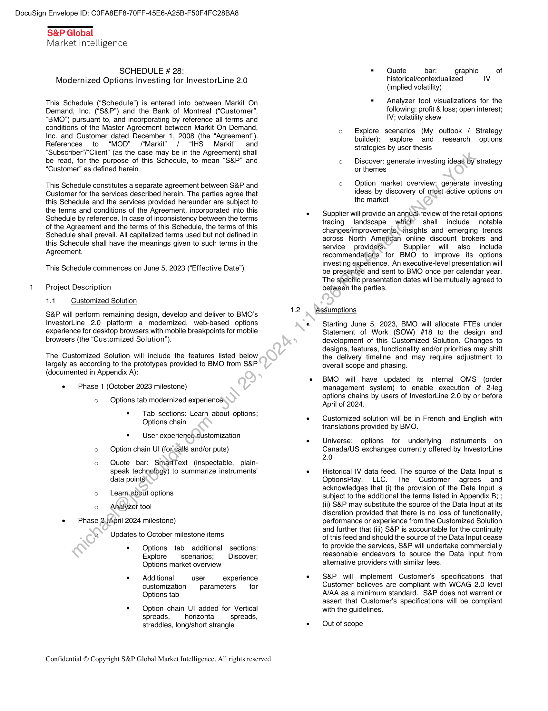
```  
```col-md
DocuSign Envelope ID: COFA8EF8-70FF-45E6-A25B-F50F4FC28BA8  
S&P Global
Market Intelligence  
SCHEDULE 28:
Modernized Options Investing for InvestorLine 2.0  
This Schedule (“Schedule”) is entered into between Markit On
Demand, Inc. (“S&P”) and the Bank of Montreal (“Customer’,
“BMO’”) pursuant to, and incorporating by reference all terms and
conditions of the Master Agreement between Markit On Demand,
Inc. and Customer dated December 1, 2008 (the “Agreement’).
References to “MOD” /‘Markit? / “IHS Markit” and
“Subscriber’/“Client” (as the case may be in the Agreement) shall
be read, for the purpose of this Schedule, to mean “S&P” and
“Customer” as defined herein.  
This Schedule constitutes a separate agreement between S&P and
Customer for the services described herein. The parties agree that
this Schedule and the services provided hereunder are subject to
the terms and conditions of the Agreement, incorporated into this
Schedule by reference. In case of inconsistency between the terms
of the Agreement and the terms of this Schedule, the terms of this
Schedule shall prevail. All capitalized terms used but not defined in
this Schedule shall have the meanings given to such terms in the
Agreement.  
This Schedule commences on June 5, 2023 (“Effective Date”).  
Project Description
14 Customized Solution  
S&P will perform remaining design, develop and deliver to BMO’s
InvestorLine 2.0 platform a modernized, web-based options
experience for desktop browsers with mobile breakpoints for mobile
browsers (the “Customized Solution”).  
The Customized Solution will include the features listed below
largely as according to the prototypes provided to BMO from S&P
(documented in Appendix A):  
. Phase 1 (October 2023 milestone)
o Options tab modernized experience  
. Tab sections: Learn about options;
Options chain  
® User experience.customization
o — Option chain UI (for.calls and/or puts)  
o Quote bar: SmartText (inspectable, plainspeak technology) to summarize instruments’
data points  
o _Learn.about options
o Analyzer toolPhase 2,(April 2024 milestone)
@° Updates to October milestone items  
® Options tab additional sections:
Explore scenarios; Discover;
Options market overview  
= Additional user experience
customization parameters for
Options tab  
® Option chain UI added for Vertical
spreads, horizontal spreads,
straddles, long/short strangle  
Confidential © Copyright S&P Global Market Intelligence. All rights reserved  
= Quote bar: graphic of
historical/contextualized Iv
(implied volatility)  
= Analyzer tool visualizations for the
following: profit & loss; open interest;
IV; volatility skew  
o Explore scenarios (My outlook / Strategy
builder): explore and research options
strategies by user thesis  
o Discover: generate investing ideas by strategy
or themes  
o Option market overview: generate investing
ideas by discovery of most active options on
the market  
e — Supplier will provide an annuahreview of the retail options
trading landscape which shall include notable
changes/improvements,“insights and emerging trends
across North American online discount brokers and
service providers: Supplier will also include
recommendations for BMO to improve its options
investing experience. An executive-level presentation will
be presented and sent to BMO once per calendar year.
The specific presentation dates will be mutually agreed to
between the parties.  
1.2 Assumptions  
e Starting June 5, 2023, BMO will allocate FTEs under
Statement of Work (SOW) #18 to the design and
development of this Customized Solution. Changes to
designs, features, functionality and/or priorities may shift
the delivery timeline and may require adjustment to
overall scope and phasing.  
¢ BMO will have updated its internal OMS (order
management system) to enable execution of 2-leg
options chains by users of InvestorLine 2.0 by or before
April of 2024.  
e Customized solution will be in French and English with
translations provided by BMO.  
. Universe: options for underlying instruments on
Canada/US exchanges currently offered by InvestorLine
2.0  
. Historical IV data feed. The source of the Data Input is
OptionsPlay, LLC. The Customer agrees and
acknowledges that (i) the provision of the Data Input is
subject to the additional the terms listed in Appendix B; ;
(ii) S&P may substitute the source of the Data Input at its
discretion provided that there is no loss of functionality,
performance or experience from the Customized Solution
and further that (iii) S&P is accountable for the continuity
of this feed and should the source of the Data Input cease
to provide the services, S&P will undertake commercially
reasonable endeavors to source the Data Input from
alternative providers with similar fees.  
e S&P will implement Customer's specifications that
Customer believes are compliant with WCAG 2.0 level
A/AA as a minimum standard. S&P does not warrant or
assert that Customer's specifications will be compliant
with the guidelines.  
e Out of scope  
```
````
Notes:    
````col
```col-md
flexGrow=.5
===
> [!info] [Page 2](_attachments/images_BMO-3.6.1.21.200221980.pdf_211018/page_2.png)
> 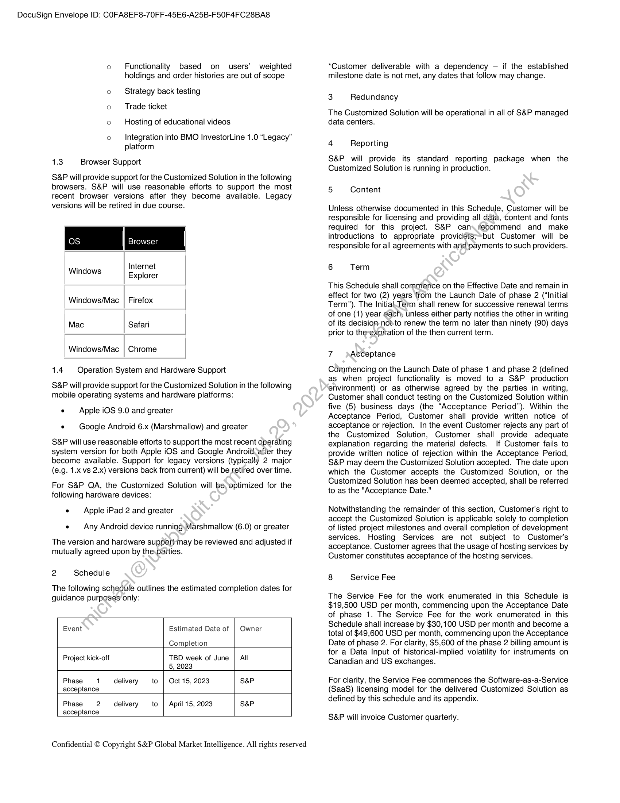
```  
```col-md
DocuSign Envelope ID: COFA8EF8-70FF-45E6-A25B-F50F4FC28BA8  
o Functionality based on users’ weighted
holdings and order histories are out of scope  
o Strategy back testing
o Trade ticket
o Hosting of educational videos  
o Integration into BMO InvestorLine 1.0 “Legacy”
platform  
1.3 Browser Support  
S&P will provide support for the Customized Solution in the following
browsers. S&P will use reasonable efforts to support the most
recent browser versions after they become available. Legacy
versions will be retired in due course.  
Internet
Explorer  
Windows
Windows/Mac _ Firefox  
Mac Safari  
Windows/Mac Chrome  
1.4 Operation System and Hardware Support  
S&P will provide support for the Customized Solution in the following
mobile operating systems and hardware platforms:  
« Apple iOS 9.0 and greater
e — Google Android 6.x (Marshmallow) and greater  
S&P will use reasonable efforts to support the most recent operating
system version for both Apple iOS and Google Android. after they
become available. Support for legacy versions (typically 2 major
(e.g. 1.x vs 2.x) versions back from current) will be retired over time.  
For S&P QA, the Customized Solution will be optimized for the
following hardware devices:  
e — Apple iPad 2 and greater  
e — Any Android device running\Marshmallow (6.0) or greater
The version and hardware support‘may be reviewed and adjusted if
mutually agreed upon by the.paities.
2 Schedule  
The following schedule outlines the estimated completion dates for
guidance purposes only:  
Event Estimated Date of | Owner  
Completion  
Project kick-off TBD week of June | All  
5, 2023
Phase 1 delivery to | Oct 15, 2023 S&P
acceptance
Phase 2 delivery to | April 15, 2023 S&P
acceptance  
Confidential © Copyright S&P Global Market Intelligence. All rights reserved  
*Customer deliverable with a dependency — if the established
milestone date is not met, any dates that follow may change.  
3 Redundancy  
The Customized Solution will be operational in all of S&P managed
data centers.  
4 Reporting  
S&P will provide its standard reporting package when the
Customized Solution is running in production.  
5 Content  
Unless otherwise documented in this Schedule, Customer will be
responsible for licensing and providing all data, Content and fonts
required for this project. S&P can. fecommend and make
introductions to appropriate providéers;*but Customer will be
responsible for all agreements with and payments to such providers.  
6 Term  
This Schedule shall commence on the Effective Date and remain in
effect for two (2) years from the Launch Date of phase 2 (“Initial
Term”). The Initiak.Term shall renew for successive renewal terms
of one (1) year gach; unless either party notifies the other in writing
of its decision. not-to renew the term no later than ninety (90) days
prior to the-expiration of the then current term.  
7 Acceptance  
Commencing on the Launch Date of phase 1 and phase 2 (defined
as when project functionality is moved to a S&P production
environment) or as otherwise agreed by the parties in writing,
Customer shall conduct testing on the Customized Solution within
five (5) business days (the “Acceptance Period”). Within the
Acceptance Period, Customer shall provide written notice of
acceptance or rejection. In the event Customer rejects any part of
the Customized Solution, Customer shall provide adequate
explanation regarding the material defects. If Customer fails to
provide written notice of rejection within the Acceptance Period,
S&P may deem the Customized Solution accepted. The date upon
which the Customer accepts the Customized Solution, or the
Customized Solution has been deemed accepted, shall be referred
to as the "Acceptance Date."  
Notwithstanding the remainder of this section, Customer's right to
accept the Customized Solution is applicable solely to completion
of listed project milestones and overall completion of development
services. Hosting Services are not subject to Customer's
acceptance. Customer agrees that the usage of hosting services by
Customer constitutes acceptance of the hosting services.  
8 Service Fee  
The Service Fee for the work enumerated in this Schedule is
$19,500 USD per month, commencing upon the Acceptance Date
of phase 1. The Service Fee for the work enumerated in this
Schedule shall increase by $30,100 USD per month and become a
total of $49,600 USD per month, commencing upon the Acceptance
Date of phase 2. For clarity, $5,600 of the phase 2 billing amount is
for a Data Input of historical-implied volatility for instruments on
Canadian and US exchanges.  
For clarity, the Service Fee commences the Software-as-a-Service
(SaaS) licensing model for the delivered Customized Solution as
defined by this schedule and its appendix.  
S&P will invoice Customer quarterly.  
```
````
Notes:    
````col
```col-md
flexGrow=.5
===
> [!info] [Page 3](_attachments/images_BMO-3.6.1.21.200221980.pdf_211018/page_3.png)
> 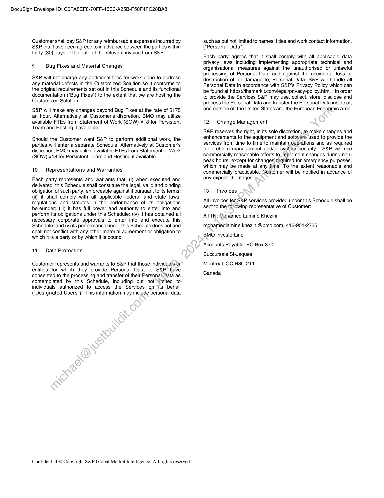
```  
```col-md
DocuSign Envelope ID: COFA8EF8-70FF-45E6-A25B-F50F4FC28BA8  
Customer shall pay S&P for any reimbursable expenses incurred by
S&P that have been agreed to in advance between the parties within
thirty (30) days of the date of the relevant invoice from S&P.  
9 Bug Fixes and Material Changes  
S&P will not charge any additional fees for work done to address
any material defects in the Customized Solution so it conforms to
the original requirements set out in this Schedule and its functional
documentation (“Bug Fixes”) to the extent that we are hosting the
Customized Solution.  
S&P will make any changes beyond Bug Fixes at the rate of $175
an hour. Alternatively at Customer's discretion, BMO may utilize
available FTEs from Statement of Work (SOW) #18 for Persistent
Team and Hosting if available.  
Should the Customer want S&P to perform additional work, the
parties will enter a separate Schedule. Alternatively at Customer's
discretion, BMO may utilize available FTEs from Statement of Work
(SOW) #18 for Persistent Team and Hosting if available.  
10 Representations and Warranties  
Each party represents and warrants that: (i) when executed and
delivered, this Schedule shall constitute the legal, valid and binding
obligation of such party, enforceable against it pursuant to its terms;
(ii) it shall comply with all applicable federal and state laws,
regulations and statutes in the performance of its obligations
hereunder; (iii) it has full power and authority to enter into and
perform its obligations under this Schedule; (iv) it has obtained all
necessary corporate approvals to enter into and execute this
Schedule; and (v) its performance under this Schedule does not and
shall not conflict with any other material agreement or obligation to
which it is a party or by which it is bound.  
11. Data Protection  
Customer represents and warrants to S&P that those individuals or
entities for which they provide Personal Data to S&P have
consented to the processing and transfer of their PersonalhData as
contemplated by this Schedule, including but not ‘limited to
individuals authorized to access the Services on ‘its behalf
(‘Designated Users”). This information may include personal data  
Confidential © Copyright S&P Global Market Intelligence. All rights reserved  
such as but not limited to names, titles and work contact information,
(‘Personal Data’).  
Each party agrees that it shall comply with all applicable data
privacy laws including implementing appropriate technical and
organisational measures against the unauthorised or unlawful
processing of Personal Data and against the accidental loss or
destruction of, or damage to, Personal Data. S&P will handle all
Personal Data in accordance with S&P’s Privacy Policy which can
be found at https://insmarkit.com/legal/privacy-policy.html. In order
to provide the Services S&P may use, collect, store, disclose and
process the Personal Data and transfer the Personal Data inside of,
and outside of, the United States and the European Economic Area.  
12 Change Management  
S&P reserves the right, in its sole discretion, te make changes and
enhancements to the equipment and software used to provide the
services from time to time to maintain_opeérations and as required
for problem management and/or system security. S&P will use
commercially reasonable efforts to implement changes during nonpeak hours, except for changes required for emergency purposes,
which may be made at any time. To the extent reasonable and
commercially practicable, Gustomer will be notified in advance of
any expected outages.  
13 Invoices  
All invoices for S&P services provided under this Schedule shall be
sent to thefollowing representative of Customer:  
ATTN: Mohamed Lamine Khezihi
mohamedlamine.khezihi@bmo.com, 416-951-2735
BMO InvestorLine  
Accounts Payable, PO Box 370  
Succursale St-Jaques  
Montreal, QC H3C 2T1  
Canada  
```
````
Notes:    
````col
```col-md
flexGrow=.5
===
> [!info] [Page 4](_attachments/images_BMO-3.6.1.21.200221980.pdf_211018/page_4.png)
> 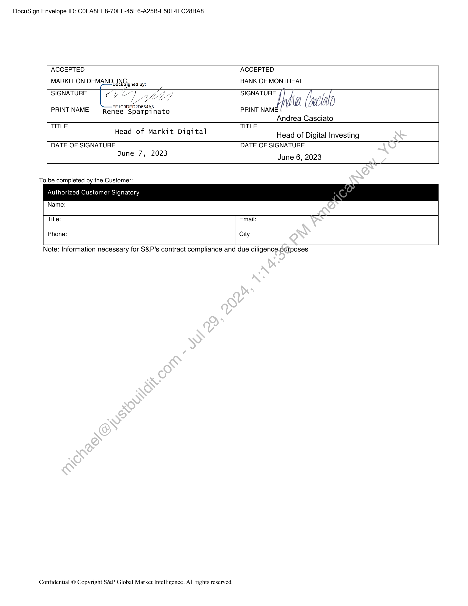
```  
```col-md
DocuSign Envelope ID: COFA8EF8-70FF-45E6-A25B-F50F4FC28BA8  
ACCEPTED  
MARKIT ON DEMAND, ING,, .
jocuSigned by:  
ACCEPTED
BANK OF MONTREAL  
SIGNATURE CVO) © SIGNATURE f] [J]
fe bl (a0
PRINT NAME nee Spamps PRINT NAME [
Renee Spampinato
Andrea Casciato
TITLE TITLE  
Head of Markit Digital  
Head of Digital Investing  
DATE OF SIGNATURE
June 7, 2023  
DATE OF SIGNATURE
June 6, 2023  
To be completed by the Customer:  
Authorized Customer Signatory  
Name:  
Title: Email:
Phone: City  
Note: Information necessary for S&P's contract compliance and due diligence.purposes  
Confidential © Copyright S&P Global Market Intelligence. All rights reserved  
```
````
Notes:    
````col
```col-md
flexGrow=.5
===
> [!info] [Page 5](_attachments/images_BMO-3.6.1.21.200221980.pdf_211018/page_5.png)
> 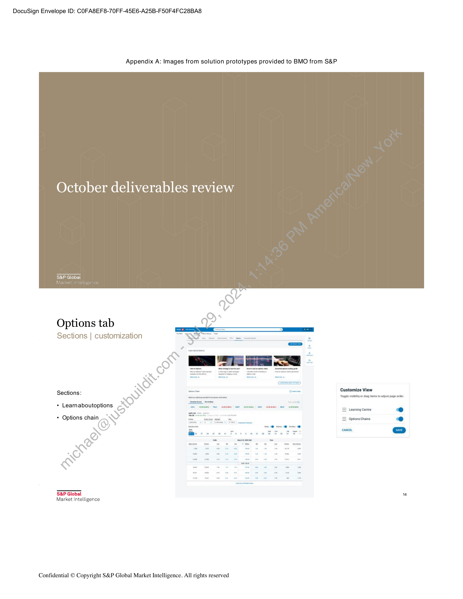
```  
```col-md
DocuSign Envelope ID: COFA8EF8-70FF-45E6-A25B-F50F4FC28BA8  
Appendix A: Images from solution prototypes provided to BMO from S&P  
October deliverables review  
S&P Global
h  
Options tab  
Sections | customization  
Sections:  
Customize View
+ Learnaboutoptions  
Toggle vib or drag ms to adjust page order
= Leeming Centre oO
* Options chain =  
Options Chains ry  
cance.  
S&P Global
Market Intelligence  
Confidential © Copyright S&P Global Market Intelligence. All rights reserved  
```
````
Notes:    
````col
```col-md
flexGrow=.5
===
> [!info] [Page 6](_attachments/images_BMO-3.6.1.21.200221980.pdf_211018/page_6.png)
> 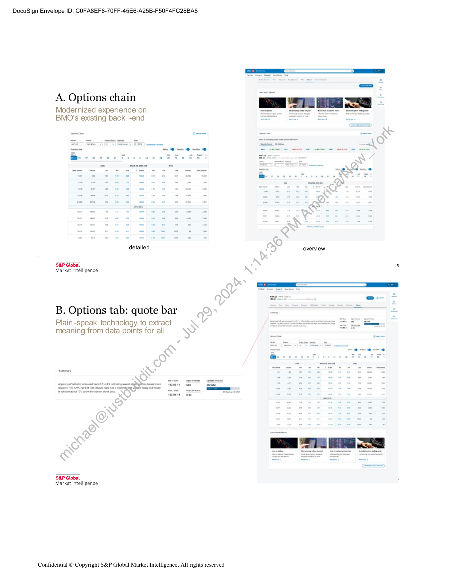
```  
```col-md
DocuSign Envelope ID: COFA8EF8-70FF-45E6-A25B-F50F4FC28BA8  
A. Options chain  
Modernized experience on
BMO’s existing back -end  
detailed overview  
S&P Global 15
Market Intelligence  
B. Options tab: quote bar =  
Plain-speak technology to extract
meaning from data points for all  
Summary  
1s2m2/1 643 asm  
1280/4 09s  
S&P Global
Market Intelligence  
Confidential © Copyright S&P Global Market Intelligence. All rights reserved  
```
````
Notes:    
````col
```col-md
flexGrow=.5
===
> [!info] [Page 7](_attachments/images_BMO-3.6.1.21.200221980.pdf_211018/page_7.png)
> 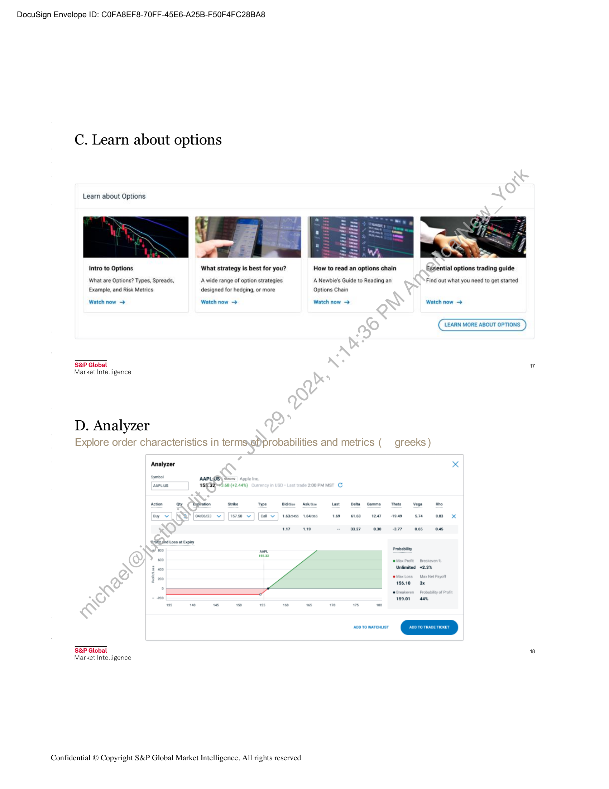
```  
```col-md
DocuSign Envelope ID: COFA8EF8-70FF-45E6-A25B-F50F4FC28BA8  
C. Learn about options  
Learn about Options  
Intro to Options  
What are Options? Types, Spreads,
Example, and Risk Metrics  
Watch now —>  
S&P Global  
What strategy is best for you?  
A wide range of option strategies
designed for hedging, or more  
Watch now >  
How to read an options chain Essential options trading guide  
A Newbie's Guide to Reading an
Options Chain  
Find out what you need to get started  
Watch now -> Watch now —>  
LEARN MORE ABOUT OPTIONS  
7  
Market Intelligence
D. Analyzer
Explore order characteristics in termsyeDprobabilities and metrics (_ greeks)  
Analyzer x  
‘ARPLUS 159323. ) mst ©  
of m0 aap a  
0 “ys001 aan  
00 To wareseust  
S&P Global 18  
Market Intelligence  
Confidential © Copyright S&P Global Market Intelligence. All rights reserved  
```
````
Notes:    
````col
```col-md
flexGrow=.5
===
> [!info] [Page 8](_attachments/images_BMO-3.6.1.21.200221980.pdf_211018/page_8.png)
> 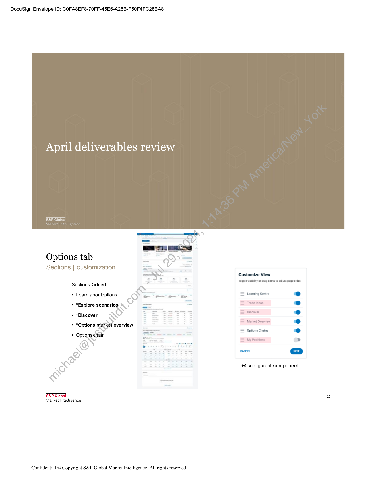
```  
```col-md
DocuSign Envelope ID: COFA8EF8-70FF-45E6-A25B-F50F4FC28BA8  
April deliverables review  
S&P Global  
Options tab  
Sections | customization  
Customize View
é ® Toggle visibility or drag items to adjust page order
Sections ‘added:
+ Learn aboutoptions —= Learning Centre
+ *Explore scenarios TeesDiscover
+ *Discover
Market Overview
+ *Options market overview
Options Chains
* Optionstchain a
ms My Positions >
+4 configurablecom ponens
S&P Global 20  
Market Intelligence  
Confidential © Copyright S&P Global Market Intelligence. All rights reserved  
```
````
Notes:    
````col
```col-md
flexGrow=.5
===
> [!info] [Page 9](_attachments/images_BMO-3.6.1.21.200221980.pdf_211018/page_9.png)
> 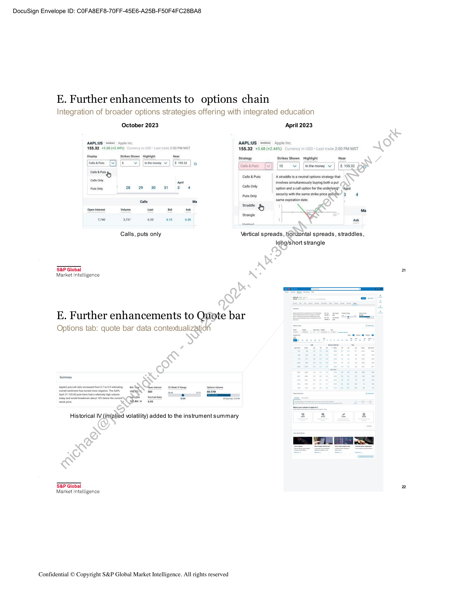
```  
```col-md
DocuSign Envelope ID: COFA8EF8-70FF-45E6-A25B-F50F4FC28BA8  
E. Further enhancements to options chain
Integration of broader options strategies offering with integrated education  
October 2023
AAPL:US ws040 Apple Inc
195.32 +3.68 (+2.44%) L ade 2:00 PM MST
Display Strikes Shown Hightight Near
Catsepus [wv] [6 | [Inmemoney v ] [s 195% ] g  
calls & Puts
Calls Only  
Puts Only  
Open interest  
7740  
S&P Global
Market intelligence  
Volume Last bid Ask  
3737 620 eas 630  
Calls, puts only  
AAPLIUS 1ss010  
155.32 +3,68 (+2.44%)  
Strategy  
Calis&Pus [Vv]
Calls & Puts
Calls Only
Puts Only  
Straddle &  
Strangle  
April 2023
Apple Inc
2:00 PM MST
Strikes Shown Highlight Near
{
{wo |  
Inthe money v | [$ 15532 d5e)  
A straddle is a neutral options strategy that  
involves simultaneously buying both a put  
Coption and a call option for the underlying” (agit
security with the same strike price andthe? 34
same expiration date  
|_ Nok ma  
Ask  
Vertical spreads, horizontal spreads, straddles,  
E. Further enhancements to Quote bar  
Options tab: quote bar data contextualization  
Summary  
Historical IV (implied volatility) added to the instrument summary  
S&P Global
Market Intelligence  
Confidential © Copyright S&P Global Market Intelligence. All rights reserved  
would breakeven abou 10% below the cure  
ad Aig Gren eres 2 Week W Rane
rstg ye a 7
mhisks parca aie _  
aaasa asa  
long/short strangle  
2  
Is
in
hy
{a  
```
````
Notes:    
````col
```col-md
flexGrow=.5
===
> [!info] [Page 10](_attachments/images_BMO-3.6.1.21.200221980.pdf_211018/page_10.png)
> 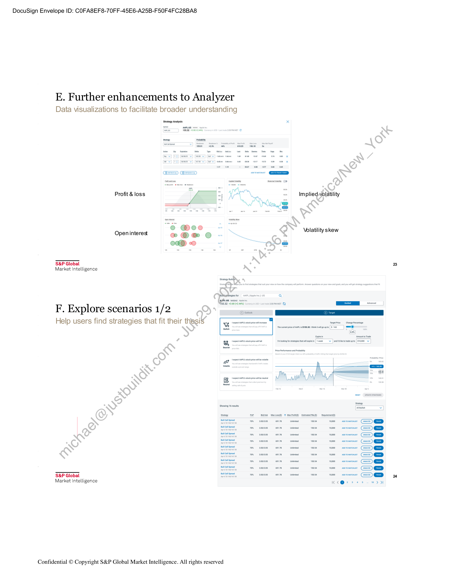
```  
```col-md
DocuSign Envelope ID: COFA8EF8-70FF-45E6-A25B-F50F4FC28BA8  
E. Further enhancements to Analyzer  
Data visualizations to facilitate broader understanding  
‘arategy Arai  
Profit & loss Implied-volatility  
Open interes wo  
@ @ee -.- e Volatility skew
e@ ; 4  
S&P Global
Market intelligence  
sategy Bath  
pMicasheeiesfor AAPL (Ape ne Us Q
Miss32 +368  
F. Explore scenarios 1/2
Help users find strategies that fit their thesi§  
Tape Change Pecemage
Tecunetpea tara NSSa2 Itekiealgowpe (Ss | KO)  
coin [teeet wv J eitate idevowe [s10000  
ao  
it Soiree  
sen Wr 2  
er ee oe vost me coroner Comer) QD  
S&P Global mm rene mnt ttm corner Comm) ED
Market Intelligence K<6@2 26 wD  
Confidential © Copyright S&P Global Market Intelligence. All rights reserved  
```
````
Notes:    
````col
```col-md
flexGrow=.5
===
> [!info] [Page 11](_attachments/images_BMO-3.6.1.21.200221980.pdf_211018/page_11.png)
> 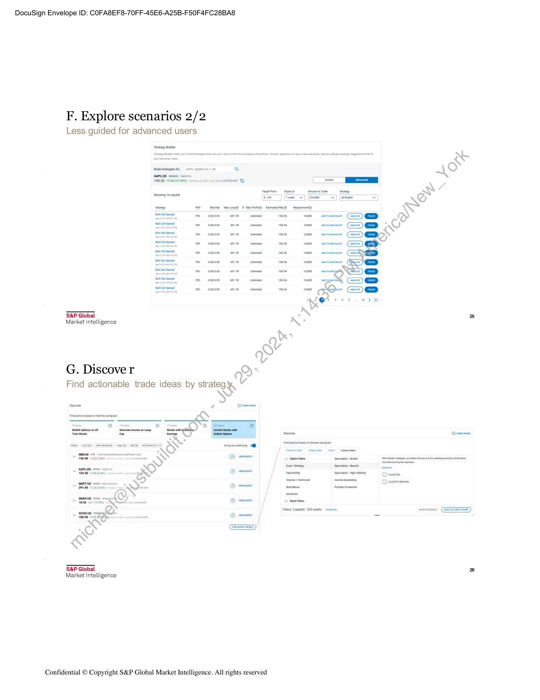
```  
```col-md
DocuSign Envelope ID: COFA8EF8-70FF-45E6-A25B-F50F4FC28BA8  
F. Explore scenarios 2/2
Less guided for advanced users  
ude  
AAPLUS Wusong Apseine  
155.32 93.68 +2448) concy n> Lan vse 2000MMST OQ a y,
senate tn RNY
shoving 6 resuts  
cc z] S
_ ve sett st) ju) mapas \S  
yO aoyacs emt vos 1apee  
ee a) ,O  
Pe pox anaes ewn7——_ntntad sos 1ap00
Pa pox anaes emn7 tte sos 10000
Pa pox anaes «= ean7——_ntntad wos 1ap00
Pa pox anaes ean7——Untntad sos 1000
Pa pox aoaaes —ean7——_untntad sos 1ap00
Pa pox anaes ewn78——_untntad wos 1as00
on pox anaes ean78——untnted wos 1as00
pox anaes ean7——Untnted wos 1ap00
S&P Global N 2
Market Intelligence \N .  
G. Discove r & s
Find actionable trade ideas by strategy.
ee > ais
im 2 elie wl — =. oe
== = _ _
= omovies pore al
: De sa ts | RO  
— —— Flr angles 25 eats cata _ —— Ga)
on 80 90 ae o)  
S&P Global 26  
Market Intelligence  
Confidential © Copyright S&P Global Market Intelligence. All rights reserved  
```
````
Notes:    
````col
```col-md
flexGrow=.5
===
> [!info] [Page 12](_attachments/images_BMO-3.6.1.21.200221980.pdf_211018/page_12.png)
> 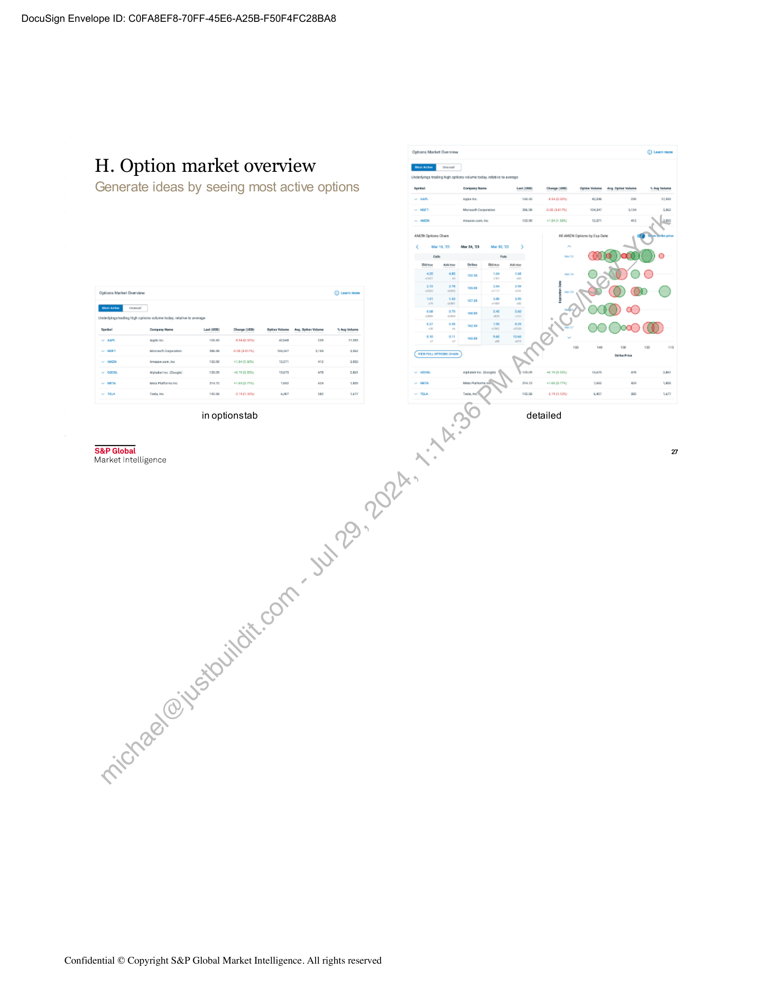
```  
```col-md
DocuSign Envelope ID: COFA8EF8-70FF-45E6-A25B-F50F4FC28BA8  
H. Option market overview =x =
Generate ideas by seeing most active options nt on satan mpm) amen pgs  
in optionstab a& detailed  
S&P Global
Market Intelligence \N .  
Confidential © Copyright S&P Global Market Intelligence. All rights reserved  
```
````
Notes:    
````col
```col-md
flexGrow=.5
===
> [!info] [Page 13](_attachments/images_BMO-3.6.1.21.200221980.pdf_211018/page_13.png)
> 
```  
```col-md
DocuSign Envelope ID: COFA8EF8-70FF-45E6-A25B-F50F4FC28BA8  
Appendix B - Provision of third party data as part of the Customized Solution  
Subject to the terms of the Schedule and this Appendix B, S&P will license the Data Inputs (as defined below) listed in the Schedule:  
3.2.  
5.1.  
5.2.  
Definitions.
“Data Provider(s)” means the S&P third-party data providers of the Data Input; and
“Data Input(s)” means third party data listed in the Schedule and provided by Data Providers.  
Reporting. Customer acknowledges and agrees that S&P (to the extent required under any licenses or agreements that S&P has with any
Data Provider), may provide such Data Provider(s) with the identity of Customer, contact details of Customer representative and Customer's
usage of the Data Inputs and any other reasonable information requested by Data Providers (if required).  
Disclaimer and limitation of liability.  
. S&P provides Data Inputs as part of the Customized Solution and Customer agrees that Data Inputs are provided by Data Providers on an  
“as is” basis. S&P and such Data Providers make no warranty, express or implied, nor shall they have any liability in relationto, the accuracy,
timeliness or completeness of the information provided by the Data Providers or for any data delays, interruptions, or-omissions or the results
to be attained by Customer or others from the use of the Customized Solution and the Data Inputs. Customer.hereby acknowledges that
there are no express or implied warranties of title, fitness for a particular purpose or use, and that Customer has not relied upon any warranty,
guarantee or representation made by S&P or any Data Provider. Data Providers shall have no liability to Customer for any direct, indirect,
special or consequential damages (including loss of profits) arising in connection with use thereof or,réeliance thereon by Customer. All
proprietary and intellectual property rights in the Data Input belongs to the applicable Data Providers and/or its or their licensors and are not
transferred or modified by the Schedule. Data Input provided by the Data Providers is to be used solély'and exclusively under the Schedule
for the purposes set forth in the Schedule.  
The maximum liability of S&P and Data Providers to Customer for all claims under the Agreement and the Schedule in connection with the
Data Inputs, whether in contract, in tort (including negligence), under a warranty (express-or implied), under statute or otherwise, will be
limited to financial compensation up to a sum not to exceed the Fees payable by Customer to’S&P in the prior twelve (12) months under the
Schedule.  
Intellectual Property. The Intellectual Property Rights in the Data Inputs and any.deliverables, enhancements, revisions, updates, upgrades,
modifications, customizations thereof or thereto, and any processes or workflows developed and incorporated therein or pertaining thereto
shall vest in and remain with S&P, its Affiliates and/or the Data Providers,*as*applicable and shall under no circumstances constitute or
otherwise be deemed a work for hire.  
Restrictions.  
Customer shall:- (i) not alter, destroy or remove any copyright, trademark or other proprietary or legal markings or notices placed upon or
contained within the Data Inputs; and (ii) display the applicable copyrights, trademarks or other proprietary or legal marking or notices notified
by S&P to Customer from time to time.  
Customer shall not resell, rent, lease, share, or otherwise-distribute the Data Input or otherwise commercialize, productize or otherwise
access, use display or make available the Data Input for any purposes not expressly permitted herein.  
Confidential © Copyright S&P Global Market Intelligence. All rights reserved  
```
````
Notes:  


![[_attachments/BMO-3.6.1.21.2 00221980.pdf]