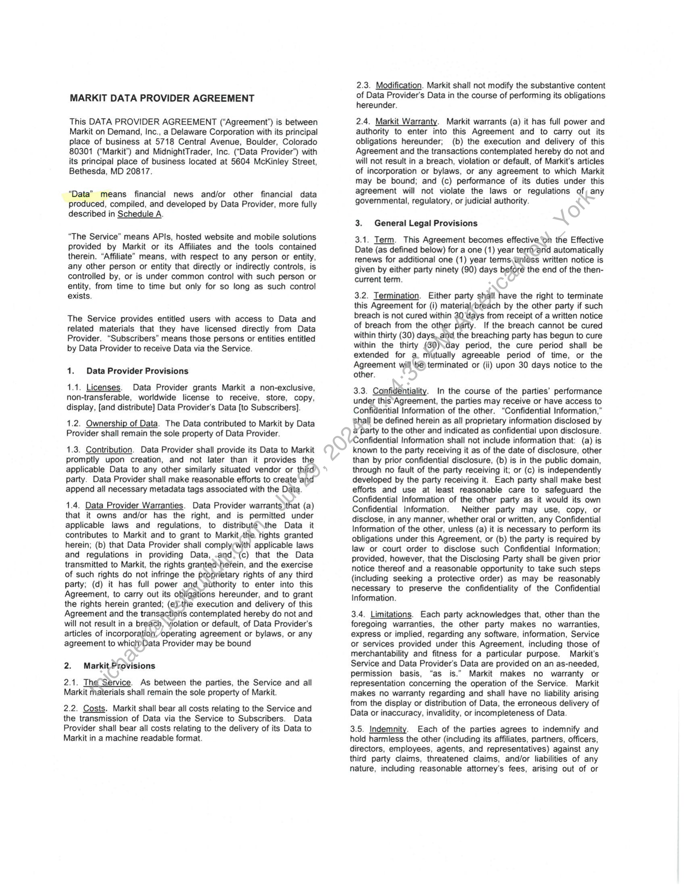
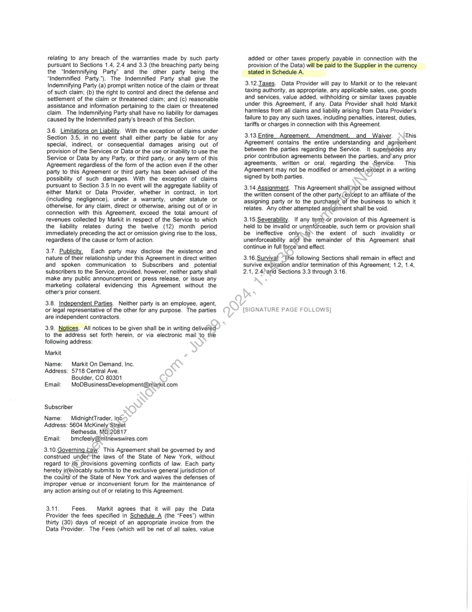
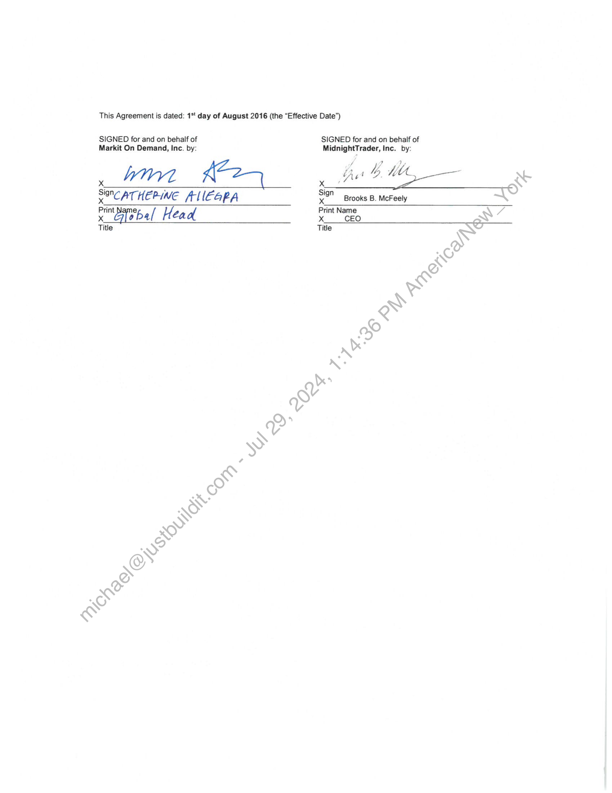

##### Markit Data Provider Agreement]

  
````col
```col-md
flexGrow=.5
===
> [!info] [Page 1](_attachments/images_BMO-3.6.1.21.300221851.pdf_210501/page_1.png)
> 
```  
```col-md
MARKIT DATA PROVIDER AGREEMENT  
This DATA PROVIDER AGREEMENT (“Agreement”) is between
Markit on Demand, Inc., a Delaware Corporation with its principal
place of business at 5718 Central Avenue, Boulder, Colorado
80301 (“Markit”) and MidnightTrader, Inc. (“Data Provider”) with
its principal place of business located at 5604 McKinley Street,
Bethesda, MD 20817.  
“Data” means financial news and/or other financial data
produced, compiled, and developed by Data Provider, more fully
described in Schedule A.  
“The Service” means APIs, hosted website and mobile solutions
provided by Markit or its Affiliates and the tools contained
therein. “Affiliate” means, with respect to any person or entity,
any other person or entity that directly or indirectly controls, is
controlled by, or is under common control with such person or
entity, from time to time but only for so long as such control
exists.  
The Service provides entitled users with access to Data and
related materials that they have licensed directly from Data
Provider. “Subscribers” means those persons or entities entitled
by Data Provider to receive Data via the Service.  
1. Data Provider Provisions  
1.1. Licenses. Data Provider grants Markit a non-exclusive,
non-transferable, worldwide license to receive, store, copy,
display, [and distribute] Data Provider's Data [to Subscribers].  
1.2. Ownership of Data. The Data contributed to Markit by Data
Provider shall remain the sole property of Data Provider.  
1.3. Contribution. Data Provider shall provide its Data to Markit
promptly upon creation, and not later than it provides the
applicable Data to any other similarly situated vendor or third
party. Data Provider shall make reasonable efforts to create and
append all necessary metadata tags associated with the Data.  
1.4. Data Provider Warranties. Data Provider warrants )that (a)
that it owns and/or has the right, and is permitted under
applicable laws and regulations, to distributé\the Data it
contributes to Markit and to grant to Markit the tights granted
herein; (b) that Data Provider shall comply¢with applicable laws
and regulations in providing Data, .and(c) that the Data
transmitted to Markit, the rights granted\ierein, and the exercise
of such rights do not infringe the proprietary rights of any third
party; (d) it has full power and ‘authority to enter into this
Agreement, to carry out its obligations hereunder, and to grant
the rights herein granted; (e-the execution and delivery of this
Agreement and the transactiofis contemplated hereby do not and
will not result in a breach, violation or default, of Data Provider's
articles of incorporation,/operating agreement or bylaws, or any
agreement to whictpData Provider may be bound  
2. Markit Provisions  
2.1. The Service. As between the parties, the Service and all
Markit materials shall remain the sole property of Markit.  
2.2. Costs. Markit shall bear all costs relating to the Service and
the transmission of Data via the Service to Subscribers. Data
Provider shall bear all costs relating to the delivery of its Data to
Markit in a machine readable format.  
2.3. Modification. Markit shall not modify the substantive content
of Data Provider's Data in the course of performing its obligations
hereunder.  
2.4. Markit Warranty. Markit warrants (a) it has full power and
authority to enter into this Agreement and to carry out its
obligations hereunder; (b) the execution and delivery of this
Agreement and the transactions contemplated hereby do not and
will not result in a breach, violation or default, of Markit's articles
of incorporation or bylaws, or any agreement to which Markit
may be bound; and (c) performance of its duties under this
agreement will not violate the laws or regulations of) any
governmental, regulatory, or judicial authority.  
3. General Legal Provisions  
3.1. Term. This Agreement becomes effective ‘on the Effective
Date (as defined below) for a one (1) year terravand automatically
renews for additional one (1) year terms\Unléss written notice is
given by either party ninety (90) days before the end of the thencurrent term.  
3.2. Termination. Either party shall have the right to terminate
this Agreement for (i) materialybreach by the other party if such
breach is not cured within 30 days from receipt of a written notice
of breach from the other party. If the breach cannot be cured
within thirty (30) days, and the breaching party has begun to cure
within the thirty (80)\day period, the cure period shall be
extended for a. mutually agreeable period of time, or the
Agreement will be) terminated or (ii) upon 30 days notice to the
other.  
3.3. Confidentiality. In the course of the parties’ performance
under this‘Agreement, the parties may receive or have access to
Confidential Information of the other. “Confidential Information,”
shall be defined herein as all proprietary information disclosed by
a party to the other and indicated as confidential upon disclosure.
Confidential Information shall not include information that: (a) is
known to the party receiving it as of the date of disclosure, other
than by prior confidential disclosure, (b) is in the public domain,
through no fault of the party receiving it; or (c) is independently
developed by the party receiving it. Each party shall make best
efforts and use at least reasonable care to safeguard the
Confidential Information of the other party as it would its own
Confidential Information. Neither party may use, copy, or
disclose, in any manner, whether oral or written, any Confidential
Information of the other, unless (a) it is necessary to perform its
obligations under this Agreement, or (b) the party is required by
law or court order to disclose such Confidential Information;
provided, however, that the Disclosing Party shall be given prior
notice thereof and a reasonable opportunity to take such steps
(including seeking a protective order) as may be reasonably
necessary to preserve the confidentiality of the Confidential
Information.  
3.4. Limitations. Each party acknowledges that, other than the
foregoing warranties, the other party makes no warranties,
express or implied, regarding any software, information, Service
or services provided under this Agreement, including those of
merchantability and fitness for a particular purpose. Markit's
Service and Data Provider's Data are provided on an as-needed,
permission basis, “as is.” Markit makes no warranty or
representation concerning the operation of the Service. Markit
makes no warranty regarding and shall have no liability arising
from the display or distribution of Data, the erroneous delivery of
Data or inaccuracy, invalidity, or incompleteness of Data.  
3.5. Indemnity. Each of the parties agrees to indemnify and
hold harmless the other (including its affiliates, partners, officers,
directors, employees, agents, and representatives) against any
third party claims, threatened claims, and/or liabilities of any
nature, including reasonable attorney's fees, arising out of or  
```
````
Notes:    
````col
```col-md
flexGrow=.5
===
> [!info] [Page 2](_attachments/images_BMO-3.6.1.21.300221851.pdf_210501/page_2.png)
> 
```  
```col-md
relating to any breach of the warranties made by such party
pursuant to Sections 1.4, 2.4 and 3.3 (the breaching party being
the “Indemnifying Party” and the other party being the
“Indemnified Party.”). The Indemnified Party shall give the
Indemnifying Party (a) prompt written notice of the claim or threat
of such claim; (b) the right to control and direct the defense and
settlement of the claim or threatened claim; and (c) reasonable
assistance and information pertaining to the claim or threatened
claim. The Indemnifying Party shall have no liability for damages
caused by the Indemnified party's breach of this Section.  
3.6. Limitations on Liability. With the exception of claims under
Section 3.5, in no event shall either party be liable for any
special, indirect, or consequential damages arising out of
provision of the Services or Data or the use or inability to use the
Service or Data by any Party, or third party, or any term of this
Agreement regardless of the form of the action even if the other
party to this Agreement or third party has been advised of the
possibility of such damages. With the exception of claims
pursuant to Section 3.5 In no event will the aggregate liability of
either Markit or Data Provider, whether in contract, in tort
(including negligence), under a warranty, under statute or
otherwise, for any claim, direct or otherwise, arising out of or in
connection with this Agreement, exceed the total amount of
revenues collected by Markit in respect of the Service to which
the liability relates during the twelve (12) month period
immediately preceding the act or omission giving rise to the loss,
regardless of the cause or form of action.  
3.7. Publicity. Each party may disclose the existence and
nature of their relationship under this Agreement in direct written
and spoken communication to Subscribers and potential
subscribers to the Service, provided, however, neither party shall
make any public announcement or press release, or issue any
marketing collateral evidencing this Agreement without the
other’s prior consent.  
3.8. Independent Parties. Neither party is an employee, agent,
or legal representative of the other for any purpose. The parties
are independent contractors.  
3.9. Notices. All notices to be given shall be in writing delivered
to the address set forth herein, or via electronic mail ‘to the
following address:  
Markit  
Name: Markit On Demand, Inc.
Address: 5718 Central Ave.
Boulder, CO 80301
Email: MoDBusinessDevelopment@miarkit.com  
Subscriber  
Name:  MidnightTrader, InGs  
Address: 5604 McKinely’Street
Bethesda, MO)20817  
Email: bmcfeely@mtnewswires.com  
3.10.Governing aw. This Agreement shall be governed by and
construed under-the laws of the State of New York, without
regard to’ its provisions governing conflicts of law. Each party
hereby irfeyocably submits to the exclusive general jurisdiction of
the courts of the State of New York and waives the defenses of
improper venue or inconvenient forum for the maintenance of
any action arising out of or relating to this Agreement.  
3.11. Fees. Markit agrees that it will pay the Data
Provider the fees specified in Schedule A (the “Fees”) within
thirty (30) days of receipt of an appropriate invoice from the
Data Provider. The Fees (which will be net of all sales, value  
added or other taxes properly payable in connection with the
provision of the Data) will be paid to the Supplier in the currency
stated in Schedule A.  
3.12.Taxes. Data Provider will pay to Markit or to the relevant
taxing authority, as appropriate, any applicable sales, use, goods
and services, value added, withholding or similar taxes payable
under this Agreement, if any. Data Provider shall hold Markit
harmless from all claims and liability arising from Data Provider's
failure to pay any such taxes, including penalties, interest, duties,
tariffs or charges in connection with this Agreement.  
3.13.Entire_ Agreement, Amendment, and__Waiver. This  
Agreement contains the entire understanding and agreement
between the parties regarding the Service. It supersedes any
prior contribution agreements between the parties, and’any prior
agreements, written or oral, regarding the Service. This
Agreement may not be modified or amended,except in a writing
signed by both parties.  
3.14.Assignment. This Agreement shalimot be assigned without
the written consent of the other party(except to an affiliate of the
assigning party or to the purchaser of the business to which it
relates. Any other attempted assigriment shall be void.  
3.15.Severability. If any termsor provision of this Agreement is
held to be invalid or unenforceable, such term or provision shall
be ineffective only~to’ the extent of such invalidity or
unenforceability agfd) the remainder of this Agreement shall
continue in full force‘and effect.  
3.16.Survival: “The following Sections shall remain in effect and
survive expiration and/or termination of this Agreement; 1.2, 1.4,
2.1, 2.4and Sections 3.3 through 3.16.  
[SIGNATURE PAGE FOLLOWS]  
```
````
Notes:    
````col
```col-md
flexGrow=.5
===
> [!info] [Page 3](_attachments/images_BMO-3.6.1.21.300221851.pdf_210501/page_3.png)
> 
```  
```col-md
This Agreement is dated: 1** day of August 2016 (the “Effective Date”)  
SIGNED for and on behalf of  
SIGNED for and on behalf of
MidnightTrader, Inc. by:  
Markit On Demand, Inc. by:  
MMA _ 4a #24 fe BMG x
SINC ATHEPINE AIEGPA el Brooks B. McFeely  
cil Stee / Hea a x ae : RY 7
&
AS)
‘\
Cs  
```
````
Notes:  


![[_attachments/BMO-3.6.1.21.3 00221851.pdf]