##### Schedule 26: BMO Nesbitt Burns Acceleration]

  
````col
```col-md
flexGrow=.5
===
> [!info] [Page 1](_attachments/images_BMO-3.6.1.21.400221940.pdf_212059/page_1.png)
> 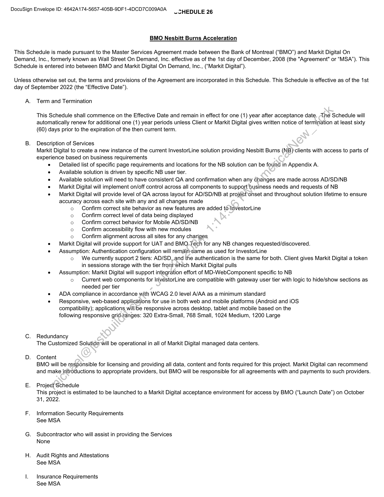
```  
```col-md
DocuSign Envelope ID: 4642A174-5657-405B-9DF1-4DCD7CO09A0A  SHEDULE 26  
BMO Nesbitt Burns Acceleration  
This Schedule is made pursuant to the Master Services Agreement made between the Bank of Montreal (“BMO”) and Markit Digital On
Demand, Inc., formerly known as Wall Street On Demand, Inc. effective as of the 1st day of December, 2008 (the "Agreement" or “MSA”). This
Schedule is entered into between BMO and Markit Digital On Demand, Inc., (“Markit Digital”).  
Unless otherwise set out, the terms and provisions of the Agreement are incorporated in this Schedule. This Schedule is effective as of the 1st
day of September 2022 (the “Effective Date”).  
A. Term and Termination  
This Schedule shall commence on the Effective Date and remain in effect for one (1) year after acceptance date. 7,he Schedule will
automatically renew for additional one (1) year periods unless Client or Markit Digital gives written notice of termination at least sixty
(60) days prior to the expiration of the then current term.  
B. Description of Services
Markit Digital to create a new instance of the current InvestorLine solution providing Nesbitt Burns (NB)-clients with access to parts of
experience based on business requirements
e Detailed list of specific page requirements and locations for the NB solution can be found in Appendix A.
e Available solution is driven by specific NB user tier.
e Available solution will need to have consistent QA and confirmation when any changes are made across AD/SD/NB
e = Markit Digital will implement on/off control across all components to support business needs and requests of NB
e — Markit Digital will provide level of QA across layout for AD/SD/NB at project‘onset and throughout solution lifetime to ensure
accuracy across each site with any and all changes made
o Confirm correct site behavior as new features are added to InvestorLine
o Confirm correct level of data being displayed
o Confirm correct behavior for Mobile AD/SD/NB
o Confirm accessibility flow with new modules
o Confirm alignment across all sites for any changes
e — Markit Digital will provide support for UAT and BMO-Yech for any NB changes requested/discovered.
e Assumption: Authentication configuration will remain-same as used for InvestorLine
o  Wecurrently support 2 tiers: AD/SD, and the authentication is the same for both. Client gives Markit Digital a token
in sessions storage with the tier fronmwhich Markit Digital pulls
e — Assumption: Markit Digital will support integration effort of MD-WebComponent specific to NB
o Current web components for investorLine are compatible with gateway user tier with logic to hide/show sections as
needed per tier
e ADA compliance in accordance with WCAG 2.0 level A/AA as a minimum standard
e Responsive, web-based applications for use in both web and mobile platforms (Android and iOS
compatibility); applications willbe responsive across desktop, tablet and mobile based on the
following responsive gric\ranges: 320 Extra-Small, 768 Small, 1024 Medium, 1200 Large  
C. Redundancy
The Customized Solution-will be operational in all of Markit Digital managed data centers.  
D. Content
BMO will be responsible for licensing and providing all data, content and fonts required for this project. Markit Digital can recommend
and make introductions to appropriate providers, but BMO will be responsible for all agreements with and payments to such providers.  
E. Project Schedule
This project is estimated to be launched to a Markit Digital acceptance environment for access by BMO (“Launch Date”) on October  
31, 2022.  
F. Information Security Requirements
See MSA  
G. Subcontractor who will assist in providing the Services
None  
H. Audit Rights and Attestations
See MSA  
|. Insurance Requirements
See MSA  
```
````
Notes:    
````col
```col-md
flexGrow=.5
===
> [!info] [Page 2](_attachments/images_BMO-3.6.1.21.400221940.pdf_212059/page_2.png)
> 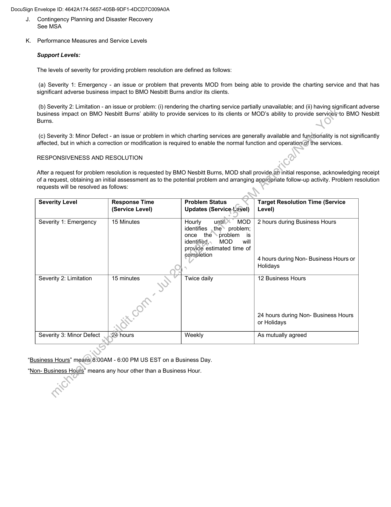
```  
```col-md
DocuSign Envelope ID: 4642A174-5657-405B-9DF1-4DCD7CO09A0A  
J. Contingency Planning and Disaster Recovery
See MSA  
K. Performance Measures and Service Levels
Support Levels:
The levels of severity for providing problem resolution are defined as follows:  
(a) Severity 1: Emergency - an issue or problem that prevents MOD from being able to provide the charting service and that has
significant adverse business impact to BMO Nesbitt Burns and/or its clients.  
(b) Severity 2: Limitation - an issue or problem: (i) rendering the charting service partially unavailable; and (ii) having significant adverse
business impact on BMO Nesbitt Burns’ ability to provide services to its clients or MOD’s ability to provide services*to BMO Nesbitt
Burns.  
(c) Severity 3: Minor Defect - an issue or problem in which charting services are generally available and functionality is not significantly
affected, but in which a correction or modification is required to enable the normal function and operation‘of the services.  
RESPONSIVENESS AND RESOLUTION  
After a request for problem resolution is requested by BMO Nesbitt Burns, MOD shall provide.an initial response, acknowledging receipt
of a request, obtaining an initial assessment as to the potential problem and arranging appropriate follow-up activity. Problem resolution
requests will be resolved as follows:  
Severity Level Response Time Problem Status Target Resolution Time (Service
(Service Level) Updates (Service-Level) | Level)
Severity 1: Emergency 15 Minutes Hourly until MOD | 2 hours during Business Hours  
identifies .the* problem;
once the \problem_ is
identified, MOD will
provide estimated time of  
egrapletion 4 hours during Non- Business Hours or
Holidays
Severity 2: Limitation 15 minutes Twice daily 12 Business Hours
24 hours during Non- Business Hours
or Holidays
Severity 3: Minor Defect 24 hours Weekly As mutually agreed  
“Business Hours” means 8:00AM - 6:00 PM US EST on a Business Day.  
“Non- Business Hours” means any hour other than a Business Hour.  
```
````
Notes:    
````col
```col-md
flexGrow=.5
===
> [!info] [Page 3](_attachments/images_BMO-3.6.1.21.400221940.pdf_212059/page_3.png)
> 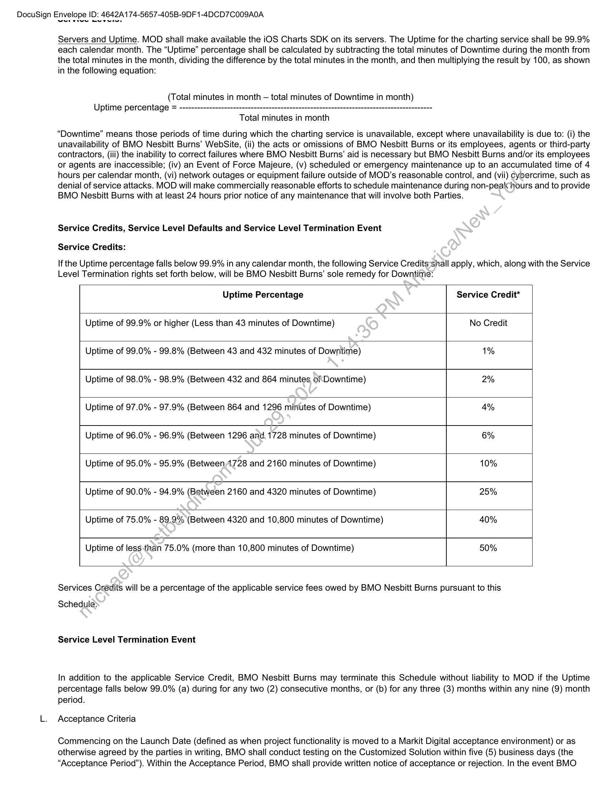
```  
```col-md
DocuSign Envelope ID: 4642A174-5657-405B-9DF1-4DCD7CO09A0A  
Servers and Uptime. MOD shall make available the iOS Charts SDK on its servers. The Uptime for the charting service shall be 99.9%
each calendar month. The “Uptime” percentage shall be calculated by subtracting the total minutes of Downtime during the month from
the total minutes in the month, dividing the difference by the total minutes in the month, and then multiplying the result by 100, as shown
in the following equation:  
(Total minutes in month — total minutes of Downtime in month)
Uptime percentage = -------------------------------------------- 2 nnn 22a annem nn nnn anne nnn nnn
Total minutes in month  
“Downtime” means those periods of time during which the charting service is unavailable, except where unavailability is due to: (i) the
unavailability of BMO Nesbitt Burns’ WebSite, (ii) the acts or omissions of BMO Nesbitt Burns or its employees, agents or third-party
contractors, (iii) the inability to correct failures where BMO Nesbitt Burns’ aid is necessary but BMO Nesbitt Burns and/or its employees
or agents are inaccessible; (iv) an Event of Force Majeure, (v) scheduled or emergency maintenance up to an accumulated time of 4
hours per calendar month, (vi) network outages or equipment failure outside of MOD’s reasonable control, and (vii) cyoercrime, such as
denial of service attacks. MOD will make commercially reasonable efforts to schedule maintenance during non-peak hours and to provide
BMO Nesbitt Burns with at least 24 hours prior notice of any maintenance that will involve both Parties.  
Service Credits, Service Level Defaults and Service Level Termination Event  
Service Credits:  
If the Uptime percentage falls below 99.9% in any calendar month, the following Service Credits:shall apply, which, along with the Service
Level Termination rights set forth below, will be BMO Nesbitt Burns’ sole remedy for Downtime:
Uptime Percentage Service Credit*  
Uptime of 99.9% or higher (Less than 43 minutes of Downtime) No Credit
Uptime of 99.0% - 99.8% (Between 43 and 432 minutes of Downtime) 1%
Uptime of 98.0% - 98.9% (Between 432 and 864 minutes of Downtime) 2%
Uptime of 97.0% - 97.9% (Between 864 and 1296 minutes of Downtime) 4%
Uptime of 96.0% - 96.9% (Between 1296 and. 1728 minutes of Downtime) 6%
Uptime of 95.0% - 95.9% (Between4.728 and 2160 minutes of Downtime) 10%
Uptime of 90.0% - 94.9% (Between 2160 and 4320 minutes of Downtime) 25%
Uptime of 75.0% - 89.9% (Between 4320 and 10,800 minutes of Downtime) 40%
Uptime of lessfhan 75.0% (more than 10,800 minutes of Downtime) 50%  
Services Crédits will be a percentage of the applicable service fees owed by BMO Nesbitt Burns pursuant to this
Schedule?  
Service Level Termination Event  
In addition to the applicable Service Credit, BMO Nesbitt Burns may terminate this Schedule without liability to MOD if the Uptime
percentage falls below 99.0% (a) during for any two (2) consecutive months, or (b) for any three (3) months within any nine (9) month
period.  
L. Acceptance Criteria  
Commencing on the Launch Date (defined as when project functionality is moved to a Markit Digital acceptance environment) or as
otherwise agreed by the parties in writing, BMO shall conduct testing on the Customized Solution within five (5) business days (the
“Acceptance Period”). Within the Acceptance Period, BMO shall provide written notice of acceptance or rejection. In the event BMO  
```
````
Notes:    
````col
```col-md
flexGrow=.5
===
> [!info] [Page 4](_attachments/images_BMO-3.6.1.21.400221940.pdf_212059/page_4.png)
> 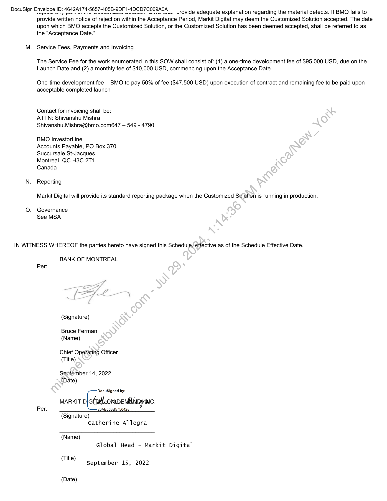
```  
```col-md
DocuSign Envelope |D: 4642A174-5657-405B-9DF 1-4DCD7COOSA0A provide adequate explanation regarding the material defects. If BMO fails to  
provide written notice of rejection within the Acceptance Period, Markit Digital may deem the Customized Solution accepted. The date
upon which BMO accepts the Customized Solution, or the Customized Solution has been deemed accepted, shall be referred to as
the "Acceptance Date."  
M. Service Fees, Payments and Invoicing  
The Service Fee for the work enumerated in this SOW shall consist of: (1) a one-time development fee of $95,000 USD, due on the
Launch Date and (2) a monthly fee of $10,000 USD, commencing upon the Acceptance Date.  
One-time development fee — BMO to pay 50% of fee ($47,500 USD) upon execution of contract and remaining fee to be paid upon
acceptable completed launch  
Contact for invoicing shall be:
ATTN: Shivanshu Mishra
Shivanshu.Mishra@bmo.com647 — 549 - 4790  
BMO InvestorLine  
Accounts Payable, PO Box 370
Succursale St-Jacques
Montreal, QC H3C 2T1  
Canada  
N. Reporting
Markit Digital will provide its standard reporting package when the Customized Solution is running in production.  
O. Governance
See MSA  
IN WITNESS WHEREOF the parties hereto have signed this Schedule, effective as of the Schedule Effective Date.  
BANK OF MONTREAL
Per:  
(Signature)  
Bruce Ferman
(Name)  
Chief Operating Officer
(Title)  
September 14, 2022.
(Date)  
DocuSigned by:  
MARKIT D cfalonimebinyasc.  
Per: 26AE663B5756428.
(Signature)
Catherine Allegra  
(Name)
Global Head - Markit Digital  
(Title)
September 15, 2022  
(Date)  
```
````
Notes:    
````col
```col-md
flexGrow=.5
===
> [!info] [Page 5](_attachments/images_BMO-3.6.1.21.400221940.pdf_212059/page_5.png)
> 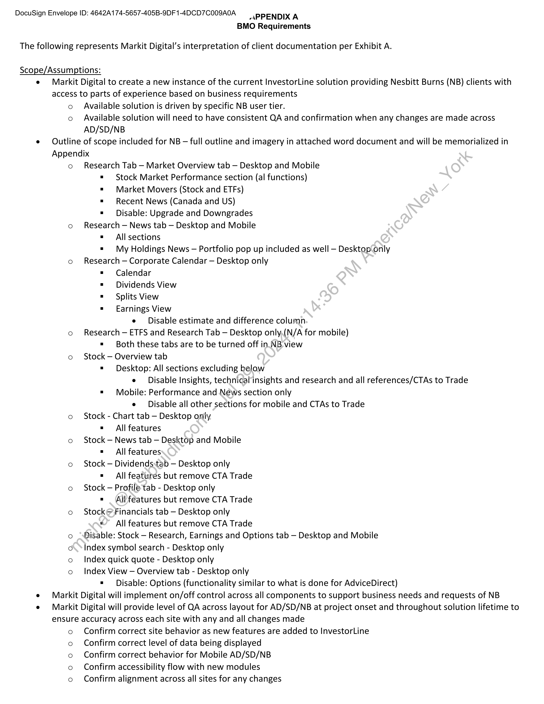
```  
```col-md
DocuSign Envelope ID: 4642A174-5657-405B-9DF1-4DCD7CO09A0A APPENDIX A  
BMO Requirements  
The following represents Markit Digital’s interpretation of client documentation per Exhibit A.  
Scope/Assumptions:  
e =Markit Digital to create a new instance of the current InvestorLine solution providing Nesbitt Burns (NB) clients with
access to parts of experience based on business requirements
o Available solution is driven by specific NB user tier.
o Available solution will need to have consistent QA and confirmation when any changes are made across
AD/SD/NB
e Outline of scope included for NB — full outline and imagery in attached word document and will be memorialized in
Appendix
o Research Tab — Market Overview tab — Desktop and Mobile
= Stock Market Performance section (al functions)
= Market Movers (Stock and ETFs)
= Recent News (Canada and US)
= Disable: Upgrade and Downgrades
o Research — News tab — Desktop and Mobile
= All sections
= My Holdings News — Portfolio pop up included as well — Desktoponly
o Research — Corporate Calendar — Desktop only
= Calendar
= Dividends View
= Splits View
= Earnings View
e Disable estimate and difference column
o Research - ETFS and Research Tab — Desktop only,(N/A for mobile)
= Both these tabs are to be turned off in NB view
o Stock — Overview tab
= Desktop: All sections excluding below
e Disable Insights, technical insights and research and all references/CTAs to Trade
= Mobile: Performance and News section only
e Disable all other sections for mobile and CTAs to Trade
o Stock - Chart tab — Desktop only
= All features
o Stock — News tab — Desktop and Mobile
= All features
o Stock — Dividends:tab — Desktop only
= All features but remove CTA Trade
o Stock — Profile tab - Desktop only
= _ Allfeatures but remove CTA Trade
o Stock@-Financials tab — Desktop only
«” All features but remove CTA Trade
Disable: Stock — Research, Earnings and Options tab — Desktop and Mobile
Index symbol search - Desktop only
Index quick quote - Desktop only
Index View — Overview tab - Desktop only
= Disable: Options (functionality similar to what is done for AdviceDirect)
e¢ = Markit Digital will implement on/off control across all components to support business needs and requests of NB
e = Markit Digital will provide level of QA across layout for AD/SD/NB at project onset and throughout solution lifetime to
ensure accuracy across each site with any and all changes made
o Confirm correct site behavior as new features are added to InvestorLine
Confirm correct level of data being displayed
Confirm correct behavior for Mobile AD/SD/NB
Confirm accessibility flow with new modules
Confirm alignment across all sites for any changes  
000 0  
o 00 0  
```
````
Notes:    
````col
```col-md
flexGrow=.5
===
> [!info] [Page 6](_attachments/images_BMO-3.6.1.21.400221940.pdf_212059/page_6.png)
> 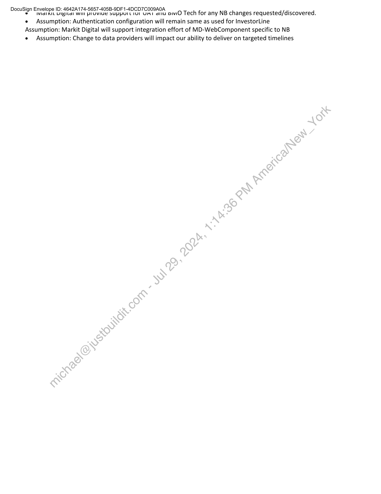
```  
```col-md
DocuSign Envelope ID: 4642A174-5657-405B-9DF 1-4DCD7CO09A0A .
2 Var ait VIgILdl WII PrUVIUE SUPPUILIUT VAI du piviO Tech for any NB changes requested/discovered.  
e Assumption: Authentication configuration will remain same as used for InvestorLine
Assumption: Markit Digital will support integration effort of MD-WebComponent specific to NB
e Assumption: Change to data providers will impact our ability to deliver on targeted timelines  
```
````
Notes:    
````col
```col-md
flexGrow=.5
===
> [!info] [Page 7](_attachments/images_BMO-3.6.1.21.400221940.pdf_212059/page_7.png)
> 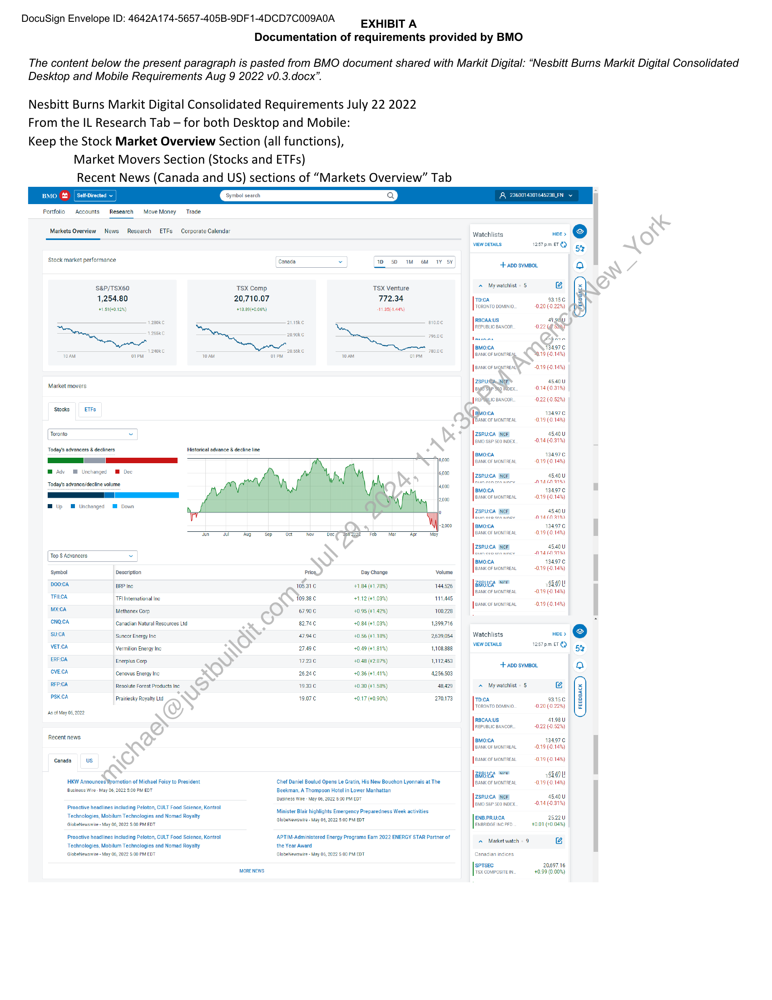
```  
```col-md
DocuSign Envelope ID: 4642A174-5657-405B-9DF1-4DCD7CO09A0A EXHIBIT A
Documentation of requirements provided by BMO  
The content below the present paragraph is pasted from BMO document shared with Markit Digital: “Nesbitt Burns Markit Digital Consolidated
Desktop and Mobile Requirements Aug 9 2022 v0.3.docx”.  
Nesbitt Burns Markit Digital Consolidated Requirements July 22 2022
From the IL Research Tab — for both Desktop and Mobile:
Keep the Stock Market Overview Section (all functions),
Market Movers Section (Stocks and ETFs)
Recent News (Canada and US) sections of “Markets Overview” Tab  
Portfolio Accounts Research Move Money Trade.
Markets Overview News Research ETFs Corporate Calendar Watchlists we» (o}
View DETAILS metQ
SY
Stack market performance L
Conada > SD IM OM ow SY st app svwpou a
‘S&P/TSX60 TSX Comp TSX Venture © GiGEEES 5 1 3
1,254.80 20,710.07 772.34 TD:cA saisc |S
+1 5160128) 1200/0068) r.35¢1.44%) TORONTO DOMINIO 0.20 (0.22%)
exe ce ROCAKUS asd
b REPUBLIC BANCOR 022 (Gy
oe 268K are jonse :
BMO:cA ¥3497¢
m7 aa aa =a maa ao oS sank or montaca, (%a79 (0.14%)
ean ormaurealy’ ~ -0:19 60.14%)
ZSPUCA NOD 4540U
Market movers |ySRP Reg Moe 0.14 (031%)
J RaMuIc wancon 0.22 (0.52%)
Smoke || ETFe Byoca 13497
BANK OF MONTREAL 0.19(0 148)
[Toronto S ZSPUCA (No sso
bao saPsoompex. 0.14031)
Today's advancers & decliners Historical advance & decline ine
BMo-ca 13497
es ya BANK OF MONTREAL 0.1960 14%)
Adv ME Unchanged lM Dec
000 ZSPUCA (NGF 4540U
Today’ advance/dectine volume lsc00 : o1aensts)
BMO.cA 13497¢
a A zr
ovo BANKCFMONTREAL ——-0.19 (0.14%)
WE Up ME Unchanged Down
o ZSPUCA NOR 45400
Senco son nme a1acoae
|-2000 BMA 134970
nig Sep et Ne ePaper BANK OF MONTAEAL 0.19(0.14%)
ZSPU.CA INC 45400
Top $ Advancers a : nan
BMo:cA ssacve
symbol Description Prieg Day Change Volume Sanwormenmsen 9.190 185)noe q
Doo‘ca BRP Inc 105316 +184 (41.78%) 144.526 BR SOU
BANKOFUONTRESL —— -0.19 (0 14%)
TFILCA TFllntermationl Ine Yoosec +112 (41.09%) 1144s
Jeancormonriea. —-0.19 60.14%)
MCA Methanex Corp 67906 40,95 (41.42%) 100.228
cNaCA ‘Canadian Natural Resources Lid 82.74 ++0.84 (+1.03%) 1,399,716
SUCA SEER a79ac 40156 (41.18%) 26290054 Watchlists
View DETALS
VET.CA Vermilion Eneray Ine 27496 +049 (41.81%) 1,108,388
ERF-CA Enerplus vac 40.48 (92.07%) wangasa
ius Corp (287%) tap sywsot Q
CvECA Ccenovus Energy Ino 26.240 40,36 (41.41%) 4,286,508
RFP SCA Resolute Forest Products Ine rasac +4030 (41.58%) 49420 A My watchlist «5 (C7
PSK.CA Prairesky Royaly Ld 1076 40.17 (20.90%) 270173 DCA aa1se
TORONTO poMINia 0.200 22%)
‘as of May 06,2022
RBCAAUS 41.980
REPUBLIC BANCOR. 022 (0.50%)
Recent news BMO-cA 134970
BANKOF MONTREAL —— -0.19 (0.14%)
canada | us J panicor mowrseat 0.190.148)
BRIG SF ae
HKW Announces Promotion of Michael Foy to President Chet Daniel Boulud Opens Le Gratin, His New Bouchon Lyonnais at The BANK OF MONTREAL 0.19(0 148)
Becinss We- May 06,2022 5:00 PM EDT Beekman, A Thompson Hotel in Loner Manhattan
Business Wie - May 06,2022 5:00 PM EDT ZSPULCA INO 45.400
Proaetive headlines including Peloton, CULT Food Science, Kontrol bao saPsoomDex. --0.14 (031%)
ies i need Newet Regan, Minister Blair highlights Emergency Preparedness Week activities
fechnologies, Mobilum Technologies and Nomad Royalty sloeveuuty as sczs soem euePRICA 25200
GlobeNewsnre-May 06,2022 00 PM EDT ENERIDGEINCFFD. 40.01 (+0 04%)
Proactive headlines inclusing Peloton, CULT Food Seienee, Kontrol APTIM- Administered Energy Programs Earn 2022 ENERGY STAR Partner of Marketwatch 9 a
Technologies, Mobilum Technologies and Nomad Royalty the Year Award
GlobeNewswire May 06,2022 500 PM EDT GlobeNewswire - May 06,2022 500 PM EDT Canacian indices
SPTSEC 20657.16
More NEWS TSX COMPOSTEIN 40.99 0.00%)  
```
````
Notes:    
````col
```col-md
flexGrow=.5
===
> [!info] [Page 8](_attachments/images_BMO-3.6.1.21.400221940.pdf_212059/page_8.png)
> 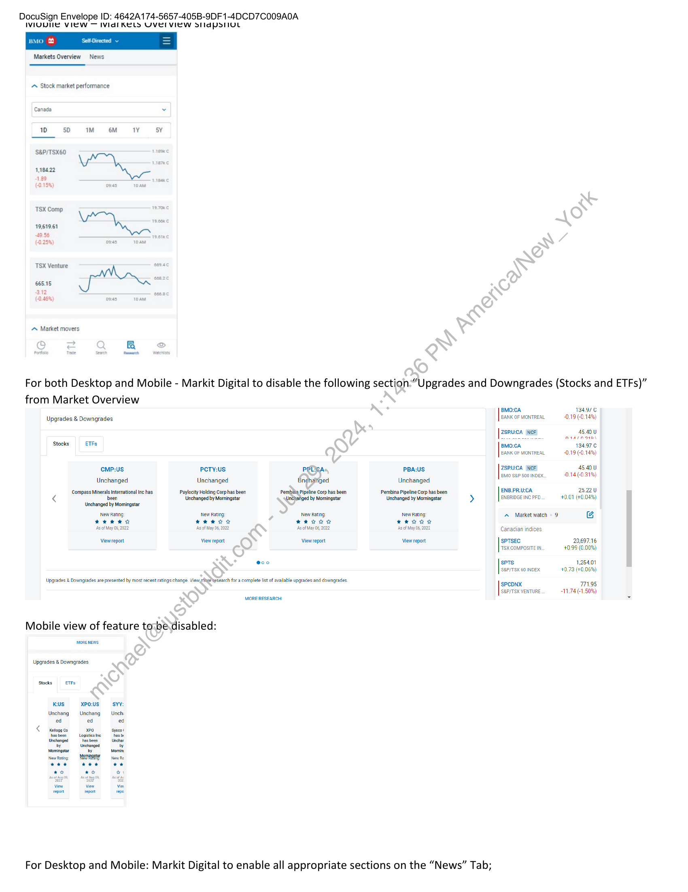
```  
```col-md
DocuSign Envelope ID: 4642A174-5657-405B-9DF1-4DCD7CO09A0A
IVIOUIE VIEW — IVIdI KELS UVET VIEW SIIdpstIUL  
io % Self Dis  
Markets Overview News  
A Stock market performance  
Canada
1 5D IM 6M 4Y  
S&P/TSX60  
1,184.22 a
1.89  
TSX Comp  
3.12  
0.46% a an  
A Market movers  
2<€¢ &  
For both Desktop and Mobile - Markit Digital to disable the following section:“Upgrades and Downgrades (Stocks and ETFs)”  
from Market Overview  
Upgrades & Downgrades
Stocks ETFs
cMP:us
Unchanged  
Compass Minerals International inc has
been  
Unchanged by Momingstar  
New Rating:
we eeD
‘As of May 05,2022  
View report  
19,619.61 — —
TSX Venture oe
665.15 aoe  
PCTY:US
Unchanged
Paylacity Holding Corp has been
Unchanged by Morningstar  
New Rating:
ke
As of Nay 6, 2022  
View report  
PPL.
Unghatiged
Pembilia Pipaline Corp has been
LUnehariged by Morningstar  
New Ratng:  
keoae
‘As of May 06, 2022  
View report  
pgradas & Downgrades are presented by mast recent ratings change. Viewsfeya\vesearch for a complete list of available upgrades and downgrades.  
MORE RESEARCH  
Mobile view of feature to:be disabled:  
MORENEWS  
Upgrades & Downgrades  
Stocks ETFs  
KUS  XPO:US__—SYY:
Unchang — Unchang —Unch:  
ed ed ed
ketogs co x0 ‘syee0
haebeen Logistics Incas  
Unchanged hasbeen ——_Uncar
by  
by
Momingstar Mornig
New Rating New Re
nee te  
te  
View  
report  
For Desktop and Mobile: Markit Digital to enable all appropriate sections on the “News” Tab;  
PBA:US
Unchanged
Pembina Pipeline Corp has been
Unchanged by Morningstar  
New Rating:
ee ode
As of May 06, 2022  
View report  
BMO:CA
BANK OF MONTREAL  
‘ZSPUCA [NCE  
BMO:cA,
BANK OF MONTREAL  
‘ZSPUCA |NCF
EMO S8P 500 INDEX.  
ENB.PR.U:CA
ENBRIDGE INC PFD  
A Market watch  
Canadian indices
SPTSEC
‘TSX COMPOSITE IN.  
SPTS
S&P/TSX 60 INDEX  
‘SPCDNX
S&P/TSX VENTURE  
134.9/ 6
0.19 (0.14%)  
45.40 U  
atarnaien
134.976
0.19 (0.14%)  
45.400
0.14 (0.31%)  
25.22
+0.01 (+0.04%)  
G
20,697.16  
+0.99 (0.00%)  
1,254.01
40.73 (+0.06%)  
771.95
11.74 (1.50%)  
```
````
Notes:    
````col
```col-md
flexGrow=.5
===
> [!info] [Page 9](_attachments/images_BMO-3.6.1.21.400221940.pdf_212059/page_9.png)
> 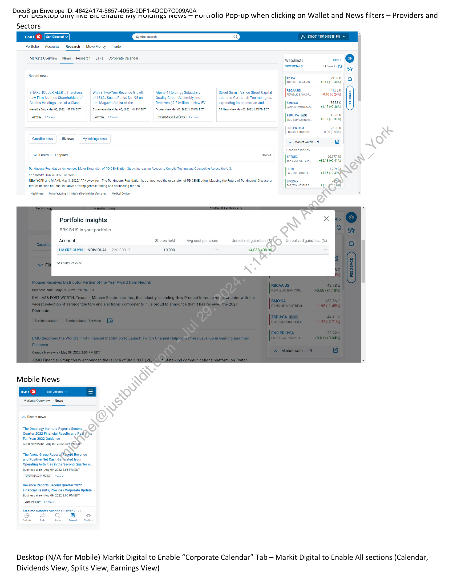
```  
```col-md
DocuSign Envelope ID: 4642A174-5657-405B-9DF 1-4DCD7CO09A0A . woe . .
TUL VESKLUP UIIy HIKE DIL Eflduie Ivly NUIUINIYS INEWS — FUT uolio Pop-up when clicking on Wallet and News filters — Providers and  
Sectors  
Portfolio Accounts Research Move Money Trade  
Markets Overview News Research ETFs Corporate Calendar  
Watchlists toe > fo]  
View DETAILS eavemer C)  
SY
Recent news qe came gy
TORONTO DOMINIO. 40.41 (+0.44%)
RECAAUS 41 75U
SHAREHOLDER ALERT: The Gross Witha Two-Year Revenue Growth Alpine 4 Holdings Subsidiary, Street Smart: Vance Street Capital seeanvewoon oo; a2t)
Law Firm Notifies Shareholders of of 136%, Susco Ranks No. 95 0n Quality Circuit Assembly, In. acquires Carmanah Technologies,
Celsius Holdings, Inc. of a Class.  Inc. Magazine's List of the. Receives $2.2 Million in New EV. expanding its pedestrian and.  
 BMO.CA 136530
BANKOFMONTREAL —+1.17 (40.86%)
Neusfle Corp-May(3,2022 147 PMEDT _—-—GlbeNewswte-May 03,2022 146PMEDT Acces snire-May 09,2022 145 PM EDT PR Newswire- May 03,2022 1.45 PM EDT
Save | +1 move Sarao@s | +9 ore “Reoepace and Defers8 | + 2 more 28PUCA Ti 35700
eMossP sooinnex. #0.17 (40.37%)
ENBPRU:CA 22300
ENBRIDGE INC FFD 0.00 0.00%)
Canadiannews | -USnews — Myholdings news
yaswenss 5 Marketwatch - 9 G
Canadian indices
Filters + 0 applied oar ai sprsec oog77 40
Parkinson's Foundation Announces Major Expansion of PD GENEration Study, Increasing Access to Genetic Testing and Counseling Across the US. sPTs 125923
PRNewswire- May 03,2022 155 PM EDT Serrisxeompex ——+4.85(+0.39)\
NEW YORK and MIAMI, May 3, 2022/ PRNewswire/- The Parkinson's Foundation has announced the expansion of PD GENEration: Mapping the Future of Parkinson's Disease, a SPCDNX 1
{first-of its-kind national initiative offering genetic testing and counseling for peo. ‘SUP/TSX VENTURE +119, ra } asd)
Hesihcare | Manufacturing | - Medical Device ManuTactunna | "Metis! Devices .  
Portfolio insights
BRK.B:US in your portfolio  
Account Shares held Avg cost per share Unrealized gain/loss ($) Unrealized gain/loss (%)  
LMXRZOUYN INDIVIDUAL 220-00012 10,000 = +4,038,408.90. =  
As of May 09, 2022  
Mobile News  
a) IeDirected  
Markets Overview News  
A Recent news (  
The Oncology institute Reports Second
Quarter 2022 Financial Results and Redffitine
Full Year 2022 Guidance  
GlobeNewswire - Aug 09, 2022 8:06 (MH EBY  
‘The Arena Group Report(Rbcord Revenue
and Positive Net Cash Gerterated from
Operating Activities in the Second Quarter o.  
Business Wire Aug 09, 2022 8:06 PM EDT  
Information and Media +2 rnare  
Revance Reports Second Quarter 2022
Financial Results, Provides Corporate Update
Business Wire- Aug 09, 2022 8:05 PM EDT  
Biotechnology | +1 more  
Macimn Panarte Sarnnd Quarter 2077  
G 2 Q RR ©  
Desktop (N/A for Mobile) Markit Digital to Enable “Corporate Calendar” Tab — Markit Digital to Enable All sections (Calendar,
Dividends View, Splits View, Earnings View)  
```
````
Notes:    
````col
```col-md
flexGrow=.5
===
> [!info] [Page 10](_attachments/images_BMO-3.6.1.21.400221940.pdf_212059/page_10.png)
> 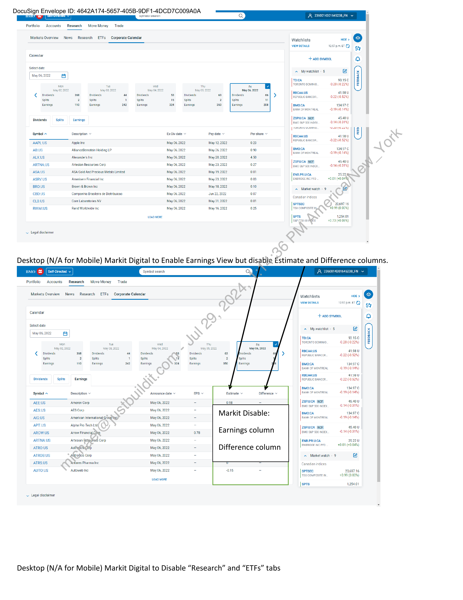
```  
```col-md
DocuSign Envelope ID: 4642A174-5657-405B-9DF1-4DCD7CO09A0A  
ympor sear  
Portfolio Accounts Research Move Money Trade  
Markets Overview News Research ETFs Corporate Calendar  
Watchlists Hoe > ©  
View DETALS em EO | gre
Calendar
++ app syMBoL fal
Select date
ee ~ Mywatohlist « 5 @
[ May 06, 2022 a ]
wea 9315¢
ce ics the a ToRONTODOWINID. © -0.20(0.22%)
ay 0220 ay 04 202 ay 05,20 May06 2022
RECAAUS 4198
& _ divcends 368 Dividends 44 nidenes 52 Dicents «| pwdencs «| > REA US onttes)
spite 2 spits 1 spite 1s spits 2 | solne n
Esminos 110 Eamnnge 292 ange 2a singe aso | exrnge BMO.cA 134970
BANK OFMONTREAL 0.19 (0.14%)
ZSPULCA (Nee 4540U
Dividends || Satte | | Farninge suosePsoonnx. 2.14 (031%)
Jluruniovm. waver) | |g
a REFUBLICBANCOR. 0.22 (0.52%)
AAPLUS| ‘ple ne May 06, 2022 May 12,2022 023
alion \ . BMO:cA 134970
ABUS ianceBerstein Holding LP May 06, 2022 May 26,2022 0.90 BMA new nw ORE
ALXUS Alexander's Ine May 06,2022 May 20,2022 450 {
ZSPUCA INCE 45400
ARTNAUS Artesian Recources Corp May 06, 2022 May 23,2022 oz iuccorsenpx. 21400319)
a And Pr i ; 7
ASAUS ASA Gold And Precious Metals Limited May 06, 2022 May 19,2022 oo ena pauca net
ASRV.US Amerisery Financial Inc May 06,2022 May 23,2022 008 ENBRDGEINGPRD.  
 40.01 (40.048)
BRO-US Brown & Brown Inc May 06, 2022 May 18,2022 010 ve Market waten 9 D
cBp-us Gompanti Braslra ce Distrbvicao May 06, 2022 un 22,2022 oor
Canadian indioze
cis.us Core Laboratories NV May 06, 2022 May31,2022 on
sersec 2069716
RWWLUS Rand Worldwide Inc May 06,2022 May 16,2022 025 Tox COMPOSITE 4099 (0 00%)
LoAD MORE srs 125401
sar coNfee” 40.73 (40.06%)  
~ Legal disclaimer  
Desktop (N/A for Mobile) Markit Digital to Enable Earnings View but disable Estimate and Difference columns.  
Symbol search Q Ay 23600142016
Watchlists HIDE > (o}  
BMo 4 [Self-Directed v  
Portfolio Accounts Research MoveMoney Trade.  
Markets Overview News Research ETFs Corporate Calendar  
VIEW DETAILS. iestpm.er ¢)
58
Calendar
+ app syMaot. fay
Select date
‘A Mywatehlist » 5 Ic
[ayosao
SE ‘TD:CA 93.15C
viet te ves tne a TORONTO DOMINIO. 0.20 (0.22%)
RBCARLUS angeu
& dividends 368 Dividends 44 Dvidends $3 Dividers 6 widens > es com on(osr)
spite 2 Splts 1 spite 1B spite 2 Pspite
BANK OF MONTREAL 0.19 (0.14%)
UcARUS aiwu
Dividends Splits Earnings REPUBLIC BANCOR. 0.22 (0.52%)
Moca 134970
‘Symbol ~ Description ~ Announce date ~ EPS v Estimate Difference ~ BANK OF MONTREAL 0.19 (0.14%)
= ZSPULCA (Nor 45400
AEEUS Ameren Co May 06,2022 = ass
° ¥ BMO S&P 500 INDEX 0.14 (-0.31%)
AESUS AES.Comp Mey 06,2022 - aon J
Markit Disable: BMO-cA 134976
Ais American itematonal G*oup ia) Wey 06,2022 - BANK CR MONTREAL 0.190 148)
APT-US Alpha Pro Tech Ltd) May 06,2022 - . zsruca 4s4oU
‘anowus ermmen ena ove Earnings column cuossrsco noe. 0.140315)
ARTNA‘US| Artesian ReSgdrees Corp May 06, 2022, ~ ENB.PRU:CA 2522U
‘ATRO.US Asthogicdcorp May 06, 2022 - Difference column (noes)
ATROB:US Abtrofics Corp May 06, 2022 - Market watch - 9 @
ATRSUS Wares Pharma ne May 06,2022 - canadian nices
‘AuTOUS Atoweb nc May 06,2022 - sptseo 20697 16
oxo wore
sets 125401  
~ Legal cisclaimer  
Desktop (N/A for Mobile) Markit Digital to Disable “Research” and “ETFs” tabs  
```
````
Notes:    
````col
```col-md
flexGrow=.5
===
> [!info] [Page 11](_attachments/images_BMO-3.6.1.21.400221940.pdf_212059/page_11.png)
> 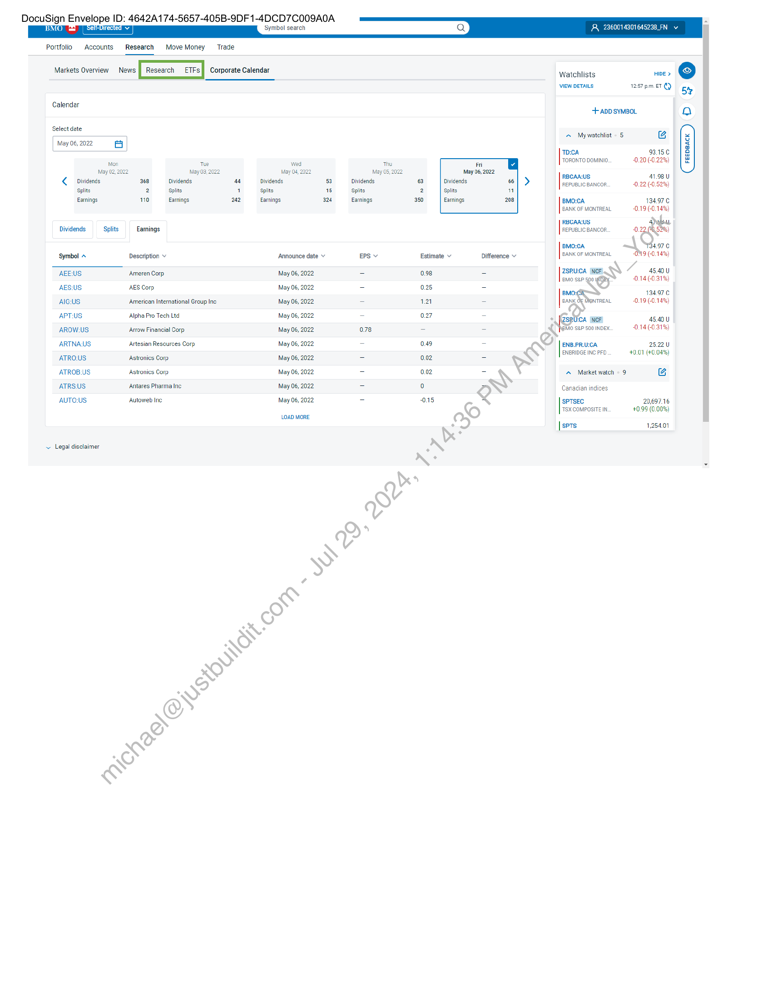
```  
```col-md
IDF 1-4DCD7CO009A0A  
‘Symbol search  
Portfolio Accounts Research Move Money Trade
Markets Overview News Corporate Calendar Watchlists Hive > Co)
VIEW DETAILS 12:57 pm ETC)
Calendar
FADD SYMBOL,
Select dete
‘~ Mywatchlist - 5 B
May 06, 2022
TD:cA 93.156
hon te cy ya ‘TORONTO DOMINIO.  
 0.20 (-0.22%)
May 02,2022 May 03,2022 May 04,2022 May 05,2022 May 06,2022
RBCAA:US A198 U
Dividends 368 Dividends 4g Dividends 53 Dividends 63 Dividends «| > FEPUBLICEANCOR.  
 0.22 (40.52%)
splits 2 splits 1 splits 15 splits 2 splits "
Earnings 110 Eamings 2482 Eamings 324 Earnings 380 Earnings BMO:CA 134.976
BANK OF MONTREAL 0.19 (-0.14%)
RBCAAUS
Dividends Splits. Eamings FEPUBLICBANCOR.  
 0.22 (0.52%)
paca \' ore
‘symbol « Description v Announce date v EPS v Estimate Difference v BANK OF MONTREAL -0M9 (-0.14%)
AEE:US ‘Ameren C May 06, 2022 - 0.98 - ZSPUCA Hi 7 45.40U
“ ° Mo Sz C33 0.14(-0.31%)
AES:US AES Corp May 06, 2022 - 0.25 BMO: 134.97 C
AIG:US American International Group Inc May 06, 2022 = 121 = BANK INTREAL -0.19 (-0.14%)
APT:US Alpha Pro Tech Ltd May 06, 2022 _ 0.27 _ (CA INCE 45.40
AROW:US Arrow Financial Corp May 06, 2022 078 = IMO SEP 500 INDEX. 0.14 (0.31%)
ARTNAUS Artesian Resources Corp May 06, 2022 - 0.49 ENB.PRU:CA 25.220
ENERIDGEING PFD.  +0.01 (#0.04%)
ATRO.US Astronics Corp May 06, 2022 = 0.02
ATROB-US Astronics Corp May 06, 2022 - 0.02 ‘A Marketwatch © 9 G
ATRSUS Antares Pharma Inc ‘May 06, 2022 - 0 Canadian indices
AUTO:US Autoweb Inc ‘May 06, 2022 - 015 SPTSEC 20,697.16
‘TSX COMPOSITE IN. +099 (0.00%)
LOAD MORE
‘SPTS 1,254.01  
~ Legal disclaimer  
```
````
Notes:    
````col
```col-md
flexGrow=.5
===
> [!info] [Page 12](_attachments/images_BMO-3.6.1.21.400221940.pdf_212059/page_12.png)
> 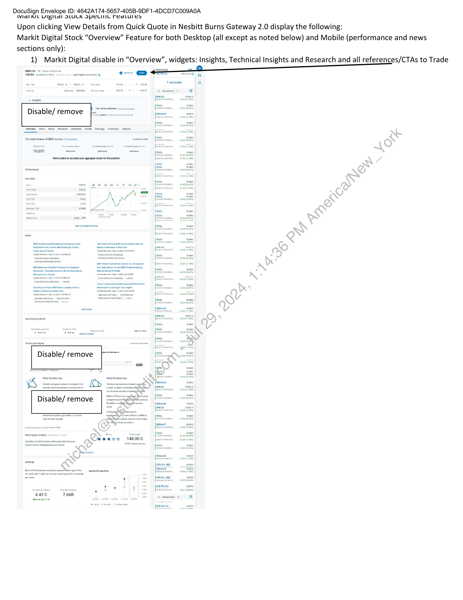
```  
```col-md
DocuSign Envelope ID: 4642A174-5657-405B-9DF1-4DCD7CO09A0A
VIA KIL VIZILd! SLULK SPELL redtures  
Upon clicking View Details from Quick Quote in Nesbitt Burns Gateway 2.0 display the following:
Markit Digital Stock “Overview” Feature for both Desktop (all except as noted below) and Mobile (performance and news
sections only):  
1) Markit Digital disable in “Overview”, widgets: Insights, Technical Insights and Research and all references/CTAs to Trade  
Watchlists  
BMO:CA 15 Bonk of Montes
13353. +20099(+199%) Last trade 202M gor  
2 nsiohts  
Disable/ remove  
‘Orewiew Chaat News Recestch Dwidends Profle Eamings Finale Options  
You hold shares of BMO across 7 accounts.  
10,031 Untoone  
Were unabetocaeuat your agrepate value fortis poston  
peoming dividend  
ea) 470 yeatowsoos Technical insights Fee eng am sila
&  
Disable/ remove ["""*" ro  
cua seu
tenings
; ruck ver
4.43 7.668 Mache watch 9 a  
estes by 41  
```
````
Notes:    
````col
```col-md
flexGrow=.5
===
> [!info] [Page 13](_attachments/images_BMO-3.6.1.21.400221940.pdf_212059/page_13.png)
> 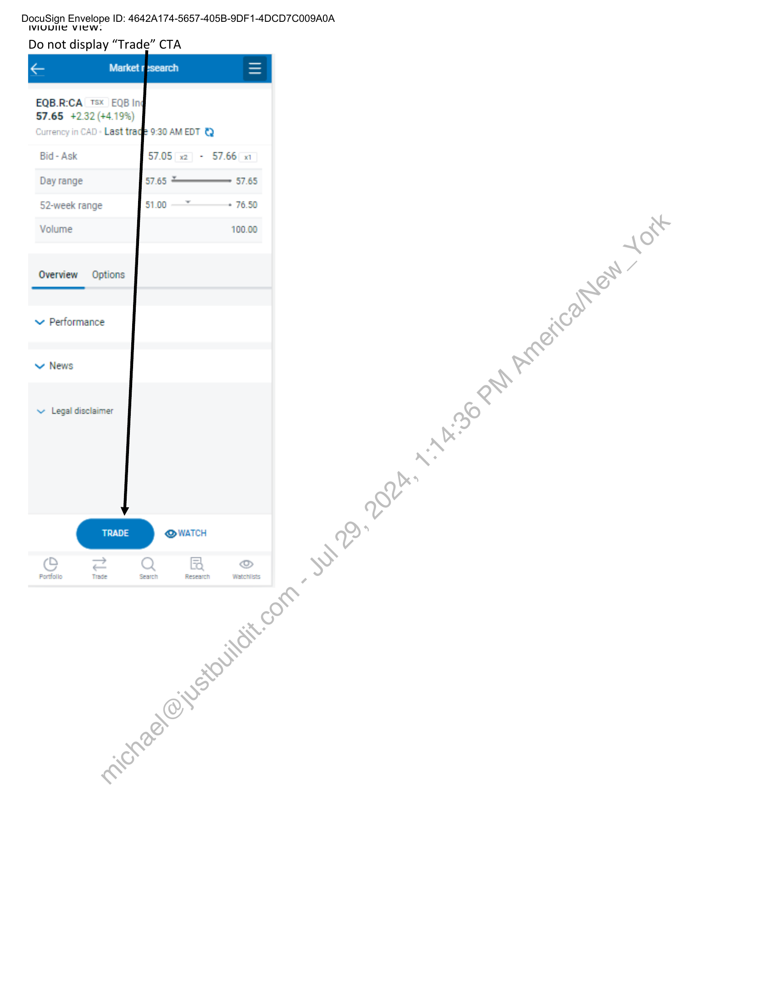
```  
```col-md
DocuSign Envelope ID: 4642A174-5657-405B-9DF 1-4DCD7CO09A0A
wiouviie view.  
Do not display “Trade” CTA  
Market r :search  
EQB.R:CA ts EQB Ing
57.65 +2.32(+4.19%)
Currency in CAD Last trage 9:30 AM EDT Q  
Bid - Ask 57.05 «2 - 57.66  
Day range 57.65 Sn 57.65  
52-week range 51.00 ——~ + 76.50  
Volume 100.00 AS  
\O  
Overview — Options RNY 4
— we  
~ Performance Ww  
@  
\ Legal disclaimer ©
Age)  
= P  
Ss
Rw
RS
~>
XO
wy?
es
BN
we
G  
```
````
Notes:    
````col
```col-md
flexGrow=.5
===
> [!info] [Page 14](_attachments/images_BMO-3.6.1.21.400221940.pdf_212059/page_14.png)
> 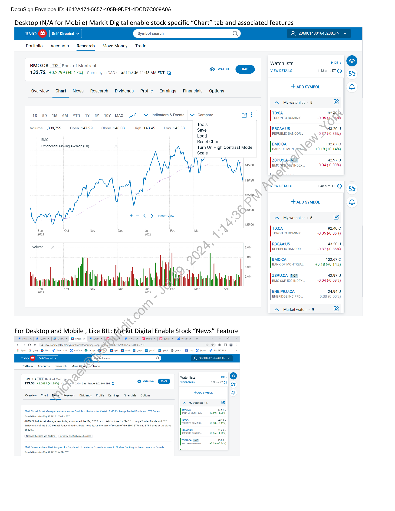
```  
```col-md
DocuSign Envelope ID: 4642A174-5657-405B-9DF1-4DCD7CO09A0A  
Desktop (N/A for Mobile) Markit Digital enable stock specific “Chart” tab and associated features  
1014301645238_FN v  
BMO & cted v
Portfolio Accounts Research MoveMoney Trade
i HIDE > fo)
BMO:CA sx _ Bank of Montreal © waren Watchlists
132.72 +0.2299 (+0.17%) Currency in CAD » Last trade 11:48 AM EDT @ VIEW DETAILS 1148. am. ETC) Sy
; ; , oo ; ++ app syMBOL ray
Overview Chart News Research Dividends Profile Earnings Financials Options
A Mywatehlist 5 G
i : TD:CA 92.39\0
\ Indicators & Events ww C 4:
1D SD 1M 6M YTD 1Y SY 10Y MAX )/W~ indleators mevents ompare Gi TORONTO DOMINIO.  -0.05 (0.05%)
Tools
Volume 1,839,759 Open 147.99 Close 146.03 High 148.45 — Low 145.58 Save RBCAA:US 43.20 U
REPUBLIC BANCOR.  -0. “0.1
Load 0.37 (-0.85%)
— BMo
Reset Chart
BMO:CA 132.67 C
oo B itial Mi Al '50)
-ponential Meving Average (50) Turn On High Contrast Mode BANK OF MONTREAG +0.18 (40.14%)
Scale
ZSPU:CA-NCP 42.97 U
145,00 BMO SiR SQ INDEX.  -0.04 (-0.09%)
6
~/\ . \ 140.00
VIEW DETAILS 11:48 a.m. ET C) 5%
135.00
++ app syMBOL ray
Ny 30.00
+ — € dD Reset view A Mywatehlist 5 G
125.00
Sep Oct Nov Dec Jan Feb Mar Abr TD:CA 92.40 C
2024 2022 TORONTO DOMINIO. -0.05 (-0.05%)
RBCAA:US 43.20U
Volume 80M REPUBLIC BANCOR -0.37 (-0.85%)
eon BMO:CA 132.67 C
‘bona BANK OF MONTREAL +0.18 (40.14%)
BMO S&P 500 INDEX.  -0.04 (-0.09%)
Mao ih A
° Oct Nov Dec Jan Feb Mar Apr
2021 2022 ENB.PRU:CA 24.94 U
ENBRIDGE INC PFD. 0.00 (0.00%)  
GB  
“ Market watch © 9  
For Desktop and Mobile , Like BIL: Markit Digital Enable Stock “News” Feature  
POI | LGM Xe |B SoC BD soe a aH [EBD | A towne 2 | BD wes x | Bl) econt > | 58 west x | ve x
€ > © © & investortineqa0s.bmafg.com/wealth/joureys/app/shligedbafhVCA/BMO/1652418954767 ee aoe
‘pee G 9009 OM FF Tewm2 IRA SE tmzcon Kp tmciot AGP Kat Bd a0s Bh owas Bh once? BH onat @ awades GB cty SE joyeel @umeerswa >  
BMO &  
Portfolio Accounts Research += Move Morley Trade
BMO:CA 1% Bank of Montreal © wroms
133.53 +2.6099 (41.99%) cyu)Me, NCAD- Last trade 2.02PM EDT %
Overview Chart NeWs ‘Research Dividends Profile Earnings Financials Options.  
'BMO Global Asset Management Announces Cash Distributions for Certain BMO Exchange Traded Funds and ETF Series
Canada Newswre- May 19,2022 1230 PM EDT
-BMO Global Asset Management today announced the May 2022 cash distributions for BMO Exchange Traded Funds and ETF  
Series units of the BMO Mutual Funds thet distribute monthly, Unitholders of record of the BMO ETFs and ETF Series at the close  
of busi  
Financial Services and Banking investing and Brokerage Sewces  
'BMO Enhances NewStart Program for Displaced Ukrainians - Expands Access to No-Fee Banking for Newcomers to Canada  
(Canada Newswire - May 17,2022 244 PM EDT  
MOE > fo]  
Watchlists
view oerats seem pw
+ apo symeo. a
A Mywatehlist 5 G
aMo-ca as3sic
BANKCOF MONTREAL 42.59 (+.98%)
Toca s2asc
Tonowro pow. 40.38 40.47%)
RECAAUS 44360
REPUBLICDANGOR.  
 40.86 (47984)
ZSPUCA INDE 43.090
Bo sk? sooiNoex.  
 40.19 (40.44%)  
```
````
Notes:    
````col
```col-md
flexGrow=.5
===
> [!info] [Page 15](_attachments/images_BMO-3.6.1.21.400221940.pdf_212059/page_15.png)
> 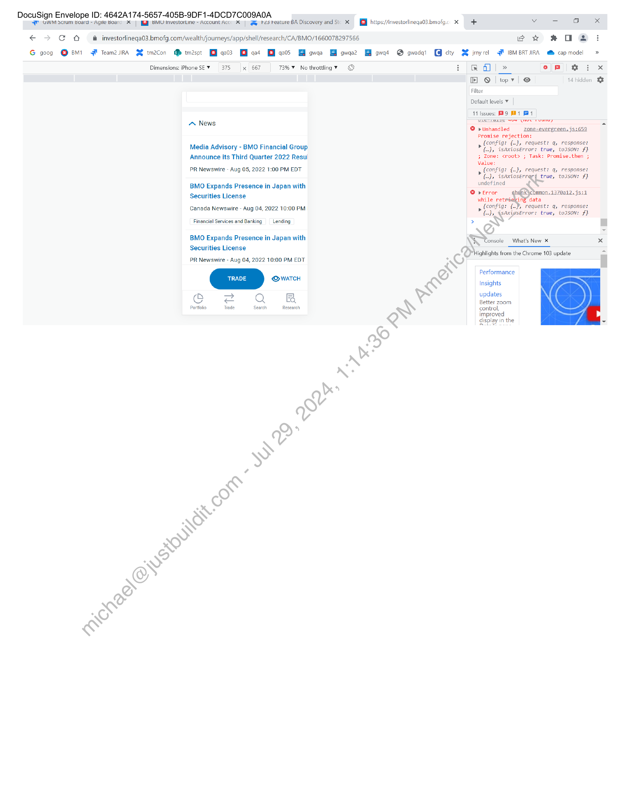
```  
```col-md
DocuSign Envelope ID: 4642A174-5657-405B-9DF 1-4DCD7CO09A0A  
GWM Scrum Board - Ague Boars X | IR BMUInvestortine - AccountAcc’ X | @™ F25 Feature BA Discovery and Si. Xx  
<¢-ca
G goog © ami  
EB https://investorlineqa03.bmofg.c X  
@ investorlineqa03.bmofg.com/wealth/journeys/app/shell/research/CA/BMO/1660078297566  
@ Team2 JIRA 38 tm2con  
@ tmespt  
Dimensions: iPhone SE¥ 375  
BB o03 EB cat EB acs  
x 667  
“~ News  
Media Advisory - BMO Financial Group
Announce its Third Quarter 2022 Resul  
PR Newswire - Aug 05, 2022 1:00 PM EDT.  
BMO Expands Presence in Japan with
Securities License  
Canada Newswire - Aug 04, 2022 10:00 PM  
Financial Services and Banking Lending  
BMO Expands Presence in Japan with
Securities License  
PR Newswire - Aug 04, 2022 10:00 PM EDT  
TRADE QwatcH  
G 2 Q &  
Portfolio Trade Search Research  
Bi owaa  
BA owaa2  
73% ¥ Nothrottingy ©  
Bi owa4 @ gwadqi  
Gicty & imyrel  
@  
+ von
ew 2#O eS
f IBM BRT JIRA = @ cap model  
&® A)! » emp mi:  
BO \wr\o
Filter  
Default levels ¥  
miei
ae Woe
© punhandled —_zone-evergreen,j5:659
Promise rejection:
(config: {.  
}, request: q, response:
{au}, isaxioserror: true, toIsov: f}
5 Zone: <root> ; Task: Promise.then 5  
14 Issues:  
{a}. request: q, response:  
if
(J, isaxioserrer{ true, toJson: #}
undefined  
{config: {., request: q, response:  
Cnenere: true, toISoN: F}  
>  
What's New  
. comes
& ighlights from the Chrome 103 update  
Performance
Insights  
updates
Better zoom
control,
improved
display in the  
>  
x  
1d4hidden 3  
```
````
Notes:    
````col
```col-md
flexGrow=.5
===
> [!info] [Page 16](_attachments/images_BMO-3.6.1.21.400221940.pdf_212059/page_16.png)
> 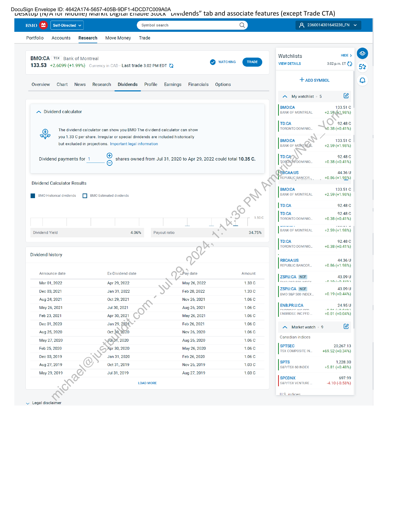
```  
```col-md
DocuSign Envelope ID: 4642A174-5657-405B-9DF 1-4DCD7CO09A0A .
DesKiup WW 1UL IVIUDHE) IVIAI KIL VIZILdl CHdVIE SLULK vividends” tab and associate features (except Trade CTA)  
Portfolio Accounts Research MoveMoney Trade  
Watchlists HIDE > fo)  
BMO:CA Tsx_ Bank of Montreal
(A TRADE VIEW DETAILS 3:02 p.m. ET CD  
133.53 +2.6099 (41.99%) Currency in CAD - Last trade 3:02 PM EDT t) Kd
+ app symBoL Q
Overview Chart News Research Dividends Profile Earnings Financials Options
A Mywatehlist » 5 a
BMO:CA 133.51
“ Dividend calculator BANK OF MONTREAL +2.59((t1,98%)
TD:CA 92.48 C
The dividend calculator can show you BMO The dividend calculator can show TORONTO DOMINIO. 90.38 (+0.41%)
ave you 1.33 C per share. Irregular or special dividends are included historically
BMO:CA 133.51
but excluded in projections. Important legal information BANK OF MONICA 42.59 (41.98%)
a @ TD:cw 92.48 C
Dividend payments for 1 iS) shares owned from Jul 31, 2020 to Apr 29, 2022 could total 10.35 C. zoronfe Dominio. 40.38 (40.41%)
RBCAA:US 44.36U
REPUBLIC ANCOR.  __ +0.86 (+1.98%)
Dividend Calculator Results
BMO:CA 133.51
HI 80 Historical dividends [[]_BMO Estimated dividends BANK OF MONTREAL #2,59 (+1.98%)
| To:ca 92.480
TD:CA 92.48C
[ 1.50C TORONTO DOMINIO. +0.38 (40.41%)
Dividend Yield 4.06% Payout ratio 34.75% | BANK OF MONTREAL +2.59 (+1.98%)
TD:CA 92.48C
TORONTO DOMINIO.  +0.38 (+0.41%)
Dividend history :
RBCAA:US 44.36U
REPUBLIC BANCOR. +0.86 (+1.98%)
Announce date Ex-Dividend date Pay date Amount
| ZSPU:CA [NCF 43.09 U
Mar 01, 2022 Apr 29, 2022 May 26, 2022 1.33C pee com cnn mney FOTO LA AMON
ZSPU:CA |NCF 43.09 U
Dec 03, 2021 Jan 31,2022 Feb 28, 2022 1.33C Mo So 500 INDEX 40.19 (40.44%)
Aug 24, 2021 Oct 29, 2021 Nov 26, 2021 1.06 C
May 26, 2021 Jul 30, 2021 Aug 26, 2021 1.06C ENB.PRU:CA ne p95
Feb 23, 2021 ‘Apr 30, 2021 May 26, 2021 1.06 C ENBRIDGE INC PFD +0.07 (+0.04%)
Dec 01, 2020 Jan 29, 2021 Feb 26, 2021 1.06 C A
“A Market watch » 9 G
Aug 25, 2020 Oct 30,2020 Nov 26, 2020 1.06C
Canadian indices
May 27, 2020 N37, 2020 Aug 26, 2020 1.06C
SPTSEC 20,267.13
Feb 25, 2020 Apr 30, 2020 May 26, 2020 1.06 C TSX COMPOSITE IN. 469.52 (40.34%)
Dec 03,2019 Jan 31, 2020 Feb 26, 2020 1.06C
SPTS 1,228.30
Aug 27, 2019 Oct 31, 2019 Nov 26, 2019 1.03C S20 /78% 60 INDEX 45.81 (40.48%)
May 29, 2019 Jul 31,2019 Aug 27, 2019 1.03 ©
SPCDNX 697.99
LOAD MORE S&P/TSX VENTURE -4.10 (-0.58%)  
ILS inclines  
\ Legal disclaimer  
```
````
Notes:    
````col
```col-md
flexGrow=.5
===
> [!info] [Page 17](_attachments/images_BMO-3.6.1.21.400221940.pdf_212059/page_17.png)
> 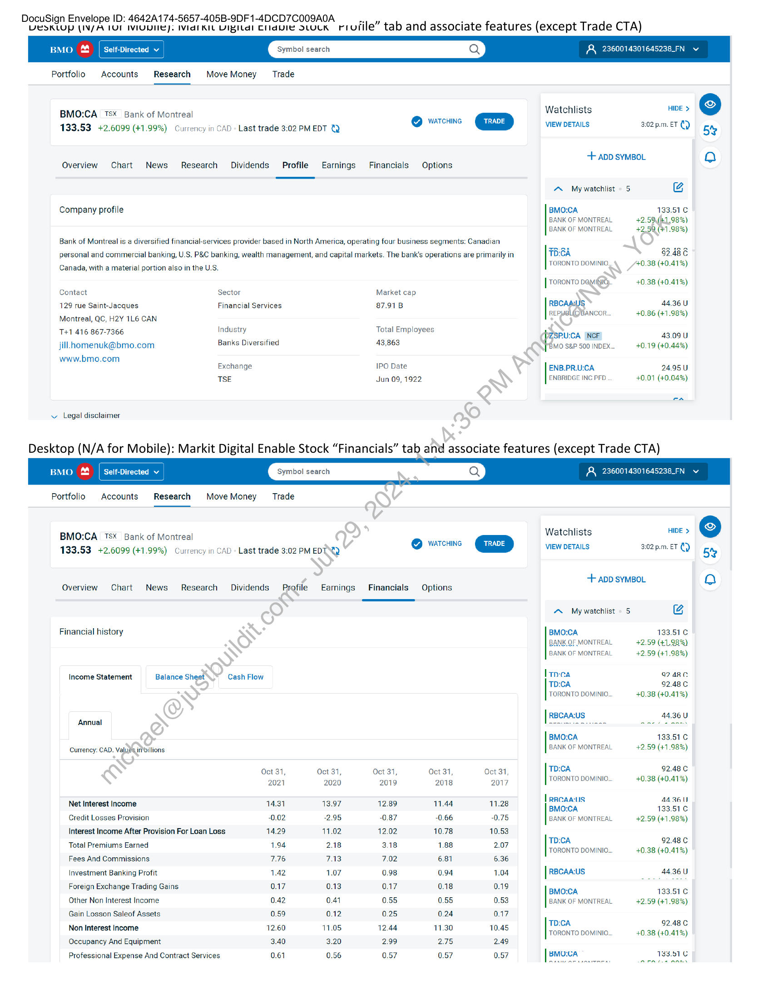
```  
```col-md
DocuSign Envelope ID: 4642A174-5657-405B-9DF 1-4DCD7CO09A0A yoy .
VESKLUD IN/A IUF IVIUUIIE): IVIdI KIL VIZILd! Cidvie SLULK rrutile” tab and associate features (except Trade CTA)  
Portfolio Accounts Research MoveMoney Trade  
it HIDE > fo)
BMO:CA Tsx_ Bank of Montreal © weresns Watchlists
133.53. +2.6099 (41.99%) Currency in CAD - Last trade 3:02 PMEDT @ VIEW DETAILS so2pm ETC) pm
; . oo ; ++ app symBoL Q
Overview Chart News Research Dividends Profile Earnings Financials Options
A Mywatehlist - 5 G
Company profile BMO:CA 133.51 C
BANK OF MONTREAL +2.59\(41,98%)
BANK OF MONTREAL. +259 (#1.98%)
Bank of Montreal is a diversified financial-services provider based in North America, operating four business segments: Canadian
personal and commercial banking, U.S. P&C banking, wealth management, and capital markets. The bank's operations are primarily in TB:CA $2.48 C
Canada, with a material portion also in the U.S. TORONTO DOMINIO. +0.38 (+0.41%)
| TORONTO D@MINIG). +0.38 (+0.41%)
Contact Sector Market cap
129 rue Saint-Jacques Financial Services 87.91B RBCAA:US, 44.36U
Montreal, QC, H2Y 1L6 CAN REPJBLIQBANCOR. +0.86 (+1.98%)
Industr Total Employees
T+1 416 867-7366 y Proy ZSPU:CA (NGF 43.09 U
jill. homenuk@bmo.com Banks Diversified 43,863 BMO S&P 500 INDEX.  +0.19 (+0.44%)
www.bmo.com
Exchange IPO Date ENB.PR.U:CA 24.95U
TSE Jun 09, 1922 ENBRIDGE INC PFD +0.01 (+0.04%)  
\ Legal disclaimer  
Desktop (N/A for Mobile): Markit Digital Enable Stock “Financials” tab and associate features (except Trade CTA)  
BMO  
Portfolio Accounts Research MoveMoney Trade  
Watchlists HIDE > fo)  
BMO:CA Tsx Bank of Montreal
(BG TRADE VIEW DETAILS 3:02 p.m. ET CD  
133.53 +2.6099 (+1.99%) Currency in CAD - Last trade 3:02 PM EDT) SY
+ app symBoL Q
Overview Chart News’ Research Dividends’ Profile Earnings Financials Options
‘A. Mywatehlist 5 G
Financial history BMO:CA 133.51 C
BANK OF MONTREAL. +2.59 (41.98%)
BANK OF MONTREAL. +2.59 (41.98%)
Income Statement Balance Sheet Cash Flow Inca 09 ARC
TD:CA 92.48C
TORONTO DOMINIO. +0.38 (+0.41%)
| RBCAA.US 44.36 U
Annual enn een deat
BMO:CA 133.51 C
Currency: CAD. Valus in'billions BANK OF MONTREAL +2.59 (+1.98%)
Oct 31, Oct 31, Oct 31, Oct 31, Oct 31, TD:CA 92.48 C
2021 2020 2019 2018 2017 TORONTO DOMINIO. +0.38 (+0.41%)
Tracaaus A436
Net Interest Income 14.31 13.97 12.89 11.44 11.28 BMO:CA 133.51C
Credit Losses Provision -0.02 2.95 -0.87 -0.66 -0.75 BANK OF MONTREAL +2.59 (+1.98%)
Interest Income After Provision For Loan Loss 14.29 11.02 12.02 10.78 10.53
TD:CA 92.48 C
Total Premiums Earned 1.94 2.18 3.18 1.88 2.07 TORONTO DOMINIO.  40.38 (40.41%)
Fees And Commissions 7.76 7.13 7.02 6.81 6.36
Investment Banking Profit 1.42 1.07 0.98 0.94 1.04 | RBCAA:US _ 44360
Foreign Exchange Trading Gains 0.17 0.13 0.17 0.18 0.19 BMo:ca 43351¢
Other Non Interest Income 0.42 0.41 0.55 0.55 0.53 BANK OF MONTREAL. +2.59 (+1.98%)
Gain Losson Saleof Assets 0.59 0.12 0.25 0.24 0.17
TD:CA 92.48 C
Non Interest Income 12.60 11.05 12.44 11.30 10.45 TORONTO DOMINIO. 40.38 (40.41%)
Occupancy And Equipment 3.40 3.20 2.99 2.75 2.49  
Professional Expense And Contract Services 0.61 0.56 0.57 0.57 0.57 | BMU:CA 133.51 ©  
```
````
Notes:    
````col
```col-md
flexGrow=.5
===
> [!info] [Page 18](_attachments/images_BMO-3.6.1.21.400221940.pdf_212059/page_18.png)
> 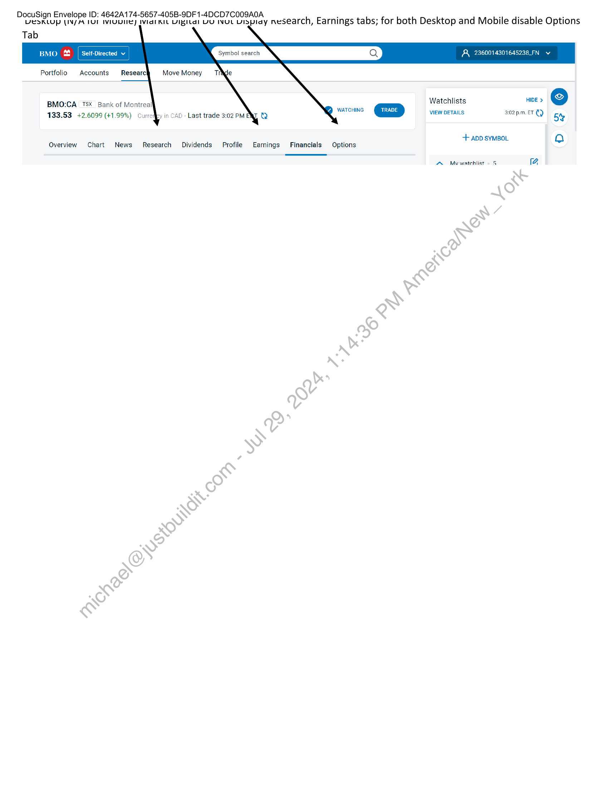
```  
```col-md
DocuSign Envelope ID: 4642A174-5657-405B-9DF 1-4DCD7CO09A0A . . . .
ESRLUp ivy ea 1UL IVIUVIIE) IVIdI KIL VIgildl UU INUL UIspidy nesearch, Earnings tabs; for both Desktop and Mobile disable Options  
Smear QO A zseoovsnr6as238 FN  
Portfolio Accounts —_ Researc’ Move Money Trade  
Watchlists HIDE > ©  
BMO:CA_ TSx_ Bank of Montreal  watcuine
133.53 +2.6099 (41.99%) Currey in CAD Last trade 3:02 PM EWE 0D VIEW DETAILS 3:02 p.m. eT Q) 5%  
++ app symeBoL Qa
Overview Chart News Research Dividends Profile Earnings Financials Options  
A Mvwatehlist © 5 1Z  
```
````
Notes:    
````col
```col-md
flexGrow=.5
===
> [!info] [Page 19](_attachments/images_BMO-3.6.1.21.400221940.pdf_212059/page_19.png)
> 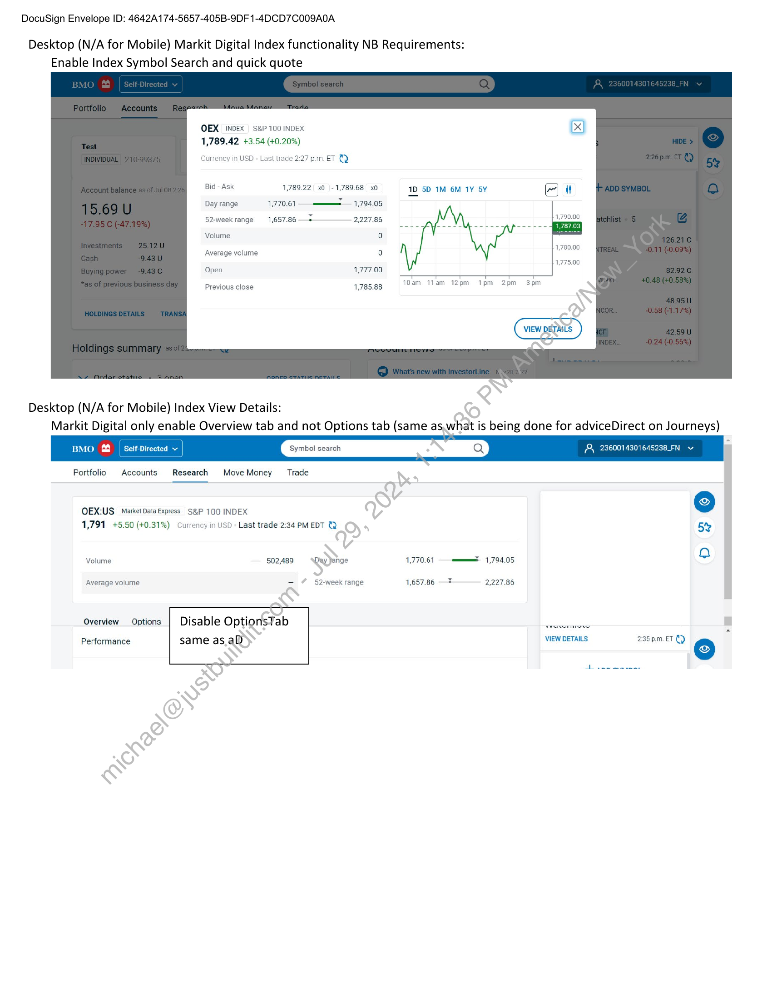
```  
```col-md
DocuSign Envelope ID: 4642A174-5657-405B-9DF 1-4DCD7CO09A0A  
Desktop (N/A for Mobile) Markit Digital Index functionality NB Requirements:
Enable Index Symbol Search and quick quote  
OEX INDEX S&P 100 INDEX
1,789.42. +3.54 (+0.20%)  
Currency in USD « Last trade 2:27 p.m. ET ()  
Bid - Ask 1,789.22 x0 - 1,789.68 x0 1D 5D 1M 6M 1Y 5Y
Day range 1,770.61 ee 1,794.05 =  
S2-weekrange 1,657.86 —>. 2,227.86  
Volume 0  
Average volume 0  
Open 1,777.00  
Previous close 1,785.68 10am Mam 12pm Tpm 2pm Spm  
VIEW DETAILS  
Desktop (N/A for Mobile) Index View Details:
Markit Digital only enable Overview tab and not Options tab (same as, what is being done for adviceDirect on Journeys)  
Portfolio Accounts Research MoveMoney Trade  
OEX:US Market Data Express S&P 100 INDEX  
1,791 +5.50 (+0.31%) Currency in USD » Last trade 2:34 PM EDT @) SY
Volume 502,489  \Day)ange 1,770.61 met 1,794.05 a
Average volume — ¢ 52week range 1,657.86 —* 2,227.86
Overview Options | Disable OptionsTab feos  
Performance same as.aD VIEW DETAILS 2:35 p.m.ET C) e  
cere  
```
````
Notes:  


![[_attachments/BMO-3.6.1.21.4 00221940.pdf]