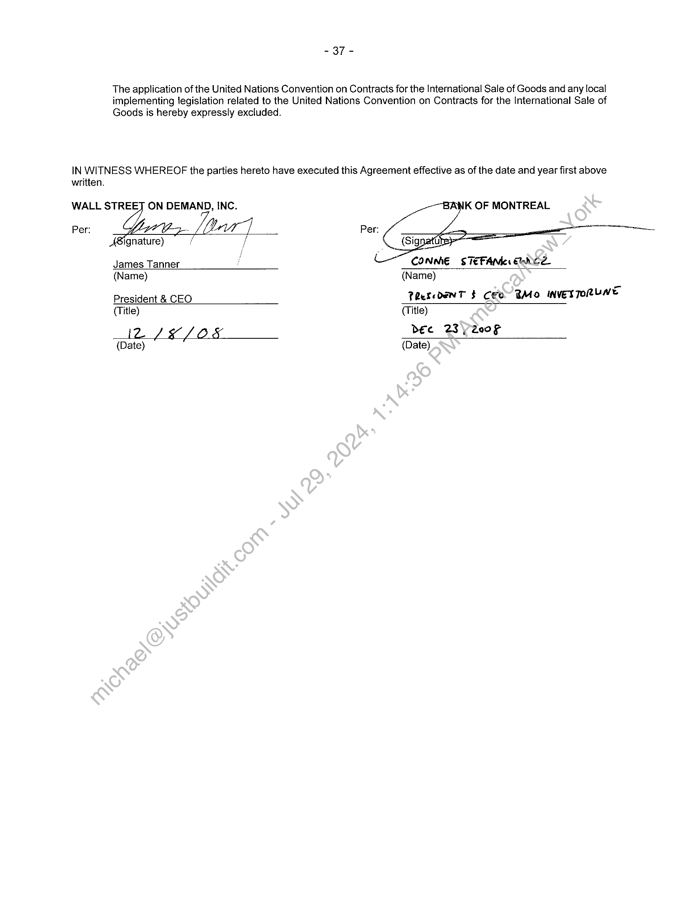

##### Hosting Services Agreement]

  
````col
```col-md
flexGrow=.5
===
> [!info] [Page 1](_attachments/images_BMO-3.6.1.21.5BMO-MA.pdf_210059/page_1.png)
> 
```  
```col-md
THIS AGREEMENT is made as of the 1% day of December, 2008.  
BETWEEN:  
Wall Street on Demand, Inc., a company incorporated in Delaware, USA, with its principal
place of business at 5718 Central Avenue, Boulder, Colorado 80301
(called "Service Provider’)  
- and -  
Bank of Montreal, a Canadian chartered bank, with an office at
1 First Canadian Place, 20" Floor, Toronto, Ontario, M5X 1A3  
(called "Bank of Montreal" or “BMO”)  
RECITALS:  
Bank of Montreal, on behalf of itself and its Affiliates, wishes to acquire from the Service Provider certain
hosting services, software and support services, professional, consulting services and training services to
facilitate the business activities of Bank of Montreal and its Affiliates and the Service Provider wishes to provide
these services to Bank of Montreal and its Affiliates.  
The Service Provider and Bank of Montreal, on behalf.of. itself and its Affiliates, wish to specify in this
Agreement the terms and conditions upon which the Service Provider will provide services to Bank of Montreal
and its Affiliates and upon which Bank of Montreal andhits Affiliates will receive the services.  
NOW THEREFORE, in consideration of the premises and-the agreements contained in this Agreement and other
valuable consideration (the receipt and sufficiency of. which is irrevocably mutually acknowledged by the Parties), the
Service Provider and Bank of Montreal agree as follows:  
1.0  
11  
DEFINITIONS  
As used in this Agreement and in the Recitals, the following terms, and their grammatical variations and
cognate expressions, shall have-the following meanings:  
“Acceptance Date” and its grammatical variations, is the date of successful completion of all phases of any
applicable Acceptance Test in accordance with this Agreement.  
“Acceptance Testing” has the meaning set out in Section 4.4 of this Agreement.
“Accountable Executive” is the BMO individual or the Service Provider individual appointed by the
respective organizations to act as the single point of escalation and coordination for the Services, providing  
oversight‘and resolving probiems that arise through escalation.  
“Action Plan” has the meaning set out in Section 14.5.  
“Affiliate” means any entity that is directly or indirectly Controls or is Controlled by or under the common
control with BMO or by the Service Provider, as the case may be.  
“Agreement” means this Agreement, including all attached Appendices, Schedules and Exhibits signed by
Bank of Montreal and the Service Provider at the time of the signing of this Agreement or at any time after the
signing of this Agreement, as well as amendments, additions or modifications made under Section 18.7, as well
as all Change Proposals accepted by the Parties.  
“Annual Audit” has the meaning set out in Section 14.2.  
```
````
Notes:    
````col
```col-md
flexGrow=.5
===
> [!info] [Page 2](_attachments/images_BMO-3.6.1.21.5BMO-MA.pdf_210059/page_2.png)
> 
```  
```col-md
-2-  
“Annual Audit Plan” has the meaning set out in Section14.2.  
“Appendix” means an appendix attached to this Agreement or added to this Agreement in accordance with the
terms of this Agreement.  
“Applicable Laws” means all statues, laws, regulations, by-laws, ordinances, orders and requirements of any
Government Entity or other public authority having jurisdiction, including common law, equitable and
administrative decisions.  
“Approved Auditors” has the meaning set out in Section 14.2.  
“Assets” means computer and telecommunications equipment, associated attachments, features, accessories,
peripheral devices, and front end devices owned or leased or otherwise acquired by the Service Provider
during the Term to facilitate Service Provider's provision of Services.  
“Audits” has the meaning set out in Section 14.1.  
“BMO Financial Group" means Bank of Montreal and Bank of Montreal Affiliates.
“BMO Financial Group Audits” has the meaning in Section 14.2.  
“BMO Financial Group Data” has the meaning in Section 4.2, and for further clarity and without limiting the
definition set out in Section 4.2, includes all information and data provided, submitted, stored, or processed from
any vendor, supplier or proposed vendor or supplier of BMO FinanciaiGroup in relation to the Hosted Services
provided by Service Provider to BMO Financial Group pursuant fo this Agreement.  
“BMO Financial Group Personal Information” means information that is identifiable to an individual or by
which an individual can be identified, whether or not publicly. available, and includes: (1) any BMO or Affiliates’
employee information, or BMO or Affiliates’ customer information, and (2) any information ascribed to it under
the Privacy Laws.  
“BMO Indemnitee" has the meaning set out in Section 16.1.
“BMO Transition Services” has the meaning in Section 4.1.
“Business Day” means any day that)BMO is normally open for business.
“Business Purpose” has the;meaning set out in Section 8.1.  
"Changes" means: (i) additions or deletions to the Services made by the Service Provider at the request of
Bank of Montreal duringthe Term including report requirements, (2) changes to BMO’s Information Security
Requirements, (3) changes to the Services Contingency Plan in accordance with Section 9.7 of this
Agreement, and (4) changes that are required in order to comply with Applicable Laws under Section 12.1 (6)
of the Agreement, all of which are subject to the Change Process as described in Appendix A1 .  
“Comparable Services” has the meaning in Section 11.4.  
“Cormpetitor” means: (i) in Canada, any bank listed as Schedule I, Il or Il] under the Bank Act, S.C. 1991, c.46,
as ‘amended from time to time, (ii) in the United States, any bank with a substantial retail or commercial banking
presence in Illinois that has at least seventy-five (75%) percent of equity capital of BMO’s Affiliate Harris , (iii)
any Affiliate of the entities in (i) or any successor entity of the entities in (i) as a result of acquisition, merger or
amalgamation, or (iv) an Affiliate of the entities in (ii) that conduct banking business or any successor entity of
the entities in (ii) as a result of acquisition, merger or amalgamation.  
“Confidential Information" means all Documents or Information and includes, in the case of BMO and its
Affiliates, BMO Financial Group Personal Information, disclosed or made available by one party, or by its third
party agents or by its customers, (collectively, the “Disclosing Party”) to the other party including any one
acting for or on behalf of the receiving party (collectively, the “Receiving Party”), in connection with this
Agreement or the performance of the obligations under this Agreement. This includes, without limitation: (a)
information about the business affairs, customers of the Disclosing Party or the products or services supplied by
third parties to the Disclosing Party, and (b) information about the business affairs or customers of Affiliates of  
```
````
Notes:    
````col
```col-md
flexGrow=.5
===
> [!info] [Page 3](_attachments/images_BMO-3.6.1.21.5BMO-MA.pdf_210059/page_3.png)
> 
```  
```col-md
-3-  
the Disclosing Party, or products or services supplied by third parties to Affiliates.  
“Contract Year” means each consecutive twelve month period starting on the Schedule Effective Agreement
Date during the Term. If the initial or final Contract Year is less than twelve (12) months, then non-specific
references to amounts in the Agreement or applicable Schedule shall be appropriately and equitably prorated
on a 30 calendar day month basis.  
“Control” means, with respect to any entity, the possession, directly or indirectly, of the power to direct or
cause the direction of the management and policies of such entity, whether through the ownership of voting
shares or other ownership interest or by contract or otherwise.  
“Customised Software” and its grammatical variations, means, the enhancements and changes to the Service
Provider Software made by Service Provider at the request and expense of BMO, and may be set out in further
detail in the applicable Schedule.  
“Deficiency Notice” has the meaning set out in Section 14.5.  
“Documents” include: any text, letter, memorandum, sound recording, videotape;-film, photograph, chart,
graph, map, survey, diagram, model, sketch, book of account and information recorded or stored by means of
any device.  
“Effective Date" is the date first written above.  
“Electronic Data” has the meaning set out in Section 8.10.  
“Error” means a failure to meet the applicable Specifications and-Service Provider Documentation.
“Exhibit” means an exhibit attached to this Agreement or attached to a Schedule to this Agreement.  
“Event of Force Majeure” means any event or circumstance occurring after the Effective Date which was
beyond the reasonable control of the Party invoking such event or circumstance (including, fire, flood,
earthquake, elements of nature or acts of God}-acts of war, terrorism, epidemics, riots, civil disorders,
rebellions, and which event or circumstance was either: (i) unforeseeable, or (ii) foreseeable, but could not have
been avoided, prevented, or overcome through 'the exercise of reasonable diligence.  
An Event of Force Majeure does not include: (i) any event or circumstance which was caused by the negligence
(including improper equipment maintenance and absence of back-up systems and processes as required by
this Agreement), or wilful act of thé Party invoking an Event of Force Majeure or the employees or agents of
such Party; (ii) financial inabilily’to perform; and (iii) changes in market conditions unless such event or
circumstance is caused by.exiernal parties (excluding Subcontractors) which are demonstrably beyond the
control of the Service Provider.  
“Exhibit” means anexhibit added or attached to a Schedule to this Agreement in accordance with the terms of
this Agreement,  
“Government Entity” means all federal, state, provincial, territorial, county, municipal, governmental or quasi
governmenial entities, agencies or regulators.  
“Harris” has the meaning in Section 2.5.  
“Hosted Software” means software running on a machine under the care or control of Service Provider,
Service Provider Subcontractor, which may include Service Provider Software and Customized Software as may
be set out in further detail in the applicable Schedule.  
“Hosting Services” means those Services provided by Service Provider to BMO Financial Group in
conjunction with the access and use of Software running on a machine under the care or control of Service
Provider, or Service Provider Subcontractor, which may include Service Provider Software and Customized
Software, accessable at the Service Provider website as may be set out in further detail in the applicable
Schedule.  
“Information” includes information about or related to (a) computer software, hardware or other equipment,
data bases, data processing or communications networking system, practices or procedures or other internal  
```
````
Notes:    
````col
```col-md
flexGrow=.5
===
> [!info] [Page 4](_attachments/images_BMO-3.6.1.21.5BMO-MA.pdf_210059/page_4.png)
> 
```  
```col-md
-4-  
systems or controls (in any stage of development), used, owned, or developed (or in development) and related
documentation, and (b) technical data, research, products, financial information, plans or strategies, forecasts
or forecast assumptions, business practices, operations, procedures or services or marketing, merchandising or
pricing information.  
“Information Security Requirements” has the meaning set out in Section 8.9 and as further described in the
applicable Schedule.  
“Initial Term" has the meaning set out in Section 3.1 of this Agreement.
“Intellectual Property” has the meaning set out in Section 7.1.  
“Intellectual Property Rights” means the exclusive ownership in and retention of, all title, rights and
intellectual property rights, including, patents, copyrights, moral rights and trade secrets.  
  
“Loss" means any and all loss, damages, liabilities, costs and expenses (including interest;penalties, costs of
investigation and defence, court costs and reasonable solicitor/attorney fees) resulting from demands, claims,
actions, causes of action, or assessments, brought by third parties, and includes(monies paid by BMO
Indemnitees or the Service Provider Indemnitees, as the case may be, to settle the demand, claim, action,
cause of action or assessment.  
“Modifications” means: (1) changes, enhancements, fixes, patches, corrections, updates or revisions made at
the Service Provider's initiative to the Services and/or the Service Provider Software or hardware used to
provide the Services, (2) additions or deletions to Sites, (3) changes to Service Provider's security procedures
and requirements, (4) changes to the Services Contingency Plarin accordance with Section 9.7 of this
Agreement, and (5) changes required to comply with Applicable Laws under Section 12.1 (5) of this Agreement,
all of which are subject to the Modification Process as described‘in Appendix A2.  
“New Releases” means those bug fixes, routine corrections, minor modifications, minor revisions, updates,
upgrades, enhancements, additions and improvements .to.the Service Provider Software by the Service Provider
and made generally available to the Service Provider)s customers and made available under this Agreement as
part of Support Services. New Releases excludé.Customised Software.  
“OSFI” means the Office of the Superintendent of Financial Institutions under the Office of the Superintendent
of Financial Institutions Act, (Canada), as amended and re-enacted from time to time.  
"Party" or "Parties" means, individually Bank of Montreal or the Service Provider, as the context requires, and
collectively, both Bank of Montreal and the Service Provider.  
“Payment Due Date" has the, meaning set out in Section 11.3.  
“Person” means any individual, partnership (including a limited liability partnership), corporation (including a
business trust or a-limited liability corporation), joint stock company, trust, unincorporated association, joint
venture or other-entity or any government or governmental body or any agency or subdivision of the
governmental body.  
“Personnel means, as applicable Service Provider employees, agents, Subcontractors, and independent
contractors who process BMO Financial Group Data and/or produce work, programs, documentation, reports
and records in connection with the providing the Services under this Agreement.  
“Pre-Existing Technology” means any software, hardware, networks, documents or data that was created
prior to, or independent from, this Agreement.  
“Prime Rate” means the prime lending rate declared by BMO from time to time to be its prime rate for
Canadian dollar loans made by it in Canada.  
“Privacy Laws” means: (1) the Personal Information Protection and Electronic Documents Act (S.C.2000, c.5)
and any successor legislation or the legislation of a province if the legislation is declared to be substantially
similar to the Personal Information Protection and Electronic Documents Act, and (2) U.S. laws regarding the
protection of personal information, including, without limitation the Gramm-Leach-Bliley Act and any successor
legislation and the interagency Guidelines Establishing Standards for Safeguarding Customer Information and
any successor guidelines.  
```
````
Notes:    
````col
```col-md
flexGrow=.5
===
> [!info] [Page 5](_attachments/images_BMO-3.6.1.21.5BMO-MA.pdf_210059/page_5.png)
> 
```  
```col-md
“Professional Services” are those professional, consulting, training and other services that BMO has
requested the Service Provider to provide. The description of the Professional Services and the Professional
Service Fees payable by BMO for these Services will be set out in the applicable Schedule. Professional
Services exclude Support Services but include the provision of Customised Software.  
“Professional Service Fees” are the fees payable by BMO to the Service Provider for Professional Services.
“Renewal Term" has the meaning set out in Section 3.1 of this Agreement.  
“Required SAS 70 Audits” has the meaning set out in Section14.5.
“Resources” has the meaning set out in Section 4.2.
“Revised Guideline B-10” has the meaning set out in Section 14.8.  
"Schedule" means a schedule attached to this Agreement or added to this Agreement in accordance with the
terms of the Agreement.  
“Schedule Effective Date” is the date first written in a Schedule.  
“Services” means those services, including Professional Services, Support Services, and Hosting Services
described in the applicable Schedule that Service Provider promises to\provide to BMO Financial Group under
this Agreement.  
"Services Contingency Plan" has the meaning set out in Section 9.1 of this Agreement.  
“Service Credits" means the amounts payable by the Service Provider to the Bank of Montreal in the event the
Service Provider fails to meet the Service Levels set out in the applicable Schedule.  
“Service Fees" means the fees payable by Bank.of Montreal to the Service Provider for the Services. The
Service Fees are set out in the applicable Schedule under which the Services are described.  
"Service Levels" means the performance Standards set by Bank of Montreal and the Service Provider for the
Services. The Service Levels are set out\in the applicable Schedule under which the Services are described.  
“Service Level Defauit” means the failure of the Service Provider to meet the Service Levels.  
“Service Level Termination Event” means the ability of BMO to terminate the applicable Schedule in the
event there is a Service.Level Default.  
“Service Provider Documentation" means information and materials in documentary form in hard copy and
in readily printable‘electronic form created prior to or separately from any Services being developed or provided
hereunder which may be further identified in a Schedule and which has been prepared by the Service Provider
or obtained bythe Service Provider from a Subcontractor, Third Party Software supplier or other third party and
includes-that(1) which will be of benefit to BMO Financial Group in the use of the Services, and/or, (2) which
relates,as’ applicable, to the design, use, maintenance or operation of the Service Provider Software of
sufficient detail to support the use of the Service Provider Software, and which may include system manuals,
program manuals, test and diagnostic information, maintenance information, program listings, flow charts,
application manuals, training manuals, user manuals, operating procedures.    
"Service Provider Indemnitee" has the meaning set out in Section 16.2.  
“Service Provider Software” means that portion of the Hosted Software that is made commercially available
by Service Provider and licensed by Service Provider to BMO Financial Group and as may be set out in further
detail in the applicable Schedule. Service Provider Software may include Third Party Software.  
“Service Provider Transition Services” has the meaning in Section 4.1.  
“Site” means the location(s) of the Service Provider and Subcontractors from which the Services shall be
provided. Each Site shall be set out in the applicable Schedule.  
```
````
Notes:    
````col
```col-md
flexGrow=.5
===
> [!info] [Page 6](_attachments/images_BMO-3.6.1.21.5BMO-MA.pdf_210059/page_6.png)
> 
```  
```col-md
2.0  
“Software” means the Service Provider Software and the Customised Software.  
“Software License” means the license to the Service Provider Software granted to BMO Financial Group
pursuant to Section 7.1(3), and as further set out in the applicable Schedule.  
“Software License Fee” means the fees payable for the Software License.  
“Specifications” means the technical, functional, security and performance specifications which describe and
reflect the design, performance and operation of the Software and which may include information regardingjthe
compatibility of the Software with particular equipment, a particular web browser and/or operating system
software. The Specifications are set out or referenced in the applicable Schedule.  
"Start Date" means the date named in the applicable Schedule when the Service Provider will start to provide
the Services to BMO Financial Group.  
“Subcontractors” means contractors, consultants, advisors, agents of Service Provider and vendors of
Service Provider, and includes, without limitation, Affiliates of Service Provider and third.party service providers
of Service Provider.  
“Support Services” means those support Services described in Section 4:3 of this Agreement and the
applicable Schedule.  
“Support Services Fees” means the fees payable in respect of the Support Services.  
"Term" means the aggregate of the Initial Term, all Renewal(Terrm(s) as set out in Section 3.1 and the
Termination Assistance Period.  
“Termination Assistance” shall have the meaning set out in Section 3.8.
“Termination Assistance Period” shall have the meaning set out in Section 3.8.
“Termination Assistance Plan” has the meaning in Section 3.8.  
“Termination Fees” are moneys payable by.BMO and/or Harris in the event one or both decide to terminate a
Schedule or, in the case of BMO, decide to terminate a Schedule or the Agreement.  
“Third Party Software” means any-computer software that is owned by a Person other than BMO or the
Service Provider and licensed by.the Service Provider and used to provide the Services.  
“Transition Milestones” has the meaning in Section 4.1.
“Transition Plan” has the meaning in Section 4.1.  
“User” means\BMO Financial Group’s employees, directors, officer's, agents, BMO Financial Group
contractors, customers and other individuals who are authorized to access the Services.  
“Warranty Period” means the period of time named in the applicable Schedule that starts to run the date after
the Acceptance Date.  
“Work Product” means: (1) all data, engineering records and designs and developmental specifications,
related documentation, interim and final reports, operating processes and procedures, software configuration
parameters, macro scripts; (2) the final version as well as all intermediate versions of the software and all
routines and subroutines, as well as all program material, flowcharts, notes, outlines, work papers and the like;
(3) the structure, sequence and organization of the Work Product; (4) all concepts, know-how, ideas,
methodology and techniques employed by the Service Provider in performing the Services; and (5) other
products, all of which result from the Services (whether or not the Services are completed) performed by the
Service Provider pursuant to the terms of this Agreement.  
SCOPE OF THE AGREEMENT  
```
````
Notes:    
````col
```col-md
flexGrow=.5
===
> [!info] [Page 7](_attachments/images_BMO-3.6.1.21.5BMO-MA.pdf_210059/page_7.png)
> 
```  
```col-md
2.1  
2.2  
2.3  
2.4  
2.5  
-7-  
This is a general procurement agreement that contemplates that the Service Provider and Bank of Montreal or
Harris may enter into one or more Schedules to this Agreement.  
Schedules.  
(1) Each Schedule is automatically deemed to include all the terms and provisions of this Agreement, and
all capitalized terms which are defined in this Agreement have the same meaning in a Schedule or
Appendix, provided that: (a) the Parties may otherwise agree in writing, and (b) whenever the
provisions of a Schedule conflict with the provisions of this Agreement or an Appendix, the provisions
of the Schedule take precedence over the provisions of the Agreement or the Appendix but only forthe
purposes of that Schedule and the terms and provisions of this Agreement are not othefwise
amended, modified, cancelled, waived or released.  
(2) Itis acknowledged that at the time of signing the applicable Schedule one or more relevant documents
in relation to the provision of the Services (for example detailed technical solution, implementation
procedures, acceptance procedures) may not be finalized, in which case the Schedulé:shall outline the
process and timelines by which such additional documentation is to be completed.  
Schedules.  
As of the Effective Date, this Agreement includes the following Schedules:  
~[Insert list]
Exhibits and Appendices.
As at the Effective Date, this Agreement includes the following Exhibits and Appendices:  
Appendix A1 Change Process
Appendix A2 Modification Process  
Appendix B Acceptance Testing  
Appendix C Services Contingency Plan  
Appendix D Governance Schedule  
Appendix E Personnel Background Check Criteria  
Harris as a Signatory to a Schedule,
(1) Service Provider hereby acknowledges and agrees that:  
(a) Services performed for BMO under a Schedule may include providing Services for an
Affiliate of BMO.  
(b) Notwithstanding subsection (a) when one of the Affiliate of BMO is Harris N.A. (called
“Harris’) and its subsidiaries and affiliates, Harris and the Service Provider shall all be
signatories to that Schedule, in which case:  
(i) Harris shall be responsible for its obligations under such Schedule and any
default by Harris shall not be considered a default by BMO under the
Agreement or the applicable Schedule or under any other Schedule,  
(ii) references to “BMO” in such Schedule shall mean, with respect to such
Schedule, Harris and, if applicable, its subsidiaries and affiliates, and  
(iii) the Schedule shall set out at a minimum appropriate governance as between
Harris and the Service Provider, separate Service Levels for Harris, separate
Service Level Default remedies for Harris, an independent ability of Harris to
terminate the Schedule the liability and indemnity obligations set out in this
Agreement that will be allocated to Harris when the Services Provider is the
defaulting party and to the Service Provider when Harris is the defaulting party.  
(2) BMO and the Service Provider acknowledge and agree that:  
```
````
Notes:    
````col
```col-md
flexGrow=.5
===
> [!info] [Page 8](_attachments/images_BMO-3.6.1.21.5BMO-MA.pdf_210059/page_8.png)
> 
```  
```col-md
2.6  
2.7  
2.8  
2.9  
3.0  
3.1  
-8-  
(a) except for Harris’ and Service Provider's independent causes of action as set out in Section
2.5 (1), in all other events, BMO and Service Provider shall be the Parties to any dispute
resolution, arbitration or litigation instituted or defended in connection with this Agreement,
and  
(b) Except as provided in Section 2.5 (1), for all other purposes the reference to “BMO Financial
Group” in this Agreement shall include Harris.  
The Service Provider acknowledges that its arrangements with BMO pursuant to this Agreement are not
exclusive and that Bank of Montreal shall have the power and authority to engage and compensate such other
service providers to provide services that are similar to the Services provided by the Service Provider under this
Agreement.  
Notwithstanding anything else in this Agreement, if any services, functions or responsibilities not’specifically
described in the applicable Schedule are reasonably required, incidental and could be reasonably interpreted to
be within the scope of the Services, for the proper performance and provision of the Services described in the
applicable Schedule, then they shall be deemed to be implied and included within the scope of the Services, to
the same extent and in the same manner as if specifically defined in that Schedule,  
Schedule Governance.  
As of the Schedule Effective Date and continuously during the Term,each Party shall comply with the
provisions in Appendix D, as those provisions may be varied under thederms of the applicable Schedule. Inthe
event of a conflict between the terms of Article 6.0 and Appendix D; the terms of Appendix D shall prevail.  
Each Schedule will be written in a form mutually agreeable to \the*parties and may be amended from time to
time recognizing that any amendment requires the written approval by authorized representatives of all parties.
The Schedules must contain the following minimum information, to the extent the information applies:  
(1) The incorporation of this Agreement by reference  
(2) A description of the Start Date and InitiaiTerm  
(3) A description of the Software, Services) as applicable  
(4) Work Product  
(8) Specifications  
(6) Identification of key Personnel.who will provide the Services  
(7) Fees Payable (Software License Fee, fees for Hosting Services, Support Service Fees, Professional
Service Fees, as applicable)  
(8) Payments scheme  
(9) Invoice Address  
(10) Travel and incidentalbexpenses  
(11) Delivery schedule  
(12) Installation responsibilities  
(13) Specifications  
(14) Acceptance Testing  
(15) SuppsrtServices  
(16) Training, if applicable  
(17) Warranty Period  
(18) Other terms and conditions agreed upon by Service Provider and BMO.  
TERM AND TERMINATION
Term.  
(1) This Agreement shall be for a term of three (3) years commencing on the Effective Date (the "Initial
Term") and shall automatically renew for two (2) successive one year periods (the “Auto-Renewal
Term”) on the same terms and conditions unless either party gives notice of its intent to terminate
under section 3.1(3) below. After the Auto-Renewal Term, this Agreement may be renewed pursuant
to Section 3.1 (2) for successive one-year periods (the “Renewal Term’).  
(2) Subject to Section 3.1 (3), Bank of Montreal is entitled, on written notice to the Service Provider, which  
```
````
Notes:    
````col
```col-md
flexGrow=.5
===
> [!info] [Page 9](_attachments/images_BMO-3.6.1.21.5BMO-MA.pdf_210059/page_9.png)
> 
```  
```col-md
3.2  
(2)  
(3)  
(4)  
-9-  
notice shall be given not less than ninety (90) days prior to the expiry of the Auto-Renewal Term or the
Renewal Term, as the case may be, to renew this Agreement. Bank of Montreal and the Service
Provider agree that the Parties shall use their commercially reasonable efforts to negotiate and agree
to the applicable Service Fees and other terms and conditions to be in effect during the next ensuing
Renewal Term prior to the expiry of the Auto-Renewal Term or Renewal Term, as the case may be.
Failing mutual agreement to negotiate Service Fees for a Renewal Term as at the expiry of the AutoRenewal Term or previous Renewal Term, as the case may be, the Parties are entitled to extend this
Agreement at the pricing set forth in applicable Schedule for a period of no more than ninety (90) days,
unless both Parties agree to extend the time period for Service Fees pricing discussions. In the event
that at the end of this time period (90 days or the extended period) there is no agreement as to Service
Fees, then either Bank of Montreal or the Service Provider is entitled to provide notice to terminate the
Agreement on not less than thirty (30) days prior written notice. In the event that the Parties have
finalized the Service Fees, the revised Service Fees and other terms and conditions will be retroactive
to the start of the Renewal Term and documented by a signed amendment to the applicable Schedule
by the Parties.  
Notwithstanding Section 3.1 (2), each Party, on written notice, which notice shail be given not less
than ninety (90) days prior to the expiry of the Initial Term, Auto-Renewal Terni or Renewal Term may
terminate the Agreement.  
Notwithstanding Section 3.1 (2), each Party, on written notice, which ‘notice shall be given not less
than ninety (90) days prior to the expiry of the Initial Term, Auto-Renewal Term or Renewal Term, may
terminate one or more Schedules under this Agreement. The preceding sentence shall also apply to
Harris when Harris has signed its own Schedule to this Agreement.  
Termination of the Agreement for Insolvency.  
(1)  
Each Party is entitled to terminate this Agreement effective immediately upon written notice to the
Service Provider upon the occurrence of one.or,more of the following events:  
(a) if an order is made, a resolution passed, a petition or an application is filed for the winding-up
of a Party or if a Party ceases io carry on business,  
(b) when a Party becomes insolvent, files a petition, makes an application for a bankruptcy
order, makes a voluntary assignment in bankruptcy, makes a proposal under or seeks relief
under any provision‘ef any bankruptcy, insolvency, creditors’ arrangement, compromise,
readjustment of debt or liquidation legisiation now or hereafter in force or consents to the
filing of a petition or an application for a bankruptcy order against it under any such
legislation,  
(c) if a petition or an application for a bankruptcy order is filed against the Service Provider under
any (bankruptcy, insolvency, creditors’ arrangement, compromise, readjustment of debt or
liquidation legislation now or hereafter in force,  
(d) a receiver, interim receiver, receiver-manager or other custodian is appointed over the
Service Provider's assets or property.  
Provided that BMO continues to perform under this Agreement and all applicable Schedules, the
Service Provider expressly acknowledges and agrees that itis required by Applicable Laws to continue
to provide the Services and Termination Assistance to BMO Financial Group Bank of Montreal shall
use commercially reasonable efforts to ensure that the receiver, interim receiver, receiver-manager or
trustee in bankruptcy and/or OSFI , as the case may be, shall pay for the Services and Termination
Assistance that the Service Provider is required to provide in accordance with Section 3.8 of this
Agreement. In the event the Service Provider does not receive any payment from the receiver, interim
receiver, receiver-manager, trustee in bankruptcy or OSF] and no alternative arrangements have been
made for the payment of Services and Termination Assistance, then the Service Provider may
terminate the Services and Termination Assistance effective immediately upon written notice to BMO
and to the receiver, interim receiver, receiver-manager, trustee in bankruptcy and/or OSFI, as the case
may be.  
```
````
Notes:    
````col
```col-md
flexGrow=.5
===
> [!info] [Page 10](_attachments/images_BMO-3.6.1.21.5BMO-MA.pdf_210059/page_10.png)
> 
```  
```col-md
3.3  
3.4  
3.5  
3.6  
3.7  
3.8  
-10-  
Bank of Montreal is entitled to terminate this Agreement effective immediately when the Service Provider or an
encumbrancer provides notice to Bank of Montreal that an encumbrancer has taken possession of any of the
Service Provider's equipment required to provide the Services or execution or distress becomes enforceable or
is levied upon such equipment.  
BMO’s Termination of Agreement for Cause.  
A non-breaching Party may terminate this Agreement effective immediately upon ninety (90) days prior written
notice given by the non-breaching Party to the other in accordance with Section 18.2, in the event the other
Party has breached any material representation, condition, promise, covenant, term or warranty under this
Agreement or has failed to perform any of its material obligations under this Agreement and the breaching Party
has not cured the failure, if a cure is possible, within ninety (90) days after the breaching Party receives written
notice of the failure from the non-breaching Party.  
[Note to draft: issue of mutual right to terminate is revised, subject to further discussion]  
BMO Termination of Schedule for Cause.  
Notwithstanding Section 3.4, Bank of Montreal may terminate the applicable Schedule effective immediately
upon the expiry of thirty (30) days after the Service Provider receives a notice to terminate the applicable
Schedule in the event of the Service Provider's failure to meet any of the terms and. conditions contained in the
applicable Schedule or there is a Service Level Termination Event. This provision applies equally to Harris’
ability to terminate its receipt of Services under a Schedule to which it is a.signatory.  
Termination for Convenience.  
(1) BMO shall have the right to terminate this Agreement and/or any Schedule for convenience by giving
Service Provider at least six (6) months prior written notice.  
(2) BMO shall have the right to terminate this Agreement and any Schedule in the event of a merger or
amalgamation of BMO with another financial institution, as that term is defined in the Bank Act, S.C.
1991, c. 46 at any time after the Effective Date of the Agreement, by giving Service Provider notice of
termination that is at least six (6) months prior to the effective date of termination specified in such
notice.  
(3) If the Parties agree to Termination Fees, the applicable Schedule shall set out the formula upon which
Termination Fees are payablé-in the event that BMO exercises its right to terminate the Schedule or
BMO exercises its right to terminate the Agreement (and so all of the Schedules) under this section
3.6.  
Service Provider’s Termination for Non-Payment.  
The Service Provideris entitled to terminate the provision of Services under a Schedule effective immediately
upon the expiry of thirty (30) days prior written notice given by the Service Provider to Bank of Montreal in
accordance with'Section 18.2, in the event the Bank of Montreal has failed to meet its payment obligations and
the Bank of Montreal has not cured the failure within thirty (30) days after receiving written notice of the failure
from the Service Provider.  
Termination Assistance.  
(4) Upon the request of Bank of Montreal, the Service Provider expressly agrees to continue to provide
the Services at the Service Fees in effect at the time of the notice of termination, and provide
Termination Assistance for not more than the six (6) months at fees to be negotiated by the Parties
(‘Termination Assistance Period’).  
(2) The Service Provider's obligations to provide the Services and Termination Assistance upon expiry or
termination does not prohibit or otherwise restrict Bank of Montreal’s remedies that it has available to it
when Bank of Montreal has terminated the Agreement for cause but subject to the Service Provider's
applicable limitation of liability provisions set out in Article 15.0.  
(3) The Parties will agree on a Termination Assistance Plan not more than thirty (30) days after date of the
notice of termination referred to in subsection (1).  
```
````
Notes:    
````col
```col-md
flexGrow=.5
===
> [!info] [Page 11](_attachments/images_BMO-3.6.1.21.5BMO-MA.pdf_210059/page_11.png)
> 
```  
```col-md
4.0  
4.1  
4.2  
(4)  
(5)  
6)  
-11-  
The Termination Assistance Period shall start to run on the date agreed upon in the Termination
Assistance Plan; provided that the Service Provider expressly acknowledges and agrees that
Termination Assistance shall include the continued provision of the Services in accordance with the
Termination Assistance Plan and the terms and conditions of the applicable Schedule and this
Agreement.  
The Termination Plan shall designate which Assets, Intellectual Property and Changes BMO shall be
entitled to acquire or license from the Service Provider or its designate. BMO, and/or BMO’s Affiliate
and Service Provider shall enter into such written agreements as are required to document the
acquisition or license, which documentation shall be completed and signed before the expiry of the
Termination Assistance Period; provided that in the event such designated Assets, Intellecival
Property or Changes are owned by a third party, the Service Provider shall make commercially
teasonable efforts to ensure that written documentation between BMO, and/or BMO’s Affiliateand the
third party owner shall be completed and signed before the expiry of the Termination Assistance
Period.  
Without limiting the generality of the foregoing, as part of the Termination Assistance Plan, the Service
Provider shall provide BMO with a copy of all BMO Financial Group Data in a format to be agreed upon
by the Parties and documented in the Termination Assistance Plan.  
TRANSITION PLAN; SERVICES; SUPPORT SERVICES; SERVICE LEVELS AND REPORTING  
Transition.  
(1)  
(2)  
Each of the Parties shall be responsible for the transition obligations and milestones described as its
responsibility in the Transition Plan. The Parties shall cooperate to minimize disruption to BMO
Financial Group's business during the transition. « Ifvany transition of Services is to occur under a
Schedule, the Service Provider shall be responsibie for preparing a Transition Plan subject to BMO's
approval in order to assure an orderly transition.of the Services. This Section sets out the process to
be followed by BMO and the Service Provider in preparing and implementing the Transition Plan:  
(i) Within thirty (30) days following a Schedule Effective Date, the Service Provider shall submit
for BMO's approval a final plan (the "Transition Plan") that specifies the milestones for
completion of the applicable Transition Services (the "Transition Milestones") and the dates
and time schedule forthe transition of the Services. The Transition Plan shall state in detail
the specific steps for the timing and migration methodology that will be used by the Service
Provider. The Transition Plan must be approved by BMO prior to implementation of any part
of such Transition Plan. The Service Provider's failure to deliver the Transition Plan before
the expiry of the 30 day period named in this Section 4.1 shall be promptly escalated by BMO
and.the Service Provider according to Appendix D.  
(ii) As part of the Services, the Service Provider shall perform all functions and services,
including the functions and services described in the Transition Plan necessary to
accomplish the migration to the Service Provider as identified in the Transition Plan (the
"Service Provider Transition Services") and BMO shall perform all functions and services,
including the functions and services described in the Transition Plan necessary to
accomplish the migration to the Service Provider as identified in the Transition Plan ("‘BMO
Transition Services’). The Service Provider shall perform the Service Provider Transition
Services with minimal disruption to BMO Financial Group’s business.  
(iii) The Transition Plan shall include a transition readiness checklist for each, by way of
illustration, function, task, process (defined in the applicable Schedule) that is transitioned
and an acceptance test procedure for all Software that is transitioned.  
lf there is a material change in the ability of the Service Provider to meet a Transition Milestone set out
in the Transition Plan, BMO may, in its discretion, use the Change Process to fix a new date to achieve
the Transition Milestone; provided that BMO shall be entitled to terminate the Schedule in accordance
with Section 3.5 of this Agreement after the expiry of the cure period named in Section 3.5, in the
event that the Service Provider fails to meet a Transition Milestone.  
Provision of Services.  
```
````
Notes:    
````col
```col-md
flexGrow=.5
===
> [!info] [Page 12](_attachments/images_BMO-3.6.1.21.5BMO-MA.pdf_210059/page_12.png)
> 
```  
```col-md
4.3  
-12-  
The Service Provider shall:  
(a)
(b)  
(c)  
(d)  
)  
1)  
(9)  
(h)  
@  
10)  
(k)  
10)  
be responsible for the provision of the Services in accordance with the terms of this Agreement;  
provide, at Service Provider's expense, the facilities, operating infrastructure, Personnel, equipment,
Service Provider Software, services training and other resources necessary to provide the Services as
more particularly provided, and subject to the terms set out in the Appendices or Schedules
(collectively called the “Resources”);  
to the extent necessary or appropriate to provide the Services: (i) maintain licenses for Third Party
Software used in the provision of the Services; (ii) obtain maintenance and support for, upgtade,
enhance and implement new versions of Third Party Software used in the provision of the Services;  
provide sufficient project management resources, as determined by the Service\Provider in
consultation with Bank of Montreal in connection with the provision of Services, including Modifications
and Changes;  
logically isolate all BMO Financial Group’s data, records, files, Confidential Information, input
materials, output materials and other items being processed (collectively called “BMO Financial
Group Data’) from those of its other clients at all times, including underadverse conditions;  
comply with BMO Financial Group rules, regulations, policies and procedures relating to access to
BMO Financial Group premises as _ provided to Service Providerias are described in an applicable
Schedule to this Agreement, as well as such rules, regulations, policies and procedures of which the
Service Provider is advised and agrees in writing;  
comply with any other applicable legal and governmenbregulatory requirements of which the Service
Provider is advised in writing;  
be responsible for obtaining all applicable licenses, registrations, authorizations and permits required
in connection with the performance of Services and in connection with otherwise carrying out its
obligations under each Schedule, and shail have financial responsibility for, and shall pay, all fees and
taxes associated with such licenses, registrations, authorizations and permits;  
control and maintain the security ofall identification codes and passwords in relation to the Services
and access by any Person and\promptly report to BMO any errors or irregularities in the Services or
any unauthorized use of any.part thereof of which it is aware;  
not perform the Services outside of North America without the prior written consent of BMO;  
at all times during the Term maintain and process BMO Financial Group Data within North America,
unless BMO has provided its written consent, which the Service Provider acknowledges may require
applicable\Sovernment Entity approval; however BMO acknowledges and agrees that BMO’s approval
or consents not required with respect to where Service Provider obtains, maintains or processes any
ServiceProvider data; and  
perform or assume such other responsibilities as may be identified in this Agreement.  
Support Services.  
)  
Where BMO Financial Group acquires Service Provider Software pursuant to a Software License, the
Service Provider agrees to provide Support Services for the Service Provider Software and
Customized Software to BMO as set out below and by Schedule:  
(i) When a Schedule provides that the Service Provider shall provide Support Services, then,
the Service Provider agrees to provide BMO with New Releases and agrees to provide BMO
with Documentation related to the New Releases at the same time that the Service Provider
delivers the New Releases to BMO.  
(ii) BMO is entitled to conduct Acceptance Testing of the New Releases for two (2) months
following delivery and installation of the New Releases. BMO is under no obligation to accept
the New Releases. The Service Provider agrees to continue to support each New Release  
```
````
Notes:    
````col
```col-md
flexGrow=.5
===
> [!info] [Page 13](_attachments/images_BMO-3.6.1.21.5BMO-MA.pdf_210059/page_13.png)
> 
```  
```col-md
(iii)  
(iv)  
)  
wi)  
vii)  
- 13 -  
for at least thirty (30) months after the subsequent New Release is made generally available.  
The Service Provider agrees to correct all Errors and make whatever modifications are
required to ensure that the Software operates in substantial conformity with the Service
Provider Documentation and applicable Specifications as set out in the applicable Schedule.
The Service Provider agrees to correct all Errors identified by BMO, by the Service Provider,
or by the Service Provider's other clients.  
Details as to the hours of availability of Support Services, the response times and the
severity levels of Errors will all be detailed in the applicable Schedule.  
The Service Provider agrees not to terminate Support Services for the Service Provider
Software prior to the fifth (5"") anniversary date of the Effective Date of the Schedule under
which the Service Provider Software was licensed by BMO Financial Group and thereafter to
give BMO not less than one year's prior written notice of its intention toterminate the
provision of Support Services at the end of that year.  
In the event that the Service Provider fails to perform its Support Services obligations under
this Agreement or a Schedule, BMO may immediately terminate the Support Services under
the applicable Schedule, or alternatively the Support Serviceswnder such Schedule upon
thirty (30) days prior written notice to the Service Provider, which notice shall include details
of the Service Provider's failure to perform. In the event of such termination, the Service
Provider agrees to refund to BMO any pre-paid and_unused Support Services Fees BMO
paid in relation to such Support Services.  
Where a Schedule explicitly states that Suppoft Services Fees must be paid separately by
BMO, then unless otherwise stated on the applicable Schedule, the Bank on its own behalf
and on behalf of its Affiliates, will pay to the Service Provider the Support Services Fees set
out in a Schedule in consideration for such Support Services. Such Support Services for
which separate Support Services Fees are applicable shall automatically renew every twelve(12) months for additional twelve (12) month periods, until terminated by BMO or otherwise
terminated in accordance with this Agreement.  
44 Service Levels and Service Credits.  
(1) The Service Provider agrees that:  
(a)  
(b)  
on the Start.Date, it will perform the Services described in the applicable Schedule, or any
amendmenis thereto, so that they will meet each of the applicable Service Levels or any
amendments thereto;  
in the event that the Service Provider fails to meet its Service Levels, the Service Provider
shall to pay Bank of Montreal the Service Credits as set out in the applicable Schedule by
cheque no later than the fifteenth (15") Business Day after the Service Credits become
payable, or by a credit on the following month’s invoice; provided that, notwithstanding
anything to the contrary in this Agreement:  
(i) in the event that Bank of Montreal does not exercise its right to terminate the
Agreement under Section 3.5, the remedy of Service Credits continues to be
available to Bank of Montreal for so long as the Services remain below the Service
Levels; and  
(ii) the Service Provider expressly acknowledges and agrees that the payment of
Service Credits is without prejudice to any right of Bank of Montreal to terminate this
Agreement under Section 3.5, and, upon such termination to seek additional
remedies available to Bank of Montreal at law or in equity but subject to the Service
Provider's applicable limitation of liability provisions set out in Section 16.1. This
provision applies equally to Harris’ ability to terminate its receipt of Services under a
Schedule to which it is a signatory.  
```
````
Notes:    
````col
```col-md
flexGrow=.5
===
> [!info] [Page 14](_attachments/images_BMO-3.6.1.21.5BMO-MA.pdf_210059/page_14.png)
> 
```  
```col-md
45  
4.6  
5.0  
5.1  
5.2  
(2)  
(3)  
-14-  
In the event that Service Provider fails to pay Bank of Montreal in accordance with this
subsection (c), Bank of Montreal is entitled to set off such amount against the next payment
of Service Fees to the Service Provider under the applicable Schedule, or if no further
payments are due to the Service Provider for such Services, Service Provider shall pay BMO
such amounts within fifteen (15) Business Days after the end of the period in which event
giving rise to the Service Credits occurred.  
New Service Levels may be added or substituted upon the mutual agreement of the Parties during the
Term in order to measure the Service Provider's performance of the Services as they evolve and as
changes to the Services are documented through Change Process. Service Levels may be adjusted to
reflect performance on an annual basis, where advances in technology make it appropriate ta.do so
upon the mutual agreement of the Service Provider and Bank of Montreal.  
Disputes in connection with the Service Provider's performance in accordance with;the established
Service Levels will be resolved using the escalation procedures in Appendix D.  
Acceptance Testing.  
Bank of Montreal shall conduct tests in accordance with Appendix B (“Acceptance festing”) to ensure that the
Services, Modifications and Changes, as the case may be, perform in accordance with the Specifications  
Reporting.  
(1)  
(2)  
(3)  
The Service Provider shall establish the necessary system)or systems to enable it to prepare and
provide to Bank of Montreal on a regular basis (daily, weekly, monthly or quarterly or yearly or in real
time, as appropriate) management reports under which’Bank of Montreal may monitor the provision of
the Services, Hosted Software, if applicable, and the’Service Levels.  
Without limiting the generality of (1), the Service Provider shall supply to BMO such other operational
and performance reports in connection-with Service Provider's provision of the Services and in order
for BMO Financial Group’s compliance with Applicable Laws as described in the applicable Schedule.  
In ail events the Service Provider shall promptly report any incident or event that materially alters or
will alter Service Provider's provision of Services and/or Service Levels.  
CHANGES AND MODIFICATIONS  
Changes.  
Bank of Montreal may from time to time request Changes.  
Modifications.  
(1)  
@)  
(3)  
(4)  
The Service Provider may from time to time request Modifications and agrees to provide BMO with not
less than fifteen (15) Business Days prior written notice  
When the Modification has the potential to impact Services and/or Service Levelsor if there is a
change to a Site, the BMO is entitled to conduct Acceptance Testing of the Modification in accordance
with Section 5.2.; provided that in all events and despite successful Acceptance Testing, BMO has the
sole discretion, acting reasonable, as to when the Modification shall be implemented into production.  
When a Modification is not of the types set out in subsection (2), the Service Provider is entitled to
perform Modifications with no notice to BMO when the Modification will not impact the Services and/or
Service Levels.  
In all events, whether or not a Modification has been Acceptance Tested or is required to be
Acceptance Tested, Service Provider shall:  
```
````
Notes:    
````col
```col-md
flexGrow=.5
===
> [!info] [Page 15](_attachments/images_BMO-3.6.1.21.5BMO-MA.pdf_210059/page_15.png)
> 
```  
```col-md
5.3  
5.4  
6.0  
6.1  
7.0  
7.1  
-15-  
(a) ensure that there are change control procedures in place to facilitate the orderly introduction
of the Modifications into production which change control procedures include a fall back plan
in the event the Modification cannot be implemented into production, and  
(b) to implement a Modification in accordance with the requirements and so as not to negatively
impact the related established Service Levels.  
Change Process/Modification Process.  
(1) BMO, the requesting party, will submit to the Service Provider, the receiving party, a Change Request
in writing by utilizing the Change Request Form that forms part of Appendix A 1, detailing the
Change(s) requested.  
(2) The Service Provider acknowledges and agrees that in the event a Change involves a@change to any
equipment, element, or component of the Services, the Service Provider agrees,that the equipment,
element or component of the Services shall, without any additional cost to Bank,of Montreal other than
the fees agreed upon in the Change Proposal, remain at all times compatible with the Services.  
(3) The Service Provider, the requesting party, will submit to BMO, the recsiving party, a Modification
Request in writing by utilizing the Modification Request Form that forms part of Appendix A 2, detailing
the Modification(s) requested.  
(4) The Service Provider acknowledges and agrees that in the event a Modification involves a change to
any equipment, element, or component of the Services;ythe Service Provider agrees that the
equipment, element or component of the Services shall, without any additional cost to Bank of
Montreal remain at all times compatible with the Services.  
Mandatory Changes.  
The Service Provider acknowledges and agrees that Bank of Montreal may request a Change for legal,
regulatory or security reasons. The Service Provider is not entitled to refuse to affect these requests for
Changes; provided that Bank of Montreal, on itsown behalf, and behalf of its Affiliates, acknowledges and
agrees that there may be pricing and scheduling consequences for these types of requests for Changes.  
PERSONNEL  
Personnel.  
(1) Service Provider will, before Personnei perform Services, perform or arrange for a background
investigation search in accordance with Appendix E to this Agreement on each Service Provider
Personnel:  
(2) The Service Provider agrees that the Personnel are not, nor are they deemed to be, for any purpose,  
the.employees of Bank of Montreal. The Service Provider is solely responsible for paying the
Personnel's employment insurance, workers’ compensation, income tax, health tax, pension
deductions and remittances, vacation pay, and any other obligations arising out of an employeremployee relations.  
INTELLECTUAL PROPERTY RIGHTS; ASSET TRANSFER  
Ownership of Intellectual Property and Changes.  
(1) Except as otherwise provided for in this Agreement, Service Provider shall: (1) retain all Intellectual
Property Rights in all Service Provider Software, Service Provider Pre-existing Technology, Service
Provider Documentation and Modifications (“Intellectual Property”), and (2) not be deemed to have
assigned or transferred to BMO (i) all or part of its Intellectual Property Rights in such property; or (ii)
any licenses to intellectual Property which it has received from third parties.  
(2) Except as otherwise provided in this Agreement, where BMO Financial Group has acquired Hosting  
```
````
Notes:    
````col
```col-md
flexGrow=.5
===
> [!info] [Page 16](_attachments/images_BMO-3.6.1.21.5BMO-MA.pdf_210059/page_16.png)
> 
```  
```col-md
(3)  
(4)  
-16-  
Services, in consideration of the Service Fees, Service Provider hereby grants to BMO Financial
Group and to Users, a non-exclusive, royalty-free license to use the Intellectual Property during the
Term of the applicable Schedules.  
Unless a Change Proposal expressly grants ownership of a Work Product to BMO, ownership of a
Change shall vest in the Service Provider, and shall be deemed “Intellectual Property” and Service
Provider hereby grants to BMO Financial Group and Users, a non-exclusive, royalty-free license to
use the Changes during the Term of this Agreement. When a Change does grant ownership of a
Work Product to BMO, the following provisions apply:  
(i) Service Provider expressly acknowledges and agrees that upon creation, all Intellectual
Property Rights of each Work Product and all copies made of the Work Product shall, as
between BMO, its Affiliates and Service Provider, vest in BMO.  
(ii) BMO grants to Service Provider a non-exclusive license during the Term touse the Work
Product solely to the extent necessary for performing the Services;~-Subject to other
provisions of the Agreement, this Section (ii) shall be deemed to include a grant of such
license or rights to use by Service Provider Subcontractor.  
(ii) Service Provider is not permitted to sub-license or use the Work-Product for the benefit of
any Person other than BMO Financial Group.  
Service Provider's ownership of a Work Product in all eventssis ‘subject to the obligations of the
Service Provider in Article 8.0  
The Service Provider agrees to keep Service Provider Documentation, manuals, brochures and other
materials that the Service Provider provides to facilitate-the Service Provider's provision of Services,
up-to-date throughout the Term of this Agreement.and that it will promptly provide revised copies of
Service Provider Documentation to Bank of Monireal as soon as is practicable after the changes to
such Service Provider Documentation. Furthermore, with respect to Intellectual Property and Software
Licenses , the license granted to BMO Financial Group and Users above includes, without limitation,
BMO’s ability to:  
(i) reproduce, at no additionalcost, as many copies of the Service Provider Documentation as it
requires to support BMO)s-use as permitted pursuant to this Agreement;  
(ii) translate the Service-Provider Documentation into English or French as required by BMO
provided that Service Provider shall have no responsibility in respect of any such translation
not effected byit, and  
(iii) reproduce jin hard copy forms from the electronic format any excerpts that BMO requires to
prepare internal manuals for staff use.  
7.3 BMO Financial.Group Data.  
(1)  
(2)  
The Service Provider expressly acknowledges and agrees that as between BMO, its Affiliates and the
Service Provider, BMO Financial Group is at all times during the Term of this Agreement and upon
expiration or termination of any applicable Schedule or this Agreement the owner of and has exclusive
rights, title and interest in and to the BMO Financial Group Data and Service Provider’s obligations
under Article 8.0 shall apply to all BMO Financial Group Data. Each User shall be permitted electronic
access to their respective BMO Financial Group Data at all times. Service Provider shall not:  
(a) possess or assert any ownership right, encumbrance or similar right in the BMO Financial
Group Data;
(b) sell, assign, lease or otherwise dispose of, encumber, create a lien against or commercially  
exploit any BMO Financial Group Data; or  
(c) except as expressly permitted by this Agreement or the applicable Schedule, disclose or copy
any BMO Financial Group Data.  
Upon written request by BMO or its Affiliates at any time and from time to time or upon the termination  
```
````
Notes:    
````col
```col-md
flexGrow=.5
===
> [!info] [Page 17](_attachments/images_BMO-3.6.1.21.5BMO-MA.pdf_210059/page_17.png)
> 
```  
```col-md
8.0  
8.1  
8.2  
8.3  
-17-  
or expiration of the applicable Schedule or this Agreement, Service Provider shail return to Bank of
Montreal or its designee, or delete, according to Bank of Montreal's instructions all of the BMO
Financial Group Data. In addition, during the Term, Service Provider shall also securely erase or
delete any BMO Financial Group Data from any hardware, media or other material within its control
that is to be no longer use in connection with the provision of Services.  
CONFIDENTIALITY, PRIVACY AND INFORMATION SECURITY  
Confidentiality  
The Receiving Party shall:  
(a)  
(b)  
(c)  
(d)  
(e)  
(f)  
use the same means it uses to protect its own confidential and proprietary information tomaintain the
secrecy and confidentiality of the Confidential Information and in any event, no less than a reasonable
degree of care,  
except as provided in this Part A, Sections 8.1(e) and (f), not disclose any Confidential Information to a
third party without the prior written consent of the Disclosing Party,  
not use any Confidential Information for any purposes including but,not limited to “insider trading”,
personal profit or gain, other than to facilitate performance of its obligations under this Agreement (the
“Business Purpose”),  
disclose Confidential Information only to its employees and Affiliates, who have a need to know the
information for the Business Purpose,  
when the Service Provider is the Receiving Party: {I) disclose Confidential Information only to its
Subcontractors (other than the Receiving Party's Affiliates): (i) who have a need to know the
information for the Business Purpose, and \(ii).who have signed confidentiality or non-disclosure
agreements in place with the Receiving Party that include terms materially the same as those in this
Article; (Il) inform the employees, Affiliates and Subcontractors of the confidential nature of the
Confidential Information; and (Ill) take reasonable steps to prevent the employees, Affiliates and
Subcontractors from acting in a mariner inconsistent with the terms of this Article,  
when BMO is the Receiving\Party: (I) disclose Confidential Information only to its contractors,
consultants, advisors, agents, vendors and third party service providers: (i) who have a need to know
the information for the Business Purpose, and (ii) who have signed confidentiality or non-disclosure
agreements in place with the Receiving Party that include terms materially the same as those in this
Article; (Il) inform the employees, Affiliates, contractors, advisors, agents, vendors and third party
service providers of the confidential nature of the Confidential Information; and (ill) take reasonable
steps to prevent-the employees, Affiliates, contractors, advisors, agents, vendors and third party
service providers from acting in a manner inconsistent with the terms of this Article.  
Except for BMO Financial Group Personal Information where the obligations of confidentiality always apply, the
obligations ofconfidentiality set out in Part A, Section 8.1 above do not apply to information that:  
(a)
(b)  
(c)  
is/published or has otherwise entered the public domain without a breach of this Agreement,  
is obtained by the Receiving Party from a third party who has no obligation of confidentiality to the
Disclosing Party, or  
is independently developed or obtained without breach of this Agreement as evidenced by the written
records or by other evidence of the Party.  
It is not a breach of this Agreement to:  
(a)  
(b)  
disclose Confidential Information required to be disclosed by law, judicial or arbitration process, or by
Government Entities, provided that the Receiving Party first gives the Disclosing Party reasonable
notice of such law, order, request or process, or  
disclose the Disclosing Party’s Confidential Information with the prior written consent of the Disclosing  
Party.  
```
````
Notes:    
````col
```col-md
flexGrow=.5
===
> [!info] [Page 18](_attachments/images_BMO-3.6.1.21.5BMO-MA.pdf_210059/page_18.png)
> 
```  
```col-md
8.4  
8.5  
8.6  
8.7  
- 18 -  
Each party agrees not to copy or reproduce the other's Confidential Information except as may be required for
the performance of this Agreement and to otherwise not make any copies or partial copies of the other's
Confidential Information without the prior written consent of the Disclosing Party. All copies will, on
reproduction, contain the same proprietary and confidential notices and legends which appear on the original
documents and information.  
Each party, upon the request of the other, agrees to return all of the other party's Confidential Information and
copies in its possession to the other party or to destroy such Confidential Information and copies as directed by
the other party and to certify their destruction.  
If the Receiving Party discovers that it has used or disclosed or copied in an unauthorized manner any
Confidential Information, it shall immediately notify the Disclosing Party in writing.  
Privacy  
Without limiting the Service Provider's obligations under this Article, the Service Provider?epresents and itis a
condition of this Agreement that:  
(a) BMO and its Affiliates shall at all times during the Term of this Agreement, as between BMO, its
Affiliates and the Service Provider, retain all rights, title and interestsin all BMO Financial Group
Personal information. In the event of a bankruptcy, liquidation or other insolvency event of the Service
Provider and notwithstanding any other provision in this Agreement BMO shail, upon notice to the
Service Provider and/or Service Provider's trustee, receiver orliquidator, immediately be entitled to the
repossession of ail BMO Financial Group Personal Information held with Service Provider,  
(b) it will not request any BMO Financial Group Personal \liiformation beyond what is necessary to fulfill
the purpose(s) for which it is requested. The purposes for requesting BMO Financial Group Personal
Information shall be reasonable as determined by.BMO and/or its Affiliates, as the case may be,  
(c) it shall not use, access, manage, transfer, or disclose any BMO Financial Group Personal Information
to third parties or otherwise process any‘BMO Financial Group Personal Information beyond what is
necessary to fulfill the purpose(s) for which it is made available,  
(d) it will immediately return or destroy any and all copies of BMO Financial Group Personal Information
which is no longer necessary to-fulfill the Business Purpose and certify that it has done so,  
(e) as of the Effective Date and continuously during the Term of this Agreement, it shall have in place the
technological, physical‘and organization security safeguards to protect Confidential Information of
BMO Financial Group against any anticipated threats, compromises or hazards, loss, theft,
unauthorized access, disclosure, copying, use, modification, disposal and destruction,  
(fy BMO Financial Group Personal Information while in the possession of Service Provider shall be
protected as required by, and in compliance with, all Privacy Laws, this Agreement, and the
Information Security Requirements.  
(g) it shall reasonably cooperate with BMO in connection with access requests for BMO Financial Group
Personal Information and correction requests in connection with BMO Financial Group Personal
information,  
(4) it shall reasonably cooperate with BMO in connection with any employee, customer or third party  
complaints initiated against BMO and/or its Affiliates related to BMO Financial Group’s compliance
obligations under the Privacy Laws;  
(i) it shall: (A) not send BMO Financial Group Personal Information outside Canada for management,
storage, safekeeping or from being accessed from outside Canada without the prior written consent of
BMO, (B) not disclose BMO Financial Group Personal Information in response to a subpoena, warrant,
order, demand, or request by a court or other authority unless it is a Canadian court or other Canadian
authority that has jurisdiction to compel the disclosure, (C) resist any subpoena, warrant, order,
demand or request made by a out of Canada court or other out of Canada authority, (D) notify BMO of
any subpoena, warrant, order, demand, or request made by an out of Canada authority or other out of
Canada authority for the disclosure of BMO Financial Group Personal Information.  
```
````
Notes:    
````col
```col-md
flexGrow=.5
===
> [!info] [Page 19](_attachments/images_BMO-3.6.1.21.5BMO-MA.pdf_210059/page_19.png)
> 
```  
```col-md
8.8  
8.9  
8.10  
-19-  
Service Provider agrees to provide and maintain:  
(@)  
(b)  
(c)  
(d)  
(e)  
@  
(9)  
(h)  
access controls on Service Provider information systems, including controls to authenticate and permit
access only to authorized individuals and controls to prevent employees from providing BMO Financial
Group Personal Information to unauthorized individuals who may seek to obtain this information
through fraudulent means,  
access restrictions at physical locations containing BMO Financial Group Personal Information, such
as buildings, computer facilities and records storage facilities, to permit access only to authorized
individuals,  
support for encryption of Electronic Data, including while in transit or in storage on networks or
systems, to permit access only to authorized individuals,  
procedures designed to ensure that Service Provider information system modifications are consistent
with BMO’s and its Affiliates’ Information Security Requirements,  
appropriate control procedures and segregation of duties for employees with responsibilities for or
access to BMO’s and/or its Affiliates’ information and/or to BMO Financial Group Personal Information,  
monitoring systems, procedures, or software to detect actual and attempted attacks on or intrusions in
Service Provider's information systems,  
response programs that specify actions to be taken when Service Provider or BMO or any of its
Affiliates suspects or detects that unauthorized individuals have gained access to Service Provider's
information systems, including appropriate reports to regulatory and law enforcement agencies, and  
measures to protect against destruction, loss or damage of BMO or its Affiliates information or BMO
Financial Group Personal Information due to potential environmental hazard, such as fire and water
damage or technological failure.  
Information Security  
For the purposes of this Article, “Information, Security Requirements” means:  
(a)  
(b)  
(c)  
(d)  
)  
Service Provider's demonstrable commitment to, and support of, best practices with respect to Service
Provider industry information, security governance,  
having in place a written.and comprehensive set of information security policy documents, which act
as the rules and guidelines for dealing with the Confidential Information of BMO Financial Group,
Group_and includes appropriate administrative, technical and physical safeguards to: (A) ensure the
safety and confidentiality of Confidential Information of BMO Financial Group, including when Service
Provider’s.business continuity and disaster recovery plans are required to be implemented, (B) protect
against anyunanticipated threats or hazards to the security or integrity of Confidential Information of
BMO Financial Group, (C) protect against unauthorized access to or use of Confidential Information,
{D) properly dispose of Confidential Information of BMO Financial Group,  
promptly providing BMO with written notice and information regarding any vulnerability, failure or
potential failure of any security measures, any security breaches, compromises or any security
incidents related to Confidential Information of BMO Financial Group that may affect BMO, its Affiliates
or any their employees or customers,  
planning, providing and executing periodic, regular audits of Service Provider's physical, logical and
information security controls commensurate with the Services being provided under this Agreement
and promptly providing BMO with written advice of the audit results, and  
providing separation of key security network zones between network and production and internet
network zones, with appropriate safeguards in place to detect and prevent intrusion into each security
zone.  
Without limiting the Service Provider's obligations under Parts A and B of Article 8.0, the Service Provider
represents and it is a condition of this Agreement that:  
```
````
Notes:    
````col
```col-md
flexGrow=.5
===
> [!info] [Page 20](_attachments/images_BMO-3.6.1.21.5BMO-MA.pdf_210059/page_20.png)
> 
```  
```col-md
D.  
(a)  
(b)  
©)  
(d)  
(e)  
10)  
(g)  
)  
-20-  
all Confidential Information of BMO Financial Group in an electronic format (collectively called
“Electronic Data”) transmitted by the Service Provideror Service Provider Subcontractors or received
from BMO and/or its Affiliates or any third party on behalf of BMO and/or its Affiliates, will remain
encrypted unless being processed in a secure environment,  
it shall ensure that such Electronic Data will be maintained at a level of cryptographic integrity and
strength greater than or equal to that of the originally supplied Electronic Data:  
(i) while such Electronic Data are maintained by the Service Provider,  
{iil) while such Electronic Data are being transferred between the Service Provider and Service
Provider Subcontractor,  
(iif) while such Electronic Data are maintained by the Service Provider Subcentractor, and  
(iv) and will be transmitted at a level of cryptographic integrity and strength greater than or equal
to that of the originally supplied Electronic Data when such Electronic Data is transmitted to
BMO and/or its Affiliates or to any third party on behalf of BMO/and/or its Affiliate to which
BMO and/or its Affiliates instructs such Electronic Data to be-sent,  
as at the Effective Date, the Service Provider's existing information security processes and
procedures, along with supporting standards and operating directives at a minimum, comply with the
Information Security Requiremenis,  
continuously for the Term and throughout the Termination Assistance Period the Service Provider will
comply, at a minimum, with Information Security.Requirements and such further additional security
requirements as shall be set out in the applicable Schedule,  
continuously for the Term the Service Provider shall protect all Confidential Information of BMO
Financial Group, while in the possession of the Service Provider, in accordance with the Information
Security Requirements,  
it shall make available to BMO or, at the request of BMO, to any Government Entity and to any
persons authorized by or acting’on behalf of BMO Financial Group, including its independent public
accountants, its internal practices, books and records relating to the use, processing, disclosure,
copying, modification, disposal and destruction of Confidential Information of BMO Financial Group. In
addition, BMO is entitled, on not less than twenty-four (24) hours prior written notice to Service
Provider and subject to Service Provider’s reasonable security requirements, to attend at one or more
facilities of the,Service Provider at which the Services are being provided to inspect Confidential
Information of BMO Financial Group and Service Provider's compliance with the Information Security
Requirements: BMO will provide the Service Provider with a written confirmation of the names of
BMO’s representatives who will conduct the audit with the notification to Service Provider under this
clause.(f),  
where Services are being provided to BMO Financial Group in the United States, a Government Entity
Having jurisdiction over BMO and/or its Affiliates and subject to Service Provider's reasonable security
requirements, is entitled to attend at one or more facilities of the Service Provider at which the
Services are being provided to verify Service Provider's compliance with Government Entity legal and
regulatory security requirements, and  
annually during the term of this Agreement, upon BMO’s written request, provide written confirmation
from a senior officer of the Service Provider, confirming that the Service Provider continues to comply
with the Information Security Requirements set out in this Agreement and Schedule, if applicable;
provided that the Service Provider expressly acknowledges and agrees that this written confirmation in
no way diminishes any Audit requirements or other remedies available to BMO in the event of the
Service Provider's breach of its obligations under Article 8.0.  
Subcontractors  
```
````
Notes:    
````col
```col-md
flexGrow=.5
===
> [!info] [Page 21](_attachments/images_BMO-3.6.1.21.5BMO-MA.pdf_210059/page_21.png)
> 
```  
```col-md
8.11  
8.12  
8.13  
-21-  
(1) Service Provider represents and it is a condition of this Agreement that it shall not delegate, assign or
otherwise arrange for the provision of all or part of the Services to be performed by an agent,
contractor, supplier or vendor of Service Provider without the prior written consent of BMO. This
Section 8.11 excludes contractors hired on an individual basis to supplement the Service Provider's
workforce whose activities in relation to the performance of the Services are performed on Service
Provider's premises or BMO’s premises and who remain under the day-to-day direction, management
and control of Service Provider. BMO is entitled to withhold its consent. In the event that BMO
consents to such agent, contractor, supplier or vendor becoming a Subcontractor, Service Provider's
written agreement with such Subcontractor shall include provisions that: (1) preserve the Intellectual
Property Rights in favour of BMO Financial Group as set out in this Agreement, (2) ensure that such
Subcontractor has in place the technological, physical and organization security safeguards to protect
Confidential Information of BMO Financial Group against any anticipated threats, compromises or
hazards, loss, theft, unauthorized access, disclosure, copying, use, modification, disposal and
destruction as required by the Information Security Requirements, (3) ensure BMO Financial Group
Personal Information while in the possession of the Subcontractor shall be protected in accordance with
and as required by the Information Security Requirements, and (4) allow Service Provider, BMO or, at
BMO’s request, a Government Entity having jurisdiction over BMO and/or its)Afiiliates, to review
Subcontractor’s internal practices, books and records relating to use, processing, disclosure, copying,
modification, disposal and destruction of Confidential Information of BMO Financial Group and to attend
on not less than twenty-four (24) hours prior written notice, at one er more locations of the
Subcontractor at which the Services are being provided to inspect Confidential Information of BMO
Financial Group and Subcontractor’s compliance with Information Security Requirements; provided that
the Service Provider expressly acknowledges and agrees that its‘ebligations under this Section 8.11 (1)
do not relieve or otherwise diminish Service Provider's confidentiality, liability and indemnification
obligations under this Agreement in the event a Subcontractor breaches the terms of Service
Provider's agreement with the Subcontractor as contemplatéd by this Section 8.11.  
(2) BMO shall have the right to revoke its prior approval of a Subcontractor and direct Service Provider to
replace such Subcontractor: (i) if the Subcontractor’s performance is materially deficient; (ii) if doubts
exist concerning the Subcontractor’s abilityto render future performance because of changes in the
Subcontractors ownership, management; financial condition, or otherwise; (iii) there have been
material misrepresentations by or concerning the Subcontractor; or (iv) a Subcontractor which at the
time approved is a majority owneryor Affiliate of Service Provider and ceases to be an Affiliate.  
(3) Service Provider shall remain\responsible for obligations, services and functions performed by
Subcontractors to the saméexient as if such obligations, services and functions were performed by
Service Provider employees-and for purposes of this Agreement, such work shall be deemed work
performed by ServicesProvider. For the avoidance of doubt, the Service Provider expressly
acknowledges and agrees that its obligations under this Part D do not relieve or otherwise diminish the
Service Provider's confidentiality, liability and indemnification obligations under this Agreement in the
event a Subcontractor breaches the terms of the Service Provider’s agreement with the Subcontractor
as contemplated by this Part D.  
(4) ServiceProvider shall be BMO’s sole point of contact regarding the Services, including with respect to
payment.  
Liability'and Indemnity for Breach  
In the-event BMO breaches its obligations under Part A, BMO agrees that it shall be liable to the Service
Provider and, where appropriate, the Service Provider's Affiliates, shareholders, directors, officers, employees
and agents for all actual, provable and direct damages suffered by the Service Provider or incurred by the
Service Provider as a result of BMO’s breach of Part A, or BMO’s negligent or willful acts or omissions in
performing its obligations under Part A.  
In the event of the Service Provider breaches its obligations under Parts A, B, C and/or D, the Service Provider
agrees that it shall be liable to BMO and/or its Affiliates and, where appropriate, their respective shareholders,
directors, officers, employees and agents for all actual, provable and direct damages suffered by the BMO
and/or its Affiliates or incurred by BMO and/or its Affiliates as a result of the Service Provider's breach of Parts
A, B, C and/or D, or the Service Provider's negligent or willful acts or omissions in performing its obligations
under Parts A, B, C and/or D; provided that the Service Provider shall be liable under this Part E, Section 8.13
for its Subcontractors’ breach of their obligations or Subcontractors’ negligent or willful acts or omission in
performing their obligations under Parts A, B, C and/or D.  
```
````
Notes:    
````col
```col-md
flexGrow=.5
===
> [!info] [Page 22](_attachments/images_BMO-3.6.1.21.5BMO-MA.pdf_210059/page_22.png)
> 
```  
```col-md
8.14  
8.15  
9.0  
9.1  
9.2  
9.3  
9.4  
9.5  
9.6  
9.7  
-22-~  
In addition to and not in lieu of any indemnification obligations set out elsewhere in this Agreement and for the
avoidance of any doubt, notwithstanding the provisions of Part E, Section 8.13 above, the Service Provider shall
defend, indemnify and hold harmless BMO and its Affiliates, their respective shareholders, directors, officers,
employees and agents, from any and all actions, claims, liability, costs, damages, penalties, fines, fees,
amounts paid in settlement of claims and expenses (including legal fees and disbursements on a complete
indemnity) that BMO or its Affiliates are legally obliged to pay to employees, customers or third parties as a
result of: (1) the Service Provider’s breach of Part B, and/or Part C, and/or Part D or the Service Provider's
negligent or willful acts or omissions in performing its obligations under Part B and/or Part C and/or Part D,
and/or (2) the Subcontractors’ breach of their obligations to Service Provider under Part D.  
Publicity  
The Service Provider agrees not to use BMO's or Affiliate(s)' name, trademark or logo in any way in any of
its advertising or other written material provided to third parties, shall not create a link, eitherdirectly or
indirectly between the Service Provider's web site and BMO's or Affiliates’ web sites. The\Service Provider
agrees to seek approval from a Vice-President of Corporate Marketing and Communications of BMO or
equivalent department of each Affiliate to issue any news release or public communiéation in which BMO or
Affiliates, as applicable, or its activities with the Service Provider are mentioned.  
SERVICES CONTINGENCY PLAN  
The Parties agree that Appendix C sets out the full and complete copy of the Service Provider's disaster
recovery and contingency plans and procedures as of the Effective Date in connection with providing the
Services under this Agreement ("Services Contingency Plan").  
During the Term and throughout the Termination Assistance, the Service Provider shall be obligated to maintain
and comply in all respects with the Services Contingency Plan at the Service Provider's sole cost and expense,
including without limitation, conducting regular tests ofthe Services Contingency Plan.  
The Service Provider acknowledges and agrees thai the Services Contingency Plan shail only be acceptable to
Bank of Montreal when it includes all Sites; provided that, when a new Site is introduced by Change Request,
the Services Contingency Plan will be promptly updated by the Service Provider to include the new Site.  
The Service Provider agrees to release.information respecting the provision of Services necessary to allow
Bank of Montreal to develop its own disaster recovery and contingency plans for BMO.  
Bank of Montreal agrees to release information respecting its disaster recovery and contingency plans in
connection with BMO's receiptof the Services necessary to allow the Service Provider to develop and enhance
the Services Contingency Plan.  
Notwithstanding the.obligations set out in Article 9.0, the Service Provider, at its expense, shall:  
(1) notify’BMO of any material change or modification in the Services Contingency Plan;  
(2) promptly notify BMO of the results of the Services Contingency Plan testing described in Section 9.2;
and  
(3) at the request of Bank of Montreal and upon Bank of Monireal providing the Service Provider with at  
least one (1) month's advance notice, but not more than two (2) times per calendar year, participate, at
the Service Provider's own expense Site contingency and disaster recovery tests.  
In addition, and notwithstanding anything else in Article 9.0, not more than twice (2) per calendar year during
the Term, Bank of Montreal and the Service Provider shail conduct a joint review of the contents of the then
current Services Contingency Plan, including incidental reports and network maps to ensure the accuracy and
currency of the contents of the Services Contingency Plan. If Bank of Montreal, acting reasonably, considers
there to be a deficiency, the Service Provider agrees to work with Bank of Montreal to fix the deficiency. If the
deficiency is an omission, then the cost to remedy the omission shall be at the Service Provider's expense; if
the deficiency requires an enhancement to the Services Contingency Plan, then the cost shall be at Bank of
Montreal's expense.  
```
````
Notes:    
````col
```col-md
flexGrow=.5
===
> [!info] [Page 23](_attachments/images_BMO-3.6.1.21.5BMO-MA.pdf_210059/page_23.png)
> 
```  
```col-md
11.2  
(1)  
(2)  
Invoices.  
(1)  
(2)  
(3)  
~24-  
The applicable Schedule sets out the basis upon which the Service Fees will be computed for Services
to be provided to BMO.  
The Service Fees shall remain in effect for the Initial Term of the Agreement; provided that in the event
of a Change that results in an increase to the Service Fees, the Parties agree that the change in
Service Fees will be agreed upon and documented by a Change Proposal Form signed by duly
authorized representatives of the Parties and upon signature will be governed by this Article 11.0.  
The Service Provider shall prepare and issue detailed invoices to Bank of Montreal in accordance with
the billing detail set out in the applicable Schedule.  
The Service Provider shall invoice Bank of Montreal in arrears on a monthly basis for the Service
Fees, taxes and any other applicable charges.  
{In addition to the Audit requirements under Article 14.0, the Service Provider agrees to maintain
complete backup information during the Term and throughout the Termination Assistance Period of
this Agreement and for one (1) year after termination or expiry of the Agreement for all invoice billings
and provide the information to Bank of Montreal upon request.  
Payments.  
(1)  
)  
(3)  
Taxes.  
(1)  
(2)  
(3)  
Bank of Montreal shall pay the Service Fees, taxes and any other applicable charges within forty (40)
days of the date of receipt of the invoice (the "Payment Due Date") at the place and in the manner
specified by the Service Provider in the applicable invoice.  
Should Bank of Montreal fail to pay any amount required to be paid by Bank of Montreal to the Service
Provider, the Service Provider is entitled to charge Bank of Montreal interest at the Prime Rate
calculated and accrued monthly, not in advance, starting on the forty-first (41°) day after the date of
receipt of the invoice until the date payment is made.  
Notwithstanding subsections (1) and (2), Bank of Montreal is entitled to review the invoices. In the
event Bank of Monireal disputes the accuracy or applicability of any fee, charge, credit or other
financial arrangement described in this Agreement or Schedule, Bank of Montreal shall notify the
Service Provider of such dispute in writing with a reasonably detailed explanation of the basis of the
dispute as soon as practicable after the alleged discrepancy has been discovered. Bank of Montreal
shall pay the undisputed portion of the invoice but is under no obligation to pay any part of the invoice
until the resolution-of the dispute. Bank of Montreal and Service Provider will work in good faith to
resolve such*dispute expeditiously using the escalation procedures set out in Appendix D. Upon
resolution. ofthe dispute, in the event Bank of Montreal is obliged to pay the Service Provider, the
provisions of Section 11.3 will apply. Service Provider agrees it shall continue to provide the Services
and is‘not entitled to terminate this Agreement nor any applicable Schedule during such dispute.  
Bank of Montreal is responsible for paying all sales, use, excise, goods and services, value added,
and like taxes, except taxes on income, personal property taxes, payroll taxes or similar taxes which
the Service Provider is required to collect or pay for the Services.  
If any charges under this Agreement are exempt from such tax liability, Bank of Montreal will provide
the Service Provider with evidence of tax exemption acceptable to the relevant taxing authority. Any
penalty or liability imposed on the Service Provider by such taxing authority should such exemption not
be applicable shall be at the expense of Bank of Montreal.  
Bank of Montreal is not required to pay, nor is it liable or responsible for, and the Service Provider
agrees to indemnify and hold Bank of Montreal and its employees, officers, directors, agents and
contractors and their successors and assigns harmless against, any penalty, additional taxes, costs or
interest that may be assessed or levied resulting from the failure of the Service Provider to file any
return, form or information statement that may be required by any taxing authority.  
```
````
Notes:    
````col
```col-md
flexGrow=.5
===
> [!info] [Page 24](_attachments/images_BMO-3.6.1.21.5BMO-MA.pdf_210059/page_24.png)
> 
```  
```col-md
(c)  
(d)  
(e)  
~26-  
Personnel consistent with the Personnels responsibilities in providing the Services under this
Agreement and Appendix E;  
the Service Provider Documentation, manuals, procedures, and brochures that the Service Provider
provides to BMO to facilitate providing and obtaining the Services accurately describe the operation,
maintenance capacity, performance and functionality of the Services, Modifications, and Changes, as
the case may be;  
it: (1) has authority to allow Bank of Montreal and its Affiliates to use any copyright, trade secret,
trademark, service mark, data or proprietary information that forms part of the Services, as may-be
reasonably required by Bank of Montreal and its Affiliates, to facilitate Bank of Montreal Ghd its
Affiliates obtaining the Services during the Term and throughout the Termination Assistance Period of
this Agreement and the provision of Services and Termination Assistance upon the termination or
expiry of the Agreement or a Schedule, (2) will perform its responsibilities under this Agreement in a
manner that does not infringe, or constitute an infringement or misappropriationofany copyright,
trade secret, trademark, service mark, proprietary information or non-disclosure, rights of any Person
by the Service Provider that is not otherwise being infringed upon by Bank of Montreal or any of BMO’s
other vendors independent of this Agreement; (3) there is currently no actualor threatened lawsuit or
claim by any Person based on an alleged infringement or other violation,ofany copyright, trade secret,
trademark, service mark, patent, invention, design right, proprietary ‘iriformation or non-disclosure
rights or any other intellectual property of any Person by the.Service Provider that impacts the
provision of Services;  
it: (1) will maintain all registrations and filings necessary for it to perform and provide the Services as
described in the applicable Schedule, (2) will at all times comply with all Applicable Laws to the extent
that the failure to comply with all Applicable Laws\would have a materially adverse effect on the
Service Provider's ability to perform and provide’the Services, and (3) it will advise Bank of Montreal
immediately if, at any time, a lapse occurs in a registration or filing in any jurisdiction in which it carries
on business which would have a materially adverse effect on the Service Provider's ability to perform
and provide the Services; provided that; inthe event the Service Provider breaches its obligations
under this Section 12.2 (e) (1) with the result that BMO is no longer permitted under Applicable Laws
or by a Government Entity to obtain-the Services from the Service Provider under this Agreement, and
without limiting the remedies Bank-of Montreal has on behalf of itself and its Affiliates at law or in
equity, Bank of Montreal is entitled to terminate this Agreement in accordance with Section 3.4.  
12.3 Mutual Representations.  
Each of Bank of Montreal and‘the Service Provider represent that:  
(a)  
(b)  
(c)  
it has all requisite-corporate power and authority to enter into, and fully perform pursuant to, this
Agreement,  
the execution, delivery and performance of this Agreement and the consummation of the transactions
contemplated under this Agreement have been duly and properly authorized by all requisite corporate
action’on the part of such Party, and  
this Agreement has been duly executed and delivered by such Party.  
SOFTWARE LICENSE, SUPPORT SERVICES AND WORK PRODUCT WARRANTIES  
12.4 The Service Provider warrants, represents and promises that:  
(a)  
(b)  
it is highly skilled and has the experience needed to develop and provide the particular Work Product
described in each Schedule to this Agreement. The Service Provider acknowledges that BMO is
relying upon the skill and expertise of the Service Provider for the performance of the Professional
Services and Support Services under this Agreement;  
it will, without additional charge to BMO, use reasonable commercial efforts to make such additions,
modifications, or adjustments to the Work Product) as may be necessary to ensure it operates in
accordance with the applicable Specifications ;  
```
````
Notes:    
````col
```col-md
flexGrow=.5
===
> [!info] [Page 25](_attachments/images_BMO-3.6.1.21.5BMO-MA.pdf_210059/page_25.png)
> 
```  
```col-md
13.2  
13.3  
14.0  
14.1.  
14.2  
(2)  
- 28 -  
(e) “All Risk" property insurance in an amount equal to the full replacement value of the
premises, equipment, and network used to provide the Services; and  
(f) Crime insurance policy covering employee dishonesty and computer fraud for loss arising out
of or in connection with fraudulent or dishonest acts committed by the Personnel of Service
Provider, as well as employees of Subcontractors acting alone or in collusion with others, in
a minimum amount of $250,000 per loss.  
The Service Provider shall maintain in full force and effect, during each Term and throughout the
Termination Assistance Period and for a period of one (1) year thereafter, the professional liability
insurance in satisfaction of its obligation pursuant to Section 13.1 (1) (c). If for any reason such policy
insurer cancels or fails to renew such policy, the Service Provider shall immediately purchase a
replacement policy containing substantially the same terms as such policy and including aprior acts
coverage Endorsement effective from the Effective Date.  
General Insurance Requirements.  
(1)  
(2)  
All insurance policies that the Service Provider is required to carry pursuant.to this Article 13.0 shall:
(i) be primary as to the Service Provider's negligence and non-contributing with respect to any other
insurance or self-insurance Bank of Montreal, on it own behalf and orbehalf of its Affiliates, may
maintain; (ii) be provided by reputable and financially responsiblevinsurance; (iii) and require the
insurer to notify Bank of Montreal in writing at least thirty (30) days in advance of any cancellation or
modification to any policy. The Service Provider shall cause its insurers to issue to Bank of Montreal
on or before the Effective Date and within a reasonable period following each policy renewal date
certificates of insurance evidencing that the coverages arid policy endorsements required by this
Article 13.0 are in effect; and (iv) the Service Provider will promptly notify Bank of Montreal of its
intention to cancel or modify each policy.  
The insurance coverages referred to in Section.13.1 (1) (a) and (b) above shall name Bank of
Montreal, its Affiliates, and their respective officers, directors and employees as additional insureds in
respect of, and as such Parties’ interests May appear with respect to this Agreement.  
Risk of Loss.  
As of the Effective Date, each Party shall be responsible for risk of loss of, and damage to, any equipment,
software or other materials in its possession or under its control.  
AUDITS  
General Audit Requirements.  
(1)  
(2)  
Service Provider shall assist BMO and its Affiliates in meeting their audit and regulatory requirements
as those audit and regulatory requirements relate to Service Provider and the Services to enable BMO,
its Affiliates, Government Entities and BMO Financial Group’s Approved Auditors to conduct
appropriate audits under this Agreement.  
Service Provider shall at all times during the Term and throughout the Termination Assistance Period
maintain records and supporting documentation, in accordance with generally accepted accounting
principles, of all financial and non-financial transactions under this Agreement and all Schedules
sufficient to permit the Annual Audits, and BMO Financial Group Audits (each as defined below, and
collectively, the “Audits”) of such financial and non-financial transactions in accordance with this
Article.  
BMO Financial Group Audit Requirements.  
(1)  
At the beginning of each Contract Year, the Relationship Managers will determine the timing and
schedule for Audits during that Contract Year and agree upon the audit guidelines and scope (the
“Annual Audit Plan’). All changes or additions to the Annual Audit Plan will be proposed on at least
sixty (60) days advance notice except where shorter notice periods are required by a Government
Entity. Notwithstanding the previous statement Service Provider acknowledges and agrees that a  
```
````
Notes:    
````col
```col-md
flexGrow=.5
===
> [!info] [Page 26](_attachments/images_BMO-3.6.1.21.5BMO-MA.pdf_210059/page_26.png)
> 
```  
```col-md
(2)  
(3)  
(4)  
(5)  
-29 -  
Government Entity may require an Audit without prior notice to BMO, its Affiliates or Service Provider.  
BMO and/or its Affiliates are entitled to conduct their own audits or conduct audits required by
Government Entities ("BMO Financial Group Audits”) according to the Annual Audit Plan, unless
additional BMO Financial Group Audits are required.  
Service Provider agrees that it will include in its agreements with Subcontractors, provisions to permit
BMO Financial Group Audits of Subcontractors, where relevant, on substantially the same terms as
BMO or its Affiliates are entitled to perform BMO Financial Group Audits of Service Provider under this
Section.  
BMO is entitled to choose the auditors to conduct the BMO Financial Group Audits (“Approved
Auditors”) which Approved Auditors shall have the reasonable access as set out in Section 5(a)
below. BMO and its Approved Auditors shall not have access to other Service Providerdata and
systems, data of other Service Provider customers, Service Provider internal or third party costs or
cost structure, or Service Provider employee personal data, including salary, pérformance or other
private data. Approved Auditors shall observe such procedures as Service Provider may reasonably
require in order to protect the confidentiality and security of Confidential Information of Service
Provider and that of its other customers. BMO agrees that Approved Auditors shall perform planning,
entry and exit interviews in accordance with the agreed audit guidelines‘and BMO agrees to provide
Service Provider with copies of portions of the Audit reports reflecting or based upon information
obtained from Service Provider.  
(a) Service Provider shall provide BMO and Approved Auditors with access at reasonable times
and after reasonable notice (unless circumstances)reasonably preclude such notice) to:  
(i) parts of any Sites at which Service Provider is providing the Services,
(ii) Service Provider Personnel providing the Services, and
(iii) all data and records relating to the Services,  
for the purposes of: (A) performing audits and inspections of BMO Financial Group and its
business, (B) verifying the\integrity of data and reports, (C) examining the systems that
process, store, support and transmit the BMO Financial Group Data, and (D) examining
Service Provider's Service Fees and performance of the Services under this Agreement and
any Schedule.  
(b) The foregoing Audit rights shall include, without limitation, and when applicable, audits: (i) of
practices and procedures, (ii) of systems, (iii) of general controls and security practices and
procedures, (iv) of disaster recovery and backup procedures, (v) of costs (to the extent
Services are provided by Service Provider as third party costs), (vi) of Service Fees, and (vii)
procedures developed and implemented by Service Provider to ensure BMO Financial
Group’s compliance with Applicable Laws, all of which Audit rights are necessary to enable
BMO Financial Group to meet Applicable Law requirements, and for any other reasonable
purpose.  
(e) Service Provider shall provide full cooperation to such Approved Auditors, inspectors,
Government Entities and representatives, including the installation and operation of audit
software (provided that such installation and operation of audit software can be done without
compromising, and shall be subject to, Service Provider's information system and security
procedures).  
(d) Notwithstanding the foregoing, if BMO has reason to suspect any fraud on the part of Service
Provider, BMO and Service Provider will work together to undertake such audits to identify,
and stop the fraudulent process and put in place processes to preclude the recurrence of the
incident.  
(e) The Parties acknowledge and agree that the provisions of this Section 14.2 are subject to
any additional or replacement BMO Financial Group Audit requirements that may be set out
in a Service Agreement. In the event of a conflict between this Section 14.2 and a Schedule,
the BMO Financial Group Audit requirements set out in the Schedule shall control and take  
```
````
Notes:    
````col
```col-md
flexGrow=.5
===
> [!info] [Page 27](_attachments/images_BMO-3.6.1.21.5BMO-MA.pdf_210059/page_27.png)
> 
```  
```col-md
14.3  
14.4.  
14.5  
-30-  
precedence to the extent of the inconsistency.  
BMO Financial Group Information Security Audits.  
Without limiting the Service Provider's obligations else where under this Article 14.0, Service Provider
represents and it is a condition of this Agreement that:  
(a)  
{b)  
it shall make available to BMO or, at the request of BMO, to any Government Entity and to persons
authorized by or acting on behalf of BMO Financial Group, including its independent public
accountants, its internal practices, books and records relating to use, processing, disclosure, copying,
modification, disposal and destruction of Confidential Information of BMO Financial Group. !n addition,
BMO is entitled, on not less than twenty-four (24) hours prior written notice to Service Provider and
subject to Service Provider's reasonable security requirements, to attend at one or more facilities of
Service Provider at which the Services are being provided to inspect Confidential Information of BMO
Financial Group and Service Provider’s compliance with the BMO Financial Group Security Policies
and Practices. BMO will provide Service Provider with a written confirmation of tre-+names of BMO’s
representatives who will conduct the audit with the notification to Service Provider under this clause
(a), and  
where Services are being provided to BMO Financial Group at Sites located in the United States, a
Government Entity having jurisdiction over BMO and/or its Affiliates and subject to Service Provider's
reasonable security requirements, is entitled to attend at one or moré facilities of Service Provider at
which the Services are being provided to verify Service Provider's.compliance with Government Entity
legal and regulatory security requirements.  
Payments.  
lf an Audit reveals that errors have been made in connection with the Service Fees and taxes, then the Parties
will work together to correct the error. However, if repeated Audits reveal that there are consistent errors in
connection with Charges and taxes, this problem will'be escalated through the Relationship Managers.  
Service Provider Audit Scope and Process.  
(1)  
(2)  
(3)  
(4)  
(5)  
In addition, Service Provider willsupply BMO with other internal Service Provider audit reports at least
once per Contract Year (theAnnual Audits’).  
Upon completion of any Annual Audit, Service Provider shall provide BMO, and, upon request, BMO
Financiat Group auditors (who shall execute a form of confidentiality agreement) with: (1) a copy of
the Annual Audit report, and (2) written notice and detail of any deficiencies that Service Provider
auditors (whether internal or external) found through the Annual Audit (the “Deficiency Notice”).  
Service-Provider acknowledges and agrees that BMO and its Approved Auditors, upon receiving a
copy.ofthe Annual Audit report shall have the right to review the auditor work papers at the auditor
premises, as well as interview the auditor personnel who did the actual audit work in the event BMO
onApproved Auditors require clarification on the Annual Audit report and work papers.  
Service Provider shall provide BMO and its Approved Auditors with a plan of action to correct the
deficiencies set out in the Deficiency Notice, which plan of action shall at the minimum include: (1)
details of actions to be taken by Service Provider and/or Service Provider Subcontractors to correct
the deficiencies, and (2) target dates for successful correction of the deficiencies (“Action Plan’).
Service Provider shall provide the Action Plan within thirty (30) days after Service Provider provided
BMO with the Deficiency Notice.  
If requested by either Party, the Parties shall discuss the results of any Audit performed pursuant to
this Agreement and, if any objective deficiency is identified, then Service Provider shall pay to correct
such deficiency, otherwise the Parties will use Change Process to address any other Changes to the
Services, including without limitation changes to Subcontractors.  
```
````
Notes:    
````col
```col-md
flexGrow=.5
===
> [!info] [Page 28](_attachments/images_BMO-3.6.1.21.5BMO-MA.pdf_210059/page_28.png)
> 
```  
```col-md
14.6  
14.7  
14.8  
15.0  
15.1  
15.2  
-31-  
Audit Costs.  
The costs of Audits shall be borne as follows:  
(a) Service Provider shall be responsible for its costs to perform, including its Subcontractor audit costs
and for its Annual Audits, and its reasonable cooperation and provision of access for BMO Financial
Group Audits; and  
(b) BMO shall be responsible for all costs associated with BMO Financial Group Audits, other than
Service Provider's reasonable cooperation and provision of access.  
Records Retention.  
(1) Service Provider shall maintain records relating to the Services and Service Fees in accordance with  
Service Provider's generally accepted accounting principles and business practices:  
(2) Notwithstanding (1), during the Term, the Parties will use Change Process to implement any changes
in applicable records retention practices and procedures to satisfy BMO Financial Group’s regulatory
and business requirements, provided that BMO agrees to pay the reasonable costs and charges
associated with any additional records retention services or other changes to Service Provider's
standard practices and procedures, including any required records retention after the Term.  
Revised OSFI Guideline B-10.  
Service Provider expressly acknowledges and agrees that: (a) in. December 2003 OSFI published a revised
guideline that sets out OSFI’s expectations for federally regulated financial institutions as well as its subsidiaries
and affiliates when outsourcing certain business functions to a third party (“Revised Guideline B-10”), (b) BMO
Financial Group is obliged to comply with Revised Guideline B=10, and (c) the following provisions shall apply:  
(1) OSFI shall be entitled to exercise the contracirights of BMO Financial Group relating to the audit and
inspection rights pursuant to this Agreement and accompany BMO Financial Group (or Approved
Auditors) in BMO Financial Group’s exercise of its audit and inspection rights,  
(2) OSFI shall have access to and makescopies of any internal audit reports (and associated working
papers and recommendations) prepared by or for Service Provider in respect of the Services, subject
to OSFI agreeing to sign appropriate confidentiality documentation in form and content satisfactory to
the Service Provider, and  
(3) Service Provider agreés to provide, upon BMO’s commercially reasonable request, such written
confirmations and/or attestations in relation to the performance of the Services and BMO Financial
Group requirements to comply with the requests of any Government Entity or Applicable Law,
including Revised Guideline B-10.  
LIMITATION GF LIABILITY
General intent.  
Subject to the liability restrictions below, it is the intent of the Parties that each Party shall be liable to the other
Party for any actual damages incurred by the non-breaching party as a result of the breaching Party’s failure to
perform its obligations in the manner required by the Agreement. Service Provider's limitations of liability under
this Article 15.0 and its promises to indemnify as set out in this Agreement apply severally under the Agreement
and under the applicable Schedule. BMO’s limitations of liability under this Article 15.0 and its promises to
indemnify as set out in Article 16.0 apply to any Service Provider claim severally under the Agreement and
applicable Schedule.  
Use of Insurance.  
Any limitation of liability set out in this Agreement shail not affect Service Provider's obligations to pay BMO or
its Affiliates the amount of a loss that BMO and/or its Affiliates may suffer when such loss is covered by the  
```
````
Notes:    
````col
```col-md
flexGrow=.5
===
> [!info] [Page 29](_attachments/images_BMO-3.6.1.21.5BMO-MA.pdf_210059/page_29.png)
> 
```  
```col-md
15.3  
15.4  
15.5  
16.0  
16.1  
-32-  
insurance provisions set out in this Agreement and notwithstanding that such loss is greater than the limitation
of liability.  
Liability Restrictions.  
(1)  
@)  
(3)  
(4)  
(6)  
Except as otherwise provided in the Agreement or in a Schedule in no event, whether in contract or in
tort (including breach of warranty, negligence and strict liability in tort), shall a Party be liable for any
indirect, consequential, exemplary, punitive, incidental, or special damages or lost profits, event if such
Party has been advised of the possibility of such damages in advance.  
Except as otherwise provided in the Agreement or in a Schedule, each Party's total liability.to the
other, whether in contract or in tort (including breach of warranty, negligence and strict liabilityin tort)
shall be limited to an amount equal to the total charges payable to Service Provider pursuant to the
Agreement (including all Schedules current and in place at the time the cause of action arose) for
proper performance of the Services for the twelve months prior to the month in which the cause of
action (except for the purposes of including the charges and other amounts for a particular Schedule
that has not been in existence for 12 months before the cause of action arose,then the charges and
other amounts payable under that Schedule for the number of months followifg a Schedule Effective
Date for that particular Schedule, divided by the number of months the Schedule was in effect before
the cause of action arose, multiplied by 12) immediately preceding the-month in which the event
giving rise to the liability occurred.  
Service Credits do not count against and do not reduce the afieunts available under the foregoing
limitations.  
Where Service Provider is the defaulting Party, the limitations set out in Section 15.3 shall not apply
with respect to: (1) damages occasioned by the willful misconduct or gross negligence of the Service
Provider, Service Provider Affiliates, Subcontractors and their respective officers, directors, employees
and agents, (2) claims that are the subject of indemnification, (3) damages occasioned by breach of
Service Provider, Service Provider Affiliates )Subcontractors and their respective officers, directors,
employees and agents obligations with respect to confidentiality, privacy or information security, (4)
damages occasioned by Service Provider's ‘breach of its obligations with respect to compliance with
Applicable Laws, (5) damages occasioned by improper or wrongful termination of the Agreement or
the abandonment of the work by Service Provider, (6) damages arising under Section 16.1 (a) (7)
personal injury or death to a BMO Indemnitee or damage to BMO’s and/or its Affiliates’ real property or
tangible personal property to the extent caused by the negligence, omission or misconduct of Service
Provider, Service Provider Affiliates, Subcontractors and their respective officers, directors, employees
and agents, and (8) taxes.assessed against BMO Financial Group.  
Where BMO is the defaulting Party, the limitations set out in Section 15.3 shall not apply with respect
to: (1) damages.occasioned by the willful misconduct or negligence of BMO, (2) claims that are the
subject of indemnification, (3) damages occasioned by BMO’s breach of its obligations with respect to
confidentiality, (4) personal injury or death to a Service Provider Indemnitee or damage to Service
Provider's or its Affiliates’ real property or tangible personal property to the extent caused by the
negligence, omission or misconduct of BMO, and (5) Service Fees owing by Bank of Montreal under
this Agreement (taking into account credits and other amounts for which Bank of Montreal is entitled to
be reimbursed).  
Dutyto Mitigate.  
Each Party shall have a duty to mitigate damages for which the other Party is responsible.  
The provisions of this Article 15.0 shall apply whether the damages, claims, demands, actions taken or losses
suffered by one Party arises as of result of contract, (including without limitation, fundamental breach, tort,
(including without limitation negligence or gross negligence)), or any other statutory, legal or equitable grounds.  
INDEMNIFICATION  
Indemnity by Service Provider.  
```
````
Notes:    
````col
```col-md
flexGrow=.5
===
> [!info] [Page 30](_attachments/images_BMO-3.6.1.21.5BMO-MA.pdf_210059/page_30.png)
> 
```  
```col-md
16.2  
16.3  
16.4  
~ 33 -  
In addition to Service Provider's other obligations to indemnify BMO Indemnitees as set out elsewhere in this
Agreement or in any Schedule, Service Provider will indemnify, defend and hold harmless each member of the
BMO Financial Group and their respective officers, directors, employees, agents, and contractors and their
respective successors and assigns (each a “BMO Indemnitee") from and against any and all claims and
Losses based upon, resulting from, or allegations of the following:  
(a) infringement of any patent or any copyright, trademark, service mark, trade name, trade secret,
Confidential Information or similar intellectual property right, whether conferred by contract or arising
under Applicable Laws, by equipment, materials and other resources (including without limitation any
information technology, information management and communications services, Service Provider
Documentation, and/or equipment, used or provided by Service Provider and Subcontractors.in, the
performance of the Services; provided, however, that Service Provider will have no obligation with
respect to any claims or Losses to the extent arising out of or in connection with: (i) a BMO
Indemnitee's modification of any software, hardware, Service Provider Documentation or similar
resource; (ii) BMO’s Indemnitee's combination, operation or use of the equipment, soitware, Service
Provider Documentation or other resources provided by Service Provider, with devices, data,
programs or other resources not furnished by Service Provider; (iii) any additional, not preexisting,
features of the Services implemented at the request of a BMO Indemnitee where an infringement was
necessary in order to follow such specifications (a “BMO Requested Feature”); or (iv) any use by a
BMO Indemnitee of devices, data, programs or other resources furnished by Service Provider in a
manner contrary to this Agreement, including Service Provider's express\instructions or documentation
provided pursuant to this Agreement, except to the extent in each case that any of the activities
described in Sections (i), (ii), (iii) or (iv) above was at the-written request or direction of, or in
accordance with specifications required by, Service Provider, in which case Service Provider has the
obligation to indemnify, defend and hold harmless; and\orovided that in the case of (iv) Service
Provider is required to provide BMO Indemnitee with a reasonable time period to stop the contravening
use; and provided that Service Provider is not liable to indemnify for any infringement to the extent that
such infringement by a BMO Indemnitee is not related to the Services, Documentation or Software
provided by Service Provider; and provided with respect to (iii) BMO is not liable to indemnify Service
Provider or any Service Provider customer With respect to the use by Service Provider or Service
Provider's customer of any BMO Requested Feature;  
(b) personal injuries or death to any individual or damage to any tangible personal or real property of third
parties including employees and iridependent contractors of Service Provider and Subcontractors and
caused by the tortuous conduct, negligence, omission or willful misconduct of Service Provider, its
employees and Subcontractors; provided that Service Provider will have no obligation under this
Section 16.1 (b) to the extent the same arises out of or in connection with the tortuous conduct,
negligence, omission or willful misconduct of a member of the BMO Financial Group; and  
(c) Service Provider breaches of its obligations under Section 12.1.  
Indemnity by BMQ.  
BMO will indemnify, defend and hold harmless Service Provider, its Affiliates and their respective officers,
directors, employees, agents, and contractors of each of them, and the successors of such officers, directors,
employees agents and contractors and their respective successors and assigns, (each a "Service Provider
Indemnitee") from and against any and all claims and Losses based upon, resulting from or allegations of the
following:  
(a) personal injuries or death to any individual or damage to any tangible personal or real property of third
parties including employees and independent contractors of BMO Financial Group and caused by the
tortuous conduct, negligence, omission or willful misconduct of BMO Financial Group, its employees
and agents; provided that BMO will have no obligation under this Section 16.2 (b) to the extent the
same arises out of or in connection with the tortuous conduct, negligence, omission or willful
misconduct of a Service Provider Indemnitee.  
The provisions of this Article 16.0 shall apply whether the Loss or claims, demands, actions taken or losses  
suffered by one Party arises as of result of contract, (including without limitation, fundamental breach, tort,
(including without limitation negligence or gross negligence)), or any other statutory, legal or equitable grounds.  
The reciprocal indemnification obligations set out in Article 16.0 shall survive termination or expiry of this  
```
````
Notes:    
````col
```col-md
flexGrow=.5
===
> [!info] [Page 31](_attachments/images_BMO-3.6.1.21.5BMO-MA.pdf_210059/page_31.png)
> 
```  
```col-md
17.0  
17.1  
~ 34 -  
Agreement and any Schedule.  
DISPUTE RESOLUTION  
Disputes.  
Any dispute arising under this Agreement or Schedule shall be dealt with in accordance with the escalation process set
out in Appendix D.  
17.2  
17.3  
17.4  
17.5  
18.0  
18.1  
18.2  
Arbitration.  
If the dispute is submitted to arbitration, the dispute shall be settled by arbitration pursuant to the provisions of
the Arbitration Act, 1991 (Ontario), as amended from time to time. For the avoidance of doubt, the Parties agree
to have the arbitration in front of one arbitrator with expertise in outsourcing arrangements and-expertise in the
functionality of the software in the financial services industry. The arbitration proceedings shalltake place in the
Municipality of Metropolitan Toronto provided that the arbitration panel may, for the convenience of the Parties
and without changing the venue of the arbitration proceeding, take evidence outside of the Municipality of
Metropolitan Toronto. In addition to the rules governing such arbitration, the Parties shall have at their disposal
the broadest pre-trial document discovery rights as are then available under the Jaws and judicial rules of the
Province of Ontario, provided that any dispute between the Parties relating to discovery shall be submitted to
the arbitration panel for resolution. The unsuccessful Party agrees to reimbulsé the successful party for legal
fees and disbursements as directed by the arbitrator.  
Continued Performance.  
Both Parties shall continue to perform their respective obligations and responsibilities under this Agreement and
any Schedule while any dispute is being resolved in accordance with this Article 17.0, unless and until such
obligations are terminated or expire in accordance with the provisions of this Agreement or the applicable
Schedule.  
Equitable Relief.  
Notwithstanding anything to the contrary in this Agreement, either Party may, without inconsistency with this
Agreement, seek from a court any interim or provisional relief that may be necessary to protect the rights or
property of that Party pending the resolution of the claim, including without limitation, in the event a limitation
period is close to expiring.  
Court Proceedings.  
The provisions of Section 17.1are not mandatory to be followed for disputes involving a breach of
confidentiality, security or privacy, or matters involving Intellectual Property Rights or when BMO or Harris elect
to terminate a Schedule under Section 3.5.  
GENERAL
Assignment.  
Except as otherwise provided, neither Party may, without the consent of the other (which consent may be
withheld for any reason or no reason) assign this Agreement or any of its rights under this Agreement, in whole
or in part. Any such proposed assignment or delegation in contravention of this Section shall be null and void.
Notwithstanding the foregoing BMO may assign this Agreement to an Affiliate, or to any entity formed under an
amalgamation, merger or corporate reorganization involving BMO, including a bank holding company under the
Bank Act (Canada) upon notice to Service Provider provided such assignee agrees in writing to assume BMO’s
tights and obligations set out in this Agreement.  
Notices.
Any notice, request, demand, consent or other communication required or permitted under this Agreement is to  
be given in writing by personal delivery, transmitted by facsimile transmission (with evidence of receipt of the
facsimile confirmed by the sending party) or sent by registered or certified mail, during normal postal conditions,  
```
````
Notes:    
````col
```col-md
flexGrow=.5
===
> [!info] [Page 32](_attachments/images_BMO-3.6.1.21.5BMO-MA.pdf_210059/page_32.png)
> 
```  
```col-md
18.3  
18.4  
18.5  
18.6  
18.7  
18.8  
18.9  
-35-  
postage prepaid, written receipt requested, addressed to the addressees noted below and sent to the address
set out on the first page of this Agreement for which it is intended and addressed as follows:  
BMO: Bank of Montreal  
Attention:
Fax:  
Service Provider: Wall Street on Demand, Inc.
5718 Central Avenue
Boulder, CO 80301
Attention: James Tanner
Fax: (303) 444-2586  
Either Party may change its address for purposes of receipt of communications by giving not.less than ten (10)
calendar days prior written notice of the change to the other Party in the manner prescribed-above.  
Any notice so given is deemed to have been received on the second Business Day following the date it was
hand delivered or transmitted by telegram or facsimile machine, or if mailed on the*fifth Business Day next
following the mailing of the notice during normal postal conditions.  
Where notice is given by facsimile the hard copy of the original notice shallbe.sent by prepaid regular mail
within two Business Days after the original notice was sent.  
Waiver of Breach.  
No term or provision of this Agreement is deemed waived and no breach excused, unless the waiver or consent
is in writing and signed by the Party claiming to have waived orconsented. Any consent by any Party to, or
waiver of, a breach by the other, whether expressed or implied, does not constitute a consent to, waiver of, or
excuse for, any other different or subsequent breach.  
Governing Law.  
This Agreement shall be governed by, construed and interpreted in accordance with the laws of Ontario and the
laws of Canada applicable therein and shall be treated in all respects as an Ontario contract.  
Severability.  
If any provision of this Agreement is held to be invalid, illegal or unenforceable, all other provisions will
nevertheless continue in full force and effect.  
Entire Agreement.  
This Agreement constitutes the entire agreement between the Parties with respect to the subject matter of the
Agreement and supersedes all previous negotiations, proposals, commitments, writings and understandings of
any nature whatsoever, whether oral or written, unless they are expressly incorporated by additional reference
in the Agreement. The terms and conditions of this Agreement supersede all other terms and conditions
submitted ‘by Bank of Montreal or the Service Provider each to the other.  
Agreement Amendments.  
This Agreement will not be changed or amended except in writing duly executed by the duly authorized
representatives of both Parties.  
Headings.  
The captions used in this Agreement are inserted only as a matter of convenience and for reference and in no
way are to be construed as defining, limiting, or describing the scope or intent of this Agreement.  
Successors and Assigns.  
This Agreement is binding upon and enures to the benefit of the Parties and their respective successors and
permitted assigns.  
```
````
Notes:    
````col
```col-md
flexGrow=.5
===
> [!info] [Page 33](_attachments/images_BMO-3.6.1.21.5BMO-MA.pdf_210059/page_33.png)
> 
```  
```col-md
18.10  
18.11  
18.12  
18.13  
18.14  
18.15  
18.16  
18.17  
18.18  
18.19  
18.20  
-36-  
Cumulative Remedies.  
Unless otherwise set out in this Agreement the rights and remedies granted to each Party under this Agreement
are cumulative and are in addition to each Party's rights provided by law or otherwise. Each Party may exercise
its rights concurrently or separately and the exercise of one remedy is not deemed an exclusive election of that
remedy or preclude the exercise of any other remedy.  
Time is of the Essence.  
Time shall be of the essence for the time periods referred to in this Agreement.  
Survival.  
Any terms and conditions of this Agreement which by their nature extend beyond the term or‘expiry of this
Agreement shall survive the termination or expiry of this Agreement.  
Execution in Counterparts.  
This Agreement may be executed in counterparts, each of which is deemed to be anoriginal and all of which
together are deemed to be one and the same instrument.  
Third Party Beneficiary.  
Except as otherwise expressly provided in this Agreement, nothing in this Agreement is intended to confer on
any Person who is not a Party to this Agreement any rights or remedies by reason of this Agreement. This
provision does not apply to Harris when Harris has signed a Schedule to this Agreement. In that event and in
connection with the applicable Schedule signed by Harris, each of Harris and the Service Provider are entitled
to rely on the promises, rights and remedies set out in this Agreement as if Harris has signed the Master
Services Agreement, including the Appendices and Exhibits.  
Independent Arrangement.  
Bank of Montreal and the Service Provider agree that in performing their obligations under this Agreement, they
are acting solely as independent contractors. Nothing in this Agreement constitutes or should be construed as
creating a partnership, joint venture or any employer-employee relationship between Bank of Montreal and/or its
and the Service Provider and/or its Affiliates.  
Public Announcements.  
All media releases, public announcements and other disclosures by either Party relating to this Agreement or
any Schedule or the subject/matter hereof including promotional or marketing materials shall be coordinated
with and approved by the-other Party prior to release.  
Use of Trademarks.  
No license orright, either directly or by implication is granted by one Party to use the other Party's trade names,
trademarks, Service marks, slogans, logos or designs for any advertising, promotional or other purpose unless
such right is granted in a Schedule or otherwise by separate agreement.  
Currency.  
Unless otherwise indicated, all dollar amounts referred to in this Agreement and in the Schedules are in
Canadian funds.  
Language.  
The Parties have requested that this Agreement and all documents contemplated by this Agreement be drawn
up in English. Les parties a la présente ont exigé que cette entente et tous autres documents envisagés par la
présente soient rédigés en anglais.  
United Nations Convention.  
```
````
Notes:    
````col
```col-md
flexGrow=.5
===
> [!info] [Page 34](_attachments/images_BMO-3.6.1.21.5BMO-MA.pdf_210059/page_34.png)
> 
```  
```col-md
-37-  
The application of the United Nations Convention on Contracts for the International Sale of Goods and any local
implementing Jegislation related to the United Nations Convention on Contracts for the International Sale of
Goods is hereby expressly excluded.  
IN WITNESS WHEREOF the parties hereto have executed this Agreement effective as of the date and year first above
written.  
WALL STREEJ ON DEMAND, INC. K OF MONTREAL  
[beard Per:  
Per:  
ignature)  
James Tanner CONME STEFAN EERCE
(Name) (Name)  
TeercdenT $ Cee BMo INvETTORUNE  
President & CEO
(Title) (Title)
IDS /OE¥ pee ZyeoF  
(Date) (Date)  
```
````
Notes:  


![[_attachments/BMO-3.6.1.21.5 BMO - MA.pdf]