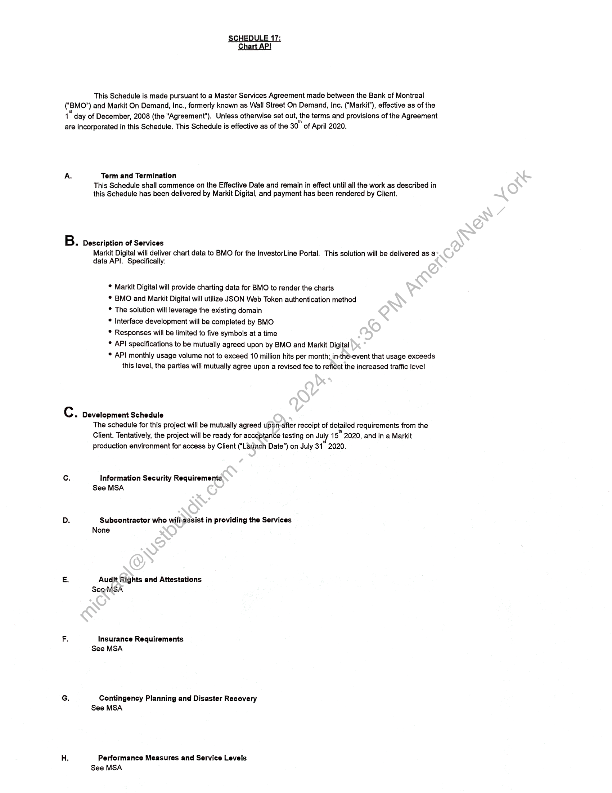
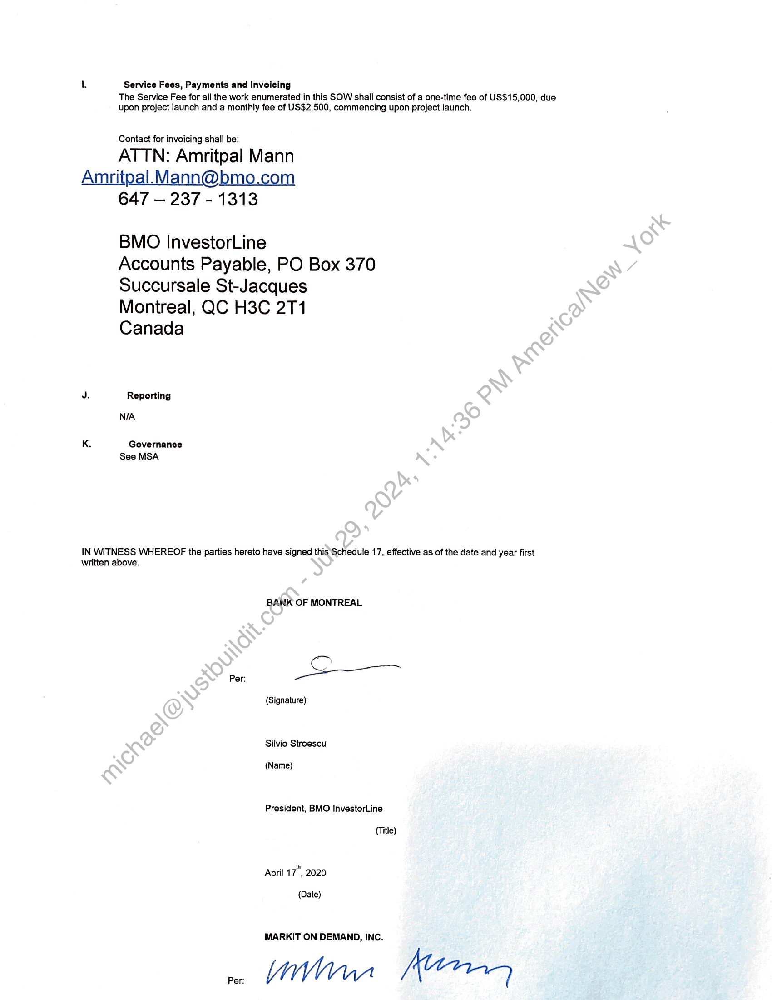

##### Schedule 17: Markit Digital Data API Services for BMO InvestorLine Portal]

  
````col
```col-md
flexGrow=.5
===
> [!info] [Page 1](_attachments/images_BMO-3.6.1.21.600221900.pdf_211025/page_1.png)
> 
```  
```col-md
This Schedule is made pursuant to a Master Services Agreement made between the Bank of Montreal
(‘BMO”) and Markit On Demand, Inc., formerly known as Wall Street On Demand, Inc. (“Markit’), effective as of the
" day of December, 2008 (the "Agreement"). Unless otherwise set out, the terms and provisions of the Agreement
are incorporated in this Schedule. This Schedule is effective as of the 30” of April 2020.  
A. Term and Termination
This Schedule shall commence on the Effective Date and remain in effect until all the work as described in
this Schedule has been delivered by Markit Digital, and payment has been rendered by Client.  
B. Description of Services
Markit Digital will deliver chart data to BMO for the InvestorLine Portal. This solution will be delivered as a
data API. Specifically:  
* Markit Digital will provide charting data for BMO to render the charts  
* BMO and Markit Digital will utilize JSON Web Token authentication method  
* The solution will leverage the existing domain  
* Interface development will be completed by BMO  
* Responses will be limited to five symbols at a time  
* API specifications to be mutually agreed upon by BMO and Markit Digital  
* API monthly usage volume not to exceed 10 million hits per month; inthé-event that usage exceeds
this level, the parties will mutually agree upon a revised fee to refléct the increased traffic level  
Cc » Development Schedule
The schedule for this project will be mutually agreed upon-after receipt of detailed requirements from the
Client. Tentatively, the project will be ready for acceptance testing on July 15" 2020, and in a Markit
production environment for access by Client (“Launch Date”) on July 31" 2020.  
Cc. Information Security Requirements
See MSA  
D. Subcontractor who wilhassist in providing the Services
None  
E. Audit Rights and Attestations
SeeMSA  
F. Insurance Requirements
See MSA  
G. Contingency Planning and Disaster Recovery
See MSA  
H. Performance Measures and Service Levels  
See MSA  
```
````
Notes:    
````col
```col-md
flexGrow=.5
===
> [!info] [Page 2](_attachments/images_BMO-3.6.1.21.600221900.pdf_211025/page_2.png)
> 
```  
```col-md
L Service Fees, Payments and Invoicing  
The Service Fee for all the work enumerated in this SOW shall consist of a one-time fee of US$15,000, due
upon project launch and a monthly fee of US$2,500, commencing upon project launch.  
Contact for invoicing shall be:  
ATTN: Amritpal Mann  
Amritpal.Mann@bmo.com
647 — 237 - 1313  
BMO InvestorLine  
Accounts Payable, PO Box 370
Succursale St-Jacques
Montreal, QC H3C 271  
Canada
J. Reporting
NIA
K. Governance
See MSA  
IN WITNESS WHEREOF the parties hereto have signed this Schedule 17, effective as of the date and year first
written above.  
BANK OF MONTREAL  
Per: Se  
(Signature)  
Silvio Stroescu  
(Name)  
President, BMO InvestorLine  
(Title)  
April 17”, 2020  
(Date)  
MARKIT ON DEMAND, INC.  
```
````
Notes:    
````col
```col-md
flexGrow=.5
===
> [!info] [Page 3](_attachments/images_BMO-3.6.1.21.600221900.pdf_211025/page_3.png)
> 
```  
```col-md
LLE.  
(Signature)  
(Name)  
CATHERIN.  
EAD OF MARKIT ON DEMANI  
Date)  
Ape | 22., 2020  
(Title)  
```
````
Notes:  


![[_attachments/BMO-3.6.1.21.6 00221900.pdf]